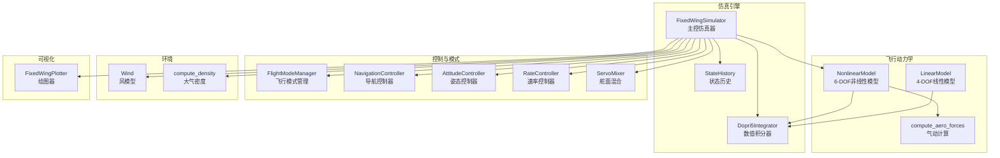
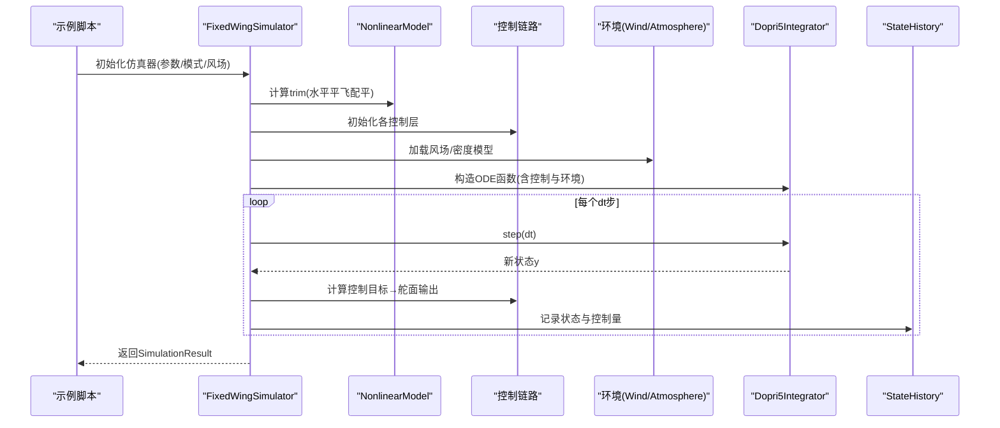
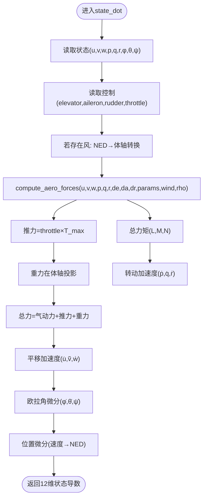
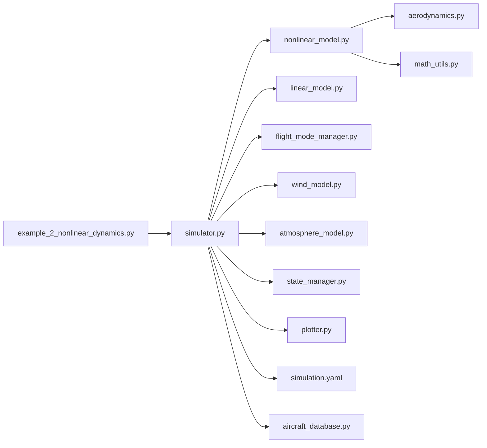

# 非线性动力学仿真

<cite>
**本文引用的文件列表**
- [examples/example_2_nonlinear_dynamics.py](file://examples/example_2_nonlinear_dynamics.py)
- [src/dynamics/nonlinear_model.py](file://src/dynamics/nonlinear_model.py)
- [src/dynamics/linear_model.py](file://src/dynamics/linear_model.py)
- [src/dynamics/aerodynamics.py](file://src/dynamics/aerodynamics.py)
- [src/simulation/simulator.py](file://src/simulation/simulator.py)
- [src/simulation/state_manager.py](file://src/simulation/state_manager.py)
- [src/utils/math_utils.py](file://src/utils/math_utils.py)
- [src/models/aircraft_database.py](file://src/models/aircraft_database.py)
- [config/simulation.yaml](file://config/simulation.yaml)
- [config/aircraft.yaml](file://config/aircraft.yaml)
- [src/visualization/plotter.py](file://src/visualization/plotter.py)
- [src/control/flight_mode_manager.py](file://src/control/flight_mode_manager.py)
</cite>

## 目录
1. [简介](#简介)
2. [项目结构](#项目结构)
3. [核心组件](#核心组件)
4. [架构总览](#架构总览)
5. [详细组件分析](#详细组件分析)
6. [依赖关系分析](#依赖关系分析)
7. [性能考量](#性能考量)
8. [故障排查指南](#故障排查指南)
9. [结论](#结论)
10. [附录](#附录)

## 简介
本文件面向非线性动力学仿真示例，系统阐述6自由度（6-DOF）非线性动力学模型的数学基础与物理原理，对比其与线性模型在仿真中的差异与优势；给出仿真初始化设置（初始条件、时间步长、仿真持续时间）的选择原则；提供仿真结果的分析方法（轨迹可视化与状态变量监控）、从仿真数据中识别非线性效应（如尾流干扰、气动非线性）的方法；说明后处理与数据导出格式；并给出不同飞行条件下的参数调整建议。

## 项目结构
该仿真框架采用模块化设计，围绕“飞行动力学建模—环境—控制—规划—仿真—可视化”六大模块协同工作：
- 飞行动力学：非线性6-DOF与线性4-DOF模型
- 环境：风场与大气密度模型
- 控制：ArduPilot兼容的五层控制链路（导航→姿态→速率→舵面混合→执行器）
- 规划：航路点管理与轨迹生成
- 仿真：数值积分器与状态历史记录
- 可视化：Matplotlib/Plotly图形输出

图表来源
- [src/simulation/simulator.py](file://src/simulation/simulator.py#L115-L642)
- [src/dynamics/nonlinear_model.py](file://src/dynamics/nonlinear_model.py#L104-L386)
- [src/dynamics/linear_model.py](file://src/dynamics/linear_model.py#L107-L319)
- [src/dynamics/aerodynamics.py](file://src/dynamics/aerodynamics.py#L35-L148)
- [src/control/flight_mode_manager.py](file://src/control/flight_mode_manager.py#L115-L298)
- [src/visualization/plotter.py](file://src/visualization/plotter.py#L19-L244)

章节来源
- [src/simulation/simulator.py](file://src/simulation/simulator.py#L1-L642)
- [src/dynamics/nonlinear_model.py](file://src/dynamics/nonlinear_model.py#L1-L386)
- [src/dynamics/linear_model.py](file://src/dynamics/linear_model.py#L1-L319)
- [src/dynamics/aerodynamics.py](file://src/dynamics/aerodynamics.py#L1-L148)
- [src/control/flight_mode_manager.py](file://src/control/flight_mode_manager.py#L1-L298)
- [src/visualization/plotter.py](file://src/visualization/plotter.py#L1-L244)

## 核心组件
- 非线性6-DOF模型：基于牛顿-欧拉方程与欧拉角微分关系，考虑气动力/力矩、推力与重力，支持开环脉冲与闭环控制。
- 线性4-DOF模型：纵向线性化状态空间，用于模态分析与开环响应。
- 飞行动力学子模块：气动力/力矩计算、角度换算、动态压强等。
- 仿真器：集成控制链路、环境、规划与数值积分，支持开环与闭环运行。
- 状态历史：高效记录仿真过程中的状态与控制量。
- 可视化：提供Matplotlib/Plotly的时域与轨迹图。

章节来源
- [src/dynamics/nonlinear_model.py](file://src/dynamics/nonlinear_model.py#L104-L386)
- [src/dynamics/linear_model.py](file://src/dynamics/linear_model.py#L107-L319)
- [src/dynamics/aerodynamics.py](file://src/dynamics/aerodynamics.py#L35-L148)
- [src/simulation/simulator.py](file://src/simulation/simulator.py#L115-L642)
- [src/simulation/state_manager.py](file://src/simulation/state_manager.py#L95-L193)
- [src/visualization/plotter.py](file://src/visualization/plotter.py#L19-L244)

## 架构总览
下图展示典型非线性仿真流程：从配置与参数加载，到非线性动力学求解、控制链路计算、状态记录与可视化输出。

图表来源
- [examples/example_2_nonlinear_dynamics.py](file://examples/example_2_nonlinear_dynamics.py#L130-L159)
- [src/simulation/simulator.py](file://src/simulation/simulator.py#L239-L567)
- [src/dynamics/nonlinear_model.py](file://src/dynamics/nonlinear_model.py#L160-L281)
- [src/simulation/state_manager.py](file://src/simulation/state_manager.py#L124-L174)

## 详细组件分析

### 非线性6-DOF动力学模型
- 状态向量（12维，NED坐标系）：[体轴速度u,v,w；机体角速度p,q,r；欧拉角φ,θ,ψ；位置x_N,x_E,x_D]。
- 动力学方程：
  - 平移：u̇, ṽ, ẇ由气动力、推力与重力决定，考虑科里奥利与惯性耦合。
  - 转动：ṗ, q̇, ṙ由气动力矩与惯性张量耦合项决定，使用惯性张量与交叉惯性项。
  - 欧拉角微分：通过3-2-1欧拉角速率映射。
  - 位置微分：速度由体轴转NED坐标系得到。
- 气动模型：基于迎角、侧滑角、非维度角速度，计算升阻与侧向/滚转/偏航力矩系数，再转换为力与力矩。
- 推力模型：简单比例模型，最大推力按升阻比折算。
- 风场：可选无风或NED风，转换至体轴以修正相对气流。
- 密度：按海拔高度计算，随高度变化。

图表来源
- [src/dynamics/nonlinear_model.py](file://src/dynamics/nonlinear_model.py#L160-L255)
- [src/dynamics/aerodynamics.py](file://src/dynamics/aerodynamics.py#L35-L148)
- [src/utils/math_utils.py](file://src/utils/math_utils.py#L43-L101)

章节来源
- [src/dynamics/nonlinear_model.py](file://src/dynamics/nonlinear_model.py#L104-L386)
- [src/dynamics/aerodynamics.py](file://src/dynamics/aerodynamics.py#L35-L148)
- [src/utils/math_utils.py](file://src/utils/math_utils.py#L43-L101)

### 线性4-DOF模型与对比
- 纵向线性化状态空间：[u_p, α, q, θ]，输入为[δ_T, δ_e]，构建A、B矩阵并进行模态分析（短周期、长周期/阻尼振荡、慢速阻尼）。
- 与非线性模型对比：
  - 线性模型忽略高阶非线性项，适合小扰动分析与控制器设计；
  - 非线性模型能捕捉大角度、尾流干扰、气动非线性等复杂现象，适合真实飞行场景验证。

章节来源
- [src/dynamics/linear_model.py](file://src/dynamics/linear_model.py#L107-L319)

### 仿真初始化设置
- 初始条件：通常从trim计算的水平平飞状态出发，初始角速度为零，初始姿态为平飞。
- 时间步长与持续时间：
  - 实时闭环仿真：dt=0.01s，duration根据任务需求设定；
  - 批处理分析：可使用更高精度积分器与更细步长，但需权衡性能。
- 风场与密度：可配置无风、固定风、正弦风等；密度随海拔变化。
- 飞行模式：支持STABILIZE、FBW_A/B、AUTO等，影响控制链路与目标生成。

章节来源
- [config/simulation.yaml](file://config/simulation.yaml#L1-L30)
- [src/simulation/simulator.py](file://src/simulation/simulator.py#L130-L234)
- [src/simulation/simulator.py](file://src/simulation/simulator.py#L270-L339)

### 仿真结果分析与后处理
- 结果容器：包含状态历史、trim信息、是否闭环等；提供摘要与可视化接口。
- 后处理：
  - 导出CSV：包含时间序列的状态与控制量，便于二次分析。
  - 可视化：提供Matplotlib/Plotly的时域图与3D轨迹图。
- 分析要点：
  - 角度与角速率：观察非线性导致的滚转/偏航耦合与大角度响应。
  - 速度与高度：闭环模式下应跟踪目标轨迹，观察稳态误差与超调。
  - 控制量：检查舵面偏转范围与饱和情况。

章节来源
- [src/simulation/simulator.py](file://src/simulation/simulator.py#L59-L110)
- [src/simulation/state_manager.py](file://src/simulation/state_manager.py#L179-L193)
- [src/visualization/plotter.py](file://src/visualization/plotter.py#L68-L154)

### 从仿真数据识别非线性效应
- 尾流干扰：在闭环跟踪时，若出现持续的横向偏差或偏航振荡，结合侧向速度与偏航角速率分析是否存在尾流影响。
- 气动非线性：观察大攻角/侧滑角下的升阻特性变化，以及滚转/偏航力矩的非线性耦合。
- 大角度响应：非线性模型在大角度时会表现出与线性模型显著不同的瞬态与稳态行为。

章节来源
- [src/dynamics/aerodynamics.py](file://src/dynamics/aerodynamics.py#L35-L148)
- [src/dynamics/nonlinear_model.py](file://src/dynamics/nonlinear_model.py#L160-L255)

### 不同飞行条件下的参数调整建议
- 低空/高密度：增大密度参数，适当提高推力以维持trim；注意气动系数随攻角变化。
- 高空/低密度：降低密度，可能需要提高空速或减小攻角以保持升力；TECS巡航油门需自适应更新。
- 风场变化：固定风/随机风下，需调整姿态/速率控制器增益，确保闭环稳定。
- 飞行模式切换：从STABILIZE到AUTO时，注意模式过渡逻辑与目标生成的平滑性。

章节来源
- [src/simulation/simulator.py](file://src/simulation/simulator.py#L275-L300)
- [src/simulation/simulator.py](file://src/simulation/simulator.py#L478-L498)
- [src/control/flight_mode_manager.py](file://src/control/flight_mode_manager.py#L115-L298)

## 依赖关系分析

图表来源
- [examples/example_2_nonlinear_dynamics.py](file://examples/example_2_nonlinear_dynamics.py#L34-L36)
- [src/simulation/simulator.py](file://src/simulation/simulator.py#L33-L52)
- [src/dynamics/nonlinear_model.py](file://src/dynamics/nonlinear_model.py#L27-L28)
- [src/dynamics/aerodynamics.py](file://src/dynamics/aerodynamics.py#L13)
- [src/utils/math_utils.py](file://src/utils/math_utils.py#L6)
- [src/simulation/state_manager.py](file://src/simulation/state_manager.py#L11-L13)
- [src/visualization/plotter.py](file://src/visualization/plotter.py#L9-L12)
- [config/simulation.yaml](file://config/simulation.yaml#L1-L30)
- [src/models/aircraft_database.py](file://src/models/aircraft_database.py#L12-L20)

章节来源
- [examples/example_2_nonlinear_dynamics.py](file://examples/example_2_nonlinear_dynamics.py#L34-L36)
- [src/simulation/simulator.py](file://src/simulation/simulator.py#L33-L52)

## 性能考量
- 数值积分：实时闭环使用dopri5；批处理分析可使用更高精度积分器，但需平衡稳定性与计算耗时。
- 内存与效率：StateHistory预分配数组，减少重复分配；仅记录必要变量。
- 控制链路：合理设置控制层采样与滤波参数，避免高频噪声放大。
- 参数规模：大型机群或多任务并行时，优先优化关键路径（气动计算、积分器、控制链路）。

## 故障排查指南
- 积分失败：检查初始条件与控制输入是否突变过大；适当减小步长或放宽容差。
- 非物理发散：检查气动系数与惯性参数是否合理；确认风场与密度模型正确。
- 数据缺失：确认StateHistory未溢出；检查record调用频率与保存路径权限。
- 可视化异常：确认Matplotlib/Plotly可用；检查历史字典键名一致性。

章节来源
- [src/simulation/simulator.py](file://src/simulation/simulator.py#L558-L562)
- [src/simulation/state_manager.py](file://src/simulation/state_manager.py#L134-L136)
- [src/visualization/plotter.py](file://src/visualization/plotter.py#L186-L195)

## 结论
本项目提供了完整的6-DOF非线性动力学仿真框架，支持从参数配置、非线性求解、控制闭环到结果可视化与后处理的全流程。通过与线性模型对比，可有效识别非线性效应；通过合理的初始化与参数调整，可在不同飞行条件下获得稳定可靠的仿真结果。

## 附录
- 示例脚本：示例2展示了非线性开环脉冲与闭环PID对比，输出CSV与PNG图像。
- 配置文件：simulation.yaml定义仿真步长、持续时间、风场与日志；aircraft.yaml选择机型与参数覆盖。

章节来源
- [examples/example_2_nonlinear_dynamics.py](file://examples/example_2_nonlinear_dynamics.py#L1-L215)
- [config/simulation.yaml](file://config/simulation.yaml#L1-L30)
- [config/aircraft.yaml](file://config/aircraft.yaml#L1-L13)