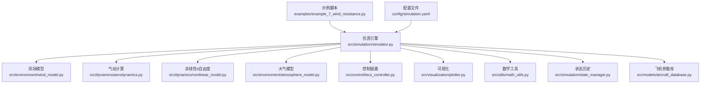
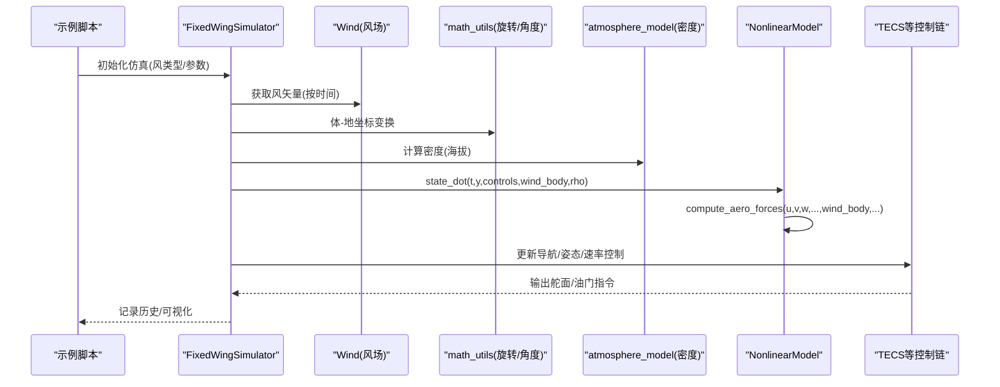
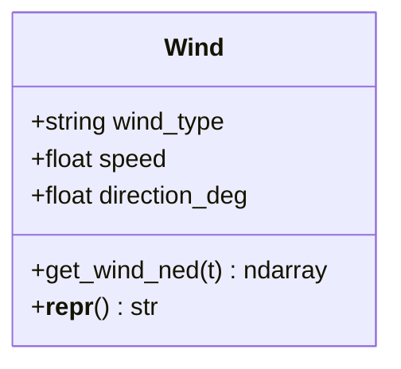
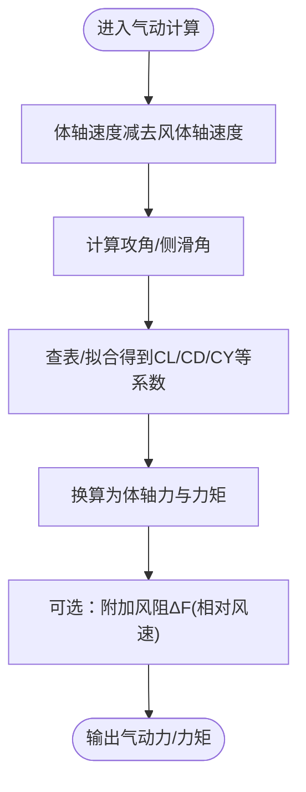
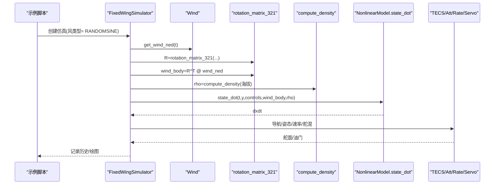
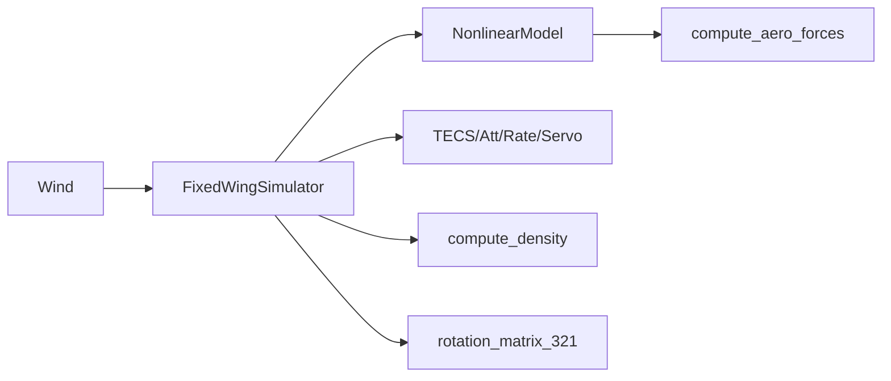

# 风阻影响分析

<cite>
**本文引用的文件**
- [examples/example_7_wind_resistance.py](file://examples/example_7_wind_resistance.py)
- [src/environment/wind_model.py](file://src/environment/wind_model.py)
- [src/environment/aerodynamic_forces.py](file://src/environment/aerodynamic_forces.py)
- [src/dynamics/aerodynamics.py](file://src/dynamics/aerodynamics.py)
- [src/dynamics/nonlinear_model.py](file://src/dynamics/nonlinear_model.py)
- [src/simulation/simulator.py](file://src/simulation/simulator.py)
- [src/models/aircraft_database.py](file://src/models/aircraft_database.py)
- [config/simulation.yaml](file://config/simulation.yaml)
- [src/utils/math_utils.py](file://src/utils/math_utils.py)
- [src/environment/atmosphere_model.py](file://src/environment/atmosphere_model.py)
- [src/visualization/plotter.py](file://src/visualization/plotter.py)
- [src/simulation/state_manager.py](file://src/simulation/state_manager.py)
</cite>

## 目录
1. [引言](#引言)
2. [项目结构](#项目结构)
3. [核心组件](#核心组件)
4. [架构总览](#架构总览)
5. [详细组件分析](#详细组件分析)
6. [依赖关系分析](#依赖关系分析)
7. [性能考量](#性能考量)
8. [故障排查指南](#故障排查指南)
9. [结论](#结论)
10. [附录](#附录)

## 引言
本文件围绕“风阻影响分析”示例，系统阐述风场建模的基本原理与实现方法，解释顺风、逆风、侧风等典型风况对飞行器性能的影响，并给出风阻对飞行轨迹、燃油消耗与飞行时间的量化分析路径与数据处理技术。同时，提供风场参数设置方法（风速、风向、湍流强度）、仿真中真实风场条件的模拟流程，以及在不同风况下可采取的飞行策略调整建议与应对措施。

## 项目结构
该示例位于 examples 目录中的 example_7_wind_resistance.py，通过 FixedWingSimulator 主引擎驱动，结合环境模块（风场与大气模型）、动力学模块（非线性6自由度与气动计算）、控制模块（TECS等）与可视化模块完成闭环仿真与结果展示。

图示来源
- [examples/example_7_wind_resistance.py](file://examples/example_7_wind_resistance.py#L1-L52)
- [src/simulation/simulator.py](file://src/simulation/simulator.py#L1-L642)
- [src/environment/wind_model.py](file://src/environment/wind_model.py#L1-L113)
- [src/dynamics/aerodynamics.py](file://src/dynamics/aerodynamics.py#L1-L148)
- [src/dynamics/nonlinear_model.py](file://src/dynamics/nonlinear_model.py#L1-L200)
- [src/environment/atmosphere_model.py](file://src/environment/atmosphere_model.py#L1-L77)
- [src/visualization/plotter.py](file://src/visualization/plotter.py#L1-L200)
- [src/utils/math_utils.py](file://src/utils/math_utils.py#L1-L124)
- [src/simulation/state_manager.py](file://src/simulation/state_manager.py#L1-L193)
- [src/models/aircraft_database.py](file://src/models/aircraft_database.py#L1-L183)
- [config/simulation.yaml](file://config/simulation.yaml#L1-L30)

章节来源
- [examples/example_7_wind_resistance.py](file://examples/example_7_wind_resistance.py#L1-L52)
- [config/simulation.yaml](file://config/simulation.yaml#L1-L30)

## 核心组件
- 风场模型 Wind：支持无风、定常风、正弦叠加风、随机正弦风（湍流样态），提供按时间返回 NED 风速向量的能力。
- 气动阻力增量计算 compute_wind_drag_forces：基于相对风速估算风引起的附加阻力，适用于扰动/灵敏度分析。
- 非线性6自由度模型 NonlinearModel：集成气动计算与控制输入，输出完整的12维状态导数。
- 气动计算 compute_aero_forces：在减去风速后计算攻角、侧滑角与升阻力矩系数，再换算为体轴力与力矩。
- 大气模型 compute_density：随海拔变化的密度计算，用于动态压强与气动参数修正。
- 仿真引擎 FixedWingSimulator：组织各模块，构建ODE函数，驱动数值积分，记录状态历史，支持闭环控制与轨迹跟踪。
- 可视化与数据：提供Matplotlib/Plotly图形输出与CSV导出能力。

章节来源
- [src/environment/wind_model.py](file://src/environment/wind_model.py#L1-L113)
- [src/environment/aerodynamic_forces.py](file://src/environment/aerodynamic_forces.py#L1-L54)
- [src/dynamics/nonlinear_model.py](file://src/dynamics/nonlinear_model.py#L1-L200)
- [src/dynamics/aerodynamics.py](file://src/dynamics/aerodynamics.py#L1-L148)
- [src/environment/atmosphere_model.py](file://src/environment/atmosphere_model.py#L1-L77)
- [src/simulation/simulator.py](file://src/simulation/simulator.py#L1-L642)
- [src/visualization/plotter.py](file://src/visualization/plotter.py#L1-L200)
- [src/simulation/state_manager.py](file://src/simulation/state_manager.py#L1-L193)

## 架构总览
下图展示了从风场到气动、再到动力学与控制的整体流程，以及闭环控制链路如何在每个时间步更新控制指令并反馈至动力学。

图示来源
- [src/simulation/simulator.py](file://src/simulation/simulator.py#L329-L338)
- [src/environment/wind_model.py](file://src/environment/wind_model.py#L76-L108)
- [src/utils/math_utils.py](file://src/utils/math_utils.py#L43-L76)
- [src/environment/atmosphere_model.py](file://src/environment/atmosphere_model.py#L48-L52)
- [src/dynamics/aerodynamics.py](file://src/dynamics/aerodynamics.py#L68-L77)
- [src/dynamics/nonlinear_model.py](file://src/dynamics/nonlinear_model.py#L160-L182)

## 详细组件分析

### 风场建模与参数设置
- 支持类型
  - NONE：无风
  - FIXED：定常风（NED方向与速度）
  - SINE：多分量正弦叠加（慢湍流频段）
  - RANDOMSINE：均值+随机振幅的正弦叠加（更接近真实湍流）
- 关键参数
  - 风速 speed（m/s）
  - 风向 direction_deg（风从某方向吹来，0°=北）
  - 时间步长 dt、总时长 duration、积分器选择
- 配置入口
  - 示例脚本直接传入 wind_type 等参数
  - 或通过 config/simulation.yaml 的 wind_* 字段覆盖

图示来源
- [src/environment/wind_model.py](file://src/environment/wind_model.py#L18-L113)

章节来源
- [src/environment/wind_model.py](file://src/environment/wind_model.py#L1-L113)
- [config/simulation.yaml](file://config/simulation.yaml#L22-L25)
- [examples/example_7_wind_resistance.py](file://examples/example_7_wind_resistance.py#L20-L28)

### 风阻对气动与轨迹的影响
- 相对风速与附加阻力
  - 在气动计算中，先用体轴速度减去风体轴速度得到相对风速，再计算攻角、侧滑角与升阻系数，最终得到气动力与力矩。
  - 若仅关注风引起的附加阻力增量，可使用 compute_wind_drag_forces 基于相对风速估算 ΔF。
- 对轨迹与性能的影响
  - 顺风：相对风速降低，升阻比改善，空速/地速提升，航程效率提高；但航迹偏移可能更大。
  - 逆风：相对风速增大，升阻比下降，需要更大推力维持速度，燃油消耗增加，飞行时间延长。
  - 侧风：产生侧向力与偏航力矩，导致偏航与侧滑，需要额外副翼/方向舵补偿，增加能耗与轨迹偏差。
- 数据处理建议
  - 记录空速、地速、航迹角、侧偏角、油门/功率、高度与轨迹坐标，用于对比不同风况下的性能差异。

图示来源
- [src/dynamics/aerodynamics.py](file://src/dynamics/aerodynamics.py#L68-L146)
- [src/environment/aerodynamic_forces.py](file://src/environment/aerodynamic_forces.py#L13-L53)

章节来源
- [src/dynamics/aerodynamics.py](file://src/dynamics/aerodynamics.py#L1-L148)
- [src/environment/aerodynamic_forces.py](file://src/environment/aerodynamic_forces.py#L1-L54)

### 仿真运行与闭环控制
- 固定风场下的闭环仿真
  - 示例脚本以 RANDOMSINE 风为例，使用 FBW_B 模式进行高度+速度保持，验证控制系统在扰动下的抑制能力。
  - 仿真主循环内，每步读取风矢量，转换到体轴，计算密度，求解状态导数，更新控制链路，记录历史。
- 关键流程
  - 风场生成 → 体-地坐标变换 → 密度计算 → 非线性动力学 → 控制器输出 → 记录与可视化

图示来源
- [examples/example_7_wind_resistance.py](file://examples/example_7_wind_resistance.py#L20-L36)
- [src/simulation/simulator.py](file://src/simulation/simulator.py#L329-L521)
- [src/utils/math_utils.py](file://src/utils/math_utils.py#L43-L76)
- [src/environment/atmosphere_model.py](file://src/environment/atmosphere_model.py#L48-L52)
- [src/dynamics/nonlinear_model.py](file://src/dynamics/nonlinear_model.py#L160-L182)

章节来源
- [examples/example_7_wind_resistance.py](file://examples/example_7_wind_resistance.py#L1-L52)
- [src/simulation/simulator.py](file://src/simulation/simulator.py#L239-L567)

### 风阻量化分析与数据处理
- 量化指标
  - 空速/地速差值、航迹角偏差、侧偏角、油门/功率曲线、高度波动、轨迹偏离。
- 数据处理技术
  - 使用 StateHistory 记录关键变量，导出为字典/CSV，便于后续统计与绘图。
  - 可计算平均/方差、峰值/谷值、持续时间等统计特征，比较不同风况下的差异。
- 可视化
  - 提供Matplotlib/Plotly双通道输出，支持2D/3D轨迹、时序响应等。

章节来源
- [src/simulation/state_manager.py](file://src/simulation/state_manager.py#L95-L193)
- [src/visualization/plotter.py](file://src/visualization/plotter.py#L161-L200)

### 不同风况下的飞行策略与应对措施
- 顺风
  - 策略：在保证安全的前提下适当降低高度或放宽航迹约束，利用自然加速提升地速。
  - 注意：仍需监控侧偏与滚转稳定性，避免因升力不足导致高度下降。
- 逆风
  - 策略：提高巡航推力/功率，必要时降低高度以提升空速；优化航路以减少折返。
  - 注意：防止失速裕度不足，确保升力足够。
- 侧风
  - 策略：提前引入坡度与偏航补偿，采用侧滑修正与方向舵配平，必要时采用之字航线降低侧风影响。
  - 注意：避免过度滚转导致载荷因子过大与结构风险。

## 依赖关系分析
- 组件耦合
  - Wind 与 Simulator：Wind 由 Simulator 在每步查询，作为外部扰动输入。
  - Simulator 与 NonlinearModel：通过 state_dot 接口耦合，传递 wind_body 与 rho。
  - NonlinearModel 与 Aerodynamics：compute_aero_forces 依赖 wind_body 进行相对风速修正。
  - Simulator 与 Control：控制链路输出舵面/油门，反馈到动力学。
- 外部依赖
  - NumPy、SciPy（积分器）、Matplotlib/Plotly（可视化）。

图示来源
- [src/simulation/simulator.py](file://src/simulation/simulator.py#L329-L338)
- [src/dynamics/aerodynamics.py](file://src/dynamics/aerodynamics.py#L68-L77)
- [src/dynamics/nonlinear_model.py](file://src/dynamics/nonlinear_model.py#L160-L182)
- [src/environment/atmosphere_model.py](file://src/environment/atmosphere_model.py#L48-L52)
- [src/utils/math_utils.py](file://src/utils/math_utils.py#L43-L76)

章节来源
- [src/simulation/simulator.py](file://src/simulation/simulator.py#L1-L642)
- [src/dynamics/aerodynamics.py](file://src/dynamics/aerodynamics.py#L1-L148)
- [src/dynamics/nonlinear_model.py](file://src/dynamics/nonlinear_model.py#L1-L200)

## 性能考量
- 数值积分
  - 示例使用 dopri5（变步长）积分器，兼顾精度与实时性；对于强湍流风，可考虑更短 dt 与更高容差。
- 计算复杂度
  - 气动计算与控制链路在每步执行，建议在长时间仿真中关注 CPU 占用，必要时降低采样频率或简化模型。
- 风场生成
  - RANDOMSINE 需要随机种子与预设频率/相位，确保可复现实验结果。

## 故障排查指南
- 集成错误
  - 若出现积分器报错，检查初始条件、控制指令范围与风场突变是否过大。
- 参数不一致
  - 确认 wind_type 与 wind_speed/方向在配置文件与构造函数中一致。
- 结果异常
  - 检查 wind_body 是否正确由 NED 转换到体轴；确认密度随海拔变化是否合理。

章节来源
- [src/simulation/simulator.py](file://src/simulation/simulator.py#L558-L562)
- [src/utils/math_utils.py](file://src/utils/math_utils.py#L43-L76)
- [src/environment/atmosphere_model.py](file://src/environment/atmosphere_model.py#L48-L52)

## 结论
本示例完整演示了在固定翼仿真框架下引入风场扰动的方法，涵盖风场建模、气动修正、非线性动力学、闭环控制与结果可视化。通过对比不同风况下的轨迹、空速/地速、油门与高度变化，可以有效评估风阻对飞行性能的影响，并据此制定相应的飞行策略与控制参数调整方案。

## 附录
- 风场参数设置清单
  - 风类型：NONE / FIXED / SINE / RANDOMSINE
  - 风速：单位 m/s
  - 风向：风来自某方向（0°=北，90°=东）
  - 湍流强度：通过 RANDOMSINE 的均值与振幅分布近似
- 飞机参数来源
  - 所有飞机参数来自 aircraft_database，包含几何、气动与惯性参数，用于气动与动力学计算。

章节来源
- [config/simulation.yaml](file://config/simulation.yaml#L22-L25)
- [src/models/aircraft_database.py](file://src/models/aircraft_database.py#L1-L183)