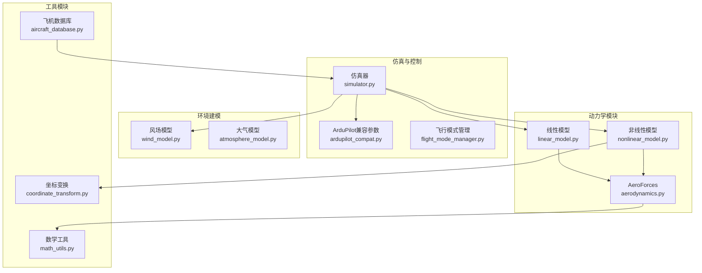
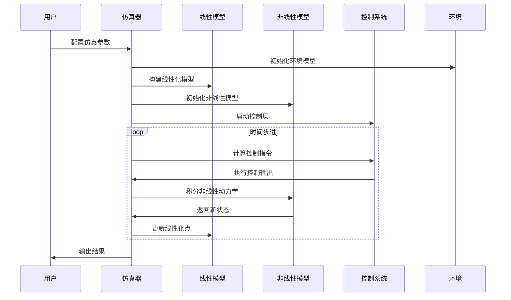
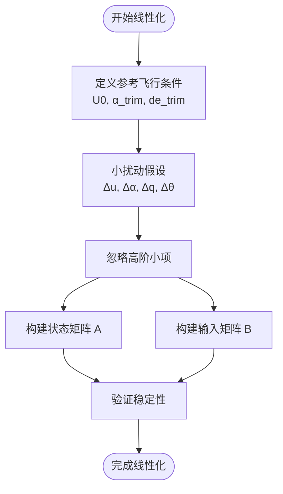
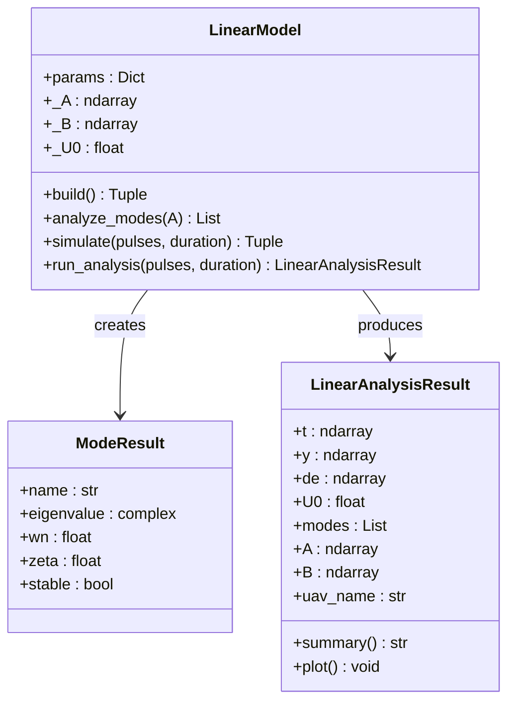
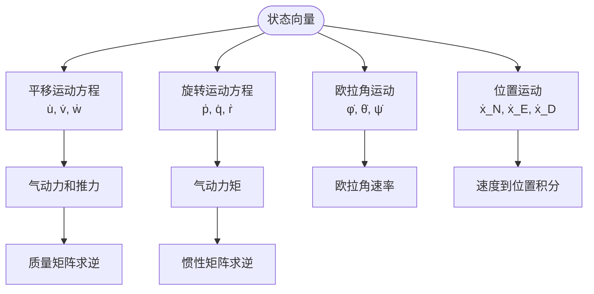
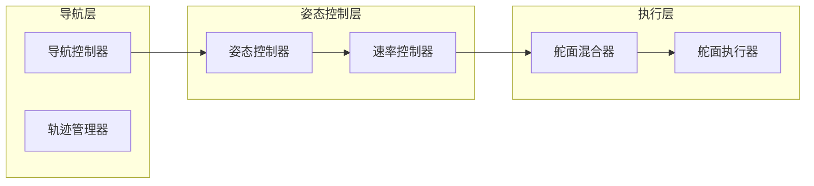
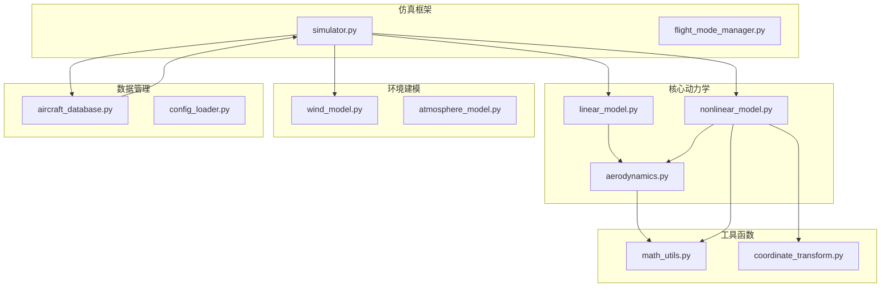

# 4自由度线性化动力学模型

<cite>
**本文档引用的文件**
- [linear_model.py](file://src/dynamics/linear_model.py)
- [nonlinear_model.py](file://src/dynamics/nonlinear_model.py)
- [aerodynamics.py](file://src/dynamics/aerodynamics.py)
- [coordinate_transform.py](file://src/dynamics/coordinate_transform.py)
- [aircraft_database.py](file://src/models/aircraft_database.py)
- [math_utils.py](file://src/utils/math_utils.py)
- [example_1_linear_response.py](file://examples/example_1_linear_response.py)
- [example_2_nonlinear_dynamics.py](file://examples/example_2_nonlinear_dynamics.py)
- [simulator.py](file://src/simulation/simulator.py)
- [ardupilot_compat.py](file://src/control/ardupilot_compat.py)
- [wind_model.py](file://src/environment/wind_model.py)
</cite>

## 目录
1. [引言](#引言)
2. [项目结构](#项目结构)
3. [核心组件](#核心组件)
4. [架构概览](#架构概览)
5. [详细组件分析](#详细组件分析)
6. [依赖关系分析](#依赖关系分析)
7. [性能考虑](#性能考虑)
8. [故障排除指南](#故障排除指南)
9. [结论](#结论)
10. [附录](#附录)

## 引言

本项目实现了固定翼无人机的4自由度线性化动力学模型，这是现代飞行器控制系统设计的基础。该模型通过小扰动假设和定常飞行条件，将复杂的6自由度非线性动力学简化为可分析的线性系统。

线性化模型特别适用于：
- 飞行包线内的短期瞬态响应分析
- 控制器设计和参数调节
- 稳定性分析和模态识别
- 系统辨识和参数估计

## 项目结构

项目采用模块化架构，主要分为以下几个核心模块：



**图表来源**
- [linear_model.py](file://src/dynamics/linear_model.py#L107-L319)
- [nonlinear_model.py](file://src/dynamics/nonlinear_model.py#L104-L386)
- [simulator.py](file://src/simulation/simulator.py#L115-L200)

**章节来源**
- [linear_model.py](file://src/dynamics/linear_model.py#L1-L319)
- [nonlinear_model.py](file://src/dynamics/nonlinear_model.py#L1-L386)
- [simulator.py](file://src/simulation/simulator.py#L1-L200)

## 核心组件

### 线性化4自由度模型

线性化模型专注于纵向运动，使用状态向量 [u_p, α, q, θ]，其中：
- u_p：前进速度扰动（归一化）
- α：攻角扰动（弧度）
- q：俯仰角速度（rad/s）
- θ：俯仰角扰动（弧度）

控制输入向量 [δ_T, δ_e]，其中：
- δ_T：油门扰动（无量纲）
- δ_e：升降舵偏转（弧度）

### 非线性6自由度模型

完整的非线性模型包含所有6个自由度：
- 位置：[u, v, w]（体轴速度）
- 角速度：[p, q, r]（体轴角速率）
- 姿态：[φ, θ, ψ]（欧拉角）
- 位置：[x_N, x_E, x_D]（NED坐标）

**章节来源**
- [linear_model.py](file://src/dynamics/linear_model.py#L4-L16)
- [nonlinear_model.py](file://src/dynamics/nonlinear_model.py#L4-L20)

## 架构概览

系统采用分层架构，从底层物理建模到高层控制决策：



**图表来源**
- [simulator.py](file://src/simulation/simulator.py#L239-L400)
- [linear_model.py](file://src/dynamics/linear_model.py#L129-L200)
- [nonlinear_model.py](file://src/dynamics/nonlinear_model.py#L160-L256)

## 详细组件分析

### 线性化模型实现

#### 数学变换过程

线性化过程基于以下假设：
1. **小扰动假设**：所有状态变量和输入都围绕定常飞行条件的小扰动
2. **定常飞行条件**：忽略重力项的平衡状态
3. **线性化近似**：保留一阶导数项，忽略高阶项



**图表来源**
- [linear_model.py](file://src/dynamics/linear_model.py#L129-L200)

#### 状态空间表示

线性化后的状态空间形式为：
```
ẏ = A·y + B·u
```

其中矩阵A和B的构建涉及多个气动导数：

**章节来源**
- [linear_model.py](file://src/dynamics/linear_model.py#L129-L200)

### 模态分析功能

线性模型提供了完整的模态分析能力：



**图表来源**
- [linear_model.py](file://src/dynamics/linear_model.py#L107-L319)

#### 飞行模式识别

模态分析能够识别三种主要的纵向飞行模式：

1. **短周期模式（Short Period）**：快速阻尼振荡
   - 特征：高频率、低阻尼比
   - 主要涉及攻角和俯仰角的变化

2. **长周期模式（Phugoid）**：缓慢的能量交换
   - 特征：低频率、高振荡周期
   - 主要涉及空速和高度的耦合变化

3. **渐近模式（Subsidence）**：纯衰减项
   - 特征：无振荡的指数衰减
   - 主要涉及航向角的变化

**章节来源**
- [linear_model.py](file://src/dynamics/linear_model.py#L206-L252)

### 非线性动力学模型

#### 6自由度方程组

非线性模型实现了完整的6自由度方程组：



**图表来源**
- [nonlinear_model.py](file://src/dynamics/nonlinear_model.py#L160-L256)

#### 气动计算模块

气动力和力矩的计算基于标准的气动导数模型：

**章节来源**
- [nonlinear_model.py](file://src/dynamics/nonlinear_model.py#L160-L256)
- [aerodynamics.py](file://src/dynamics/aerodynamics.py#L35-L148)

### 仿真与控制集成

#### ArduPilot兼容控制

系统集成了完整的ArduPilot控制链路：



**图表来源**
- [simulator.py](file://src/simulation/simulator.py#L214-L217)
- [ardupilot_compat.py](file://src/control/ardupilot_compat.py#L17-L130)

**章节来源**
- [simulator.py](file://src/simulation/simulator.py#L214-L217)
- [ardupilot_compat.py](file://src/control/ardupilot_compat.py#L1-L130)

## 依赖关系分析

### 模块间依赖关系



**图表来源**
- [linear_model.py](file://src/dynamics/linear_model.py#L18-L21)
- [nonlinear_model.py](file://src/dynamics/nonlinear_model.py#L22-L29)
- [simulator.py](file://src/simulation/simulator.py#L33-L53)

### 外部依赖

系统的主要外部依赖包括：
- **NumPy**: 数值计算基础
- **SciPy**: 科学计算和ODE求解
- **Matplotlib**: 结果可视化
- **PyYAML**: 参数配置加载

**章节来源**
- [linear_model.py](file://src/dynamics/linear_model.py#L18-L21)
- [nonlinear_model.py](file://src/dynamics/nonlinear_model.py#L22-L29)

## 性能考虑

### 计算效率优化

1. **矩阵求逆优化**: 使用数值稳定的求解器替代直接矩阵求逆
2. **预计算常量**: 将不随时间变化的参数预先计算
3. **向量化操作**: 利用NumPy的向量化特性提高计算效率

### 数值稳定性

1. **病态矩阵处理**: 对接近奇异的矩阵使用正则化技术
2. **浮点精度控制**: 合理设置相对和绝对容差
3. **数值范围检查**: 防止除零和溢出错误

## 故障排除指南

### 常见问题诊断

#### 线性化模型不稳定

**症状**: 模态分析显示负实部的特征值
**可能原因**:
- 飞行条件超出线性化范围
- 参数设置不合理
- 数值计算误差累积

**解决方案**:
1. 检查飞行速度是否在设计范围内
2. 验证气动导数的合理性
3. 调整数值求解器的容差设置

#### 仿真发散

**症状**: 非线性仿真结果发散或出现异常振荡
**可能原因**:
- 时间步长过大
- 控制参数设置不当
- 环境条件过于复杂

**解决方案**:
1. 减小仿真时间步长
2. 检查控制参数的物理意义
3. 简化环境条件进行调试

**章节来源**
- [linear_model.py](file://src/dynamics/linear_model.py#L206-L252)
- [simulator.py](file://src/simulation/simulator.py#L239-L400)

## 结论

本项目的4自由度线性化动力学模型为固定翼无人机控制系统设计提供了坚实的理论基础和技术支撑。通过精确的数学建模和高效的数值实现，系统能够在保证计算效率的同时提供准确的动态响应预测。

主要优势包括：
- **理论完备性**: 基于严格的线性化理论
- **实用性**: 直接支持控制器设计和分析
- **扩展性**: 易于与其他模块集成
- **验证性**: 提供完整的开环和闭环仿真能力

该模型特别适用于飞行器设计的早期阶段，为控制系统参数调节和稳定性分析提供了可靠的工具。

## 附录

### 使用示例

#### 线性模型分析示例

```python
# 获取飞机参数
params = get_aircraft_params("TB2")
model = LinearModel(params)

# 定义脉冲输入
pulses = [{"start_time": 1.0, "duration": 0.5, "angle_deg": 2.0}]

# 运行分析
result = model.run_analysis(pulses, duration=10.0, uav_name="TB2")
print(result.summary())
```

#### 非线性模型对比示例

```python
# 非线性模型
nl_params = get_aircraft_params("Predator")
nl_model = NonlinearModel(nl_params)
trim = nl_model.compute_trim()

# 开环仿真
pulses_ol = [{"start_time": 2.0, "duration": 0.5, "roll_deg": 5.0}]
result_ol = nl_model.simulate(pulses_ol, duration=15.0)
```

### 参数说明

#### 飞机参数数据库

系统支持多种固定翼无人机的参数配置，包括TB2、Anka、Aksungur等型号。每个型号包含完整的几何、气动和惯性参数。

#### 控制参数配置

ArduPilot兼容的参数配置支持多种控制模式，包括：
- **STABILIZE**: 姿态稳定模式
- **FBW_A/B**: 直接飞控模式
- **AUTO**: 自动导航模式

**章节来源**
- [aircraft_database.py](file://src/models/aircraft_database.py#L29-L133)
- [ardupilot_compat.py](file://src/control/ardupilot_compat.py#L17-L130)