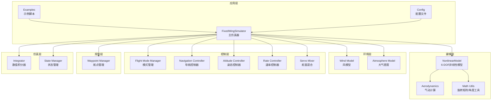
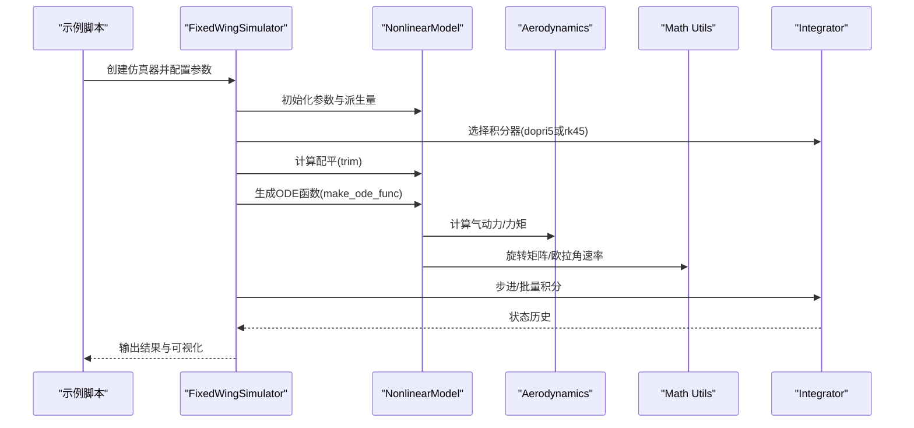
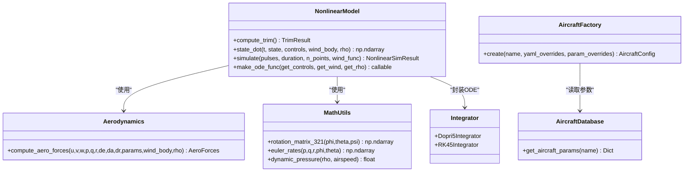

# 6自由度非线性动力学模型

<cite>
**本文档引用的文件**
- [src/dynamics/nonlinear_model.py](file://src/dynamics/nonlinear_model.py)
- [src/dynamics/aerodynamics.py](file://src/dynamics/aerodynamics.py)
- [src/utils/math_utils.py](file://src/utils/math_utils.py)
- [src/simulation/integrator.py](file://src/simulation/integrator.py)
- [src/models/aircraft_database.py](file://src/models/aircraft_database.py)
- [src/models/aircraft_factory.py](file://src/models/aircraft_factory.py)
- [examples/example_2_nonlinear_dynamics.py](file://examples/example_2_nonlinear_dynamics.py)
- [examples/example_4_wind_resistance.py](file://examples/example_4_wind_resistance.py)
- [config/aircraft.yaml](file://config/aircraft.yaml)
- [config/simulation.yaml](file://config/simulation.yaml)
</cite>

## 目录
1. [简介](#简介)
2. [项目结构](#项目结构)
3. [核心组件](#核心组件)
4. [架构总览](#架构总览)
5. [详细组件分析](#详细组件分析)
6. [依赖关系分析](#依赖关系分析)
7. [性能考虑](#性能考虑)
8. [故障排除指南](#故障排除指南)
9. [结论](#结论)
10. [附录](#附录)

## 简介
本文件针对固定翼无人机的6自由度（6 DOF）非线性动力学模型进行系统化技术说明，覆盖以下要点：
- 12维状态向量的物理含义与坐标系约定（速度分量(u,v,w)、角速度分量(p,q,r)、欧拉角(φ,θ,ψ)、位置(x_N,x_E,x_D)，均采用NED坐标系）
- 平移运动方程与旋转运动方程的数学来源与实现细节
- 质量矩阵与惯性张量在旋转动力学中的作用与耦合效应
- 控制输入（升降舵、副翼、方向舵、油门）对系统动态响应的影响
- 数值积分方法的选择依据与稳定性分析
- 典型飞行状态下的仿真示例与参数敏感性分析思路

## 项目结构
该仓库采用模块化设计，围绕“建模-环境-控制-规划-仿真-可视化”分层组织：
- 动力学层：非线性6自由度模型、气动计算、数学工具
- 环境层：风模型、大气密度模型
- 控制层：ArduPilot兼容控制链（模式管理、导航、姿态/速率控制、舵混合）
- 规划层：轨迹与航点管理
- 仿真层：数值积分器、状态管理、历史记录
- 示例与配置：示例脚本、参数配置文件

图表来源
- [src/dynamics/nonlinear_model.py](file://src/dynamics/nonlinear_model.py#L104-L386)
- [src/dynamics/aerodynamics.py](file://src/dynamics/aerodynamics.py#L35-L148)
- [src/utils/math_utils.py](file://src/utils/math_utils.py#L43-L124)
- [src/simulation/integrator.py](file://src/simulation/integrator.py#L17-L108)
- [src/simulation/simulator.py](file://src/simulation/simulator.py#L115-L200)

章节来源
- [src/dynamics/nonlinear_model.py](file://src/dynamics/nonlinear_model.py#L1-L386)
- [src/dynamics/aerodynamics.py](file://src/dynamics/aerodynamics.py#L1-L148)
- [src/utils/math_utils.py](file://src/utils/math_utils.py#L1-L124)
- [src/simulation/integrator.py](file://src/simulation/integrator.py#L1-L108)
- [src/simulation/simulator.py](file://src/simulation/simulator.py#L1-L200)

## 核心组件
- 非线性6自由度模型：提供平移与旋转微分方程、配平求解、开环仿真接口
- 气动计算模块：基于标准体轴气动模型，计算升阻与力矩系数及对应力/力矩
- 数学工具：3-2-1欧拉角旋转矩阵、欧拉角速率转换、攻角/侧滑角、动压等
- 数值积分器：dopri5（实时步进）与RK45（批量求解）
- 飞机参数数据库与工厂：统一加载、合并与导出参数
- 主仿真器：整合各模块，支持开环/闭环运行与可视化

章节来源
- [src/dynamics/nonlinear_model.py](file://src/dynamics/nonlinear_model.py#L104-L386)
- [src/dynamics/aerodynamics.py](file://src/dynamics/aerodynamics.py#L35-L148)
- [src/utils/math_utils.py](file://src/utils/math_utils.py#L43-L124)
- [src/simulation/integrator.py](file://src/simulation/integrator.py#L17-L108)
- [src/models/aircraft_database.py](file://src/models/aircraft_database.py#L143-L166)
- [src/models/aircraft_factory.py](file://src/models/aircraft_factory.py#L39-L75)

## 架构总览
下图展示6自由度非线性模型在仿真框架中的调用关系与数据流。

图表来源
- [src/simulation/simulator.py](file://src/simulation/simulator.py#L115-L200)
- [src/dynamics/nonlinear_model.py](file://src/dynamics/nonlinear_model.py#L261-L281)
- [src/dynamics/aerodynamics.py](file://src/dynamics/aerodynamics.py#L35-L148)
- [src/utils/math_utils.py](file://src/utils/math_utils.py#L43-L101)
- [src/simulation/integrator.py](file://src/simulation/integrator.py#L17-L108)

## 详细组件分析

### 12维状态向量与坐标系约定
- 状态定义（12维，NED坐标系）：
  - 速度：u（北向）、v（东向）、w（天向）
  - 角速度：p（滚转速率）、q（俯仰速率）、r（偏航速率）
  - 欧拉角：φ（滚转）、θ（俯仰）、ψ（偏航）
  - 位置：x_N（北向）、x_E（东向）、x_D（下向，正向下）
- 坐标系约定：
  - NED（北-东-下）地理坐标系
  - 体轴（x,y,z）与3-2-1欧拉角顺序一致
  - 速度与角速度以体轴为基准，力与力矩亦在体轴

章节来源
- [src/dynamics/nonlinear_model.py](file://src/dynamics/nonlinear_model.py#L4-L20)
- [src/utils/math_utils.py](file://src/utils/math_utils.py#L43-L77)

### 平移运动方程（体轴加速度）
- 方程形式：\[
\dot{\mathbf{V}}_b = \mathbf{g}_{ext} + \frac{1}{m}(\mathbf{F}_{aero} + \mathbf{T})
\]
其中：
- \(\mathbf{V}_b = [u, v, w]^T\) 为体轴速度
- \(\mathbf{g}_{ext}\) 为重力在体轴的投影
- \(\mathbf{F}_{aero}\) 为气动力，\(\mathbf{T}\) 为推力
- 实现中采用交叉项 \(r v - q w\) 等体现科里奥利/耦合效应

章节来源
- [src/dynamics/nonlinear_model.py](file://src/dynamics/nonlinear_model.py#L224-L227)
- [src/dynamics/aerodynamics.py](file://src/dynamics/aerodynamics.py#L130-L141)

### 旋转运动方程（欧拉角+惯性耦合）
- 惯性耦合形式：
  - \(p, q, r\) 的动态由气动力矩与惯性张量决定
  - 使用 \(I_{xx}, I_{yy}, I_{zz}, I_{xz}\) 及 \(I_{xx}I_{zz} - I_{xz}^2\) 作为质量矩阵的逆
  - 耦合项体现 \(I_{xz}\) 对滚转/偏航耦合的影响
- 欧拉角速率：
  - 通过3-2-1欧拉角与角速度的关系，避免奇异点处理（当 \(\theta \to \pm 90°\) 时引入小量保护）

章节来源
- [src/dynamics/nonlinear_model.py](file://src/dynamics/nonlinear_model.py#L229-L243)
- [src/utils/math_utils.py](file://src/utils/math_utils.py#L79-L101)

### 气动模型与力/力矩计算
- 攻角与侧滑角：
  - \[
  \alpha = \arctan2(w, u), \quad \beta = \arcsin\left(\min\max\left(\frac{v}{V}, -1, 1\right)\right)
  \]
- 升阻与力矩系数：
  - 纵向：\(C_L, C_D, C_m\)；横向：\(C_Y, C_l, C_n\)
  - 包含纵向稳定导数与控制面偏转项
- 力/力矩：
  - \(q_\infty = \frac{1}{2} \rho V^2\)，升力近似垂直于相对气流，阻力与升力按相对气流方向分解
  - 力：\([X, Y, Z]\)，力矩：\([L, M, N]\)

章节来源
- [src/dynamics/aerodynamics.py](file://src/dynamics/aerodynamics.py#L35-L148)

### 配平（Trim）计算
- 目标：水平直线飞行（\(\theta = \alpha_{trim}, \dot{\theta} = 0, \dot{z} = 0\)），满足升力等于重力
- 方法：线性方程组求解 \((\alpha_{trim}, \delta_{e\_trim})\)，若病态则退化为仅解攻角

章节来源
- [src/dynamics/nonlinear_model.py](file://src/dynamics/nonlinear_model.py#L132-L154)

### 控制输入与动态响应
- 控制量：升降舵 \(\delta_e\)、副翼 \(\delta_a\)、方向舵 \(\delta_r\)、油门（归一化）
- 推力模型：比例模型，最大推力与重力产生比约0.2，兼顾爬升与巡航
- 响应特征：
  - 升降舵主导俯仰与能量变化
  - 副翼主导横滚与横向扰动抑制
  - 方向舵辅助偏航阻尼与协调转弯
  - 油门影响空速与高度（通过能量平衡）

章节来源
- [src/dynamics/nonlinear_model.py](file://src/dynamics/nonlinear_model.py#L194-L210)
- [src/dynamics/aerodynamics.py](file://src/dynamics/aerodynamics.py#L106-L124)

### 数值积分与稳定性
- 积分器选择：
  - dopri5（自适应步长，单步接口）：适合实时循环
  - RK45（solve_ivp）：适合离线批量分析
- 稳定性与精度：
  - 绝对/相对容差设置为 \(1e-6\)，最大步长0.1s用于非线性系统
  - 非线性系统建议使用自适应步长（dopri5）以提升稳定性与效率

章节来源
- [src/simulation/integrator.py](file://src/simulation/integrator.py#L17-L108)
- [src/dynamics/nonlinear_model.py](file://src/dynamics/nonlinear_model.py#L348-L351)

### 典型飞行状态与仿真示例
- 开环脉冲：副翼阶跃脉冲，观察横滚响应与耦合
- 闭环PID：姿态/速率控制链，对比开环与闭环的稳态误差与超调
- 风扰：随机正弦风场，评估扰动抑制能力

章节来源
- [examples/example_2_nonlinear_dynamics.py](file://examples/example_2_nonlinear_dynamics.py#L82-L160)
- [examples/example_4_wind_resistance.py](file://examples/example_4_wind_resistance.py#L20-L36)

## 依赖关系分析

图表来源
- [src/dynamics/nonlinear_model.py](file://src/dynamics/nonlinear_model.py#L104-L386)
- [src/dynamics/aerodynamics.py](file://src/dynamics/aerodynamics.py#L35-L148)
- [src/utils/math_utils.py](file://src/utils/math_utils.py#L43-L124)
- [src/simulation/integrator.py](file://src/simulation/integrator.py#L17-L108)
- [src/models/aircraft_database.py](file://src/models/aircraft_database.py#L143-L166)
- [src/models/aircraft_factory.py](file://src/models/aircraft_factory.py#L39-L75)

## 性能考虑
- 计算复杂度
  - 气动计算：O(1)，涉及三角函数与多项式
  - 非线性ODE：每步约数十次浮点运算，适合实时/批量混合策略
- 内存与缓存
  - 参数预计算（如 \(U_0, \rho, q_\infty\)）减少重复计算
- 稳定性与收敛
  - 自适应步长（dopri5）优于固定步长
  - 容差与最大步长需权衡精度与性能
- 多飞机/多任务
  - 可并行独立仿真，注意共享风场/参数的线程安全

## 故障排除指南
- 集成失败
  - 检查初始条件是否合理（如过大的控制输入导致快速发散）
  - 降低最大步长或收紧容差
- 角度奇异
  - 检查俯仰角接近 \(\pm 90°\) 时的数值保护是否生效
- 参数不匹配
  - 确认飞机参数（质量、惯性、机翼面积）与数据库一致
- 风模型异常
  - 校验风速/方向与仿真配置一致

章节来源
- [src/simulation/integrator.py](file://src/simulation/integrator.py#L54-L56)
- [src/utils/math_utils.py](file://src/utils/math_utils.py#L89-L91)

## 结论
本模型以清晰的模块划分实现了固定翼无人机6自由度非线性动力学，结合气动模型、惯性耦合与控制输入，能够有效模拟典型飞行状态与扰动响应。通过dopri5与RK45的灵活选择，既可满足实时闭环控制需求，又可进行离线批量分析。建议在工程应用中结合线性化模型进行控制器设计，并利用参数敏感性分析优化控制参数。

## 附录

### A. 参数来源与配置
- 飞机参数数据库包含7种机型的关键几何与气动参数，支持直接加载与覆盖
- 飞机工厂支持从YAML与字典覆盖参数，便于快速实验
- 飞行动力学参数命名与ArduPilot兼容，便于移植

章节来源
- [src/models/aircraft_database.py](file://src/models/aircraft_database.py#L29-L133)
- [src/models/aircraft_factory.py](file://src/models/aircraft_factory.py#L42-L75)
- [config/aircraft.yaml](file://config/aircraft.yaml#L1-L13)

### B. 示例与输出
- 示例脚本展示了开环脉冲与闭环PID对比，以及风扰下的飞行表现
- 输出CSV与PNG图像可用于进一步分析与报告

章节来源
- [examples/example_2_nonlinear_dynamics.py](file://examples/example_2_nonlinear_dynamics.py#L82-L160)
- [examples/example_4_wind_resistance.py](file://examples/example_4_wind_resistance.py#L20-L36)