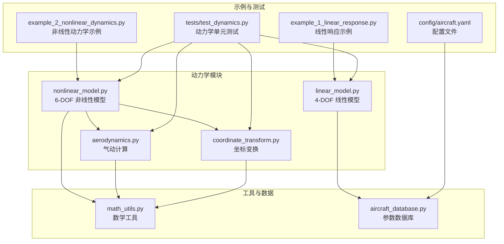
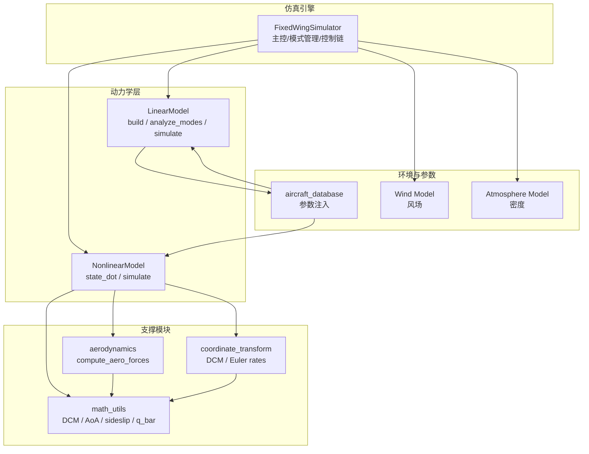
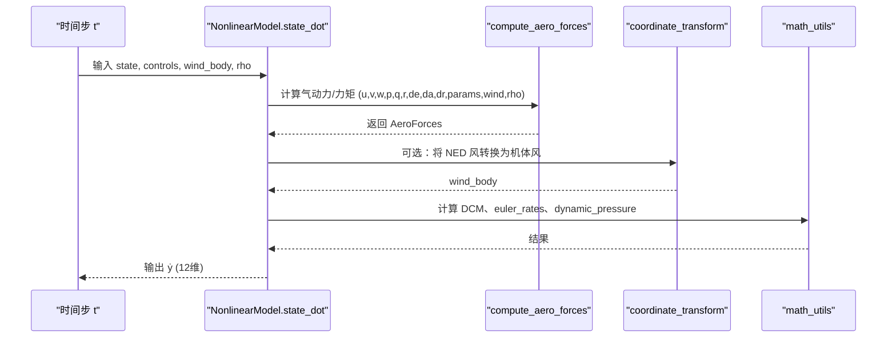
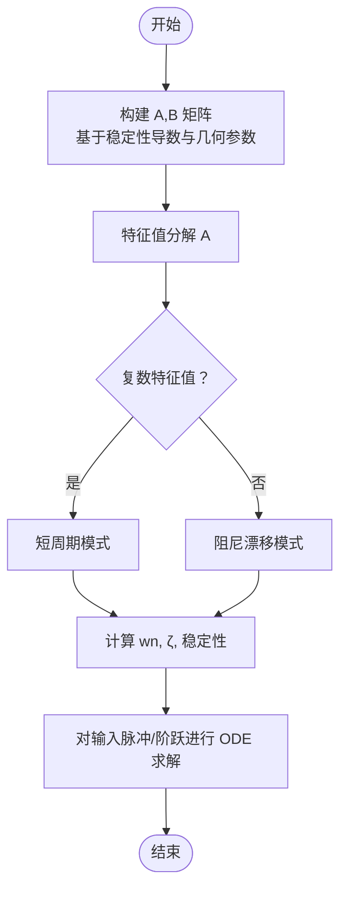
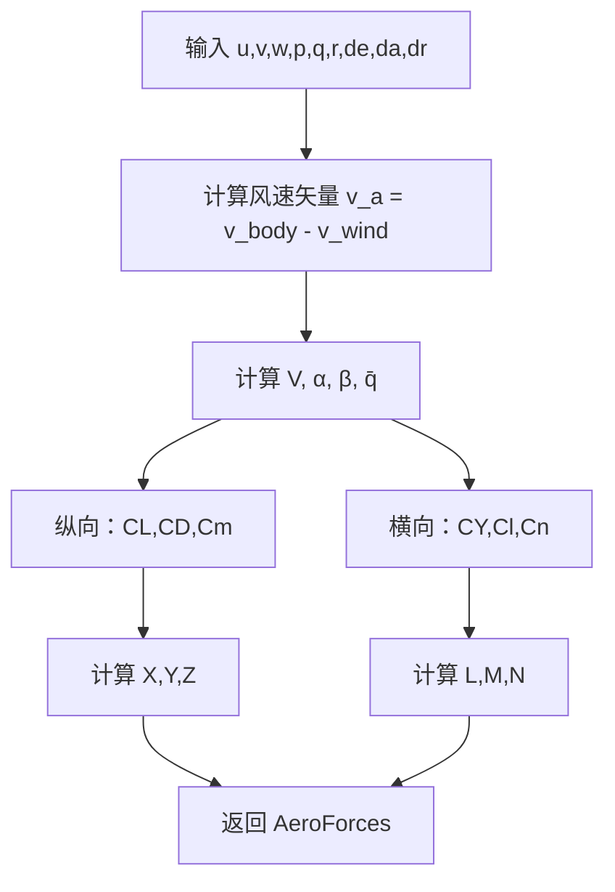
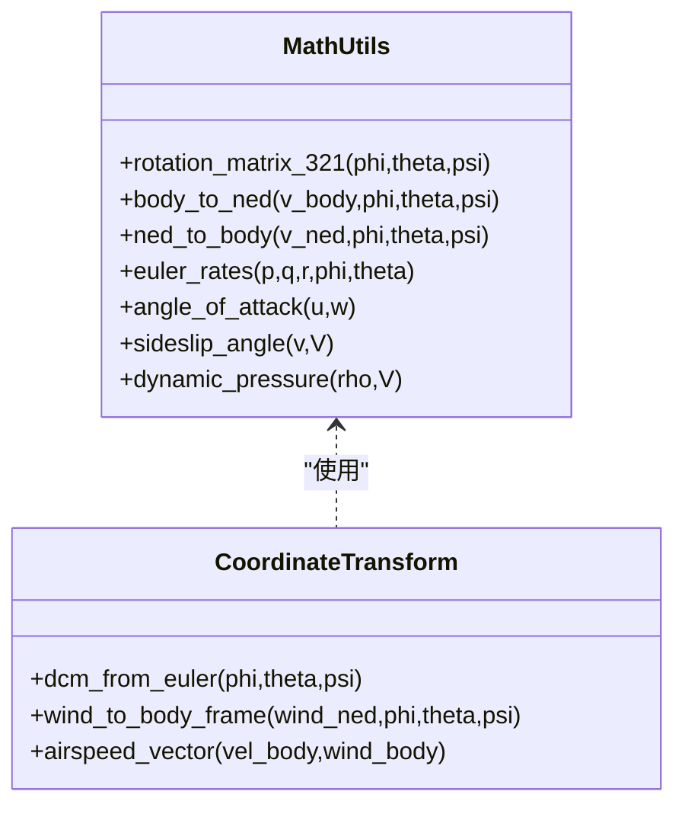
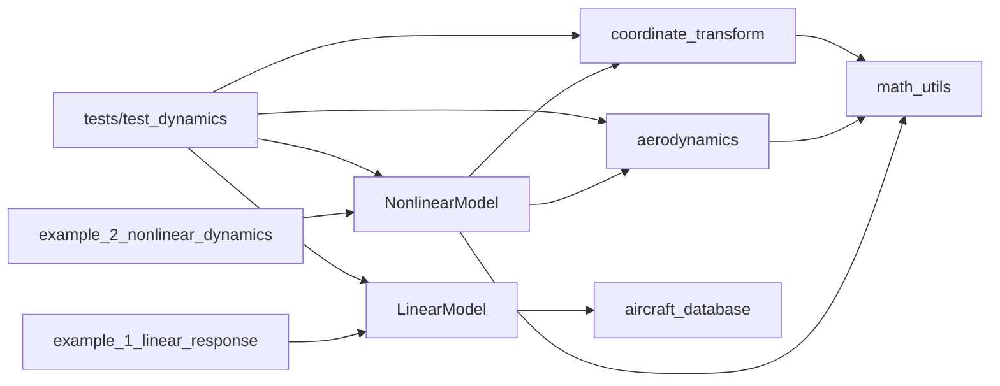

# 动力学系统

<cite>
**本文引用的文件**
- [src/dynamics/nonlinear_model.py](file://src/dynamics/nonlinear_model.py)
- [src/dynamics/linear_model.py](file://src/dynamics/linear_model.py)
- [src/dynamics/aerodynamics.py](file://src/dynamics/aerodynamics.py)
- [src/dynamics/coordinate_transform.py](file://src/dynamics/coordinate_transform.py)
- [src/utils/math_utils.py](file://src/utils/math_utils.py)
- [src/models/aircraft_database.py](file://src/models/aircraft_database.py)
- [examples/example_1_linear_response.py](file://examples/example_1_linear_response.py)
- [examples/example_2_nonlinear_dynamics.py](file://examples/example_2_nonlinear_dynamics.py)
- [tests/test_dynamics.py](file://tests/test_dynamics.py)
- [config/aircraft.yaml](file://config/aircraft.yaml)
</cite>

## 目录
1. [引言](#引言)
2. [项目结构](#项目结构)
3. [核心组件](#核心组件)
4. [架构总览](#架构总览)
5. [详细组件分析](#详细组件分析)
6. [依赖关系分析](#依赖关系分析)
7. [性能考量](#性能考量)
8. [故障排查指南](#故障排查指南)
9. [结论](#结论)
10. [附录](#附录)

## 引言
本技术文档面向固定翼无人机动力学系统，围绕6自由度（6-DOF）非线性动力学与4自由度（4-DOF）线性化模型展开，系统阐述数学基础、实现细节、气动计算、坐标系转换、验证与误差分析，并给出不同飞行状态下的模型行为分析。文档同时结合示例脚本与单元测试，帮助读者从理论到实践全面掌握该系统的建模与仿真能力。

## 项目结构
项目采用模块化组织，核心动力学相关代码位于 src/dynamics 下，配套工具函数位于 src/utils，参数数据库位于 src/models，示例与测试分别位于 examples 与 tests，配置文件位于 config。

图表来源
- [src/dynamics/nonlinear_model.py](file://src/dynamics/nonlinear_model.py#L1-L386)
- [src/dynamics/linear_model.py](file://src/dynamics/linear_model.py#L1-L319)
- [src/dynamics/aerodynamics.py](file://src/dynamics/aerodynamics.py#L1-L148)
- [src/dynamics/coordinate_transform.py](file://src/dynamics/coordinate_transform.py#L1-L70)
- [src/utils/math_utils.py](file://src/utils/math_utils.py#L1-L124)
- [src/models/aircraft_database.py](file://src/models/aircraft_database.py#L1-L183)
- [examples/example_1_linear_response.py](file://examples/example_1_linear_response.py#L1-L206)
- [examples/example_2_nonlinear_dynamics.py](file://examples/example_2_nonlinear_dynamics.py#L1-L215)
- [tests/test_dynamics.py](file://tests/test_dynamics.py#L1-L336)
- [config/aircraft.yaml](file://config/aircraft.yaml#L1-L13)

章节来源
- [src/dynamics/nonlinear_model.py](file://src/dynamics/nonlinear_model.py#L1-L386)
- [src/dynamics/linear_model.py](file://src/dynamics/linear_model.py#L1-L319)
- [src/dynamics/aerodynamics.py](file://src/dynamics/aerodynamics.py#L1-L148)
- [src/dynamics/coordinate_transform.py](file://src/dynamics/coordinate_transform.py#L1-L70)
- [src/utils/math_utils.py](file://src/utils/math_utils.py#L1-L124)
- [src/models/aircraft_database.py](file://src/models/aircraft_database.py#L1-L183)
- [examples/example_1_linear_response.py](file://examples/example_1_linear_response.py#L1-L206)
- [examples/example_2_nonlinear_dynamics.py](file://examples/example_2_nonlinear_dynamics.py#L1-L215)
- [tests/test_dynamics.py](file://tests/test_dynamics.py#L1-L336)
- [config/aircraft.yaml](file://config/aircraft.yaml#L1-L13)

## 核心组件
- 6-DOF 非线性模型：基于牛顿-欧拉方程，涵盖平移与旋转运动，支持风场与密度变化，提供开环脉冲响应与闭环控制对比。
- 4-DOF 线性模型：纵向线性化状态空间，提供模态分析（短周期、长周期/腓尼基振荡、阻尼漂移），用于稳定性与控制器设计。
- 气动计算：在机体坐标系下计算升力、阻力、侧向力及滚转、偏航、俯仰力矩，考虑迎角、侧滑角、非维角速率与操纵面偏角。
- 坐标变换：提供 NED 与机体坐标系之间的方向余弦矩阵与欧拉角微分关系，支持风速转换与空速矢量计算。
- 参数数据库：内置多型固定翼无人机参数，注入派生常数（声速、海平面密度、动态压强等）供动力学模块使用。

章节来源
- [src/dynamics/nonlinear_model.py](file://src/dynamics/nonlinear_model.py#L104-L386)
- [src/dynamics/linear_model.py](file://src/dynamics/linear_model.py#L107-L319)
- [src/dynamics/aerodynamics.py](file://src/dynamics/aerodynamics.py#L35-L148)
- [src/dynamics/coordinate_transform.py](file://src/dynamics/coordinate_transform.py#L29-L70)
- [src/models/aircraft_database.py](file://src/models/aircraft_database.py#L143-L183)

## 架构总览
下图展示6-DOF与4-DOF模型在系统中的位置与交互关系，以及与气动、坐标变换、数学工具的耦合。

图表来源
- [src/dynamics/nonlinear_model.py](file://src/dynamics/nonlinear_model.py#L160-L281)
- [src/dynamics/linear_model.py](file://src/dynamics/linear_model.py#L129-L200)
- [src/dynamics/aerodynamics.py](file://src/dynamics/aerodynamics.py#L35-L148)
- [src/dynamics/coordinate_transform.py](file://src/dynamics/coordinate_transform.py#L29-L70)
- [src/utils/math_utils.py](file://src/utils/math_utils.py#L43-L124)
- [src/models/aircraft_database.py](file://src/models/aircraft_database.py#L143-L183)

## 详细组件分析

### 6-DOF 非线性动力学模型
- 状态向量（12 维，NED 坐标）：[u, v, w, p, q, r, φ, θ, ψ, x_N, x_E, x_D]，分别对应机体轴速度、机体轴角速度、欧拉角、位置（NED）。
- 平移运动方程：由牛顿第二定律在机体轴上展开，考虑气动力、推力与重力分量，得到 u̇, ṽ, ẇ。
- 旋转运动方程：基于欧拉角微分与惯性耦合，使用广义惯性张量与力矩，求解 ṗ, q̇, ṙ。
- 姿态与位置更新：通过 DCM 将机体速度投影至 NED，再积分得到位置。
- 控制输入：升降舵、副翼、方向舵偏角与油门归一化值；推力按质量与重力加速度比例设定。
- 风场与密度：支持将 NED 风转换至机体坐标，按高度计算密度，动态调整气动参数。

图表来源
- [src/dynamics/nonlinear_model.py](file://src/dynamics/nonlinear_model.py#L160-L255)
- [src/dynamics/aerodynamics.py](file://src/dynamics/aerodynamics.py#L35-L148)
- [src/dynamics/coordinate_transform.py](file://src/dynamics/coordinate_transform.py#L39-L53)
- [src/utils/math_utils.py](file://src/utils/math_utils.py#L43-L124)

章节来源
- [src/dynamics/nonlinear_model.py](file://src/dynamics/nonlinear_model.py#L104-L386)

### 4-DOF 线性化模型（纵向）
- 状态向量：[û, α, q, θ]，其中 û 为速度扰动的归一化形式（Δu/U0）。
- 输入向量：[δ_T, δ_e]，分别为节流与升降舵扰动。
- 状态矩阵 A 与输入矩阵 B：通过稳定性导数与非维惯性参数构建，满足线性时不变系统 ẏ = Ay + Bu。
- 模态分析：对 A 进行特征值分解，识别短周期与长周期/腓尼基振荡模式，评估阻尼比与自然频率。
- 时间响应：对阶跃或脉冲输入进行数值积分，输出各状态随时间演化。

图表来源
- [src/dynamics/linear_model.py](file://src/dynamics/linear_model.py#L129-L200)
- [src/dynamics/linear_model.py](file://src/dynamics/linear_model.py#L206-L252)
- [src/dynamics/linear_model.py](file://src/dynamics/linear_model.py#L258-L306)

章节来源
- [src/dynamics/linear_model.py](file://src/dynamics/linear_model.py#L107-L319)

### 气动力学计算
- 角度定义：迎角 α = atan2(w, u)，侧滑角 β = arcsin(v / V)，动态压强 q̄ = 0.5·ρ·V²。
- 升阻系数：纵向 CL(q̄, α, q̃, δ_e)，CD(q̄, α, q̃, δ_e)，俯仰力矩 Cm(q̄, α, q̃, δ_e)。
- 侧向力与力矩：CY(β, p̃, r̃, δ_a, δ_r)，Cl(β, p̃, r̃, δ_a, δ_r)，Cn(β, p̃, r̃, δ_a, δ_r)。
- 力与力矩：X = q̄·S·(−CD·cos α + CL·sin α)，Y = q̄·S·CY，Z = q̄·S·(−CL·cos α − CD·sin α)；L, M, N 同理。

图表来源
- [src/dynamics/aerodynamics.py](file://src/dynamics/aerodynamics.py#L35-L148)
- [src/utils/math_utils.py](file://src/utils/math_utils.py#L107-L124)

章节来源
- [src/dynamics/aerodynamics.py](file://src/dynamics/aerodynamics.py#L35-L148)
- [src/utils/math_utils.py](file://src/utils/math_utils.py#L107-L124)

### 坐标系转换与欧拉角微分
- 方向余弦矩阵（DCM）：3-2-1 欧拉角顺序，NED→Body 与 Body→NED 的变换。
- 欧拉角微分：由 p, q, r 推导 φ̇, θ̇, ψ̇，在 θ 接近 ±90° 时引入小 ε 防止奇异。
- 风速转换：NED 风矢量经 DCM 转换为机体坐标风速，用于修正空速矢量。
- 空速矢量：v_air = v_body − v_wind_body。

图表来源
- [src/utils/math_utils.py](file://src/utils/math_utils.py#L43-L124)
- [src/dynamics/coordinate_transform.py](file://src/dynamics/coordinate_transform.py#L29-L70)

章节来源
- [src/utils/math_utils.py](file://src/utils/math_utils.py#L43-L124)
- [src/dynamics/coordinate_transform.py](file://src/dynamics/coordinate_transform.py#L29-L70)

### 参数数据库与派生常数
- 提供多型无人机的几何、气动与惯性参数，以及马赫数 Mach。
- 注入派生常数：声速 a_sound、海平面密度 ρ0、动态压强 q_bar = 0.5·ρ0·U0²，U0 = Mach·a_sound。
- 供非线性与线性模型直接使用，确保一致性与可移植性。

章节来源
- [src/models/aircraft_database.py](file://src/models/aircraft_database.py#L143-L183)

### 示例与验证
- 线性响应示例：打开环线性分析与闭环 PID 对比，输出 CSV 与图像。
- 非线性动力学示例：打开环 6-DOF 脉冲响应与闭环 PID 稳定化对比。
- 单元测试：覆盖坐标变换正交性、风速转换、气动符号与数值稳定性、线性模型矩阵形状与模态、非线性模型修剪收敛与状态导数维度等。

章节来源
- [examples/example_1_linear_response.py](file://examples/example_1_linear_response.py#L83-L206)
- [examples/example_2_nonlinear_dynamics.py](file://examples/example_2_nonlinear_dynamics.py#L77-L215)
- [tests/test_dynamics.py](file://tests/test_dynamics.py#L67-L336)

## 依赖关系分析
- NonlinearModel 依赖 aerodynamics、coordinate_transform、math_utils，以及参数数据库提供的派生常数。
- LinearModel 依赖参数数据库与稳定性导数，构建状态空间矩阵。
- aerodynamics 依赖 math_utils 中的角度与动态压强工具。
- coordinate_transform 依赖 math_utils 的 DCM 与角度工具。
- 示例与测试脚本分别调用相应模块进行端到端验证。

图表来源
- [src/dynamics/nonlinear_model.py](file://src/dynamics/nonlinear_model.py#L27-L28)
- [src/dynamics/linear_model.py](file://src/dynamics/linear_model.py#L18-L20)
- [src/dynamics/aerodynamics.py](file://src/dynamics/aerodynamics.py#L11-L13)
- [src/dynamics/coordinate_transform.py](file://src/dynamics/coordinate_transform.py#L10-L16)
- [examples/example_1_linear_response.py](file://examples/example_1_linear_response.py#L34-L36)
- [examples/example_2_nonlinear_dynamics.py](file://examples/example_2_nonlinear_dynamics.py#L34-L36)
- [tests/test_dynamics.py](file://tests/test_dynamics.py#L29-L45)

章节来源
- [src/dynamics/nonlinear_model.py](file://src/dynamics/nonlinear_model.py#L27-L28)
- [src/dynamics/linear_model.py](file://src/dynamics/linear_model.py#L18-L20)
- [src/dynamics/aerodynamics.py](file://src/dynamics/aerodynamics.py#L11-L13)
- [src/dynamics/coordinate_transform.py](file://src/dynamics/coordinate_transform.py#L10-L16)
- [examples/example_1_linear_response.py](file://examples/example_1_linear_response.py#L34-L36)
- [examples/example_2_nonlinear_dynamics.py](file://examples/example_2_nonlinear_dynamics.py#L34-L36)
- [tests/test_dynamics.py](file://tests/test_dynamics.py#L29-L45)

## 性能考量
- 数值积分：非线性模型使用 solve_ivp（RK 对阶方法），默认相对/绝对容差较高，保证精度与稳定性；可根据实时性需求调整步长与容差。
- 线性模型：状态矩阵规模较小（4×4），模态分析与 ODE 求解快速，适合在线控制器设计与参数敏感性分析。
- 气动计算：动态压强与角度函数均为标量/向量化运算，成本低；注意在极低空速时的数值保护（如最小空速夹紧）。
- 坐标变换：矩阵乘法与三角函数开销可控，建议在高频控制回路中缓存必要中间结果（如 DCM）。

## 故障排查指南
- 非线性模型修剪失败：检查参数是否合理（质量、机翼面积、稳定性导数），若线性方程不可逆则采用次优解策略。
- 状态导数异常：确认初始状态是否接近平衡点，检查推力与气动力符号一致性，避免过大的控制输入导致瞬态过大。
- 线性模型不稳定：检查 A 矩阵构造与稳定性导数取值，关注短周期阻尼比是否过低。
- 气动符号错误：验证升力与阻力方向与 NED/机体坐标约定一致，确保在正迎角下升力为向上（Z 为负）。
- 坐标变换奇异：当 θ 接近 ±90° 时欧拉角微分存在奇异，需在控制策略中避免大攻角区域或采用四元数替代。

章节来源
- [src/dynamics/nonlinear_model.py](file://src/dynamics/nonlinear_model.py#L132-L154)
- [src/dynamics/nonlinear_model.py](file://src/dynamics/nonlinear_model.py#L224-L248)
- [src/dynamics/linear_model.py](file://src/dynamics/linear_model.py#L206-L252)
- [src/dynamics/aerodynamics.py](file://src/dynamics/aerodynamics.py#L130-L146)
- [src/utils/math_utils.py](file://src/utils/math_utils.py#L79-L100)

## 结论
本系统以清晰的模块划分实现了固定翼无人机的6-DOF非线性与4-DOF线性动力学建模，配合完善的气动计算、坐标变换与参数数据库，既可用于教学演示，也可作为控制器设计与仿真的基础平台。通过示例与测试脚本，用户可以快速开展开环与闭环仿真、模态分析与误差评估，实现从理论到工程应用的无缝衔接。

## 附录

### 不同飞行状态下的模型行为分析
- 平飞/修剪：非线性模型在修剪状态下，速度导数与角加速度趋近于零；线性模型短周期模式稳定，阻尼适中。
- 纵向阶跃：线性模型对升降舵脉冲的响应体现短周期主导的快速衰减与长周期缓慢漂移；非线性模型在中等攻角范围内与线性模型吻合良好。
- 横航向扰动：侧向力与力矩模型对副翼与方向舵偏角敏感，滚转与偏航耦合明显；在小攻角下可视为线性近似有效。
- 风场影响：加入风场后，空速矢量改变，气动力与力矩随之变化；密度随高度变化时，动态压强与气动效率亦受影响。

章节来源
- [src/dynamics/nonlinear_model.py](file://src/dynamics/nonlinear_model.py#L287-L386)
- [src/dynamics/linear_model.py](file://src/dynamics/linear_model.py#L258-L306)
- [src/dynamics/aerodynamics.py](file://src/dynamics/aerodynamics.py#L68-L89)
- [src/dynamics/coordinate_transform.py](file://src/dynamics/coordinate_transform.py#L39-L69)