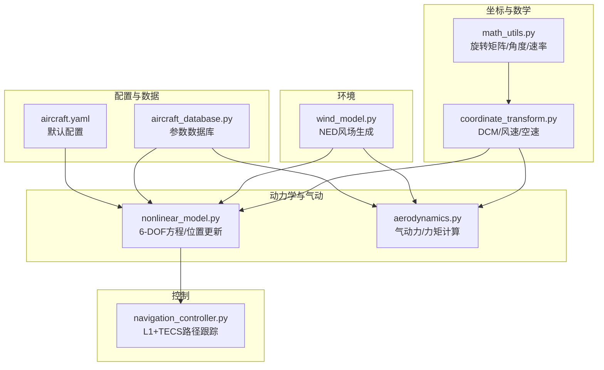
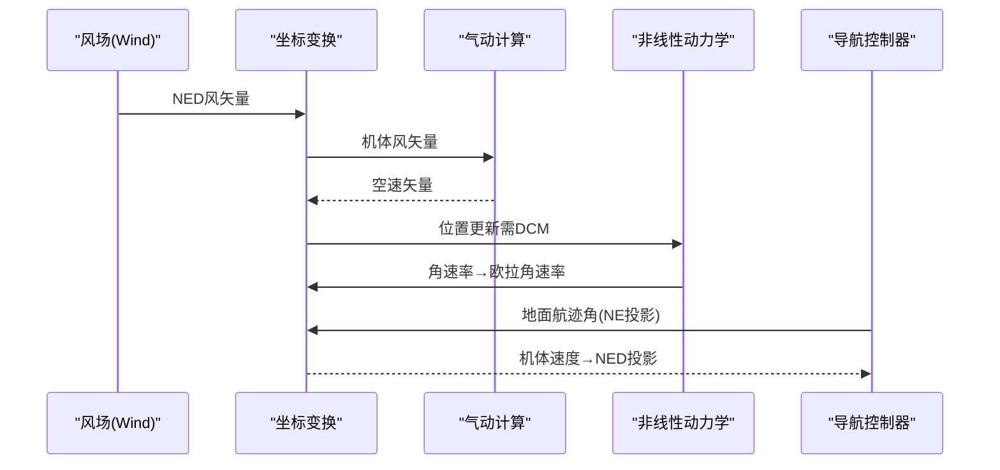
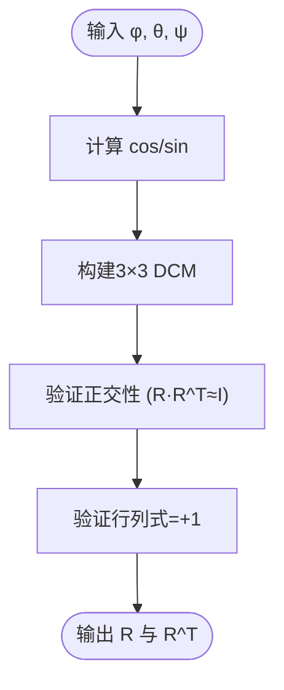
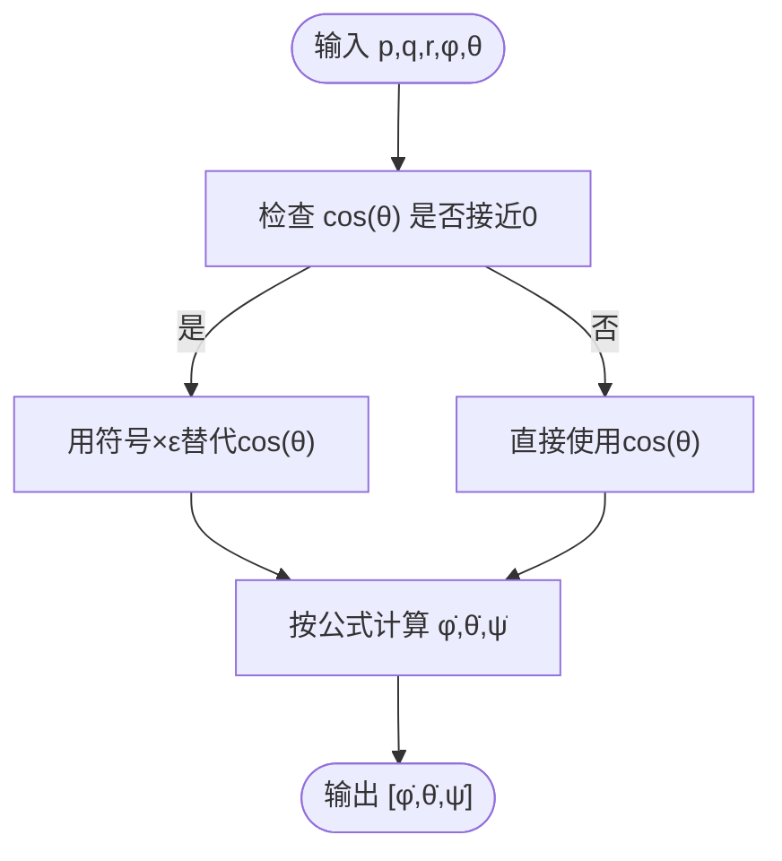
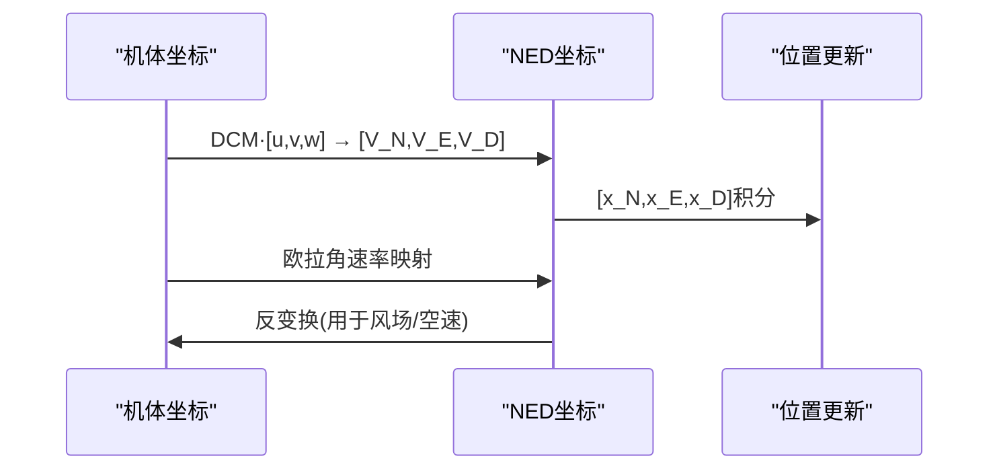
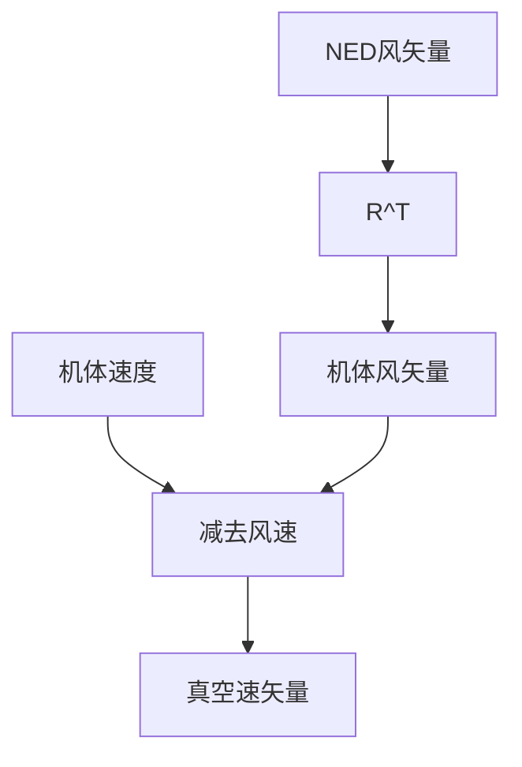
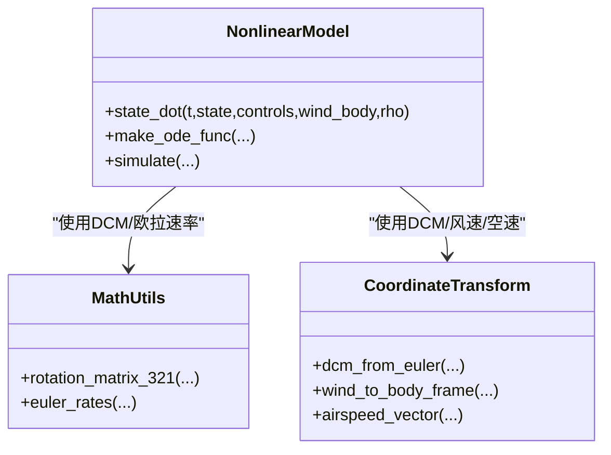
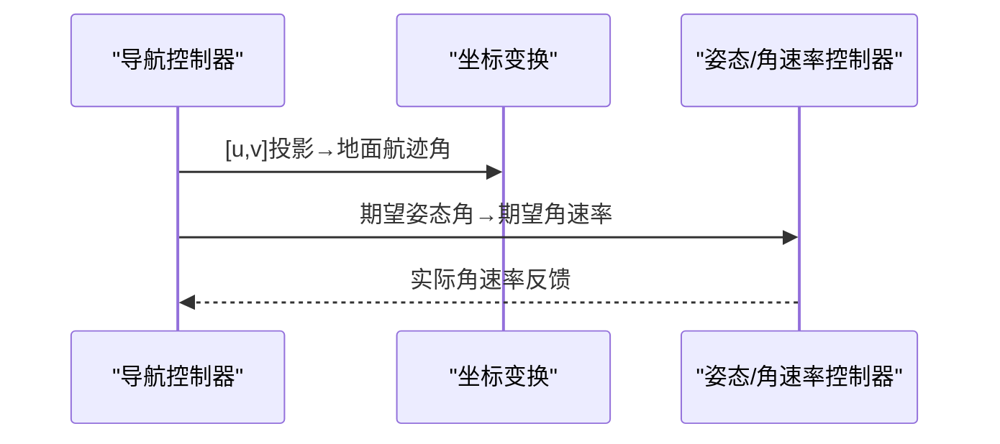
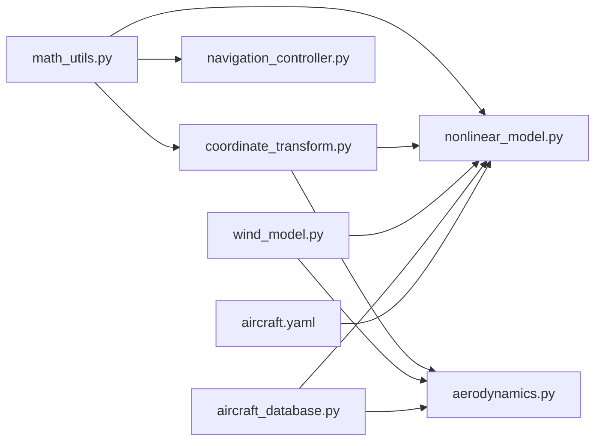

# 坐标系转换

<cite>
**本文引用的文件**
- [coordinate_transform.py](file://src/dynamics/coordinate_transform.py)
- [math_utils.py](file://src/utils/math_utils.py)
- [nonlinear_model.py](file://src/dynamics/nonlinear_model.py)
- [aerodynamics.py](file://src/dynamics/aerodynamics.py)
- [navigation_controller.py](file://src/control/navigation_controller.py)
- [wind_model.py](file://src/environment/wind_model.py)
- [aircraft_database.py](file://src/models/aircraft_database.py)
- [aircraft.yaml](file://config/aircraft.yaml)
- [test_dynamics.py](file://tests/test_dynamics.py)
- [example_3_trajectory_tracking.py](file://examples/example_3_trajectory_tracking.py)
</cite>

## 目录
1. [简介](#简介)
2. [项目结构](#项目结构)
3. [核心组件](#核心组件)
4. [架构总览](#架构总览)
5. [详细组件分析](#详细组件分析)
6. [依赖关系分析](#依赖关系分析)
7. [性能考量](#性能考量)
8. [故障排查指南](#故障排查指南)
9. [结论](#结论)
10. [附录](#附录)

## 简介
本技术文档聚焦于固定翼无人机的坐标系转换模块，系统阐述以下内容：
- NED（北东地）坐标系与机体坐标系之间的变换关系；
- 3-2-1欧拉角序列的数学定义与几何意义；
- 旋转矩阵的构造方法与数值稳定性问题；
- 速度、加速度、角速度在不同坐标系间的变换规律；
- 坐标系转换在导航与控制中的应用实例；
- 坐标系定义的一致性与边界条件处理；
- 坐标变换错误对仿真精度的影响分析。

## 项目结构
该模块位于动态子系统与工具库之间，主要涉及坐标变换、风场建模、非线性动力学以及控制链路。关键文件如下：
- 坐标变换：src/dynamics/coordinate_transform.py、src/utils/math_utils.py
- 动力学与气动：src/dynamics/nonlinear_model.py、src/dynamics/aerodynamics.py
- 导航与控制：src/control/navigation_controller.py
- 环境风场：src/environment/wind_model.py
- 飞机参数数据库：src/models/aircraft_database.py
- 配置文件：config/aircraft.yaml
- 单元测试与示例：tests/test_dynamics.py、examples/example_3_trajectory_tracking.py

图表来源
- [math_utils.py](file://src/utils/math_utils.py#L43-L76)
- [coordinate_transform.py](file://src/dynamics/coordinate_transform.py#L29-L70)
- [nonlinear_model.py](file://src/dynamics/nonlinear_model.py#L160-L281)
- [aerodynamics.py](file://src/dynamics/aerodynamics.py#L35-L148)
- [wind_model.py](file://src/environment/wind_model.py#L76-L108)
- [aircraft_database.py](file://src/models/aircraft_database.py#L143-L166)
- [aircraft.yaml](file://config/aircraft.yaml#L1-L13)

章节来源
- [coordinate_transform.py](file://src/dynamics/coordinate_transform.py#L1-L70)
- [math_utils.py](file://src/utils/math_utils.py#L1-L124)
- [nonlinear_model.py](file://src/dynamics/nonlinear_model.py#L1-L386)
- [aerodynamics.py](file://src/dynamics/aerodynamics.py#L1-L148)
- [navigation_controller.py](file://src/control/navigation_controller.py#L1-L293)
- [wind_model.py](file://src/environment/wind_model.py#L1-L113)
- [aircraft_database.py](file://src/models/aircraft_database.py#L1-L183)
- [aircraft.yaml](file://config/aircraft.yaml#L1-L13)

## 核心组件
- 方向余弦矩阵（DCM）与3-2-1欧拉角序列：提供从机体坐标到NED坐标（或反向）的正交变换，满足旋转矩阵的正交性与行列式为+1的要求。
- 风场到机体坐标变换：支持将NED风矢量转换为机体坐标下的风速度，用于计算真实空速。
- 真空速计算：通过“机体速度减去机体风速”得到空速矢量，为空气动力计算提供基础。
- 非线性动力学中的坐标变换：在位置更新（NED）与角速率更新（3-2-1欧拉角）中使用DCM与欧拉角速率映射。
- 导航控制器中的坐标变换：利用机体速度投影到NED平面以获得更准确的地面航迹角，避免侧滑影响。

章节来源
- [coordinate_transform.py](file://src/dynamics/coordinate_transform.py#L29-L70)
- [math_utils.py](file://src/utils/math_utils.py#L43-L101)
- [nonlinear_model.py](file://src/dynamics/nonlinear_model.py#L246-L248)
- [navigation_controller.py](file://src/control/navigation_controller.py#L274-L282)

## 架构总览
坐标系转换贯穿仿真主流程：环境风场生成NED风矢量，经由坐标变换模块转换至机体坐标，再参与气动计算；同时，6-DOF动力学在每一步将机体速度通过DCM映射到NED进行位置更新，并使用欧拉角速率映射实现姿态演化。

图表来源
- [wind_model.py](file://src/environment/wind_model.py#L76-L108)
- [coordinate_transform.py](file://src/dynamics/coordinate_transform.py#L39-L70)
- [aerodynamics.py](file://src/dynamics/aerodynamics.py#L68-L84)
- [nonlinear_model.py](file://src/dynamics/nonlinear_model.py#L246-L248)
- [navigation_controller.py](file://src/control/navigation_controller.py#L274-L282)

## 详细组件分析

### 3-2-1欧拉角序列与方向余弦矩阵
- 定义与约定：采用Z-Y-X（3-2-1）顺序，即先绕z轴（偏航）转ψ，再绕y轴（俯仰）转θ，最后绕x轴（滚转）转φ。NED为右手坐标系，机体为右手坐标系，DCM将机体矢量映射到NED。
- 数学表达：DCM由φ、θ、ψ的三角函数组合构成，满足正交性与行列式为+1。
- 实现要点：
  - DCM构造函数返回R，满足v_NED = R @ v_body；
  - 反向变换通过R^T实现，即v_body = R^T @ v_NED；
  - 单元测试验证零角时DCM为单位阵、正交性与行列式为+1、反变换闭合。

图表来源
- [math_utils.py](file://src/utils/math_utils.py#L43-L66)
- [test_dynamics.py](file://tests/test_dynamics.py#L69-L84)

章节来源
- [math_utils.py](file://src/utils/math_utils.py#L43-L76)
- [test_dynamics.py](file://tests/test_dynamics.py#L69-L84)

### 欧拉角速率映射与数值稳定性
- 映射关系：从机体角速率(p,q,r)到欧拉角时间导数[φ̇, θ̇, ψ̇]的解析式给出。
- 边界条件：当θ接近±90°（俯仰角接近竖直向上/下）时，出现奇异性（分母趋近0），代码通过引入极小量ε进行数值保护，避免除零。
- 单元测试：在θ=0时，欧拉角速率应等于机体角速率；在θ≠0时，映射关系成立。

图表来源
- [math_utils.py](file://src/utils/math_utils.py#L79-L100)
- [test_dynamics.py](file://tests/test_dynamics.py#L107-L113)

章节来源
- [math_utils.py](file://src/utils/math_utils.py#L79-L100)
- [test_dynamics.py](file://tests/test_dynamics.py#L107-L113)

### 速度、加速度、角速度的坐标变换
- 速度变换：
  - 机体速度[u,v,w]与NED速度[V_N,V_E,V_D]的关系由DCM决定；
  - 导航控制器使用[u,v]在NED平面投影得到更准确的地面航迹角，避免侧滑影响。
- 加速度变换：
  - 在6-DOF方程中，平移加速度在机体坐标下求解后，通过DCM映射到NED进行位置更新；
  - 由于NED为惯性系，位置更新使用v_NED = R @ [u,v,w]。
- 角速度：
  - 使用欧拉角速率映射将[p,q,r]转换为[φ̇,θ̇,ψ̇]，并进行角度归一化（wrap_angle）。

图表来源
- [nonlinear_model.py](file://src/dynamics/nonlinear_model.py#L246-L248)
- [navigation_controller.py](file://src/control/navigation_controller.py#L274-L282)
- [math_utils.py](file://src/utils/math_utils.py#L69-L76)

章节来源
- [nonlinear_model.py](file://src/dynamics/nonlinear_model.py#L246-L248)
- [navigation_controller.py](file://src/control/navigation_controller.py#L274-L282)
- [math_utils.py](file://src/utils/math_utils.py#L69-L76)

### 风场到机体坐标与真空速
- 风场生成：Wind类提供多种风型（无风、定常、正弦叠加、随机正弦），均以NED表示；
- 转换到机体：通过R^T将NED风矢量转换到机体坐标；
- 真空速：空速矢量 = 机体速度 − 机体风速，用于气动系数与力计算。

图表来源
- [wind_model.py](file://src/environment/wind_model.py#L76-L108)
- [coordinate_transform.py](file://src/dynamics/coordinate_transform.py#L39-L70)
- [aerodynamics.py](file://src/dynamics/aerodynamics.py#L68-L84)

章节来源
- [wind_model.py](file://src/environment/wind_model.py#L76-L108)
- [coordinate_transform.py](file://src/dynamics/coordinate_transform.py#L39-L70)
- [aerodynamics.py](file://src/dynamics/aerodynamics.py#L68-L84)

### 非线性动力学中的坐标变换
- 位置更新：使用DCM将[u,v,w]映射到NED，得到[x_N,x_E,x_D]的时间导数；
- 角速率更新：使用欧拉角速率映射将[p,q,r]转换为[φ̇,θ̇,ψ̇]；
- 风场接入：若存在风，则先将NED风矢量转换到机体坐标，再参与空速计算。

图表来源
- [nonlinear_model.py](file://src/dynamics/nonlinear_model.py#L160-L281)
- [math_utils.py](file://src/utils/math_utils.py#L43-L100)
- [coordinate_transform.py](file://src/dynamics/coordinate_transform.py#L29-L70)

章节来源
- [nonlinear_model.py](file://src/dynamics/nonlinear_model.py#L160-L281)
- [math_utils.py](file://src/utils/math_utils.py#L43-L100)
- [coordinate_transform.py](file://src/dynamics/coordinate_transform.py#L29-L70)

### 导航与控制中的坐标变换
- L1导航：使用[u,v]在NED平面投影得到地面航迹角，避免侧滑与风对航向估计的影响；
- TECS：基于空速与爬升率估计（来自NED垂直速度）进行高度与空速控制；
- 控制器输出：将期望姿态角转换为期望角速率，再由姿态控制器执行。

图表来源
- [navigation_controller.py](file://src/control/navigation_controller.py#L274-L292)
- [math_utils.py](file://src/utils/math_utils.py#L13-L25)

章节来源
- [navigation_controller.py](file://src/control/navigation_controller.py#L134-L202)

## 依赖关系分析
- coordinate_transform依赖math_utils提供的DCM、向量变换与欧拉速率映射；
- nonlinear_model依赖math_utils的DCM与欧拉速率，以及aerodynamics的气动计算；
- aerodynamics依赖math_utils的角度与动态压强计算；
- navigation_controller依赖math_utils的角度包装与饱和函数；
- wind_model独立生成NED风场，供nonlinear_model与aerodynamics使用；
- aircraft_database提供飞机参数，被nonlinear_model与aerodynamics使用。

图表来源
- [coordinate_transform.py](file://src/dynamics/coordinate_transform.py#L10-L16)
- [math_utils.py](file://src/utils/math_utils.py#L1-L124)
- [nonlinear_model.py](file://src/dynamics/nonlinear_model.py#L27-L28)
- [aerodynamics.py](file://src/dynamics/aerodynamics.py#L11-L13)
- [navigation_controller.py](file://src/control/navigation_controller.py#L20-L22)
- [wind_model.py](file://src/environment/wind_model.py#L1-L113)
- [aircraft_database.py](file://src/models/aircraft_database.py#L143-L166)
- [aircraft.yaml](file://config/aircraft.yaml#L1-L13)

章节来源
- [coordinate_transform.py](file://src/dynamics/coordinate_transform.py#L10-L16)
- [nonlinear_model.py](file://src/dynamics/nonlinear_model.py#L27-L28)
- [aerodynamics.py](file://src/dynamics/aerodynamics.py#L11-L13)
- [navigation_controller.py](file://src/control/navigation_controller.py#L20-L22)
- [wind_model.py](file://src/environment/wind_model.py#L1-L113)
- [aircraft_database.py](file://src/models/aircraft_database.py#L143-L166)
- [aircraft.yaml](file://config/aircraft.yaml#L1-L13)

## 性能考量
- 计算开销：DCM与三角函数计算为O(1)，在每步积分中重复调用，整体开销较小；
- 数值稳定性：欧拉角速率映射在θ接近±90°时采用极小量保护，避免奇异；
- 内存占用：主要为中间数组（如DCM、风矢量、空速矢量），随仿真步数线性增长；
- 并行化：当前实现为单线程，若需加速可在风场生成与气动计算中考虑向量化（已使用NumPy）。

## 故障排查指南
- DCM不正交或行列式异常：
  - 检查输入角度范围是否过大导致舍入误差累积；
  - 确认是否正确使用R与R^T进行双向变换；
  - 参考单元测试对零角、正交性与行列式的断言。
- 欧拉角速率在θ≈±90°时发散：
  - 确认是否启用极小量保护；
  - 检查输入θ是否超出合理范围（通常固定翼飞行器不会长时间处于竖直姿态）。
- 真空速计算异常：
  - 确认风场是否正确从NED转换到机体；
  - 检查风速与机体速度的坐标系一致性；
  - 注意风速为零时空速应等于机体速度。
- 导航航迹角偏差：
  - 确认使用[u,v]在NED平面投影而非仅用ψ；
  - 检查wrap_angle是否正确应用。

章节来源
- [test_dynamics.py](file://tests/test_dynamics.py#L69-L121)
- [math_utils.py](file://src/utils/math_utils.py#L79-L100)
- [coordinate_transform.py](file://src/dynamics/coordinate_transform.py#L39-L70)
- [navigation_controller.py](file://src/control/navigation_controller.py#L274-L282)

## 结论
本模块以3-2-1欧拉角与DCM为核心，实现了NED与机体坐标系间的一致、稳定与高效的变换。通过严格的数值保护（奇异点处理）、坐标系一致性（风场与空速计算）与在导航控制中的正确应用，确保了仿真精度与稳定性。建议在实际工程中：
- 保持坐标系定义一致（NED/机体约定明确）；
- 在高攻角区域谨慎处理欧拉角速率映射；
- 在风场建模中正确区分NED风与空速的关系；
- 在导航中优先使用机体速度投影的地面航迹角。

## 附录

### 坐标系定义一致性与边界条件
- 坐标系约定：NED为右手坐标系，机体为右手坐标系；DCM将机体矢量映射到NED；
- 角度范围：使用wrap_angle将角度约束在[-π,π]，避免跳变；
- 边界条件：θ接近±90°时采用极小量保护，保证数值稳定。

章节来源
- [math_utils.py](file://src/utils/math_utils.py#L13-L25)
- [math_utils.py](file://src/utils/math_utils.py#L79-L100)

### 应用实例：轨迹跟踪中的坐标变换
- 示例脚本展示了AUTO模式下的轨迹跟踪，其中包含NED位置、速度、姿态与控制输入的完整历史记录；
- 导航控制器使用[u,v]投影得到地面航迹角，TECS基于空速与爬升率进行高度与空速控制；
- 非线性动力学在每步使用DCM将[u,v,w]映射到NED进行位置更新。

章节来源
- [example_3_trajectory_tracking.py](file://examples/example_3_trajectory_tracking.py#L72-L194)
- [navigation_controller.py](file://src/control/navigation_controller.py#L134-L202)
- [nonlinear_model.py](file://src/dynamics/nonlinear_model.py#L246-L248)

### 坐标变换错误对仿真精度的影响
- DCM不正交：会导致位置漂移与姿态积分误差；
- θ接近±90°未做保护：可能导致角速率发散，进而引起姿态积分发散；
- 风场未正确转换：导致空速计算错误，进而影响气动力与轨迹；
- 导航航迹角使用ψ而非[u,v]投影：在侧滑/风条件下产生航向误差，影响跟踪性能。

章节来源
- [test_dynamics.py](file://tests/test_dynamics.py#L69-L121)
- [navigation_controller.py](file://src/control/navigation_controller.py#L274-L282)
- [aerodynamics.py](file://src/dynamics/aerodynamics.py#L68-L84)