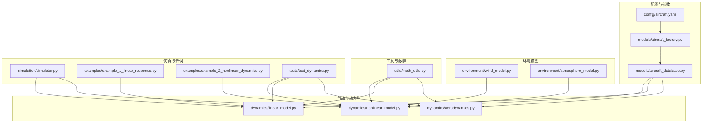
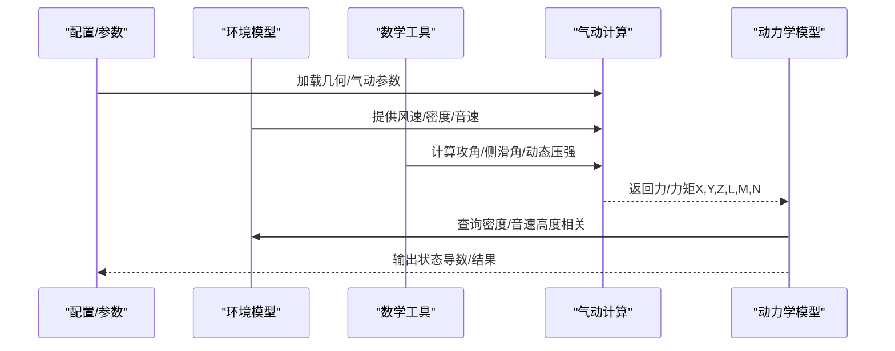
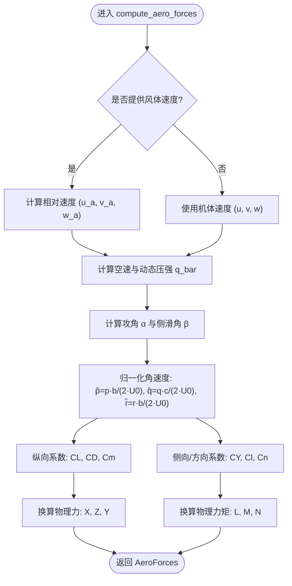
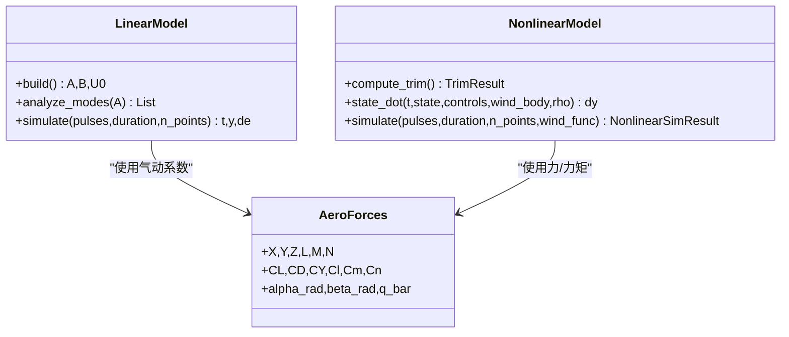
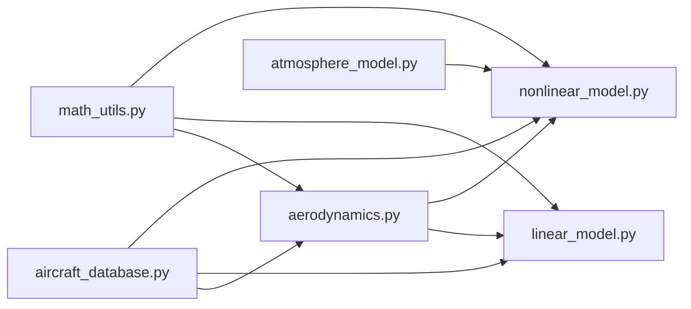

# 气动力学计算

<cite>
**本文引用的文件**
- [aerodynamics.py](file://src/dynamics/aerodynamics.py)
- [aerodynamic_forces.py](file://src/environment/aerodynamic_forces.py)
- [aircraft_database.py](file://src/models/aircraft_database.py)
- [aircraft_factory.py](file://src/models/aircraft_factory.py)
- [math_utils.py](file://src/utils/math_utils.py)
- [nonlinear_model.py](file://src/dynamics/nonlinear_model.py)
- [linear_model.py](file://src/dynamics/linear_model.py)
- [atmosphere_model.py](file://src/environment/atmosphere_model.py)
- [simulator.py](file://src/simulation/simulator.py)
- [test_dynamics.py](file://tests/test_dynamics.py)
- [example_1_linear_response.py](file://examples/example_1_linear_response.py)
- [example_2_nonlinear_dynamics.py](file://examples/example_2_nonlinear_dynamics.py)
- [aircraft.yaml](file://config/aircraft.yaml)
</cite>

## 目录
1. [引言](#引言)
2. [项目结构](#项目结构)
3. [核心组件](#核心组件)
4. [架构总览](#架构总览)
5. [详细组件分析](#详细组件分析)
6. [依赖关系分析](#依赖关系分析)
7. [性能考量](#性能考量)
8. [故障排查指南](#故障排查指南)
9. [结论](#结论)
10. [附录](#附录)

## 引言
本技术文档聚焦于固定翼无人机气动力学计算模块，系统阐述升力系数（CL）、阻力系数（CD）、侧向力系数（CY）的建模与实现，解析攻角（α）与侧滑角（β）对气动力的影响机制，说明纵向（升降舵）与横向/方向（副翼、方向舵）控制面偏转对气动力与力矩的贡献。同时，结合代码实现解释非定常效应与压缩性修正在高速飞行中的意义，并给出模型验证方法与实验数据对比思路，最后提供不同飞行条件下的气动特性分析与设计参数优化建议。

## 项目结构
围绕气动力学计算，本项目采用“参数数据库 + 动力学模型 + 环境模型 + 控制与仿真”的分层组织方式：
- 参数与配置：从数据库加载飞机几何、气动与惯性参数；支持 YAML 覆盖与 ArduPilot 导出。
- 环境模型：风场与大气（密度、音速等）随高度变化。
- 动力学模型：线性化四自由度纵向模型与六自由度非线性模型，均调用气动计算模块。
- 工具函数：角度与动态压强等基础数学工具。
- 示例与测试：演示线性/非线性响应、验证气动符号与数值稳定性。

图表来源
- [aircraft.yaml](file://config/aircraft.yaml#L1-L13)
- [aircraft_factory.py](file://src/models/aircraft_factory.py#L42-L74)
- [aircraft_database.py](file://src/models/aircraft_database.py#L143-L166)
- [aerodynamics.py](file://src/dynamics/aerodynamics.py#L35-L147)
- [linear_model.py](file://src/dynamics/linear_model.py#L107-L200)
- [nonlinear_model.py](file://src/dynamics/nonlinear_model.py#L104-L281)
- [atmosphere_model.py](file://src/environment/atmosphere_model.py#L48-L76)
- [simulator.py](file://src/simulation/simulator.py#L115-L200)
- [example_1_linear_response.py](file://examples/example_1_linear_response.py#L84-L124)
- [example_2_nonlinear_dynamics.py](file://examples/example_2_nonlinear_dynamics.py#L77-L121)
- [test_dynamics.py](file://tests/test_dynamics.py#L127-L195)

章节来源
- [aircraft.yaml](file://config/aircraft.yaml#L1-L13)
- [aircraft_factory.py](file://src/models/aircraft_factory.py#L42-L74)
- [aircraft_database.py](file://src/models/aircraft_database.py#L143-L166)
- [aerodynamics.py](file://src/dynamics/aerodynamics.py#L35-L147)
- [linear_model.py](file://src/dynamics/linear_model.py#L107-L200)
- [nonlinear_model.py](file://src/dynamics/nonlinear_model.py#L104-L281)
- [atmosphere_model.py](file://src/environment/atmosphere_model.py#L48-L76)
- [simulator.py](file://src/simulation/simulator.py#L115-L200)
- [example_1_linear_response.py](file://examples/example_1_linear_response.py#L84-L124)
- [example_2_nonlinear_dynamics.py](file://examples/example_2_nonlinear_dynamics.py#L77-L121)
- [test_dynamics.py](file://tests/test_dynamics.py#L127-L195)

## 核心组件
- 气动力计算模块（AeroForces 与 compute_aero_forces）
  - 在机体坐标系下计算升阻与侧向力，以及绕三轴的力矩。
  - 支持风速输入（相对风速参与动态压强与攻角/侧滑角计算）。
  - 提供无量纲系数（CL、CD、CY）与物理力/力矩（X、Y、Z、L、M、N）。
- 风阻增量计算（compute_wind_drag_forces）
  - 基于相对速度估算风引起的附加阻力增量，用于敏感性分析。
- 线性模型（LinearModel）
  - 四自由度纵向线性化状态空间，基于稳定性导数与机翼弦长、面积等参数构建。
- 非线性模型（NonlinearModel）
  - 六自由度非线性方程，集成气动力、推力、重力与欧拉角运动学。
- 大气与风模型
  - ISA 大气模型提供密度、压力、温度与音速随高度变化。
  - 风模型提供 NED/Body 坐标转换与相对速度计算。
- 数学工具
  - 角度换算、动态压强、欧拉角到方向余弦矩阵等。

章节来源
- [aerodynamics.py](file://src/dynamics/aerodynamics.py#L19-L147)
- [aerodynamic_forces.py](file://src/environment/aerodynamic_forces.py#L13-L53)
- [linear_model.py](file://src/dynamics/linear_model.py#L107-L200)
- [nonlinear_model.py](file://src/dynamics/nonlinear_model.py#L104-L281)
- [atmosphere_model.py](file://src/environment/atmosphere_model.py#L48-L76)
- [math_utils.py](file://src/utils/math_utils.py#L107-L124)

## 架构总览
气动力学计算贯穿参数加载、环境建模、数学工具与动力学求解器之间，形成如下闭环：

图表来源
- [aircraft_database.py](file://src/models/aircraft_database.py#L143-L166)
- [aerodynamics.py](file://src/dynamics/aerodynamics.py#L35-L147)
- [nonlinear_model.py](file://src/dynamics/nonlinear_model.py#L160-L255)
- [atmosphere_model.py](file://src/environment/atmosphere_model.py#L48-L76)
- [math_utils.py](file://src/utils/math_utils.py#L107-L124)

## 详细组件分析

### 升力、阻力与侧向力的计算方法与参数依赖
- 输入状态
  - 机体速度分量（u, v, w），机体角速度（p, q, r），控制面偏转（升降舵 de、副翼 da、方向舵 dr）。
  - 可选风体速度（wind_body），空气密度（rho）。
- 关键步骤
  - 相对空速与风速差：若提供风，则使用相对速度计算攻角与动态压强。
  - 攻角与侧滑角：通过数学工具函数计算 α 与 β。
  - 非维角速度：将 p, r 归一化至参考弦长 c 或翼展 b。
  - 纵向系数：CL、CD、Cm 的线性组合，显式依赖 α、q̂ 与 de。
  - 侧向/方向系数：CY、Cl、Cn 的线性组合，显式依赖 β、p̂、r̂、da、dr。
  - 物理力/力矩：基于动态压强与参考面积/长度进行换算。
- 参数依赖
  - 几何参数：机翼面积 S、平均气动弦 c、翼展 b。
  - 气动参数：CL_0、CL_alpha、CL_q、CL_deltae、CD_0、CD_alpha、Cm_0、Cm_alpha、Cm_q、Cm_deltae、CYb、Clb、Cnb、Clp、Clr、Cnp、Cnr、Clda、Cldr、Cnda、Cndr。
  - 运行参数：U0（巡航真速）、Mach（马赫数，用于推导 U0 与音速）。

图表来源
- [aerodynamics.py](file://src/dynamics/aerodynamics.py#L35-L147)
- [math_utils.py](file://src/utils/math_utils.py#L107-L124)

章节来源
- [aerodynamics.py](file://src/dynamics/aerodynamics.py#L35-L147)
- [math_utils.py](file://src/utils/math_utils.py#L107-L124)

### 攻角（α）与侧滑角（β）对气动力的影响机制
- 攻角（α）
  - 纵向升阻系数 CL、CD 显式依赖 α 与 q̂，且通常 CL 随 α 增大而增大，CD 随 α 增大而上升。
  - 在小攻角近似下，升力与阻力方向可简化，但代码采用精确风轴到体轴变换，保证大攻角范围内的准确性。
- 侧滑角（β）
  - 侧向力系数 CY 主要受 β 影响，同时受 p̂、r̂ 与控制面 da、dr 调制。
  - 滚转力矩 Cl 与偏航力矩 Cn 同时受 β、p̂、r̂ 与控制面影响，体现横侧稳定性与操纵性耦合。

章节来源
- [aerodynamics.py](file://src/dynamics/aerodynamics.py#L79-L126)
- [math_utils.py](file://src/utils/math_utils.py#L107-L118)

### 控制面偏转（升降舵、副翼、方向舵）对气动力与力矩的贡献
- 升降舵（elevator, de）
  - 纵向力矩 Cm 显式依赖 de，产生俯仰力矩，改变迎角与升力。
  - 升力 CL 与阻力 CD 也受 de 影响，体现配平与操纵效率。
- 副翼（aileron, da）
  - 滚转力矩 Cl 显式依赖 da，产生横滚力矩；同时 CY、Cn 对 da 有微弱贡献。
- 方向舵（rudder, dr）
  - 偏航力矩 Cn 显式依赖 dr，产生方向力矩；CY 对 dr 亦有微弱贡献。

章节来源
- [aerodynamics.py](file://src/dynamics/aerodynamics.py#L90-L123)

### 非定常效应与压缩性修正
- 非定常效应
  - 线性模型明确包含 q̂（归一化俯仰角速度）项，体现非定常气动导数（如 Cm_q、CL_q）对动态响应的影响。
  - 非线性模型中，状态导数直接包含角速度与加速度耦合项，反映瞬态过程。
- 压缩性修正
  - 参数库中提供 Mach 数，用于推导 U0 与音速 A_SOUND，从而在高马赫数飞行条件下影响动态压强与气动导数的参考值。
  - 大气模型提供音速随高度变化，便于在不同高度评估压缩性效应。

章节来源
- [linear_model.py](file://src/dynamics/linear_model.py#L129-L200)
- [nonlinear_model.py](file://src/dynamics/nonlinear_model.py#L114-L127)
- [aircraft_database.py](file://src/models/aircraft_database.py#L159-L166)
- [atmosphere_model.py](file://src/environment/atmosphere_model.py#L55-L58)

### 风阻增量与相对风速
- 当存在风时，相对风速会影响动态压强与气动系数，进而影响升阻与侧向力。
- 额外的风阻增量计算可用于估计风引起的附加阻力，便于敏感性分析或扰动研究。

章节来源
- [aerodynamic_forces.py](file://src/environment/aerodynamic_forces.py#L13-L53)
- [aerodynamics.py](file://src/dynamics/aerodynamics.py#L68-L84)

### 线性模型与非线性模型的衔接
- 线性模型（4DOF 纵向）：基于稳定性导数与归一化参数构建状态矩阵，适合模态分析与控制器设计。
- 非线性模型（6DOF）：直接集成气动力、推力、重力与欧拉角运动学，适合全包线仿真与真实飞行场景。

图表来源
- [linear_model.py](file://src/dynamics/linear_model.py#L107-L200)
- [nonlinear_model.py](file://src/dynamics/nonlinear_model.py#L104-L281)
- [aerodynamics.py](file://src/dynamics/aerodynamics.py#L19-L33)

章节来源
- [linear_model.py](file://src/dynamics/linear_model.py#L107-L200)
- [nonlinear_model.py](file://src/dynamics/nonlinear_model.py#L104-L281)
- [aerodynamics.py](file://src/dynamics/aerodynamics.py#L19-L33)

### 参数来源与覆盖机制
- 数据库提供完整飞机参数集，包含几何、惯性、气动导数与 Mach 数。
- 工厂类支持从 YAML 文件与字典参数进行覆盖，最终生成统一的 aero_params 供仿真使用。
- 可导出 ArduPilot 参数格式，便于飞控适配。

章节来源
- [aircraft_database.py](file://src/models/aircraft_database.py#L29-L133)
- [aircraft_factory.py](file://src/models/aircraft_factory.py#L42-L74)
- [aircraft_factory.py](file://src/models/aircraft_factory.py#L95-L136)
- [aircraft.yaml](file://config/aircraft.yaml#L1-L13)

### 示例与验证
- 线性响应示例：展示开环模态分析与闭环 PID 响应对比，验证纵向模式稳定性与控制器有效性。
- 非线性动力学示例：展示配平计算与开环/闭环横滚响应，验证非线性模型收敛与控制效果。
- 单元测试：覆盖气动符号一致性、零速稳定性、对称性与风效应对比等关键点。

章节来源
- [example_1_linear_response.py](file://examples/example_1_linear_response.py#L84-L124)
- [example_2_nonlinear_dynamics.py](file://examples/example_2_nonlinear_dynamics.py#L77-L121)
- [test_dynamics.py](file://tests/test_dynamics.py#L127-L195)

## 依赖关系分析
- 模块内聚与耦合
  - aerodynamics 与 math_utils 耦合紧密（角度与动态压强），与线性/非线性模型通过 AeroForces 接口耦合。
  - 非线性模型依赖环境模型（风、密度）与数学工具（旋转矩阵、欧拉角速率）。
  - 线性模型独立于风与非线性运动学，仅依赖参数库导数与归一化关系。
- 外部依赖
  - NumPy、SciPy（solve_ivp）用于数值积分与线性代数。
  - Matplotlib（示例与可视化）。

图表来源
- [aerodynamics.py](file://src/dynamics/aerodynamics.py#L11-L13)
- [linear_model.py](file://src/dynamics/linear_model.py#L18-L27)
- [nonlinear_model.py](file://src/dynamics/nonlinear_model.py#L22-L34)
- [math_utils.py](file://src/utils/math_utils.py#L6-L7)
- [aircraft_database.py](file://src/models/aircraft_database.py#L12-L20)
- [atmosphere_model.py](file://src/environment/atmosphere_model.py#L8-L16)

章节来源
- [aerodynamics.py](file://src/dynamics/aerodynamics.py#L11-L13)
- [linear_model.py](file://src/dynamics/linear_model.py#L18-L27)
- [nonlinear_model.py](file://src/dynamics/nonlinear_model.py#L22-L34)
- [math_utils.py](file://src/utils/math_utils.py#L6-L7)
- [aircraft_database.py](file://src/models/aircraft_database.py#L12-L20)
- [atmosphere_model.py](file://src/environment/atmosphere_model.py#L8-L16)

## 性能考量
- 数值稳定性
  - 空速与动态压强在接近零时进行数值夹紧，避免除零与不稳定。
  - 角度取值采用标准归一化（[-π, π]），避免奇异与跳变。
- 计算复杂度
  - compute_aero_forces 为纯前向计算，时间复杂度近似 O(1)，适合实时仿真。
  - 非线性 ODE 求解依赖数值积分器，步长与容差需根据精度要求权衡。
- 高速/高海拔
  - 使用 Mach 数与音速推导 U0，结合大气模型计算密度与音速，确保高超声速/高海拔工况下的正确性。

章节来源
- [aerodynamics.py](file://src/dynamics/aerodynamics.py#L76-L83)
- [math_utils.py](file://src/utils/math_utils.py#L13-L25)
- [nonlinear_model.py](file://src/dynamics/nonlinear_model.py#L261-L281)
- [aircraft_database.py](file://src/models/aircraft_database.py#L159-L166)
- [atmosphere_model.py](file://src/environment/atmosphere_model.py#L48-L76)

## 故障排查指南
- 力/力矩符号异常
  - 检查攻角与侧滑角定义与风轴到体轴变换是否一致；确认 CL、Cm 的正负约定与控制面偏转方向。
- 零速度/低速时力不为零
  - 确认动态压强夹紧与相对速度处理逻辑；检查风体速度输入是否正确。
- 非线性模型发散
  - 检查初始条件是否接近配平；调整积分器容差与最大步长；核对控制输入幅值。
- 模态不稳定
  - 检查线性模型 A/B 矩阵构建与稳定性导数取值；确认 U0 与参考长度设置。

章节来源
- [test_dynamics.py](file://tests/test_dynamics.py#L127-L195)
- [nonlinear_model.py](file://src/dynamics/nonlinear_model.py#L261-L281)
- [linear_model.py](file://src/dynamics/linear_model.py#L129-L200)

## 结论
本模块以简洁的线性气动模型为基础，结合精确的角度换算与动态压强计算，实现了对升力、阻力与侧向力的高效求解，并通过控制面偏转与风阻增量计算扩展到完整的操纵与环境耦合场景。线性/非线性模型分别适用于控制器设计与全包线仿真，参数数据库与工厂模式提供了灵活的配置与导出能力。结合示例与测试，可有效验证模型在不同飞行条件下的合理性与稳定性。

## 附录

### 不同飞行条件下的气动特性分析与设计参数优化建议
- 低速/大攻角
  - 关注 CL 随 α 的增长与 CD 的上升，避免失速；优化 CL_alpha 与 CL_deltae 提升升力与配平效率。
- 侧风/阵风
  - 利用风阻增量模型评估侧向力与偏航力矩变化；优化 CYb、Cnr、Cndr 提升横侧稳定性。
- 高速/高马赫
  - 基于 Mach 数与音速推导 U0，关注压缩性对 Cm_q、CL_q 的影响；必要时引入非线性气动导数。
- 高海拔
  - 使用大气模型计算密度与音速，校核升力与阻力随高度的变化趋势；优化配平与控制增益。

章节来源
- [aircraft_database.py](file://src/models/aircraft_database.py#L159-L166)
- [atmosphere_model.py](file://src/environment/atmosphere_model.py#L48-L76)
- [linear_model.py](file://src/dynamics/linear_model.py#L129-L200)
- [nonlinear_model.py](file://src/dynamics/nonlinear_model.py#L114-L127)