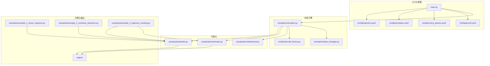
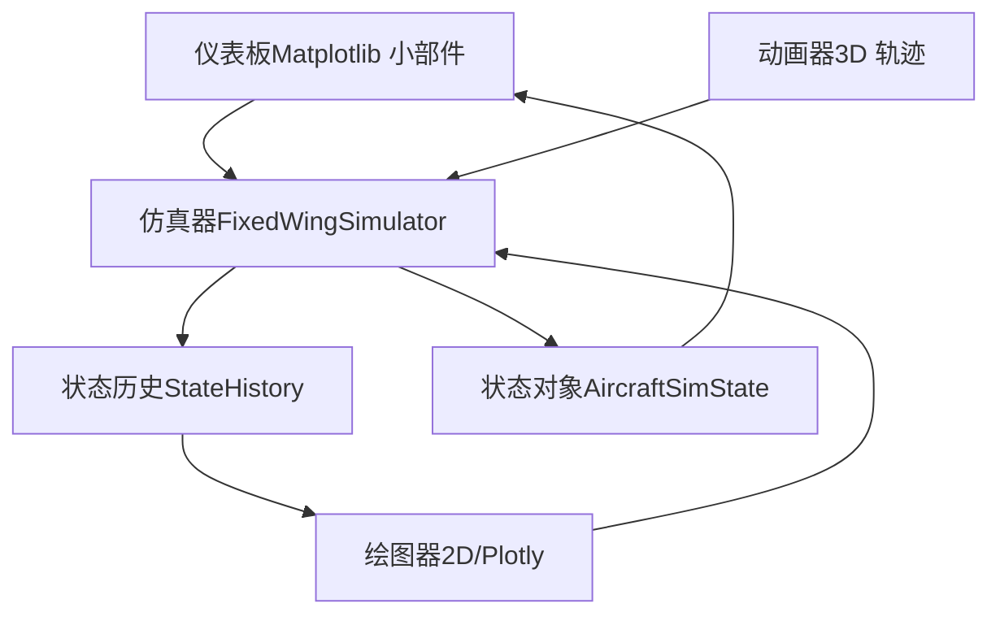
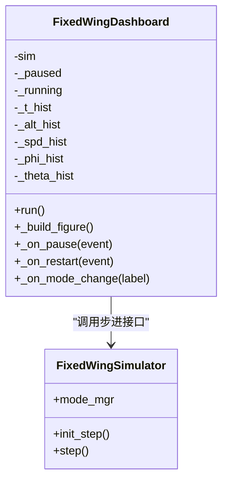
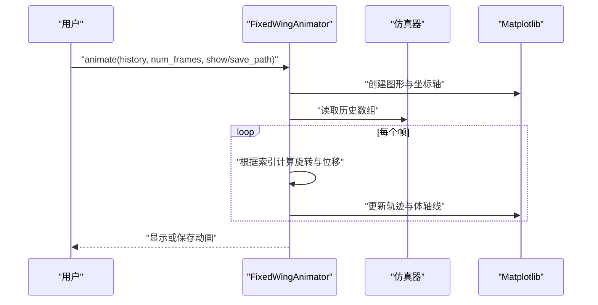
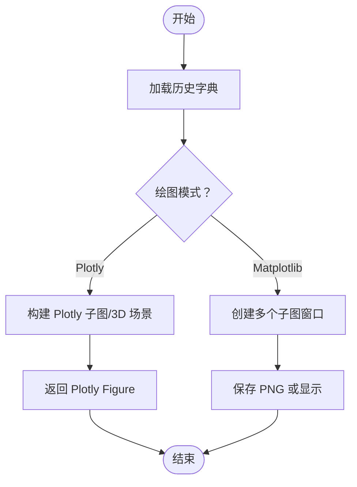
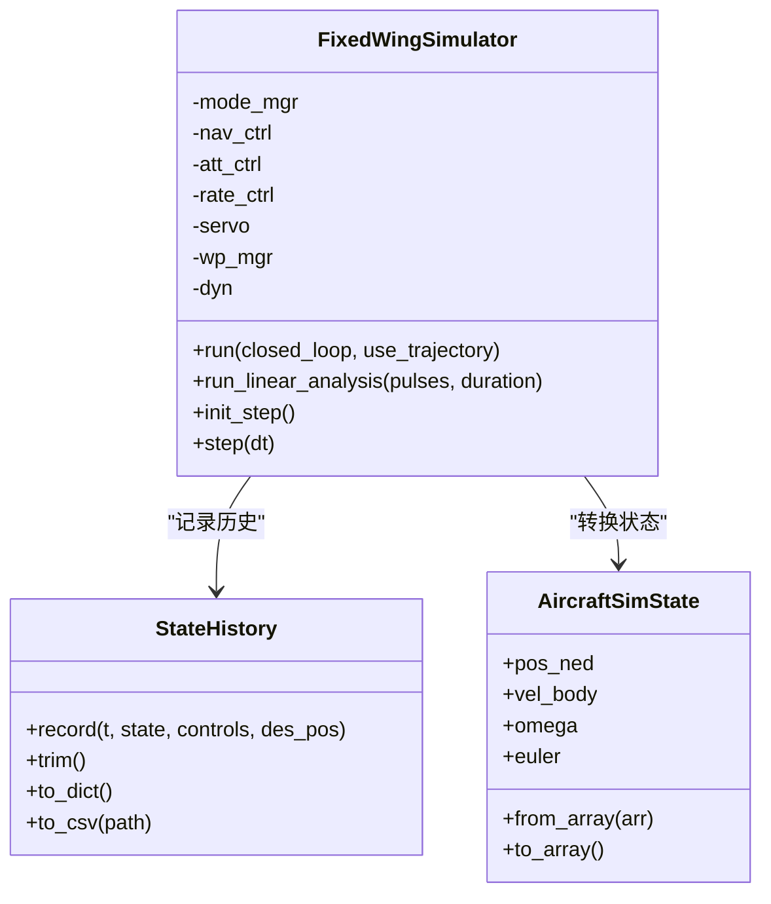
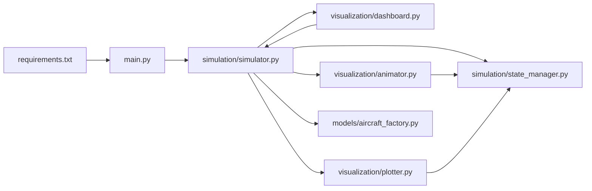

# 仪表板系统

<cite>
**本文引用的文件**
- [dashboard.py](file://src/visualization/dashboard.py)
- [animator.py](file://src/visualization/animator.py)
- [plotter.py](file://src/visualization/plotter.py)
- [simulator.py](file://src/simulation/simulator.py)
- [state_manager.py](file://src/simulation/state_manager.py)
- [aircraft_factory.py](file://src/models/aircraft_factory.py)
- [main.py](file://main.py)
- [requirements.txt](file://requirements.txt)
- [aircraft.yaml](file://config/aircraft.yaml)
- [control_params.yaml](file://config/control_params.yaml)
- [simulation.yaml](file://config/simulation.yaml)
- [trajectory.yaml](file://config/trajectory.yaml)
- [example_1_linear_response.py](file://examples/example_1_linear_response.py)
- [example_2_nonlinear_dynamics.py](file://examples/example_2_nonlinear_dynamics.py)
- [example_3_trajectory_tracking.py](file://examples/example_3_trajectory_tracking.py)
</cite>

## 目录
1. [简介](#简介)
2. [项目结构](#项目结构)
3. [核心组件](#核心组件)
4. [架构总览](#架构总览)
5. [详细组件分析](#详细组件分析)
6. [依赖关系分析](#依赖关系分析)
7. [性能考虑](#性能考虑)
8. [故障排查指南](#故障排查指南)
9. [结论](#结论)
10. [附录](#附录)

## 简介
本文件为固定翼无人机仿真平台的“仪表板系统”架构文档，聚焦于实时数据展示、交互式控制面板与多维度信息聚合。文档从系统设计理念出发，解析可视化子系统如何与仿真引擎协同工作，涵盖数据绑定机制、实时更新策略（基于定时器的增量更新）、UI 组件布局与响应式适配、定制化指南（主题、布局、功能扩展）、性能监控与用户体验优化，以及与外部系统的集成方案（数据导入导出、远程控制接口思路）。

## 项目结构
该仓库采用模块化分层组织：仿真引擎位于 simulation 子系统，模型参数与工厂位于 models，环境与动力学在 dynamics、environment，控制链在 control，规划在 planning，可视化在 visualization，入口脚本在根目录。配置文件集中于 config，示例脚本在 examples，输出结果保存在 output。

图示来源
- [main.py](file://main.py#L98-L145)
- [simulator.py](file://src/simulation/simulator.py#L115-L128)
- [state_manager.py](file://src/simulation/state_manager.py#L95-L193)
- [aircraft_factory.py](file://src/models/aircraft_factory.py#L39-L136)
- [dashboard.py](file://src/visualization/dashboard.py#L28-L167)
- [animator.py](file://src/visualization/animator.py#L14-L150)
- [plotter.py](file://src/visualization/plotter.py#L19-L244)
- [example_1_linear_response.py](file://examples/example_1_linear_response.py#L1-L206)
- [example_2_nonlinear_dynamics.py](file://examples/example_2_nonlinear_dynamics.py#L1-L215)
- [example_3_trajectory_tracking.py](file://examples/example_3_trajectory_tracking.py#L1-L194)

章节来源
- [main.py](file://main.py#L1-L145)
- [requirements.txt](file://requirements.txt#L1-L8)

## 核心组件
- 仪表板（交互式 Matplotlib 小部件）
  - 提供飞行模式选择器、PID 参数滑条、暂停/恢复/重启按钮、实时状态数值读出。
  - 通过仿真器的步进接口进行增量更新，使用定时器驱动刷新。
- 动画器（3D 轨迹动画）
  - 使用 Matplotlib 的 FuncAnimation 实时绘制轨迹与飞机体轴线，支持保存为 GIF。
- 二维绘图器（静态与 Plotly 双模式）
  - 支持 4DOF/6DOF 时间序列图、3D NED 轨迹图；既可生成静态图，也可生成 Plotly 图用于 Web UI。
- 仿真器（FixedWingSimulator）
  - 提供 run()/run_linear_analysis() 批处理运行，init_step()/step() 步进接口，供仪表板实时驱动。
- 状态管理（StateHistory/AircraftSimState）
  - 预分配历史缓冲区，高效记录状态与控制量；支持导出 CSV。
- 飞机配置工厂（AircraftFactory）
  - 合并数据库参数与用户覆盖，生成仿真使用的配置对象。
- 主入口（main.py）
  - 命令行参数解析，装配仿真器并执行不同模式的运行流程。

章节来源
- [dashboard.py](file://src/visualization/dashboard.py#L28-L167)
- [animator.py](file://src/visualization/animator.py#L14-L150)
- [plotter.py](file://src/visualization/plotter.py#L19-L244)
- [simulator.py](file://src/simulation/simulator.py#L115-L642)
- [state_manager.py](file://src/simulation/state_manager.py#L16-L193)
- [aircraft_factory.py](file://src/models/aircraft_factory.py#L39-L136)
- [main.py](file://main.py#L32-L145)

## 架构总览
仪表板系统围绕“仿真引擎—可视化层”的解耦设计展开。仿真引擎负责物理建模与控制链计算，可视化层通过统一的数据接口（历史缓冲、状态对象、CSV 导出）进行展示与交互。实时仪表板通过仿真器的步进接口驱动，形成“仿真—可视化”的事件驱动更新闭环。

图示来源
- [dashboard.py](file://src/visualization/dashboard.py#L59-L110)
- [animator.py](file://src/visualization/animator.py#L25-L150)
- [plotter.py](file://src/visualization/plotter.py#L19-L244)
- [simulator.py](file://src/simulation/simulator.py#L239-L642)
- [state_manager.py](file://src/simulation/state_manager.py#L95-L193)

## 详细组件分析

### 仪表板组件分析（FixedWingDashboard）
- 设计理念
  - 以交互式 Matplotlib 小部件为核心，提供“所见即所得”的实时仿真观测界面。
  - 通过 RadioButtons、Button、Axes 等控件实现飞行模式切换、暂停/恢复、重启等操作。
- 数据绑定与实时更新
  - 使用定时器驱动的函数动画，每帧调用仿真器的步进接口，获取最新状态并更新折线图与文本读出。
  - 历史缓冲采用列表结构，按时间戳追加，折线图自动缩放以适应新数据。
- UI 布局与响应式适配
  - 使用 add_axes 定位各区域，标题、网格、坐标轴标签清晰；文本读出采用等宽字体便于对齐。
  - 按钮与单选框位置固定，保证在不同窗口尺寸下保持可用性。
- 交互逻辑
  - 暂停/恢复切换按钮文本动态更新；重启清空历史并重新初始化仿真器。
  - 飞行模式变更直接转发给仿真器的模式管理器。

图示来源
- [dashboard.py](file://src/visualization/dashboard.py#L28-L167)
- [simulator.py](file://src/simulation/simulator.py#L602-L642)

章节来源
- [dashboard.py](file://src/visualization/dashboard.py#L28-L167)

### 动画器组件分析（FixedWingAnimator）
- 设计理念
  - 在 3D 空间中绘制实际轨迹与飞机体轴线，叠加期望轨迹与航路点，直观呈现跟踪效果。
- 数据绑定与渲染
  - 输入为历史字典，包含时间、位置、姿态与控制面等数组；按帧索引更新轨迹与体轴线。
  - 采用旋转矩阵将体轴线从机体坐标变换到 NED 坐标系，再映射到绘图坐标。
- 性能与导出
  - 支持非阻塞渲染与帧间隔控制；可将动画保存为 GIF 文件。

图示来源
- [animator.py](file://src/visualization/animator.py#L25-L150)

章节来源
- [animator.py](file://src/visualization/animator.py#L14-L150)

### 绘图器组件分析（FixedWingPlotter）
- 设计理念
  - 提供两类绘图能力：Matplotlib 静态图（适合批量输出）与 Plotly 图（适合 Web UI）。
- 数据绑定与布局
  - 4DOF/6DOF 时间序列图采用子图布局，标题与坐标轴标签明确；3D 轨迹图支持起止点与期望轨迹叠加。
- 输出与复用
  - 支持将静态图保存为 PNG；Plotly 图可用于前端集成。

图示来源
- [plotter.py](file://src/visualization/plotter.py#L19-L244)

章节来源
- [plotter.py](file://src/visualization/plotter.py#L19-L244)

### 仿真器与状态管理
- 仿真器（FixedWingSimulator）
  - 提供 run()/run_linear_analysis() 批处理运行，init_step()/step() 用于实时驱动。
  - 内置飞行模式管理器、导航控制器、姿态/速率控制器、舵面混合器与轨迹管理器。
- 状态管理（StateHistory/AircraftSimState）
  - 预分配数组以提升记录效率；支持裁剪尾部未使用空间、导出 CSV。
  - 状态对象封装 12 维状态与派生量（空速、攻角、侧滑角、海拔）。

图示来源
- [simulator.py](file://src/simulation/simulator.py#L115-L642)
- [state_manager.py](file://src/simulation/state_manager.py#L16-L193)

章节来源
- [simulator.py](file://src/simulation/simulator.py#L115-L642)
- [state_manager.py](file://src/simulation/state_manager.py#L16-L193)

### 飞机配置与参数
- 飞机配置工厂（AircraftFactory）
  - 合并数据库默认参数与 YAML 覆盖，生成仿真使用的配置对象。
- 控制参数（control_params.yaml）
  - 包含 PID 参数、限幅、TECS 参数等，用于 ArduPilot 兼容控制链。
- 仿真配置（simulation.yaml）
  - dt、duration、初始条件、风场、日志等。
- 轨迹配置（trajectory.yaml）
  - 轨迹类型、平均速度、航路点与循环模式。

章节来源
- [aircraft_factory.py](file://src/models/aircraft_factory.py#L39-L136)
- [control_params.yaml](file://config/control_params.yaml#L1-L45)
- [simulation.yaml](file://config/simulation.yaml#L1-L30)
- [trajectory.yaml](file://config/trajectory.yaml#L1-L23)

## 依赖关系分析
- 外部依赖
  - NumPy、SciPy、Matplotlib、Plotly、PyYAML、Pandas、pytest。
- 内部模块依赖
  - main.py 依赖 simulation/simulator.py 与 models/aircraft_database。
  - simulator.py 依赖 models、dynamics、environment、control、planning、simulation、utils。
  - visualization/dashboard.py 依赖 simulation/simulator.py 与 matplotlib。
  - visualization/animator.py 与 visualization/plotter.py 依赖 matplotlib/plotly 与 simulation/state_manager。

图示来源
- [requirements.txt](file://requirements.txt#L1-L8)
- [main.py](file://main.py#L28-L145)
- [simulator.py](file://src/simulation/simulator.py#L33-L52)
- [dashboard.py](file://src/visualization/dashboard.py#L18-L26)
- [animator.py](file://src/visualization/animator.py#L44-L47)
- [plotter.py](file://src/visualization/plotter.py#L39-L41)

章节来源
- [requirements.txt](file://requirements.txt#L1-L8)
- [main.py](file://main.py#L28-L145)
- [simulator.py](file://src/simulation/simulator.py#L33-L52)

## 性能考虑
- 实时更新策略
  - 仪表板使用定时器驱动的函数动画，帧间隔由仿真步长决定，避免过度刷新导致卡顿。
  - 折线图采用增量更新与自动缩放，仅在有新增数据时刷新视图。
- 内存与存储
  - StateHistory 预分配数组，记录完成后裁剪尾部，减少内存占用。
  - 支持导出 CSV，便于离线分析与二次开发。
- 渲染性能
  - 动画器与绘图器分别面向实时与批量场景，按需选择后端（Agg/GTK/Tk）与渲染模式。
- 数值稳定性
  - 仿真器在每次步进前检查积分器状态，异常时及时中断并提示，避免无效渲染。

章节来源
- [dashboard.py](file://src/visualization/dashboard.py#L69-L110)
- [state_manager.py](file://src/simulation/state_manager.py#L170-L193)
- [simulator.py](file://src/simulation/simulator.py#L558-L564)

## 故障排查指南
- 仪表板无法启动
  - 检查是否安装 Matplotlib；若缺失则抛出 ImportError。
  - 确认仿真器已正确初始化并调用 init_step() 后再进行 step()。
- 实时更新异常
  - 若 step() 抛出异常，仪表板会停止更新；检查仿真器内部错误日志。
  - 确认定时器间隔与仿真步长一致，避免过快或过慢。
- 动画保存失败
  - 确认 Pillow 可用且路径存在；检查磁盘空间与权限。
- 绘图无输出
  - 非交互后端（Agg）不会弹窗，需显式保存；确认 save_dir 或 show 参数。
- 配置不生效
  - 检查 YAML 文件路径与键名；注意控制参数与仿真参数的优先级覆盖顺序。

章节来源
- [dashboard.py](file://src/visualization/dashboard.py#L42-L44)
- [dashboard.py](file://src/visualization/dashboard.py#L73-L78)
- [animator.py](file://src/visualization/animator.py#L144-L146)
- [plotter.py](file://src/visualization/plotter.py#L186-L195)
- [aircraft_factory.py](file://src/models/aircraft_factory.py#L63-L74)

## 结论
仪表板系统通过“仿真引擎—可视化层”的清晰分层，实现了高内聚、低耦合的实时可视化方案。其交互式仪表板、3D 动画与多维绘图共同构成完整的观测与分析工具集。结合预分配的历史缓冲与 CSV 导出能力，系统既能满足实时观测需求，也能支撑离线分析与二次开发。未来可在现有基础上扩展 Web 界面、远程控制接口与数据导入导出协议，进一步增强可扩展性与集成能力。

## 附录

### 实时数据展示与交互式控制面板
- 实时数据展示
  - 仪表板通过折线图与文本读出展示高度、空速、姿态角与当前模式；随仿真推进动态更新。
- 交互式控制面板
  - 飞行模式选择器、暂停/恢复/重启按钮、数值读出区域布局清晰，便于操作。

章节来源
- [dashboard.py](file://src/visualization/dashboard.py#L114-L167)

### 多维度信息聚合
- 6DOF 时间序列图：速度、角速率、姿态、控制输入等。
- 3D NED 轨迹图：实际轨迹与期望轨迹对比。
- 4DOF 线性分析图：纵向状态与升降舵输入响应。

章节来源
- [plotter.py](file://src/visualization/plotter.py#L23-L111)
- [plotter.py](file://src/visualization/plotter.py#L114-L154)

### 数据绑定机制与实时更新策略
- 数据绑定
  - 仪表板读取仿真器的状态对象与历史缓冲；动画器与绘图器读取历史字典。
- 实时更新
  - 仪表板使用定时器驱动的函数动画；仿真器提供 init_step()/step() 接口；动画器与绘图器按帧或按需刷新。

章节来源
- [dashboard.py](file://src/visualization/dashboard.py#L69-L110)
- [simulator.py](file://src/simulation/simulator.py#L602-L642)
- [animator.py](file://src/visualization/animator.py#L107-L142)
- [plotter.py](file://src/visualization/plotter.py#L161-L244)

### UI 组件布局与响应式适配
- 布局设计
  - 使用 add_axes 精确定位各区域；标题、网格、坐标轴标签统一风格。
- 响应式适配
  - 固定控件尺寸与间距，保证在不同分辨率下可用；文本采用等宽字体提高可读性。

章节来源
- [dashboard.py](file://src/visualization/dashboard.py#L114-L167)

### 仪表板定制指南
- 主题设置
  - 可通过 Matplotlib/Plotly 的 rcParams 或主题样式文件调整颜色与字体。
- 布局调整
  - 修改 add_axes 的位置与尺寸参数；增加/删除子图区域。
- 功能扩展
  - 新增控件（滑条、下拉框）并绑定到仿真器参数；扩展绘图器以支持新的数据通道。
- 数据导入导出
  - 使用 StateHistory.to_csv 导出完整历史；Plotly 图可嵌入 Web UI。
- 远程控制接口
  - 通过命令行参数或配置文件切换仿真模式与参数；可扩展为 REST 接口（建议在上层应用层实现）。

章节来源
- [state_manager.py](file://src/simulation/state_manager.py#L179-L193)
- [plotter.py](file://src/visualization/plotter.py#L19-L244)
- [main.py](file://main.py#L32-L95)

### 示例参考
- 线性分析与对比：演示开环与闭环响应对比，并保存 CSV 与图片。
- 非线性动态：展示开环与闭环滚转响应对比。
- 轨迹跟踪：AUTO 模式下的 3D 轨迹与 6DOF 时间序列图。

章节来源
- [example_1_linear_response.py](file://examples/example_1_linear_response.py#L83-L206)
- [example_2_nonlinear_dynamics.py](file://examples/example_2_nonlinear_dynamics.py#L77-L215)
- [example_3_trajectory_tracking.py](file://examples/example_3_trajectory_tracking.py#L67-L194)