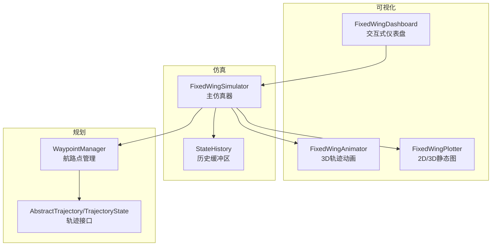
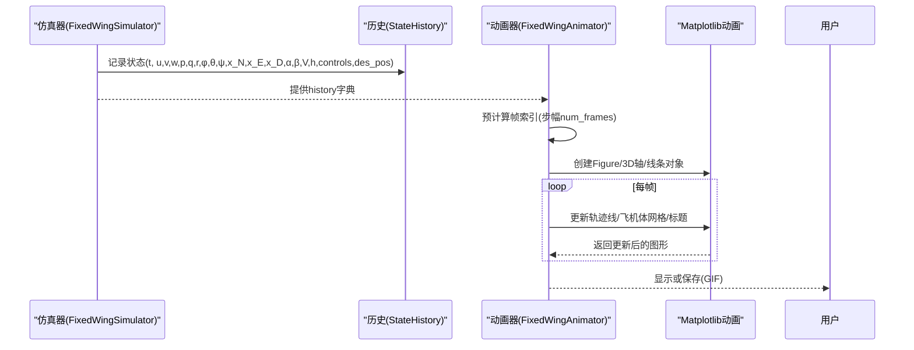
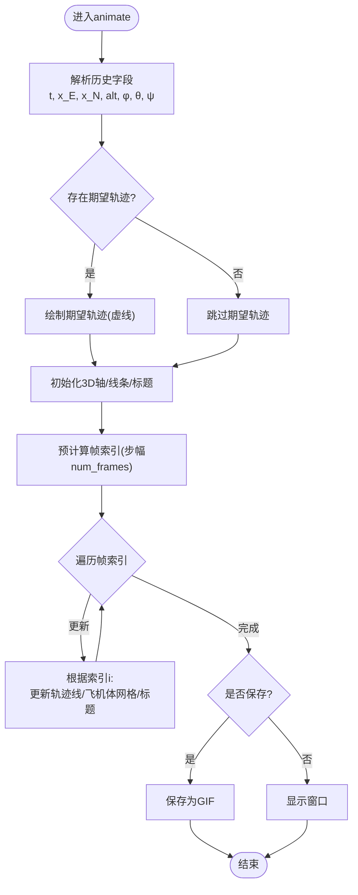
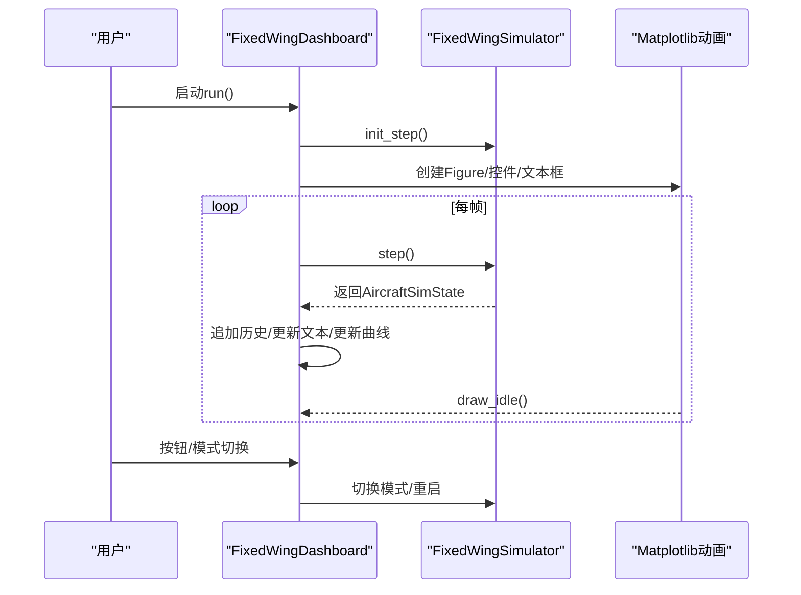
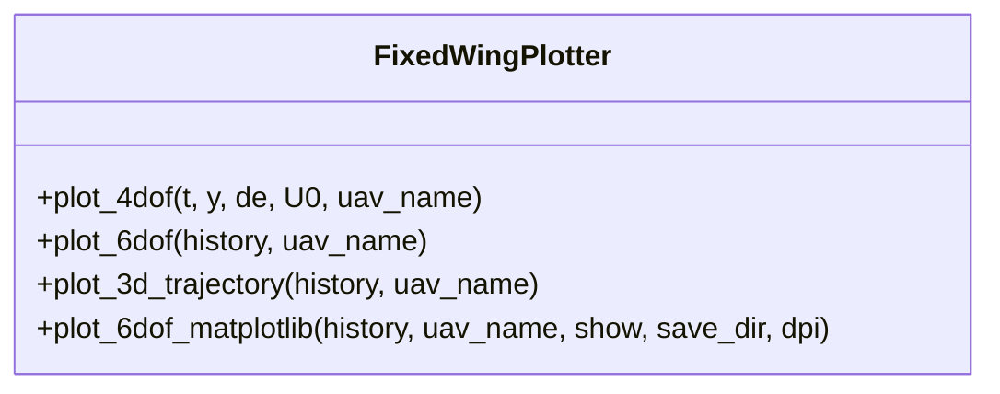
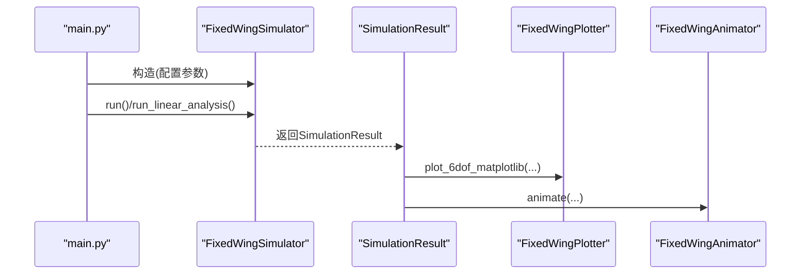
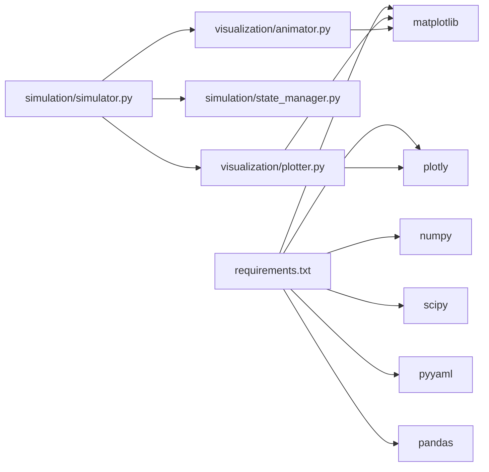

# 动画播放器

<cite>
**本文引用的文件**
- [src/visualization/animator.py](file://src/visualization/animator.py)
- [src/visualization/dashboard.py](file://src/visualization/dashboard.py)
- [src/visualization/plotter.py](file://src/visualization/plotter.py)
- [src/simulation/simulator.py](file://src/simulation/simulator.py)
- [src/simulation/state_manager.py](file://src/simulation/state_manager.py)
- [src/planning/trajectory_base.py](file://src/planning/trajectory_base.py)
- [src/planning/waypoint_manager.py](file://src/planning/waypoint_manager.py)
- [examples/example_3_trajectory_tracking.py](file://examples/example_3_trajectory_tracking.py)
- [examples/example_4_circuit_flight.py](file://examples/example_4_circuit_flight.py)
- [main.py](file://main.py)
- [config/simulation.yaml](file://config/simulation.yaml)
- [config/control_params.yaml](file://config/control_params.yaml)
- [config/trajectory.yaml](file://config/trajectory.yaml)
- [requirements.txt](file://requirements.txt)
</cite>

## 目录
1. [简介](#简介)
2. [项目结构](#项目结构)
3. [核心组件](#核心组件)
4. [架构总览](#架构总览)
5. [详细组件分析](#详细组件分析)
6. [依赖分析](#依赖分析)
7. [性能考虑](#性能考虑)
8. [故障排除指南](#故障排除指南)
9. [结论](#结论)
10. [附录](#附录)

## 简介
本技术文档围绕“动画播放器”主题，系统阐述固定翼飞行模拟器中的动画可视化子系统，包括：
- 如何将仿真历史数据转换为动态可视化效果（3D轨迹、姿态、控制面与期望轨迹对比）；
- 动画渲染的核心算法（时间轴同步、帧率控制、步进采样、坐标系转换与视角控制）；
- 3D场景构建（NED坐标系、Matplotlib/Plotly渲染管线、飞机体网格绘制）；
- 动画配置选项与自定义参数（帧步幅、显示/保存、标题与标注）；
- 性能优化策略（预计算帧索引、非位移更新、后端选择、资源释放）；
- 将动画集成到Web界面或桌面应用的方法（Plotly图表与Matplotlib动画）。

## 项目结构
动画播放器位于可视化模块中，与仿真引擎、轨迹规划、状态管理紧密协作：
- 可视化层：动画器、仪表盘、绘图器（Matplotlib/Plotly）
- 仿真层：仿真器、状态容器与历史缓冲区
- 规划层：轨迹抽象与航路点管理
- 配置层：仿真、控制、轨迹配置文件

**图表来源**
- [src/visualization/animator.py](file://src/visualization/animator.py#L14-L150)
- [src/visualization/dashboard.py](file://src/visualization/dashboard.py#L28-L167)
- [src/visualization/plotter.py](file://src/visualization/plotter.py#L19-L244)
- [src/simulation/simulator.py](file://src/simulation/simulator.py#L115-L642)
- [src/simulation/state_manager.py](file://src/simulation/state_manager.py#L95-L193)
- [src/planning/waypoint_manager.py](file://src/planning/waypoint_manager.py#L20-L208)
- [src/planning/trajectory_base.py](file://src/planning/trajectory_base.py#L16-L47)

**章节来源**
- [src/visualization/animator.py](file://src/visualization/animator.py#L1-L150)
- [src/visualization/dashboard.py](file://src/visualization/dashboard.py#L1-L167)
- [src/visualization/plotter.py](file://src/visualization/plotter.py#L1-L244)
- [src/simulation/simulator.py](file://src/simulation/simulator.py#L1-L642)
- [src/simulation/state_manager.py](file://src/simulation/state_manager.py#L1-L193)
- [src/planning/waypoint_manager.py](file://src/planning/waypoint_manager.py#L1-L208)
- [src/planning/trajectory_base.py](file://src/planning/trajectory_base.py#L1-L47)

## 核心组件
- FixedWingAnimator：基于Matplotlib的3D轨迹动画，支持实际轨迹、期望轨迹、航路点与飞机体网格绘制，可保存为GIF。
- FixedWingDashboard：交互式实时仪表盘，支持飞行模式切换、PID参数调节、暂停/重启、实时曲线与数值读出。
- FixedWingPlotter：同时支持Matplotlib静态图与Plotly交互图，用于2D时域与3D轨迹展示。
- FixedWingSimulator：主仿真器，生成StateHistory，提供可视化入口；支持步进式API供UI集成。
- StateHistory：高效的历史缓冲区，记录所有状态与控制通道，导出字典供动画/绘图使用。
- WaypointManager/AbstractTrajectory：航路点管理与轨迹接口，提供期望状态查询，驱动闭环控制与动画目标。

**章节来源**
- [src/visualization/animator.py](file://src/visualization/animator.py#L14-L150)
- [src/visualization/dashboard.py](file://src/visualization/dashboard.py#L28-L167)
- [src/visualization/plotter.py](file://src/visualization/plotter.py#L19-L244)
- [src/simulation/simulator.py](file://src/simulation/simulator.py#L59-L110)
- [src/simulation/state_manager.py](file://src/simulation/state_manager.py#L95-L193)
- [src/planning/waypoint_manager.py](file://src/planning/waypoint_manager.py#L20-L208)
- [src/planning/trajectory_base.py](file://src/planning/trajectory_base.py#L16-L47)

## 架构总览
动画播放器通过“数据-渲染-控制”的分层架构工作：
- 数据层：StateHistory提供时间序列状态（位置、姿态、空速、控制面等），可选包含期望轨迹。
- 渲染层：Matplotlib/Plotly分别负责动画与静态/交互式图表。
- 控制层：仿真器在运行过程中持续记录状态，动画器按帧步幅抽取历史进行渲染。

**图表来源**
- [src/simulation/simulator.py](file://src/simulation/simulator.py#L542-L556)
- [src/simulation/state_manager.py](file://src/simulation/state_manager.py#L124-L174)
- [src/visualization/animator.py](file://src/visualization/animator.py#L104-L150)

## 详细组件分析

### 组件A：FixedWingAnimator（3D轨迹动画）
- 输入：history字典（时间、NED位置、姿态、空速、控制面、期望轨迹等）
- 关键流程：
  - 解析历史字段，判断是否存在期望轨迹；
  - 初始化3D轴与线条（实际轨迹、飞机体网格、期望轨迹）；
  - 定义旋转矩阵（体坐标→NED），将机体系几何映射到NED坐标；
  - 预计算帧索引（按num_frames步幅），避免每步都渲染全序列；
  - update函数按当前帧索引更新轨迹与飞机体网格，刷新标题信息。
- 输出：显示或保存GIF动画。

**图表来源**
- [src/visualization/animator.py](file://src/visualization/animator.py#L25-L150)

**章节来源**
- [src/visualization/animator.py](file://src/visualization/animator.py#L14-L150)

### 组件B：FixedWingDashboard（交互式仪表盘）
- 功能：实时显示高度、空速曲线，数值面板读出瞬时状态，按钮控制（暂停/重启），飞行模式选择。
- 实现要点：
  - 使用Matplotlib动画循环，按仿真步长间隔调用step()；
  - 将历史数据追加到列表，更新折线与文本框；
  - 通过FlightModeManager切换模式，实时生效。

**图表来源**
- [src/visualization/dashboard.py](file://src/visualization/dashboard.py#L59-L111)
- [src/simulation/simulator.py](file://src/simulation/simulator.py#L602-L642)

**章节来源**
- [src/visualization/dashboard.py](file://src/visualization/dashboard.py#L28-L167)
- [src/simulation/simulator.py](file://src/simulation/simulator.py#L602-L642)

### 组件C：FixedWingPlotter（2D/3D静态图与Plotly图表）
- Matplotlib版本：输出多窗口静态图（位置/速度、姿态/角速率、控制输入），可保存PNG。
- Plotly版本：生成交互式子图（4DOF/6DOF时域）与3D轨迹图，适配Web界面。

**图表来源**
- [src/visualization/plotter.py](file://src/visualization/plotter.py#L19-L244)

**章节来源**
- [src/visualization/plotter.py](file://src/visualization/plotter.py#L1-L244)

### 组件D：FixedWingSimulator（仿真与可视化入口）
- 提供run()/run_linear_analysis()两种模式；
- 在run()中构建ODE、控制链与轨迹，记录StateHistory；
- 提供visualize()快速调用Plotter与Animator；
- 提供init_step()/step()供UI步进式集成。

**图表来源**
- [src/simulation/simulator.py](file://src/simulation/simulator.py#L92-L109)
- [main.py](file://main.py#L114-L141)

**章节来源**
- [src/simulation/simulator.py](file://src/simulation/simulator.py#L59-L110)
- [main.py](file://main.py#L98-L145)

### 组件E：StateHistory（历史缓冲区）
- 预分配数组，记录状态与控制通道；
- 支持trim()裁剪尾部未使用空间；
- to_dict()导出字典供动画/绘图使用。

**章节来源**
- [src/simulation/state_manager.py](file://src/simulation/state_manager.py#L95-L193)

### 组件F：轨迹与航路点（WaypointManager/AbstractTrajectory）
- WaypointManager管理NED航路点，按类型构建轨迹对象；
- AbstractTrajectory提供desired_state(t)接口，返回TrajectoryState（位置、速度、加速度、偏航/偏航率）。

**章节来源**
- [src/planning/waypoint_manager.py](file://src/planning/waypoint_manager.py#L20-L208)
- [src/planning/trajectory_base.py](file://src/planning/trajectory_base.py#L16-L47)

## 依赖分析
- 可视化依赖：NumPy、Matplotlib、Plotly；
- 仿真依赖：SciPy（数值积分）、PyYAML（配置加载）、Pandas（示例CSV）；
- 动画播放器直接依赖StateHistory与Matplotlib/Plotly。

**图表来源**
- [requirements.txt](file://requirements.txt#L1-L8)
- [src/simulation/simulator.py](file://src/simulation/simulator.py#L33-L52)
- [src/visualization/plotter.py](file://src/visualization/plotter.py#L39-L40)
- [src/visualization/animator.py](file://src/visualization/animator.py#L44-L46)

**章节来源**
- [requirements.txt](file://requirements.txt#L1-L8)
- [src/simulation/simulator.py](file://src/simulation/simulator.py#L33-L52)

## 性能考虑
- 帧缓存与步幅：通过预计算帧索引（按num_frames步幅）减少渲染开销，避免每步更新全序列。
- 非位移更新：仅更新线条数据（set_data/set_3d_properties），不重建对象，降低GC压力。
- 后端选择：Agg后端用于批量渲染，TkAgg用于交互；根据用途选择合适后端。
- 资源释放：非交互模式下关闭所有图形窗口，释放内存。
- 内存优化：StateHistory预分配数组，trim()裁剪尾部；CSV导出避免重复拷贝。

**章节来源**
- [src/visualization/animator.py](file://src/visualization/animator.py#L104-L150)
- [src/visualization/dashboard.py](file://src/visualization/dashboard.py#L106-L111)
- [src/simulation/state_manager.py](file://src/simulation/state_manager.py#L170-L193)
- [examples/example_3_trajectory_tracking.py](file://examples/example_3_trajectory_tracking.py#L28-L31)

## 故障排除指南
- 无Matplotlib/Plotly：导入异常时检查依赖安装与后端可用性。
- 动画卡顿：检查num_frames与interval设置，适当增大步幅或降低帧率。
- 期望轨迹未显示：确认history中存在期望轨迹字段且非全零。
- 交互仪表盘无响应：确保使用交互后端（TkAgg），并正确初始化仿真器。
- 飞行动态异常：检查控制参数与风场配置，必要时调整TECS与PID参数。

**章节来源**
- [src/visualization/dashboard.py](file://src/visualization/dashboard.py#L42-L44)
- [src/visualization/animator.py](file://src/visualization/animator.py#L56-L67)
- [src/visualization/dashboard.py](file://src/visualization/dashboard.py#L61-L61)

## 结论
动画播放器以StateHistory为核心数据源，结合Matplotlib/Plotly渲染管线，实现了从仿真历史到动态可视化的完整链路。通过帧步幅、非重建更新与后端选择等策略，兼顾了实时性与性能。配合仪表盘与Plotly图表，可无缝集成到桌面应用与Web界面，满足教学演示与工程分析的多样化需求。

## 附录

### 动画配置选项与自定义参数
- FixedWingAnimator.animate
  - history：StateHistory.to_dict()输出
  - uav_name：显示名称
  - num_frames：动画步幅（每N步更新一次）
  - show：是否显示窗口
  - save_path：保存路径（GIF）
- FixedWingDashboard.run
  - max_steps：最大历史长度
  - 交互控件：按钮、单选框、文本框
- FixedWingPlotter
  - Matplotlib版本：可设置dpi、保存目录
  - Plotly版本：返回可嵌入Web的Figure对象

**章节来源**
- [src/visualization/animator.py](file://src/visualization/animator.py#L25-L43)
- [src/visualization/dashboard.py](file://src/visualization/dashboard.py#L41-L60)
- [src/visualization/plotter.py](file://src/visualization/plotter.py#L161-L180)

### 动画集成到Web界面或桌面应用
- Web界面：使用Plotly图表（FixedWingPlotter.plot_4dof/plot_6dof/plot_3d_trajectory），将Figure对象嵌入前端。
- 桌面应用：使用Matplotlib动画（FixedWingAnimator.animate）或交互仪表盘（FixedWingDashboard.run）。

**章节来源**
- [src/visualization/plotter.py](file://src/visualization/plotter.py#L19-L111)
- [src/visualization/animator.py](file://src/visualization/animator.py#L137-L150)
- [src/visualization/dashboard.py](file://src/visualization/dashboard.py#L59-L111)

### 示例脚本与配置参考
- 示例脚本：轨迹跟踪与环形航线演示，展示如何保存CSV与图像。
- 配置文件：仿真、控制、轨迹参数，决定仿真步长、风场、航路点与轨迹类型。

**章节来源**
- [examples/example_3_trajectory_tracking.py](file://examples/example_3_trajectory_tracking.py#L72-L194)
- [examples/example_4_circuit_flight.py](file://examples/example_4_circuit_flight.py#L81-L275)
- [config/simulation.yaml](file://config/simulation.yaml#L1-L30)
- [config/control_params.yaml](file://config/control_params.yaml#L1-L45)
- [config/trajectory.yaml](file://config/trajectory.yaml#L1-L23)