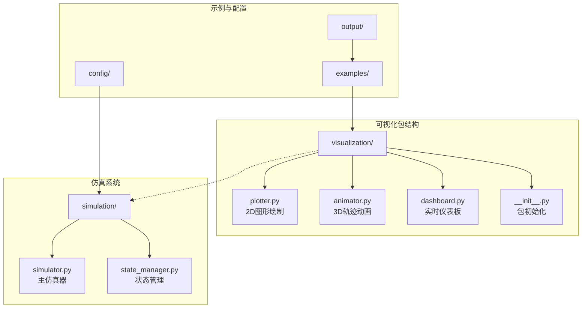
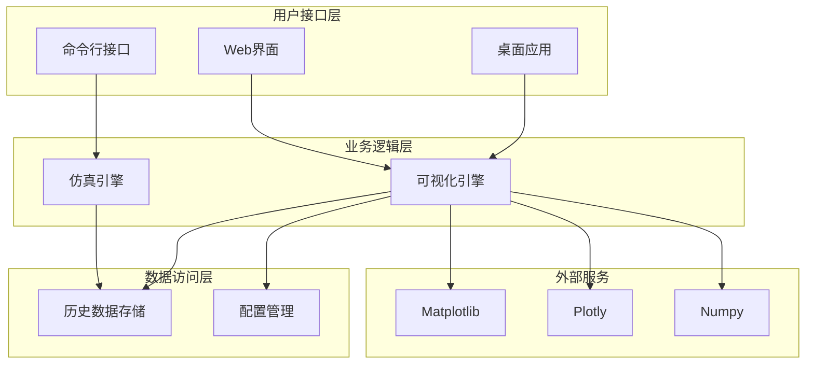
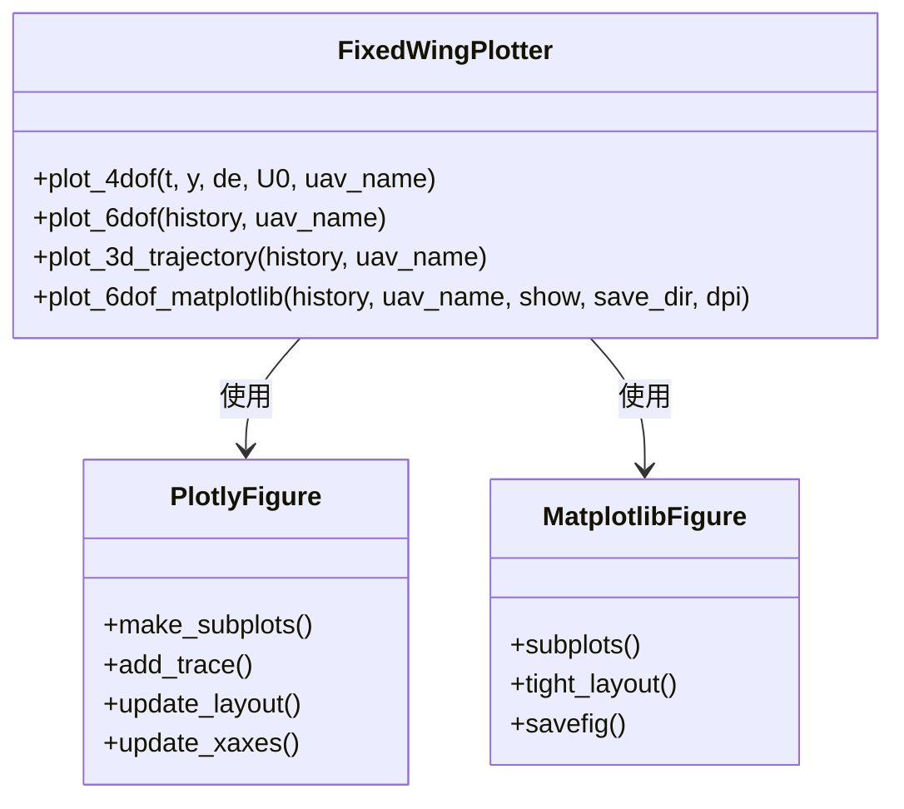
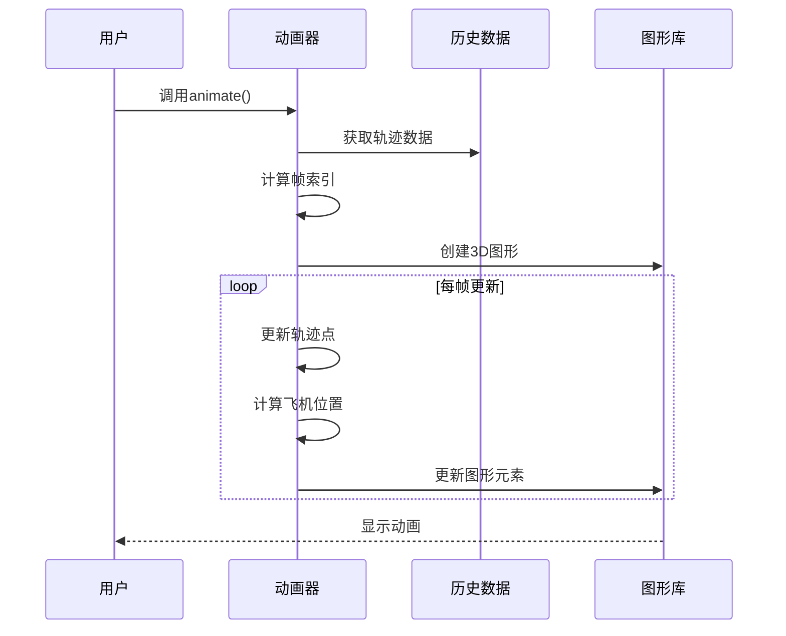
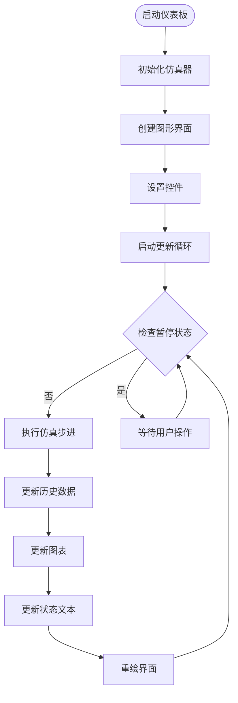
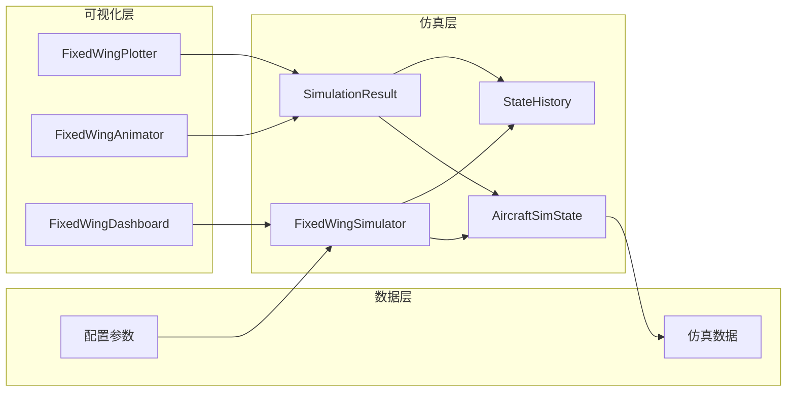

# 可视化系统

<cite>
**本文档引用的文件**
- [src/visualization/__init__.py](file://src/visualization/__init__.py)
- [src/visualization/animator.py](file://src/visualization/animator.py)
- [src/visualization/dashboard.py](file://src/visualization/dashboard.py)
- [src/visualization/plotter.py](file://src/visualization/plotter.py)
- [src/simulation/simulator.py](file://src/simulation/simulator.py)
- [src/simulation/state_manager.py](file://src/simulation/state_manager.py)
- [examples/example_1_linear_response.py](file://examples/example_1_linear_response.py)
- [examples/example_2_nonlinear_dynamics.py](file://examples/example_2_nonlinear_dynamics.py)
- [config/simulation.yaml](file://config/simulation.yaml)
- [config/control_params.yaml](file://config/control_params.yaml)
- [main.py](file://main.py)
</cite>

## 目录
1. [简介](#简介)
2. [项目结构](#项目结构)
3. [核心组件](#核心组件)
4. [架构概览](#架构概览)
5. [详细组件分析](#详细组件分析)
6. [依赖关系分析](#依赖关系分析)
7. [性能考虑](#性能考虑)
8. [故障排除指南](#故障排除指南)
9. [结论](#结论)
10. [附录](#附录)

## 简介

固定翼飞行模拟器可视化系统是一个完整的数据可视化解决方案，专为固定翼无人机仿真而设计。该系统提供了多种可视化功能，包括2D图形绘制、3D轨迹显示、实时仪表板监控以及性能曲线分析。

系统的核心目标是将复杂的飞行仿真数据转换为直观的可视化效果，帮助用户理解和分析固定翼无人机的动态行为。通过集成多种可视化技术，用户可以同时观察飞行器的实时状态、历史轨迹以及性能指标。

## 项目结构

可视化系统位于`src/visualization/`目录下，采用模块化设计，每个组件都有明确的职责分工：

**图表来源**
- [src/visualization/__init__.py](file://src/visualization/__init__.py#L1-L8)
- [src/visualization/plotter.py](file://src/visualization/plotter.py#L1-L244)
- [src/visualization/animator.py](file://src/visualization/animator.py#L1-L150)
- [src/visualization/dashboard.py](file://src/visualization/dashboard.py#L1-L167)

**章节来源**
- [src/visualization/__init__.py](file://src/visualization/__init__.py#L1-L8)
- [src/visualization/plotter.py](file://src/visualization/plotter.py#L1-L244)
- [src/visualization/animator.py](file://src/visualization/animator.py#L1-L150)
- [src/visualization/dashboard.py](file://src/visualization/dashboard.py#L1-L167)

## 核心组件

可视化系统由三个主要组件构成，每个组件都针对特定的可视化需求进行了优化：

### FixedWingPlotter - 2D图形绘制器
负责创建静态和交互式的2D图表，支持多种飞行参数的时域分析。该组件能够生成位置、速度、姿态角、控制输入等多维度的图表。

### FixedWingAnimator - 3D轨迹动画器  
提供实时的3D轨迹动画功能，展示飞行器的历史轨迹和当前状态。支持自定义更新频率和动画保存功能。

### FixedWingDashboard - 实时仪表板
构建交互式的实时监控界面，允许用户调整飞行模式、PID参数，并实时查看飞行状态数据。

**章节来源**
- [src/visualization/plotter.py](file://src/visualization/plotter.py#L19-L244)
- [src/visualization/animator.py](file://src/visualization/animator.py#L14-L150)
- [src/visualization/dashboard.py](file://src/visualization/dashboard.py#L28-L167)

## 架构概览

可视化系统采用分层架构设计，确保了良好的模块化和可扩展性：

**图表来源**
- [src/simulation/simulator.py](file://src/simulation/simulator.py#L59-L110)
- [src/visualization/plotter.py](file://src/visualization/plotter.py#L19-L244)
- [src/visualization/animator.py](file://src/visualization/animator.py#L14-L150)

系统通过`SimulationResult`类实现了可视化功能的统一入口点，确保所有可视化操作都基于标准化的历史数据格式。

**章节来源**
- [src/simulation/simulator.py](file://src/simulation/simulator.py#L59-L110)

## 详细组件分析

### 2D图形绘制系统

FixedWingPlotter组件提供了两种不同的图形绘制后端，以适应不同的使用场景：

#### Plotly后端（Web界面兼容）
- 支持交互式图表
- 自动缩放和图例功能
- 适合Web界面集成

#### Matplotlib后端（桌面应用）
- 支持高分辨率PNG导出
- 批量处理模式
- 适合离线分析

**图表来源**
- [src/visualization/plotter.py](file://src/visualization/plotter.py#L19-L244)

**章节来源**
- [src/visualization/plotter.py](file://src/visualization/plotter.py#L19-L244)

### 3D轨迹动画系统

FixedWingAnimator组件实现了高效的3D轨迹动画功能，具有以下特点：

- **实时更新**：基于时间步长的动画更新机制
- **轨迹追踪**：动态显示历史轨迹的增长过程
- **飞机模型**：精确的固定翼飞机几何表示
- **性能优化**：帧索引预计算和增量更新

**图表来源**
- [src/visualization/animator.py](file://src/visualization/animator.py#L25-L150)

**章节来源**
- [src/visualization/animator.py](file://src/visualization/animator.py#L14-L150)

### 实时仪表板系统

FixedWingDashboard组件提供了完整的实时监控界面：

- **飞行模式控制**：下拉菜单切换不同飞行模式
- **PID参数调节**：滑块实时调整控制器参数
- **状态监控**：实时数值显示关键飞行参数
- **交互控制**：暂停/恢复/重启按钮

**图表来源**
- [src/visualization/dashboard.py](file://src/visualization/dashboard.py#L59-L111)

**章节来源**
- [src/visualization/dashboard.py](file://src/visualization/dashboard.py#L28-L167)

## 依赖关系分析

可视化系统与仿真系统的集成关系如下：

**图表来源**
- [src/simulation/simulator.py](file://src/simulation/simulator.py#L59-L110)
- [src/simulation/state_manager.py](file://src/simulation/state_manager.py#L95-L193)

**章节来源**
- [src/simulation/simulator.py](file://src/simulation/simulator.py#L59-L110)
- [src/simulation/state_manager.py](file://src/simulation/state_manager.py#L95-L193)

## 性能考虑

### 内存管理策略

系统采用了多种内存优化技术：

1. **预分配缓冲区**：StateHistory类预先分配固定大小的NumPy数组
2. **按需记录**：只在需要时扩展历史数据
3. **自动清理**：动画完成后自动释放图形资源

### 性能优化技术

- **帧索引预计算**：避免重复计算动画帧索引
- **增量更新**：只更新变化的图形元素
- **缓存机制**：使用Matplotlib的cache_frame_data参数

### 批量处理能力

系统支持大规模数据的高效处理：

- **CSV导出**：完整的状态历史数据导出功能
- **批量图表生成**：支持多个仿真结果的批量可视化
- **非交互模式**：支持无GUI的批处理模式

**章节来源**
- [src/simulation/state_manager.py](file://src/simulation/state_manager.py#L95-L193)
- [src/visualization/animator.py](file://src/visualization/animator.py#L104-L142)

## 故障排除指南

### 常见问题及解决方案

#### Matplotlib相关问题
- **问题**：GUI窗口无法显示或显示异常
- **解决方案**：检查matplotlib后端配置，确保使用合适的GUI后端

#### 内存不足问题
- **问题**：长时间运行导致内存占用过高
- **解决方案**：定期调用StateHistory.trim()方法清理未使用的缓冲区

#### 动画性能问题
- **问题**：动画播放卡顿或帧率过低
- **解决方案**：调整num_frames参数，增加更新间隔

#### 数据导出问题
- **问题**：CSV文件导出失败
- **解决方案**：检查输出目录权限和磁盘空间

**章节来源**
- [src/visualization/dashboard.py](file://src/visualization/dashboard.py#L69-L110)
- [src/simulation/state_manager.py](file://src/simulation/state_manager.py#L170-L193)

## 结论

固定翼飞行模拟器可视化系统提供了一个完整、高效且易于使用的数据可视化解决方案。通过模块化的架构设计和多种可视化技术的集成，系统能够满足从简单数据分析到复杂实时监控的各种需求。

系统的主要优势包括：
- **多功能性**：支持2D图表、3D动画和实时仪表板
- **高性能**：优化的内存管理和渲染算法
- **易用性**：简洁的API和丰富的配置选项
- **可扩展性**：模块化设计便于功能扩展

未来的发展方向包括增强Web界面支持、添加更多可视化类型以及进一步优化性能表现。

## 附录

### 配置选项

系统支持多种配置选项来定制可视化行为：

- **仿真配置**：通过simulation.yaml文件配置仿真参数
- **控制参数**：通过control_params.yaml文件调整控制器设置
- **可视化参数**：通过代码参数控制图表样式和行为

### 使用示例

系统提供了完整的使用示例，展示了各种可视化功能的实际应用：

- **线性响应分析**：比较开环和闭环系统的响应特性
- **非线性动力学分析**：展示6自由度非线性仿真结果
- **轨迹跟踪演示**：验证路径规划和跟踪算法的有效性

**章节来源**
- [config/simulation.yaml](file://config/simulation.yaml#L1-L30)
- [config/control_params.yaml](file://config/control_params.yaml#L1-L45)
- [examples/example_1_linear_response.py](file://examples/example_1_linear_response.py#L1-L206)
- [examples/example_2_nonlinear_dynamics.py](file://examples/example_2_nonlinear_dynamics.py#L1-L215)