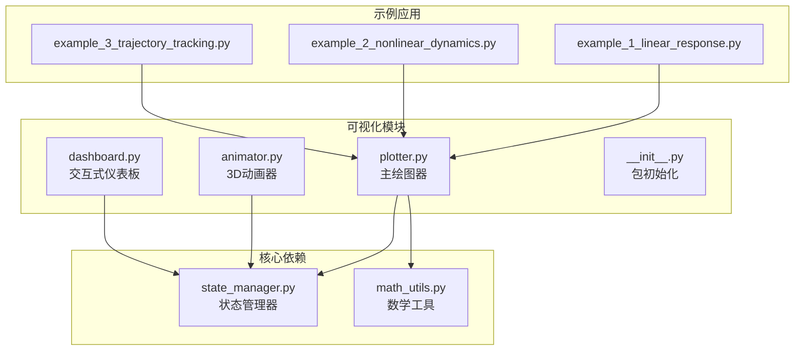
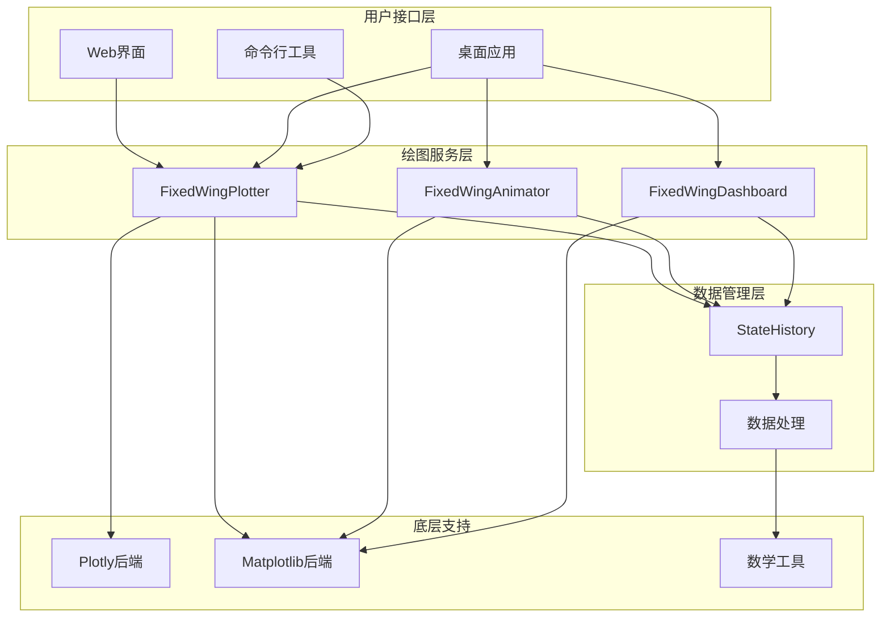
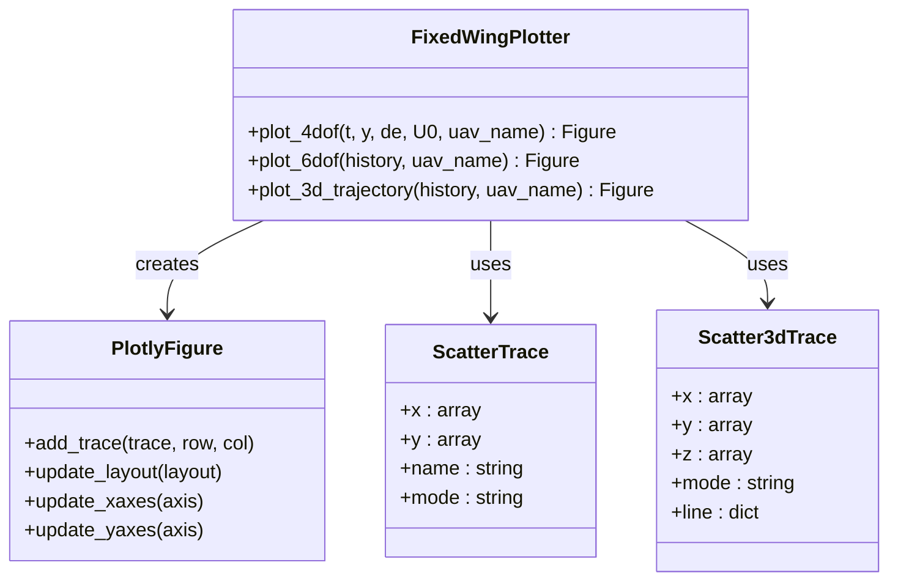
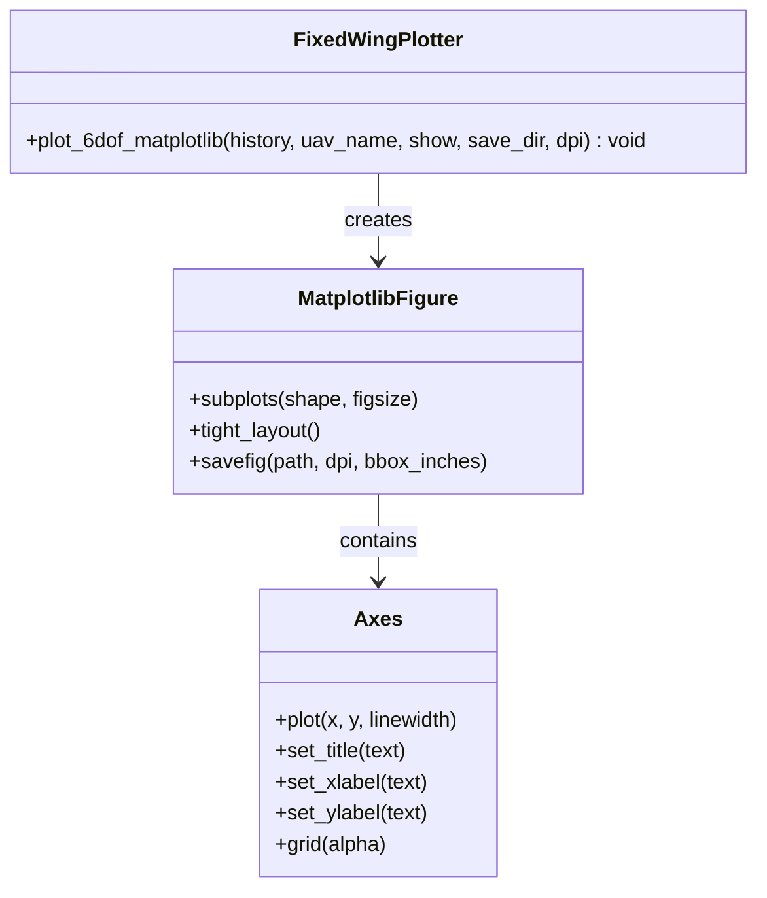
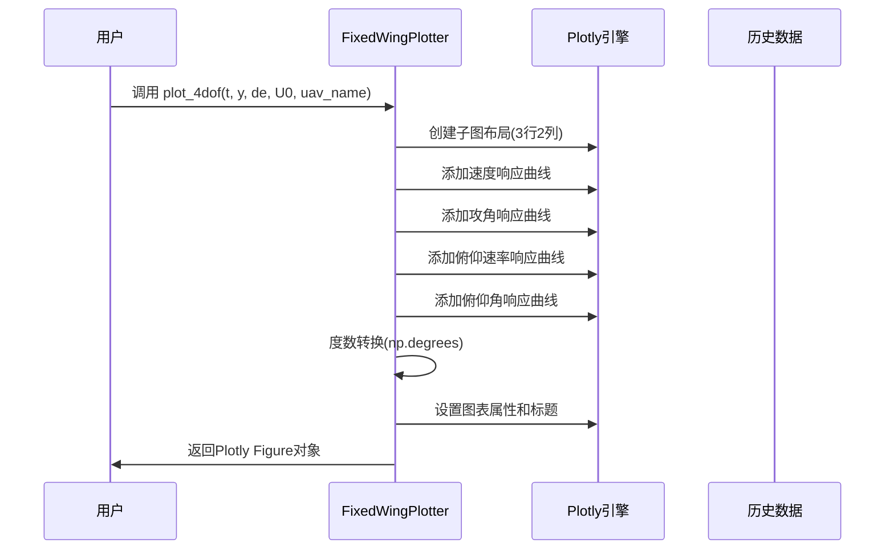
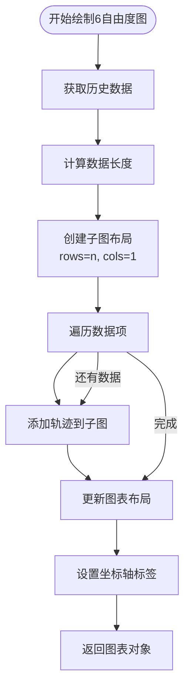
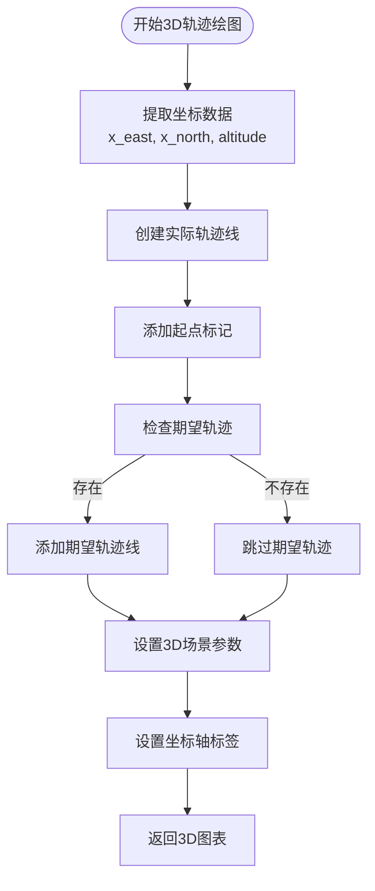
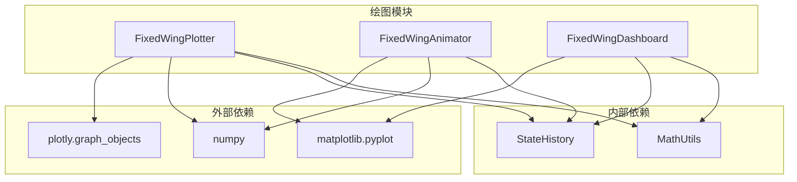
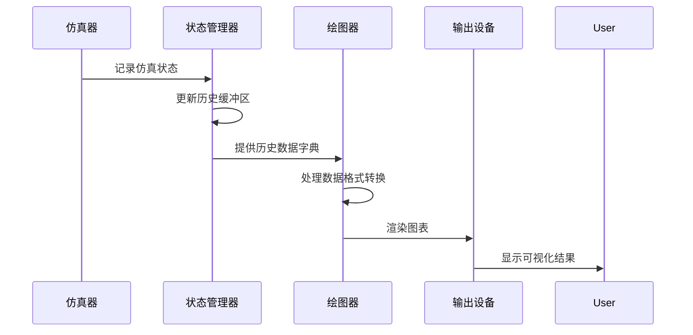

# 数据绘图模块

<cite>
**本文档引用的文件**
- [src/visualization/plotter.py](file://src/visualization/plotter.py)
- [src/visualization/__init__.py](file://src/visualization/__init__.py)
- [src/visualization/animator.py](file://src/visualization/animator.py)
- [src/visualization/dashboard.py](file://src/visualization/dashboard.py)
- [src/simulation/state_manager.py](file://src/simulation/state_manager.py)
- [src/utils/math_utils.py](file://src/utils/math_utils.py)
- [examples/example_1_linear_response.py](file://examples/example_1_linear_response.py)
- [examples/example_2_nonlinear_dynamics.py](file://examples/example_2_nonlinear_dynamics.py)
- [examples/example_3_trajectory_tracking.py](file://examples/example_3_trajectory_tracking.py)
- [output/data/example1_TB2_linear_openloop.csv](file://output/data/example1_TB2_linear_openloop.csv)
- [tests/test_integration.py](file://tests/test_integration.py)
</cite>

## 目录
1. [简介](#简介)
2. [项目结构](#项目结构)
3. [核心组件](#核心组件)
4. [架构概览](#架构概览)
5. [详细组件分析](#详细组件分析)
6. [依赖关系分析](#依赖关系分析)
7. [性能考虑](#性能考虑)
8. [故障排除指南](#故障排除指南)
9. [结论](#结论)
10. [附录](#附录)

## 简介

数据绘图模块是固定翼飞行器仿真系统的核心可视化组件，提供了完整的2D/3D图形绘制能力。该模块支持两种主要的绘图后端：Plotly（用于Web界面）和Matplotlib（用于桌面应用），能够生成从4自由度线性响应到6自由度完整响应的多种图表类型。

本模块的主要目标是：
- 提供直观的飞行器状态可视化
- 支持实时和离线数据展示
- 兼容不同的应用场景（Web界面vs桌面应用）
- 提供丰富的图表类型和自定义选项

## 项目结构

数据绘图模块位于`src/visualization/`目录下，包含以下核心文件：



**图表来源**
- [src/visualization/plotter.py](file://src/visualization/plotter.py#L1-L244)
- [src/visualization/animator.py](file://src/visualization/animator.py#L1-L150)
- [src/visualization/dashboard.py](file://src/visualization/dashboard.py#L1-L167)

**章节来源**
- [src/visualization/__init__.py](file://src/visualization/__init__.py#L1-L8)

## 核心组件

### FixedWingPlotter 类

FixedWingPlotter 是绘图模块的核心类，提供以下主要功能：

#### Plotly 后端功能
- `plot_4dof()`: 4自由度纵向响应图
- `plot_6dof()`: 6自由度完整响应图
- `plot_3d_trajectory()`: 3D轨迹图

#### Matplotlib 后端功能
- `plot_6dof_matplotlib()`: 静态6自由度响应图（3个窗口布局）

#### 主要特性
- 支持历史数据字典格式
- 自动角度单位转换（弧度到度数）
- 可配置的图表标题和标签
- 内置数据验证和错误处理

**章节来源**
- [src/visualization/plotter.py](file://src/visualization/plotter.py#L19-L244)

### FixedWingAnimator 类

提供3D轨迹动画功能，支持：
- 实时轨迹动画显示
- 飞机模型的动态渲染
- 支持保存为GIF格式
- 可配置的动画帧率和更新间隔

### FixedWingDashboard 类

提供交互式实时仪表板：
- 飞行模式选择器
- PID增益调节滑块
- 暂停/恢复/重启控制
- 实时状态数值显示

**章节来源**
- [src/visualization/animator.py](file://src/visualization/animator.py#L14-L150)
- [src/visualization/dashboard.py](file://src/visualization/dashboard.py#L28-L167)

## 架构概览



**图表来源**
- [src/visualization/plotter.py](file://src/visualization/plotter.py#L19-L244)
- [src/visualization/animator.py](file://src/visualization/animator.py#L14-L150)
- [src/visualization/dashboard.py](file://src/visualization/dashboard.py#L28-L167)
- [src/simulation/state_manager.py](file://src/simulation/state_manager.py#L95-L193)

## 详细组件分析

### FixedWingPlotter 类实现分析

#### Plotly 后端实现



**图表来源**
- [src/visualization/plotter.py](file://src/visualization/plotter.py#L19-L154)

#### Matplotlib 后端实现



**图表来源**
- [src/visualization/plotter.py](file://src/visualization/plotter.py#L161-L244)

### 时间域响应图生成逻辑

#### 4自由度线性响应图



**图表来源**
- [src/visualization/plotter.py](file://src/visualization/plotter.py#L23-L65)

#### 6自由度完整响应图



**图表来源**
- [src/visualization/plotter.py](file://src/visualization/plotter.py#L68-L111)

### 3D轨迹绘图实现



**图表来源**
- [src/visualization/plotter.py](file://src/visualization/plotter.py#L114-L154)

**章节来源**
- [src/visualization/plotter.py](file://src/visualization/plotter.py#L23-L154)

## 依赖关系分析

### 核心依赖关系



**图表来源**
- [src/visualization/plotter.py](file://src/visualization/plotter.py#L9-L12)
- [src/visualization/animator.py](file://src/visualization/animator.py#L10-L11)
- [src/visualization/dashboard.py](file://src/visualization/dashboard.py#L15-L25)

### 数据流依赖



**图表来源**
- [src/simulation/state_manager.py](file://src/simulation/state_manager.py#L117-L180)

**章节来源**
- [src/simulation/state_manager.py](file://src/simulation/state_manager.py#L95-L193)

## 性能考虑

### 内存管理策略

1. **预分配缓冲区**: StateHistory 使用预分配的NumPy数组避免频繁内存重分配
2. **数据修剪**: `trim()` 方法移除未使用的尾部空间
3. **按需导入**: Plotly和Matplotlib仅在需要时导入，减少启动时间
4. **批量操作**: 使用NumPy向量化操作替代Python循环

### 性能优化建议

1. **大数据集处理**:
   - 使用 `StateHistory.trim()` 减少内存占用
   - 考虑数据降采样以提高渲染性能
   - 使用 `plot_6dof_matplotlib()` 进行静态图表生成

2. **实时渲染优化**:
   - 调整动画帧率以平衡流畅度和性能
   - 使用适当的DPI设置避免过度渲染
   - 合理设置图表尺寸和分辨率

3. **内存使用监控**:
   - 定期检查历史数据大小
   - 及时清理不需要的图表对象
   - 使用上下文管理器确保资源正确释放

**章节来源**
- [src/simulation/state_manager.py](file://src/simulation/state_manager.py#L170-L174)

## 故障排除指南

### 常见问题及解决方案

#### 图表显示异常
- **问题**: 图表无法显示或显示为空白
- **原因**: 缺少必要的依赖库或数据格式不正确
- **解决方案**: 
  - 确保安装了plotly和matplotlib
  - 验证历史数据字典包含所有必需键
  - 检查数据数组是否为空

#### 性能问题
- **问题**: 图表渲染缓慢或内存占用过高
- **原因**: 大量数据点或不当的图表配置
- **解决方案**:
  - 使用数据降采样
  - 调整图表复杂度
  - 优化渲染参数

#### 数据格式错误
- **问题**: 报告缺少特定键或数据类型错误
- **解决**: 
  - 使用 `StateHistory.to_dict()` 获取标准格式
  - 验证数据完整性
  - 检查单位转换是否正确

**章节来源**
- [tests/test_integration.py](file://tests/test_integration.py#L377-L391)

## 结论

数据绘图模块为固定翼飞行器仿真系统提供了强大而灵活的可视化能力。通过支持两种不同的绘图后端，该模块能够满足从Web界面到桌面应用的各种使用场景需求。

主要优势包括：
- **双后端支持**: Plotly和Matplotlib的无缝切换
- **完整的图表覆盖**: 从基础的时间域响应到复杂的3D轨迹
- **高效的数据处理**: 基于预分配缓冲区的高性能设计
- **良好的可扩展性**: 模块化设计便于功能扩展

未来改进方向：
- 增加更多的图表类型和自定义选项
- 优化大数据集的渲染性能
- 提供更丰富的交互功能
- 增强错误处理和调试能力

## 附录

### 使用示例

#### Plotly 后端使用示例

```python
# 导入必要的模块
from visualization.plotter import FixedWingPlotter
from simulation.state_manager import StateHistory

# 创建绘图器实例
plotter = FixedWingPlotter()

# 4自由度响应图
fig_4dof = plotter.plot_4dof(t, y, de, U0, "TB2")

# 6自由度响应图
history = StateHistory.to_dict()
fig_6dof = plotter.plot_6dof(history, "TB2")

# 3D轨迹图
fig_3d = plotter.plot_3d_trajectory(history, "TB2")
```

#### Matplotlib 后端使用示例

```python
# 静态6自由度响应图
plotter.plot_6dof_matplotlib(history, "TB2", show=True, save_dir="./figures")
```

#### 动画和仪表板使用示例

```python
# 3D轨迹动画
animator = FixedWingAnimator()
animator.animate(history, "TB2", num_frames=8, save_path="./animation.gif")

# 交互式仪表板
dashboard = FixedWingDashboard(simulator)
dashboard.run()
```

### 数据格式规范

#### StateHistory 字典结构

| 键名 | 数据类型 | 描述 |
|------|----------|------|
| t | ndarray | 时间序列 (秒) |
| u, v, w | ndarray | 体坐标系速度 (m/s) |
| p, q, r | ndarray | 体坐标系角速率 (rad/s) |
| phi, theta, psi | ndarray | 欧拉角 (弧度) |
| x_north, x_east, x_down | ndarray | NED坐标 (米) |
| alpha, beta | ndarray | 攻角和侧滑角 (弧度) |
| airspeed, altitude | ndarray | 空速和海拔 (m) |
| elevator, aileron, rudder, throttle | ndarray | 控制面偏转 (度) |
| des_north, des_east, des_down | ndarray | 期望轨迹 (可选) |

#### 单位转换函数

```python
# 角度转换
deg = np.degrees(radians)  # 弧度转度
rad = np.radians(degrees)  # 度转弧度

# 数学工具函数
wrap_angle(angle)        # 角度归一化到[-π, π]
saturate(value, min, max) # 值饱和限制
```

**章节来源**
- [src/simulation/state_manager.py](file://src/simulation/state_manager.py#L104-L115)
- [src/utils/math_utils.py](file://src/utils/math_utils.py#L13-L36)