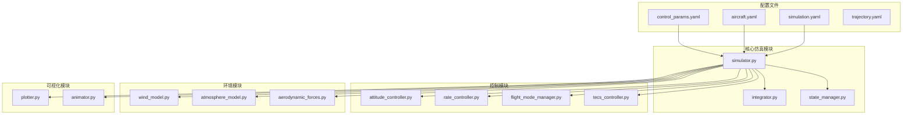
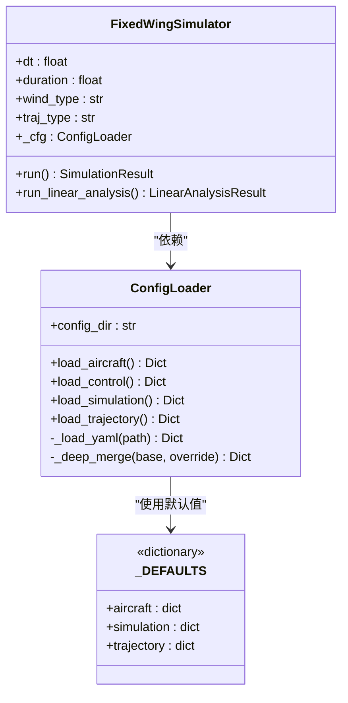
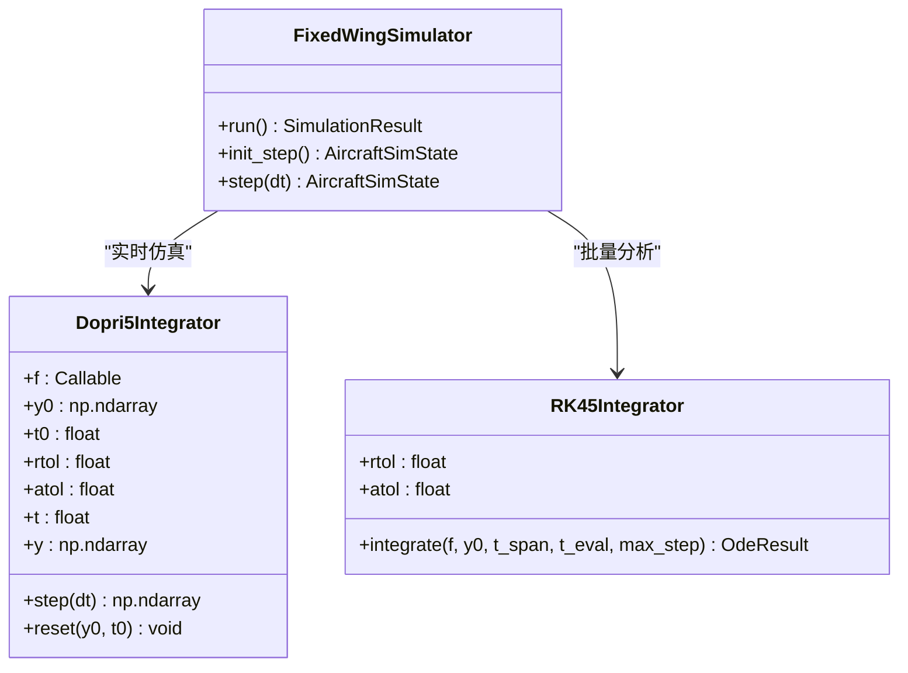
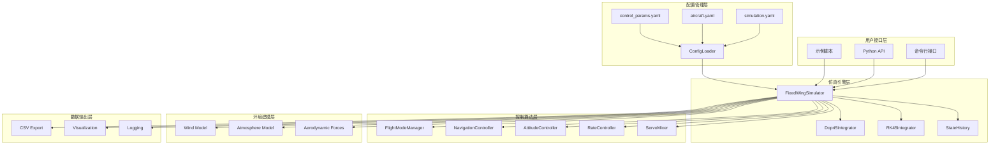
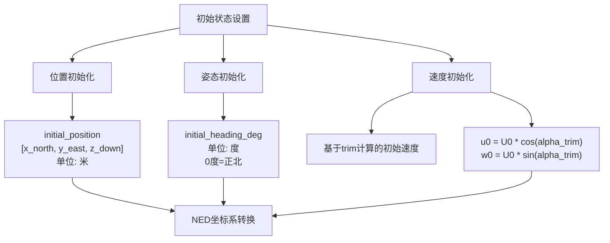
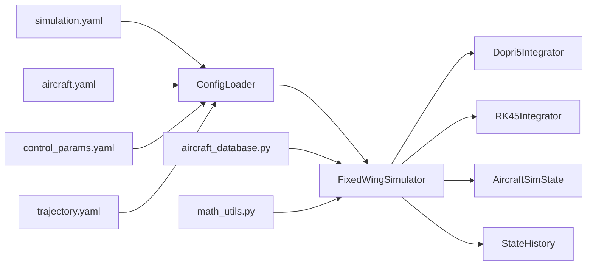
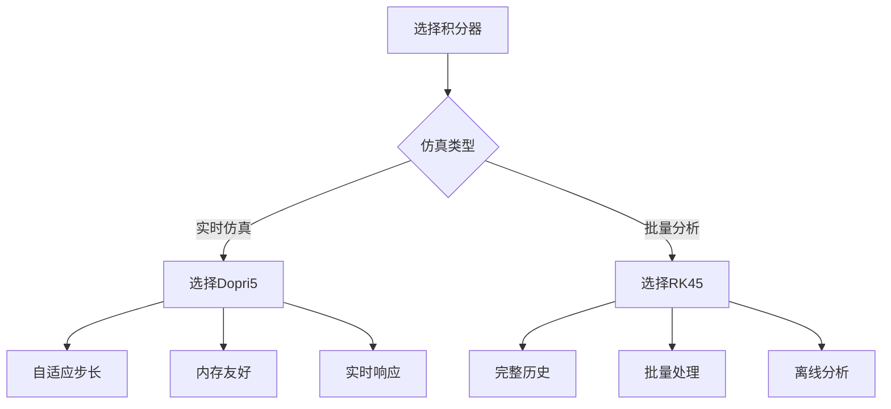

# 仿真设置配置

<cite>
**本文档引用的文件**
- [simulation.yaml](file://config/simulation.yaml)
- [config_loader.py](file://src/utils/config_loader.py)
- [integrator.py](file://src/simulation/integrator.py)
- [simulator.py](file://src/simulation/simulator.py)
- [state_manager.py](file://src/simulation/state_manager.py)
- [aircraft.yaml](file://config/aircraft.yaml)
- [control_params.yaml](file://config/control_params.yaml)
- [aircraft_database.py](file://src/models/aircraft_database.py)
- [main.py](file://main.py)
- [example_1_linear_response.py](file://examples/example_1_linear_response.py)
- [example_2_nonlinear_dynamics.py](file://examples/example_2_nonlinear_dynamics.py)
</cite>

## 目录
1. [简介](#简介)
2. [项目结构](#项目结构)
3. [核心组件](#核心组件)
4. [架构概览](#架构概览)
5. [详细组件分析](#详细组件分析)
6. [依赖关系分析](#依赖关系分析)
7. [性能考虑](#性能考虑)
8. [故障排除指南](#故障排除指南)
9. [结论](#结论)

## 简介

FixedWingSimulator是一个基于Python的固定翼无人机仿真平台，提供了完整的6自由度非线性动力学仿真能力。本文件专注于仿真设置配置，详细解释simulation.yaml配置文件的各项参数，包括仿真时间步长、总仿真时间、初始条件设置、积分器类型选择等。

该仿真平台支持多种飞行模式，从简单的线性模型分析到复杂的非线性6自由度仿真，适用于固定翼无人机的控制系统设计、性能分析和验证。

## 项目结构

FixedWingSimulator采用模块化架构设计，主要目录结构如下：



**图表来源**
- [simulation.yaml](file://config/simulation.yaml#L1-L30)
- [simulator.py](file://src/simulation/simulator.py#L1-L642)

**章节来源**
- [simulation.yaml](file://config/simulation.yaml#L1-L30)
- [config_loader.py](file://src/utils/config_loader.py#L1-L82)

## 核心组件

### 仿真配置系统

FixedWingSimulator的仿真配置系统采用分层设计，通过ConfigLoader类统一管理所有配置文件：



**图表来源**
- [config_loader.py](file://src/utils/config_loader.py#L59-L82)
- [simulator.py](file://src/simulation/simulator.py#L130-L146)

### 数值积分器

系统提供两种数值积分器以满足不同的仿真需求：



**图表来源**
- [integrator.py](file://src/simulation/integrator.py#L17-L108)
- [simulator.py](file://src/simulation/simulator.py#L239-L641)

**章节来源**
- [config_loader.py](file://src/utils/config_loader.py#L10-L37)
- [integrator.py](file://src/simulation/integrator.py#L1-L108)

## 架构概览

FixedWingSimulator的整体架构采用分层设计，从底层的数值积分到底层的控制算法，形成了完整的仿真链路：



**图表来源**
- [main.py](file://main.py#L98-L145)
- [simulator.py](file://src/simulation/simulator.py#L115-L641)

## 详细组件分析

### simulation.yaml配置文件详解

simulation.yaml是仿真系统的核心配置文件，定义了仿真运行的所有关键参数：

#### 时间步长配置

| 参数名 | 默认值 | 单位 | 描述 |
|--------|--------|------|------|
| dt | 0.01 | 秒 | 仿真时间步长，决定仿真精度和计算效率的平衡点 |
| duration | 30.0 | 秒 | 总仿真持续时间，控制仿真运行时长 |

**章节来源**
- [simulation.yaml](file://config/simulation.yaml#L4-L5)

#### 数值积分器配置

| 参数名 | 可选值 | 默认值 | 描述 |
|--------|--------|--------|------|
| integrator | dopri5, rk45 | dopri5 | 选择积分器类型：dopri5用于实时仿真，rk45用于批量分析 |
| rtol | 1.0e-6 | 绝对容差 | 相对容差，控制数值解的精度 |
| atol | 1.0e-6 | 相对容差 | 绝对容差，控制数值解的精度 |

**章节来源**
- [simulation.yaml](file://config/simulation.yaml#L7-L12)

#### 初始条件设置

初始条件采用NED坐标系（北-东-下），确保与实际飞行环境一致：

| 参数名 | 默认值 | 单位 | 描述 |
|--------|--------|------|------|
| initial_position | [0.0, 0.0, -100.0] | [x_north, y_east, z_down] 米 | 初始位置，z为负表示海拔高度 |
| initial_heading_deg | 0.0 | 度 | 初始航向角，0度指向正北方向 |

**章节来源**
- [simulation.yaml](file://config/simulation.yaml#L14-L16)

#### 飞行模式配置

系统支持多种飞行模式，从手动控制到完全自动：

| 模式名称 | 描述 | 适用场景 |
|----------|------|----------|
| MANUAL | 手动模式 | 基础飞行训练 |
| STABILIZE | 稳定模式 | 基础姿态控制 |
| FBW_A, FBW_B | 航迹带模式 | 自动导航 |
| AUTO | 自动模式 | 完全自主飞行 |
| LOITER | 巡航模式 | 等待或盘旋 |
| RTH | 回航模式 | 安全返航 |

**章节来源**
- [simulation.yaml](file://config/simulation.yaml#L18-L20)

#### 风场配置

风场模型支持多种类型，模拟真实飞行环境：

| 参数名 | 可选值 | 默认值 | 描述 |
|--------|--------|--------|------|
| wind_type | NONE, FIXED, SINE, RANDOMSINE | NONE | 风场类型 |
| wind_speed | 5.0 | m/s | 风速大小 |
| wind_direction_deg | 270.0 | 度 | 风向，按气象约定 |

**章节来源**
- [simulation.yaml](file://config/simulation.yaml#L22-L25)

### 初始状态设置详解

初始状态设置是仿真成功的关键，直接影响仿真结果的准确性和稳定性：

#### 坐标系说明

仿真采用NED（North-East-Down）坐标系，这是航空工程中的标准坐标系：

- **X轴（北向）**：正向指向正北
- **Y轴（东向）**：正向指向正东  
- **Z轴（下向）**：正向向下，表示海拔高度

#### 初始状态参数



**图表来源**
- [simulation.yaml](file://config/simulation.yaml#L14-L16)
- [simulator.py](file://src/simulation/simulator.py#L301-L309)

**章节来源**
- [simulator.py](file://src/simulation/simulator.py#L301-L309)

### 积分器类型选择

#### Dopri5积分器（推荐用于实时仿真）

Dopri5是自适应步长的Runge-Kutta(4)5阶方法，适合实时仿真：

- **优点**：自适应步长，计算效率高，内存占用少
- **适用场景**：实时控制系统仿真、长时间连续仿真
- **精度**：相对容差1e-6，绝对容差1e-6

#### RK45积分器（用于批量分析）

RK45是显式Runge-Kutta(4)5阶方法，适合离线分析：

- **优点**：适合批量处理，可获得完整时间历史
- **适用场景**：参数敏感性分析、批量仿真
- **限制**：需要较大的内存存储完整历史

**章节来源**
- [integrator.py](file://src/simulation/integrator.py#L17-L108)

## 依赖关系分析

### 配置文件依赖关系



**图表来源**
- [config_loader.py](file://src/utils/config_loader.py#L59-L82)
- [simulator.py](file://src/simulation/simulator.py#L130-L153)

### 飞机参数依赖

系统支持7种不同类型的固定翼无人机，每种都有独特的气动特性和几何参数：

| 飞机型号 | 质量(kg) | 机翼面积(m²) | 翼展(m) | 最大速度(m/s) |
|----------|----------|--------------|---------|---------------|
| TB2 | 700.0 | 9.34 | 12.0 | 30-40 |
| Predator | 1020.0 | 11.45 | 14.8 | 25-35 |
| Anka | 1700.0 | 18.0 | 17.5 | 20-30 |
| Aksungur | 3300.0 | 30.0 | 24.2 | 15-25 |
| Karayel | 630.0 | 9.0 | 13.0 | 30-40 |
| Heron MK1 | 1150.0 | 12.9 | 16.6 | 20-30 |
| Heron MK2 | 1000.0 | 12.9 | 16.6 | 20-30 |

**章节来源**
- [aircraft_database.py](file://src/models/aircraft_database.py#L29-L133)

### 控制参数依赖

控制系统的性能直接影响仿真结果的准确性：

| 参数类别 | 关键参数 | 默认值 | 影响范围 |
|----------|----------|--------|----------|
| 飞行模式 | ALT_HOLD_RTL | 50.0m | 高度保持目标 |
| 空速控制 | AIRSPEED_CRUISE | 40.0m/s | 巡航速度设定 |
| TECS参数 | TECS_TIME_CONST | 8.0s | 控制平滑度 |
| PID控制器 | PTCH_RATE_P | 1.0 | 响应速度 |
| 限幅设置 | THR_MIN/THR_MAX | 0.0/1.0 | 油门范围 |

**章节来源**
- [control_params.yaml](file://config/control_params.yaml#L1-L45)

## 性能考虑

### 仿真精度与性能权衡

#### 时间步长对精度的影响

| 时间步长 | 计算复杂度 | 精度影响 | 内存占用 |
|----------|------------|----------|----------|
| 0.001s | 高 | 高 | 大 |
| 0.01s | 中 | 中 | 中 |
| 0.1s | 低 | 低 | 小 |

#### 积分器选择策略



**图表来源**
- [integrator.py](file://src/simulation/integrator.py#L17-L108)

#### 不同应用场景的推荐配置

| 应用场景 | 推荐配置 | 理由 |
|----------|----------|------|
| 实时控制系统验证 | dt=0.01s, integrator=dopri5 | 实时响应，内存占用适中 |
| 参数敏感性分析 | dt=0.01s, integrator=rk45 | 需要完整时间历史 |
| 长时间连续仿真 | dt=0.01s, integrator=dopri5 | 节省内存，提高效率 |
| 离线性能评估 | dt=0.001s, integrator=rk45 | 高精度要求 |
| 教学演示 | dt=0.05s, integrator=dopri5 | 快速反馈，便于理解 |

### 计算效率优化建议

#### 内存管理

- **预分配历史缓冲区**：使用StateHistory预分配数组，避免动态内存分配
- **批量处理**：对于批量分析，优先使用RK45积分器
- **数据压缩**：合理设置记录频率，避免不必要的数据存储

#### 并行计算

- **多进程仿真**：可以并行运行多个独立的仿真任务
- **参数扫描**：使用多进程同时测试不同参数组合
- **结果合并**：将各进程的结果进行统一处理

**章节来源**
- [state_manager.py](file://src/simulation/state_manager.py#L95-L193)
- [simulator.py](file://src/simulation/simulator.py#L272-L273)

## 故障排除指南

### 常见配置问题

#### 积分失败错误

当出现积分失败时，通常有以下原因：

1. **时间步长过大**：尝试减小dt到0.001s
2. **初始条件不合理**：检查initial_position和initial_heading_deg
3. **控制输入异常**：验证控制参数设置
4. **数值不稳定**：调整rtol和atol容差

#### 风场配置问题

- **风速过小**：可能导致仿真结果不明显
- **风向设置错误**：注意气象约定（FROM方向）
- **风场类型选择不当**：根据实际需求选择合适的风场模型

#### 飞行模式切换问题

- **模式参数错误**：确保initial_mode在允许范围内
- **控制参数不匹配**：检查control_params.yaml中的相关设置
- **轨迹规划冲突**：确认轨迹参数与飞行模式兼容

### 调试技巧

#### 日志记录

系统提供完整的日志功能，可以通过log_enabled和log_dir参数控制：

```python
# 启用详细日志
log_enabled: true
log_dir: logs

# 查看仿真过程中的关键信息
# 包括积分器状态、控制输入、状态变化等
```

#### 数据导出

仿真结果可以导出为CSV格式，便于后续分析：

- **状态数据**：包含完整的12维状态变量
- **控制数据**：包括舵面偏角和油门设置
- **轨迹数据**：目标位置和实际跟踪误差

**章节来源**
- [simulation.yaml](file://config/simulation.yaml#L27-L29)
- [state_manager.py](file://src/simulation/state_manager.py#L182-L193)

## 结论

FixedWingSimulator的仿真设置配置系统提供了灵活而强大的参数控制能力。通过合理配置simulation.yaml文件，用户可以在仿真精度和计算效率之间找到最佳平衡点。

关键要点总结：

1. **配置层次清晰**：通过ConfigLoader统一管理，支持默认值覆盖
2. **参数选择灵活**：支持多种积分器、飞行模式和风场类型
3. **精度控制精确**：通过rtol/atol容差参数精细控制数值精度
4. **性能优化完善**：提供多种优化策略以适应不同应用需求

建议用户根据具体应用场景选择合适的配置参数，并在仿真前进行充分的参数验证和调试。