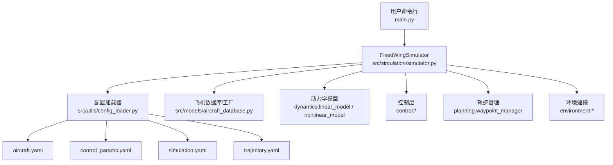
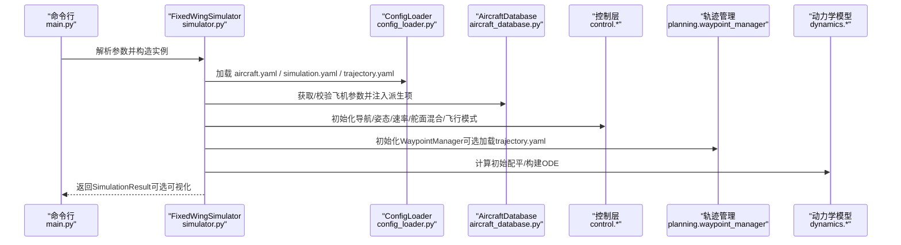
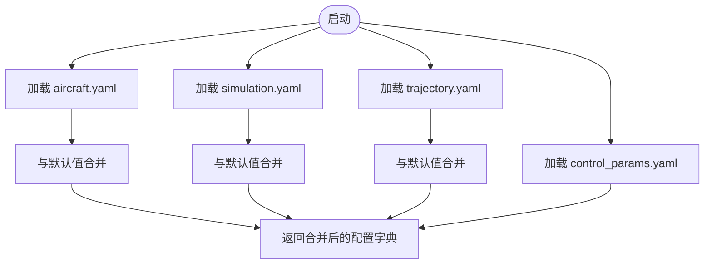
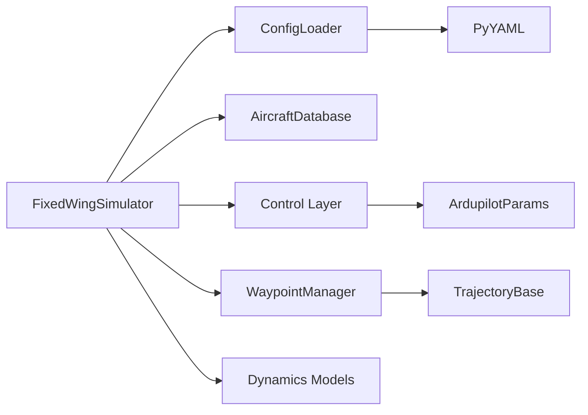

# 安装与配置

<cite>
**本文引用的文件**
- [README.md](file://README.md)
- [requirements.txt](file://requirements.txt)
- [setup.py](file://setup.py)
- [main.py](file://main.py)
- [src/utils/config_loader.py](file://src/utils/config_loader.py)
- [src/simulation/simulator.py](file://src/simulation/simulator.py)
- [src/models/aircraft_database.py](file://src/models/aircraft_database.py)
- [config/aircraft.yaml](file://config/aircraft.yaml)
- [config/control_params.yaml](file://config/control_params.yaml)
- [config/simulation.yaml](file://config/simulation.yaml)
- [config/trajectory.yaml](file://config/trajectory.yaml)
- [tests/test_integration.py](file://tests/test_integration.py)
</cite>

## 目录
1. [简介](#简介)
2. [项目结构](#项目结构)
3. [核心组件](#核心组件)
4. [架构总览](#架构总览)
5. [详细组件分析](#详细组件分析)
6. [依赖关系分析](#依赖关系分析)
7. [性能注意事项](#性能注意事项)
8. [故障排查指南](#故障排查指南)
9. [结论](#结论)
10. [附录](#附录)

## 简介
本文件面向FixedWingSimulator项目的使用者与维护者，提供从系统环境到配置文件的完整安装与配置指南。内容涵盖：
- 系统环境要求与依赖库安装
- 不同操作系统下的安装步骤
- 四类配置文件的作用、参数含义与最佳实践
- 配置验证方法与常见错误排查

## 项目结构
项目采用模块化组织，核心目录与文件如下：
- config：仿真配置文件（aircraft.yaml、control_params.yaml、simulation.yaml、trajectory.yaml）
- src：核心代码包，包含动力学、控制、规划、仿真、可视化等子模块
- examples：示例脚本，演示线性/非线性仿真与轨迹跟踪
- tests：集成测试，覆盖稳定性、轨迹跟踪、线性分析等场景
- main.py：命令行入口，支持多种运行模式与参数

图表来源
- [main.py](file://main.py#L98-L141)
- [src/simulation/simulator.py](file://src/simulation/simulator.py#L115-L234)
- [src/utils/config_loader.py](file://src/utils/config_loader.py#L59-L82)
- [src/models/aircraft_database.py](file://src/models/aircraft_database.py#L143-L166)

章节来源
- [main.py](file://main.py#L1-L145)
- [src/simulation/simulator.py](file://src/simulation/simulator.py#L1-L110)

## 核心组件
- 固定翼仿真器：负责整合配置、环境、控制、轨迹与动力学，执行闭环或开环仿真，并输出结果与可视化。
- 配置加载器：统一加载与合并各配置文件，提供默认值与深度合并策略。
- 飞机数据库：内置7种固定翼无人机参数，支持派生参数注入（如静压密度、空速等）。
- 动力学模型：提供4自由度线性分析与6自由度非线性仿真能力。
- 控制层：ArduPilot兼容的五层控制链路（导航→姿态→速率→舵面混合→飞行模式管理）。
- 轨迹管理：支持最小冲击/加速度/速度与悬停等轨迹类型，支持航向模式与航路点序列。

章节来源
- [src/simulation/simulator.py](file://src/simulation/simulator.py#L115-L234)
- [src/utils/config_loader.py](file://src/utils/config_loader.py#L59-L82)
- [src/models/aircraft_database.py](file://src/models/aircraft_database.py#L143-L166)

## 架构总览
下图展示从命令行到仿真引擎的调用流程与配置加载路径。

图表来源
- [main.py](file://main.py#L98-L141)
- [src/simulation/simulator.py](file://src/simulation/simulator.py#L130-L234)
- [src/utils/config_loader.py](file://src/utils/config_loader.py#L68-L81)
- [src/models/aircraft_database.py](file://src/models/aircraft_database.py#L143-L166)

## 详细组件分析

### 安装与环境要求
- Python版本：要求Python 3.10及以上（由setup.py声明）
- 依赖库：通过requirements.txt与setup.py定义，包括数值计算、科学计算、绘图与配置解析等
- 推荐使用虚拟环境隔离依赖，避免与系统或其他项目冲突

安装步骤（通用流程）
- 准备Python 3.10+
- 创建并激活虚拟环境
- 安装依赖：pip install -r requirements.txt 或 pip install .
- 验证安装：运行示例脚本或主程序入口

章节来源
- [requirements.txt](file://requirements.txt#L1-L8)
- [setup.py](file://setup.py#L10-L22)
- [main.py](file://main.py#L6-L18)

### 配置文件详解与最佳实践

#### aircraft.yaml（飞机参数）
- 作用：选择仿真机型并可对数据库默认参数进行覆盖
- 关键字段
  - aircraft_name：可选值包括TB2、Anka、Aksungur、Karayel、Predator、Heron MK1、Heron MK2
  - overrides：可选，用于覆盖数据库中的质量、机翼面积、平均弦长、翼展等几何与气动参数
- 最佳实践
  - 若仅需微调参数，优先使用overrides，避免复制整段参数
  - 修改后建议结合线性/非线性仿真验证稳定性

章节来源
- [config/aircraft.yaml](file://config/aircraft.yaml#L1-L13)
- [src/models/aircraft_database.py](file://src/models/aircraft_database.py#L29-L133)

#### control_params.yaml（控制参数）
- 作用：ArduPilot兼容的控制参数集合，驱动导航控制器、姿态/速率控制器与TECS
- 关键字段（节选）
  - ALT_HOLD_RTL：悬停/返航高度（m）
  - AIRSPEED_CRUISE：巡航空速（m/s）
  - NAVL1_DAMPING/NAVL1_PERIOD：L1导航环阻尼与周期
  - PTCH_* / ROLL_* / YAW_RATE_*：姿态/速率环PID参数
  - LIM_PITCH_* / LIM_ROLL_CD：俯仰/滚转限幅
  - THR_MIN/THR_MAX：油门上下限
  - TECS_*：TECS（总能量控制）相关参数（最大爬升率、最小/最大下沉率、时间常数、阻尼、积分增益、速度权重、坡度转油门补偿、俯仰角限幅、巡航油门、高度需求滤波时间常数等）
- 最佳实践
  - TECS参数与飞机配平密切相关，建议先完成动力学配平再调整TECS
  - PID参数应与飞机惯性与气动特性匹配，避免过高的比例/积分导致振荡
  - 若使用自定义TECS参数，确保与AIRSPEED_*范围一致

章节来源
- [config/control_params.yaml](file://config/control_params.yaml#L1-L45)
- [src/simulation/simulator.py](file://src/simulation/simulator.py#L165-L213)

#### simulation.yaml（仿真设置）
- 作用：控制仿真引擎的时间步长、持续时间、积分器、初始条件、风场与日志
- 关键字段
  - dt：仿真时间步长（s），默认0.01
  - duration：总仿真时长（s），默认30.0
  - integrator：数值积分器，支持dopri5（实时循环）与rk45（批处理分析）
  - rtol/atol：相对/绝对容差
  - initial_position：初始位置（NED坐标系，单位m），默认[0, 0, -100]
  - initial_heading_deg：初始航向（度，0=正北）
  - initial_mode：初始飞行模式，可选MANUAL、STABILIZE、FBW_A、FBW_B、AUTO、LOITER、RTH
  - wind_type：风场类型，NONE、FIXED、SINE、RANDOMSINE
  - wind_speed：风速（m/s），用于FIXED/SINE/RANDOMSINE
  - wind_direction_deg：风来自方向（度，按气象约定），用于FIXED
  - log_enabled/log_dir：是否启用日志与日志目录
- 最佳实践
  - 实时仿真建议使用dopri5；批处理分析可考虑rk45
  - 初始位置与航向应与轨迹起点一致，避免轨迹生成时的不连续
  - 日志目录需存在且具备写权限

章节来源
- [config/simulation.yaml](file://config/simulation.yaml#L1-L30)
- [src/utils/config_loader.py](file://src/utils/config_loader.py#L15-L29)

#### trajectory.yaml（轨迹配置）
- 作用：定义轨迹类型、平均速度、航向模式与航路点序列
- 关键字段
  - type：轨迹类型，minimum_snap、minimum_jerk、minimum_accel、minimum_vel、hover
  - average_speed：用于估算航段时间（m/s）
  - yaw_mode：航向控制模式，none、yaw_follow、yaw_waypoint_interp、zero
  - waypoints：航路点列表，每项为[NED北向m, 东向m, 下向m]（注意：下向为正，内部转换为NED z=-alt）
  - loop：到达末点后是否循环
- 最佳实践
  - 起点与初始位置保持一致，避免轨迹起始阶段的瞬态扰动
  - 复杂机动建议使用minimum_snap或minimum_jerk，保证加速度/加加速度连续
  - 航向模式根据任务需求选择，航路点密集时建议使用yaw_follow

章节来源
- [config/trajectory.yaml](file://config/trajectory.yaml#L1-L23)
- [src/utils/config_loader.py](file://src/utils/config_loader.py#L30-L37)

### 配置加载与合并机制
- 默认值：ConfigLoader在未找到对应配置时使用内置默认值
- 合并策略：采用深度合并，允许在用户配置中只覆盖需要的字段
- 飞机参数：aircraft.yaml中的overrides会与数据库参数合并，实现局部覆盖

图表来源
- [src/utils/config_loader.py](file://src/utils/config_loader.py#L10-L56)

章节来源
- [src/utils/config_loader.py](file://src/utils/config_loader.py#L59-L82)

### 命令行与运行模式
- 主入口：main.py提供丰富的命令行参数，支持切换机型、模式、风场、轨迹类型、分析模式与可视化开关
- 运行模式
  - 闭合回路仿真：默认运行，使用ArduPilot控制链路
  - 开环分析：4DOF线性分析或6DOF开环仿真
  - 轨迹跟踪：AUTO模式配合WaypointManager生成多项式轨迹
  - 航路点顺序：Circuit模式直接飞向航路点，适合简单任务

章节来源
- [main.py](file://main.py#L32-L95)
- [src/simulation/simulator.py](file://src/simulation/simulator.py#L239-L567)

## 依赖关系分析
- 固定翼仿真器依赖配置加载器、飞机数据库、控制层、轨迹管理与动力学模块
- 配置加载器依赖PyYAML进行YAML解析，并提供默认值与深度合并
- 飞机数据库提供静态参数与派生参数注入，供动力学与控制模块使用
- 控制层依赖ArduPilot兼容参数集，驱动导航、姿态、速率与舵面混合
- 轨迹管理依赖WaypointManager与TrajectoryBase族类，支持多种轨迹类型

图表来源
- [src/simulation/simulator.py](file://src/simulation/simulator.py#L33-L51)
- [src/utils/config_loader.py](file://src/utils/config_loader.py#L68-L81)

章节来源
- [src/simulation/simulator.py](file://src/simulation/simulator.py#L1-L60)

## 性能注意事项
- 时间步长与积分器
  - 实时仿真建议使用dopri5，精度与稳定性兼顾
  - 批处理分析可考虑rk45，但需关注轨迹连续性
- 风场与轨迹
  - 风场类型与强度影响仿真稳定性，建议先在无风条件下验证
  - 轨迹类型与航路点密度影响控制带宽与计算负载
- 内存与日志
  - 长时仿真会产生大量历史数据，合理设置日志目录与频率

## 故障排查指南
- 常见问题与定位
  - 飞机名称无效：确认aircraft_name在数据库中存在
  - 风场参数异常：wind_type与wind_speed/wind_direction_deg需匹配
  - 轨迹起点不一致：初始位置与轨迹起点差异会导致瞬态扰动
  - TECS参数不匹配：油门上下限与巡航油门需与飞机配平一致
  - 积分器报错：检查dt与rtol/atol设置，必要时减小步长或提高容差
- 验证方法
  - 使用集成测试覆盖场景：开环/闭环、轨迹跟踪、线性分析、步进API一致性
  - 逐步替换配置：先用默认配置，再逐项调整参数
  - 观察状态历史：检查空速、高度、俯仰角是否发散或越界

章节来源
- [tests/test_integration.py](file://tests/test_integration.py#L41-L58)
- [src/simulation/simulator.py](file://src/simulation/simulator.py#L558-L562)

## 结论
通过规范的环境准备、依赖安装与配置文件管理，用户可以快速搭建并稳定运行FixedWingSimulator。建议遵循“先默认、后覆盖”的原则，结合线性/非线性仿真与轨迹跟踪验证配置的合理性，并利用集成测试保障系统稳定性。

## 附录

### 配置修改示例与最佳实践清单
- 示例：将飞机改为Predator，增加航向风，轨迹改为minimum_jerk
  - 在aircraft.yaml中设置aircraft_name为Predator
  - 在simulation.yaml中将wind_type设为FIXED，wind_speed设为5.0，wind_direction_deg设为270.0
  - 在trajectory.yaml中将type设为minimum_jerk，调整航路点序列
- 最佳实践清单
  - 先完成飞机参数核对与配平，再调整控制参数
  - TECS参数与AIRSPEED_*范围保持一致
  - 初始位置与航路点起点尽量一致
  - 风场与轨迹类型按任务需求选择
  - 长时仿真开启日志，便于事后分析

### 配置验证清单
- 飞机参数：aircraft_name有效，overrides覆盖合理
- 控制参数：PID与TECS参数与飞机特性匹配，限幅合理
- 仿真设置：dt与duration适中，积分器与容差设置恰当
- 轨迹配置：航路点顺序与类型符合任务需求，航向模式正确
- 运行验证：通过集成测试或示例脚本验证稳定性与轨迹跟踪效果