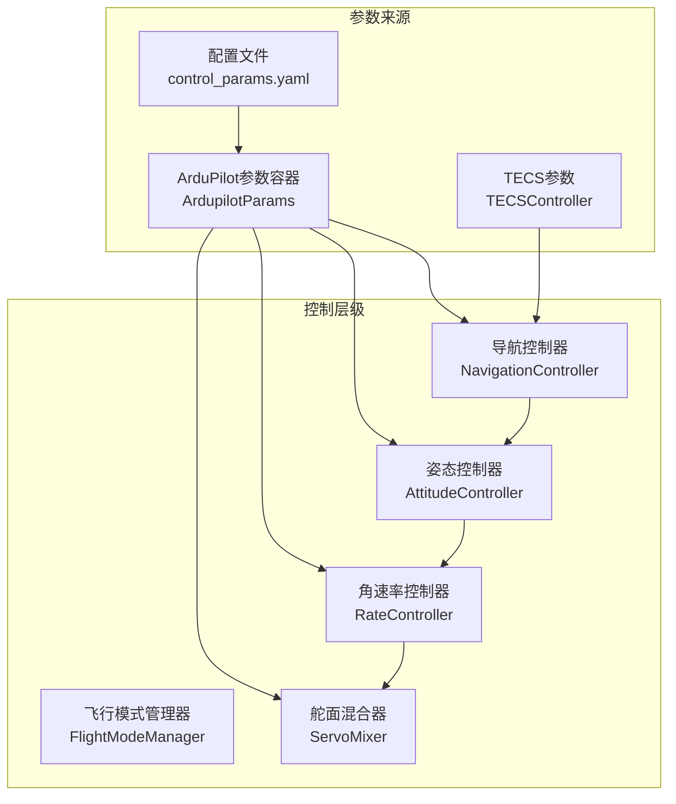
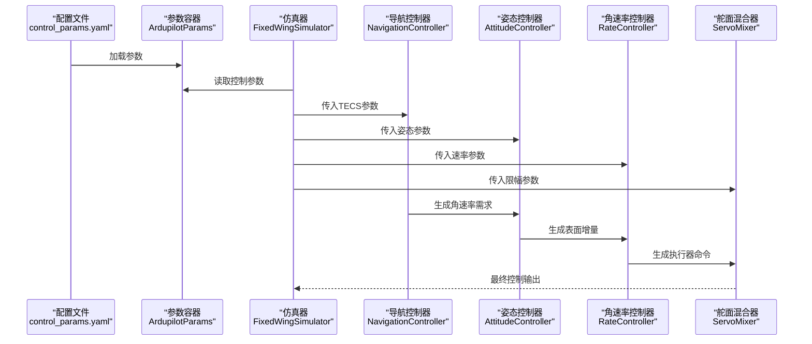
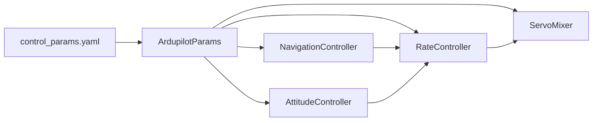

# 控制参数配置

<cite>
**本文档引用的文件**
- [control_params.yaml](file://config/control_params.yaml)
- [ardupilot_compat.py](file://src/control/ardupilot_compat.py)
- [pid_controller.py](file://src/control/pid_controller.py)
- [attitude_controller.py](file://src/control/attitude_controller.py)
- [rate_controller.py](file://src/control/rate_controller.py)
- [servo_mixer.py](file://src/control/servo_mixer.py)
- [tecs_controller.py](file://src/control/tecs_controller.py)
- [navigation_controller.py](file://src/control/navigation_controller.py)
- [simulator.py](file://src/simulation/simulator.py)
- [config_loader.py](file://src/utils/config_loader.py)
- [example_6_ardupilot_parameters.py](file://examples/example_6_ardupilot_parameters.py)
- [test_control.py](file://tests/test_control.py)
</cite>

## 目录
1. [简介](#简介)
2. [项目结构](#项目结构)
3. [核心组件](#核心组件)
4. [架构概览](#架构概览)
5. [详细组件分析](#详细组件分析)
6. [依赖关系分析](#依赖关系分析)
7. [性能考量](#性能考量)
8. [故障排查指南](#故障排查指南)
9. [结论](#结论)
10. [附录](#附录)

## 简介
本文件面向FixedWingSimulator项目的控制参数配置，系统性解析control_params.yaml中的各项参数及其在ArduPilot控制层级中的作用，涵盖PID控制器参数、TECS控制参数、舵面混合参数等，并提供不同飞行条件下的调优建议、影响分析与最佳实践。

## 项目结构
FixedWingSimulator采用五层控制架构（从外到内）：
- 导航控制器（路径跟踪与高度/速度需求生成）
- 飞行模式管理器（模式切换与目标设定）
- 姿态控制器（角度到角速率的映射）
- 角速率控制器（角速率到舵面增量的PD控制）
- 舵面混合器（最终执行器命令生成）

图表来源
- [simulator.py](file://src/simulation/simulator.py#L165-L210)
- [ardupilot_compat.py](file://src/control/ardupilot_compat.py#L17-L129)
- [navigation_controller.py](file://src/control/navigation_controller.py#L57-L118)
- [attitude_controller.py](file://src/control/attitude_controller.py#L33-L134)
- [rate_controller.py](file://src/control/rate_controller.py#L32-L109)
- [servo_mixer.py](file://src/control/servo_mixer.py#L54-L153)

章节来源
- [simulator.py](file://src/simulation/simulator.py#L165-L210)
- [config_loader.py](file://src/utils/config_loader.py#L68-L73)

## 核心组件
- ArduPilot兼容参数容器：提供与ArduPilot Plane一致的参数命名与默认值，支持从YAML加载、校验与导出。
- PID控制器：通用离散PID实现，具备抗饱和积分、可选微分低通滤波与前馈项。
- 姿态控制器：将期望欧拉角转换为期望角速率（仅P，无D）。
- 角速率控制器：独立的三轴PD控制器，提供稳定阻尼与前馈补偿。
- 舵面混合器：将表面增量与油门命令映射为最终执行器输出，包含限幅、速率限制与协调转弯补偿。
- TECS控制器：总能量控制系统，解耦高度与速度控制，避免积分饱和与油门饱和问题。

章节来源
- [ardupilot_compat.py](file://src/control/ardupilot_compat.py#L17-L129)
- [pid_controller.py](file://src/control/pid_controller.py#L17-L117)
- [attitude_controller.py](file://src/control/attitude_controller.py#L33-L134)
- [rate_controller.py](file://src/control/rate_controller.py#L32-L109)
- [servo_mixer.py](file://src/control/servo_mixer.py#L54-L153)
- [tecs_controller.py](file://src/control/tecs_controller.py#L50-L647)

## 架构概览
控制参数在运行时的流向如下：
- 配置文件control_params.yaml被加载为ArdupilotParams对象
- TECS参数从同一配置文件读取并传入NavigationController
- 控制层按顺序执行：姿态→角速率→舵面混合→执行器输出
- TECS作为导航层的核心，负责高度/速度需求与油门/俯仰指令生成

图表来源
- [simulator.py](file://src/simulation/simulator.py#L165-L210)
- [navigation_controller.py](file://src/control/navigation_controller.py#L57-L118)
- [attitude_controller.py](file://src/control/attitude_controller.py#L33-L134)
- [rate_controller.py](file://src/control/rate_controller.py#L32-L109)
- [servo_mixer.py](file://src/control/servo_mixer.py#L54-L153)

## 详细组件分析

### ArduPilot兼容参数（control_params.yaml）
- 用途：定义与ArduPilot Plane一致的控制参数命名，便于移植与互操作。
- 关键参数类别：
  - 导航与速度/高度：NAVL1_PERIOD、NAVL1_DAMPING、AIRSPEED_CRUISE、ALT_HOLD_RTL
  - 姿态与角速率：PTCH_P、PTCH_RATE_P/I/D/FF、ROLL_P/ROLL_RATE_P/I/D/FF、YAW_RATE_P/I/D/FF
  - 限幅与油门：LIM_PITCH_MAX/MIN、LIM_ROLL_CD、THR_MAX/THR_MIN
  - TECS参数：TECS_CLMB_MAX、TECS_SINK_MIN/Max、TECS_TIME_CONST、TECS_THR_DAMP、TECS_PTCH_DAMP、TECS_INTEG_GAIN、TECS_SPDWEIGHT、TECS_RLL2THR、TECS_PITCH_MAX/MIN、TECS_THR_CRUISE、TECS_HDEM_TCONST

调优要点
- PTCH_P/ROLL_P：姿态外环P，影响响应速度与稳态误差；过高易振荡，过低响应慢。
- PTCH_RATE_P/I/D/FF：角速率内环，决定稳定阻尼与瞬态特性；I项可能引发极限环，建议谨慎使用。
- LIM_PITCH_MAX/MIN/LIM_ROLL_CD：限制最大舵偏，避免失速与结构过载。
- THR_MIN/MAX：油门上下限，保障安全与真实执行器范围。
- TECS参数：整体解耦高度/速度控制，需与飞机气动特性匹配。

章节来源
- [control_params.yaml](file://config/control_params.yaml#L1-L45)
- [ardupilot_compat.py](file://src/control/ardupilot_compat.py#L17-L129)
- [simulator.py](file://src/simulation/simulator.py#L180-L210)

### PID控制器（通用实现）
- 特性：P/I/D三项，抗饱和积分（积分仅在未饱和时累积），可选微分低通滤波，支持前馈。
- 应用：角速率控制器的三轴PID，以及TECS内部的积分环节。
- 关键点：输出饱和时自动抑制积分增长，避免积分风车效应；微分低通可抑制噪声。

章节来源
- [pid_controller.py](file://src/control/pid_controller.py#L17-L117)

### 姿态控制器（角度→角速率）
- 结构：三轴独立PID，仅P（无D），输出限幅。
- 参数来源：PTCH_P、ROLL_P。
- 影响：姿态误差→角速率需求，决定后续角速率控制的难度与稳定性。

章节来源
- [attitude_controller.py](file://src/control/attitude_controller.py#L33-L134)

### 角速率控制器（角速率→表面增量）
- 结构：三轴独立PID（PD），带前馈补偿。
- 参数来源：PTCH_RATE_P/I/D/FF、ROLL_RATE_P/I/D/FF、YAW_RATE_P/I/D/FF。
- 影响：决定稳定阻尼、响应速度与抗扰能力；前馈可提升参考跟随性能。

章节来源
- [rate_controller.py](file://src/control/rate_controller.py#L32-L109)

### 舵面混合器（表面增量→执行器命令）
- 功能：将elevator/aileron/rudder增量与throttle合并为最终输出，包含：
  - 幅度限幅：基于LIM_PITCH_MAX/MIN、LIM_ROLL_CD转换为归一化限幅
  - 协调转弯补偿：rudder与roll_rate成比例
  - 速率限制：近似限幅各通道的单位时间内变化量
- 参数来源：LIM_PITCH_MAX/MIN、LIM_ROLL_CD、THR_MIN/MAX。

章节来源
- [servo_mixer.py](file://src/control/servo_mixer.py#L54-L153)

### TECS控制器（总能量控制系统）
- 核心思想：通过油门控制总比能量（SPE+SKE），通过俯仰角控制比能量分配比（SEB），实现高度与速度的自然耦合控制。
- 主要参数：
  - 爬升/下沉速率限制：TECS_CLMB_MAX、TECS_SINK_MIN/Max
  - 时间常数：TECS_TIME_CONST（影响响应平滑度）
  - 油门/俯仰阻尼：TECS_THR_DAMP、TECS_PTCH_DAMP
  - 积分增益：TECS_INTEG_GAIN（抑制积分振荡）
  - 速度权重：TECS_SPDWEIGHT（高度优先vs速度优先）
  - 坡度补偿：TECS_RLL2THR（转弯时诱导阻力补偿）
  - 俯仰角限幅：TECS_PITCH_MAX/MIN
  - 巡航油门前馈：TECS_THR_CRUISE
  - 高度需求低通：TECS_HDEM_TCONST
- 行为特征：欠速保护、不可达下沉检测、自适应爬升/下沉缩放。

章节来源
- [tecs_controller.py](file://src/control/tecs_controller.py#L50-L647)
- [navigation_controller.py](file://src/control/navigation_controller.py#L57-L118)

## 依赖关系分析
- 参数加载链路：config/control_params.yaml → ArdupilotParams.from_yaml → 控制层参数对象
- 控制链路：NavigationController（TECS）→ AttitudeController（姿态）→ RateController（角速率）→ ServoMixer（执行器）
- 参数耦合：TECS参数与导航控制器紧密耦合；姿态/角速率参数与内外环控制紧密耦合；舵面混合器依赖限幅参数。

图表来源
- [config_loader.py](file://src/utils/config_loader.py#L68-L73)
- [ardupilot_compat.py](file://src/control/ardupilot_compat.py#L74-L98)
- [simulator.py](file://src/simulation/simulator.py#L165-L210)

章节来源
- [config_loader.py](file://src/utils/config_loader.py#L68-L73)
- [simulator.py](file://src/simulation/simulator.py#L165-L210)

## 性能考量
- 响应速度与稳定性权衡
  - 姿态外环P（PTCH_P、ROLL_P）提高响应但易振荡；建议先调姿态，再调内环。
  - 角速率内环（PTCH_RATE_P/I/D/FF、ROLL_RATE_P/I/D/FF、YAW_RATE_P/I/D/FF）决定稳定阻尼；I项可能产生极限环，建议谨慎使用。
  - TECS_TIME_CONST越大越平滑，但响应越慢；TECS_THR_DAMP/PTCH_DAMP越大越稳定，但可能牺牲快速性。
- 控制精度与鲁棒性
  - TECS_SPDWEIGHT在高度优先与速度优先间权衡；低速环境倾向高度优先。
  - LIM_PITCH_MAX/MIN、LIM_ROLL_CD限制舵偏，避免失速与结构过载。
  - 转弯时TECS_RLL2THR补偿诱导阻力，提升控制精度。
- 能耗与执行器寿命
  - THR_MIN/MAX限制油门范围，避免长时间满油门；TECS_THR_CRUISE提供前馈，降低积分负担。
  - 舵面混合器的速率限制可减少执行器冲击。

## 故障排查指南
- TECS相关
  - 欠速保护触发：检查TECS_SPDWEIGHT、TECS_THR_CRUISE与空速包线；适当提高速度权重或前馈。
  - 不可达下沉：检查TECS_THR_DAMP、TECS_PTCH_DAMP与速度/高度需求变化率；必要时降低TECS_TIME_CONST。
  - 油门饱和：检查TECS_THR_DAMP与TECS_INTEG_GAIN；避免过大积分增益。
- 姿态/角速率控制
  - 振荡或极限环：降低PTCH_P/ROLL_P，或禁用角速率内环I项。
  - 响应迟缓：提高PTCH_RATE_P/ROLL_RATE_P，适度增加前馈（PTCH_RATE_FF/ROLL_RATE_FF）。
- 舵面混合
  - 执行器饱和：检查LIM_PITCH_MAX/MIN、LIM_ROLL_CD与THR_MIN/MAX；确认速率限制是否过严。
  - 协调转弯不足：检查协调补偿增益与滚转角速率输入。

章节来源
- [tecs_controller.py](file://src/control/tecs_controller.py#L432-L647)
- [rate_controller.py](file://src/control/rate_controller.py#L32-L109)
- [servo_mixer.py](file://src/control/servo_mixer.py#L54-L153)

## 结论
control_params.yaml提供了完整的ArduPilot兼容控制参数集，结合五层控制架构实现了稳定的固定翼飞行控制。调参应遵循“先外后内、逐级收敛”的原则，重点关注TECS与内外环参数的协同，兼顾响应速度、稳定性与控制精度。通过参数验证与示例脚本，可快速评估不同参数组合的性能并进行迭代优化。

## 附录

### 参数调优最佳实践
- 分阶段调参
  - 首先调整姿态外环（PTCH_P、ROLL_P），确保基本稳定与合理响应。
  - 再调整角速率内环（PTCH_RATE_P/I/D/FF、ROLL_RATE_P/I/D/FF、YAW_RATE_P/I/D/FF），提升阻尼与抗扰。
  - 最后调整TECS参数（TECS_TIME_CONST、TECS_THR_DAMP、TECS_PTCH_DAMP、TECS_INTEG_GAIN、TECS_SPDWEIGHT、TECS_RLL2THR），实现高度/速度的自然耦合控制。
- 飞行条件建议
  - 顺风/逆风：适当提高TECS_THR_DAMP以抑制风扰；调整TECS_SPDWEIGHT偏向速度优先。
  - 低速飞行：启用欠速保护（默认已开启），提高TECS_THR_CRUISE与坡度补偿。
  - 大坡度机动：降低TECS_TIME_CONST与TECS_PTCH_DAMP，避免能量控制滞后。
- 常见问题定位
  - 振荡/极限环：降低P增益或禁用I项；检查微分低通与前馈。
  - 油门饱和/积分饱和：降低TECS_INTEG_GAIN，提高TECS_THR_DAMP。
  - 执行器过载：收紧LIM_PITCH_MAX/MIN、LIM_ROLL_CD与THR_MIN/MAX。

### 参数影响矩阵（定性）
- PTCH_P/ROLL_P：姿态外环P，影响响应速度与稳态误差
- PTCH_RATE_P/ROLL_RATE_P：角速率内环P，决定稳定阻尼
- PTCH_RATE_I/ROLL_RATE_I：角速率内环I，可能产生极限环，谨慎使用
- PTCH_RATE_D/ROLL_RATE_D：角速率内环D，抑制高频噪声与振荡
- PTCH_RATE_FF/ROLL_RATE_FF：角速率内环前馈，提升参考跟随
- TECS_TIME_CONST：TECS时间常数，影响响应平滑度
- TECS_THR_DAMP/TECS_PTCH_DAMP：油门/俯仰阻尼，提升稳定性
- TECS_INTEG_GAIN：TECS积分增益，抑制积分振荡
- TECS_SPDWEIGHT：速度权重，高度优先vs速度优先
- TECS_RLL2THR：坡度补偿，转弯时诱导阻力补偿
- LIM_PITCH_MAX/MIN/LIM_ROLL_CD/THR_MIN/MAX：执行器限幅与安全边界

章节来源
- [ardupilot_compat.py](file://src/control/ardupilot_compat.py#L17-L129)
- [tecs_controller.py](file://src/control/tecs_controller.py#L50-L647)
- [rate_controller.py](file://src/control/rate_controller.py#L32-L109)
- [servo_mixer.py](file://src/control/servo_mixer.py#L54-L153)