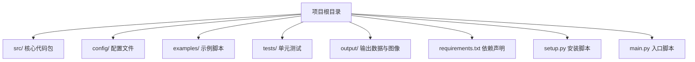
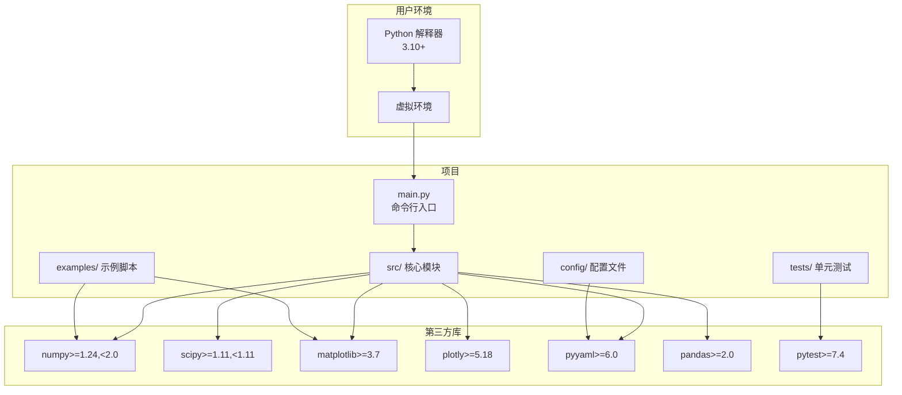
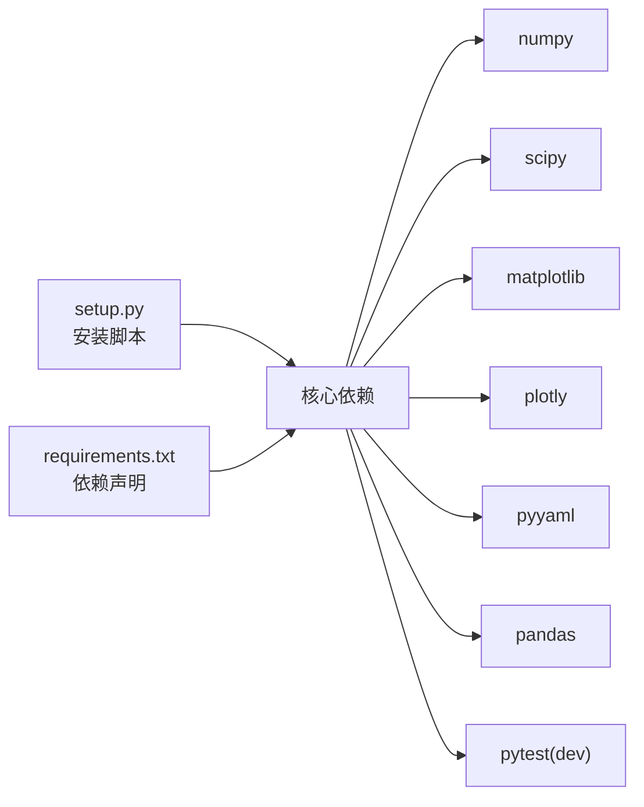

# 环境准备与安装

<cite>
**本文引用的文件列表**
- [requirements.txt](file://requirements.txt)
- [setup.py](file://setup.py)
- [README.md](file://README.md)
- [main.py](file://main.py)
- [examples/example_1_linear_response.py](file://examples/example_1_linear_response.py)
- [tests/test_control.py](file://tests/test_control.py)
- [config/aircraft.yaml](file://config/aircraft.yaml)
- [config/simulation.yaml](file://config/simulation.yaml)
- [config/control_params.yaml](file://config/control_params.yaml)
</cite>

## 目录
1. [简介](#简介)
2. [项目结构](#项目结构)
3. [核心组件](#核心组件)
4. [架构总览](#架构总览)
5. [详细组件分析](#详细组件分析)
6. [依赖关系分析](#依赖关系分析)
7. [性能考虑](#性能考虑)
8. [故障排除指南](#故障排除指南)
9. [结论](#结论)
10. [附录](#附录)

## 简介
本文件面向FixedWingSimulator项目的使用者与维护者，提供从零开始的环境准备与安装指南。内容覆盖：
- Python版本要求与推荐版本
- 必需依赖库及其版本范围
- 不同操作系统（Windows、Linux、macOS）的安装步骤（pip安装与从源码编译安装）
- 虚拟环境的创建与激活方法
- 常见安装问题与依赖冲突的解决策略

## 项目结构
FixedWingSimulator是一个基于Python的专业固定翼无人机仿真与控制平台，采用模块化设计，主要目录与职责如下：
- src：核心代码包，包含控制、动力学、环境、模型、规划、仿真、可视化等子模块
- config：仿真参数、飞行器配置、控制参数等配置文件
- examples：示例脚本，演示线性分析、非线性动力学、轨迹跟踪等场景
- tests：单元测试，覆盖控制模块的关键功能
- output：示例运行生成的数据与图像输出目录
- 根目录：入口脚本、依赖声明、安装脚本等

图表来源
- [main.py](file://main.py#L1-L145)
- [requirements.txt](file://requirements.txt#L1-L8)
- [setup.py](file://setup.py#L1-L23)

章节来源
- [main.py](file://main.py#L1-L145)
- [requirements.txt](file://requirements.txt#L1-L8)
- [setup.py](file://setup.py#L1-L23)

## 核心组件
- Python版本要求
  - 项目在安装脚本中声明了对Python版本的要求，建议使用较新的Python版本以获得更好的兼容性和性能。
  - 推荐版本：Python 3.10及以上
- 依赖库与版本范围
  - 通过requirements.txt与setup.py共同定义了核心依赖及版本范围，确保在不同环境下的一致性与可复现性。

章节来源
- [setup.py](file://setup.py#L10-L18)
- [requirements.txt](file://requirements.txt#L1-L8)

## 架构总览
下图展示了项目在运行时的典型依赖关系与交互路径，帮助理解安装与运行流程中的关键环节。

图表来源
- [setup.py](file://setup.py#L10-L21)
- [requirements.txt](file://requirements.txt#L1-L8)
- [main.py](file://main.py#L25-L26)
- [examples/example_1_linear_response.py](file://examples/example_1_linear_response.py#L25-L28)
- [tests/test_control.py](file://tests/test_control.py#L16-L17)

## 详细组件分析

### Python版本与虚拟环境
- 版本要求
  - 安装脚本明确要求Python版本不低于3.10，建议使用3.10或更高版本以获得最佳支持。
- 虚拟环境
  - 强烈建议在独立的虚拟环境中进行安装与开发，避免系统级Python环境被污染。
  - Windows/Linux/macOS均可使用venv创建虚拟环境，并在激活后执行安装步骤。

章节来源
- [setup.py](file://setup.py#L10-L10)

### 依赖库清单与版本范围
- 核心依赖（安装时自动拉取）
  - numpy：>=1.24,<2.0
  - scipy：>=1.11,<1.11（注意：此处版本范围存在上限为1.11的约束）
  - matplotlib：>=3.7
  - plotly：>=5.18
  - pyyaml：>=6.0
  - pandas：>=2.0
- 开发依赖（可选）
  - pytest：>=7.4（用于运行单元测试）

章节来源
- [setup.py](file://setup.py#L11-L21)
- [requirements.txt](file://requirements.txt#L1-L8)

### 安装步骤（Windows/Linux/macOS）
- 步骤概览
  1) 创建并激活虚拟环境
  2) 安装依赖（优先使用pip）
  3) 可选：从源码编译安装（适用于需要最新改动或特定平台优化的情况）
  4) 验证安装（运行示例或主程序）
- Windows
  - 使用PowerShell或命令提示符
  - 创建虚拟环境：python -m venv venv
  - 激活虚拟环境：venv\Scripts\Activate.ps1（PowerShell）或 venv\Scripts\activate.bat（cmd）
  - 安装依赖：pip install -r requirements.txt 或 pip install -e .
  - 运行示例：python examples\example_1_linear_response.py
- Linux/macOS
  - 终端中执行
  - 创建虚拟环境：python3 -m venv venv
  - 激活虚拟环境：source venv/bin/activate
  - 安装依赖：pip install -r requirements.txt 或 pip install -e .
  - 运行示例：python examples/example_1_linear_response.py

章节来源
- [requirements.txt](file://requirements.txt#L1-L8)
- [setup.py](file://setup.py#L1-L23)
- [examples/example_1_linear_response.py](file://examples/example_1_linear_response.py#L30-L30)

### 从源码编译安装（高级用法）
- 适用场景
  - 需要对源码进行修改并即时生效
  - 需要安装开发依赖以运行测试
- 步骤
  - 在项目根目录执行：pip install -e .
  - 若需开发依赖：pip install -e ".[dev]"
- 注意事项
  - 该方式会将src作为可导入包安装到虚拟环境中，便于调试与迭代

章节来源
- [setup.py](file://setup.py#L8-L21)

### 验证安装
- 运行主程序
  - 在项目根目录执行：python main.py
  - 可通过命令行参数选择飞机、模式、持续时间、风场等
- 运行示例
  - 执行示例脚本验证绘图与数据导出是否正常
- 运行测试
  - 在tests目录下执行：python -m pytest
  - 测试覆盖率涵盖控制模块的核心功能

章节来源
- [main.py](file://main.py#L98-L145)
- [examples/example_1_linear_response.py](file://examples/example_1_linear_response.py#L132-L144)
- [tests/test_control.py](file://tests/test_control.py#L16-L26)

## 依赖关系分析
- 依赖耦合与一致性
  - 项目同时维护requirements.txt与setup.py，两者对核心依赖的版本范围保持一致，确保pip安装与打包安装的一致性
- 版本范围差异
  - requirements.txt与setup.py在部分库的版本范围上存在差异（如scipy、matplotlib、plotly、pandas），建议以setup.py为准进行安装，避免版本冲突
- 外部依赖集成点
  - NumPy/SciPy用于数值计算与科学计算
  - Matplotlib/Plotly用于可视化与图表绘制
  - PyYAML用于读取配置文件
  - Pandas用于数据处理与CSV导出
  - PyTest用于单元测试

图表来源
- [setup.py](file://setup.py#L11-L21)
- [requirements.txt](file://requirements.txt#L1-L8)

章节来源
- [setup.py](file://setup.py#L11-L21)
- [requirements.txt](file://requirements.txt#L1-L8)

## 性能考虑
- Python版本
  - 使用较新版本的Python（如3.10+）可获得更好的性能与稳定性
- 数值库
  - NumPy/SciPy的版本范围应满足项目需求，避免过旧版本导致的性能退化
- 可视化后端
  - 示例脚本中使用非交互式后端以避免GUI窗口，适合批量运行与自动化任务

章节来源
- [examples/example_1_linear_response.py](file://examples/example_1_linear_response.py#L25-L28)

## 故障排除指南
- Python版本不匹配
  - 症状：安装失败或运行时报错
  - 解决：升级Python至3.10或更高版本；在虚拟环境中使用正确的Python解释器
- 依赖版本冲突
  - 症状：pip安装过程中出现版本冲突
  - 解决：优先使用setup.py进行安装；若仍冲突，尝试先安装高版本再安装低版本，或使用隔离的虚拟环境重新安装
- Matplotlib GUI后端问题
  - 症状：批量运行时出现GUI窗口或报错
  - 解决：在导入matplotlib前设置非交互式后端（已在示例脚本中演示）
- 权限问题（Linux/macOS）
  - 症状：无法写入输出目录或权限不足
  - 解决：确保当前用户对output目录具有读写权限；或在虚拟环境中运行
- Windows终端激活问题
  - 症状：PowerShell执行Activate.ps1报策略错误
  - 解决：调整执行策略或使用cmd的activate.bat脚本

章节来源
- [examples/example_1_linear_response.py](file://examples/example_1_linear_response.py#L25-L28)
- [tests/test_control.py](file://tests/test_control.py#L22-L25)

## 结论
通过遵循本指南，您可以在Windows、Linux与macOS上完成FixedWingSimulator的环境准备与安装。建议始终使用Python 3.10+并在独立虚拟环境中进行安装，优先参考setup.py中的版本范围以避免依赖冲突。安装完成后，可通过主程序与示例脚本快速验证环境可用性，并使用pytest运行单元测试确保核心功能稳定。

## 附录
- 常用命令速查
  - 创建虚拟环境：python -m venv venv（Windows）或 python3 -m venv venv（Linux/macOS）
  - 激活虚拟环境：Windows PowerShell执行 venv\Scripts\Activate.ps1；Windows cmd执行 venv\Scripts\activate.bat；Linux/macOS执行 source venv/bin/activate
  - 安装依赖：pip install -r requirements.txt 或 pip install -e .
  - 运行示例：python examples/example_1_linear_response.py
  - 运行测试：python -m pytest