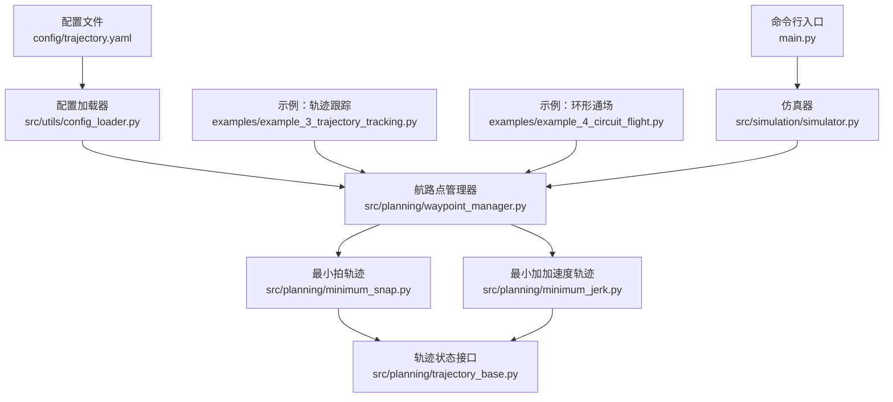
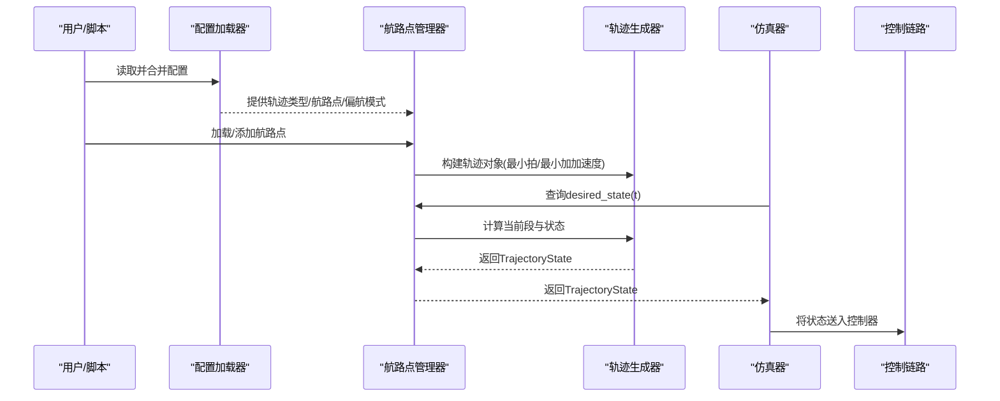
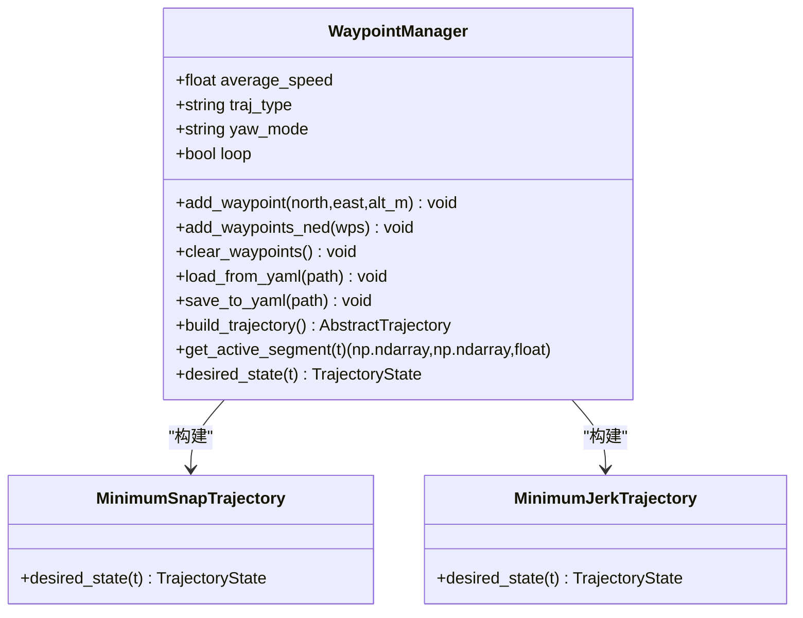
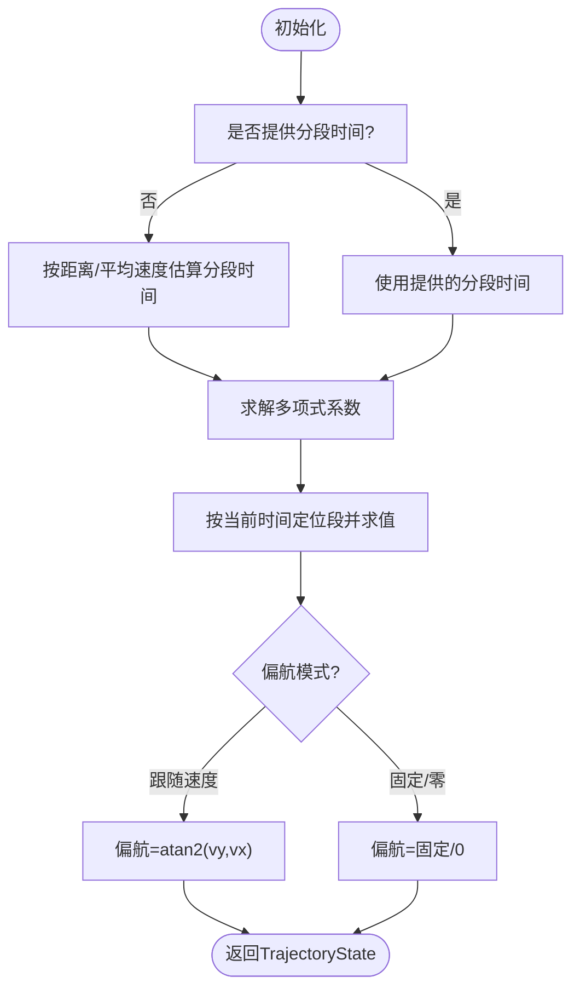
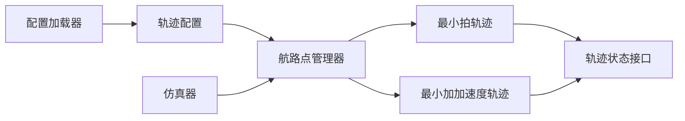

# 轨迹配置

<cite>
**本文引用的文件列表**
- [config/trajectory.yaml](file://config/trajectory.yaml)
- [src/planning/trajectory_base.py](file://src/planning/trajectory_base.py)
- [src/planning/waypoint_manager.py](file://src/planning/waypoint_manager.py)
- [src/planning/minimum_snap.py](file://src/planning/minimum_snap.py)
- [src/planning/minimum_jerk.py](file://src/planning/minimum_jerk.py)
- [src/utils/config_loader.py](file://src/utils/config_loader.py)
- [src/simulation/simulator.py](file://src/simulation/simulator.py)
- [tests/test_planning.py](file://tests/test_planning.py)
- [examples/example_3_trajectory_tracking.py](file://examples/example_3_trajectory_tracking.py)
- [examples/example_4_circuit_flight.py](file://examples/example_4_circuit_flight.py)
- [main.py](file://main.py)
</cite>

## 目录
1. [简介](#简介)
2. [项目结构](#项目结构)
3. [核心组件](#核心组件)
4. [架构总览](#架构总览)
5. [详细组件分析](#详细组件分析)
6. [依赖关系分析](#依赖关系分析)
7. [性能与参数调优](#性能与参数调优)
8. [轨迹验证与调试](#轨迹验证与调试)
9. [结论](#结论)
10. [附录：典型任务配置示例](#附录典型任务配置示例)

## 简介
本文件面向FixedWingSimulator的轨迹配置，聚焦于trajectory.yaml中的轨迹规划参数，系统性解释轨迹类型选择、航路点定义、约束条件与参数影响，并结合代码实现给出调优建议与验证方法。读者无需深入代码即可理解如何在不同飞行任务中正确配置轨迹参数，确保飞行性能与安全。

## 项目结构
与轨迹配置直接相关的模块与文件：
- 配置层：config/trajectory.yaml（轨迹类型、平均速度、偏航模式、航路点、循环）
- 规划层：src/planning/waypoint_manager.py（航路点管理与轨迹工厂）、src/planning/minimum_snap.py与minimum_jerk.py（轨迹生成器）
- 基础接口：src/planning/trajectory_base.py（轨迹状态与抽象接口）
- 配置加载：src/utils/config_loader.py（默认值合并与YAML读取）
- 使用入口：examples/example_3_trajectory_tracking.py、examples/example_4_circuit_flight.py、main.py、src/simulation/simulator.py

图表来源
- [config/trajectory.yaml](file://config/trajectory.yaml#L1-L23)
- [src/planning/waypoint_manager.py](file://src/planning/waypoint_manager.py#L1-L208)
- [src/planning/minimum_snap.py](file://src/planning/minimum_snap.py#L1-L253)
- [src/planning/minimum_jerk.py](file://src/planning/minimum_jerk.py#L1-L71)
- [src/planning/trajectory_base.py](file://src/planning/trajectory_base.py#L1-L47)
- [src/utils/config_loader.py](file://src/utils/config_loader.py#L1-L82)
- [examples/example_3_trajectory_tracking.py](file://examples/example_3_trajectory_tracking.py#L1-L194)
- [examples/example_4_circuit_flight.py](file://examples/example_4_circuit_flight.py#L1-L275)
- [main.py](file://main.py#L1-L145)
- [src/simulation/simulator.py](file://src/simulation/simulator.py#L130-L408)

章节来源
- [config/trajectory.yaml](file://config/trajectory.yaml#L1-L23)
- [src/planning/waypoint_manager.py](file://src/planning/waypoint_manager.py#L1-L208)
- [src/utils/config_loader.py](file://src/utils/config_loader.py#L1-L82)

## 核心组件
- 轨迹状态接口：定义期望轨迹状态（位置、速度、加速度、偏航角与偏航率），作为所有轨迹类型的统一输出。
- 航路点管理器：负责加载/保存航路点、构建轨迹对象、计算当前活动航段；支持最小拍与最小加加速度两种轨迹类型。
- 最小拍轨迹：通过求解多项式系数，满足边界条件与连续性，提供平滑的加速度与更高阶导数连续性。
- 最小加加速度轨迹：以5次多项式保证速度连续，适合需要较低加加速度的场景。
- 配置加载器：提供默认值合并策略，优先使用用户配置，确保字段完整性。

章节来源
- [src/planning/trajectory_base.py](file://src/planning/trajectory_base.py#L16-L47)
- [src/planning/waypoint_manager.py](file://src/planning/waypoint_manager.py#L20-L173)
- [src/planning/minimum_snap.py](file://src/planning/minimum_snap.py#L167-L253)
- [src/planning/minimum_jerk.py](file://src/planning/minimum_jerk.py#L17-L71)
- [src/utils/config_loader.py](file://src/utils/config_loader.py#L10-L82)

## 架构总览
下图展示从配置到轨迹执行的关键流程：配置文件经配置加载器合并默认值，航路点管理器根据类型构建轨迹对象，仿真器在控制回路中查询轨迹状态。

图表来源
- [src/utils/config_loader.py](file://src/utils/config_loader.py#L79-L82)
- [src/planning/waypoint_manager.py](file://src/planning/waypoint_manager.py#L127-L160)
- [src/planning/minimum_snap.py](file://src/planning/minimum_snap.py#L227-L250)
- [src/planning/minimum_jerk.py](file://src/planning/minimum_jerk.py#L50-L68)
- [src/simulation/simulator.py](file://src/simulation/simulator.py#L390-L408)

## 详细组件分析

### 轨迹配置文件（trajectory.yaml）详解
- 轨迹类型
  - 可选值：minimum_snap、minimum_jerk、minimum_accel、minimum_vel、hover
  - 默认：minimum_snap
  - 影响：决定轨迹生成算法与连续性阶数，进而影响控制难度与性能
- 平均速度（average_speed）
  - 单位：m/s
  - 作用：当未显式指定分段时间时，用于估算各航段所需时间
  - 影响：影响轨迹总时长与航段分配，过大可能引发控制压力，过小增加飞行时间
- 偏航模式（yaw_mode）
  - 可选值：none、yaw_follow、yaw_waypoint_interp、zero
  - 默认：yaw_follow
  - 影响：决定偏航角计算方式与是否跟随地速方向
- 航路点（waypoints）
  - 格式：每个航路点为[north_m, east_m, alt_m]，其中海拔为正向上（内部转换为NED down）
  - 至少两个航路点才能构建轨迹
- 循环（loop）
  - 默认：false
  - 当启用且首尾不闭合时，自动闭合形成闭环轨迹

章节来源
- [config/trajectory.yaml](file://config/trajectory.yaml#L3-L22)
- [src/planning/waypoint_manager.py](file://src/planning/waypoint_manager.py#L80-L122)

### 航路点管理器（WaypointManager）
- 职责
  - 接收用户航路点（正上方海拔输入，内部转换为NED down）
  - 依据配置类型构建轨迹对象
  - 提供当前活动航段信息与轨迹状态查询
- 关键行为
  - 加载/保存航路点至YAML
  - 自动闭合循环（loop=true且首尾不闭合时）
  - 分段时间估计：基于航路点间距与平均速度
  - 轨迹类型工厂：minimum_snap或minimum_jerk

图表来源
- [src/planning/waypoint_manager.py](file://src/planning/waypoint_manager.py#L20-L173)
- [src/planning/minimum_snap.py](file://src/planning/minimum_snap.py#L167-L253)
- [src/planning/minimum_jerk.py](file://src/planning/minimum_jerk.py#L17-L71)

章节来源
- [src/planning/waypoint_manager.py](file://src/planning/waypoint_manager.py#L20-L208)

### 最小拍轨迹（MinimumSnapTrajectory）
- 特点
  - 每轴采用奇数阶多项式（deriv_order=4对应2*M-1=7阶），保证高阶导数连续
  - 支持可选“在航路点处停车”（stop_at_waypoints）
  - 偏航模式支持跟随速度方向或固定偏航
- 时间分配
  - 若未显式提供分段时间，按航路点间距与平均速度估算
- 状态输出
  - 返回位置、速度、加速度与偏航角（偏航率通常为0）

图表来源
- [src/planning/minimum_snap.py](file://src/planning/minimum_snap.py#L181-L250)

章节来源
- [src/planning/minimum_snap.py](file://src/planning/minimum_snap.py#L167-L253)

### 最小加加速度轨迹（MinimumJerkTrajectory）
- 特点
  - 以3阶导数（加加速度）最小化为目标，每段为5次多项式
  - 与最小拍轨迹接口一致，便于替换
- 适用场景
  - 对加加速度敏感的任务，或需要更平滑的速度变化

章节来源
- [src/planning/minimum_jerk.py](file://src/planning/minimum_jerk.py#L17-L71)

### 轨迹状态接口（TrajectoryState）
- 字段
  - 位置：NED坐标（m）
  - 速度：m/s
  - 加速度：m/s²
  - 偏航角：rad
  - 偏航率：rad/s
- 用途
  - 统一控制链路与可视化模块的数据格式

章节来源
- [src/planning/trajectory_base.py](file://src/planning/trajectory_base.py#L16-L24)

## 依赖关系分析
- 配置加载器为所有子系统提供默认值合并能力，确保即使部分字段缺失也能正常运行
- 航路点管理器依赖最小拍/最小加加速度轨迹类，二者共享同一接口
- 仿真器在运行时通过查询轨迹状态参与闭环控制

图表来源
- [src/utils/config_loader.py](file://src/utils/config_loader.py#L79-L82)
- [src/planning/waypoint_manager.py](file://src/planning/waypoint_manager.py#L127-L160)
- [src/planning/minimum_snap.py](file://src/planning/minimum_snap.py#L167-L253)
- [src/planning/minimum_jerk.py](file://src/planning/minimum_jerk.py#L17-L71)
- [src/simulation/simulator.py](file://src/simulation/simulator.py#L390-L408)

章节来源
- [src/utils/config_loader.py](file://src/utils/config_loader.py#L10-L82)
- [src/planning/waypoint_manager.py](file://src/planning/waypoint_manager.py#L127-L160)
- [src/simulation/simulator.py](file://src/simulation/simulator.py#L390-L408)

## 性能与参数调优
- 轨迹类型选择
  - minimum_snap：高阶导数连续，适合对平滑性要求高的任务；控制压力较大
  - minimum_jerk：速度连续，加加速度较小，适合对控制输入平滑度敏感的任务
- 平均速度（average_speed）
  - 增大：缩短飞行时间，但可能提高控制难度与加速度峰值
  - 减小：延长飞行时间，降低控制压力，但增加任务时长
- 偏航模式（yaw_mode）
  - yaw_follow：随速度方向自然转向，适合连续轨迹
  - fixed/zero：偏航固定或为零，适合需要特定航向的任务
- 循环（loop）
  - 启用时自动闭合首尾，注意首尾距离过大可能导致分段时间不合理
- 停车约束（stop_at_waypoints）
  - 在中间航路点强制速度为零，适合需要精确停靠的任务，但会增加轨迹长度与时间

章节来源
- [config/trajectory.yaml](file://config/trajectory.yaml#L3-L22)
- [src/planning/minimum_snap.py](file://src/planning/minimum_snap.py#L181-L250)
- [src/planning/minimum_jerk.py](file://src/planning/minimum_jerk.py#L24-L68)

## 轨迹验证与调试
- 单元测试覆盖
  - 多项式系数维度与边界条件满足
  - 轨迹通过起点/终点/中间航路点
  - 速度在航段边界连续
  - 状态在整个时间段内有限
  - 偏航模式正确
- 建议验证步骤
  - 保存/加载YAML：确认航路点与配置往返一致性
  - 查看活动航段：检查当前航段与剩余时间
  - 可视化：对比实际轨迹与期望轨迹（若记录）
  - 性能指标：关注加速度/偏航角变化是否合理
- 常见问题
  - 航路点数量不足：至少两点
  - 首尾不闭合但启用循环：管理器会自动闭合，注意路径长度
  - 分段时间过大：可能导致系数不稳定，适当减小或显式指定分段时间

章节来源
- [tests/test_planning.py](file://tests/test_planning.py#L51-L328)
- [src/planning/waypoint_manager.py](file://src/planning/waypoint_manager.py#L144-L201)

## 结论
trajectory.yaml提供了固定翼轨迹规划的核心参数：轨迹类型、平均速度、偏航模式、航路点与循环。通过航路点管理器与最小拍/最小加加速度轨迹生成器，系统实现了从配置到执行的完整闭环。合理选择轨迹类型、设定平均速度与偏航模式，并在任务前进行验证与调试，可显著提升飞行性能与安全性。

## 附录：典型任务配置示例
以下示例展示了不同飞行任务的轨迹配置思路与参数选择要点。请根据实际任务需求调整航路点与参数。

- 方形巡弋（最小拍轨迹）
  - 适用场景：方形航线巡弋，需要平滑的加速度与高阶导数连续性
  - 参数要点：选择minimum_snap，设置合理的average_speed以平衡飞行时间与控制压力；偏航模式使用yaw_follow
  - 参考示例：示例脚本展示了TB2在AUTO模式下的方形轨迹跟踪
  - 章节来源
    - [examples/example_3_trajectory_tracking.py](file://examples/example_3_trajectory_tracking.py#L73-L98)
    - [config/trajectory.yaml](file://config/trajectory.yaml#L3-L22)

- 环形通场（航路点序列）
  - 适用场景：不需要多项式轨迹，仅需顺序飞越航路点
  - 参数要点：在仿真器中关闭use_trajectory，使用wp_switch_dist控制切入下一航段的距离；可启用loop_circuit实现持续循环
  - 参考示例：示例脚本展示了TB2矩形四边通场的航路点序列模式
  - 章节来源
    - [examples/example_4_circuit_flight.py](file://examples/example_4_circuit_flight.py#L81-L122)
    - [src/simulation/simulator.py](file://src/simulation/simulator.py#L346-L365)

- 命令行快速切换轨迹类型
  - 通过命令行参数traj可快速切换轨迹类型（minimum_snap、minimum_jerk、minimum_accel、minimum_vel、hover）
  - 章节来源
    - [main.py](file://main.py#L69-L73)