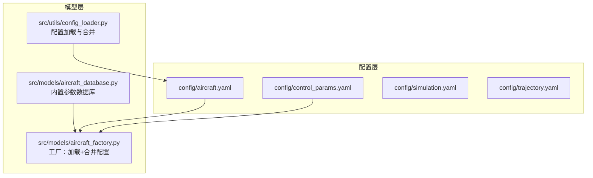
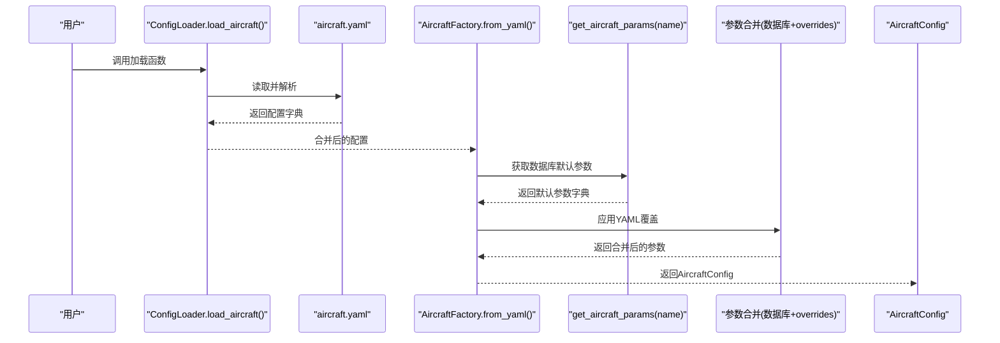
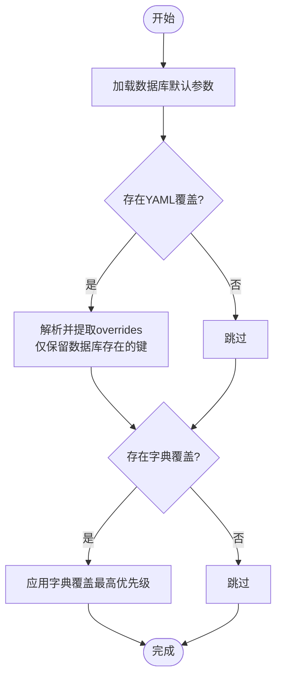
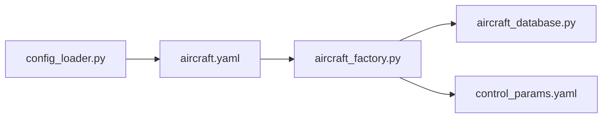

# 飞机参数配置

<cite>
**本文档引用的文件**
- [config/aircraft.yaml](file://config/aircraft.yaml)
- [src/models/aircraft_database.py](file://src/models/aircraft_database.py)
- [src/models/aircraft_factory.py](file://src/models/aircraft_factory.py)
- [src/utils/config_loader.py](file://src/utils/config_loader.py)
- [examples/example_5_different_aircraft.py](file://examples/example_5_different_aircraft.py)
- [config/control_params.yaml](file://config/control_params.yaml)
- [config/simulation.yaml](file://config/simulation.yaml)
- [config/trajectory.yaml](file://config/trajectory.yaml)
</cite>

## 目录
1. [简介](#简介)
2. [项目结构](#项目结构)
3. [核心组件](#核心组件)
4. [架构总览](#架构总览)
5. [详细组件分析](#详细组件分析)
6. [依赖关系分析](#依赖关系分析)
7. [性能考虑](#性能考虑)
8. [故障排除指南](#故障排除指南)
9. [结论](#结论)
10. [附录](#附录)

## 简介
本文件面向FixedWingSimulator的飞机参数配置，系统性说明aircraft.yaml配置文件的结构与参数含义，重点覆盖以下方面：
- 可选飞机型号列表：TB2、Anka、Aksungur、Karayel、Predator、Heron MK1、Heron MK2
- overrides部分的覆盖机制：如何通过aircraft.yaml覆盖数据库默认参数
- 关键参数的物理意义、单位与取值范围：质量(mass)、机翼面积(S)、平均气动弦长(c)、翼展(b)
- 不同飞机型号的典型参数值与配置示例
- 参数修改对仿真结果的影响分析

## 项目结构
与飞机参数配置直接相关的文件与模块如下：
- 配置文件
  - config/aircraft.yaml：定义aircraft_name与可选的overrides
  - config/control_params.yaml：控制参数（与飞机参数导出相关）
  - config/simulation.yaml：仿真配置（时间步长、初始条件等）
  - config/trajectory.yaml：轨迹规划配置
- 核心实现
  - src/models/aircraft_database.py：内置7种飞机的完整参数数据库
  - src/models/aircraft_factory.py：从数据库加载并合并配置（支持YAML与字典覆盖）
  - src/utils/config_loader.py：统一加载与合并配置（包含aircraft.yaml默认值）

图表来源
- [config/aircraft.yaml](file://config/aircraft.yaml#L1-L13)
- [src/models/aircraft_database.py](file://src/models/aircraft_database.py#L29-L133)
- [src/models/aircraft_factory.py](file://src/models/aircraft_factory.py#L42-L93)
- [src/utils/config_loader.py](file://src/utils/config_loader.py#L68-L70)

章节来源
- [config/aircraft.yaml](file://config/aircraft.yaml#L1-L13)
- [src/models/aircraft_database.py](file://src/models/aircraft_database.py#L29-L133)
- [src/models/aircraft_factory.py](file://src/models/aircraft_factory.py#L42-L93)
- [src/utils/config_loader.py](file://src/utils/config_loader.py#L68-L70)

## 核心组件
- aircraft.yaml配置文件
  - 必填项：aircraft_name，必须为数据库中的有效名称之一
  - 可选项：overrides，用于覆盖数据库默认参数
- aircraft_database.py
  - 提供7种飞机的完整参数字典（含几何、气动、惯性等）
  - 提供派生参数注入：U0（飞行速度）、rho（空气密度）、q_bar（动态压力）
- aircraft_factory.py
  - 支持从YAML文件加载并合并overrides
  - 支持传入字典参数进行最高优先级覆盖
  - 导出ArduPilot兼容参数（用于硬件在环或地面站）
- config_loader.py
  - 统一加载各子系统配置，并与默认值进行深合并

章节来源
- [config/aircraft.yaml](file://config/aircraft.yaml#L1-L13)
- [src/models/aircraft_database.py](file://src/models/aircraft_database.py#L143-L166)
- [src/models/aircraft_factory.py](file://src/models/aircraft_factory.py#L42-L93)
- [src/utils/config_loader.py](file://src/utils/config_loader.py#L68-L70)

## 架构总览
下图展示了从配置到参数使用的端到端流程。

图表来源
- [src/utils/config_loader.py](file://src/utils/config_loader.py#L68-L70)
- [src/models/aircraft_factory.py](file://src/models/aircraft_factory.py#L77-L92)
- [src/models/aircraft_database.py](file://src/models/aircraft_database.py#L143-L166)

## 详细组件分析

### aircraft.yaml配置文件结构与参数说明
- 文件位置与用途
  - 作用：选择要仿真的飞机型号，并可选地覆盖数据库默认参数
  - 默认值：若未指定，aircraft_name默认为TB2
- 可选参数
  - aircraft_name：必须为数据库中存在的名称之一
  - overrides：可覆盖数据库中的同名参数（仅对数据库已有的键生效）
- 可用飞机型号
  - TB2、Anka、Aksungur、Karayel、Predator、Heron MK1、Heron MK2
- 覆盖机制
  - 支持两种覆盖方式：YAML文件覆盖与字典覆盖（后者优先级更高）
  - 仅当键存在于数据库中时才会被应用

章节来源
- [config/aircraft.yaml](file://config/aircraft.yaml#L1-L13)
- [src/models/aircraft_factory.py](file://src/models/aircraft_factory.py#L63-L74)
- [src/models/aircraft_factory.py](file://src/models/aircraft_factory.py#L87-L92)

### 数据库参数与派生字段
- 数据库参数（示例：TB2）
  - 几何与惯性：mass、S、c、b、Ixx、Iyy、Izz、Ixz
  - 气动系数：CL_0、CL_alpha、CL_q、CL_deltae、CD_0、CD_alpha、Cm_0、Cm_alpha、Cm_q、Cm_deltae等
  - Mach数：用于计算U0
- 派生参数
  - U0：飞行速度 = Mach × 声速
  - rho：标准海平面空气密度
  - q_bar：动态压力 = 0.5 × rho × U0^2

章节来源
- [src/models/aircraft_database.py](file://src/models/aircraft_database.py#L29-L48)
- [src/models/aircraft_database.py](file://src/models/aircraft_database.py#L143-L166)

### 覆盖机制与优先级
- 加载顺序
  - 从数据库获取默认参数
  - 应用YAML文件中的overrides（支持嵌套或扁平写法）
  - 应用字典覆盖（最高优先级）
- 键过滤
  - 仅对数据库中存在的键进行覆盖，避免无效键进入参数集

图表来源
- [src/models/aircraft_factory.py](file://src/models/aircraft_factory.py#L63-L74)

章节来源
- [src/models/aircraft_factory.py](file://src/models/aircraft_factory.py#L42-L74)

### 参数覆盖示例与典型值
- 示例场景
  - 将TB2的质量从默认值调整为更大或更小，观察其对纵向模态与非线性响应的影响
  - 修改翼展b或机翼面积S，评估升阻特性变化
- 典型参数范围参考
  - 质量(mass)：典型范围约数百至数千千克（具体取决于机型）
  - 机翼面积(S)：典型范围约数十平方米
  - 平均气动弦长(c)：典型范围约零点几到一米级
  - 翼展(b)：典型范围约十到二十多米
- 注意事项
  - 覆盖参数需与数据库中的键一致，否则不会生效
  - 派生参数（如U0、rho、q_bar）由程序自动注入，无需手动设置

章节来源
- [src/models/aircraft_database.py](file://src/models/aircraft_database.py#L29-L133)
- [src/models/aircraft_factory.py](file://src/models/aircraft_factory.py#L63-L74)

### 参数修改对仿真结果的影响
- 质量(mass)
  - 影响惯性与加速度响应；增大质量通常降低加速度但提升稳定性
- 机翼面积(S)与平均气动弦长(c)
  - 影响升力与阻力；改变S或c会显著影响升阻比与操控特性
- 翼展(b)
  - 影响展弦比与诱导阻力；增大b通常改善升阻比但可能增加结构重量
- 气动系数
  - CL、CD、Cm等系数直接影响纵向与横向/方向稳定性和控制效率

章节来源
- [src/models/aircraft_database.py](file://src/models/aircraft_database.py#L40-L47)
- [examples/example_5_different_aircraft.py](file://examples/example_5_different_aircraft.py#L24-L33)

## 依赖关系分析
- 模块耦合
  - ConfigLoader负责加载aircraft.yaml并与其默认值合并
  - AircraftFactory依赖数据库接口获取默认参数，并执行覆盖合并
  - aircraft_database提供参数字典与派生参数注入
- 外部依赖
  - YAML解析依赖PyYAML
  - 数值集成依赖SciPy（在仿真模块中使用）

图表来源
- [src/utils/config_loader.py](file://src/utils/config_loader.py#L68-L70)
- [src/models/aircraft_factory.py](file://src/models/aircraft_factory.py#L61-L74)
- [src/models/aircraft_database.py](file://src/models/aircraft_database.py#L143-L166)

章节来源
- [src/utils/config_loader.py](file://src/utils/config_loader.py#L68-L70)
- [src/models/aircraft_factory.py](file://src/models/aircraft_factory.py#L61-L74)
- [src/models/aircraft_database.py](file://src/models/aircraft_database.py#L143-L166)

## 性能考虑
- 参数覆盖的开销极小，主要为字典更新操作
- 派生参数的计算为常数时间复杂度，对整体性能影响可忽略
- 在批量分析场景中，建议复用已合并的参数字典，避免重复加载

## 故障排除指南
- aircraft_name不在数据库中
  - 现象：抛出异常，提示可用机型列表
  - 处理：确认拼写正确且在数据库中存在
- 覆盖键不存在于数据库
  - 现象：该键不会生效
  - 处理：检查键名是否与数据库一致
- YAML格式错误
  - 现象：解析失败
  - 处理：检查缩进与语法，确保overrides为字典或支持的嵌套形式

章节来源
- [src/models/aircraft_database.py](file://src/models/aircraft_database.py#L153-L156)
- [src/models/aircraft_factory.py](file://src/models/aircraft_factory.py#L67-L68)

## 结论
通过aircraft.yaml与aircraft_factory的组合，用户可以灵活地选择飞机型号并精确覆盖关键参数。数据库提供了完整的基准参数与派生字段，确保仿真引擎能够稳定运行。合理调整质量、机翼面积、平均气动弦长与翼展等参数，可有效模拟不同飞行器的动态特性与控制行为。

## 附录

### 飞机型号与典型参数概览
- TB2：中型无人机，适合作为基准机型
- Anka：较大型，具有更大的机翼面积与质量
- Aksungur：大型固定翼无人机，翼展与面积较大
- Karayel：小型无人机，质量与尺寸较小
- Predator：中型无人机，广泛用于对比分析
- Heron MK1/MK2：大型高空长航时无人机，相似参数

章节来源
- [src/models/aircraft_database.py](file://src/models/aircraft_database.py#L29-L133)

### 配置文件与默认值参考
- aircraft.yaml
  - aircraft_name默认：TB2
  - overrides默认：空字典
- control_params.yaml
  - 包含飞行包线、PID参数、TECS参数等
- simulation.yaml
  - 时间步长、总时长、积分器、初始条件、风场与日志等
- trajectory.yaml
  - 轨迹类型、平均速度、航向模式、航路点与循环标志

章节来源
- [src/utils/config_loader.py](file://src/utils/config_loader.py#L10-L37)
- [config/control_params.yaml](file://config/control_params.yaml#L1-L45)
- [config/simulation.yaml](file://config/simulation.yaml#L1-L30)
- [config/trajectory.yaml](file://config/trajectory.yaml#L1-L23)