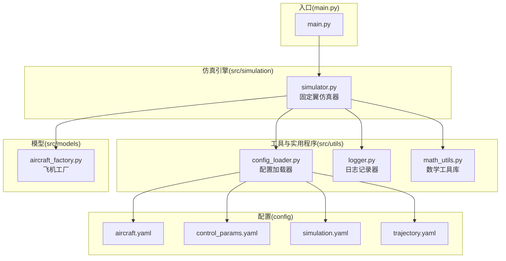
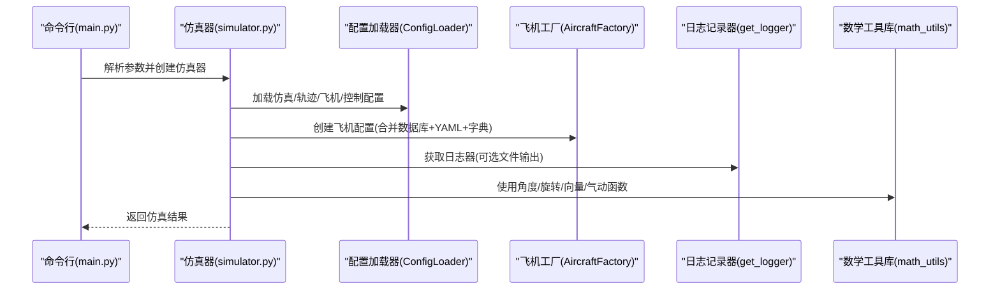
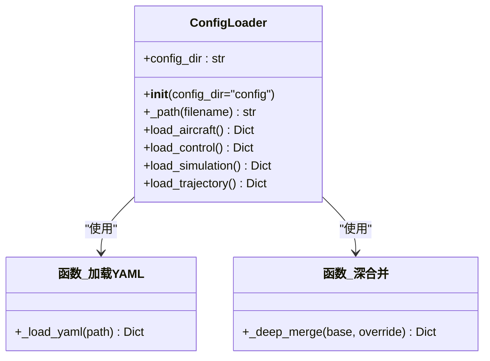
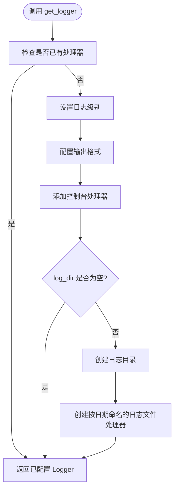
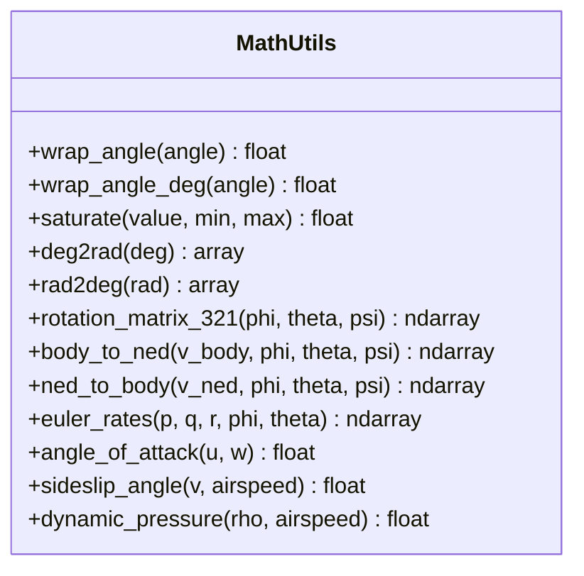
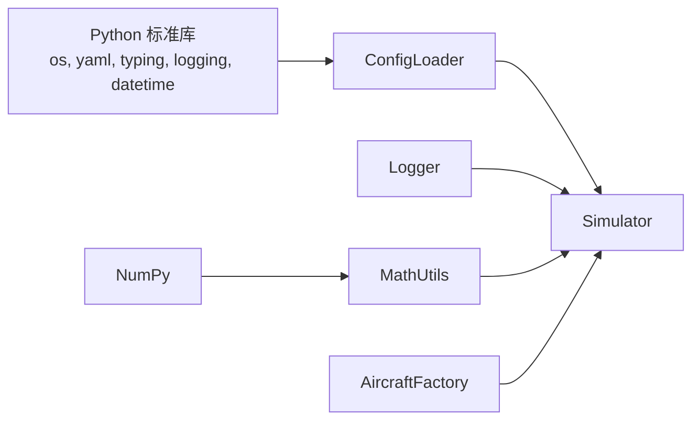

# 工具与实用程序

<cite>
**本文引用的文件**
- [src/utils/config_loader.py](file://src/utils/config_loader.py)
- [src/utils/logger.py](file://src/utils/logger.py)
- [src/utils/math_utils.py](file://src/utils/math_utils.py)
- [config/aircraft.yaml](file://config/aircraft.yaml)
- [config/control_params.yaml](file://config/control_params.yaml)
- [config/simulation.yaml](file://config/simulation.yaml)
- [config/trajectory.yaml](file://config/trajectory.yaml)
- [src/simulation/simulator.py](file://src/simulation/simulator.py)
- [src/models/aircraft_factory.py](file://src/models/aircraft_factory.py)
- [main.py](file://main.py)
</cite>

## 目录
1. [简介](#简介)
2. [项目结构](#项目结构)
3. [核心组件](#核心组件)
4. [架构总览](#架构总览)
5. [详细组件分析](#详细组件分析)
6. [依赖分析](#依赖分析)
7. [性能考虑](#性能考虑)
8. [故障排查指南](#故障排查指南)
9. [结论](#结论)
10. [附录](#附录)

## 简介
本章节概述工具与实用程序模块在系统中的定位与职责：负责配置加载与合并、日志记录封装以及通用数学工具函数（角度换算、旋转矩阵、向量变换、气动辅助函数等）。这些模块为仿真引擎提供基础能力支撑，贯穿于建模、控制、规划与可视化等子系统。

## 项目结构
工具与实用程序模块位于 src/utils 目录下，配合 config 目录中的 YAML 配置文件工作；同时在主入口与仿真引擎中被广泛使用。

图表来源
- [src/utils/config_loader.py](file://src/utils/config_loader.py#L1-L82)
- [src/utils/logger.py](file://src/utils/logger.py#L1-L44)
- [src/utils/math_utils.py](file://src/utils/math_utils.py#L1-L124)
- [config/aircraft.yaml](file://config/aircraft.yaml#L1-L13)
- [config/control_params.yaml](file://config/control_params.yaml#L1-L45)
- [config/simulation.yaml](file://config/simulation.yaml#L1-L30)
- [config/trajectory.yaml](file://config/trajectory.yaml#L1-L23)
- [src/simulation/simulator.py](file://src/simulation/simulator.py#L1-L200)
- [src/models/aircraft_factory.py](file://src/models/aircraft_factory.py#L1-L136)
- [main.py](file://main.py#L1-L145)

章节来源
- [src/utils/config_loader.py](file://src/utils/config_loader.py#L1-L82)
- [src/utils/logger.py](file://src/utils/logger.py#L1-L44)
- [src/utils/math_utils.py](file://src/utils/math_utils.py#L1-L124)
- [config/aircraft.yaml](file://config/aircraft.yaml#L1-L13)
- [config/control_params.yaml](file://config/control_params.yaml#L1-L45)
- [config/simulation.yaml](file://config/simulation.yaml#L1-L30)
- [config/trajectory.yaml](file://config/trajectory.yaml#L1-L23)
- [src/simulation/simulator.py](file://src/simulation/simulator.py#L1-L200)
- [src/models/aircraft_factory.py](file://src/models/aircraft_factory.py#L1-L136)
- [main.py](file://main.py#L1-L145)

## 核心组件
- 配置加载器：从指定目录加载多个 YAML 文件，按默认配置进行深合并，返回结构化字典，供仿真器与工厂模块使用。
- 日志记录器：提供统一的日志接口，支持控制台与可选文件输出，自动按日期生成日志文件。
- 数学工具库：提供角度换算、饱和限幅、三角函数向量化、3-2-1 欧拉角旋转矩阵、体坐标与 NED 坐标系之间的向量变换、空速/攻角/侧滑角/动压等气动辅助函数。

章节来源
- [src/utils/config_loader.py](file://src/utils/config_loader.py#L10-L82)
- [src/utils/logger.py](file://src/utils/logger.py#L10-L44)
- [src/utils/math_utils.py](file://src/utils/math_utils.py#L13-L124)

## 架构总览
工具与实用程序模块通过以下方式融入系统：
- 主入口解析命令行参数后构造仿真器，仿真器内部实例化配置加载器并读取各子系统配置。
- 飞机工厂从数据库获取基础参数，再根据 YAML 覆盖项与字典覆盖项进行合并，形成最终配置。
- 日志记录器在需要时被调用，统一输出格式与级别。
- 数学工具库在动力学、坐标变换、控制链路等模块中被频繁使用。

图表来源
- [main.py](file://main.py#L98-L145)
- [src/simulation/simulator.py](file://src/simulation/simulator.py#L130-L200)
- [src/utils/config_loader.py](file://src/utils/config_loader.py#L59-L82)
- [src/models/aircraft_factory.py](file://src/models/aircraft_factory.py#L42-L93)
- [src/utils/logger.py](file://src/utils/logger.py#L10-L44)
- [src/utils/math_utils.py](file://src/utils/math_utils.py#L43-L124)

## 详细组件分析

### 配置加载器（ConfigLoader）
功能概述
- 提供按子系统加载 YAML 的方法：飞机、控制、仿真、轨迹。
- 内置默认配置字典，使用深合并策略将用户 YAML 覆盖项与默认值合并，保证字段完整性与优先级。
- 支持自定义配置目录路径，默认指向项目根下的 config 目录。

实现要点
- 文件存在性检查：若目标文件不存在则返回空字典，避免异常中断。
- 深合并算法：递归地对嵌套字典进行合并，非字典键直接覆盖。
- 默认配置覆盖顺序：默认值 ← 用户 YAML ← 更高优先级的运行时字典（由上层模块传入）。

图表来源
- [src/utils/config_loader.py](file://src/utils/config_loader.py#L40-L82)

参数验证与校验
- 当前实现未在配置加载阶段执行字段类型或范围校验；建议在上层模块（如仿真器、工厂）对关键字段进行显式校验与转换，例如 dt、duration、风场参数、航路点格式等。

使用示例与最佳实践
- 在主入口或仿真器初始化处创建 ConfigLoader 实例，分别调用对应方法获取配置字典。
- 将返回的字典作为参数传入相应模块（如仿真器、轨迹规划、控制参数对象），并在调用前进行必要的类型检查与边界判断。
- 对于飞机配置，建议先从数据库获取默认参数，再通过 ConfigLoader 的飞机配置与工厂的 YAML 覆盖机制完成合并。

章节来源
- [src/utils/config_loader.py](file://src/utils/config_loader.py#L10-L82)
- [config/aircraft.yaml](file://config/aircraft.yaml#L1-L13)
- [config/control_params.yaml](file://config/control_params.yaml#L1-L45)
- [config/simulation.yaml](file://config/simulation.yaml#L1-L30)
- [config/trajectory.yaml](file://config/trajectory.yaml#L1-L23)
- [src/simulation/simulator.py](file://src/simulation/simulator.py#L148-L172)
- [src/models/aircraft_factory.py](file://src/models/aircraft_factory.py#L42-L93)

### 日志记录系统（Logger）
功能概述
- 提供统一命名的 Logger 实例，自动配置控制台处理器与可选文件处理器。
- 输出格式包含时间戳、模块名、日志级别与消息正文，便于调试与审计。
- 文件输出按日期命名，自动创建日志目录。

实现要点
- 防重复配置：若 Logger 已有处理器，则直接返回，避免重复添加处理器。
- 可选文件输出：当 log_dir 非空时启用文件处理器，否则仅控制台输出。
- 级别设置：通过 level 参数控制日志级别，支持 INFO、DEBUG、WARNING、ERROR 等标准级别。

图表来源
- [src/utils/logger.py](file://src/utils/logger.py#L10-L44)

使用示例与最佳实践
- 在每个模块顶部调用 get_logger(__name__) 获取专用 Logger。
- 在需要长期运行或批量实验场景下启用文件输出，以便后续分析。
- 对关键事件（如仿真开始/结束、参数变更、异常）使用不同级别输出，便于检索。

章节来源
- [src/utils/logger.py](file://src/utils/logger.py#L10-L44)
- [src/simulation/simulator.py](file://src/simulation/simulator.py#L160-L172)

### 数学工具库（Math Utils）
功能概述
- 角度工具：弧度/角度互转、角度归一化到 [-π, π] 或 [-180, 180]。
- 饱和限幅：数值裁剪到指定区间，支持向量化输入。
- 旋转矩阵与欧拉角：基于 Z-Y-X（3-2-1）顺序的 DCM，支持体坐标与 NED 坐标系互转。
- 欧拉角速率：从机体角速率求解欧拉角导数，内置数值稳定保护。
- 气动辅助：攻角、侧滑角、动压计算，包含数值保护与裁剪。

图表来源
- [src/utils/math_utils.py](file://src/utils/math_utils.py#L13-L124)

使用示例与最佳实践
- 在姿态更新与坐标变换中优先使用 rotation_matrix_321 与 body_to_ned/ned_to_body，确保帧间一致性。
- 使用 euler_rates 时注意奇异姿态（俯仰角接近 ±90°）的数值保护，必要时在外层逻辑规避。
- 计算攻角/侧滑角时确保空速大于阈值，避免反三角函数域错误。
- 对控制输出与执行机构位置进行饱和限幅，防止越界。

章节来源
- [src/utils/math_utils.py](file://src/utils/math_utils.py#L13-L124)
- [src/simulation/simulator.py](file://src/simulation/simulator.py#L52-L52)

## 依赖分析
- 配置加载器依赖 Python 标准库 os、yaml 与 typing；返回的字典供上层模块消费。
- 日志记录器依赖 logging、os、datetime；无第三方依赖，易于集成。
- 数学工具库依赖 NumPy，提供向量化与矩阵运算能力。
- 仿真器在初始化阶段依赖配置加载器与飞机工厂；日志记录器与数学工具库在运行期被广泛调用。

图表来源
- [src/utils/config_loader.py](file://src/utils/config_loader.py#L5-L8)
- [src/utils/logger.py](file://src/utils/logger.py#L5-L8)
- [src/utils/math_utils.py](file://src/utils/math_utils.py#L6)
- [src/simulation/simulator.py](file://src/simulation/simulator.py#L51-L52)

章节来源
- [src/utils/config_loader.py](file://src/utils/config_loader.py#L5-L8)
- [src/utils/logger.py](file://src/utils/logger.py#L5-L8)
- [src/utils/math_utils.py](file://src/utils/math_utils.py#L6)
- [src/simulation/simulator.py](file://src/simulation/simulator.py#L51-L52)

## 性能考虑
- 配置加载：YAML 解析与深合并均为轻量操作，通常开销可忽略；建议在启动阶段一次性加载并缓存配置字典。
- 日志输出：文件写入可能成为瓶颈，建议在高频循环中降低日志频率或使用异步日志（需额外实现）。
- 数学运算：NumPy 向量化显著提升效率；尽量批量处理数组而非逐元素循环。
- 角度运算与三角函数：在高频控制回路中应避免不必要的重复计算，可复用中间结果。

## 故障排查指南
常见问题与对策
- 配置文件缺失或路径错误
  - 现象：配置加载返回空字典或默认值未生效。
  - 排查：确认 config_dir 路径正确，文件存在且可读；检查 YAML 语法。
  - 参考
    - [src/utils/config_loader.py](file://src/utils/config_loader.py#L40-L45)
    - [src/simulation/simulator.py](file://src/simulation/simulator.py#L149-L153)
- 日志不输出到文件
  - 现象：仅控制台输出，无日志文件。
  - 排查：确认 log_dir 非空；检查目录权限与磁盘空间。
  - 参考
    - [src/utils/logger.py](file://src/utils/logger.py#L35-L42)
- 角度奇异导致欧拉角速率异常
  - 现象：俯仰角接近 ±90° 时出现数值不稳定。
  - 排查：在上层逻辑中规避奇异姿态或增加保护条件。
  - 参考
    - [src/utils/math_utils.py](file://src/utils/math_utils.py#L87-L91)
- 空速过小导致攻角/侧滑角计算异常
  - 现象：反三角函数域错误或结果不稳定。
  - 排查：确保空速大于安全阈值，必要时加入裁剪。
  - 参考
    - [src/utils/math_utils.py](file://src/utils/math_utils.py#L117-L118)

章节来源
- [src/utils/config_loader.py](file://src/utils/config_loader.py#L40-L45)
- [src/utils/logger.py](file://src/utils/logger.py#L35-L42)
- [src/utils/math_utils.py](file://src/utils/math_utils.py#L87-L118)
- [src/simulation/simulator.py](file://src/simulation/simulator.py#L149-L153)

## 结论
工具与实用程序模块为系统提供了稳健的配置管理、一致的日志输出与高效的数学运算能力。通过合理的使用与最佳实践，可在保证可维护性的同时提升整体性能与可靠性。建议在上层模块中补充必要的参数校验与边界处理，确保系统在各种工况下的稳定性。

## 附录
- 使用示例路径参考
  - 配置加载：参见仿真器初始化与工厂合并流程
    - [src/simulation/simulator.py](file://src/simulation/simulator.py#L148-L172)
    - [src/models/aircraft_factory.py](file://src/models/aircraft_factory.py#L42-L93)
  - 日志使用：参见仿真器环境初始化与控制参数校验
    - [src/simulation/simulator.py](file://src/simulation/simulator.py#L160-L172)
  - 数学工具：参见仿真器中坐标变换与控制链路
    - [src/simulation/simulator.py](file://src/simulation/simulator.py#L52-L52)
    - [src/utils/math_utils.py](file://src/utils/math_utils.py#L43-L124)
- 配置文件参考
  - [config/aircraft.yaml](file://config/aircraft.yaml#L1-L13)
  - [config/control_params.yaml](file://config/control_params.yaml#L1-L45)
  - [config/simulation.yaml](file://config/simulation.yaml#L1-L30)
  - [config/trajectory.yaml](file://config/trajectory.yaml#L1-L23)
- 入口与主流程
  - [main.py](file://main.py#L98-L145)