# 数学工具函数

<cite>
**本文引用的文件**
- [src/utils/math_utils.py](file://src/utils/math_utils.py)
- [src/dynamics/coordinate_transform.py](file://src/dynamics/coordinate_transform.py)
- [src/dynamics/aerodynamics.py](file://src/dynamics/aerodynamics.py)
- [src/dynamics/nonlinear_model.py](file://src/dynamics/nonlinear_model.py)
- [src/dynamics/linear_model.py](file://src/dynamics/linear_model.py)
- [src/models/aircraft_database.py](file://src/models/aircraft_database.py)
- [src/environment/aerodynamic_forces.py](file://src/environment/aerodynamic_forces.py)
- [examples/example_1_linear_response.py](file://examples/example_1_linear_response.py)
- [examples/example_2_nonlinear_dynamics.py](file://examples/example_2_nonlinear_dynamics.py)
- [main.py](file://main.py)
</cite>

## 目录
1. [简介](#简介)
2. [项目结构](#项目结构)
3. [核心组件](#核心组件)
4. [架构总览](#架构总览)
5. [详细组件分析](#详细组件分析)
6. [依赖关系分析](#依赖关系分析)
7. [性能考量](#性能考量)
8. [故障排查指南](#故障排查指南)
9. [结论](#结论)
10. [附录](#附录)

## 简介
本文件系统性梳理并深入解析数学工具函数模块，覆盖坐标变换、向量运算、矩阵计算、三角函数与角度换算、数值稳定性与边界条件处理等。文档同时结合固定翼仿真场景，解释姿态角转换、速度分解、力矩计算等关键数学应用，并提供使用示例与性能优化建议，帮助读者在工程实践中高效、安全地使用这些数学函数。

## 项目结构
数学工具函数主要分布在以下模块：
- 工具层：角度换算、饱和、旋转矩阵、欧拉角率等
- 坐标变换层：从 NED 到机体坐标系的变换与风速转换
- 动力学层：升阻系数模型、气动力与力矩计算
- 飞行动力学模型：非线性六自由度与线性四自由度模型
- 数据层：飞机参数数据库与派生常量注入
- 环境层：风引起的附加气动阻尼估算

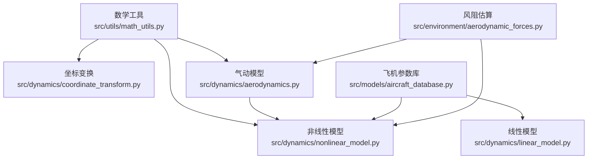

图表来源
- [src/utils/math_utils.py](file://src/utils/math_utils.py#L1-L124)
- [src/dynamics/coordinate_transform.py](file://src/dynamics/coordinate_transform.py#L1-L70)
- [src/dynamics/aerodynamics.py](file://src/dynamics/aerodynamics.py#L1-L148)
- [src/dynamics/nonlinear_model.py](file://src/dynamics/nonlinear_model.py#L1-L386)
- [src/dynamics/linear_model.py](file://src/dynamics/linear_model.py#L1-L319)
- [src/models/aircraft_database.py](file://src/models/aircraft_database.py#L1-L183)
- [src/environment/aerodynamic_forces.py](file://src/environment/aerodynamic_forces.py#L1-L54)

章节来源
- [src/utils/math_utils.py](file://src/utils/math_utils.py#L1-L124)
- [src/dynamics/coordinate_transform.py](file://src/dynamics/coordinate_transform.py#L1-L70)
- [src/dynamics/aerodynamics.py](file://src/dynamics/aerodynamics.py#L1-L148)
- [src/dynamics/nonlinear_model.py](file://src/dynamics/nonlinear_model.py#L1-L386)
- [src/dynamics/linear_model.py](file://src/dynamics/linear_model.py#L1-L319)
- [src/models/aircraft_database.py](file://src/models/aircraft_database.py#L1-L183)
- [src/environment/aerodynamic_forces.py](file://src/environment/aerodynamic_forces.py#L1-L54)

## 核心组件
- 角度与单位换算：弧度/角度互转、角度包裹（[-π,π]、[-180,180]）、数值饱和
- 旋转矩阵与欧拉角率：3-2-1 欧拉角顺序（ZYX），NED 与机体坐标系互转，欧拉角时间导数
- 空速与侧滑角：基于 arctan2 与 arcsin 的攻角与侧滑角计算，动态压强
- 气动力与力矩：基于非维升阻系数与几何参数的气动力/力矩模型
- 风阻估算：相对风速引起的附加气动阻尼近似
- 飞机参数数据库：标准参数与派生常量（空速、密度、动压）注入

章节来源
- [src/utils/math_utils.py](file://src/utils/math_utils.py#L13-L124)
- [src/dynamics/aerodynamics.py](file://src/dynamics/aerodynamics.py#L19-L148)
- [src/environment/aerodynamic_forces.py](file://src/environment/aerodynamic_forces.py#L13-L54)
- [src/models/aircraft_database.py](file://src/models/aircraft_database.py#L143-L166)

## 架构总览
数学工具函数贯穿坐标变换、气动建模与飞行动力学求解，形成“工具层 → 变换层 → 动力学层”的清晰分层。工具层提供基础数值运算与角度/单位换算；变换层负责 NED 与机体坐标系之间的向量与矩阵转换；动力学层以气动模型为基础，结合风阻与重力，构建非线性/线性状态空间。

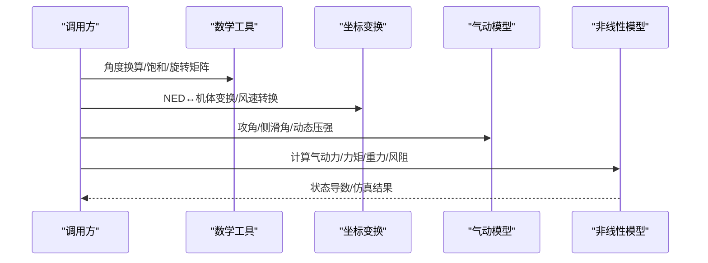

图表来源
- [src/utils/math_utils.py](file://src/utils/math_utils.py#L13-L124)
- [src/dynamics/coordinate_transform.py](file://src/dynamics/coordinate_transform.py#L29-L70)
- [src/dynamics/aerodynamics.py](file://src/dynamics/aerodynamics.py#L35-L148)
- [src/dynamics/nonlinear_model.py](file://src/dynamics/nonlinear_model.py#L160-L256)

## 详细组件分析

### 角度与单位换算
- 角度包裹：将任意弧度或角度映射到 [-π, π] 或 [-180, 180] 区间，避免跳变
- 单位换算：向量化度/弧度互转，支持标量与数组
- 数值饱和：限制控制量/状态在合理范围，防止异常发散

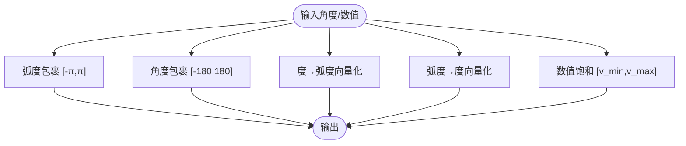

图表来源
- [src/utils/math_utils.py](file://src/utils/math_utils.py#L13-L36)
- [src/utils/math_utils.py](file://src/utils/math_utils.py#L23-L25)

章节来源
- [src/utils/math_utils.py](file://src/utils/math_utils.py#L13-L36)
- [src/utils/math_utils.py](file://src/utils/math_utils.py#L23-L25)

### 旋转矩阵与欧拉角率
- 3-2-1 欧拉角顺序（ZYX），NED 与机体坐标系方向余弦矩阵
- 向量在两坐标系间的变换：R 与 R^T
- 欧拉角时间导数：由机体角速率 p,q,r 推导 φ̇,θ̇,ψ̇，在 θ=±90° 处采用小 ε 保护避免奇异

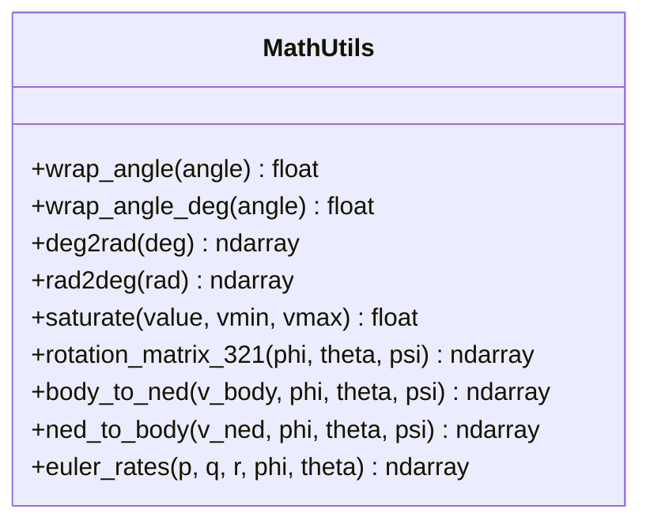

图表来源
- [src/utils/math_utils.py](file://src/utils/math_utils.py#L43-L101)

章节来源
- [src/utils/math_utils.py](file://src/utils/math_utils.py#L43-L101)

### 坐标变换与风速转换
- 方向余弦矩阵别名：dcm_from_euler
- NED → 机体：wind_to_body_frame
- 真空速向量：airspeed_vector = 机体速度 − 机体风速

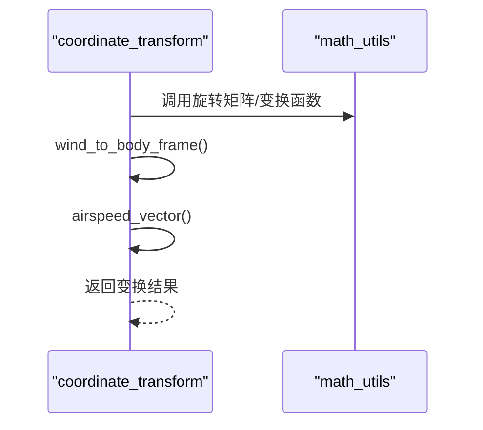

图表来源
- [src/dynamics/coordinate_transform.py](file://src/dynamics/coordinate_transform.py#L29-L70)
- [src/utils/math_utils.py](file://src/utils/math_utils.py#L43-L77)

章节来源
- [src/dynamics/coordinate_transform.py](file://src/dynamics/coordinate_transform.py#L29-L70)

### 气动角与动态压强
- 攻角：基于 arctan2(w,u)，避免符号歧义
- 侧滑角：基于 arcsin(v/V)，对 v/V 进行裁剪确保在 [-1,1] 内
- 动态压强：q_bar = 0.5·ρ·V^2

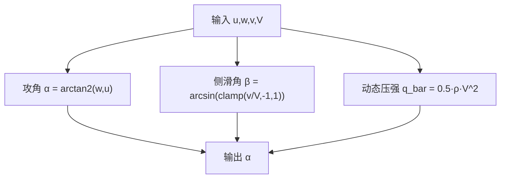

图表来源
- [src/utils/math_utils.py](file://src/utils/math_utils.py#L107-L124)

章节来源
- [src/utils/math_utils.py](file://src/utils/math_utils.py#L107-L124)

### 气动力与力矩模型
- 输入：机体速度 (u,v,w)、角速率 (p,q,r)、控制面偏转 (de,da,dr)、参数字典、风速（可选）
- 步骤：
  - 计算真空气速与动态压强
  - 计算攻角与侧滑角
  - 归一化角速率（基于参考弦长与速度）
  - 计算纵向与横向/方向系数（线性叠加）
  - 计算气动力与力矩（X,Y,Z 与 L,M,N）

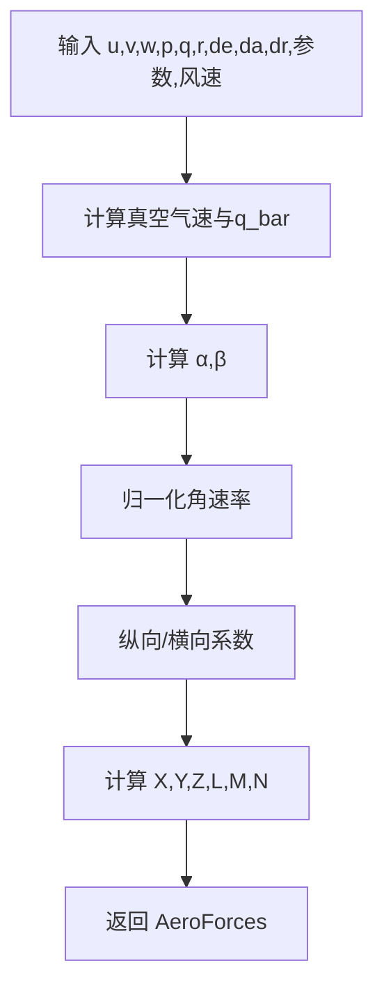

图表来源
- [src/dynamics/aerodynamics.py](file://src/dynamics/aerodynamics.py#L35-L148)

章节来源
- [src/dynamics/aerodynamics.py](file://src/dynamics/aerodynamics.py#L35-L148)

### 风阻估算（附加气动阻尼）
- 目的：估计相对于当前速度的风引起的附加气动阻尼增量
- 方法：ΔF = −0.5·ρ·S·CD0·|v_rel|·(v_rel/|v_rel|)

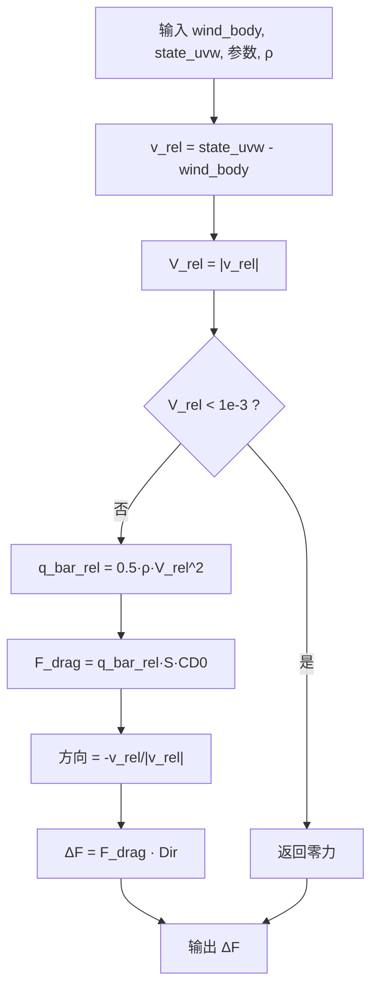

图表来源
- [src/environment/aerodynamic_forces.py](file://src/environment/aerodynamic_forces.py#L13-L54)

章节来源
- [src/environment/aerodynamic_forces.py](file://src/environment/aerodynamic_forces.py#L13-L54)

### 飞机参数数据库与派生常量
- 提供多型无人机的标准几何与气动参数
- 注入派生常量：U0（巡航速度）、ρ（空气密度）、q_bar（动压）

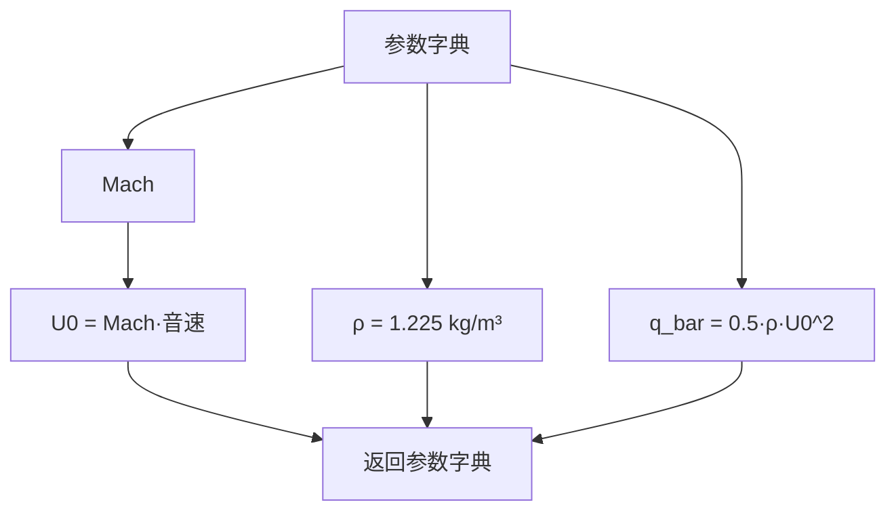

图表来源
- [src/models/aircraft_database.py](file://src/models/aircraft_database.py#L143-L166)

章节来源
- [src/models/aircraft_database.py](file://src/models/aircraft_database.py#L143-L166)

### 非线性六自由度模型
- 状态：[u,v,w, p,q,r, φ,θ,ψ, xN,xE,xD]
- 动力学：牛顿-欧拉方程，含气动力、推力、重力、风阻
- 控制：elevator, aileron, rudder, throttle
- 输出：状态导数、仿真轨迹、派生变量（空速、攻角、侧滑角、动能、势能）

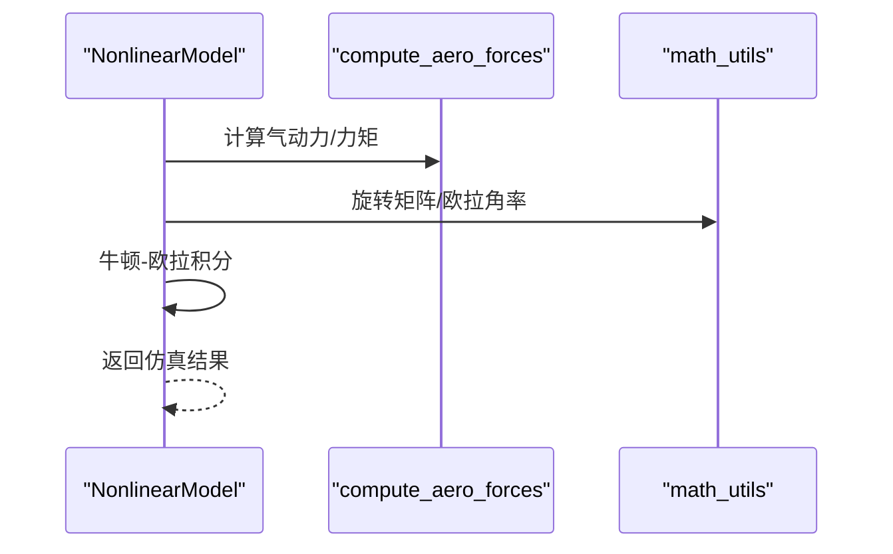

图表来源
- [src/dynamics/nonlinear_model.py](file://src/dynamics/nonlinear_model.py#L160-L256)
- [src/dynamics/aerodynamics.py](file://src/dynamics/aerodynamics.py#L35-L148)
- [src/utils/math_utils.py](file://src/utils/math_utils.py#L43-L101)

章节来源
- [src/dynamics/nonlinear_model.py](file://src/dynamics/nonlinear_model.py#L104-L386)

### 线性四自由度模型
- 状态：[u_p, α, q, θ]（扰动变量）
- 输入：[delta_T, delta_e]（推力与升降舵扰动）
- 输出：A,B 矩阵、模态分析（短周期、长周期、阻尼模式）

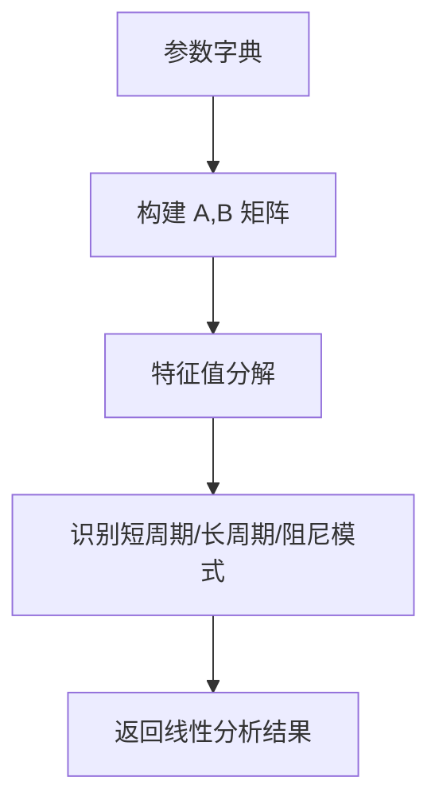

图表来源
- [src/dynamics/linear_model.py](file://src/dynamics/linear_model.py#L129-L201)
- [src/dynamics/linear_model.py](file://src/dynamics/linear_model.py#L206-L252)

章节来源
- [src/dynamics/linear_model.py](file://src/dynamics/linear_model.py#L107-L319)

## 依赖关系分析
- math_utils 是所有变换与动力学模块的基础依赖
- coordinate_transform 仅依赖 math_utils 的变换函数
- aerodynamics 依赖 math_utils 的攻角、侧滑角与动态压强
- nonlinear_model 依赖 aerodynamics 与 math_utils 的旋转矩阵与欧拉角率
- linear_model 依赖 aircraft_database 的参数
- environment.aerodynamic_forces 与 nonlinear_model、aerodynamics 共同作用于风阻估算

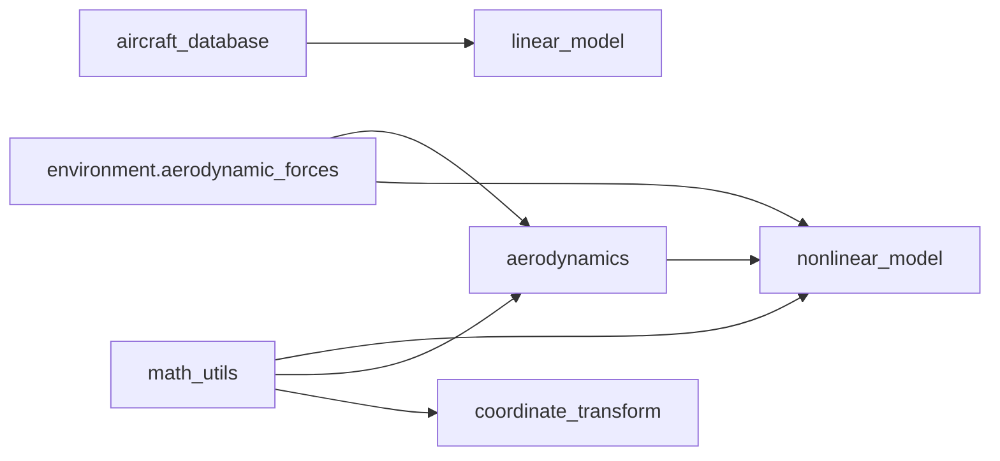

图表来源
- [src/utils/math_utils.py](file://src/utils/math_utils.py#L1-L124)
- [src/dynamics/coordinate_transform.py](file://src/dynamics/coordinate_transform.py#L10-L16)
- [src/dynamics/aerodynamics.py](file://src/dynamics/aerodynamics.py#L11-L13)
- [src/dynamics/nonlinear_model.py](file://src/dynamics/nonlinear_model.py#L27-L28)
- [src/dynamics/linear_model.py](file://src/dynamics/linear_model.py#L18-L20)
- [src/models/aircraft_database.py](file://src/models/aircraft_database.py#L1-L183)
- [src/environment/aerodynamic_forces.py](file://src/environment/aerodynamic_forces.py#L1-L54)

章节来源
- [src/utils/math_utils.py](file://src/utils/math_utils.py#L1-L124)
- [src/dynamics/coordinate_transform.py](file://src/dynamics/coordinate_transform.py#L10-L16)
- [src/dynamics/aerodynamics.py](file://src/dynamics/aerodynamics.py#L11-L13)
- [src/dynamics/nonlinear_model.py](file://src/dynamics/nonlinear_model.py#L27-L28)
- [src/dynamics/linear_model.py](file://src/dynamics/linear_model.py#L18-L20)
- [src/models/aircraft_database.py](file://src/models/aircraft_database.py#L1-L183)
- [src/environment/aerodynamic_forces.py](file://src/environment/aerodynamic_forces.py#L1-L54)

## 性能考量
- 向量化优先：deg2rad/rad2deg 使用 NumPy 数组输入，避免 Python 循环
- 避免重复计算：nonlinear_model 在初始化时预计算派生参数（U0、ρ、q_bar）
- 数值稳定性：
  - 欧拉角率在 θ 接近 ±90° 时引入小 ε，避免除零
  - 侧滑角对 v/V 裁剪，保证 arcsin 定义域
  - 真空速最小阈值（≥1e-3）用于防止除零与数值噪声
- 内存与计算平衡：线性模型直接构建 A,B 矩阵，避免运行时重复计算

[本节为通用性能讨论，不直接分析特定文件]

## 故障排查指南
- 角度跳变问题：使用 wrap_angle/wrap_angle_deg 统一角度范围，避免控制器出现阶跃
- 欧拉角奇异：当 θ 接近 ±90° 时，euler_rates 引入 ε 保护；若仍出现异常，检查输入是否接近奇异点
- 侧滑角异常：确保 v/V 在计算前已裁剪至 [-1,1]，并检查空速阈值
- 风阻估算无效：当相对速度小于阈值时返回零力，确认风速与速度差是否足够大
- 非线性仿真发散：检查推力/重力/气动力平衡，适当降低步长或调整控制输入

章节来源
- [src/utils/math_utils.py](file://src/utils/math_utils.py#L87-L91)
- [src/utils/math_utils.py](file://src/utils/math_utils.py#L117-L118)
- [src/environment/aerodynamic_forces.py](file://src/environment/aerodynamic_forces.py#L42-L43)
- [src/dynamics/nonlinear_model.py](file://src/dynamics/nonlinear_model.py#L349-L351)

## 结论
数学工具函数模块以简洁、稳健为核心设计原则，通过统一的角度换算、稳定的旋转矩阵与欧拉角率、严谨的气动角计算与风阻估算，为固定翼仿真提供了可靠的基础。配合非线性与线性飞行动力学模型，能够高效完成从开环分析到闭环控制的全链路仿真任务。

[本节为总结性内容，不直接分析特定文件]

## 附录

### 固定翼仿真应用场景与使用示例
- 线性分析：使用 LinearModel.run_analysis 对比开环与闭环响应，识别短周期/长周期模态
- 非线性仿真：使用 NonlinearModel.simulate 执行开环脉冲响应，对比 PID 闭环稳定效果
- 主程序入口：通过命令行参数选择机型、模式、风场与轨迹类型，一键运行分析或仿真

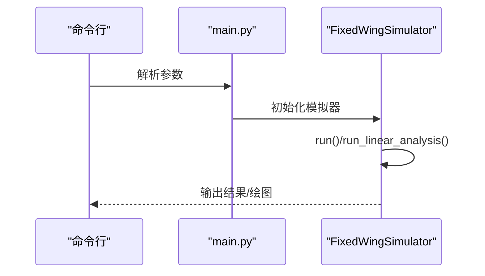

图表来源
- [main.py](file://main.py#L98-L141)
- [examples/example_1_linear_response.py](file://examples/example_1_linear_response.py#L95-L105)
- [examples/example_2_nonlinear_dynamics.py](file://examples/example_2_nonlinear_dynamics.py#L90-L103)

章节来源
- [main.py](file://main.py#L98-L141)
- [examples/example_1_linear_response.py](file://examples/example_1_linear_response.py#L95-L105)
- [examples/example_2_nonlinear_dynamics.py](file://examples/example_2_nonlinear_dynamics.py#L90-L103)