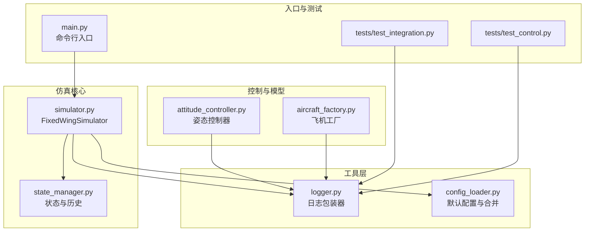
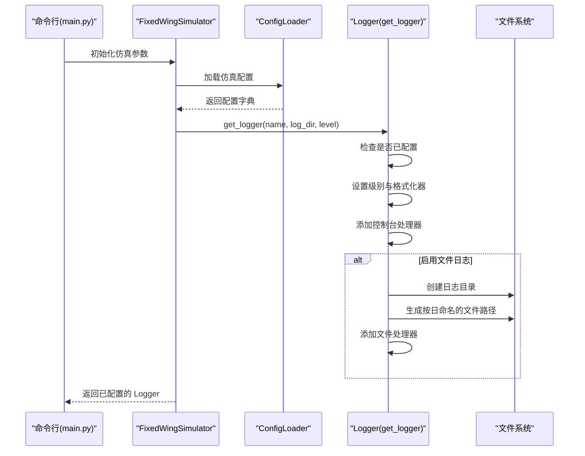
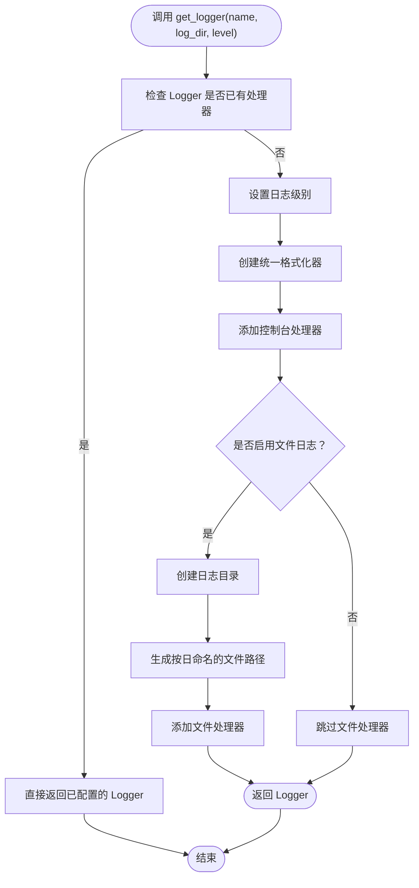
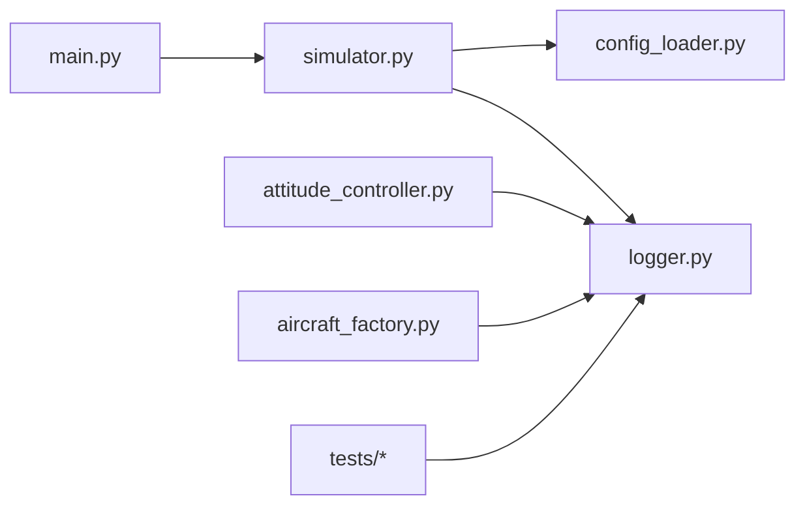

# 日志记录系统

<cite>
**本文档引用的文件**
- [src/utils/logger.py](file://src/utils/logger.py)
- [src/utils/config_loader.py](file://src/utils/config_loader.py)
- [src/simulation/simulator.py](file://src/simulation/simulator.py)
- [src/simulation/state_manager.py](file://src/simulation/state_manager.py)
- [src/control/attitude_controller.py](file://src/control/attitude_controller.py)
- [src/models/aircraft_factory.py](file://src/models/aircraft_factory.py)
- [main.py](file://main.py)
- [tests/test_integration.py](file://tests/test_integration.py)
- [tests/test_control.py](file://tests/test_control.py)
</cite>

## 目录
1. [简介](#简介)
2. [项目结构](#项目结构)
3. [核心组件](#核心组件)
4. [架构总览](#架构总览)
5. [详细组件分析](#详细组件分析)
6. [依赖关系分析](#依赖关系分析)
7. [性能考虑](#性能考虑)
8. [故障排除指南](#故障排除指南)
9. [结论](#结论)
10. [附录](#附录)

## 简介
本文件系统性地阐述固定翼无人机仿真平台的日志记录体系：从架构设计到实现原理，从日志级别与配置项到仿真过程中的作用与最佳实践。文档旨在帮助开发者与使用者正确、高效地使用日志系统，以支持调试、性能监控与错误追踪，并提供可操作的配置示例与排障建议。

## 项目结构
日志系统在本项目中采用“轻量封装 + 默认配置”的方式，核心位于工具模块，通过配置加载器与主流程协同工作，确保日志既能在控制台即时查看，也能落盘归档，便于后续分析。

图表来源
- [src/utils/logger.py](file://src/utils/logger.py#L1-L44)
- [src/utils/config_loader.py](file://src/utils/config_loader.py#L1-L82)
- [src/simulation/simulator.py](file://src/simulation/simulator.py#L1-L200)
- [src/simulation/state_manager.py](file://src/simulation/state_manager.py#L1-L193)
- [src/control/attitude_controller.py](file://src/control/attitude_controller.py#L1-L134)
- [src/models/aircraft_factory.py](file://src/models/aircraft_factory.py#L1-L136)
- [main.py](file://main.py#L1-L145)
- [tests/test_integration.py](file://tests/test_integration.py#L1-L391)
- [tests/test_control.py](file://tests/test_control.py#L1-L371)

章节来源
- [src/utils/logger.py](file://src/utils/logger.py#L1-L44)
- [src/utils/config_loader.py](file://src/utils/config_loader.py#L1-L82)
- [src/simulation/simulator.py](file://src/simulation/simulator.py#L1-L200)
- [main.py](file://main.py#L1-L145)

## 核心组件
- 日志包装器（logger.py）
  - 提供统一的 get_logger(name, log_dir, level) 接口，返回一个同时输出到控制台与可选文件的 Logger 实例。
  - 控制台处理器与文件处理器共享同一格式化器，确保一致性。
  - 文件名按日期生成，避免跨天覆盖问题。
- 配置加载器（config_loader.py）
  - 定义默认配置字典，包含仿真相关参数，其中包含日志开关与日志目录键。
  - 支持递归合并用户 YAML 覆盖项，保证灵活性与向后兼容。
- 仿真主引擎（simulator.py）
  - 在初始化阶段读取配置，决定是否启用日志及日志目录。
  - 将日志器注入到各子系统，确保全链路可观测。
- 状态与历史（state_manager.py）
  - 记录仿真历史时可结合日志进行关键节点提示或异常预警。
- 控制与模型模块
  - 各控制器与工厂类在关键路径上使用日志输出状态、警告或错误，便于定位问题。

章节来源
- [src/utils/logger.py](file://src/utils/logger.py#L10-L43)
- [src/utils/config_loader.py](file://src/utils/config_loader.py#L10-L37)
- [src/simulation/simulator.py](file://src/simulation/simulator.py#L148-L171)
- [src/simulation/state_manager.py](file://src/simulation/state_manager.py#L95-L193)

## 架构总览
日志系统采用“单实例 + 多处理器”模式：每个模块通过 get_logger 获取同名 Logger；若未配置则首次调用完成配置；随后所有模块共享同一格式化器与处理器集合。仿真主引擎负责根据配置决定是否启用文件日志，并为不同模块提供一致的日志接口。

图表来源
- [main.py](file://main.py#L98-L145)
- [src/simulation/simulator.py](file://src/simulation/simulator.py#L148-L171)
- [src/utils/config_loader.py](file://src/utils/config_loader.py#L75-L77)
- [src/utils/logger.py](file://src/utils/logger.py#L10-L43)

## 详细组件分析

### 日志包装器（logger.py）
- 设计要点
  - 单例式配置：若 Logger 已存在处理器，则直接返回，避免重复添加处理器。
  - 双通道输出：控制台用于实时观测；文件用于持久化归档。
  - 格式统一：时间戳、模块名、级别、消息，便于检索与聚合。
  - 自动目录与文件命名：按日生成文件，避免覆盖。
- 使用建议
  - 建议在每个模块顶部调用一次 get_logger(__name__)，并在需要时传入自定义日志目录与级别。
  - 对于批量运行或无人值守场景，建议开启文件日志并设置合理级别。

图表来源
- [src/utils/logger.py](file://src/utils/logger.py#L10-L43)

章节来源
- [src/utils/logger.py](file://src/utils/logger.py#L10-L43)

### 配置加载器（config_loader.py）
- 默认配置
  - 包含仿真默认参数，其中包含日志开关与日志目录键，确保日志功能可被全局启用/禁用与定制。
  - 支持分层合并：用户 YAML 与默认值递归合并，优先级明确。
- 与日志的关系
  - 仿真主引擎读取配置后，决定是否调用文件日志处理器，从而实现“配置即策略”。

章节来源
- [src/utils/config_loader.py](file://src/utils/config_loader.py#L10-L37)
- [src/utils/config_loader.py](file://src/utils/config_loader.py#L75-L77)

### 仿真主引擎（simulator.py）
- 初始化阶段
  - 读取配置并解析风场、轨迹类型、控制参数等；同时决定日志策略。
- 运行阶段
  - 在关键路径（如模式切换、收敛检查、异常分支）输出日志，辅助调试与审计。
- 结果输出
  - 通过结果对象汇总摘要信息，可在必要时配合日志进行对比与复盘。

章节来源
- [src/simulation/simulator.py](file://src/simulation/simulator.py#L148-L171)
- [src/simulation/simulator.py](file://src/simulation/simulator.py#L78-L90)

### 状态与历史（state_manager.py）
- 历史记录
  - 在记录状态时可插入关键节点日志，例如“步进完成”、“状态裁剪”等，便于回放与定位。
- 导出能力
  - 历史导出 CSV 时可结合日志记录导出路径与时间戳，形成完整的数据-日志关联。

章节来源
- [src/simulation/state_manager.py](file://src/simulation/state_manager.py#L124-L174)
- [src/simulation/state_manager.py](file://src/simulation/state_manager.py#L182-L193)

### 控制与模型模块
- 控制器
  - 在控制器更新、限幅、重置等关键点输出日志，有助于验证控制回路行为与参数有效性。
- 飞机工厂
  - 在参数合并、导出 ArduPilot 参数等流程中输出进度与结果，便于核对与追溯。

章节来源
- [src/control/attitude_controller.py](file://src/control/attitude_controller.py#L80-L134)
- [src/models/aircraft_factory.py](file://src/models/aircraft_factory.py#L76-L136)

## 依赖关系分析
- 松耦合设计
  - 日志包装器独立于业务逻辑，仅依赖标准库 logging 与 datetime。
  - 仿真主引擎通过配置加载器间接依赖日志，避免硬编码。
- 典型依赖链
  - main.py → simulator.FixedWingSimulator → utils.get_logger
  - simulator → config_loader.ConfigLoader → defaults → 日志开关
  - 各子模块（控制、模型、可视化）通过 get_logger 获取日志器

图表来源
- [main.py](file://main.py#L98-L145)
- [src/simulation/simulator.py](file://src/simulation/simulator.py#L148-L171)
- [src/utils/config_loader.py](file://src/utils/config_loader.py#L75-L77)
- [src/utils/logger.py](file://src/utils/logger.py#L10-L43)
- [src/control/attitude_controller.py](file://src/control/attitude_controller.py#L1-L134)
- [src/models/aircraft_factory.py](file://src/models/aircraft_factory.py#L1-L136)
- [tests/test_integration.py](file://tests/test_integration.py#L1-L391)
- [tests/test_control.py](file://tests/test_control.py#L1-L371)

章节来源
- [main.py](file://main.py#L98-L145)
- [src/simulation/simulator.py](file://src/simulation/simulator.py#L148-L171)
- [src/utils/config_loader.py](file://src/utils/config_loader.py#L75-L77)
- [src/utils/logger.py](file://src/utils/logger.py#L10-L43)

## 性能考虑
- I/O 成本
  - 文件写入会引入磁盘 I/O 开销；在高频仿真中应权衡日志级别与频率。
- 级别过滤
  - 使用较低级别（如 WARNING 或 ERROR）减少高频 INFO 输出，降低 I/O 压力。
- 异步写入
  - Python logging 默认同步写入；在极端高吞吐场景可考虑第三方异步处理器（需额外依赖）。
- 批量写入
  - 合理设置刷新策略，避免每条日志都强制 fsync。
- 建议
  - 开发调试：INFO 级别 + 控制台输出
  - 生产运行：WARNING+ 级别 + 文件输出
  - 批处理：ERROR+ 级别 + 文件输出

## 故障排除指南
- 日志未落盘
  - 检查配置中的日志开关与日志目录键是否存在且未被覆盖为禁用。
  - 确认日志目录权限与磁盘空间充足。
- 日志重复或缺失
  - 避免在多个模块重复配置同一 Logger；确保 get_logger 仅在模块初始化时调用一次。
  - 检查是否在子模块中又手动添加了处理器。
- 日志级别不生效
  - 确保在获取 Logger 时传入正确的级别参数，或在配置中调整默认级别。
- 关键事件未记录
  - 在关键路径（如模式切换、收敛失败、数值异常）增加日志输出，便于事后复盘。
- 测试环境日志
  - 在测试用例中可通过日志确认仿真路径与断言条件，避免静默失败。

章节来源
- [src/utils/config_loader.py](file://src/utils/config_loader.py#L10-L37)
- [src/utils/logger.py](file://src/utils/logger.py#L20-L22)
- [tests/test_integration.py](file://tests/test_integration.py#L41-L58)
- [tests/test_integration.py](file://tests/test_integration.py#L114-L134)

## 结论
本项目的日志系统以“轻量封装 + 默认配置”为核心，实现了控制台与文件双通道输出的一致性与可扩展性。通过在主引擎与各子模块中统一使用日志器，结合合理的配置与级别策略，能够有效支撑仿真过程中的调试、监控与审计需求。建议在开发、测试与生产环境中分别采用不同的日志级别与输出策略，以平衡可观测性与性能。

## 附录

### 日志级别与使用场景
- DEBUG：开发调试细节（变量、中间结果），仅在本地开发启用
- INFO：常规运行信息（启动、完成、摘要），适合交互式运行
- WARNING：潜在问题（越界、收敛缓慢），生产运行常用级别
- ERROR：错误事件（异常、失败），必须记录
- CRITICAL：严重错误（系统性失败），需立即处理

### 日志配置选项与含义
- 日志开关（布尔）：控制是否启用文件日志
- 日志目录（字符串）：文件日志保存路径
- 日志级别（整数枚举）：控制输出粒度
- 输出格式（字符串模板）：统一时间、模块、级别与消息格式

章节来源
- [src/utils/config_loader.py](file://src/utils/config_loader.py#L10-L37)
- [src/utils/logger.py](file://src/utils/logger.py#L25-L28)

### 日志文件组织与命名规范
- 组织结构
  - 日志目录按项目根目录下的相对路径创建（默认 logs）
  - 每日生成一个日志文件，文件名包含日期，避免跨日覆盖
- 命名规范
  - 文件名前缀：固定前缀
  - 日期：YYYYMMDD
  - 扩展名：.log
- 示例
  - 日志目录：logs
  - 日期：20250405
  - 文件：logs/sim_20250405.log

章节来源
- [src/utils/logger.py](file://src/utils/logger.py#L36-L41)

### 在不同模块中正确使用日志系统
- 命令行入口（main.py）
  - 在打印运行参数与模式选择后，可输出一条 INFO 级别的启动摘要
- 仿真主引擎（simulator.py）
  - 在初始化、模式切换、线性分析、开环/闭环运行等关键节点输出日志
- 控制模块（如 attitude_controller.py）
  - 在更新、限幅、重置、热更新参数等路径输出日志
- 模型模块（如 aircraft_factory.py）
  - 在参数合并、导出 ArduPilot 参数等流程输出进度与结果
- 测试模块（tests/*）
  - 在断言失败或异常路径输出日志，便于定位问题

章节来源
- [main.py](file://main.py#L107-L112)
- [src/simulation/simulator.py](file://src/simulation/simulator.py#L124-L140)
- [src/control/attitude_controller.py](file://src/control/attitude_controller.py#L80-L134)
- [src/models/aircraft_factory.py](file://src/models/aircraft_factory.py#L95-L136)
- [tests/test_integration.py](file://tests/test_integration.py#L41-L58)

### 日志配置示例与最佳实践
- 配置示例（来自配置加载器默认值）
  - 日志开关：启用
  - 日志目录：logs
  - 建议：在用户 YAML 中覆盖上述键以适配不同运行环境
- 最佳实践
  - 每个模块仅初始化一次日志器，避免重复处理器
  - 在高频循环中降低日志频率或提升级别
  - 将关键事件（开始/结束、异常、阈值触发）显式记录
  - 批处理与无人值守场景务必启用文件日志

章节来源
- [src/utils/config_loader.py](file://src/utils/config_loader.py#L10-L37)
- [src/utils/logger.py](file://src/utils/logger.py#L20-L22)