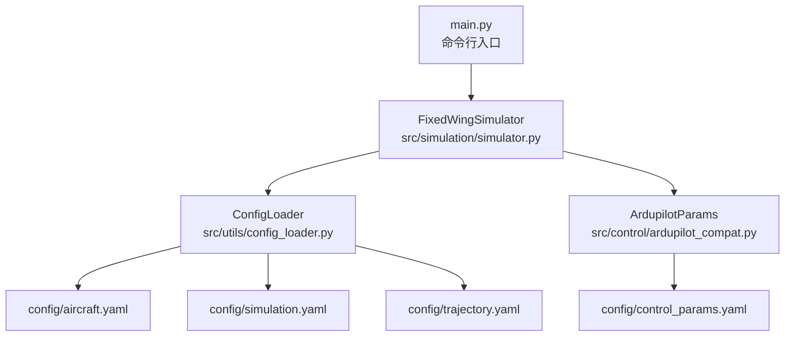
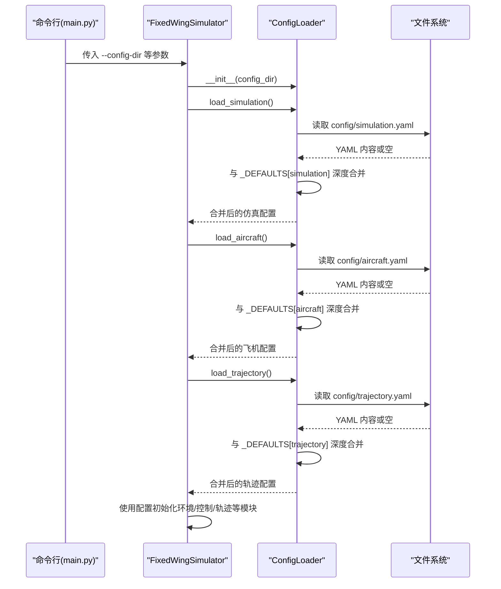
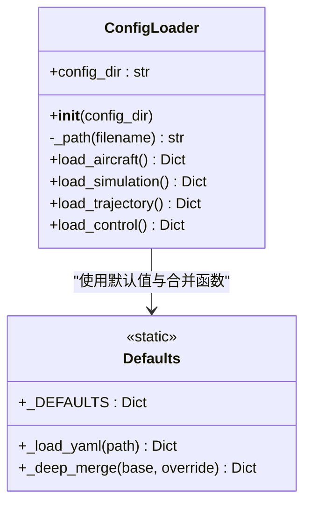
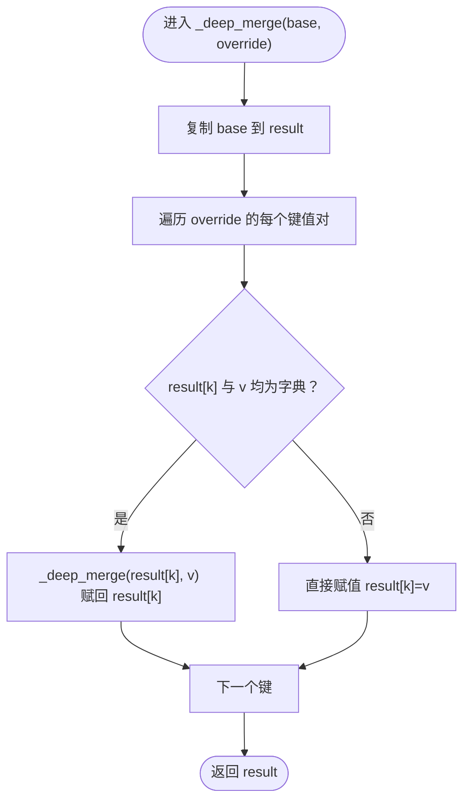
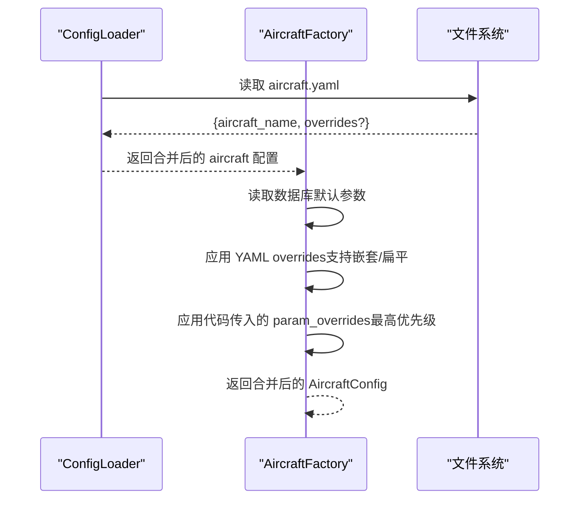
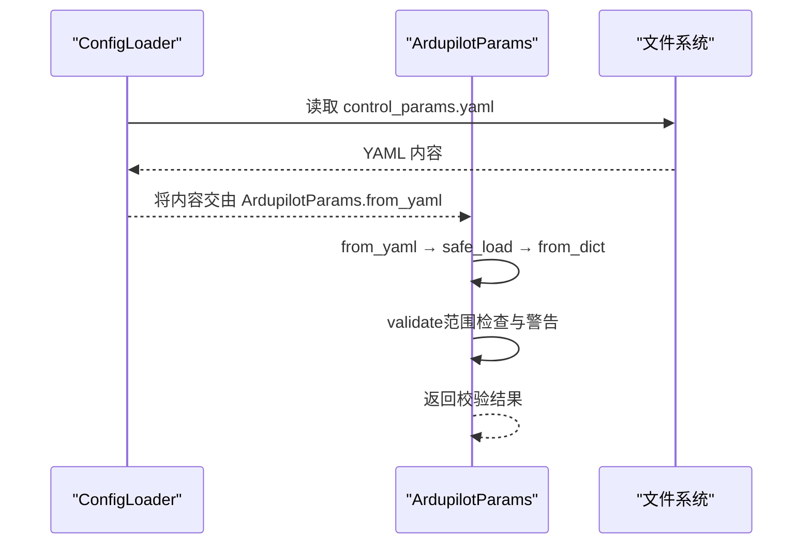
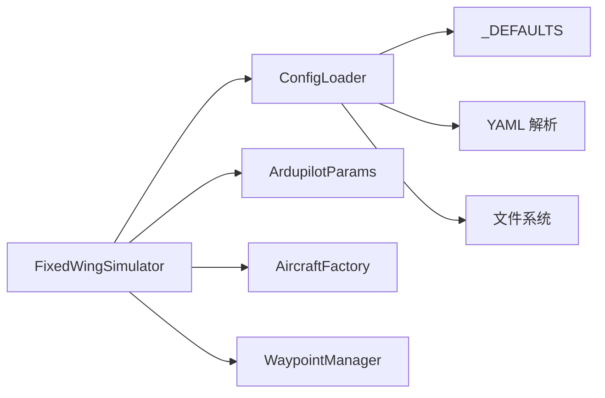

# 配置加载器

<cite>
**本文引用的文件**
- [src/utils/config_loader.py](file://src/utils/config_loader.py)
- [config/aircraft.yaml](file://config/aircraft.yaml)
- [config/simulation.yaml](file://config/simulation.yaml)
- [config/trajectory.yaml](file://config/trajectory.yaml)
- [config/control_params.yaml](file://config/control_params.yaml)
- [src/simulation/simulator.py](file://src/simulation/simulator.py)
- [src/models/aircraft_factory.py](file://src/models/aircraft_factory.py)
- [src/control/ardupilot_compat.py](file://src/control/ardupilot_compat.py)
- [examples/example_6_ardupilot_parameters.py](file://examples/example_6_ardupilot_parameters.py)
- [tests/test_integration.py](file://tests/test_integration.py)
- [main.py](file://main.py)
</cite>

## 目录
1. [简介](#简介)
2. [项目结构](#项目结构)
3. [核心组件](#核心组件)
4. [架构总览](#架构总览)
5. [详细组件分析](#详细组件分析)
6. [依赖关系分析](#依赖关系分析)
7. [性能考量](#性能考量)
8. [故障排查指南](#故障排查指南)
9. [结论](#结论)
10. [附录：配置文件格式与字段定义](#附录配置文件格式与字段定义)

## 简介
本文件面向“配置加载器”模块，系统化阐述 ConfigLoader 类的设计与实现，重点说明：
- 如何从 YAML 文件加载配置并进行深度合并；
- 默认配置系统的工作原理，包括 _aircraft、_simulation、_trajectory 等默认参数的结构与用途；
- 配置文件的加载顺序与优先级规则，以及参数覆盖机制；
- 配置文件格式说明与字段定义（必需/可选）；
- 配置验证与错误处理策略；
- 在仿真系统中的正确使用方式，并提供示例与最佳实践。

## 项目结构
配置加载器位于 src/utils/config_loader.py，配套的 YAML 配置文件位于 config/ 目录。主程序入口 main.py 通过命令行参数驱动仿真，内部会实例化 FixedWingSimulator 并由其使用 ConfigLoader 加载配置。

图表来源
- [main.py](file://main.py#L98-L145)
- [src/simulation/simulator.py](file://src/simulation/simulator.py#L130-L230)
- [src/utils/config_loader.py](file://src/utils/config_loader.py#L59-L81)
- [config/aircraft.yaml](file://config/aircraft.yaml#L1-L13)
- [config/simulation.yaml](file://config/simulation.yaml#L1-L30)
- [config/trajectory.yaml](file://config/trajectory.yaml#L1-L23)
- [config/control_params.yaml](file://config/control_params.yaml#L1-L45)
- [src/control/ardupilot_compat.py](file://src/control/ardupilot_compat.py#L17-L129)

章节来源
- [src/utils/config_loader.py](file://src/utils/config_loader.py#L1-L82)
- [config/aircraft.yaml](file://config/aircraft.yaml#L1-L13)
- [config/simulation.yaml](file://config/simulation.yaml#L1-L30)
- [config/trajectory.yaml](file://config/trajectory.yaml#L1-L23)
- [config/control_params.yaml](file://config/control_params.yaml#L1-L45)
- [src/simulation/simulator.py](file://src/simulation/simulator.py#L130-L230)
- [main.py](file://main.py#L98-L145)

## 核心组件
- ConfigLoader：负责按子系统加载并合并 YAML 配置，提供 load_aircraft、load_simulation、load_trajectory、load_control 四个接口。
- 默认配置字典 _DEFAULTS：集中定义各子系统的默认值，用于与用户 YAML 合并。
- 深度合并函数 _deep_merge：递归地将用户覆盖项合并到默认值上，保证嵌套字典逐层生效。
- 加载辅助函数 _load_yaml：安全读取 YAML 文件，不存在时返回空字典，避免异常中断。

章节来源
- [src/utils/config_loader.py](file://src/utils/config_loader.py#L10-L81)

## 架构总览
ConfigLoader 的职责是“按子系统加载 YAML 并与默认值深度合并”。在 FixedWingSimulator 初始化阶段，会根据传入的 config_dir 实例化 ConfigLoader，并分别加载 simulation、aircraft、trajectory 等配置；同时控制参数 control_params.yaml 由 ArdupilotParams.from_yaml 独立加载与校验。

图表来源
- [main.py](file://main.py#L98-L145)
- [src/simulation/simulator.py](file://src/simulation/simulator.py#L130-L230)
- [src/utils/config_loader.py](file://src/utils/config_loader.py#L59-L81)

## 详细组件分析

### ConfigLoader 类设计与实现
- 设计要点
  - 单一职责：按子系统加载并合并配置。
  - 可扩展性：新增子系统只需在 _DEFAULTS 中添加默认值，并在 ConfigLoader 中增加对应方法。
  - 安全性：_load_yaml 对不存在文件返回空字典，避免异常传播。
  - 一致性：_deep_merge 保证嵌套字典逐层合并，避免浅拷贝导致的覆盖问题。
- 关键方法
  - load_aircraft：读取 aircraft.yaml 并与默认 aircraft 合并。
  - load_simulation：读取 simulation.yaml 并与默认 simulation 合并。
  - load_trajectory：读取 trajectory.yaml 并与默认 trajectory 合并。
  - load_control：直接读取 control_params.yaml（不参与默认值合并，由 ArdupilotParams.from_yaml 处理）。

图表来源
- [src/utils/config_loader.py](file://src/utils/config_loader.py#L59-L81)

章节来源
- [src/utils/config_loader.py](file://src/utils/config_loader.py#L59-L81)

### 默认配置系统（_DEFAULTS）
_DEFAULTS 定义了三类子系统的默认参数：
- aircraft：包含飞机名称与可选参数覆盖字典。
- simulation：包含仿真步长、时长、数值积分器、初始状态、风场类型与参数、日志开关与目录等。
- trajectory：包含轨迹类型、平均速度、偏航模式、航路点列表与循环标志。

这些默认值与用户 YAML 文件逐层合并，确保即使用户仅提供部分字段，也能得到完整的配置对象。

章节来源
- [src/utils/config_loader.py](file://src/utils/config_loader.py#L10-L37)

### 深度合并算法（_deep_merge）
- 行为特征
  - 递归合并嵌套字典；
  - 非字典键直接覆盖；
  - 不改变原基础字典，返回新字典副本。
- 典型场景
  - 用户在 simulation.yaml 中仅覆盖 wind_type，则其他字段保持默认；
  - 用户在 aircraft.yaml 中提供 overrides 字典，将与数据库参数合并后传递给飞机工厂。

图表来源
- [src/utils/config_loader.py](file://src/utils/config_loader.py#L48-L56)

章节来源
- [src/utils/config_loader.py](file://src/utils/config_loader.py#L48-L56)

### 飞机配置加载与覆盖机制
- ConfigLoader.load_aircraft 返回值包含：
  - aircraft_name：来自用户 YAML 或默认值；
  - overrides：来自用户 YAML 的覆盖字典（若未提供则为空字典）。
- 飞机工厂（AircraftFactory）在创建时会：
  - 读取数据库默认参数；
  - 应用 YAML overrides（支持嵌套或扁平写法）；
  - 应用代码传入的 param_overrides（最高优先级）。

图表来源
- [src/utils/config_loader.py](file://src/utils/config_loader.py#L68-L70)
- [src/models/aircraft_factory.py](file://src/models/aircraft_factory.py#L51-L88)

章节来源
- [src/utils/config_loader.py](file://src/utils/config_loader.py#L68-L70)
- [src/models/aircraft_factory.py](file://src/models/aircraft_factory.py#L51-L88)

### 控制参数加载与验证
- ConfigLoader.load_control 直接返回 control_params.yaml 的内容（不与默认值合并）。
- ArdupilotParams.from_yaml 将 YAML 键值映射到数据类字段，from_dict 支持忽略未知键。
- ArdupilotParams.validate 执行范围检查并输出警告，确保参数在合理范围内。

图表来源
- [src/utils/config_loader.py](file://src/utils/config_loader.py#L72-L73)
- [src/control/ardupilot_compat.py](file://src/control/ardupilot_compat.py#L74-L129)

章节来源
- [src/utils/config_loader.py](file://src/utils/config_loader.py#L72-L73)
- [src/control/ardupilot_compat.py](file://src/control/ardupilot_compat.py#L74-L129)

### 仿真配置加载与优先级
- ConfigLoader.load_simulation 与 _DEFAULTS[simulation] 深度合并；
- FixedWingSimulator 初始化时会：
  - 读取 wind_type、wind_speed、wind_direction_deg 等字段；
  - 若未显式传入 wind_type，将使用 simulation 配置中的默认值；
  - 其他如 dt、duration、initial_mode 等同样遵循“用户 YAML > 默认值”的优先级。

章节来源
- [src/simulation/simulator.py](file://src/simulation/simulator.py#L153-L163)
- [src/utils/config_loader.py](file://src/utils/config_loader.py#L75-L77)

### 轨迹配置加载与使用
- ConfigLoader.load_trajectory 与 _DEFAULTS[trajectory] 深度合并；
- FixedWingSimulator 注释明确指出：trajectory.yaml 不会自动加载，需通过 WaypointManager 显式调用加载或手动添加航路点，以避免默认航路点污染用户任务。

章节来源
- [src/simulation/simulator.py](file://src/simulation/simulator.py#L218-L229)
- [src/utils/config_loader.py](file://src/utils/config_loader.py#L79-L81)

## 依赖关系分析
- ConfigLoader 依赖：
  - 文件系统：读取 config/*.yaml；
  - YAML 解析库：safe_load；
  - 默认配置字典 _DEFAULTS；
  - 深度合并函数 _deep_merge。
- FixedWingSimulator 依赖：
  - ConfigLoader：加载仿真/飞机/轨迹配置；
  - ArdupilotParams：加载与校验控制参数；
  - AircraftFactory：应用飞机参数覆盖；
  - WaypointManager：管理航路点与轨迹。

图表来源
- [src/utils/config_loader.py](file://src/utils/config_loader.py#L59-L81)
- [src/simulation/simulator.py](file://src/simulation/simulator.py#L130-L230)
- [src/models/aircraft_factory.py](file://src/models/aircraft_factory.py#L51-L88)
- [src/control/ardupilot_compat.py](file://src/control/ardupilot_compat.py#L74-L129)

章节来源
- [src/utils/config_loader.py](file://src/utils/config_loader.py#L59-L81)
- [src/simulation/simulator.py](file://src/simulation/simulator.py#L130-L230)
- [src/models/aircraft_factory.py](file://src/models/aircraft_factory.py#L51-L88)
- [src/control/ardupilot_compat.py](file://src/control/ardupilot_compat.py#L74-L129)

## 性能考量
- YAML 解析与深度合并均为轻量操作，通常对启动时间影响可忽略。
- 建议：
  - 将常用配置文件放置在本地磁盘，避免网络挂载导致的 IO 延迟；
  - 控制参数文件建议保持扁平结构，便于 from_dict 快速映射；
  - 避免在每次运行中频繁重载配置，可在进程内缓存已解析的配置对象。

## 故障排查指南
- 配置文件不存在
  - 现象：ConfigLoader 返回空字典，最终使用默认值。
  - 排查：确认 config_dir 是否正确，文件是否存在且可读。
- YAML 语法错误
  - 现象：safe_load 抛出异常或返回 None。
  - 排查：使用在线 YAML 校验工具检查语法；确保缩进与冒号后有空格。
- 参数越界
  - 现象：ArdupilotParams.validate 输出警告。
  - 排查：对照参数范围调整；必要时参考示例文件。
- 覆盖优先级误解
  - 现象：期望某字段被覆盖但未生效。
  - 排查：确认是否在正确的 YAML 文件中；注意 aircraft.yaml 的 overrides 结构；注意 ArdupilotParams 的独立加载路径。

章节来源
- [src/utils/config_loader.py](file://src/utils/config_loader.py#L40-L45)
- [src/control/ardupilot_compat.py](file://src/control/ardupilot_compat.py#L104-L129)
- [src/models/aircraft_factory.py](file://src/models/aircraft_factory.py#L64-L74)

## 结论
ConfigLoader 提供了清晰、可扩展的配置加载与合并机制，结合默认值与用户 YAML 的深度合并策略，确保系统在不同场景下都能获得一致、可靠的配置。配合 ArdupilotParams 的参数校验与 AircraftFactory 的参数覆盖链路，形成了从“默认值 → YAML → 代码覆盖”的完整优先级体系。在仿真系统中，应遵循“显式加载轨迹配置、独立校验控制参数、按需覆盖飞机参数”的原则，以获得最佳的可维护性与可移植性。

## 附录：配置文件格式与字段定义

### aircraft.yaml
- 作用：选择飞机型号并可选地覆盖数据库默认参数。
- 字段
  - aircraft_name: 字符串，必填（默认值见 _DEFAULTS[aircraft]）。
  - overrides: 字典，可选（支持嵌套或扁平写法；键需存在于数据库参数中）。
- 示例与最佳实践
  - 仅指定需要覆盖的参数，避免冗余；
  - 使用注释说明覆盖目的，便于团队协作。

章节来源
- [config/aircraft.yaml](file://config/aircraft.yaml#L1-L13)
- [src/utils/config_loader.py](file://src/utils/config_loader.py#L68-L70)
- [src/models/aircraft_factory.py](file://src/models/aircraft_factory.py#L76-L88)

### simulation.yaml
- 作用：仿真引擎配置，包括时间步长、时长、积分器、初始条件、风场与日志。
- 字段
  - dt: 浮点数（秒），必填（默认值见 _DEFAULTS[simulation]）。
  - duration: 浮点数（秒），必填（默认值见 _DEFAULTS[simulation]）。
  - integrator: 字符串，可选（默认值见 _DEFAULTS[simulation]）。
  - rtol/atol: 浮点数，可选（默认值见 _DEFAULTS[simulation]）。
  - initial_position: 数组，可选（默认值见 _DEFAULTS[simulation]）。
  - initial_heading_deg: 浮点数，可选（默认值见 _DEFAULTS[simulation]）。
  - initial_mode: 字符串，可选（默认值见 _DEFAULTS[simulation]）。
  - wind_type: 字符串，可选（默认值见 _DEFAULTS[simulation]）。
  - wind_speed: 浮点数，可选（默认值见 _DEFAULTS[simulation]）。
  - wind_direction_deg: 浮点数，可选（默认值见 _DEFAULTS[simulation]）。
  - log_enabled: 布尔，可选（默认值见 _DEFAULTS[simulation]）。
  - log_dir: 字符串，可选（默认值见 _DEFAULTS[simulation]）。
- 示例与最佳实践
  - 仅覆盖需要修改的字段；
  - wind_type 与 wind_speed/方向共同决定风场模型。

章节来源
- [config/simulation.yaml](file://config/simulation.yaml#L1-L30)
- [src/utils/config_loader.py](file://src/utils/config_loader.py#L75-L77)
- [src/simulation/simulator.py](file://src/simulation/simulator.py#L153-L163)

### trajectory.yaml
- 作用：轨迹规划配置，定义轨迹类型、平均速度、偏航模式、航路点与循环标志。
- 字段
  - type: 字符串，可选（默认值见 _DEFAULTS[trajectory]）。
  - average_speed: 浮点数，可选（默认值见 _DEFAULTS[trajectory]）。
  - yaw_mode: 字符串，可选（默认值见 _DEFAULTS[trajectory]）。
  - waypoints: 数组，可选（默认值见 _DEFAULTS[trajectory]）。
  - loop: 布尔，可选（默认值见 _DEFAULTS[trajectory]）。
- 使用说明
  - ConfigLoader 会与默认值合并；但 FixedWingSimulator 注释明确：trajectory.yaml 不会自动加载，需显式调用 WaypointManager 加载或手动添加航路点。

章节来源
- [config/trajectory.yaml](file://config/trajectory.yaml#L1-L23)
- [src/utils/config_loader.py](file://src/utils/config_loader.py#L79-L81)
- [src/simulation/simulator.py](file://src/simulation/simulator.py#L218-L229)

### control_params.yaml
- 作用：ArduPilot 风格的控制参数（扁平键值），由 ArdupilotParams.from_yaml 加载。
- 字段
  - 包含大量 PID 与限幅参数，详见示例文件与 ArdupilotParams 数据类字段。
- 验证
  - ArdupilotParams.validate 会对关键参数执行范围检查并输出警告。

章节来源
- [config/control_params.yaml](file://config/control_params.yaml#L1-L45)
- [src/utils/config_loader.py](file://src/utils/config_loader.py#L72-L73)
- [src/control/ardupilot_compat.py](file://src/control/ardupilot_compat.py#L74-L129)

### 在仿真系统中的正确使用
- 命令行入口 main.py
  - 通过 --config-dir 指定配置目录；
  - 将 dt、duration、initial_mode、wind_type、traj_type 等参数传入 FixedWingSimulator。
- FixedWingSimulator 初始化
  - 使用 ConfigLoader.load_simulation 获取仿真配置；
  - 使用 ConfigLoader.load_aircraft 获取飞机配置；
  - 使用 ConfigLoader.load_trajectory 获取轨迹配置（需显式加载）；
  - 使用 ArdupilotParams.from_yaml 加载控制参数并 validate。
- 示例参考
  - examples/example_6_ardupilot_parameters.py 展示了从 YAML 加载、验证与导出的完整流程；
  - tests/test_integration.py 展示了通过 CONFIG_DIR 使用默认配置的集成测试。

章节来源
- [main.py](file://main.py#L98-L145)
- [src/simulation/simulator.py](file://src/simulation/simulator.py#L130-L230)
- [examples/example_6_ardupilot_parameters.py](file://examples/example_6_ardupilot_parameters.py#L1-L42)
- [tests/test_integration.py](file://tests/test_integration.py#L63-L95)