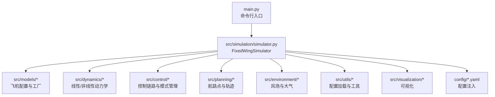
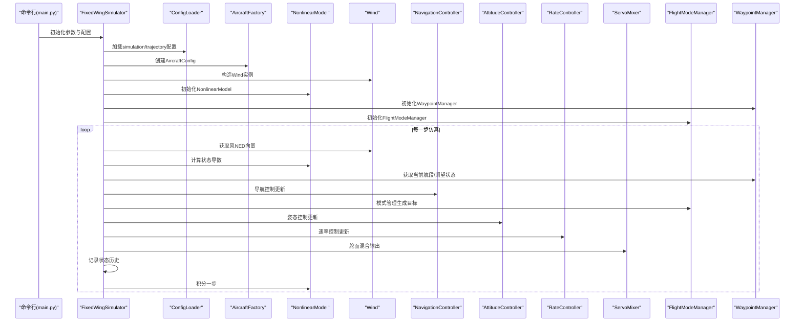
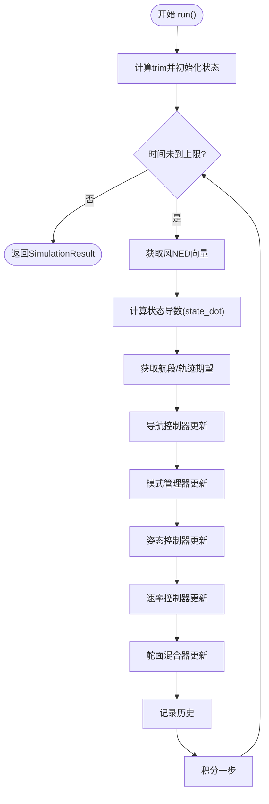
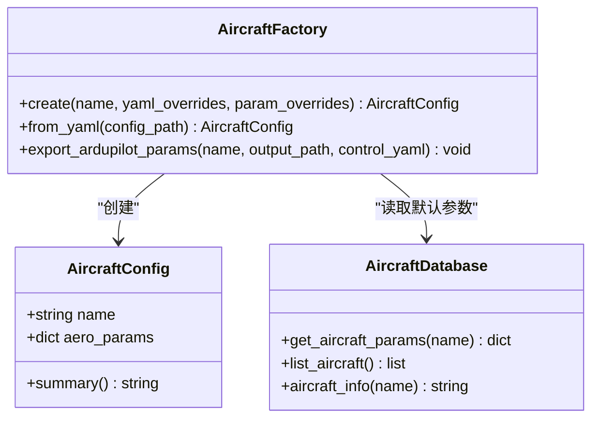
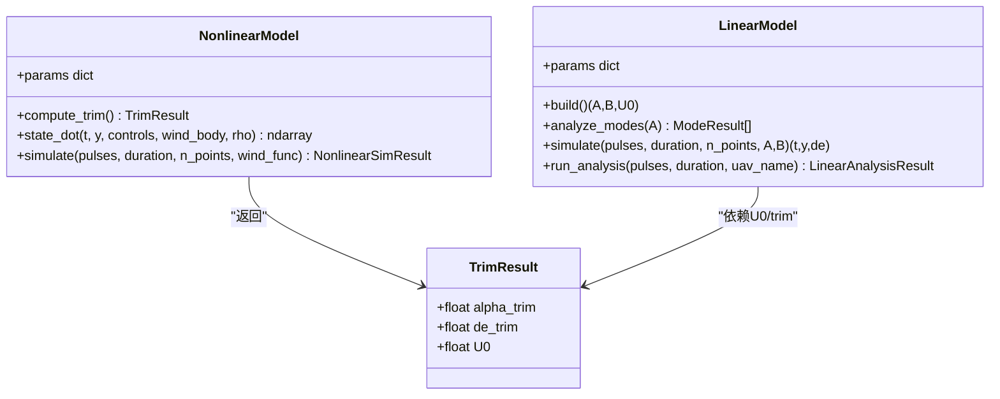
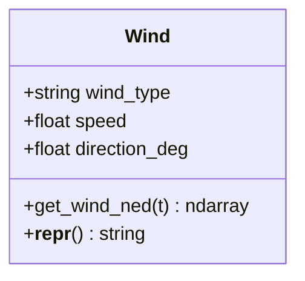
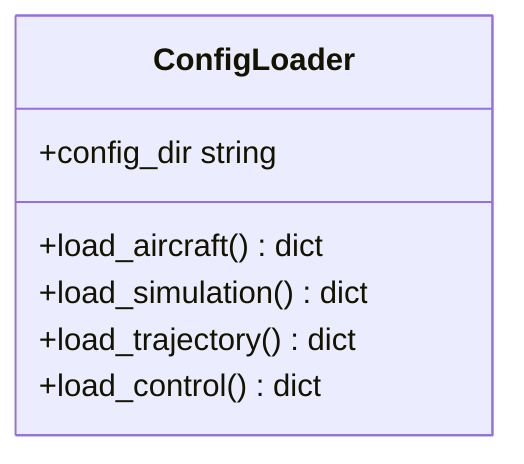
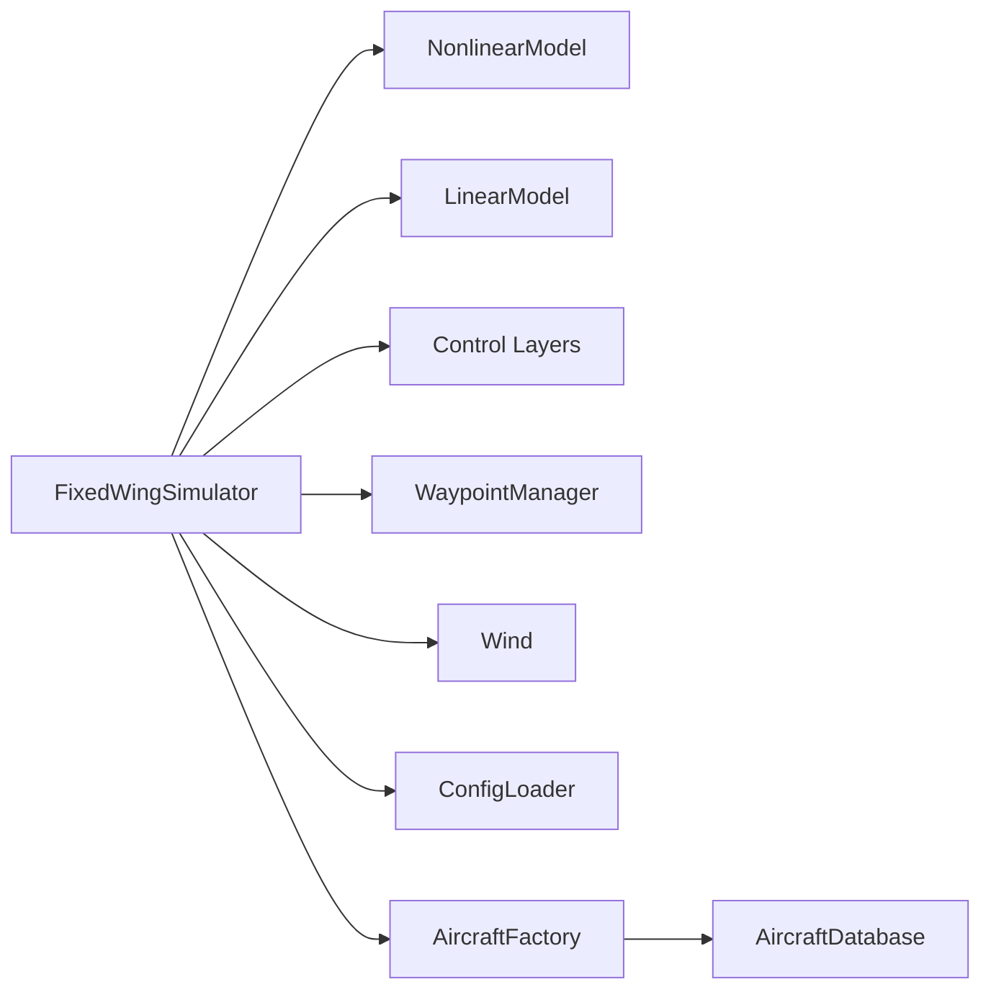

# 代码架构与设计原则

<cite>
**本文引用的文件**
- [main.py](file://main.py)
- [setup.py](file://setup.py)
- [requirements.txt](file://requirements.txt)
- [src/simulation/simulator.py](file://src/simulation/simulator.py)
- [src/models/aircraft_factory.py](file://src/models/aircraft_factory.py)
- [src/models/aircraft_database.py](file://src/models/aircraft_database.py)
- [src/dynamics/linear_model.py](file://src/dynamics/linear_model.py)
- [src/dynamics/nonlinear_model.py](file://src/dynamics/nonlinear_model.py)
- [src/planning/waypoint_manager.py](file://src/planning/waypoint_manager.py)
- [src/environment/wind_model.py](file://src/environment/wind_model.py)
- [src/utils/config_loader.py](file://src/utils/config_loader.py)
- [config/aircraft.yaml](file://config/aircraft.yaml)
</cite>

## 目录
1. [引言](#引言)
2. [项目结构](#项目结构)
3. [核心组件](#核心组件)
4. [架构总览](#架构总览)
5. [详细组件分析](#详细组件分析)
6. [依赖分析](#依赖分析)
7. [性能考量](#性能考量)
8. [故障排查指南](#故障排查指南)
9. [结论](#结论)
10. [附录：扩展点与插件化设计](#附录扩展点与插件化设计)

## 引言
本文件面向FixedWingSimulator项目的架构文档与设计原则说明，目标是帮助开发者理解系统的模块化分层架构、工厂与策略模式的应用、核心组件交互关系（仿真器、飞机模型、动力学系统、控制系统等），以及代码组织原则（命名规范、文件结构、依赖管理）。同时给出架构决策的技术背景与权衡，并提供扩展点识别与插件化设计思路，指导如何在现有架构上添加新功能模块。

## 项目结构
项目采用按领域/功能分层的包结构，遵循“高内聚、低耦合”的组织原则：
- 核心入口位于根目录的命令行脚本，负责参数解析与运行调度
- 按功能域划分为models、dynamics、control、planning、environment、simulation、utils、visualization等子包
- 配置文件集中于config目录，便于外部注入与覆盖
- 示例与输出分别位于examples与output目录，便于演示与结果归档



图表来源
- [main.py](file://main.py#L1-L145)
- [src/simulation/simulator.py](file://src/simulation/simulator.py#L1-L642)

章节来源
- [main.py](file://main.py#L1-L145)
- [setup.py](file://setup.py#L1-L23)
- [requirements.txt](file://requirements.txt#L1-L8)

## 核心组件
本节聚焦仿真主引擎与关键子系统，解释其职责、接口与协作方式。

- 固定翼仿真器（FixedWingSimulator）
  - 职责：编排所有子系统，提供run/run_linear_analysis/init_step/step等公共接口；维护状态历史与结果封装
  - 关键依赖：飞机配置（AircraftFactory/AircraftConfig）、动力学（NonlinearModel/LinearModel）、环境（Wind）、控制（FlightModeManager/NavigationController/AttitudeController/RateController/ServoMixer）、规划（WaypointManager）、仿真器（Dopri5Integrator/StateHistory）、配置（ConfigLoader）

- 飞机配置与工厂（AircraftFactory/AircraftConfig）
  - 职责：从数据库合并参数、支持YAML与字典覆盖、导出ArduPilot参数
  - 设计要点：工厂方法create/from_yaml提供灵活的参数装配；AircraftConfig作为统一输入载体

- 动力学模型（LinearModel/NonlinearModel）
  - 职责：线性4-DOF纵向建模与非线性6-DOF全状态方程；提供trim求解与ODE评估
  - 设计要点：数据类Controls/TrimResult封装控制与稳态；NonlinearModel暴露make_ode_func以适配实时积分器

- 规划与航路点（WaypointManager）
  - 职责：管理NED航路点、构建轨迹对象（最小Snap/最小Jerk）、提供当前段信息
  - 设计要点：缓存机制避免重复构建；支持循环任务与YAML导入导出

- 环境建模（Wind）
  - 职责：提供NED风场矢量（NONE/FIXED/SINE/RANDOMSINE）
  - 设计要点：类型安全校验与随机种子可控

- 配置加载（ConfigLoader）
  - 职责：加载并深合并各子系统配置，提供默认值与路径拼接
  - 设计要点：分层配置（aircraft/simulation/trajectory/control）可叠加

章节来源
- [src/simulation/simulator.py](file://src/simulation/simulator.py#L115-L642)
- [src/models/aircraft_factory.py](file://src/models/aircraft_factory.py#L15-L136)
- [src/dynamics/linear_model.py](file://src/dynamics/linear_model.py#L107-L319)
- [src/dynamics/nonlinear_model.py](file://src/dynamics/nonlinear_model.py#L104-L386)
- [src/planning/waypoint_manager.py](file://src/planning/waypoint_manager.py#L20-L208)
- [src/environment/wind_model.py](file://src/environment/wind_model.py#L18-L113)
- [src/utils/config_loader.py](file://src/utils/config_loader.py#L59-L82)

## 架构总览
下图展示仿真主引擎与各子系统的交互关系，体现“控制链路”（导航→姿态→速率→舵面）与“反馈闭环”的典型飞行控制结构。



图表来源
- [src/simulation/simulator.py](file://src/simulation/simulator.py#L239-L567)
- [src/environment/wind_model.py](file://src/environment/wind_model.py#L76-L108)
- [src/dynamics/nonlinear_model.py](file://src/dynamics/nonlinear_model.py#L160-L255)
- [src/planning/waypoint_manager.py](file://src/planning/waypoint_manager.py#L178-L207)
- [src/control/flight_mode_manager.py](file://src/control/flight_mode_manager.py#L173-L211)

## 详细组件分析

### 仿真器（FixedWingSimulator）分析
- 设计模式
  - 工厂模式：通过AircraftFactory创建AircraftConfig，实现参数装配与覆盖
  - 策略模式：根据飞行模式（FlightMode）切换不同控制策略；轨迹策略由WaypointManager与Trajectory实现
- 数据流
  - 输入：配置目录、飞机名称、风场类型、轨迹类型、仿真时长与步长
  - 处理：计算trim、初始化控制层、构建ODE函数、逐时间步推进
  - 输出：SimulationResult（包含历史、修剪结果、摘要与可视化）
- 关键流程（闭环仿真）
  - 计算trim并预设初始状态
  - 依据WaypointManager提供的航段或轨迹，计算导航目标
  - FlightModeManager根据当前模式生成ControlTarget
  - 控制链路（导航→姿态→速率→舵面）产生舵面输出
  - 将舵面输出转换为气动控制增量，驱动NonlinearModel进行ODE积分
  - 记录状态历史，直至结束



图表来源
- [src/simulation/simulator.py](file://src/simulation/simulator.py#L270-L567)

章节来源
- [src/simulation/simulator.py](file://src/simulation/simulator.py#L115-L642)

### 飞机配置与工厂（AircraftFactory/AircraftConfig）
- 设计要点
  - AircraftConfig作为统一参数载体，承载名称与合并后的气动/物理参数
  - 工厂方法支持数据库默认值、YAML覆盖与字典最高优先级覆盖
  - 提供导出ArduPilot参数能力，便于与地面站/飞控兼容
- 扩展建议
  - 新增飞机：在aircraft_database中新增条目，保持字段一致
  - 参数覆盖：通过aircraft.yaml或外部YAML进行增量覆盖



图表来源
- [src/models/aircraft_factory.py](file://src/models/aircraft_factory.py#L15-L136)
- [src/models/aircraft_database.py](file://src/models/aircraft_database.py#L143-L183)

章节来源
- [src/models/aircraft_factory.py](file://src/models/aircraft_factory.py#L15-L136)
- [src/models/aircraft_database.py](file://src/models/aircraft_database.py#L143-L183)
- [config/aircraft.yaml](file://config/aircraft.yaml#L1-L13)

### 动力学模型（LinearModel/NonlinearModel）
- 设计要点
  - NonlinearModel提供6-DOF全状态方程与trim求解，支持风场与密度随高度变化
  - LinearModel提供4-DOF纵向线性化状态空间，支持模态分析与时域仿真
- 性能与稳定性
  - 使用数值积分器（如dopri5）保证精度与稳定性
  - 状态导数计算复用预计算参数，减少重复开销



图表来源
- [src/dynamics/nonlinear_model.py](file://src/dynamics/nonlinear_model.py#L104-L386)
- [src/dynamics/linear_model.py](file://src/dynamics/linear_model.py#L107-L319)

章节来源
- [src/dynamics/nonlinear_model.py](file://src/dynamics/nonlinear_model.py#L104-L386)
- [src/dynamics/linear_model.py](file://src/dynamics/linear_model.py#L107-L319)

### 规划与航路点（WaypointManager）
- 设计要点
  - WaypointManager管理NED航路点列表，按需构建轨迹对象（MinimumSnap/MimimumJerk）
  - 支持循环任务、YAML导入导出、当前段查询
- 可扩展性
  - 新增轨迹策略：实现AbstractTrajectory接口并在build_trajectory中注册

```mermaid
flowchart TD
WPM["WaypointManager"] --> |add_waypoint(s)| WPList["内部NED列表"]
WPM --> |build_trajectory| Traj["AbstractTrajectory实现"]
Traj --> |desired_state(t)| DS["TrajectoryState"]
WPM --> |get_active_segment(t)| Seg["(start,end,T_remaining)"]
```

图表来源
- [src/planning/waypoint_manager.py](file://src/planning/waypoint_manager.py#L20-L208)

章节来源
- [src/planning/waypoint_manager.py](file://src/planning/waypoint_manager.py#L20-L208)

### 环境建模（Wind）
- 设计要点
  - Wind类支持NONE/FIXED/SINE/RANDOMSINE四种风场类型，统一返回NED风矢
  - 随机种子可控，便于复现实验



图表来源
- [src/environment/wind_model.py](file://src/environment/wind_model.py#L18-L113)

章节来源
- [src/environment/wind_model.py](file://src/environment/wind_model.py#L18-L113)

### 配置加载（ConfigLoader）
- 设计要点
  - 分层加载：aircraft/simulation/trajectory/control
  - 默认值与用户配置深合并，确保向后兼容
- 使用场景
  - 在main.py与FixedWingSimulator中分别加载不同层级配置



图表来源
- [src/utils/config_loader.py](file://src/utils/config_loader.py#L59-L82)

章节来源
- [src/utils/config_loader.py](file://src/utils/config_loader.py#L59-L82)

## 依赖分析
- 包依赖
  - setup.py声明了核心依赖（numpy/scipy/matplotlib/plotly/pyyaml/pandas），并提供开发依赖
  - requirements.txt用于环境一致性
- 模块耦合
  - FixedWingSimulator对各子系统存在直接依赖，但通过接口清晰（如Controls、AircraftState、TrajectoryState）
  - 风场与密度随高度变化通过回调传入，降低硬编码耦合
- 循环依赖
  - 当前结构无明显循环依赖；若新增抽象接口，应避免双向导入



图表来源
- [src/simulation/simulator.py](file://src/simulation/simulator.py#L33-L51)
- [src/models/aircraft_factory.py](file://src/models/aircraft_factory.py#L12-L12)
- [src/models/aircraft_database.py](file://src/models/aircraft_database.py#L143-L166)

章节来源
- [setup.py](file://setup.py#L11-L18)
- [requirements.txt](file://requirements.txt#L1-L8)

## 性能考量
- 数值积分
  - 使用高阶自适应积分器（如dopri5）平衡精度与效率
  - 对大步长或强非线性场景，建议减小最大步长或调整容差
- 状态导数计算
  - 预计算派生参数（如U0、q_bar、rho）减少重复计算
- 控制链路
  - PID/TECS等控制器的积分项与限幅需结合实际硬件响应设置
- 可视化
  - Matplotlib/Plotly绘图仅在需要时启用，避免批处理时的额外开销

## 故障排查指南
- 常见问题
  - 飞行模式不生效：检查FlightModeManager的模式切换逻辑与手动输入是否正确传递
  - 轨迹跟踪偏差：确认WaypointManager的航段与期望状态是否匹配，检查航路点坐标系（NED）
  - 风场异常：核对Wind类型与方向角定义（FROM方向），确保NED分量正确
  - 配置缺失：确认config目录存在且文件名正确；必要时提供默认值
- 定位手段
  - 使用SimulationResult.summary快速查看最终状态与关键指标
  - 启用日志（ConfigLoader中log相关配置）辅助定位
  - 单元测试覆盖关键模块（dynamics/control/planning），逐步缩小范围

章节来源
- [src/simulation/simulator.py](file://src/simulation/simulator.py#L78-L90)
- [src/utils/config_loader.py](file://src/utils/config_loader.py#L15-L29)

## 结论
FixedWingSimulator采用清晰的分层架构与明确的职责划分，通过工厂与策略模式实现参数装配与控制策略切换，形成可扩展、可配置、可验证的固定翼无人机仿真平台。现有设计在工程实践中兼顾了精度、可维护性与可扩展性，适合进一步引入新的控制策略、轨迹算法与可视化模块。

## 附录：扩展点与插件化设计
- 新增飞机型号
  - 在aircraft_database中添加参数条目，保持字段与命名一致
  - 如需与ArduPilot参数互通，使用AircraftFactory.export_ardupilot_params导出
- 新增控制策略
  - 在control目录新增控制器类，遵循现有接口风格（update/reset）
  - 在FlightModeManager中注册新模式或扩展现有模式的分支逻辑
- 新增轨迹策略
  - 实现AbstractTrajectory接口，在WaypointManager中注册新类型
  - 提供desired_state与段信息查询能力
- 新增环境模型
  - 扩展Wind类或新增环境模块（如湍流、阵风），保持get_wind_ned接口一致
- 插件化建议
  - 使用工厂注册表（如字典映射）管理可插拔组件（控制器/轨迹/风场）
  - 通过配置文件动态选择具体实现，避免硬编码耦合
- 开发与测试
  - 为新增模块编写单元测试，覆盖边界条件与典型工况
  - 提供示例脚本（examples）演示新功能的使用方式

章节来源
- [src/models/aircraft_database.py](file://src/models/aircraft_database.py#L143-L183)
- [src/models/aircraft_factory.py](file://src/models/aircraft_factory.py#L95-L136)
- [src/planning/waypoint_manager.py](file://src/planning/waypoint_manager.py#L127-L160)
- [src/environment/wind_model.py](file://src/environment/wind_model.py#L32-L71)