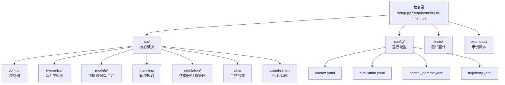
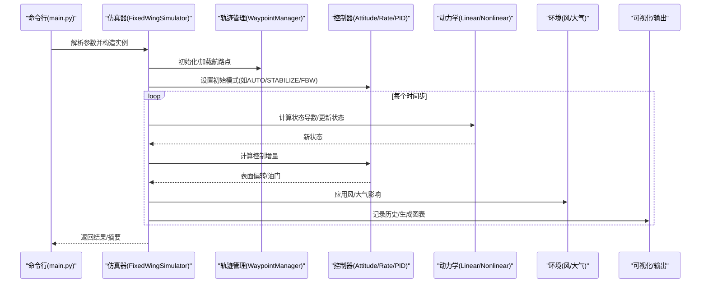
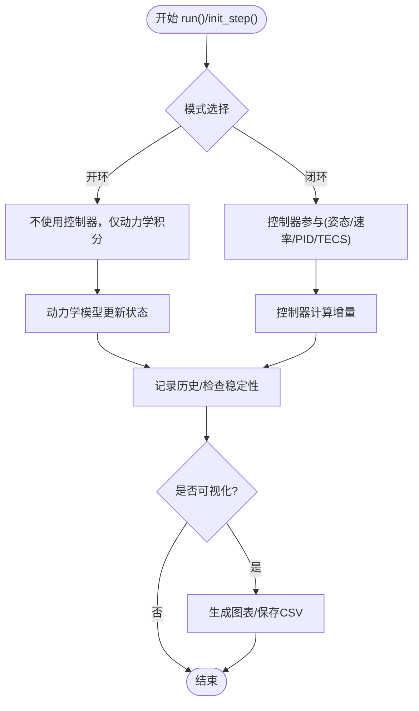
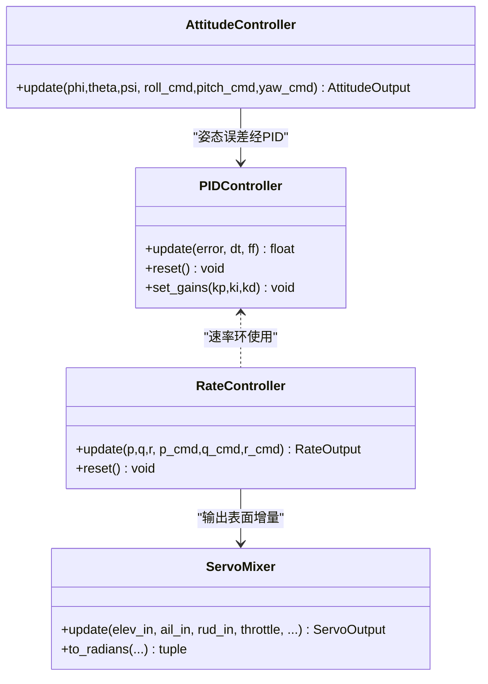
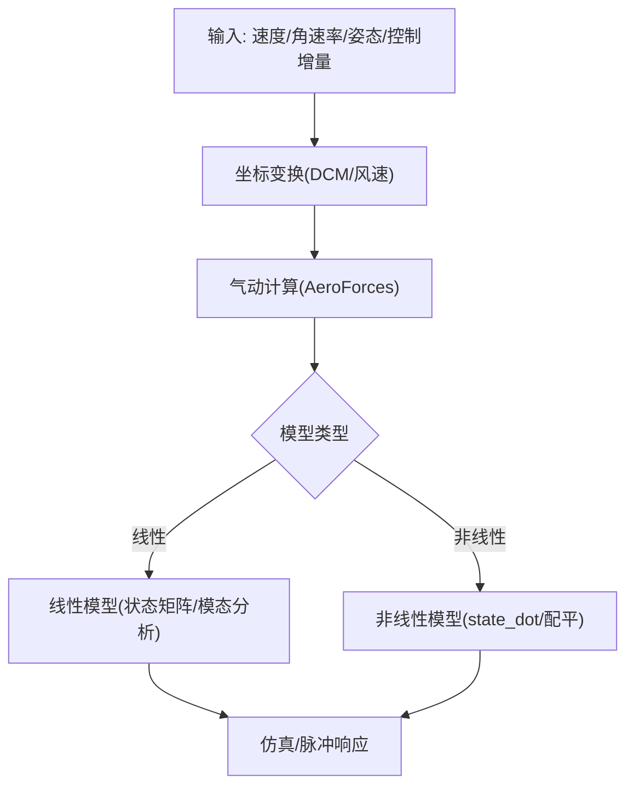
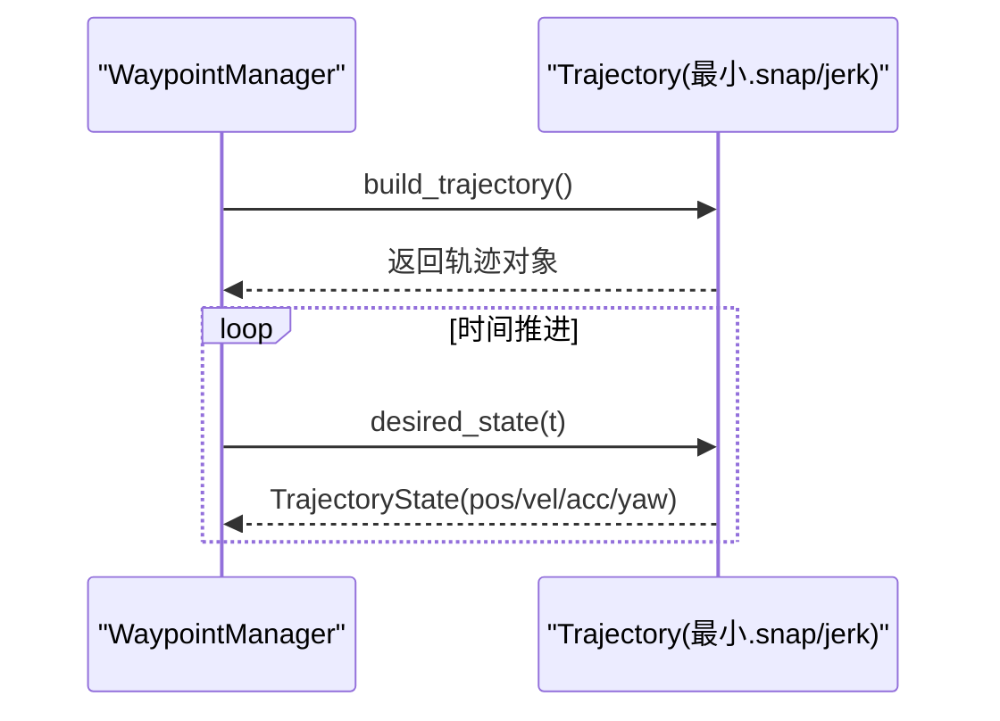
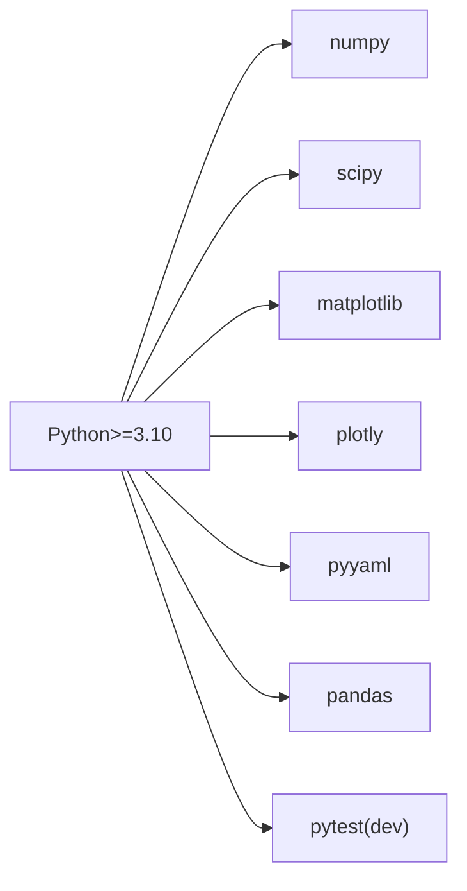

# 代码贡献流程

<cite>
**本文引用的文件**   
- [setup.py](file://setup.py)
- [requirements.txt](file://requirements.txt)
- [main.py](file://main.py)
- [README.md](file://README.md)
- [test_integration.py](file://tests/test_integration.py)
- [test_control.py](file://tests/test_control.py)
- [test_dynamics.py](file://tests/test_dynamics.py)
- [test_planning.py](file://tests/test_planning.py)
- [aircraft.yaml](file://config/aircraft.yaml)
- [simulation.yaml](file://config/simulation.yaml)
- [control_params.yaml](file://config/control_params.yaml)
- [trajectory.yaml](file://config/trajectory.yaml)
- [example_1_linear_response.py](file://examples/example_1_linear_response.py)
- [example_2_nonlinear_dynamics.py](file://examples/example_2_nonlinear_dynamics.py)
</cite>

## 目录
1. [简介](#简介)
2. [项目结构](#项目结构)
3. [核心组件](#核心组件)
4. [架构总览](#架构总览)
5. [详细组件分析](#详细组件分析)
6. [依赖关系分析](#依赖关系分析)
7. [性能与稳定性考量](#性能与稳定性考量)
8. [故障排查指南](#故障排查指南)
9. [结论](#结论)
10. [附录：贡献流程与规范](#附录贡献流程与规范)

## 简介
本指南面向希望为 FixedWingSimulator 贡献代码的开发者，覆盖从 Fork 项目到 PR 合并的全流程，以及代码风格、测试、文档、审查与发布等规范。项目采用 Python 实现，提供固定翼无人机的线性/非线性动力学仿真、轨迹规划、控制律与可视化能力，并通过命令行入口与示例脚本展示典型用法。

## 项目结构
项目采用按功能域划分的模块化组织方式，核心目录与职责如下：
- src：核心源码包，按领域划分为 control、dynamics、environment、models、planning、simulation、utils、visualization 等子包
- config：运行期配置（飞机参数、仿真参数、控制参数、轨迹参数）
- tests：单元与集成测试，覆盖控制、动力学、轨迹规划与端到端集成
- examples：演示脚本，展示线性/非线性仿真、轨迹跟踪等典型场景
- 根目录：安装与依赖定义、主入口、调试脚本

图表来源
- [setup.py](file://setup.py#L1-L23)
- [requirements.txt](file://requirements.txt#L1-L8)
- [main.py](file://main.py#L1-L145)

章节来源
- [setup.py](file://setup.py#L1-L23)
- [requirements.txt](file://requirements.txt#L1-L8)
- [main.py](file://main.py#L1-L145)

## 核心组件
- 主入口与命令行接口：解析参数并驱动仿真器执行开环/闭环仿真或线性分析
- 仿真器与状态管理：封装仿真循环、历史记录与结果导出
- 控制系统：姿态/速率控制器、PID、ArduPilot 兼容参数、舵面混合器与 TECS
- 动力学模型：坐标变换、气动计算、线性/非线性模型、配平计算
- 规划模块：最小急弯/最小.snap 轨迹、航路点管理、轨迹构建
- 工具与可视化：数学工具、日志、绘图与动画
- 配置系统：飞机参数、仿真步长/时长、风场、轨迹类型、控制参数等

章节来源
- [main.py](file://main.py#L32-L145)
- [test_integration.py](file://tests/test_integration.py#L1-L391)
- [test_control.py](file://tests/test_control.py#L1-L371)
- [test_dynamics.py](file://tests/test_dynamics.py#L1-L336)
- [test_planning.py](file://tests/test_planning.py#L1-L328)

## 架构总览
下图展示了从命令行到仿真器、再到各子系统的调用链与数据流。

图表来源
- [main.py](file://main.py#L98-L145)
- [test_integration.py](file://tests/test_integration.py#L66-L343)

## 详细组件分析

### 组件A：仿真器与端到端流程
- 职责：统一调度仿真循环、处理开环/闭环模式、线性分析、历史记录与可视化
- 关键行为：支持 step() 流式推进与 run() 批处理；校验数值稳定性；提供 summary()/visualize()/to_csv()

图表来源
- [test_integration.py](file://tests/test_integration.py#L66-L343)

章节来源
- [test_integration.py](file://tests/test_integration.py#L1-L391)

### 组件B：控制子系统（PID/姿态/速率/舵面混合）
- 职责：实现 PID 控制器、姿态/速率控制器、ArduPilot 参数兼容、舵面混合与限幅
- 关键测试：比例/积分/微分特性、抗积分饱和、输出限幅、坐标转换一致性

图表来源
- [test_control.py](file://tests/test_control.py#L27-L371)

章节来源
- [test_control.py](file://tests/test_control.py#L1-L371)

### 组件C：动力学与坐标变换
- 职责：欧拉角旋转矩阵、风/速度矢量变换、气动力矩计算、线性/非线性模型、配平
- 关键测试：DCM 正交性、风速变换一致性、升阻特性、模态稳定性、配平收敛

图表来源
- [test_dynamics.py](file://tests/test_dynamics.py#L29-L336)

章节来源
- [test_dynamics.py](file://tests/test_dynamics.py#L1-L336)

### 组件D：轨迹规划与航路点管理
- 职责：最小.snap/最小.jerk 轨迹求解、航路点添加/持久化、活动段查询
- 关键测试：边界条件满足、连续性、航路点一致性、YAML 往返

图表来源
- [test_planning.py](file://tests/test_planning.py#L27-L328)

章节来源
- [test_planning.py](file://tests/test_planning.py#L1-L328)

## 依赖关系分析
- 安装与运行依赖：NumPy、SciPy、Matplotlib、Plotly、PyYAML、Pandas
- 开发依赖：pytest（用于测试）
- Python 版本要求：>=3.10
- 包结构：通过 setup.py 将 src 设为包根目录，自动发现子包

图表来源
- [setup.py](file://setup.py#L11-L21)
- [requirements.txt](file://requirements.txt#L1-L8)

章节来源
- [setup.py](file://setup.py#L1-L23)
- [requirements.txt](file://requirements.txt#L1-L8)

## 性能与稳定性考量
- 数值稳定性：测试中对高度、空速、攻角等进行上限/有限性检查，避免发散
- 时间步长与积分器：配置文件提供 dt、积分器类型与容差，需根据场景权衡精度与性能
- 风场与轨迹：风模型与轨迹类型会影响仿真耗时与稳定性，建议在回归测试中覆盖多场景
- 可视化与I/O：示例脚本使用无头后端保存图片与CSV，避免交互式窗口带来的不确定性

章节来源
- [test_integration.py](file://tests/test_integration.py#L41-L58)
- [simulation.yaml](file://config/simulation.yaml#L1-L30)
- [example_1_linear_response.py](file://examples/example_1_linear_response.py#L25-L29)
- [example_2_nonlinear_dynamics.py](file://examples/example_2_nonlinear_dynamics.py#L25-L29)

## 故障排查指南
- 常见问题定位
  - 数值发散：检查 dt 是否过大、风场是否过强、轨迹是否过于激进
  - 配置错误：确认 config/*.yaml 中字段拼写与取值范围
  - 导入路径：确保从项目根运行或正确设置 sys.path
- 回归测试建议
  - 使用集成测试覆盖开环/闭环/线性分析等关键路径
  - 针对控制/动力学/规划模块分别运行单元测试
- 日志与输出
  - 利用示例脚本的 CSV/图片输出进行离线验证
  - 在 CI 中开启 pytest 输出以便复现问题

章节来源
- [test_integration.py](file://tests/test_integration.py#L66-L343)
- [test_control.py](file://tests/test_control.py#L61-L148)
- [test_dynamics.py](file://tests/test_dynamics.py#L67-L121)
- [test_planning.py](file://tests/test_planning.py#L51-L116)

## 结论
本指南提供了从开发环境搭建、代码贡献流程、风格与测试规范，到架构理解与故障排查的完整路径。建议贡献者在提交前完成本地测试与示例验证，并遵循统一的命名、注释与文档规范，以保证代码质量与可维护性。

## 附录：贡献流程与规范

### 一、开发环境搭建与依赖管理
- 克隆仓库后，在项目根目录安装开发依赖
  - 推荐使用虚拟环境隔离依赖
  - 安装命令参考：pip install -e .[dev] 或 pip install -r requirements.txt
- 运行示例脚本验证环境
  - 示例脚本位于 examples/，使用无头后端保存图片与CSV
- 验证测试
  - 使用 pytest 运行 tests/ 下的全部测试，确保通过

章节来源
- [setup.py](file://setup.py#L19-L21)
- [requirements.txt](file://requirements.txt#L1-L8)
- [example_1_linear_response.py](file://examples/example_1_linear_response.py#L25-L29)
- [example_2_nonlinear_dynamics.py](file://examples/example_2_nonlinear_dynamics.py#L25-L29)

### 二、Fork 与分支策略
- Fork 项目到个人仓库
- 创建功能分支，命名建议采用 功能/主题-简述 的形式
- 提交前确保通过本地测试与示例验证

### 三、编写与运行测试
- 单元测试
  - tests/test_control.py：控制器相关逻辑
  - tests/test_dynamics.py：动力学与坐标变换
  - tests/test_planning.py：轨迹规划与航路点管理
  - tests/test_integration.py：端到端集成测试（开环/闭环/线性分析/步进API一致性）
- 运行测试
  - 使用 pytest tests/ 命令运行全部测试
  - 建议在 CI 中启用相同命令以保持一致

章节来源
- [test_control.py](file://tests/test_control.py#L1-L371)
- [test_dynamics.py](file://tests/test_dynamics.py#L1-L336)
- [test_planning.py](file://tests/test_planning.py#L1-L328)
- [test_integration.py](file://tests/test_integration.py#L1-L391)

### 四、代码风格规范
- Python 版本与依赖
  - Python >= 3.10
  - 依赖版本在 setup.py 与 requirements.txt 中明确
- 命名约定
  - 模块与类：采用帕斯卡命名（如 FixedWingSimulator、LinearModel）
  - 函数与变量：采用蛇形命名（如 run_linear_analysis、aircraft_name）
  - 常量：采用全大写蛇形（如 MAX_PITCH、GRAVITY）
- 注释与文档字符串
  - 模块顶部提供简要说明与用途
  - 类与公共方法提供 docstring，描述输入、输出与行为
  - 复杂逻辑处补充行内注释，解释关键假设与数值考虑
- 代码组织
  - 遵循单一职责原则，尽量保持函数短小、类清晰
  - 避免魔法数字，使用常量或配置项替代
  - 保持导入顺序与分组（标准库、第三方、项目内）

章节来源
- [setup.py](file://setup.py#L10-L21)
- [requirements.txt](file://requirements.txt#L1-L8)
- [test_integration.py](file://tests/test_integration.py#L1-L15)

### 五、文档编写规范与API维护
- 配置文档
  - config/*.yaml 文件应包含字段说明与默认值
  - 示例脚本中对输出目录与格式有明确说明
- 示例脚本
  - 每个示例脚本包含用途说明、输出文件清单与保存位置
  - 使用无头后端，确保在 CI 中可稳定运行
- API 文档
  - 对外公开的类与方法应在 docstring 中说明用途、参数与返回值
  - 对于历史记录、状态对象等，提供 to_dict/to_csv 等序列化方法

章节来源
- [aircraft.yaml](file://config/aircraft.yaml#L1-L13)
- [simulation.yaml](file://config/simulation.yaml#L1-L30)
- [control_params.yaml](file://config/control_params.yaml#L1-L45)
- [trajectory.yaml](file://config/trajectory.yaml#L1-L23)
- [example_1_linear_response.py](file://examples/example_1_linear_response.py#L1-L20)
- [example_2_nonlinear_dynamics.py](file://examples/example_2_nonlinear_dynamics.py#L1-L20)

### 六、代码审查流程与合并标准
- 提交前自检
  - 通过 pytest tests/ 全部用例
  - 运行示例脚本至少一次，确认输出存在且格式正确
  - 检查新增/修改代码是否符合命名与注释规范
- 提交 PR
  - 清晰描述变更目的、影响范围与测试结果
  - 若涉及配置文件，请说明默认值与兼容性
- 审查要点
  - 数值稳定性与边界条件处理
  - 与现有 API 的兼容性
  - 文档与示例的同步更新
- 合并标准
  - 至少一名维护者批准
  - CI 通过，测试覆盖主要路径
  - 配置与示例更新到位

### 七、版本发布与向后兼容性
- 版本号
  - 当前版本由 setup.py 指定，建议遵循语义化版本管理
- 发布流程
  - 更新版本号与变更日志
  - 在 CI 中运行全量测试
  - 打标签并发布
- 向后兼容性
  - 避免破坏性变更；若必须变更，提供迁移指南并在次要版本中引入
  - 保持 config/*.yaml 字段兼容，必要时保留旧字段并标注弃用

章节来源
- [setup.py](file://setup.py#L4-L6)