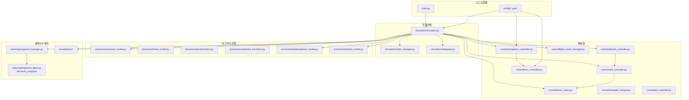
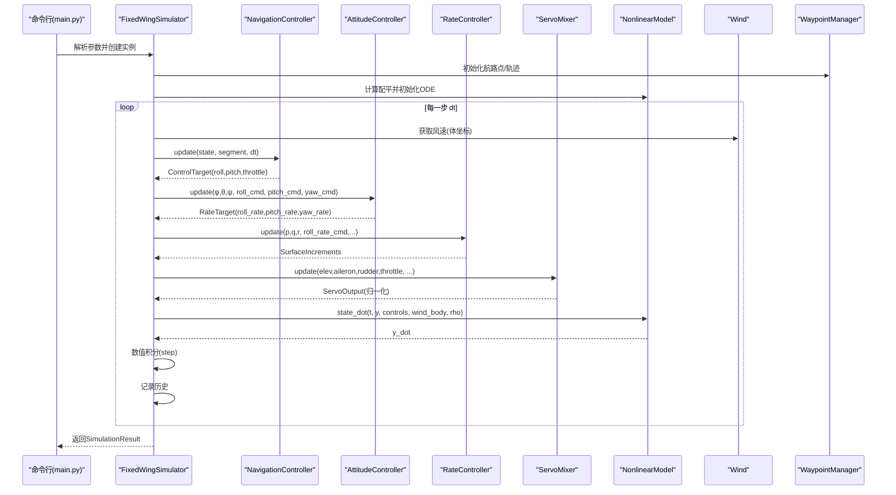
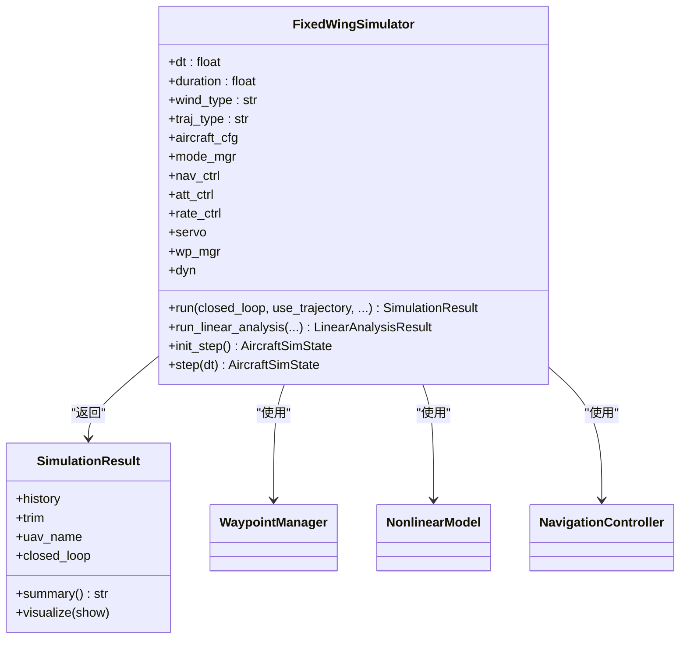
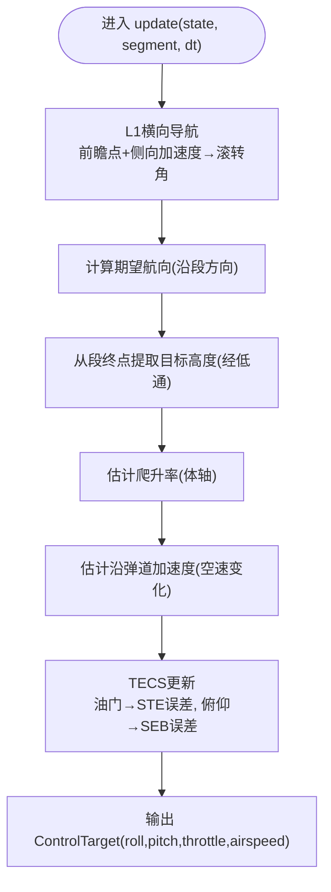
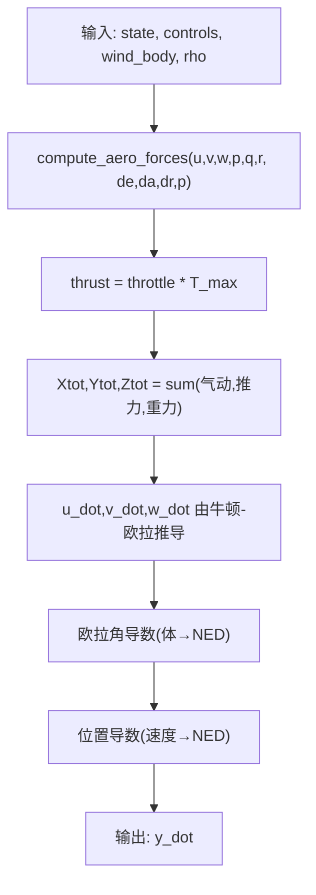
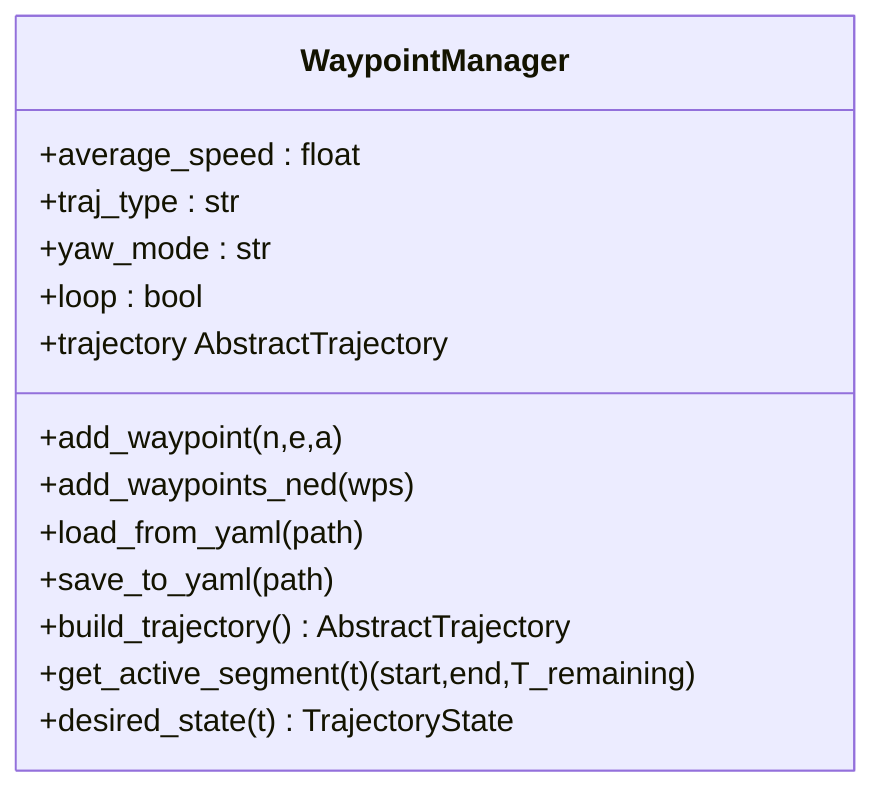
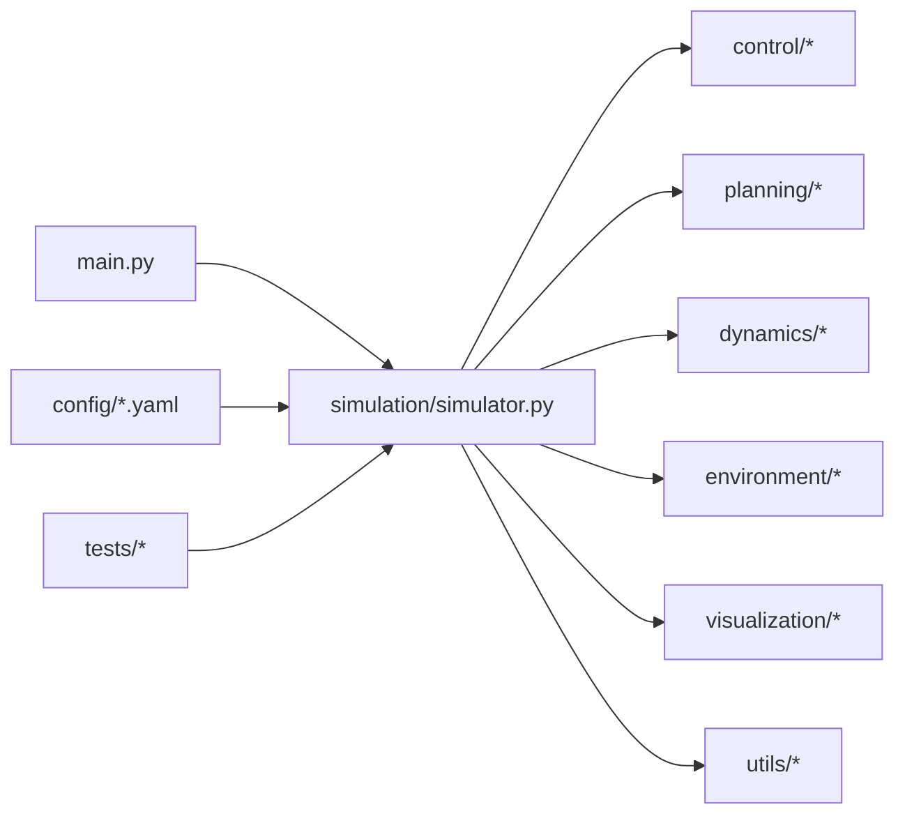

# 开发指南

<cite>
**本文引用的文件**
- [main.py](file://main.py)
- [setup.py](file://setup.py)
- [requirements.txt](file://requirements.txt)
- [config/aircraft.yaml](file://config/aircraft.yaml)
- [config/control_params.yaml](file://config/control_params.yaml)
- [config/simulation.yaml](file://config/simulation.yaml)
- [config/trajectory.yaml](file://config/trajectory.yaml)
- [debug_long.py](file://debug_long.py)
- [debug_segment.py](file://debug_segment.py)
- [debug_tecs.py](file://debug_tecs.py)
- [debug_trim.py](file://debug_trim.py)
- [src/simulation/simulator.py](file://src/simulation/simulator.py)
- [src/control/navigation_controller.py](file://src/control/navigation_controller.py)
- [src/control/tecs_controller.py](file://src/control/tecs_controller.py)
- [src/dynamics/nonlinear_model.py](file://src/dynamics/nonlinear_model.py)
- [src/planning/waypoint_manager.py](file://src/planning/waypoint_manager.py)
- [tests/test_integration.py](file://tests/test_integration.py)
- [tests/test_control.py](file://tests/test_control.py)
</cite>

## 目录
1. [简介](#简介)
2. [项目结构](#项目结构)
3. [核心组件](#核心组件)
4. [架构总览](#架构总览)
5. [详细组件分析](#详细组件分析)
6. [依赖关系分析](#依赖关系分析)
7. [性能考虑](#性能考虑)
8. [调试指南](#调试指南)
9. [代码贡献与规范](#代码贡献与规范)
10. [故障排查](#故障排查)
11. [结论](#结论)

## 简介
本指南面向FixedWingSimulator项目的开发者，系统阐述代码架构设计原则、扩展方法、调试工具使用、性能优化策略、代码贡献流程与规范，并提供常见问题的排查建议。项目采用模块化分层设计，涵盖飞行器动力学、环境建模、轨迹规划、控制链路与可视化等模块，支持线性与非线性仿真、多种飞行模式与风场配置。

## 项目结构
项目采用按功能域划分的包结构，核心模块如下：
- simulation：仿真引擎与结果封装
- control：ArduPilot风格控制链（导航、姿态、速率、舵面混合）
- dynamics：6-DOF非线性模型与4-DOF线性分析
- planning：航路点管理与轨迹生成
- environment：风场与大气模型
- visualization：绘图与动画
- utils：配置加载、数学工具、日志
- config：配置文件（飞机、控制参数、仿真、轨迹）
- tests：集成与单元测试
- examples：示例脚本
- 调试脚本：长时仿真、轨迹段、TECS控制、配平

图表来源
- [main.py](file://main.py#L1-L145)
- [src/simulation/simulator.py](file://src/simulation/simulator.py#L1-L642)
- [src/control/navigation_controller.py](file://src/control/navigation_controller.py#L1-L293)
- [src/control/tecs_controller.py](file://src/control/tecs_controller.py#L1-L647)
- [src/dynamics/nonlinear_model.py](file://src/dynamics/nonlinear_model.py#L1-L386)
- [src/planning/waypoint_manager.py](file://src/planning/waypoint_manager.py#L1-L208)

章节来源
- [main.py](file://main.py#L1-L145)
- [config/simulation.yaml](file://config/simulation.yaml#L1-L30)
- [config/control_params.yaml](file://config/control_params.yaml#L1-L45)
- [config/trajectory.yaml](file://config/trajectory.yaml#L1-L23)

## 核心组件
- FixedWingSimulator：主仿真器，编排各子系统，提供闭环/开环运行、线性分析、步进接口
- WaypointManager：航路点管理与轨迹构建
- NavigationController：L1横向导航 + TECS纵向控制
- TECSController：总能量控制（油门控制总比能量，俯仰控制比能量分配）
- 非线性动力学模型：6-DOF方程、配平求解、气动与推进力计算
- 控制层：姿态/速率/舵面混合，ArduPilot兼容参数
- 环境：风场与大气密度模型
- 可视化：Matplotlib/Plotly绘图与动画

章节来源
- [src/simulation/simulator.py](file://src/simulation/simulator.py#L115-L642)
- [src/planning/waypoint_manager.py](file://src/planning/waypoint_manager.py#L20-L208)
- [src/control/navigation_controller.py](file://src/control/navigation_controller.py#L45-L293)
- [src/control/tecs_controller.py](file://src/control/tecs_controller.py#L50-L647)
- [src/dynamics/nonlinear_model.py](file://src/dynamics/nonlinear_model.py#L104-L386)

## 架构总览
系统采用“控制链-动力学-环境-规划-仿真器”的分层架构：
- 控制链：导航控制器（L1+TECS）→ 姿态控制器 → 速率控制器 → 舵面混合器
- 规划：WaypointManager构建轨迹，提供当前路径段
- 动力学：NonlinearModel提供6-DOF状态导数，配合风场与大气模型
- 仿真器：整合控制链与动力学，驱动数值积分器，记录历史并产出结果

图表来源
- [src/simulation/simulator.py](file://src/simulation/simulator.py#L239-L567)
- [src/control/navigation_controller.py](file://src/control/navigation_controller.py#L134-L202)
- [src/dynamics/nonlinear_model.py](file://src/dynamics/nonlinear_model.py#L160-L255)

## 详细组件分析

### 固定翼仿真器（FixedWingSimulator）
- 职责：装配控制参数、环境、控制层、轨迹、动力学；执行闭环/开环仿真；返回结果与可视化
- 关键流程：
  - 初始化：读取配置、创建控制参数、构造控制层、轨迹管理器、动力学模型
  - 运行：计算配平、构建ODE函数、选择轨迹或航路点序列、循环更新控制与积分
  - 结果：封装历史、配平结果，提供摘要与可视化
- 扩展点：新增飞行模式、轨迹类型、控制律、风场模型

图表来源
- [src/simulation/simulator.py](file://src/simulation/simulator.py#L115-L642)

章节来源
- [src/simulation/simulator.py](file://src/simulation/simulator.py#L115-L642)

### 导航控制器（L1 + TECS）
- L1横向导航：基于路径段的前瞻点法，结合体轴速度估计地面航迹，计算侧向加速度并转换为滚转指令
- TECS纵向控制：以总比能量（SPE+SKE）为控制对象，油门调节STE，俯仰调节SEB（比能量分配），实现高度与速度耦合控制
- 参数来源：来自控制参数配置文件与ArduPilot兼容参数类

图表来源
- [src/control/navigation_controller.py](file://src/control/navigation_controller.py#L134-L202)
- [src/control/tecs_controller.py](file://src/control/tecs_controller.py#L247-L315)

章节来源
- [src/control/navigation_controller.py](file://src/control/navigation_controller.py#L45-L293)
- [src/control/tecs_controller.py](file://src/control/tecs_controller.py#L50-L647)

### 非线性动力学模型（6-DOF）
- 状态：体轴速度、角速度、欧拉角、位置（NED）
- 控制输入：升降舵、副翼、方向舵、油门
- 力/力矩来源：气动（compute_aero_forces）、推进（throttle*T_max）、重力
- 提供：配平求解、状态导数、批量仿真

图表来源
- [src/dynamics/nonlinear_model.py](file://src/dynamics/nonlinear_model.py#L160-L255)

章节来源
- [src/dynamics/nonlinear_model.py](file://src/dynamics/nonlinear_model.py#L104-L386)

### 航路点与轨迹管理
- WaypointManager：维护NED航路点列表，构建轨迹对象（最小Snap/最小Jerk），提供当前活动段
- 支持：航路点增删改、YAML导入/导出、循环航路、航向模式

图表来源
- [src/planning/waypoint_manager.py](file://src/planning/waypoint_manager.py#L20-L208)

章节来源
- [src/planning/waypoint_manager.py](file://src/planning/waypoint_manager.py#L20-L208)

## 依赖关系分析
- 包依赖：setup.py声明NumPy/SciPy/Matplotlib/Plotly/YAML/Pandas，测试依赖pytest
- 运行时依赖：main.py通过sys.path插入src，确保模块导入
- 配置依赖：仿真配置、控制参数、轨迹配置分别位于config目录

图表来源
- [setup.py](file://setup.py#L1-L23)
- [requirements.txt](file://requirements.txt#L1-L8)
- [main.py](file://main.py#L21-L27)

章节来源
- [setup.py](file://setup.py#L1-L23)
- [requirements.txt](file://requirements.txt#L1-L8)
- [main.py](file://main.py#L21-L27)

## 性能考虑
- 数值积分：默认使用dopri5（RK45）积分器，高精度；可通过配置调整步长与容差
- 控制更新频率：控制层在每步更新，注意与积分器步长匹配
- 空速/加速度估计：TECS使用互补滤波与低通，避免噪声影响
- 风场与密度：按高度计算密度，风场按NED→体坐标变换，避免额外开销
- 可视化：关闭绘图可显著降低开销（--no-plot）

章节来源
- [config/simulation.yaml](file://config/simulation.yaml#L1-L30)
- [src/simulation/simulator.py](file://src/simulation/simulator.py#L339-L339)

## 调试指南
本节介绍专用调试脚本的使用方法与场景。

### 长时仿真调试（debug_long.py）
- 目的：验证TECS在长时间飞行中的收敛与稳定性
- 方法：替换导航控制器update，记录高度、速度、油门、俯仰；运行FBW_B模式爬升任务
- 输出：阶段性统计（最大/最小高度、最终高度/速度、最后10秒统计）

章节来源
- [debug_long.py](file://debug_long.py#L1-L55)

### 轨迹段调试（debug_segment.py）
- 目的：检查路径段终点（segment.end）传递是否正确，以及des_pos在轨迹构建前后的裁剪
- 方法：猴子补丁记录segment.end与当前高度；对比轨迹des_pos与实际目标高度
- 输出：关键时刻的seg_end_alt与cur_alt对比，验证高度边界裁剪

章节来源
- [debug_segment.py](file://debug_segment.py#L1-L55)

### TECS控制调试（debug_tecs.py）
- 目的：深入分析TECS的高度需求、油门与俯仰输出、STE误差
- 方法：记录hgt_raw、hgt_lpf、alt、thr、pitch、spd、STE_error；对比最终高度/速度与首次达标时间
- 输出：逐时间步日志与统计，辅助调参与收敛性评估

章节来源
- [debug_tecs.py](file://debug_tecs.py#L1-L67)

### 配平调试（debug_trim.py）
- 目的：计算配平状态下的巡航油门，验证气动与重力平衡
- 方法：读取飞机参数，求解配平，计算气动力与重力在机体系投影，推导所需推力与油门
- 输出：质量、配平空速、攻角、最大推力、所需油门、Z力平衡校验

章节来源
- [debug_trim.py](file://debug_trim.py#L1-L43)

## 代码贡献与规范
- 代码风格
  - 使用Python类型注解，保持清晰的数据结构与函数签名
  - 类名使用帕斯卡命名，变量与函数使用下划线命名
  - 重要模块添加模块级文档字符串与函数级注释
- 文档要求
  - 新增模块需提供README式说明，描述职责、输入输出、关键算法要点
  - 复杂控制/动力学模块附带参数来源与参考文献
- 提交标准
  - 单元测试覆盖新增/修改功能；集成测试验证端到端稳定性
  - 提交信息清晰描述变更内容、动机与影响范围
- 代码审查
  - 关注数值稳定性、边界条件处理、参数有效性校验
  - 控制链路与动力学耦合处需重点审查

章节来源
- [tests/test_integration.py](file://tests/test_integration.py#L1-L391)
- [tests/test_control.py](file://tests/test_control.py#L1-L371)

## 故障排查
- 数值发散
  - 现象：高度/速度/角度出现NaN/Inf或异常增长
  - 排查：检查风场/密度模型、积分器步长与容差、控制输出饱和与积分抗饱和
- 控制饱和与积分饱和
  - 现象：油门/俯仰长时间饱和，系统响应迟滞
  - 排查：查看TECS输出与积分项，调整TECS参数（阻尼、积分增益、坡度补偿）
- 轨迹越界/抖动
  - 现象：目标高度/速度超出边界或震荡
  - 排查：检查轨迹构建与高度裁剪逻辑，确认segment.end与des_pos一致性
- 风场影响
  - 现象：侧风导致偏航/横滚不稳定
  - 排查：确认风NED→体坐标变换正确，检查L1横向导航对侧滑的鲁棒性

章节来源
- [tests/test_integration.py](file://tests/test_integration.py#L41-L58)
- [src/control/tecs_controller.py](file://src/control/tecs_controller.py#L553-L647)
- [src/simulation/simulator.py](file://src/simulation/simulator.py#L478-L498)

## 结论
FixedWingSimulator采用模块化分层架构，控制链与动力学解耦良好，便于扩展与维护。通过专用调试脚本可快速定位TECS、轨迹段与配平问题；完善的配置系统与测试用例保障了跨机型与多场景的稳定性。建议在新增功能时遵循统一的模块职责与参数来源规范，确保可追溯性与可维护性。