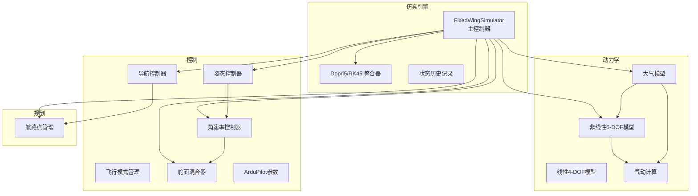
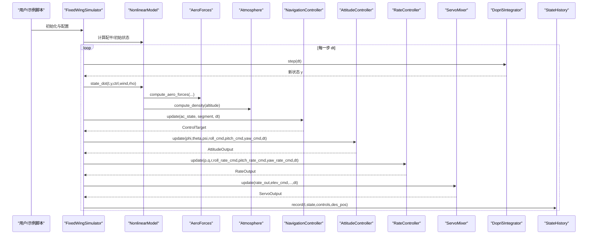
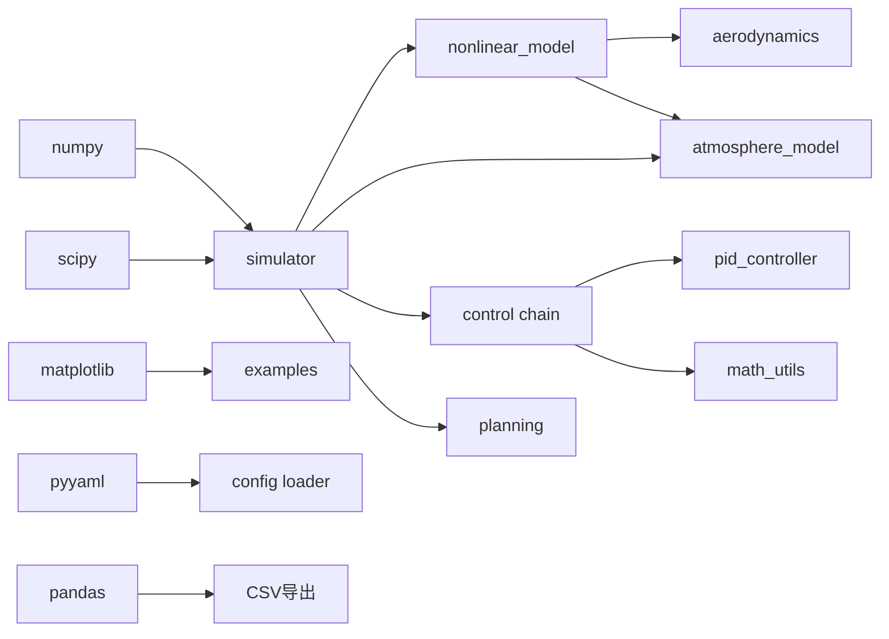

# 性能优化与最佳实践

<cite>
**本文引用的文件**
- [src/simulation/integrator.py](file://src/simulation/integrator.py)
- [src/simulation/simulator.py](file://src/simulation/simulator.py)
- [src/simulation/state_manager.py](file://src/simulation/state_manager.py)
- [src/dynamics/nonlinear_model.py](file://src/dynamics/nonlinear_model.py)
- [src/dynamics/linear_model.py](file://src/dynamics/linear_model.py)
- [src/dynamics/aerodynamics.py](file://src/dynamics/aerodynamics.py)
- [src/utils/math_utils.py](file://src/utils/math_utils.py)
- [src/environment/atmosphere_model.py](file://src/environment/atmosphere_model.py)
- [src/control/ardupilot_compat.py](file://src/control/ardupilot_compat.py)
- [src/control/attitude_controller.py](file://src/control/attitude_controller.py)
- [src/control/rate_controller.py](file://src/control/rate_controller.py)
- [src/planning/waypoint_manager.py](file://src/planning/waypoint_manager.py)
- [tests/test_integration.py](file://tests/test_integration.py)
- [examples/example_1_linear_response.py](file://examples/example_1_linear_response.py)
- [requirements.txt](file://requirements.txt)
- [setup.py](file://setup.py)
</cite>

## 目录
1. [引言](#引言)
2. [项目结构](#项目结构)
3. [核心组件](#核心组件)
4. [架构总览](#架构总览)
5. [详细组件分析](#详细组件分析)
6. [依赖关系分析](#依赖关系分析)
7. [性能考量](#性能考量)
8. [故障排查指南](#故障排查指南)
9. [结论](#结论)
10. [附录](#附录)

## 引言
本指南面向FixedWingSimulator项目的性能优化与工程实践，聚焦以下目标：
- 深入剖析仿真系统的性能瓶颈：数值积分效率、矩阵运算优化、内存使用优化
- 提供可落地的优化技术与实现方法：向量化计算、缓存策略、并行化思路
- 解释不同仿真模式（实时闭环、线性开环）的性能特点与选择策略
- 给出算法复杂度分析与性能基准测试方法
- 总结代码重构最佳实践与注意事项
- 平衡仿真精度与计算效率，并给出实际案例与对比参考

## 项目结构
项目采用模块化分层设计，围绕“模型-动力学-环境-控制-规划-仿真-工具”组织代码，便于在各层进行性能优化与独立测试。

图表来源
- [src/simulation/simulator.py](file://src/simulation/simulator.py#L115-L642)
- [src/simulation/integrator.py](file://src/simulation/integrator.py#L17-L108)
- [src/simulation/state_manager.py](file://src/simulation/state_manager.py#L95-L193)
- [src/dynamics/nonlinear_model.py](file://src/dynamics/nonlinear_model.py#L104-L386)
- [src/dynamics/linear_model.py](file://src/dynamics/linear_model.py#L107-L319)
- [src/dynamics/aerodynamics.py](file://src/dynamics/aerodynamics.py#L35-L148)
- [src/environment/atmosphere_model.py](file://src/environment/atmosphere_model.py#L24-L77)
- [src/control/attitude_controller.py](file://src/control/attitude_controller.py#L33-L134)
- [src/control/rate_controller.py](file://src/control/rate_controller.py#L32-L109)
- [src/planning/waypoint_manager.py](file://src/planning/waypoint_manager.py#L20-L208)

章节来源
- [src/simulation/simulator.py](file://src/simulation/simulator.py#L1-L642)
- [src/simulation/integrator.py](file://src/simulation/integrator.py#L1-L108)
- [src/simulation/state_manager.py](file://src/simulation/state_manager.py#L1-L193)
- [src/dynamics/nonlinear_model.py](file://src/dynamics/nonlinear_model.py#L1-L386)
- [src/dynamics/linear_model.py](file://src/dynamics/linear_model.py#L1-L319)
- [src/dynamics/aerodynamics.py](file://src/dynamics/aerodynamics.py#L1-L148)
- [src/environment/atmosphere_model.py](file://src/environment/atmosphere_model.py#L1-L77)
- [src/control/attitude_controller.py](file://src/control/attitude_controller.py#L1-L134)
- [src/control/rate_controller.py](file://src/control/rate_controller.py#L1-L109)
- [src/planning/waypoint_manager.py](file://src/planning/waypoint_manager.py#L1-L208)

## 核心组件
- 数值积分器：Dopri5步进式与RK45批处理式，分别用于实时闭环与离线线性分析
- 非线性6-DOF动力学：基于气动与惯性力矩的常微分方程
- 线性4-DOF模型：纵向模态线性化状态空间，支持模态分析与时间响应
- 控制链：ArduPilot兼容的五层控制（导航→姿态→角速率→舵面），含参数容器
- 规划与航路点：最小Snap/Jerk轨迹生成与活动段查询
- 状态管理：预分配数组的历史缓冲与派生量计算
- 环境建模：ISA大气密度与音速随高度变化

章节来源
- [src/simulation/integrator.py](file://src/simulation/integrator.py#L17-L108)
- [src/dynamics/nonlinear_model.py](file://src/dynamics/nonlinear_model.py#L104-L386)
- [src/dynamics/linear_model.py](file://src/dynamics/linear_model.py#L107-L319)
- [src/control/ardupilot_compat.py](file://src/control/ardupilot_compat.py#L17-L130)
- [src/planning/waypoint_manager.py](file://src/planning/waypoint_manager.py#L20-L208)
- [src/simulation/state_manager.py](file://src/simulation/state_manager.py#L95-L193)
- [src/environment/atmosphere_model.py](file://src/environment/atmosphere_model.py#L24-L77)

## 架构总览
下图展示主控循环中各模块的调用关系与数据流，重点标注实时性与计算热点。

图表来源
- [src/simulation/simulator.py](file://src/simulation/simulator.py#L239-L567)
- [src/dynamics/nonlinear_model.py](file://src/dynamics/nonlinear_model.py#L160-L256)
- [src/dynamics/aerodynamics.py](file://src/dynamics/aerodynamics.py#L35-L148)
- [src/environment/atmosphere_model.py](file://src/environment/atmosphere_model.py#L48-L53)
- [src/control/attitude_controller.py](file://src/control/attitude_controller.py#L81-L123)
- [src/control/rate_controller.py](file://src/control/rate_controller.py#L68-L99)
- [src/simulation/integrator.py](file://src/simulation/integrator.py#L50-L67)
- [src/simulation/state_manager.py](file://src/simulation/state_manager.py#L124-L169)

## 详细组件分析

### 数值积分器与实时性
- Dopri5步进式：适合实时闭环，单步推进，自适应步长；失败时抛出异常，需在上层捕获
- RK45批处理式：适合离线线性分析，一次性求解整个时间窗；参数rtol/atol与max_step影响精度与速度

优化要点
- 将tolerance设置为业务可接受范围，避免过小导致频繁重算
- 对于固定dt场景，可考虑固定步长的显式积分（需评估稳定性）
- 在批处理模式下，合理设置t_eval以减少中间结果

章节来源
- [src/simulation/integrator.py](file://src/simulation/integrator.py#L17-L108)
- [src/simulation/simulator.py](file://src/simulation/simulator.py#L339-L339)

### 非线性6-DOF动力学与气动计算
- state_dot包含：气动力/力矩、推力、重力、欧拉角导数、位置导数
- compute_aero_forces对风速、攻角、侧滑角、非维角速率进行计算，是主要CPU热点

优化要点
- 向量化：将多帧状态批量传入compute_aero_forces，减少Python循环开销
- 缓存：对动态压力、密度等中间量按高度或状态复用
- 近似：在低速/小扰动场景下，可采用线性近似减少三角函数调用

复杂度分析
- 单次state_dot：O(1)，涉及若干三角函数与标量乘法
- compute_aero_forces：O(1)，包含多项式组合与少量三角函数

章节来源
- [src/dynamics/nonlinear_model.py](file://src/dynamics/nonlinear_model.py#L160-L256)
- [src/dynamics/aerodynamics.py](file://src/dynamics/aerodynamics.py#L35-L148)
- [src/utils/math_utils.py](file://src/utils/math_utils.py#L107-L124)

### 线性4-DOF模型与模态分析
- build构建A/B矩阵，analyze_modes进行特征值分解，simulate求解线性系统
- 适合离线分析与控制器设计验证

优化要点
- 预计算与缓存A/B矩阵，避免重复构建
- 使用稀疏/结构化矩阵库（如需要）提升大规模问题性能

复杂度分析
- 构建A/B：O(1)（常数规模4×4）
- 特征值分解：O(1)（4×4）

章节来源
- [src/dynamics/linear_model.py](file://src/dynamics/linear_model.py#L129-L201)
- [src/dynamics/linear_model.py](file://src/dynamics/linear_model.py#L206-L252)
- [src/dynamics/linear_model.py](file://src/dynamics/linear_model.py#L258-L307)

### 控制链与参数容器
- ArduPilot参数容器提供标准命名与校验
- 姿态/角速率控制器均为独立PID，支持热重载增益

优化要点
- PID内部更新尽量向量化（若批量处理）
- 输出饱和与限幅提前，减少无效计算
- 参数校验与默认值在初始化阶段完成，运行时避免重复检查

章节来源
- [src/control/ardupilot_compat.py](file://src/control/ardupilot_compat.py#L17-L130)
- [src/control/attitude_controller.py](file://src/control/attitude_controller.py#L33-L134)
- [src/control/rate_controller.py](file://src/control/rate_controller.py#L32-L109)

### 规划与航路点管理
- WaypointManager负责航路点加载/保存、轨迹构建与活动段查询
- 最小Snap/Jerk轨迹在仿真前构建并缓存

优化要点
- 轨迹构建仅在航路点变更后触发，避免重复计算
- 活动段查询使用二分查找，时间复杂度O(logN)

章节来源
- [src/planning/waypoint_manager.py](file://src/planning/waypoint_manager.py#L127-L161)
- [src/planning/waypoint_manager.py](file://src/planning/waypoint_manager.py#L178-L202)

### 状态管理与内存使用
- StateHistory使用预分配NumPy数组，record按索引写入，trim裁剪尾部空位
- AircraftSimState提供from_array/to_array与派生量计算

优化要点
- 预估n_steps，避免扩容与复制
- 使用view而非copy，减少内存拷贝
- 导出CSV时按列写入，避免临时拼接

章节来源
- [src/simulation/state_manager.py](file://src/simulation/state_manager.py#L95-L193)

### 大气模型
- compute_density根据高度查表/分段计算，返回密度与音速
- 在state_dot中按高度查询，避免重复计算

优化要点
- 将高度映射到密度表，使用查找替代公式
- 对连续高度变化，使用插值或缓存窗口

章节来源
- [src/environment/atmosphere_model.py](file://src/environment/atmosphere_model.py#L24-L77)

## 依赖关系分析
- NumPy/SciPy版本要求明确，建议在CI中锁定版本以保证性能一致性
- 控制链依赖PID控制器与数学工具函数
- 动力学依赖气动与旋转矩阵工具

图表来源
- [requirements.txt](file://requirements.txt#L1-L8)
- [setup.py](file://setup.py#L11-L18)
- [src/simulation/simulator.py](file://src/simulation/simulator.py#L33-L52)

章节来源
- [requirements.txt](file://requirements.txt#L1-L8)
- [setup.py](file://setup.py#L1-L23)

## 性能考量

### 性能瓶颈定位
- 气动计算与三角函数调用是主要CPU热点
- 控制链每步多次PID更新与饱和
- 实时闭环中Dopri5单步积分的调用开销
- 状态历史记录的数组写入与裁剪

### 优化技术与实现方法
- 向量化计算
  - 将多帧状态打包传入compute_aero_forces，减少Python循环
  - 批量构造A/B矩阵与线性求解（线性分析）
- 缓存策略
  - 预计算并缓存密度/音速，按高度区间缓存
  - 航路点变更后重建轨迹，其余时间复用
- 并行化思路
  - 离线批处理（RK45）天然可并行化
  - 实时闭环中，将多个独立子系统（如多机仿真）并行
- 内存优化
  - 预分配StateHistory，避免扩容
  - 导出CSV时按列写入，减少临时对象
- 精度与效率平衡
  - 通过调整rtol/atol与max_step在稳定性和速度间折中
  - 固定步长显式积分（需稳定性验证）可降低自适应开销

### 不同仿真模式的性能特点与选择
- 实时闭环（run/closed_loop=True）
  - 优点：贴近真实控制回路，适合在线验证
  - 成本：每步Dopri5积分+控制链更新，CPU占用较高
  - 适用：飞行控制算法验证、硬件在环
- 线性开环（run_linear_analysis）
  - 优点：快速获得模态信息与时间响应
  - 成本：批处理求解，内存占用与矩阵运算
  - 适用：控制器设计、稳定性分析
- 步进接口（init_step/step）
  - 优点：与外部系统集成友好
  - 成本：每次调用有固定开销
  - 适用：GUI/可视化、远程控制

### 算法复杂度分析
- 非线性6-DOF：每步O(1)，主要瓶颈在三角函数与浮点运算
- 线性4-DOF：每步O(1)，特征值分解O(1)
- 气动计算：每步O(1)，但调用频次高
- 控制链：每步O(1)，但包含多次PID更新

### 性能基准测试方法
- 时间基准
  - 测量单次step耗时（含控制链与积分）
  - 记录总仿真时间与有效步数，计算平均步时
- 精度验证
  - 对比不同rtol/atol下的稳态误差与收敛速度
  - 线性分析与非线性仿真对比
- 可视化输出
  - 使用内置plot/动画功能对比轨迹与状态响应
- 基准脚本参考
  - 示例脚本已演示CSV/图像导出流程，可用于自动化评测

章节来源
- [src/simulation/simulator.py](file://src/simulation/simulator.py#L239-L567)
- [src/dynamics/linear_model.py](file://src/dynamics/linear_model.py#L312-L319)
- [examples/example_1_linear_response.py](file://examples/example_1_linear_response.py#L83-L206)

## 故障排查指南
- 积分失败
  - 现象：Dopri5报错，抛出RuntimeError
  - 排查：检查控制输入是否过大、初始条件是否合理、风场/密度是否突变
- 数值发散
  - 现象：高度/速度/角度异常增长
  - 排查：检查PID增益、饱和限幅、气动模型参数
- 状态历史不完整
  - 现象：最终数组长度小于预期
  - 排查：确认n_steps估计、record边界、trim裁剪逻辑
- 参数越界
  - 现象：参数校验警告
  - 排查：核对ArduPilot参数范围与单位转换

章节来源
- [src/simulation/integrator.py](file://src/simulation/integrator.py#L54-L56)
- [tests/test_integration.py](file://tests/test_integration.py#L41-L58)
- [src/simulation/state_manager.py](file://src/simulation/state_manager.py#L170-L175)
- [src/control/ardupilot_compat.py](file://src/control/ardupilot_compat.py#L104-L130)

## 结论
通过在气动计算、控制链、积分器与状态管理等关键路径实施向量化、缓存与批处理策略，可在保证精度的前提下显著提升仿真效率。针对不同应用需求选择合适的仿真模式，并结合基准测试持续监控性能与稳定性，是工程落地的关键。

## 附录

### 代码重构最佳实践与注意事项
- 分层解耦：保持动力学、控制、规划、仿真模块职责清晰
- 预分配与零拷贝：优先使用NumPy数组，避免频繁创建/销毁对象
- 参数集中管理：ArduPilot参数统一入口，避免分散硬编码
- 错误处理：在实时路径中捕获并降级，避免中断主循环
- 文档与测试：为性能敏感路径补充单元测试与回归测试

### 实际案例与性能对比（示例）
- 示例脚本展示了线性开环与闭环对比，可作为性能对比的参考模板
- 建议在相同硬件与参数下，对比不同rtol/atol与轨迹类型对性能的影响

章节来源
- [examples/example_1_linear_response.py](file://examples/example_1_linear_response.py#L83-L206)