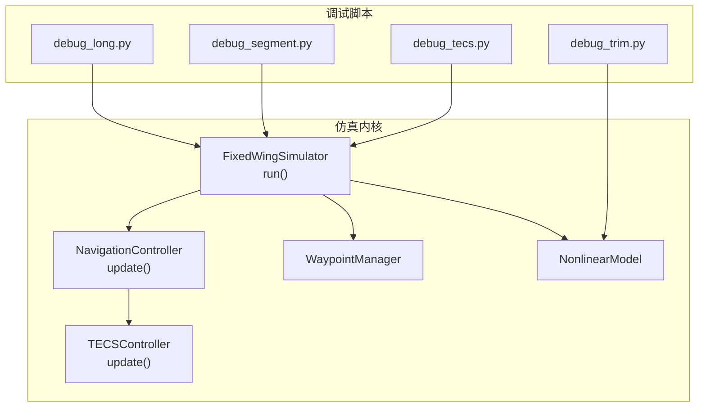
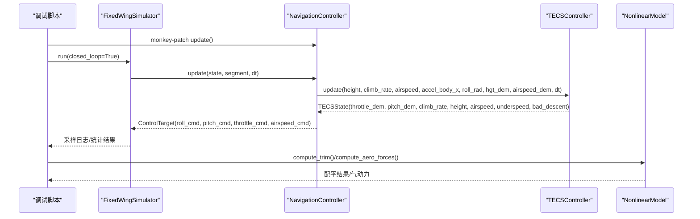
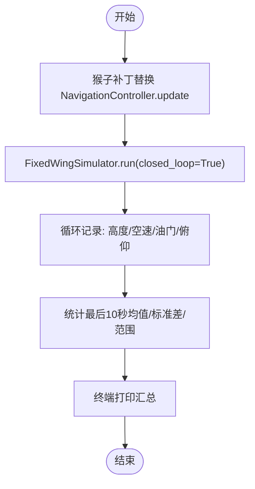
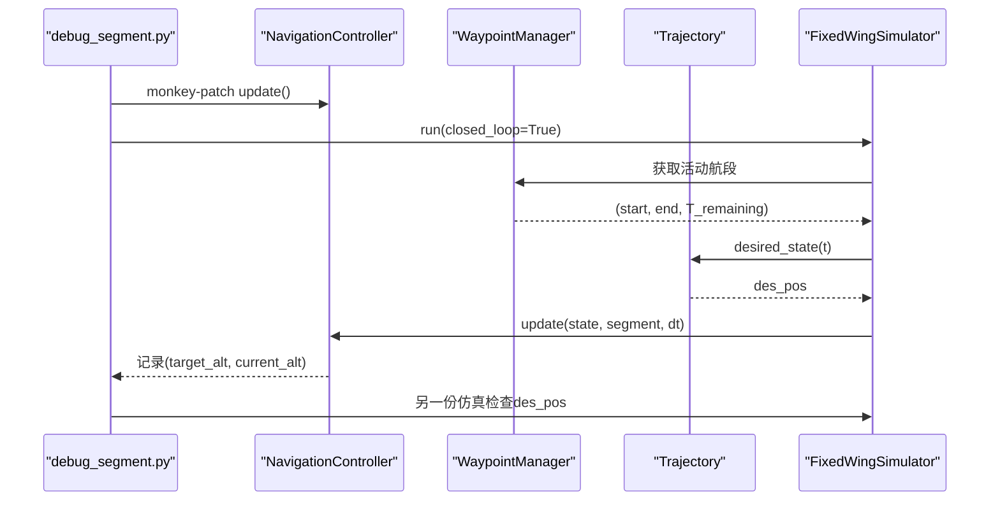
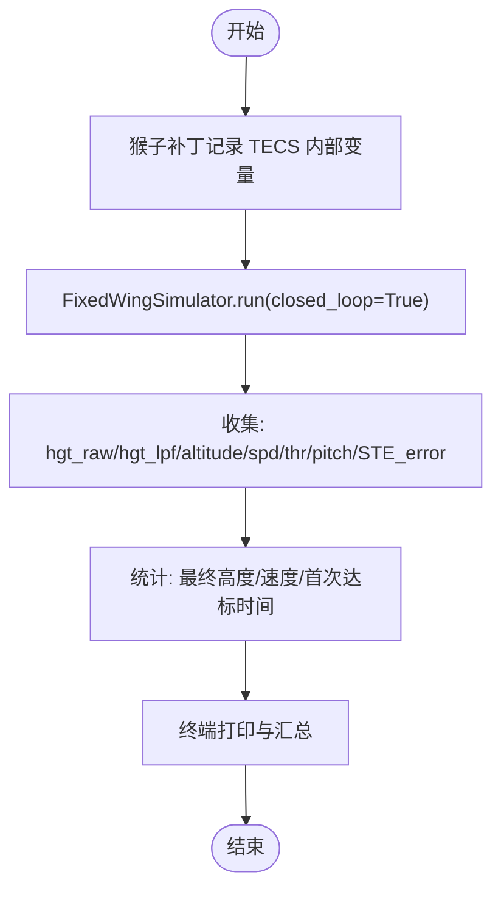
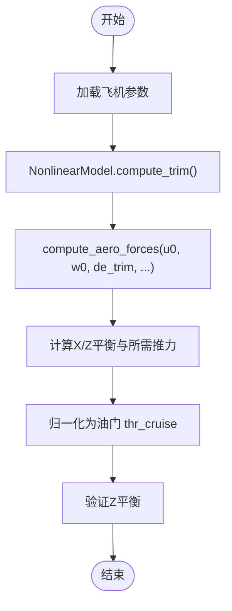
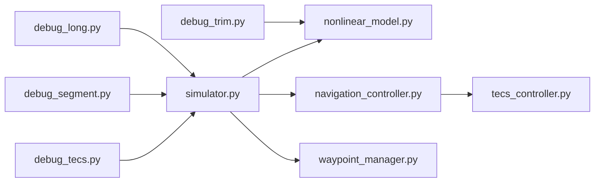

# 调试工具与方法

<cite>
**本文引用的文件**
- [debug_long.py](file://debug_long.py)
- [debug_segment.py](file://debug_segment.py)
- [debug_tecs.py](file://debug_tecs.py)
- [debug_trim.py](file://debug_trim.py)
- [tecs_controller.py](file://src/control/tecs_controller.py)
- [navigation_controller.py](file://src/control/navigation_controller.py)
- [simulator.py](file://src/simulation/simulator.py)
- [waypoint_manager.py](file://src/planning/waypoint_manager.py)
- [nonlinear_model.py](file://src/dynamics/nonlinear_model.py)
- [control_params.yaml](file://config/control_params.yaml)
- [logger.py](file://src/utils/logger.py)
- [plotter.py](file://src/visualization/plotter.py)
</cite>

## 目录
1. [简介](#简介)
2. [项目结构](#项目结构)
3. [核心组件](#核心组件)
4. [架构总览](#架构总览)
5. [详细组件分析](#详细组件分析)
6. [依赖关系分析](#依赖关系分析)
7. [性能考量](#性能考量)
8. [故障排查指南](#故障排查指南)
9. [结论](#结论)
10. [附录](#附录)

## 简介
本指南面向FixedWingSimulator项目的调试与验证需求，系统讲解四个专用调试脚本的用途、工作原理、参数配置与输出分析方法，并结合TECS控制器实现细节，给出日志记录、状态监控与性能分析的实践建议。读者可据此完成长时间收敛性测试、轨迹段调试、TECS控制调试与配平调试，从而进行算法验证与参数调优。

## 项目结构
调试脚本位于仓库根目录，分别对应不同调试场景：
- debug_long.py：长时间TECS收敛性测试
- debug_segment.py：轨迹段调试（检查segment.end传入值）
- debug_tecs.py：TECS控制调试（记录高度、速度、油门、俯仰、STE误差等）
- debug_trim.py：配平调试（计算巡航油门）

这些脚本通过猴子补丁（monkey-patch）或直接调用仿真器与控制器，采集关键变量并打印统计信息，便于快速定位问题与评估性能。

图表来源
- [debug_long.py](file://debug_long.py#L1-L55)
- [debug_segment.py](file://debug_segment.py#L1-L55)
- [debug_tecs.py](file://debug_tecs.py#L1-L67)
- [debug_trim.py](file://debug_trim.py#L1-L43)
- [simulator.py](file://src/simulation/simulator.py#L239-L567)
- [navigation_controller.py](file://src/control/navigation_controller.py#L134-L202)
- [tecs_controller.py](file://src/control/tecs_controller.py#L247-L315)
- [waypoint_manager.py](file://src/planning/waypoint_manager.py#L127-L167)
- [nonlinear_model.py](file://src/dynamics/nonlinear_model.py#L104-L154)

章节来源
- [debug_long.py](file://debug_long.py#L1-L55)
- [debug_segment.py](file://debug_segment.py#L1-L55)
- [debug_tecs.py](file://debug_tecs.py#L1-L67)
- [debug_trim.py](file://debug_trim.py#L1-L43)
- [simulator.py](file://src/simulation/simulator.py#L115-L128)

## 核心组件
- TECS控制器：实现总比能量与比能量分配比控制，负责高度与空速协同控制，具备欠速保护、不可达下沉检测与自适应缩放机制。
- 导航控制器：结合L1横向导航与TECS纵向控制，生成滚转、俯仰与油门指令。
- 固定翼仿真器：封装控制链路（模式管理、导航、姿态、速率、舵面混合），集成非线性动力学与环境模型，支持闭环运行与轨迹跟踪。
- 航路点管理器：构建轨迹对象，提供当前活动航段与期望状态查询。
- 非线性动力学模型：提供6-DOF方程与配平求解，支撑仿真与配平调试。

章节来源
- [tecs_controller.py](file://src/control/tecs_controller.py#L50-L196)
- [navigation_controller.py](file://src/control/navigation_controller.py#L45-L131)
- [simulator.py](file://src/simulation/simulator.py#L115-L237)
- [waypoint_manager.py](file://src/planning/waypoint_manager.py#L20-L80)
- [nonlinear_model.py](file://src/dynamics/nonlinear_model.py#L104-L154)

## 架构总览
调试脚本通过修改导航控制器的update函数，注入日志采集逻辑，或直接调用非线性模型与配平求解，从而在不改变主流程的前提下，获得关键中间变量与统计结果。

图表来源
- [debug_long.py](file://debug_long.py#L12-L25)
- [debug_tecs.py](file://debug_tecs.py#L12-L29)
- [debug_segment.py](file://debug_segment.py#L12-L20)
- [debug_trim.py](file://debug_trim.py#L2-L10)
- [simulator.py](file://src/simulation/simulator.py#L478-L500)
- [navigation_controller.py](file://src/control/navigation_controller.py#L134-L202)
- [tecs_controller.py](file://src/control/tecs_controller.py#L247-L315)
- [nonlinear_model.py](file://src/dynamics/nonlinear_model.py#L132-L154)

## 详细组件分析

### debug_long.py：长时间TECS收敛性测试
- 目标：评估长时间飞行下的TECS收敛稳定性与最终稳态指标（高度、速度、油门、俯仰）。
- 工作原理：
  - 通过猴子补丁替换导航控制器的update函数，在每次控制循环中记录高度、空速、油门与俯仰角。
  - 使用固定翼仿真器执行闭环仿真，航路点定义为从地面到目标高度的直线上升。
  - 仿真结束后对最后10秒数据进行均值、标准差与范围统计，辅助判断收敛性与抖动程度。
- 关键参数与配置：
  - 仿真器参数：飞机型号、步长、时长、初始模式、风类型。
  - 航路点：起止两点，目标高度为80米。
  - 日志字段：时间、高度、空速、油门、俯仰角。
- 输出分析要点：
  - 终端打印每若干步的时间戳与关键变量，便于观察趋势。
  - 统计“最终高度/速度”与“最后10秒”的均值、标准差、范围，识别超调、稳态误差与抖动。
- 使用建议：
  - 调整仿真时长与步长以平衡精度与耗时。
  - 结合控制参数（如TECS_TIME_CONST、TECS_THR_DAMP、TECS_PTCH_DAMP）逐步优化，观察最终稳态指标变化。

图表来源
- [debug_long.py](file://debug_long.py#L12-L33)
- [debug_long.py](file://debug_long.py#L35-L55)

章节来源
- [debug_long.py](file://debug_long.py#L1-L55)
- [simulator.py](file://src/simulation/simulator.py#L239-L567)
- [navigation_controller.py](file://src/control/navigation_controller.py#L134-L202)

### debug_segment.py：轨迹段调试
- 目标：诊断路径段终点（segment.end）传入值是否正确，以及期望位置在仿真前是否被正确夹持。
- 工作原理：
  - 猴子补丁记录每次update时的segment.end[2]（目标高度）与当前高度，形成(target_alt, current_alt)序列。
  - 同时构造另一份仿真，直接访问轨迹对象，打印航路点NED坐标与期望位置，验证轨迹生成与夹持逻辑。
- 关键参数与配置：
  - 仿真器参数：飞机型号、步长、时长、初始模式、风类型。
  - 航路点：起止两点，目标高度为80米。
  - 轨迹对象：WaypointManager构建的轨迹，提供desired_state(t)。
- 输出分析要点：
  - 观察target_alt与current_alt的匹配关系，确认是否存在过度超调或欠调。
  - 检查轨迹des_pos在clamp前后差异，确保目标高度不会越出航段边界。
- 使用建议：
  - 在复杂航路上增加更多航路点，观察segment切换与目标高度夹持效果。
  - 结合TECS高度需求低通时间常数（TECS_HDEM_TCONST）调整，改善段间过渡。

图表来源
- [debug_segment.py](file://debug_segment.py#L12-L28)
- [debug_segment.py](file://debug_segment.py#L38-L54)
- [simulator.py](file://src/simulation/simulator.py#L478-L497)
- [waypoint_manager.py](file://src/planning/waypoint_manager.py#L178-L201)

章节来源
- [debug_segment.py](file://debug_segment.py#L1-L55)
- [simulator.py](file://src/simulation/simulator.py#L478-L497)
- [waypoint_manager.py](file://src/planning/waypoint_manager.py#L178-L201)

### debug_tecs.py：TECS控制调试
- 目标：深入分析TECS的高度控制行为，包括原始高度需求、低通后高度需求、空速需求、油门与俯仰指令、以及STE误差。
- 工作原理：
  - 猴子补丁记录TECS内部关键变量：原始高度需求（hgt_raw）、低通后高度需求（hgt_lpf）、实际高度、空速、油门、俯仰、STE误差。
  - 仿真完成后，打印关键变量的时间序列与统计信息，定位超调、欠调、振荡与油门饱和等问题。
- 关键参数与配置：
  - 仿真器参数：飞机型号、步长、时长、初始模式、风类型。
  - 航路点：起止两点，目标高度为80米。
  - TECS参数：来自控制参数文件，包括最大爬升率、最小/最大下沉率、时间常数、阻尼、积分增益、速度权重、坡度补偿等。
- 输出分析要点：
  - 对比hgt_raw与hgt_lpf，确认低通滤波是否导致响应迟滞。
  - 观察STE误差与油门指令的关系，识别油门饱和与积分饱和风险。
  - 统计达到目标高度的时间（首次达到78m/80m），评估上升性能。
- 使用建议：
  - 逐步调整TECS_TIME_CONST、TECS_THR_DAMP、TECS_PTCH_DAMP、TECS_INTEG_GAIN，观察STE误差与油门波动的变化。
  - 结合速度权重（TECS_SPDWEIGHT）在高度优先与速度优先之间权衡。

图表来源
- [debug_tecs.py](file://debug_tecs.py#L12-L37)
- [debug_tecs.py](file://debug_tecs.py#L38-L67)
- [tecs_controller.py](file://src/control/tecs_controller.py#L175-L181)

章节来源
- [debug_tecs.py](file://debug_tecs.py#L1-L67)
- [tecs_controller.py](file://src/control/tecs_controller.py#L175-L181)
- [control_params.yaml](file://config/control_params.yaml#L30-L44)

### debug_trim.py：配平调试
- 目标：计算配平状态下的巡航油门，验证气动力与重力平衡，确保仿真初始条件合理。
- 工作原理：
  - 从数据库加载飞机参数，构建非线性模型并求解配平（水平、无侧滑）。
  - 计算气动力与重力在机体系下的投影，得到需要的推力以抵消阻力与重力X分量。
  - 将推力归一化为油门，同时验证Z方向平衡。
- 关键参数与配置：
  - 飞机参数：质量、参考面积、阻力系数等。
  - 配平条件：水平飞行、零侧滑角、稳定爬升/下降能力。
  - 推力上限：基于推重比（TWR=0.20）设定。
- 输出分析要点：
  - 查看配平空速、攻角与所需油门，评估是否与设计预期一致。
  - 检查X/Z方向平衡，确保无恒定的静力学扰动。
- 使用建议：
  - 在仿真器初始化阶段自动更新TECS巡航油门（thr_cruise），使其与配平一致。
  - 如发现油门过大或过小，调整气动参数或飞行包线限制。

图表来源
- [debug_trim.py](file://debug_trim.py#L2-L10)
- [debug_trim.py](file://debug_trim.py#L21-L42)
- [nonlinear_model.py](file://src/dynamics/nonlinear_model.py#L132-L154)

章节来源
- [debug_trim.py](file://debug_trim.py#L1-L43)
- [nonlinear_model.py](file://src/dynamics/nonlinear_model.py#L132-L154)

## 依赖关系分析
- 调试脚本与仿真器：通过导入src模块，直接调用FixedWingSimulator与相关控制器/管理器。
- 导航控制器与TECS：导航控制器持有TECS实例，update中调用TECS.update并返回控制目标。
- 航路点管理器与轨迹：WaypointManager构建轨迹对象，提供desired_state(t)，用于仿真中的目标状态插值。
- 非线性模型与配平：NonlinearModel提供compute_trim与state_dot，支撑配平调试与仿真。

图表来源
- [debug_long.py](file://debug_long.py#L1-L3)
- [debug_segment.py](file://debug_segment.py#L1-L3)
- [debug_tecs.py](file://debug_tecs.py#L1-L3)
- [debug_trim.py](file://debug_trim.py#L1-L2)
- [simulator.py](file://src/simulation/simulator.py#L33-L51)
- [navigation_controller.py](file://src/control/navigation_controller.py#L20-L22)
- [tecs_controller.py](file://src/control/tecs_controller.py#L27-L31)
- [waypoint_manager.py](file://src/planning/waypoint_manager.py#L15-L17)
- [nonlinear_model.py](file://src/dynamics/nonlinear_model.py#L27-L28)

章节来源
- [simulator.py](file://src/simulation/simulator.py#L33-L51)
- [navigation_controller.py](file://src/control/navigation_controller.py#L20-L22)
- [tecs_controller.py](file://src/control/teecs_controller.py#L27-L31)
- [waypoint_manager.py](file://src/planning/waypoint_manager.py#L15-L17)
- [nonlinear_model.py](file://src/dynamics/nonlinear_model.py#L27-L28)

## 性能考量
- 仿真步长与时长：较小步长提升精度但增加计算量；较长时长有助于观察长期收敛，但可能带来内存压力。
- TECS参数影响：
  - TECS_TIME_CONST增大可降低振荡但增加响应迟滞；过小可能导致高频噪声。
  - TECS_THR_DAMP与TECS_PTCH_DAMP增大可抑制油门/俯仰波动，但过度抑制会削弱调节能力。
  - TECS_INTEG_GAIN过大会引发积分饱和与超调，过小则稳态误差难以消除。
- 轨迹与航段切换：航段终点夹持与轨迹低通滤波会影响TECS接收的目标高度，应结合TECS_HDEM_TCONST进行权衡。
- 风场与密度：风场与空气密度随高度变化会影响气动力与配平，建议在仿真中启用真实风场模型进行验证。

## 故障排查指南
- TECS超调/欠调
  - 检查hgt_raw与hgt_lpf差异，确认低通滤波是否导致响应迟滞。
  - 调整TECS_TIME_CONST与TECS_SPDWEIGHT，平衡高度与速度控制权重。
- 油门饱和与积分饱和
  - 观察STE误差与油门指令，适当增大TECS_THR_DAMP或减小TECS_INTEG_GAIN。
  - 检查坡度补偿（TECS_RLL2THR）是否过大导致油门前馈过高。
- 欠速保护触发
  - 若频繁触发underspeed，检查空速包线（AIRSPEED_MIN/AIRSPEED_MAX）与TECS_SPDWEIGHT。
- 不可达下沉
  - 检查TECS_BAD_DESCENT标志，必要时降低最大爬升率或调整速度权重。
- 轨迹段切换异常
  - 检查segment.end与航段边界夹持，确认轨迹des_pos是否被正确clamp。
- 配平不稳
  - 对比计算的thr_cruise与仿真中自动更新的thr_cruise，确保两者一致。
  - 检查X/Z平衡，避免恒定静力学扰动。

章节来源
- [tecs_controller.py](file://src/control/tecs_controller.py#L432-L441)
- [tecs_controller.py](file://src/control/tecs_controller.py#L635-L646)
- [simulator.py](file://src/simulation/simulator.py#L275-L300)
- [control_params.yaml](file://config/control_params.yaml#L30-L44)

## 结论
四个调试脚本覆盖了从轨迹段、TECS控制到配平与长期收敛性的关键验证路径。通过猴子补丁与直接调用核心模块，调试脚本能够在不侵入主流程的前提下，高效采集中间变量与统计信息。配合TECS参数与航路点管理策略的迭代优化，可显著提升仿真精度与控制鲁棒性。

## 附录
- 日志记录与可视化
  - 可使用通用日志器记录调试过程中的关键事件与参数，便于复盘与对比。
  - 使用可视化模块绘制6-DOF历史曲线，辅助定位异常时段与控制输入突变。
- 参数调优建议
  - 采用“单变量+固定其他”的策略逐步调整TECS参数，观察STE误差、油门波动与高度响应。
  - 在复杂航路上验证轨迹段切换与目标高度夹持效果，确保过渡平滑。

章节来源
- [logger.py](file://src/utils/logger.py#L10-L43)
- [plotter.py](file://src/visualization/plotter.py#L161-L244)