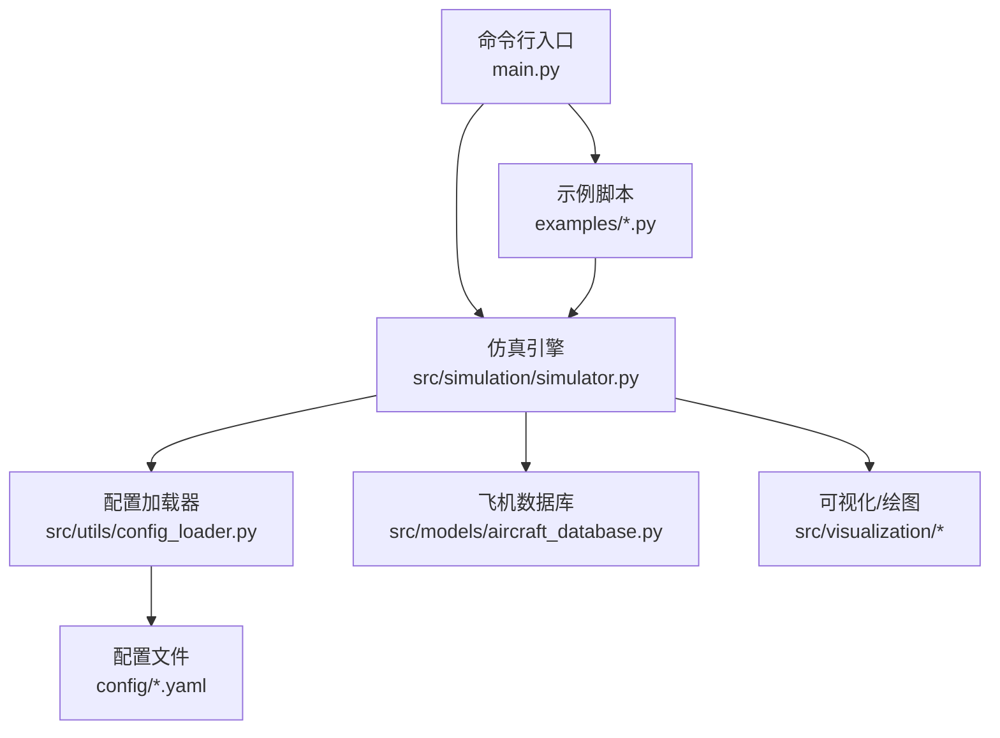
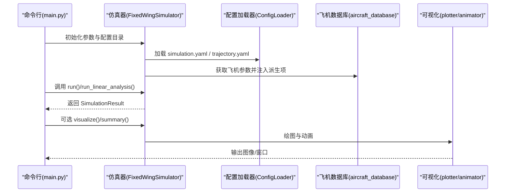
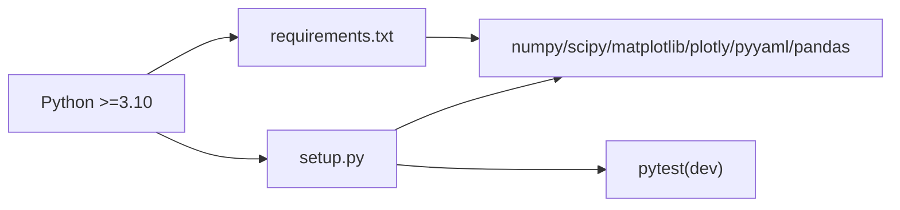
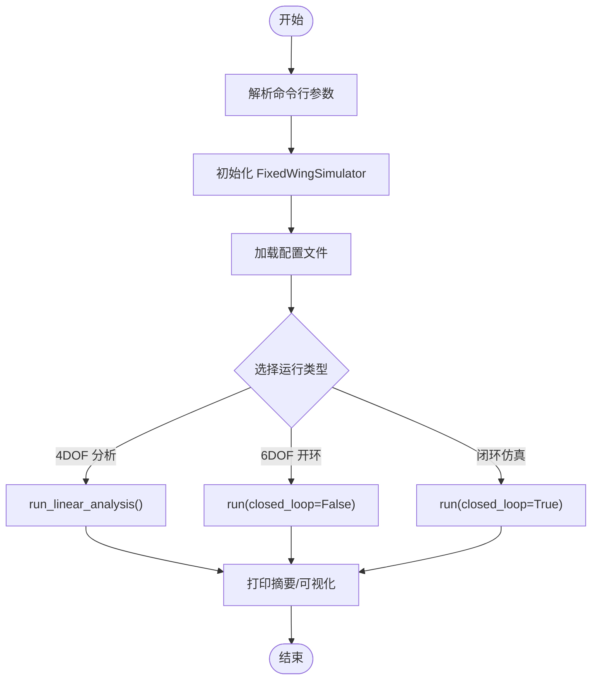

# 快速开始

<cite>
**本文引用的文件**
- [main.py](file://main.py)
- [requirements.txt](file://requirements.txt)
- [setup.py](file://setup.py)
- [config/simulation.yaml](file://config/simulation.yaml)
- [config/aircraft.yaml](file://config/aircraft.yaml)
- [config/control_params.yaml](file://config/control_params.yaml)
- [config/trajectory.yaml](file://config/trajectory.yaml)
- [src/simulation/simulator.py](file://src/simulation/simulator.py)
- [src/utils/config_loader.py](file://src/utils/config_loader.py)
- [src/models/aircraft_database.py](file://src/models/aircraft_database.py)
- [examples/example_1_linear_response.py](file://examples/example_1_linear_response.py)
- [examples/example_2_nonlinear_dynamics.py](file://examples/example_2_nonlinear_dynamics.py)
- [tests/test_integration.py](file://tests/test_integration.py)
- [debug_long.py](file://debug_long.py)
</cite>

## 目录
1. [简介](#简介)
2. [项目结构](#项目结构)
3. [核心组件](#核心组件)
4. [架构总览](#架构总览)
5. [详细组件分析](#详细组件分析)
6. [依赖关系分析](#依赖关系分析)
7. [性能注意事项](#性能注意事项)
8. [故障排除指南](#故障排除指南)
9. [结论](#结论)
10. [附录](#附录)

## 简介
本指南面向首次接触 FixedWingSimulator 的用户，帮助你在最短时间内完成环境准备、安装配置与第一次仿真运行。你将学会：
- 环境要求与安装步骤
- 关键配置文件的作用与修改方法
- 基本命令行参数与操作流程
- 运行第一个仿真案例（默认与自定义）
- 常见问题排查与优化建议

## 项目结构
项目采用模块化组织，核心入口为命令行脚本，仿真引擎位于 src 包中，配置文件集中在 config 目录，示例与输出分别在 examples 与 output 目录。

图表来源
- [main.py](file://main.py#L1-L145)
- [src/simulation/simulator.py](file://src/simulation/simulator.py#L1-L200)
- [src/utils/config_loader.py](file://src/utils/config_loader.py#L1-L82)
- [src/models/aircraft_database.py](file://src/models/aircraft_database.py#L1-L183)
- [config/simulation.yaml](file://config/simulation.yaml#L1-L30)
- [config/aircraft.yaml](file://config/aircraft.yaml#L1-L13)
- [config/control_params.yaml](file://config/control_params.yaml#L1-L45)
- [config/trajectory.yaml](file://config/trajectory.yaml#L1-L23)

章节来源
- [main.py](file://main.py#L1-L145)
- [config/simulation.yaml](file://config/simulation.yaml#L1-L30)
- [config/aircraft.yaml](file://config/aircraft.yaml#L1-L13)
- [config/control_params.yaml](file://config/control_params.yaml#L1-L45)
- [config/trajectory.yaml](file://config/trajectory.yaml#L1-L23)

## 核心组件
- 命令行入口：解析参数、初始化仿真器、执行仿真并输出结果或可视化。
- 仿真引擎：封装控制链路、动力学模型、环境风场、轨迹规划与状态历史记录。
- 配置系统：统一加载与合并 YAML 配置，支持默认值与覆盖。
- 飞机数据库：内置多型飞机参数，提供派生参数与校验。
- 示例与测试：演示线性/非线性分析、轨迹跟踪、稳定性验证等场景。

章节来源
- [main.py](file://main.py#L32-L95)
- [src/simulation/simulator.py](file://src/simulation/simulator.py#L115-L200)
- [src/utils/config_loader.py](file://src/utils/config_loader.py#L59-L82)
- [src/models/aircraft_database.py](file://src/models/aircraft_database.py#L139-L183)

## 架构总览
下图展示了从命令行到仿真执行的关键交互路径，以及配置加载与可视化模块的集成方式。

图表来源
- [main.py](file://main.py#L98-L141)
- [src/simulation/simulator.py](file://src/simulation/simulator.py#L130-L200)
- [src/utils/config_loader.py](file://src/utils/config_loader.py#L68-L81)
- [src/models/aircraft_database.py](file://src/models/aircraft_database.py#L143-L166)

## 详细组件分析

### 命令行入口与参数
- 支持的参数包括：飞机型号、初始飞行模式、仿真时长、步长、风模型、轨迹类型、是否禁用可视化、列出可用飞机、配置目录等。
- 默认行为：TB2，AUTO 模式，30 秒，最小 snap 轨迹，无风。
- 常用示例：
  - 列出可用飞机
  - TB2 默认运行
  - Predator 在 FBW_B 模式下带风运行
  - 线性 4-DOF 分析
  - 6-DOF 开环分析

章节来源
- [main.py](file://main.py#L32-L95)
- [main.py](file://main.py#L98-L141)

### 仿真引擎与控制链路
- 固定翼仿真器负责：
  - 读取配置、构建风场与大气密度
  - 初始化飞行模式管理器与导航控制器
  - 调用 6-DOF 非线性动力学求解器
  - 记录状态历史并生成结果摘要与可视化
- 控制链路采用 ArduPilot 兼容参数，包含导航、姿态、速率与舵混合等层级。

章节来源
- [src/simulation/simulator.py](file://src/simulation/simulator.py#L115-L200)
- [src/simulation/simulator.py](file://src/simulation/simulator.py#L190-L220)

### 配置系统
- ConfigLoader 合并默认配置与 YAML 文件，支持 aircraft、simulation、trajectory 三类配置。
- 默认值覆盖顺序：内置默认 → 用户 YAML → 运行时参数（如 wind_type）。

章节来源
- [src/utils/config_loader.py](file://src/utils/config_loader.py#L10-L37)
- [src/utils/config_loader.py](file://src/utils/config_loader.py#L68-L81)
- [config/simulation.yaml](file://config/simulation.yaml#L1-L30)
- [config/trajectory.yaml](file://config/trajectory.yaml#L1-L23)
- [config/aircraft.yaml](file://config/aircraft.yaml#L1-L13)

### 飞机数据库
- 内置 7 型飞机参数，自动注入派生项（如静压密度、动压等）。
- 提供查询、列表与信息格式化函数。

章节来源
- [src/models/aircraft_database.py](file://src/models/aircraft_database.py#L29-L133)
- [src/models/aircraft_database.py](file://src/models/aircraft_database.py#L143-L183)

### 示例与输出
- 示例脚本演示线性/非线性分析、轨迹跟踪与稳态保持等场景，并保存 CSV 数据与 PNG 图像。
- 输出目录 output 下包含 data 与 figures 子目录。

章节来源
- [examples/example_1_linear_response.py](file://examples/example_1_linear_response.py#L1-L206)
- [examples/example_2_nonlinear_dynamics.py](file://examples/example_2_nonlinear_dynamics.py#L1-L215)

## 依赖关系分析
- Python 版本要求：>=3.10
- 主要依赖：numpy、scipy、matplotlib、plotly、pyyaml、pandas；开发依赖 pytest
- setup.py 中对依赖版本有更严格的要求（如 scipy、matplotlib、pandas）

图表来源
- [requirements.txt](file://requirements.txt#L1-L8)
- [setup.py](file://setup.py#L10-L22)

章节来源
- [requirements.txt](file://requirements.txt#L1-L8)
- [setup.py](file://setup.py#L10-L22)

## 性能注意事项
- 时间步长 dt 与仿真时长 duration 影响计算耗时与精度，建议根据任务需求调整。
- 可视化在批量运行时可关闭以提升性能。
- 风模型与轨迹类型会影响仿真复杂度，建议先用默认配置验证后逐步调整。

## 故障排除指南
- Python 版本过低
  - 现象：安装时报错或运行报错
  - 处理：升级 Python 至 3.10 或以上
  - 参考：[setup.py](file://setup.py#L10)
- 缺少依赖包
  - 现象：导入失败或运行时报错
  - 处理：使用 requirements.txt 安装依赖
  - 参考：[requirements.txt](file://requirements.txt#L1-L8)
- 风格/后端问题导致无法显示图形
  - 现象：无窗口或报图形后端错误
  - 处理：示例脚本已设置非交互后端；若需实时窗口，请按示例脚本方式设置
  - 参考：[examples/example_1_linear_response.py](file://examples/example_1_linear_response.py#L25-L28)
- 配置文件缺失或路径错误
  - 现象：配置未生效或加载失败
  - 处理：确认 config 目录存在且包含所需 YAML 文件；可通过 --config-dir 指定
  - 参考：[main.py](file://main.py#L90-L94)，[src/utils/config_loader.py](file://src/utils/config_loader.py#L62-L66)
- 飞机名称不正确
  - 现象：初始化时报未知飞机
  - 处理：使用 --list-aircraft 查看可用机型，或检查拼写
  - 参考：[main.py](file://main.py#L101-L105)，[src/models/aircraft_database.py](file://src/models/aircraft_database.py#L139-L141)
- 可视化不可用
  - 现象：调用 visualize() 时提示不可用
  - 处理：检查 matplotlib、plotly 是否安装；或使用 --no-plot 禁用可视化
  - 参考：[src/simulation/simulator.py](file://src/simulation/simulator.py#L92-L101)
- 数值不稳定或发散
  - 现象：仿真过程中出现 NaN/Inf 或状态异常
  - 处理：检查 dt、wind、轨迹与初始条件；参考集成测试中的稳定性断言
  - 参考：[tests/test_integration.py](file://tests/test_integration.py#L41-L58)

## 结论
通过本指南，你已经完成了环境准备、安装配置与首次仿真运行。建议继续探索示例脚本与配置文件，逐步掌握不同飞行模式、风场与轨迹类型的组合效果，并结合调试脚本深入理解控制参数与 TECS 收敛特性。

## 附录

### 环境要求与安装步骤
- 环境要求
  - Python 版本：>=3.10
  - 主要依赖：numpy、scipy、matplotlib、plotly、pyyaml、pandas
  - 开发依赖（可选）：pytest
- 安装步骤
  - 使用 pip 安装依赖：pip install -r requirements.txt
  - 如需开发功能，可额外安装 pytest
- 验证安装
  - 运行默认仿真：python main.py
  - 查看可用飞机：python main.py --list-aircraft

章节来源
- [setup.py](file://setup.py#L10-L22)
- [requirements.txt](file://requirements.txt#L1-L8)
- [main.py](file://main.py#L17-L19)
- [main.py](file://main.py#L101-L105)

### 基本使用示例
- 默认运行（TB2，AUTO，30 秒）
  - 命令：python main.py
- 自定义飞机与模式（Predator，FBW_B，60 秒，带风）
  - 命令：python main.py --aircraft Predator --mode FBW_B --duration 60 --wind SINE
- 线性 4-DOF 分析（TB2）
  - 命令：python main.py --aircraft TB2 --analysis 4dof
- 6-DOF 开环分析（TB2）
  - 命令：python main.py --aircraft TB2 --analysis 6dof
- 禁用可视化（批处理）
  - 命令：python main.py --no-plot

章节来源
- [main.py](file://main.py#L6-L18)
- [main.py](file://main.py#L124-L140)

### 命令行参数详解
- --aircraft：选择飞机型号（默认 TB2）
- --mode：初始飞行模式（默认 AUTO）
- --duration：仿真时长（秒，默认 30）
- --dt：仿真步长（秒，默认 0.01）
- --wind：风模型类型（NONE/FIXED/SINE/RANDOMSINE，默认 NONE）
- --traj：轨迹类型（默认 minimum_snap）
- --analysis：分析模式（4dof/6dof）
- --no-plot：禁用可视化
- --list-aircraft：列出可用飞机
- --config-dir：配置目录路径（默认 ./config）

章节来源
- [main.py](file://main.py#L38-L95)

### 配置文件说明
- simulation.yaml：仿真时间步长、时长、积分器、初始条件、初始模式、风配置与日志开关
- aircraft.yaml：选择飞机与参数覆盖
- control_params.yaml：控制参数（含 TECS 参数）
- trajectory.yaml：轨迹类型、平均速度、偏航模式、航路点与循环

章节来源
- [config/simulation.yaml](file://config/simulation.yaml#L1-L30)
- [config/aircraft.yaml](file://config/aircraft.yaml#L1-L13)
- [config/control_params.yaml](file://config/control_params.yaml#L1-L45)
- [config/trajectory.yaml](file://config/trajectory.yaml#L1-L23)

### 第一次运行流程图

图表来源
- [main.py](file://main.py#L98-L141)
- [src/simulation/simulator.py](file://src/simulation/simulator.py#L130-L200)

### 调试与扩展
- 长时跟踪调试：使用 debug_long.py 观察 TECS 输出与收敛情况
- 单步 API：参考测试用例中的 step() 接口，便于外部 UI 集成

章节来源
- [debug_long.py](file://debug_long.py#L1-L55)
- [tests/test_integration.py](file://tests/test_integration.py#L267-L343)