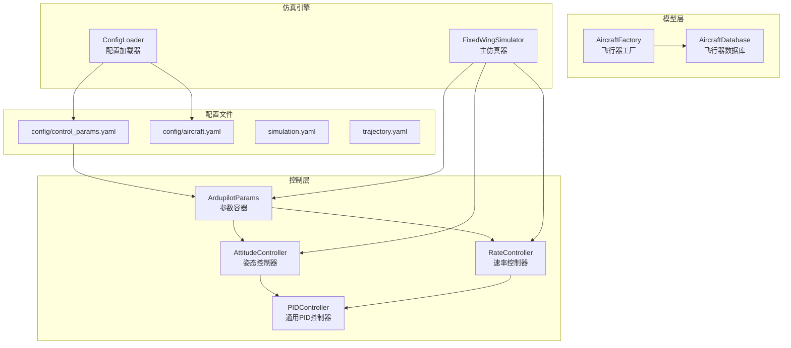
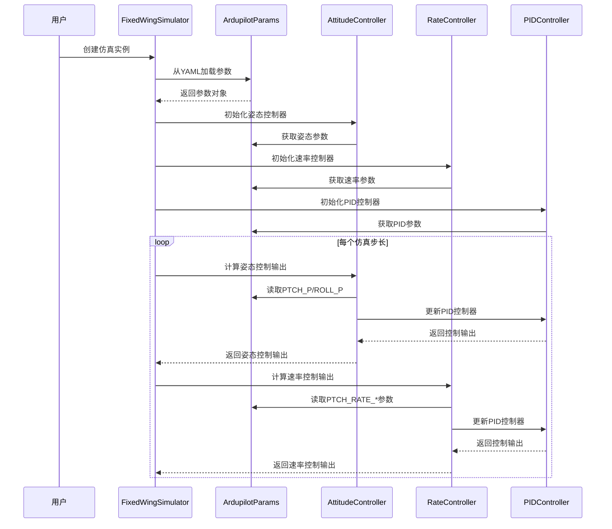
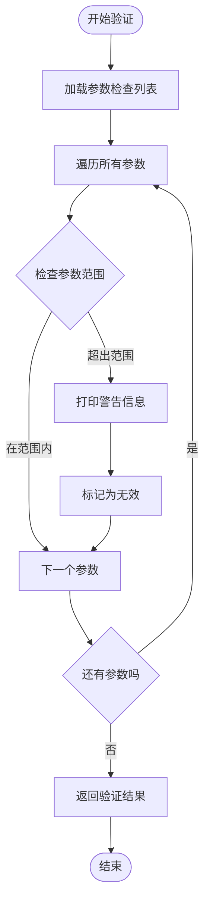
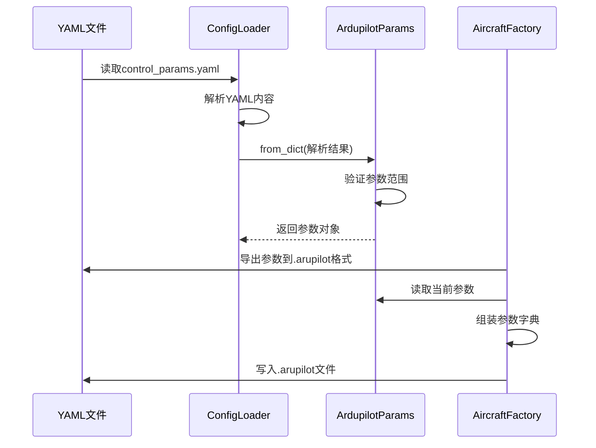
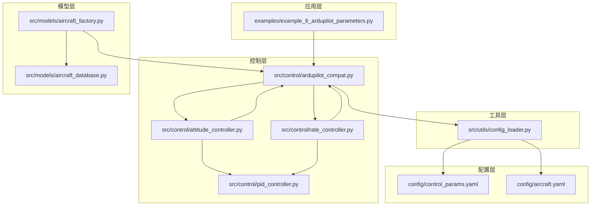

# ArduPilot兼容参数

<cite>
**本文档引用的文件**
- [src/control/ardupilot_compat.py](file://src/control/ardupilot_compat.py)
- [examples/example_6_ardupilot_parameters.py](file://examples/example_6_ardupilot_parameters.py)
- [config/control_params.yaml](file://config/control_params.yaml)
- [src/simulation/simulator.py](file://src/simulation/simulator.py)
- [src/control/attitude_controller.py](file://src/control/attitude_controller.py)
- [src/control/rate_controller.py](file://src/control/rate_controller.py)
- [src/control/pid_controller.py](file://src/control/pid_controller.py)
- [src/models/aircraft_factory.py](file://src/models/aircraft_factory.py)
- [src/utils/config_loader.py](file://src/utils/config_loader.py)
- [config/aircraft.yaml](file://config/aircraft.yaml)
- [src/models/aircraft_database.py](file://src/models/aircraft_database.py)
</cite>

## 目录
1. [简介](#简介)
2. [项目结构](#项目结构)
3. [核心组件](#核心组件)
4. [架构概览](#架构概览)
5. [详细组件分析](#详细组件分析)
6. [依赖关系分析](#依赖关系分析)
7. [性能考虑](#性能考虑)
8. [故障排除指南](#故障排除指南)
9. [结论](#结论)
10. [附录](#附录)

## 简介

ArduPilot兼容参数系统是FixedWingSimulator项目中的关键组件，旨在提供与ArduPilot飞行控制软件完全兼容的参数管理功能。该系统通过ArdupilotParams数据类实现了标准的ArduPilot参数命名约定，支持从YAML文件加载和保存参数，提供参数验证机制，并集成了完整的安全限制设置。

本系统特别针对固定翼无人机（如TB2级无人机）进行了优化，提供了保守的默认参数值，确保在各种飞行条件下的稳定性和安全性。系统支持热重载功能，允许在仿真运行过程中动态调整控制器参数，这对于实时控制系统调试和优化至关重要。

## 项目结构

ArduPilot兼容参数系统位于项目的控制层中，与仿真引擎、飞行器模型和其他控制组件紧密集成。整体项目结构如下：

**图表来源**
- [src/control/ardupilot_compat.py](file://src/control/ardupilot_compat.py#L17-L130)
- [src/simulation/simulator.py](file://src/simulation/simulator.py#L115-L247)
- [src/models/aircraft_factory.py](file://src/models/aircraft_factory.py#L39-L136)

**章节来源**
- [src/control/ardupilot_compat.py](file://src/control/ardupilot_compat.py#L1-L130)
- [src/simulation/simulator.py](file://src/simulation/simulator.py#L1-L200)
- [src/utils/config_loader.py](file://src/utils/config_loader.py#L1-L82)

## 核心组件

### ArdupilotParams数据类

ArdupilotParams是整个参数系统的核心，它是一个基于Python数据类的数据容器，完全遵循ArduPilot的参数命名约定。该类设计的核心理念是提供类型安全、易于使用的参数管理接口，同时保持与ArduPilot生态系统的兼容性。

#### 主要设计理念

1. **ArduPilot兼容性**: 所有字段名称都严格匹配ArduPilot Plane的参数命名规范
2. **层次化组织**: 参数按照功能域进行逻辑分组（俯仰轴、滚转轴、偏航轴、限制条件等）
3. **类型安全**: 使用Python类型注解确保参数类型的正确性
4. **序列化支持**: 内置YAML导入导出功能
5. **验证机制**: 提供基本的参数范围检查功能

#### 字段分类详解

**俯仰轴控制参数 (PTCH_*)**
- PTCH_P: 外环姿态控制比例增益
- PTCH_RATE_P: 内环速率控制比例增益  
- PTCH_RATE_I: 内环速率控制积分增益
- PTCH_RATE_D: 内环速率控制微分增益
- PTCH_RATE_FF: 内环速率控制前馈增益

**滚转轴控制参数 (ROLL_*)**
- ROLL_P: 外环姿态控制比例增益
- ROLL_RATE_P: 内环速率控制比例增益
- ROLL_RATE_I: 内环速率控制积分增益
- ROLL_RATE_D: 内环速率控制微分增益
- ROLL_RATE_FF: 内环速率控制前馈增益

**偏航轴控制参数 (YAW_*)**
- YAW_RATE_P: 偏航速率控制比例增益
- YAW_RATE_I: 偏航速率控制积分增益
- YAW_RATE_D: 偏航速率控制微分增益
- YAW_RATE_FF: 偏航速率控制前馈增益

**限制条件参数**
- LIM_PITCH_MAX: 最大俯仰角度（度）
- LIM_PITCH_MIN: 最小俯仰角度（度）
- LIM_ROLL_CD: 最大滚转角度（百分之一度）
- THR_MAX: 最大油门
- THR_MIN: 最小油门

**导航参数**
- NAVL1_PERIOD: L1导航参数周期
- NAVL1_DAMPING: L1导航阻尼系数

**速度和高度参数**
- AIRSPEED_CRUISE: 巡航空速（m/s）
- ALT_HOLD_RTL: 返回起飞点高度（m）

**章节来源**
- [src/control/ardupilot_compat.py](file://src/control/ardupilot_compat.py#L17-L60)

## 架构概览

ArduPilot兼容参数系统在整个仿真框架中扮演着关键角色，作为连接上层控制算法和底层物理模拟的桥梁。系统采用分层架构设计，确保各组件之间的松耦合和高内聚。

**图表来源**
- [src/simulation/simulator.py](file://src/simulation/simulator.py#L165-L216)
- [src/control/attitude_controller.py](file://src/control/attitude_controller.py#L50-L127)
- [src/control/rate_controller.py](file://src/control/rate_controller.py#L46-L103)

## 详细组件分析

### 参数验证机制

ArdupilotParams类内置了完整的参数验证功能，通过`validate()`方法实现基本的范围检查。该机制确保所有输入参数都在合理的物理范围内，防止由于参数设置不当导致的系统不稳定或危险情况。

#### 验证规则设计

验证系统采用静态范围检查策略，为每个参数定义了合理的上下限。这些范围基于以下考虑：

1. **安全性优先**: 所有范围都留有安全余量，避免极端值
2. **物理合理性**: 范围设置符合固定翼飞机的典型飞行特性
3. **ArduPilot兼容性**: 与ArduPilot的参数范围保持一致
4. **系统稳定性**: 防止参数组合导致控制系统发散

#### 验证流程

**图表来源**
- [src/control/ardupilot_compat.py](file://src/control/ardupilot_compat.py#L104-L130)

#### 安全限制设置

系统实现了多层次的安全限制，确保飞行器在任何情况下都不会超出其物理极限：

1. **角度限制**: 俯仰角限制在±45度范围内，滚转角限制在±90度范围内
2. **油门限制**: 油门输出范围严格限制在0-1之间
3. **速度限制**: 巡航速度范围根据飞机性能合理设定
4. **控制增益限制**: PID增益参数设置在稳定且有效的范围内

**章节来源**
- [src/control/ardupilot_compat.py](file://src/control/ardupilot_compat.py#L104-L130)

### YAML文件加载和保存机制

系统提供了完整的YAML文件处理功能，支持从外部配置文件加载参数和将当前参数状态保存到文件。

#### 加载机制

```mermaid
classDiagram
class ArdupilotParams {
+from_yaml(path) ArdupilotParams
+from_dict(d) ArdupilotParams
+to_yaml(path) void
+to_dict() Dict
+validate() bool
}
class ConfigLoader {
+load_control() Dict
+load_aircraft() Dict
+load_simulation() Dict
+load_trajectory() Dict
}
class AircraftFactory {
+create(name, yaml_overrides, param_overrides) AircraftConfig
+from_yaml(config_path) AircraftConfig
+export_ardupilot_params(name, output_path, control_yaml) void
}
ArdupilotParams --> ConfigLoader : "使用"
AircraftFactory --> ArdupilotParams : "导出"
ConfigLoader --> ArdupilotParams : "加载"
```

**图表来源**
- [src/control/ardupilot_compat.py](file://src/control/ardupilot_compat.py#L74-L98)
- [src/utils/config_loader.py](file://src/utils/config_loader.py#L59-L82)
- [src/models/aircraft_factory.py](file://src/models/aircraft_factory.py#L95-L135)

#### 序列化流程

**图表来源**
- [src/utils/config_loader.py](file://src/utils/config_loader.py#L72-L73)
- [src/control/ardupilot_compat.py](file://src/control/ardupilot_compat.py#L74-L98)
- [src/models/aircraft_factory.py](file://src/models/aircraft_factory.py#L95-L135)

**章节来源**
- [src/control/ardupilot_compat.py](file://src/control/ardupilot_compat.py#L74-L98)
- [src/utils/config_loader.py](file://src/utils/config_loader.py#L40-L82)
- [src/models/aircraft_factory.py](file://src/models/aircraft_factory.py#L95-L135)

### 控制器集成

ArdupilotParams与各个控制层紧密集成，为不同层级的控制器提供必要的参数配置。

#### 姿态控制器集成

姿态控制器直接使用ArdupilotParams中的PTCH_P和ROLL_P参数，实现外环姿态控制。该控制器采用纯比例控制策略，避免积分项可能导致的极限环振荡问题。

#### 速率控制器集成

速率控制器使用完整的速率控制参数集，包括比例、积分、微分和前馈项。这种设计与ArduPilot的内环控制结构完全一致。

**章节来源**
- [src/control/attitude_controller.py](file://src/control/attitude_controller.py#L33-L134)
- [src/control/rate_controller.py](file://src/control/rate_controller.py#L32-L109)

## 依赖关系分析

ArduPilot兼容参数系统与其他组件之间的依赖关系体现了清晰的分层架构设计。

**图表来源**
- [examples/example_6_ardupilot_parameters.py](file://examples/example_6_ardupilot_parameters.py#L20-L21)
- [src/control/ardupilot_compat.py](file://src/control/ardupilot_compat.py#L1-L130)
- [src/simulation/simulator.py](file://src/simulation/simulator.py#L165-L216)

### 关键依赖关系

1. **参数到控制器的依赖**: 所有控制器都依赖ArdupilotParams提供的参数配置
2. **配置加载器的依赖**: 参数系统依赖配置加载器进行文件操作
3. **工厂模式的依赖**: 飞行器工厂依赖参数系统进行参数导出
4. **示例程序的依赖**: 示例程序演示参数系统的完整使用流程

**章节来源**
- [src/simulation/simulator.py](file://src/simulation/simulator.py#L165-L216)
- [src/models/aircraft_factory.py](file://src/models/aircraft_factory.py#L95-L135)

## 性能考虑

ArduPilot兼容参数系统在设计时充分考虑了性能优化，采用了多种策略确保系统的高效运行。

### 内存管理优化

1. **数据类优化**: 使用Python数据类而非传统类定义，减少内存开销
2. **懒加载机制**: 参数仅在需要时才进行验证和处理
3. **缓存策略**: 常用参数值在控制器内部进行缓存

### 计算效率优化

1. **向量化操作**: 在可能的情况下使用NumPy数组操作
2. **避免重复计算**: 参数验证结果在首次验证后可被复用
3. **最小化I/O操作**: 文件读写操作集中在初始化阶段

### 实时性能保证

1. **非阻塞操作**: 参数加载和验证不会阻塞主仿真循环
2. **增量更新**: 支持参数的热重载而无需重启整个系统
3. **错误快速检测**: 参数验证采用快速失败策略

## 故障排除指南

### 常见参数问题

#### 参数范围错误
当参数超出预定义范围时，系统会打印警告信息但不会阻止程序运行。用户应根据警告信息调整参数值。

#### 文件加载失败
如果YAML文件不存在或格式不正确，系统会抛出相应的异常。检查文件路径和语法格式。

#### 控制器不稳定
如果系统出现振荡或其他不稳定现象，检查PID增益参数是否过大，特别是积分项。

### 调试技巧

1. **逐步验证**: 逐个启用参数验证检查，精确定位问题参数
2. **日志记录**: 利用系统日志功能跟踪参数变化
3. **可视化监控**: 使用仿真结果可视化功能观察控制效果

**章节来源**
- [src/control/ardupilot_compat.py](file://src/control/ardupilot_compat.py#L104-L130)
- [examples/example_6_ardupilot_parameters.py](file://examples/example_6_ardupilot_parameters.py#L36-L38)

## 结论

ArduPilot兼容参数系统为FixedWingSimulator项目提供了强大而灵活的参数管理能力。通过完全兼容ArduPilot的参数命名约定和控制结构，该系统不仅简化了开发流程，还确保了与现有ArduPilot生态系统的无缝集成。

系统的主要优势包括：

1. **完全兼容性**: 与ArduPilot参数体系完全一致
2. **安全性保障**: 内置参数验证和安全限制机制
3. **灵活性**: 支持热重载和动态参数调整
4. **易用性**: 提供简洁的API和完整的文档
5. **扩展性**: 设计支持未来功能的扩展

该系统为固定翼无人机的仿真和控制提供了一个坚实的基础，既满足了学术研究的需求，也为实际应用提供了可靠的支撑。

## 附录

### 参数调优指南

#### 俯仰轴调优步骤
1. **初始设置**: 从保守的PTCH_P值开始，逐步增加
2. **稳定性测试**: 观察阶跃响应的超调量和调节时间
3. **阻尼调整**: 适当增加PTCH_RATE_D改善阻尼特性
4. **积分项**: 在需要消除稳态误差时谨慎添加PTCH_RATE_I

#### 滚转轴调优步骤
1. **姿态控制**: 首先调整ROLL_P确保姿态跟随性能
2. **速率控制**: 通过ROLL_RATE_P和ROLL_RATE_I改善瞬态响应
3. **稳定性**: 注意ROLL_RATE_D对系统稳定性的影响
4. **前馈补偿**: 合理设置ROLL_RATE_FF提高抗扰能力

#### 偏航轴调优步骤
1. **稳定性优先**: 偏航控制通常不需要复杂的外环
2. **阻尼设置**: 适当增加YAW_RATE_P改善方向稳定性
3. **避免过度控制**: 偏航控制增益不宜过大

### 最佳实践建议

1. **渐进式调优**: 按照"姿态→速率→稳定性"的顺序进行调优
2. **安全第一**: 始终保持参数在安全范围内
3. **记录变更**: 详细记录每次参数调整的结果
4. **交叉验证**: 在不同飞行条件下测试参数性能
5. **备份配置**: 定期备份重要的参数配置

### 错误处理机制

系统实现了多层次的错误处理机制：

1. **参数验证**: 自动检查参数范围和合理性
2. **文件操作**: 处理文件不存在和格式错误
3. **运行时错误**: 捕获和报告控制器计算错误
4. **用户反馈**: 提供清晰的错误信息和解决方案

**章节来源**
- [src/control/ardupilot_compat.py](file://src/control/ardupilot_compat.py#L104-L130)
- [examples/example_6_ardupilot_parameters.py](file://examples/example_6_ardupilot_parameters.py#L47-L69)