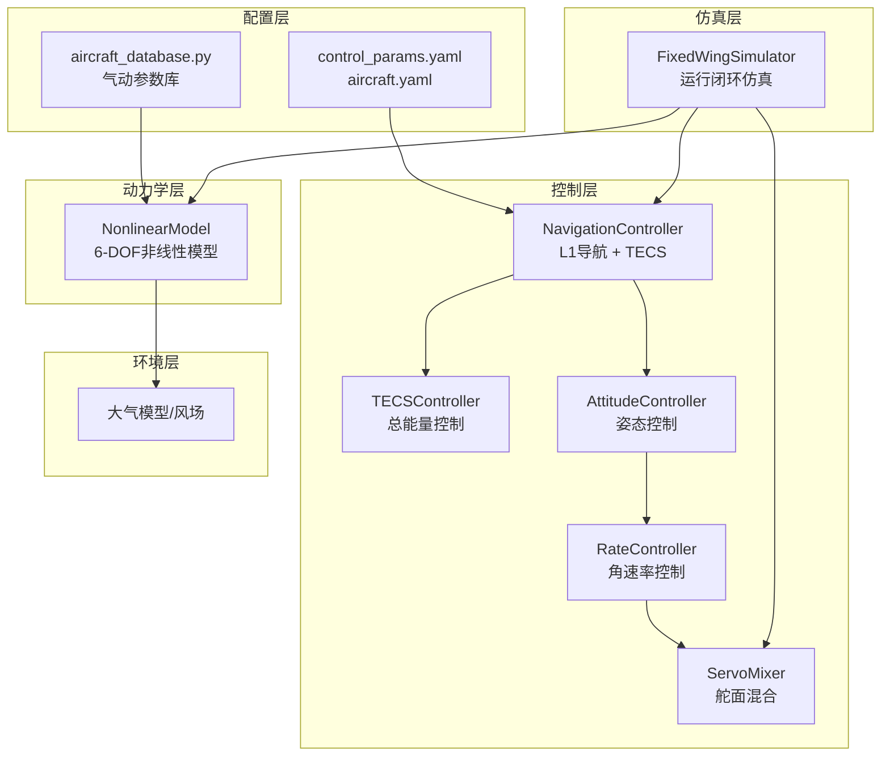
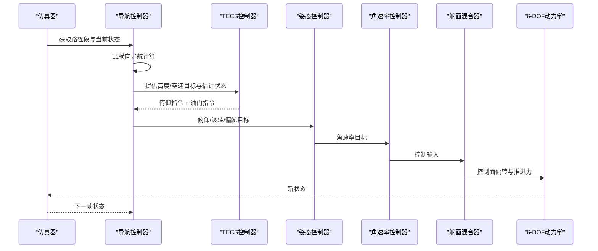
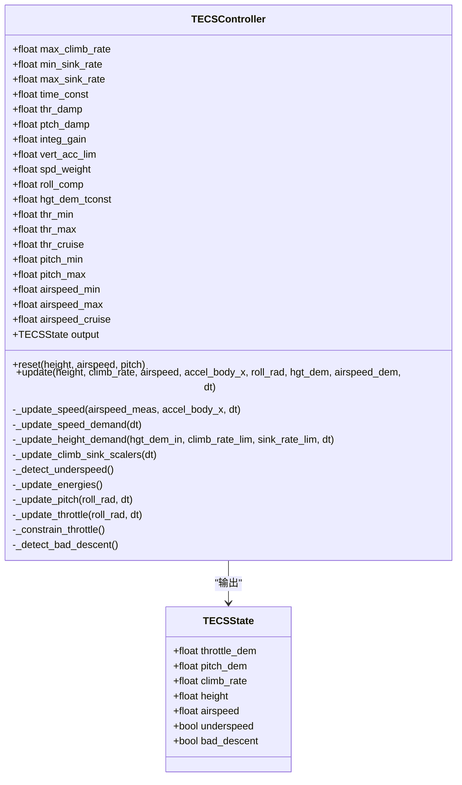
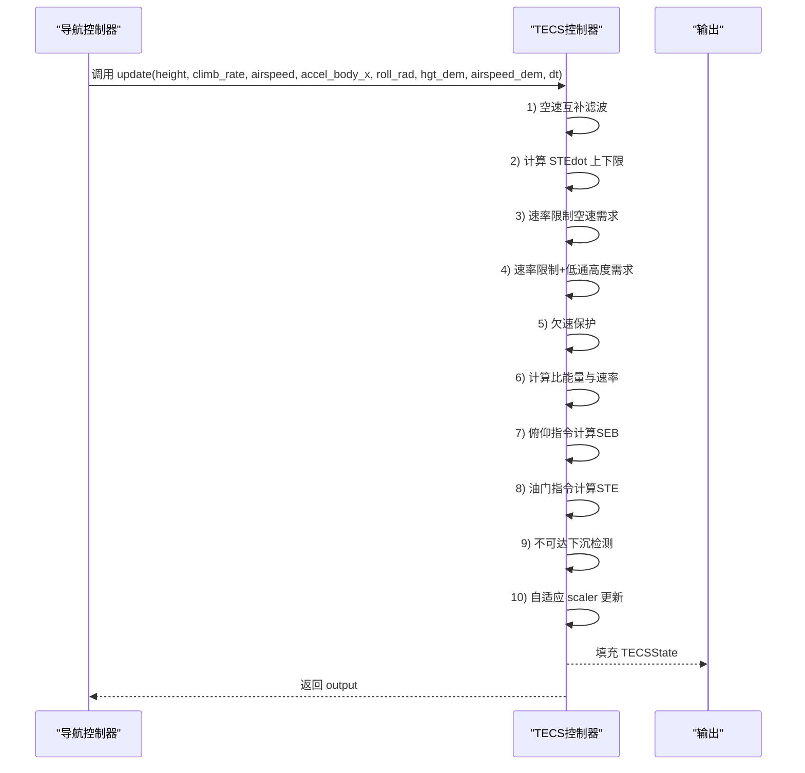
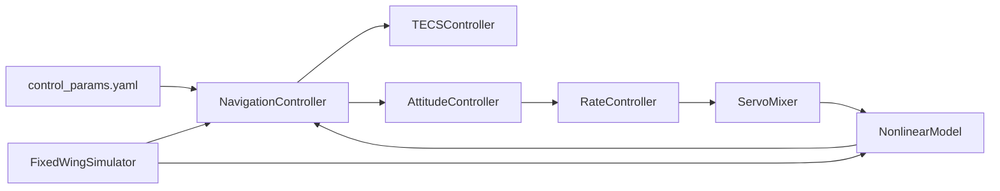

# TECS总能量控制器

<cite>
**本文档引用的文件**
- [tecs_controller.py](file://src/control/tecs_controller.py)
- [navigation_controller.py](file://src/control/navigation_controller.py)
- [simulator.py](file://src/simulation/simulator.py)
- [control_params.yaml](file://config/control_params.yaml)
- [aircraft.yaml](file://config/aircraft.yaml)
- [aircraft_database.py](file://src/models/aircraft_database.py)
- [debug_tecs.py](file://debug_tecs.py)
- [example_1_linear_response.py](file://examples/example_1_linear_response.py)
- [example_3_trajectory_tracking.py](file://examples/example_3_trajectory_tracking.py)
</cite>

## 目录
1. [引言](#引言)
2. [项目结构](#项目结构)
3. [核心组件](#核心组件)
4. [架构概览](#架构概览)
5. [详细组件分析](#详细组件分析)
6. [依赖关系分析](#依赖关系分析)
7. [性能考虑](#性能考虑)
8. [故障排查指南](#故障排查指南)
9. [结论](#结论)
10. [附录](#附录)

## 引言
本文件面向TECS（总能量控制）系统，提供从理论基础到工程实现的完整技术文档。内容涵盖：
- 总能量控制的理论基础与数学模型
- 高度与空速的联合控制策略
- 能量管理算法中的能量平衡计算与功率分配机制
- TECS参数的物理意义与调优指南
- 在不同飞行条件下的适应性分析与性能优化方法

TECS通过“油门控制总比能量、俯仰控制比能量分配比”的双回路思想，将高度与速度控制天然耦合，有效避免传统解耦PID中油门饱和与积分饱和问题。

## 项目结构
TECS位于控制层，与导航控制器、姿态/速率控制器、舵面混合器以及仿真引擎协同工作。配置参数来自配置文件，飞机气动参数来自数据库。

图表来源
- [simulator.py](file://src/simulation/simulator.py#L115-L230)
- [navigation_controller.py](file://src/control/navigation_controller.py#L45-L118)
- [tecs_controller.py](file://src/control/tecs_controller.py#L50-L160)
- [aircraft_database.py](file://src/models/aircraft_database.py#L29-L48)
- [control_params.yaml](file://config/control_params.yaml#L30-L45)

章节来源
- [simulator.py](file://src/simulation/simulator.py#L115-L230)
- [navigation_controller.py](file://src/control/navigation_controller.py#L45-L118)
- [aircraft_database.py](file://src/models/aircraft_database.py#L29-L48)
- [control_params.yaml](file://config/control_params.yaml#L30-L45)

## 核心组件
- TECSController：总能量控制器，负责油门与俯仰指令生成，实现高度与空速的联合控制。
- NavigationController：组合L1横向导航与TECS纵向控制，提供高度与空速目标，并估计爬升率与加速度。
- FixedWingSimulator：主仿真器，组织各模块，驱动6-DOF动力学与闭环控制链。
- 配置系统：control_params.yaml提供TECS参数与飞行包线；aircraft.yaml选择机型；aircraft_database.py提供气动参数。

章节来源
- [tecs_controller.py](file://src/control/tecs_controller.py#L50-L160)
- [navigation_controller.py](file://src/control/navigation_controller.py#L45-L118)
- [simulator.py](file://src/simulation/simulator.py#L180-L213)
- [control_params.yaml](file://config/control_params.yaml#L30-L45)
- [aircraft.yaml](file://config/aircraft.yaml#L5-L13)

## 架构概览
TECS在ArduPilot风格的五层控制链中处于纵向控制核心位置，接收横向导航指令与纵向目标，输出俯仰与油门指令，最终由舵面混合器转换为实际控制面偏转与推进力。

图表来源
- [navigation_controller.py](file://src/control/navigation_controller.py#L134-L202)
- [tecs_controller.py](file://src/control/tecs_controller.py#L247-L315)
- [simulator.py](file://src/simulation/simulator.py#L499-L521)

## 详细组件分析

### TECS控制器类图

图表来源
- [tecs_controller.py](file://src/control/tecs_controller.py#L38-L160)
- [tecs_controller.py](file://src/control/tecs_controller.py#L197-L647)

章节来源
- [tecs_controller.py](file://src/control/tecs_controller.py#L38-L160)
- [tecs_controller.py](file://src/control/tecs_controller.py#L197-L647)

### TECS更新流程时序图

图表来源
- [tecs_controller.py](file://src/control/tecs_controller.py#L247-L315)
- [tecs_controller.py](file://src/control/tecs_controller.py#L321-L647)

章节来源
- [tecs_controller.py](file://src/control/tecs_controller.py#L247-L315)
- [tecs_controller.py](file://src/control/tecs_controller.py#L321-L647)

### 能量管理与功率分配机制
- 总比能量（STE）：高度势能（SPE）与速度动能（SKE）之和，油门控制STE的变化率。
- 比能量分配比（SEB）：SPE与SKE的加权差，俯仰控制SEB的变化率，实现能量在高度与速度间的动态分配。
- 权重参数spd_weight：0表示仅高度控制，2表示仅速度控制，1为均衡。
- 坡度补偿：转弯时诱导阻力增加，roll_comp项补偿油门前馈，避免坡度导致的性能下降。

章节来源
- [tecs_controller.py](file://src/control/tecs_controller.py#L445-L464)
- [tecs_controller.py](file://src/control/tecs_controller.py#L465-L552)
- [tecs_controller.py](file://src/control/tecs_controller.py#L553-L624)

### 空速估计与互补滤波
- 使用传感器空速与机体x轴加速度进行二阶互补滤波，结合低通滤波去除加速度偏置，提高空速估计稳定性。
- 该设计与ArduPilot AP_TECS保持结构一致，便于移植与验证。

章节来源
- [tecs_controller.py](file://src/control/tecs_controller.py#L321-L346)

### 高度与空速需求更新
- 高度需求：采用速率限制与一阶低通滤波，防止TECS接收到过激的目标高度信号。
- 空速需求：基于STEdot上下限推导允许的速度变化率，结合低通滤波平滑速度指令。

章节来源
- [tecs_controller.py](file://src/control/tecs_controller.py#L373-L424)
- [tecs_controller.py](file://src/control/tecs_controller.py#L347-L372)

### 俯仰控制（SEB控制）
- 误差定义：SEB_error = SEB_dem - SEB_est，其中SEB = SPE·w_spe - SKE·w_ske。
- 前馈+反馈：SEBdot_dem = 前馈 + 比例误差，经阻尼系数ptch_damp衰减后与积分项叠加。
- 积分抗饱和：根据俯仰限幅范围限制积分器幅度，抑制积分饱和。
- 速率限制：对俯仰指令进行速率限制，防止过快响应导致抖振。

章节来源
- [tecs_controller.py](file://src/control/tecs_controller.py#L465-L552)

### 油门控制（STE控制）
- STE误差：SPE_err与SKE_err合成STE_error，双重限幅防止超速与长时间满油门。
- STEdot需求：SPEdot_dem + SKEdot_dem，限幅于最大爬升/下沉能力范围内。
- PD+FF控制：油门前馈（STEdot_ff）+ 比例+微分+积分，积分抗饱和逻辑避免输出饱和时的进一步饱和。
- 坡度补偿：cos(φ)项补偿转弯诱导阻力，提升坡度飞行稳定性。

章节来源
- [tecs_controller.py](file://src/control/tecs_controller.py#L553-L624)

### 保护与自适应机制
- 欠速保护：当空速低于阈值且油门接近上限时，强制提升空速目标，防止失速。
- 不可达下沉检测：当STE_error过大且能量下降、油门饱和时，判定为不可达下沉，进入保护状态。
- 自适应scaler：在爬升/下沉受限条件下动态缩放目标高度，防止需求越出可行范围。

章节来源
- [tecs_controller.py](file://src/control/tecs_controller.py#L432-L444)
- [tecs_controller.py](file://src/control/tecs_controller.py#L635-L647)
- [tecs_controller.py](file://src/control/tecs_controller.py#L425-L431)

## 依赖关系分析
- TECSController依赖于NavigationController提供的高度/空速目标与估计状态（爬升率、加速度）。
- Simulator在run循环中调用NavigationController.update，后者内部调用TECS.update，随后将结果传递给姿态/速率控制与舵面混合器。
- 配置文件control_params.yaml中的TECS参数直接影响TECS的行为特性（如响应速度、阻尼、权重等）。

图表来源
- [simulator.py](file://src/simulation/simulator.py#L499-L521)
- [navigation_controller.py](file://src/control/navigation_controller.py#L186-L202)
- [tecs_controller.py](file://src/control/tecs_controller.py#L247-L315)
- [control_params.yaml](file://config/control_params.yaml#L30-L45)

章节来源
- [simulator.py](file://src/simulation/simulator.py#L499-L521)
- [navigation_controller.py](file://src/control/navigation_controller.py#L186-L202)
- [tecs_controller.py](file://src/control/tecs_controller.py#L247-L315)
- [control_params.yaml](file://config/control_params.yaml#L30-L45)

## 性能考虑
- 时间常数time_const：影响TECS响应平滑度与超调，增大可降低振荡但可能增加调节时间。
- 阻尼系数thr_damp与ptch_damp：抑制油门与俯仰的周期性波动，提升稳定性。
- 积分增益integ_gain：过大会引起积分振荡，过小则响应变慢，建议逐步逼近。
- 速度权重spd_weight：在不同任务中调整高度与速度的优先级，如盘旋任务偏向速度，爬升任务偏向高度。
- 坡度补偿roll_comp：在大坡度转弯时补偿诱导阻力，避免油门不足。
- 竖向加速度限制vert_acc_lim：防止俯仰指令过快导致的抖振与结构载荷。

章节来源
- [tecs_controller.py](file://src/control/tecs_controller.py#L490-L552)
- [tecs_controller.py](file://src/control/tecs_controller.py#L577-L624)
- [control_params.yaml](file://config/control_params.yaml#L35-L44)

## 故障排查指南
- 欠速保护触发：当空速低于阈值且油门接近上限，TECS会强制提升空速目标。检查空速包线与爬升率限制是否合理。
- 不可达下沉：当STE_error过大且能量下降、油门饱和，TECS进入保护状态。检查目标高度与空速需求是否超出飞机能力。
- 油门饱和：若油门长期处于上限，检查STEdot需求与坡度补偿是否匹配，适当降低目标高度变化率或增大roll_comp。
- 俯仰指令抖振：检查ptch_damp与vert_acc_lim设置，必要时降低阻尼或增大速率限制。
- 空速估计不稳定：检查互补滤波参数与加速度低通时间常数，确保传感器数据质量。

章节来源
- [tecs_controller.py](file://src/control/tecs_controller.py#L432-L444)
- [tecs_controller.py](file://src/control/tecs_controller.py#L635-L647)
- [tecs_controller.py](file://src/control/tecs_controller.py#L577-L624)
- [tecs_controller.py](file://src/control/tecs_controller.py#L544-L551)

## 结论
TECS通过将高度与速度控制统一到总能量框架下，实现了更自然、更稳定的纵向控制。其核心在于：
- 油门控制总比能量（STE），俯仰控制比能量分配（SEB）
- 通过权重参数与自适应机制实现能量在高度与速度间的灵活分配
- 通过阻尼、积分抗饱和与速率限制保障稳定与安全

在实际应用中，应结合具体机型与任务场景，合理设置TECS参数，确保在不同飞行条件下均具备良好的适应性与鲁棒性。

## 附录

### TECS参数物理意义与调优要点
- TECS_CLMB_MAX：最大爬升率（m/s），限制能量积累与超调
- TECS_SINK_MIN/TECS_SINK_MAX：最小/最大下沉率（m/s），保证可控的下降能力
- TECS_TIME_CONST：控制时间常数（s），影响响应平滑度
- TECS_THR_DAMP：油门阻尼，抑制油门波动
- TECS_PTCH_DAMP：俯仰阻尼，抑制俯仰振荡
- TECS_INTEG_GAIN：积分增益，降低稳态误差但需防振荡
- TECS_SPDWEIGHT：速度权重（0~2），0=高度优先，2=速度优先
- TECS_RLL2THR：坡度转油门补偿，转弯时补偿诱导阻力
- TECS_PITCH_MIN/TECS_PITCH_MAX：TECS允许的俯仰角范围
- TECS_THR_CRUISE：巡航油门前馈
- TECS_HDEM_TCONST：高度需求低通时间常数，平滑高度指令跳变

调优建议
- 先从适中的time_const与阻尼开始，逐步减小以提升响应
- 通过integ_gain消除静差，注意避免振荡
- 根据任务调整spd_weight：盘旋偏速度，爬升偏高度
- 在大坡度转弯场景下适当增大roll_comp

章节来源
- [tecs_controller.py](file://src/control/tecs_controller.py#L80-L116)
- [control_params.yaml](file://config/control_params.yaml#L32-L44)

### 不同飞行条件下的适应性分析
- 低空/强风：需要更平滑的高度与空速指令，增大TECS_HDEM_TCONST与TECS_TIME_CONST，降低阻尼以提升鲁棒性
- 大坡度机动：增大TECS_RLL2THR与TECS_PTCH_DAMP，避免油门不足与俯仰振荡
- 低速飞行：启用欠速保护，适当降低TECS_SINK_MAX与增大TECS_THR_DAMP
- 高速飞行：检查TECS_SPDWEIGHT与TECS_TIME_CONST，避免过度追求速度导致能量积累

章节来源
- [tecs_controller.py](file://src/control/tecs_controller.py#L432-L444)
- [tecs_controller.py](file://src/control/tecs_controller.py#L425-L431)
- [tecs_controller.py](file://src/control/tecs_controller.py#L599-L601)

### 示例与验证
- 诊断脚本debug_tecs.py展示了TECS在高度阶跃响应中的行为，可用于观察高度、空速、油门与STE误差的动态变化。
- 示例程序example_1_linear_response.py与example_3_trajectory_tracking.py分别演示了线性模态分析与轨迹跟踪场景下的闭环行为，可作为参数调优的参考。

章节来源
- [debug_tecs.py](file://debug_tecs.py#L1-L67)
- [example_1_linear_response.py](file://examples/example_1_linear_response.py#L132-L144)
- [example_3_trajectory_tracking.py](file://examples/example_3_trajectory_tracking.py#L73-L96)