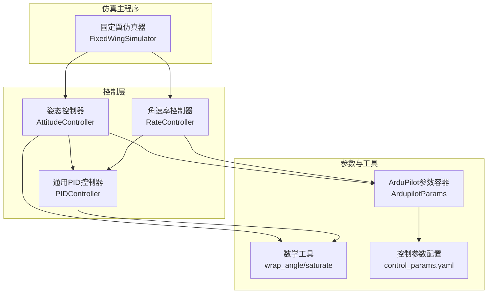
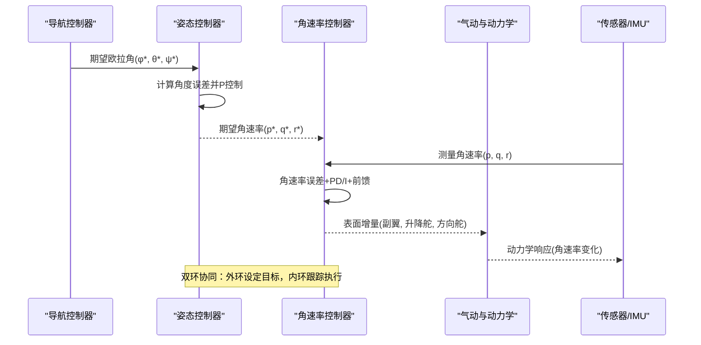
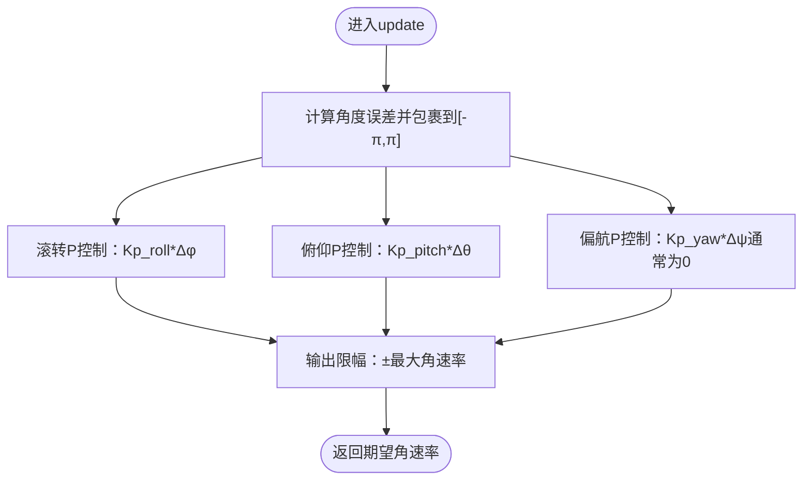
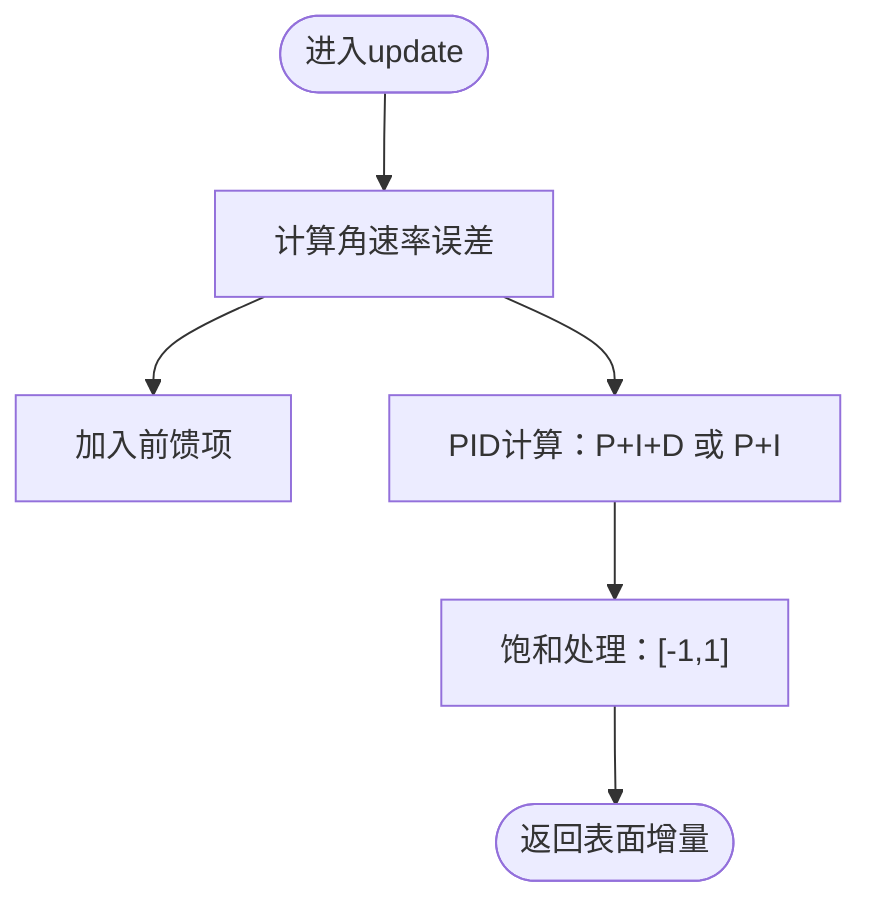
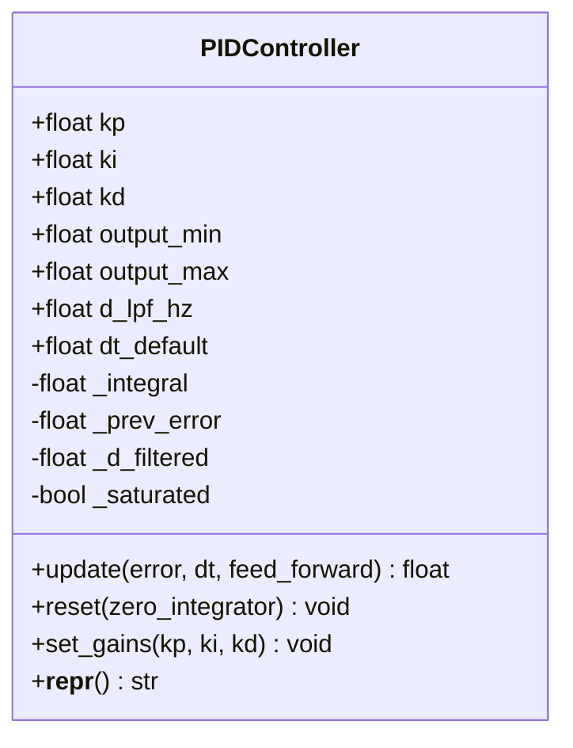
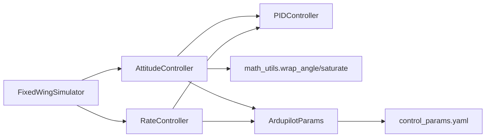

# 姿态控制器

<cite>
**本文档引用的文件**
- [attitude_controller.py](file://src/control/attitude_controller.py)
- [rate_controller.py](file://src/control/rate_controller.py)
- [pid_controller.py](file://src/control/pid_controller.py)
- [ardupilot_compat.py](file://src/control/ardupilot_compat.py)
- [control_params.yaml](file://config/control_params.yaml)
- [math_utils.py](file://src/utils/math_utils.py)
- [simulator.py](file://src/simulation/simulator.py)
- [test_control.py](file://tests/test_control.py)
- [example_3_trajectory_tracking.py](file://examples/example_3_trajectory_tracking.py)
- [example_4_circuit_flight.py](file://examples/example_4_circuit_flight.py)
</cite>

## 目录
1. [简介](#简介)
2. [项目结构](#项目结构)
3. [核心组件](#核心组件)
4. [架构总览](#架构总览)
5. [详细组件分析](#详细组件分析)
6. [依赖关系分析](#依赖关系分析)
7. [性能考量](#性能考量)
8. [故障排查指南](#故障排查指南)
9. [结论](#结论)

## 简介
本技术文档围绕固定翼无人机的姿态控制系统展开，系统采用经典的双环控制架构：外环姿态控制（角度误差）与内环角速率控制（角速率误差）。外环通过独立的PID控制器将期望欧拉角（滚转、俯仰、偏航）转换为期望角速率；内环则基于测量角速率与期望角速率的误差，生成副翼、升降舵、方向舵的归一化增量信号。该体系在ArduPilot参数命名与控制层级上保持一致，同时引入了饱和与抗积分饱和等工程特性，确保在非线性、强耦合的固定翼动力学下具备良好的稳定性与鲁棒性。

## 项目结构
姿态控制相关代码主要位于src/control目录，配合参数配置文件config/control_params.yaml与工具函数src/utils/math_utils.py。仿真主程序src/simulation/simulator.py负责组织控制链路与状态管理，并在示例脚本中展示闭环飞行场景。

图表来源
- [attitude_controller.py](file://src/control/attitude_controller.py#L33-L134)
- [rate_controller.py](file://src/control/rate_controller.py#L32-L109)
- [pid_controller.py](file://src/control/pid_controller.py#L17-L117)
- [ardupilot_compat.py](file://src/control/ardupilot_compat.py#L17-L130)
- [math_utils.py](file://src/utils/math_utils.py#L13-L36)
- [control_params.yaml](file://config/control_params.yaml#L1-L45)
- [simulator.py](file://src/simulation/simulator.py#L115-L200)

章节来源
- [attitude_controller.py](file://src/control/attitude_controller.py#L1-L134)
- [rate_controller.py](file://src/control/rate_controller.py#L1-L109)
- [pid_controller.py](file://src/control/pid_controller.py#L1-L117)
- [ardupilot_compat.py](file://src/control/ardupilot_compat.py#L1-L130)
- [math_utils.py](file://src/utils/math_utils.py#L1-L124)
- [control_params.yaml](file://config/control_params.yaml#L1-L45)
- [simulator.py](file://src/simulation/simulator.py#L1-L200)

## 核心组件
- 姿态控制器（AttitudeController）：将期望欧拉角转换为期望角速率，采用P控制，无微分项，输出受物理限幅约束。
- 角速率控制器（RateController）：内环控制器，对角速率误差进行P/D或P/I控制，结合前馈项，输出副翼、升降舵、方向舵的归一化增量。
- 通用PID控制器（PIDController）：离散PID，支持抗积分饱和、导数低通滤波、可选前馈，提供运行时热更新与复位能力。
- ArduPilot参数容器（ArdupilotParams）：统一参数命名与默认值，支持从YAML加载与校验。
- 数学工具（math_utils）：角度包裹、饱和、角度单位换算、旋转矩阵等基础运算。

章节来源
- [attitude_controller.py](file://src/control/attitude_controller.py#L33-L134)
- [rate_controller.py](file://src/control/rate_controller.py#L32-L109)
- [pid_controller.py](file://src/control/pid_controller.py#L17-L117)
- [ardupilot_compat.py](file://src/control/ardupilot_compat.py#L17-L130)
- [math_utils.py](file://src/utils/math_utils.py#L13-L36)

## 架构总览
姿态控制采用五层ArduPilot控制链路中的外环与内环协作：
- 外环（姿态）：期望欧拉角 → 期望角速率
- 内环（角速率）：测量角速率与期望角速率误差 → 表面增量（副翼/升降舵/方向舵）
- 稳定增强系统（SAS）：作为最内层反馈回路，提供短周期与长周期模态阻尼
- 参数来源：ArduPilot命名参数，支持从YAML热加载与校验

图表来源
- [attitude_controller.py](file://src/control/attitude_controller.py#L81-L122)
- [rate_controller.py](file://src/control/rate_controller.py#L68-L98)
- [ardupilot_compat.py](file://src/control/ardupilot_compat.py#L17-L60)

## 详细组件分析

### 姿态控制器（外环）
- 设计要点
  - 独立三轴P控制，无微分项，避免高频噪声放大与耦合
  - 角度误差使用角度包裹（±π），保证跨零点连续性
  - 输出限幅：滚转/俯仰/偏航分别限制，防止超出执行机构能力
- 数学模型
  - 角度误差：Δφ = wrap(φ* − φ)，Δθ = wrap(θ* − θ)，Δψ = wrap(ψ* − ψ)
  - 期望角速率：p* = Kp_roll ⋅ Δφ，q* = Kp_pitch ⋅ Δθ，r* = 0（偏航无外环）
- 实现细节
  - 使用PIDController（ki=kd=0）实现纯比例控制
  - 支持热重载参数与复位，适配模式切换

图表来源
- [attitude_controller.py](file://src/control/attitude_controller.py#L107-L122)
- [math_utils.py](file://src/utils/math_utils.py#L13-L25)

章节来源
- [attitude_controller.py](file://src/control/attitude_controller.py#L33-L134)
- [math_utils.py](file://src/utils/math_utils.py#L13-L25)

### 角速率控制器（内环）
- 设计要点
  - 三轴独立PID：俯仰（P/I/D）、滚转（P/I）、偏航（P/I）
  - 前馈项：PTCH_RATE_FF·q*、ROLL_RATE_FF·p*、YAW_RATE_FF·r*
  - 输出归一化到[-1,1]，直接映射到控制面增量
- 数学模型
  - 误差：e_p = p* − p，e_q = q* − q，e_r = r* − r
  - 控制输出：输出 = PID(e_p/q/r) + 前馈项，经饱和处理
- 实现细节
  - 导数低通滤波可选（d_lpf_hz），抑制高频噪声
  - 抗积分饱和：仅在未饱和时积分，且对积分值本身进行限幅

图表来源
- [rate_controller.py](file://src/control/rate_controller.py#L68-L98)
- [pid_controller.py](file://src/control/pid_controller.py#L55-L98)

章节来源
- [rate_controller.py](file://src/control/rate_controller.py#L32-L109)
- [pid_controller.py](file://src/control/pid_controller.py#L17-L117)

### 通用PID控制器
- 关键特性
  - 抗积分饱和：当输出饱和时停止积分累积，防止“风车效应”
  - 导数低通滤波：可选截止频率，改善高频噪声下的稳定性
  - 前馈项：允许在输出端叠加前馈，提升动态响应
  - 运行时热更新：支持在不中断控制的情况下调整增益
- 状态变量
  - 积分项、前一时刻误差、滤波后的导数、饱和标志
- 调试与验证
  - 提供reset接口，便于模式切换时清零状态

图表来源
- [pid_controller.py](file://src/control/pid_controller.py#L17-L117)

章节来源
- [pid_controller.py](file://src/control/pid_controller.py#L17-L117)

### 参数与配置
- ArduPilot参数容器
  - 统一命名：PTCH_P、ROLL_P、PTCH_RATE_P/I/D、ROLL_RATE_P/I/D、YAW_RATE_P/I等
  - 默认值：面向中型固定翼无人机（如TB2类）的保守起点
  - 序列化：支持from_yaml/to_yaml，便于参数导入导出与版本管理
  - 校验：范围检查与警告提示，确保参数合理性
- 控制参数配置文件
  - 包含姿态与角速率控制参数、限幅、TECS相关参数等
  - 示例脚本中用于演示闭环飞行轨迹跟踪与环形航线

章节来源
- [ardupilot_compat.py](file://src/control/ardupilot_compat.py#L17-L130)
- [control_params.yaml](file://config/control_params.yaml#L1-L45)
- [example_3_trajectory_tracking.py](file://examples/example_3_trajectory_tracking.py#L72-L98)
- [example_4_circuit_flight.py](file://examples/example_4_circuit_flight.py#L81-L119)

## 依赖关系分析
- 组件耦合
  - 姿态控制器依赖PIDController与数学工具（角度包裹/饱和）
  - 角速率控制器同样依赖PIDController与参数容器
  - 仿真主程序将控制链路与动力学、环境模块集成
- 外部依赖
  - NumPy用于数值计算与矩阵运算
  - YAML用于参数配置文件读取（参数容器）

图表来源
- [attitude_controller.py](file://src/control/attitude_controller.py#L20-L22)
- [rate_controller.py](file://src/control/rate_controller.py#L20-L21)
- [ardupilot_compat.py](file://src/control/ardupilot_compat.py#L74-L98)
- [simulator.py](file://src/simulation/simulator.py#L165-L171)

章节来源
- [attitude_controller.py](file://src/control/attitude_controller.py#L1-L134)
- [rate_controller.py](file://src/control/rate_controller.py#L1-L109)
- [ardupilot_compat.py](file://src/control/ardupilot_compat.py#L1-L130)
- [simulator.py](file://src/simulation/simulator.py#L1-L200)

## 性能考量
- 外环P控制的带宽与稳态误差
  - P控制带来快速响应，但存在静态误差；可通过增大Kp或引入积分（需谨慎）降低稳态误差
  - 角度包裹确保跨零点连续，避免大角度误差导致的瞬时过冲
- 内环PID的动态特性
  - 导数项有助于抑制高频噪声，但需合理设置截止频率
  - 抗积分饱和确保在饱和工况下不会产生“风车”效应，提高鲁棒性
- 前馈项的作用
  - 前馈可显著改善阶跃响应的超调与调节时间，建议根据目标角速率特性进行整定
- 执行机构限幅
  - 外环输出限幅与内环输出限幅共同作用，防止控制输入超过物理极限
- 非线性与耦合
  - 固定翼动力学具有强非线性与轴间耦合，需通过参数分轴整定与限幅策略提升稳定性

## 故障排查指南
- 角速率命令越界
  - 现象：期望角速率超出物理限幅
  - 排查：确认姿态控制器输出限幅是否生效，检查期望角度是否过大
  - 参考测试用例：期望角速率应在限幅范围内
- 控制输入饱和
  - 现象：内环输出持续饱和（±1）
  - 排查：检查内环增益是否过大，导数滤波是否开启，是否存在外部扰动
  - 建议：适度降低增益，启用导数低通，必要时引入抗积分饱和
- 角度包裹导致的相位跳变
  - 现象：角度误差在±π处出现突变
  - 排查：确认使用wrap_angle进行包裹，避免直接相减导致跨零点误差
- 参数加载与校验
  - 现象：参数异常导致控制不稳定
  - 排查：使用参数容器的validate方法检查参数范围，必要时从YAML重新加载
- 模式切换抖动
  - 现象：模式切换后控制器状态未清零
  - 排查：调用reset接口清零积分与导数状态，避免切换冲击

章节来源
- [test_control.py](file://tests/test_control.py#L217-L243)
- [attitude_controller.py](file://src/control/attitude_controller.py#L129-L133)
- [rate_controller.py](file://src/control/rate_controller.py#L105-L108)
- [ardupilot_compat.py](file://src/control/ardupilot_compat.py#L104-L129)

## 结论
该姿态控制系统以ArduPilot参数命名与控制层级为基础，构建了稳健的双环控制架构。外环采用P控制实现快速响应，内环通过PID与前馈实现精确跟踪，配合抗积分饱和与导数低通滤波，有效提升了在非线性固定翼动力学下的稳定性与鲁棒性。通过参数容器与配置文件，系统支持参数热加载与校验，便于在不同飞行器与任务场景下进行快速适配与优化。