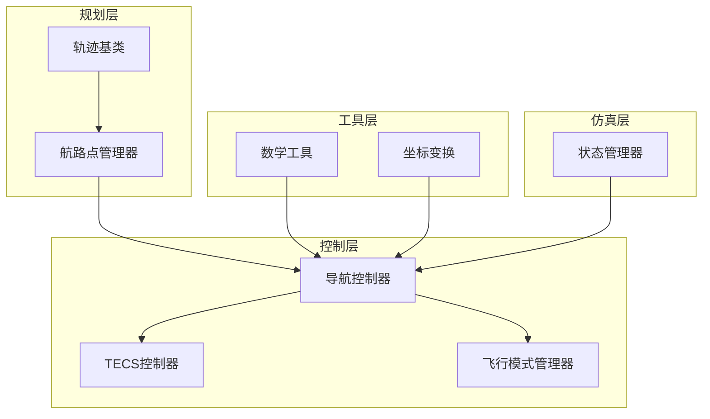
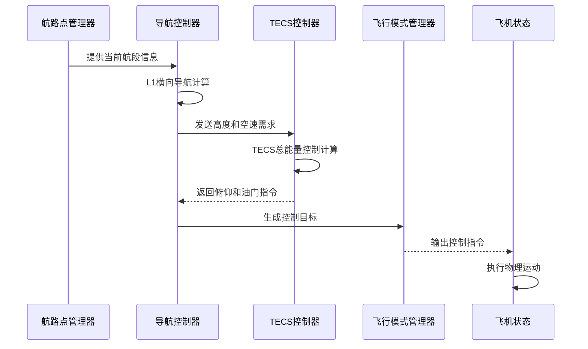
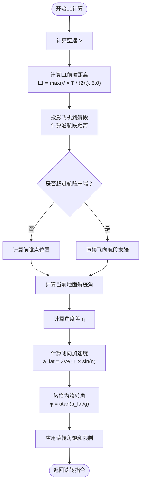
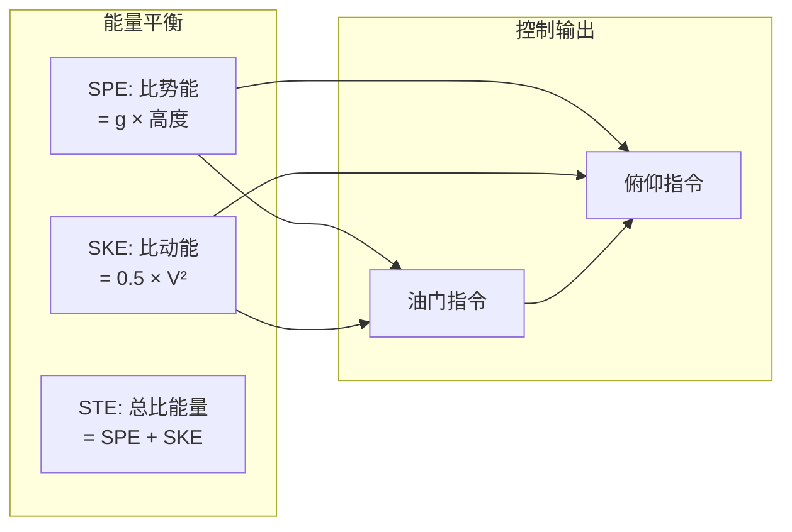
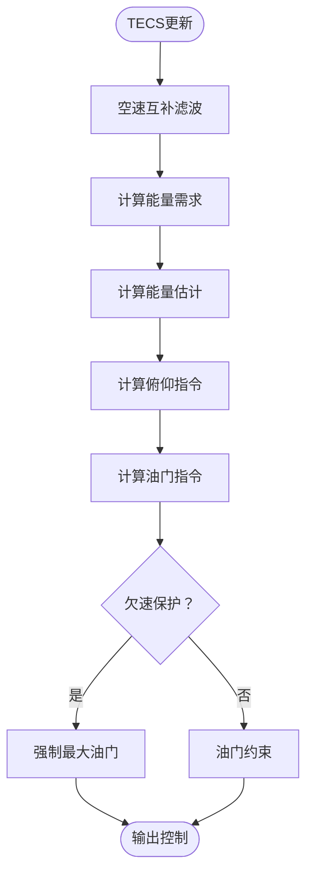
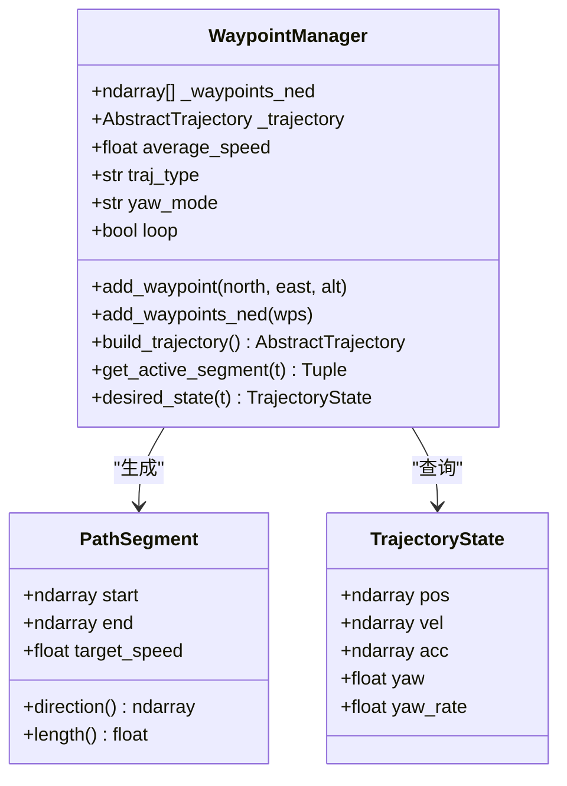
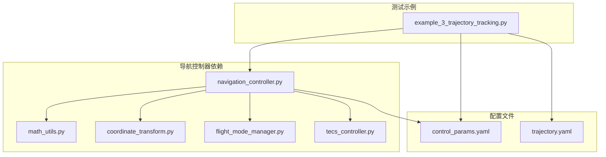

# 导航控制器

<cite>
**本文档引用的文件**
- [navigation_controller.py](file://src/control/navigation_controller.py)
- [tecs_controller.py](file://src/control/tecs_controller.py)
- [waypoint_manager.py](file://src/planning/waypoint_manager.py)
- [trajectory_base.py](file://src/planning/trajectory_base.py)
- [flight_mode_manager.py](file://src/control/flight_mode_manager.py)
- [math_utils.py](file://src/utils/math_utils.py)
- [coordinate_transform.py](file://src/dynamics/coordinate_transform.py)
- [state_manager.py](file://src/simulation/state_manager.py)
- [control_params.yaml](file://config/control_params.yaml)
- [trajectory.yaml](file://config/trajectory.yaml)
- [example_3_trajectory_tracking.py](file://examples/example_3_trajectory_tracking.py)
</cite>

## 目录
1. [简介](#简介)
2. [项目结构](#项目结构)
3. [核心组件](#核心组件)
4. [架构概览](#架构概览)
5. [详细组件分析](#详细组件分析)
6. [依赖关系分析](#依赖关系分析)
7. [性能考虑](#性能考虑)
8. [故障排除指南](#故障排除指南)
9. [结论](#结论)

## 简介

导航控制器是固定翼无人机飞行控制系统中的关键组件，负责实现精确的位置控制和速度控制。该系统采用L1导航算法进行横向导航，并结合TECS（总能量控制系统）实现高度和空速的协同控制。本文档深入解析导航控制器的实现原理，包括L1导航算法的工作机制、航路点跟踪策略、路径跟随控制以及导航精度优化方法。

## 项目结构

该项目采用模块化的架构设计，导航控制器位于控制层，与轨迹规划、状态管理等功能模块协同工作：

**图表来源**
- [navigation_controller.py](file://src/control/navigation_controller.py#L45-L293)
- [waypoint_manager.py](file://src/planning/waypoint_manager.py#L20-L208)
- [flight_mode_manager.py](file://src/control/flight_mode_manager.py#L115-L298)

**章节来源**
- [navigation_controller.py](file://src/control/navigation_controller.py#L1-L293)
- [waypoint_manager.py](file://src/planning/waypoint_manager.py#L1-L208)

## 核心组件

导航控制器由三个核心组件构成：

### 1. L1横向导航算法
实现基于L1理论的横向导航控制，通过前瞻距离计算和侧向加速度控制实现精确的航路点跟踪。

### 2. TECS总能量控制系统
采用ArduPilot风格的TECS控制器，实现高度和空速的协同控制，避免传统解耦PID的积分饱和问题。

### 3. 航路点管理系统
负责航路点的存储、轨迹生成和当前航段的实时查询。

**章节来源**
- [navigation_controller.py](file://src/control/navigation_controller.py#L45-L116)
- [tecs_controller.py](file://src/control/tecs_controller.py#L50-L130)
- [waypoint_manager.py](file://src/planning/waypoint_manager.py#L20-L80)

## 架构概览

导航控制器采用分层架构设计，实现了从航路点到控制指令的完整转换链路：

**图表来源**
- [navigation_controller.py](file://src/control/navigation_controller.py#L134-L202)
- [flight_mode_manager.py](file://src/control/flight_mode_manager.py#L173-L212)

## 详细组件分析

### L1导航算法详解

L1导航算法是导航控制器的核心，实现了基于前瞻距离的横向导航控制。

#### 算法原理

L1算法通过以下步骤实现精确的航路点跟踪：

1. **投影计算**：将飞机位置投影到当前航段上，计算沿航段的距离
2. **前瞻点选择**：在沿航段距离基础上加上L1距离，但不超过航段末端
3. **角度计算**：计算从当前航迹到前瞻点的方向角
4. **侧向加速度**：根据速度和L1距离计算所需的侧向加速度
5. **滚转角转换**：将侧向加速度转换为滚转指令

#### 关键参数

| 参数 | 默认值 | 作用 |
|------|--------|------|
| L1周期 | 25.0秒 | 决定前瞻距离的大小 |
| 阻尼系数 | 0.75 | 控制系统的稳定性和响应特性 |
| 最大滚转角 | 45° | 限制滚转角输出范围 |

#### L1算法流程图

**图表来源**
- [navigation_controller.py](file://src/control/navigation_controller.py#L206-L292)

**章节来源**
- [navigation_controller.py](file://src/control/navigation_controller.py#L206-L292)

### TECS总能量控制系统

TECS控制器实现了高度和空速的协同控制，避免了传统解耦PID控制中的积分饱和问题。

#### 控制策略

TECS采用双通道控制策略：

1. **油门控制**：控制总比能量（SPE + SKE）
2. **俯仰控制**：控制比能量分配比（SEB）

#### 能量模型

**图表来源**
- [tecs_controller.py](file://src/control/tecs_controller.py#L445-L464)

#### TECS控制流程

**图表来源**
- [tecs_controller.py](file://src/control/tecs_controller.py#L247-L315)

**章节来源**
- [tecs_controller.py](file://src/control/tecs_controller.py#L50-L315)

### 航路点跟踪和路径跟随

航路点管理器提供了完整的航路点管理和轨迹生成功能：

#### 航路点管理

**图表来源**
- [waypoint_manager.py](file://src/planning/waypoint_manager.py#L20-L167)
- [trajectory_base.py](file://src/planning/trajectory_base.py#L16-L46)

#### 路径跟随策略

导航控制器采用以下路径跟随策略：

1. **航段选择**：根据当前时间和航路点序列确定活动航段
2. **目标高度**：从航段末端提取目标高度
3. **目标速度**：使用航段的target_speed作为目标空速
4. **航向控制**：使用航段方向作为目标航向

**章节来源**
- [waypoint_manager.py](file://src/planning/waypoint_manager.py#L178-L208)
- [navigation_controller.py](file://src/control/navigation_controller.py#L134-L202)

## 依赖关系分析

导航控制器与其他模块的依赖关系如下：

**图表来源**
- [navigation_controller.py](file://src/control/navigation_controller.py#L14-L22)
- [example_3_trajectory_tracking.py](file://examples/example_3_trajectory_tracking.py#L34-L80)

**章节来源**
- [navigation_controller.py](file://src/control/navigation_controller.py#L14-L22)
- [example_3_trajectory_tracking.py](file://examples/example_3_trajectory_tracking.py#L34-L80)

## 性能考虑

### 参数调节指南

#### L1导航参数调节

| 参数 | 调节范围 | 调节建议 | 影响 |
|------|----------|----------|------|
| NAVL1_PERIOD | 20-60秒 | 根据飞行速度调整 | 前瞻距离，影响响应速度 |
| NAVL1_DAMPING | 0.5-1.0 | 0.75为默认值 | 系统稳定性，过大会导致滞后 |
| MAX_ROLL | 30-60度 | 根据飞机性能调整 | 最大转弯能力 |

#### TECS参数调节

| 参数 | 调节范围 | 调节建议 | 影响 |
|------|----------|----------|------|
| TECS_TIME_CONST | 5-15秒 | 平滑响应的关键 | 系统响应速度和平滑度 |
| TECS_THR_DAMP | 0.5-1.0 | 减少油门振荡 | 油门稳定性 |
| TECS_PTCH_DAMP | 0.3-1.0 | 抑制俯仰振荡 | 俯仰稳定性 |
| TECS_INTEG_GAIN | 0.01-0.1 | 消除稳态误差 | 控制精度 |

### 抗干扰能力提升

1. **高度需求滤波**：通过TECS_HDEM_TCONST参数平滑高度指令
2. **速度互补滤波**：提高空速估计的准确性
3. **加速度低通滤波**：减少传感器噪声的影响
4. **欠速保护**：防止空速过低导致的控制失效

### 导航精度优化

1. **坐标变换精度**：使用精确的旋转矩阵进行坐标变换
2. **地面航迹角计算**：使用体轴速度而非航向角计算地面航迹
3. **前瞻距离自适应**：根据空速动态调整L1距离
4. **积分抗饱和**：防止积分器饱和导致的控制失效

## 故障排除指南

### 常见问题及解决方案

#### 1. 导航精度不足

**症状**：飞机偏离航路点较大
**可能原因**：
- L1周期设置不当
- 航路点密度不够
- 飞行速度过高

**解决方法**：
- 减小NAVL1_PERIOD参数
- 增加航路点密度
- 降低飞行速度

#### 2. 油门振荡

**症状**：油门指令频繁波动
**可能原因**：
- TECS_THR_DAMP参数过低
- TECS_INTEG_GAIN过大
- 空速传感器噪声

**解决方法**：
- 增大TECS_THR_DAMP
- 减小TECS_INTEG_GAIN
- 改善空速传感器校准

#### 3. 俯仰振荡

**症状**：飞机出现周期性俯仰振荡
**可能原因**：
- TECS_PTCH_DAMP不足
- TECS_TIME_CONST过小
- 飞机气动特性不稳定

**解决方法**：
- 增大TECS_PTCH_DAMP
- 增大TECS_TIME_CONST
- 检查飞机气动特性

#### 4. 欠速保护误触发

**症状**：在正常飞行中触发欠速保护
**可能原因**：
- 空速传感器校准错误
- TECS_THR_MAX设置过高
- 飞行条件过于恶劣

**解决方法**：
- 校准空速传感器
- 适当降低TECS_THR_MAX
- 改善飞行条件

**章节来源**
- [tecs_controller.py](file://src/control/tecs_controller.py#L432-L444)
- [tecs_controller.py](file://src/control/tecs_controller.py#L635-L646)

## 结论

导航控制器通过L1导航算法和TECS控制系统的有机结合，实现了固定翼无人机的精确导航和控制。该系统具有以下特点：

1. **模块化设计**：清晰的层次结构便于维护和扩展
2. **参数化配置**：丰富的参数调节选项适应不同飞行器
3. **鲁棒性强**：完善的保护机制应对各种飞行条件
4. **精度高**：多传感器融合和滤波技术提高控制精度

通过合理调节参数和优化控制策略，可以进一步提升导航精度和抗干扰能力，满足复杂飞行任务的需求。