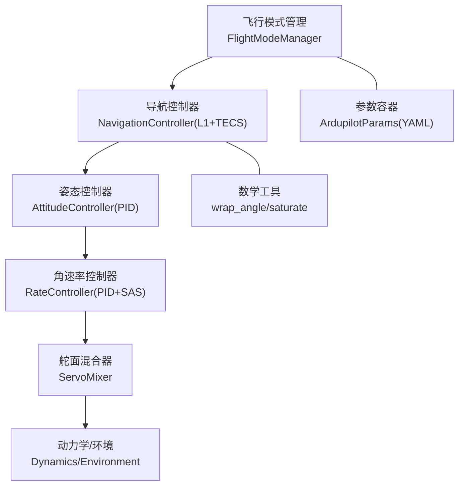
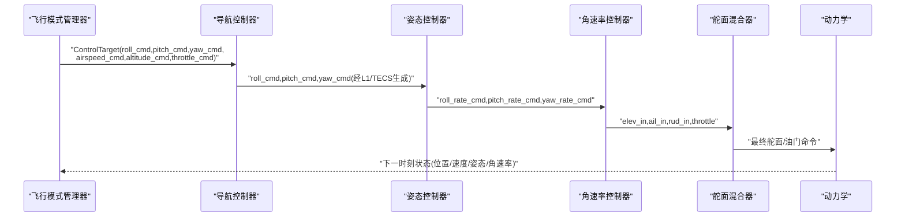
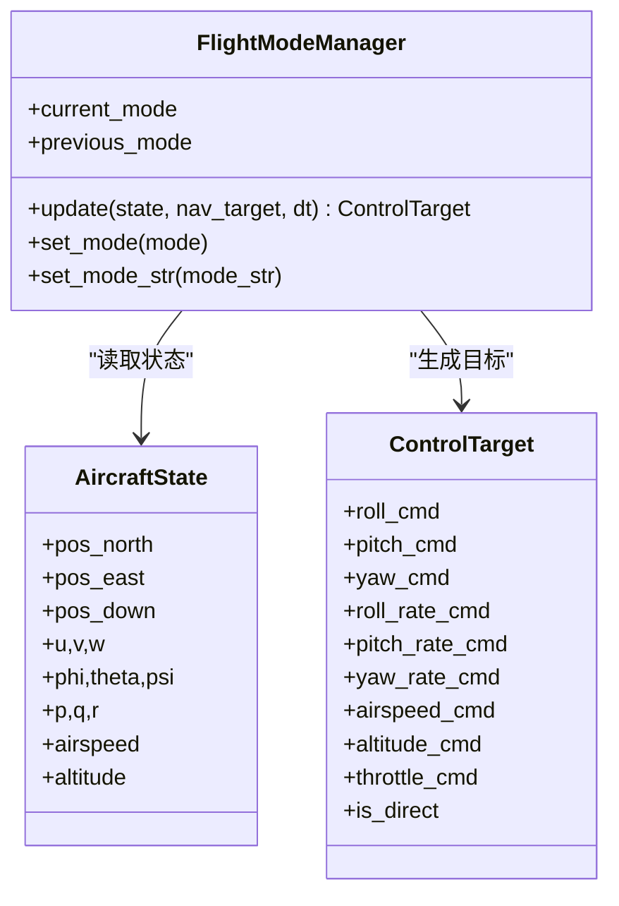
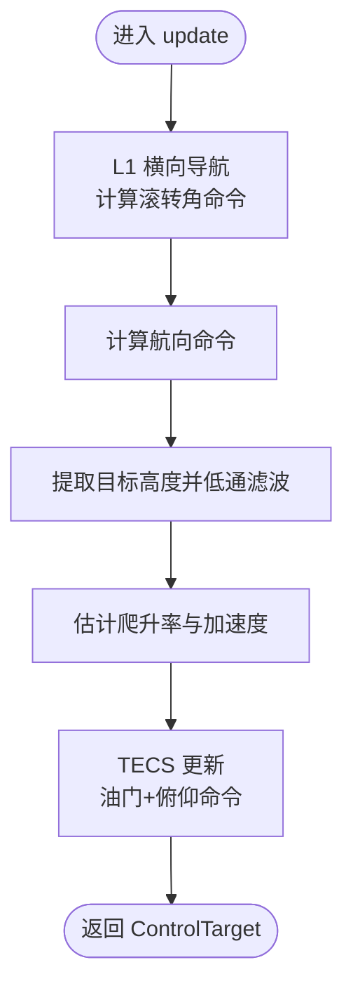
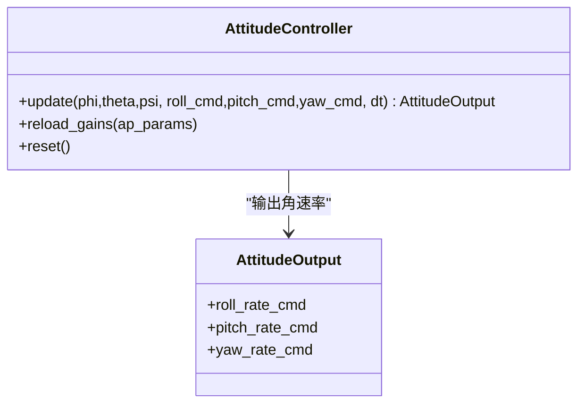
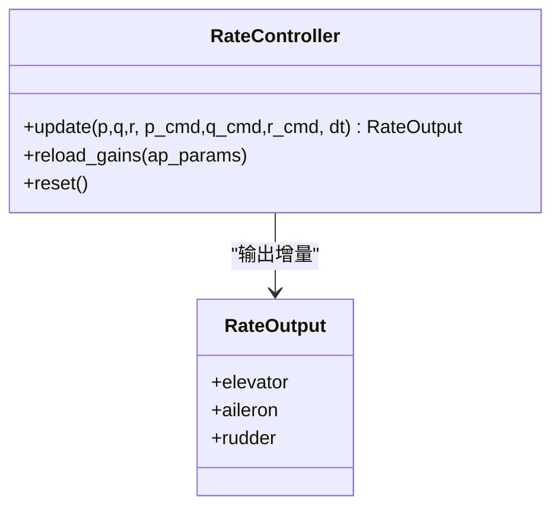
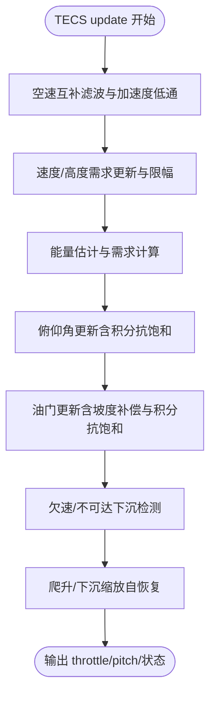
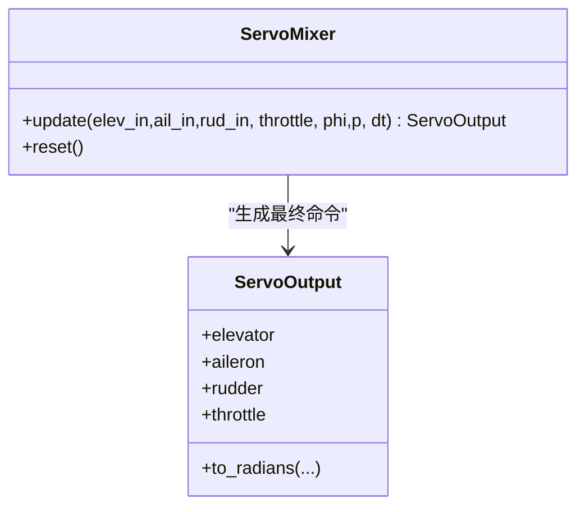
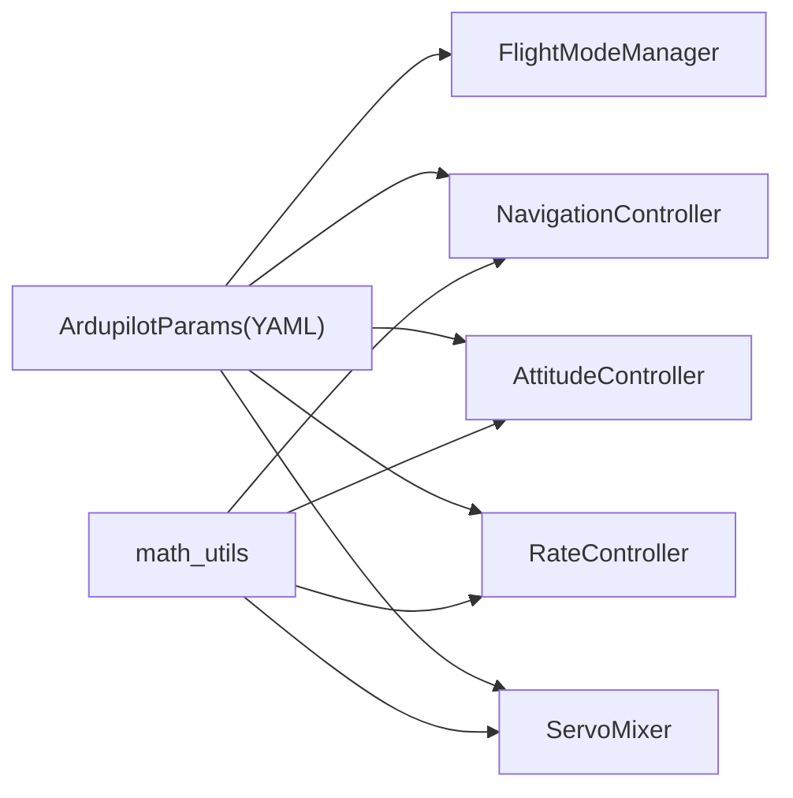

# 控制系统

<cite>
**本文引用的文件**
- [src/control/ardupilot_compat.py](file://src/control/ardupilot_compat.py)
- [src/control/flight_mode_manager.py](file://src/control/flight_mode_manager.py)
- [src/control/navigation_controller.py](file://src/control/navigation_controller.py)
- [src/control/attitude_controller.py](file://src/control/attitude_controller.py)
- [src/control/rate_controller.py](file://src/control/rate_controller.py)
- [src/control/tecs_controller.py](file://src/control/tecs_controller.py)
- [src/control/servo_mixer.py](file://src/control/servo_mixer.py)
- [src/control/pid_controller.py](file://src/control/pid_controller.py)
- [src/utils/math_utils.py](file://src/utils/math_utils.py)
- [config/control_params.yaml](file://config/control_params.yaml)
- [examples/example_6_ardupilot_parameters.py](file://examples/example_6_ardupilot_parameters.py)
- [debug_tecs.py](file://debug_tecs.py)
- [src/simulation/simulator.py](file://src/simulation/simulator.py)
</cite>

## 目录
1. [引言](#引言)
2. [项目结构](#项目结构)
3. [核心组件](#核心组件)
4. [架构总览](#架构总览)
5. [详细组件分析](#详细组件分析)
6. [依赖关系分析](#依赖关系分析)
7. [性能考量](#性能考量)
8. [故障排查指南](#故障排查指南)
9. [结论](#结论)
10. [附录](#附录)

## 引言
本技术文档面向固定翼无人机控制系统，围绕“ArduPilot 兼容控制链路”的设计理念与实现进行系统化阐述。文档覆盖飞行模式管理、导航控制器（L1+TECS）、姿态与角速率控制器、舵面混合器以及调试与性能优化方法，帮助读者从整体到细节全面理解控制闭环的工作机理，并提供可操作的调参与排障建议。

## 项目结构
控制子系统采用五层控制链路（外到内）：飞行模式管理 → 导航控制器（L1+TECS）→ 姿态控制器 → 角速率控制器（SAS）→ 舵面混合器。各层职责清晰、边界明确，参数通过 ArduPilot 兼容的数据容器统一加载与校验，保证与 ArduPilot 生态一致。

图示来源
- [src/control/flight_mode_manager.py](file://src/control/flight_mode_manager.py#L115-L298)
- [src/control/navigation_controller.py](file://src/control/navigation_controller.py#L45-L202)
- [src/control/attitude_controller.py](file://src/control/attitude_controller.py#L33-L134)
- [src/control/rate_controller.py](file://src/control/rate_controller.py#L32-L109)
- [src/control/servo_mixer.py](file://src/control/servo_mixer.py#L54-L153)
- [src/control/ardupilot_compat.py](file://src/control/ardupilot_compat.py#L17-L130)
- [src/utils/math_utils.py](file://src/utils/math_utils.py#L13-L26)

章节来源
- [src/control/flight_mode_manager.py](file://src/control/flight_mode_manager.py#L1-L298)
- [src/control/navigation_controller.py](file://src/control/navigation_controller.py#L1-L293)
- [src/control/attitude_controller.py](file://src/control/attitude_controller.py#L1-L134)
- [src/control/rate_controller.py](file://src/control/rate_controller.py#L1-L109)
- [src/control/servo_mixer.py](file://src/control/servo_mixer.py#L1-L153)
- [src/control/ardupilot_compat.py](file://src/control/ardupilot_compat.py#L1-L130)
- [src/utils/math_utils.py](file://src/utils/math_utils.py#L1-L124)

## 核心组件
- 飞行模式管理器：负责模式切换、目标生成与过渡逻辑，输出 ControlTarget（角度/角速率/速度/高度/油门/直控通道）。
- 导航控制器：L1 横向导航 + TECS 能量管理，生成横向滚转角与纵向（俯仰+油门）命令。
- 姿态控制器：三轴角度环（Roll/Pitch/Yaw），输出期望角速率。
- 角速率控制器（SAS）：三轴角速率环，提供阻尼与稳定性。
- 舵面混合器：将增量信号转换为最终执行器命令，施加限幅与速率限制、协调转弯补偿。
- 参数容器：ArduPilotParams 提供与 ArduPilot 完全一致的参数命名、范围校验与 YAML 序列化。

章节来源
- [src/control/flight_mode_manager.py](file://src/control/flight_mode_manager.py#L28-L298)
- [src/control/navigation_controller.py](file://src/control/navigation_controller.py#L45-L202)
- [src/control/attitude_controller.py](file://src/control/attitude_controller.py#L33-L134)
- [src/control/rate_controller.py](file://src/control/rate_controller.py#L32-L109)
- [src/control/servo_mixer.py](file://src/control/servo_mixer.py#L54-L153)
- [src/control/ardupilot_compat.py](file://src/control/ardupilot_compat.py#L17-L130)

## 架构总览
ArduPilot 兼容控制链路的控制层级与数据流如下：

图示来源
- [src/control/flight_mode_manager.py](file://src/control/flight_mode_manager.py#L173-L212)
- [src/control/navigation_controller.py](file://src/control/navigation_controller.py#L134-L202)
- [src/control/attitude_controller.py](file://src/control/attitude_controller.py#L81-L122)
- [src/control/rate_controller.py](file://src/control/rate_controller.py#L68-L98)
- [src/control/servo_mixer.py](file://src/control/servo_mixer.py#L80-L149)

## 详细组件分析

### 飞行模式管理器
- 支持模式：MANUAL、STABILIZE、FBW_A、FBW_B、AUTO、LOITER、RTH。
- 关键点：
  - 维护当前/历史模式，切换时进行过渡记录。
  - 生成 ControlTarget，其中角度/角速率/速度/高度/油门均可由导航层提供，或在特定模式下采用默认策略。
  - LOITER/RTH 模式下对航路点与返航目标进行捕获与回退策略。
- 数据结构要点：AircraftState（位置/速度/姿态/角速率/空速/高度）、ControlTarget（期望角度/角速率/速度/高度/油门/直控）。

图示来源
- [src/control/flight_mode_manager.py](file://src/control/flight_mode_manager.py#L115-L298)

章节来源
- [src/control/flight_mode_manager.py](file://src/control/flight_mode_manager.py#L28-L298)

### 导航控制器（L1 + TECS）
- L1 横向导航：基于路径段的“前瞻点”生成横向目标轨迹，结合体轴 u/v 计算地面航迹角，得到所需侧向加速度与滚转角。
- TECS 能量管理：将高度与速度控制耦合，通过油门调节总比能量（SPE+SKE），通过俯仰角调节比能量分配（SEB），实现稳定的高度/速度跟踪。
- 关键参数：NAVL1_PERIOD/NAVL1_DAMPING、TECS 各类增益与限幅。

图示来源
- [src/control/navigation_controller.py](file://src/control/navigation_controller.py#L134-L202)

章节来源
- [src/control/navigation_controller.py](file://src/control/navigation_controller.py#L45-L293)

### 姿态控制器（角度环）
- 三轴独立 PID：Roll/Pitch 使用 P 控制，Yaw 不设姿态外环（Pass-Through）。
- 角度误差采用角度包裹（±π），输出期望角速率，受最大角速率限幅约束。
- 与 ArduPilot Plane 的 stabilise_roll/stabilise_pitch/stabilise_yaw 对应。

图示来源
- [src/control/attitude_controller.py](file://src/control/attitude_controller.py#L33-L134)

章节来源
- [src/control/attitude_controller.py](file://src/control/attitude_controller.py#L33-L134)

### 角速率控制器（SAS）
- 三轴角速率 PID：PTCH/ROLL/YAW 各自独立，提供阻尼与稳定性。
- 支持前馈项（FF），在角速率误差基础上叠加 FF，提升响应与抗扰。
- 输出归一化的表面偏移（−1..1）。

图示来源
- [src/control/rate_controller.py](file://src/control/rate_controller.py#L32-L109)

章节来源
- [src/control/rate_controller.py](file://src/control/rate_controller.py#L32-L109)

### TECS（总能量控制）
- 能量管理核心思想：
  - 油门控制总比能量（SPE+SKE），俯仰角控制比能量分配（SEB）。
  - 速度权重 spd_weight 决定“高度优先/速度优先”比例。
  - 通过积分抗饱和与限幅策略，避免油门/俯仰饱和与积分风车。
- 主要流程：空速互补滤波 → 速度/高度需求更新 → 能量估计与需求 → 俯仰角更新 → 油门更新 → 不可达下沉检测与自适应缩放。

图示来源
- [src/control/tecs_controller.py](file://src/control/tecs_controller.py#L247-L315)

章节来源
- [src/control/tecs_controller.py](file://src/control/tecs_controller.py#L50-L647)

### 舵面混合器
- 输入：来自角速率控制器的增量（elev_in, ail_in, rud_in）与来自导航/模式层的油门（0..1）。
- 处理：
  - 将参数中的角度限幅（LIM_PITCH_MAX/MIN、LIM_ROLL_CD）转换为归一化范围。
  - 协调转弯补偿：rudder += k * p。
  - 油门限幅与速率限制（近似）。
- 输出：ServoOutput（elevator/aileron/rudder ∈ [−1,1]，throttle ∈ [0,1]）。

图示来源
- [src/control/servo_mixer.py](file://src/control/servo_mixer.py#L54-L153)

章节来源
- [src/control/servo_mixer.py](file://src/control/servo_mixer.py#L54-L153)

### PID 控制器（通用）
- 设计与 ArduPilot AC_PID 一致：P/I/D，基于饱和的抗积分风车，可选微分低通，支持热重载与复位。
- 在姿态/角速率控制器中作为基础模块使用。

章节来源
- [src/control/pid_controller.py](file://src/control/pid_controller.py#L17-L117)

## 依赖关系分析
- 参数来源：ArduPilotParams 从 YAML 加载，提供验证与导出功能，贯穿控制链路。
- 数学工具：wrap_angle、saturate 等基础函数被多处模块复用。
- 控制链路：模式管理器 → 导航控制器 → 姿态/角速率控制器 → 舵面混合器 → 动力学。

图示来源
- [src/control/ardupilot_compat.py](file://src/control/ardupilot_compat.py#L74-L98)
- [src/utils/math_utils.py](file://src/utils/math_utils.py#L13-L26)
- [src/control/flight_mode_manager.py](file://src/control/flight_mode_manager.py#L173-L212)
- [src/control/navigation_controller.py](file://src/control/navigation_controller.py#L134-L202)
- [src/control/attitude_controller.py](file://src/control/attitude_controller.py#L81-L122)
- [src/control/rate_controller.py](file://src/control/rate_controller.py#L68-L98)
- [src/control/servo_mixer.py](file://src/control/servo_mixer.py#L80-L149)

章节来源
- [src/control/ardupilot_compat.py](file://src/control/ardupilot_compat.py#L17-L130)
- [src/utils/math_utils.py](file://src/utils/math_utils.py#L1-L124)

## 性能考量
- 参数一致性与范围校验：ArduPilotParams.validate() 提供基本范围检查，建议在加载后打印警告并评估是否需要调整。
- TECS 时间常数与阻尼：TECS_TIME_CONST、TECS_THR_DAMP、TECS_PTCH_DAMP、TECS_INTEG_GAIN 对响应平滑性与振荡有显著影响，建议先稳态后逐步收紧。
- L1 参数：NAVL1_PERIOD 与 NAVL1_DAMPING 决定横向响应与阻尼，需结合机型气动特性与速度范围综合调参。
- 角速率 PID：PTCH_RATE_P/I/D 与 ROLL_RATE_P/I/D/FF 决定短周期与滚转响应，注意避免积分风车与饱和。
- 舵面限幅与速率限制：Elevator/aileron/ruder 的角度限幅与速率限制对实际执行器友好，建议结合真实作动器能力进行折算。

章节来源
- [src/control/ardupilot_compat.py](file://src/control/ardupilot_compat.py#L104-L130)
- [config/control_params.yaml](file://config/control_params.yaml#L30-L45)
- [src/control/navigation_controller.py](file://src/control/navigation_controller.py#L57-L82)
- [src/control/tecs_controller.py](file://src/control/tecs_controller.py#L80-L127)
- [src/control/rate_controller.py](file://src/control/rate_controller.py#L46-L64)
- [src/control/servo_mixer.py](file://src/control/servo_mixer.py#L109-L144)

## 故障排查指南
- TECS 超调/振荡
  - 现象：高度/速度出现超调或振荡。
  - 排查：降低 TECS_TIME_CONST、提高 TECS_THR_DAMP/TECS_PTCH_DAMP、降低 TECS_INTEG_GAIN；检查 spd_weight 是否偏向速度。
  - 参考：debug_tecs 脚本可输出 hgt_raw/hgt_lpf/altitude/throttle/pitch/speed/STE_err，便于定位。
- 欠速保护触发
  - 现象：低空速长时间接近最小空速且油门饱和。
  - 排查：检查 TECS_THR_CRUISE、坡度补偿 TECS_RLL2THR、速度包线 airspeed_min/max 设置。
- 不可达下沉
  - 现象：在强下沉/大迎角条件下油门饱和但无法抑制下降。
  - 排查：关注 TECS 的不可达下沉检测与自适应缩放逻辑，必要时降低爬升/下沉限幅。
- 模式切换抖动
  - 现象：模式切换瞬间出现角速率/油门突变。
  - 排查：在模式切换时调用控制器 reset() 与 TECS reset()，确保积分与滤波状态平滑过渡。
- 参数热重载
  - 方法：通过 ArdupilotParams.from_yaml() 与 reload_gains() 实现运行时参数更新，配合示例脚本进行对比试验。

章节来源
- [debug_tecs.py](file://debug_tecs.py#L1-L67)
- [src/control/tecs_controller.py](file://src/control/tecs_controller.py#L432-L441)
- [src/control/tecs_controller.py](file://src/control/tecs_controller.py#L635-L647)
- [src/control/flight_mode_manager.py](file://src/control/flight_mode_manager.py#L152-L163)
- [src/control/attitude_controller.py](file://src/control/attitude_controller.py#L124-L134)
- [src/control/rate_controller.py](file://src/control/rate_controller.py#L100-L109)
- [examples/example_6_ardupilot_parameters.py](file://examples/example_6_ardupilot_parameters.py#L44-L85)

## 结论
该固定翼控制系统以 ArduPilot 兼容参数与控制结构为核心，形成从模式管理到执行器输出的完整闭环。导航层采用 L1+TECS 解耦高度与速度控制，姿态/角速率层提供稳健的阻尼与稳定性，舵面混合器实现物理约束下的安全输出。通过参数容器与调试脚本，系统具备良好的可配置性、可观测性与可维护性。

## 附录

### 参数与调参要点（节选）
- 导航与能量管理
  - NAVL1_PERIOD/NAVL1_DAMPING：横向响应与阻尼
  - TECS_CLMB_MAX/SINK_MIN/SINK_MAX：爬升/下沉限幅
  - TECS_TIME_CONST/THR_DAMP/PTCH_DAMP/INTEG_GAIN：响应平滑与抗振
  - TECS_SPDWEIGHT：高度/速度权衡
  - TECS_RLL2THR：坡度油门补偿
- 姿态与角速率
  - PTCH_P/ROLL_P：姿态环 P 增益
  - PTCH_RATE_P/I/D/FF、ROLL_RATE_P/I/D/FF、YAW_RATE_P/I：角速率环与 SAS
- 执行器限幅
  - LIM_PITCH_MAX/MIN、LIM_ROLL_CD、THR_MIN/THR_MAX：物理约束
  - 舵面速率限制：ServoMixer 内部近似速率限制

章节来源
- [config/control_params.yaml](file://config/control_params.yaml#L1-L45)
- [src/control/navigation_controller.py](file://src/control/navigation_controller.py#L57-L82)
- [src/control/tecs_controller.py](file://src/control/tecs_controller.py#L80-L127)
- [src/control/attitude_controller.py](file://src/control/attitude_controller.py#L55-L77)
- [src/control/rate_controller.py](file://src/control/rate_controller.py#L51-L64)
- [src/control/servo_mixer.py](file://src/control/servo_mixer.py#L109-L144)