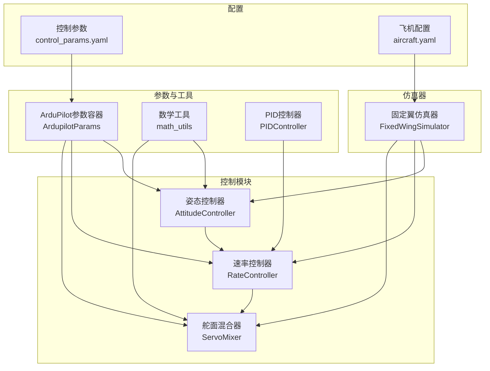
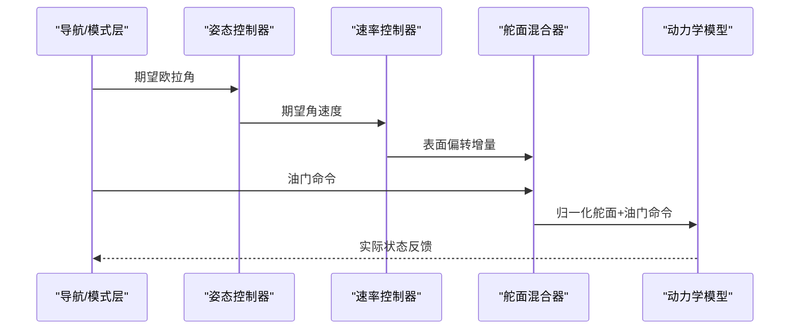
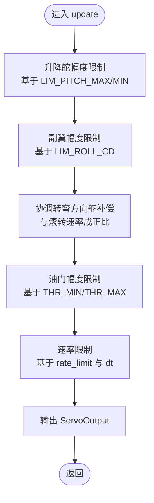
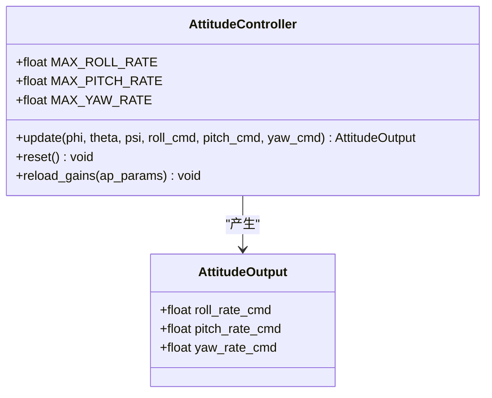
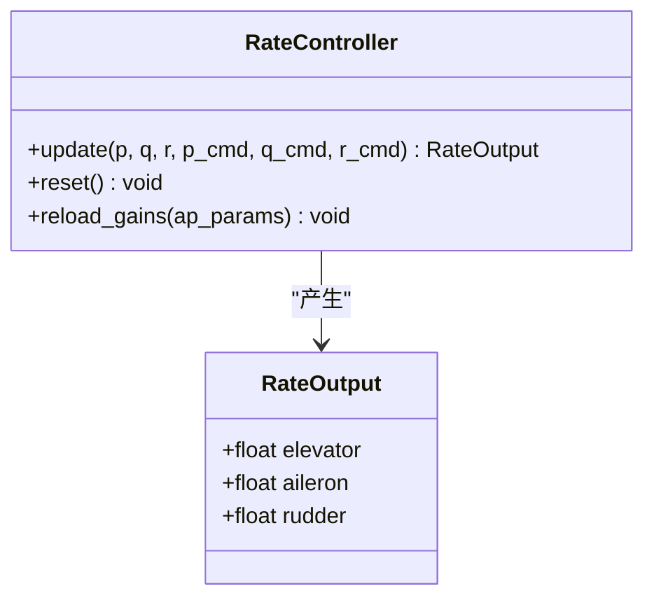
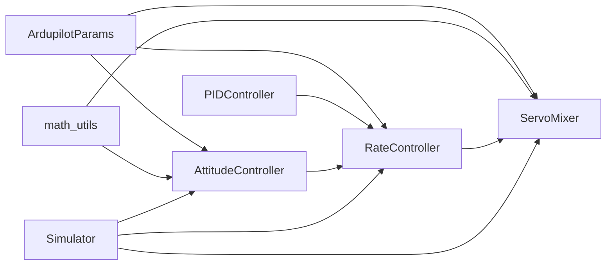

# 舵面混合器

<cite>
**本文档引用的文件**
- [servo_mixer.py](file://src/control/servo_mixer.py)
- [attitude_controller.py](file://src/control/attitude_controller.py)
- [rate_controller.py](file://src/control/rate_controller.py)
- [pid_controller.py](file://src/control/pid_controller.py)
- [ardupilot_compat.py](file://src/control/ardupilot_compat.py)
- [math_utils.py](file://src/utils/math_utils.py)
- [simulator.py](file://src/simulation/simulator.py)
- [control_params.yaml](file://config/control_params.yaml)
- [aircraft.yaml](file://config/aircraft.yaml)
- [test_control.py](file://tests/test_control.py)
</cite>

## 目录
1. [简介](#简介)
2. [项目结构](#项目结构)
3. [核心组件](#核心组件)
4. [架构概览](#架构概览)
5. [详细组件分析](#详细组件分析)
6. [依赖关系分析](#依赖关系分析)
7. [性能考量](#性能考量)
8. [故障诊断与容错](#故障诊断与容错)
9. [结论](#结论)

## 简介
本文件为舵面混合器的技术文档，深入解释多舵面控制信号的混合算法与计算方法，详细说明升降舵、副翼、方向舵的控制指令合成过程，解释舵面限制与饱和保护的实现机制，并提供舵面混合的几何关系与物理约束考虑，以及故障诊断与容错处理方法。

舵面混合器位于ArduPilot控制层级的最内层（第5层），负责将来自速率控制器的表面偏转增量与来自导航/模式层的油门命令进行合成，应用幅度限制、速率限制、协调转弯方向舵补偿等处理，最终输出归一化的舵面与油门命令。

## 项目结构
舵面混合器位于控制模块中，与姿态控制器、速率控制器、参数容器、数学工具共同构成完整的飞控控制链路。配置文件提供参数来源，仿真器负责组织整个控制流程。

图表来源
- [simulator.py](file://src/simulation/simulator.py#L41-L52)
- [servo_mixer.py](file://src/control/servo_mixer.py#L19-L21)
- [attitude_controller.py](file://src/control/attitude_controller.py#L20-L22)
- [rate_controller.py](file://src/control/rate_controller.py#L20-L22)
- [ardupilot_compat.py](file://src/control/ardupilot_compat.py#L17-L69)
- [math_utils.py](file://src/utils/math_utils.py#L1-L124)

章节来源
- [simulator.py](file://src/simulation/simulator.py#L41-L52)
- [servo_mixer.py](file://src/control/servo_mixer.py#L1-L153)
- [attitude_controller.py](file://src/control/attitude_controller.py#L1-L134)
- [rate_controller.py](file://src/control/rate_controller.py#L1-L109)
- [ardupilot_compat.py](file://src/control/ardupilot_compat.py#L1-L130)
- [math_utils.py](file://src/utils/math_utils.py#L1-L124)

## 核心组件
- 舵面混合器（ServoMixer）：执行最终的表面偏转与油门命令合成，包含幅度限制、速率限制、协调转弯方向舵补偿等功能。
- 姿态控制器（AttitudeController）：将期望欧拉角转换为期望角速度命令。
- 速率控制器（RateController）：基于期望角速度与实际角速度误差生成表面偏转增量。
- ArduPilot参数容器（ArdupilotParams）：提供ArduPilot兼容的参数集合，包括限幅与增益等。
- 数学工具（math_utils）：提供角度包裹、饱和函数等基础运算。
- PID控制器（PIDController）：速率控制器内部使用的通用PID实现。

章节来源
- [servo_mixer.py](file://src/control/servo_mixer.py#L23-L51)
- [attitude_controller.py](file://src/control/attitude_controller.py#L25-L31)
- [rate_controller.py](file://src/control/rate_controller.py#L24-L30)
- [ardupilot_compat.py](file://src/control/ardupilot_compat.py#L17-L69)
- [math_utils.py](file://src/utils/math_utils.py#L23-L25)
- [pid_controller.py](file://src/control/pid_controller.py#L17-L52)

## 架构概览
舵面混合器在ArduPilot控制层级中的位置如下：
- 外层：导航/模式管理器（FlightModeManager）、TECS（总能量控制系统）
- 中层：姿态控制器（AttitudeController）、速率控制器（RateController）
- 内层：舵面混合器（ServoMixer）

图表来源
- [simulator.py](file://src/simulation/simulator.py#L501-L521)
- [attitude_controller.py](file://src/control/attitude_controller.py#L81-L122)
- [rate_controller.py](file://src/control/rate_controller.py#L68-L98)
- [servo_mixer.py](file://src/control/servo_mixer.py#L80-L149)

## 详细组件分析

### 舵面混合器（ServoMixer）
- 输入：来自速率控制器的升降舵、副翼、方向舵增量；来自导航/模式层的油门命令；当前滚转角与滚转速率（用于协调转弯补偿）。
- 输出：归一化的升降舵、副翼、方向舵与油门命令（升降舵/副翼/方向舵范围[-1,1]，油门范围[0,1]）。
- 主要处理步骤：
  1) 升降舵幅度限制：根据LIM_PITCH_MAX/LIM_PITCH_MIN限制，转换为归一化范围。
  2) 副翼幅度限制：使用LIM_ROLL_CD近似换算为副翼限制。
  3) 方向舵协调转弯补偿：添加与滚转速率成比例的补偿项。
  4) 油门限制：根据THR_MIN/THR_MAX限制。
  5) 速率限制：基于最大表面偏转速率（deg/s）与时间步长，限制每步变化量。
  6) 更新历史状态，供下一次速率限制使用。

图表来源
- [servo_mixer.py](file://src/control/servo_mixer.py#L80-L149)

章节来源
- [servo_mixer.py](file://src/control/servo_mixer.py#L54-L153)

### 姿态控制器（AttitudeController）
- 将期望欧拉角（φ, θ, ψ）与实际欧拉角的误差映射为期望角速度（p_cmd, q_cmd, r_cmd）。
- 使用独立的PID控制器（仅P，无D）分别处理滚转、俯仰、偏航轴。
- 输出角速度限制：±120 deg/s（滚转）、±60 deg/s（俯仰）、±45 deg/s（偏航）。

图表来源
- [attitude_controller.py](file://src/control/attitude_controller.py#L33-L134)

章节来源
- [attitude_controller.py](file://src/control/attitude_controller.py#L33-L134)

### 速率控制器（RateController）
- 基于期望角速度与实际角速度误差，使用独立的PID控制器生成表面偏转增量。
- 增益参数来源于ArduPilot命名规范：PTCH_RATE_*、ROLL_RATE_*、YAW_RATE_*。
- 输出范围限制为[-1,1]，作为舵面混合器的输入。

图表来源
- [rate_controller.py](file://src/control/rate_controller.py#L32-L109)

章节来源
- [rate_controller.py](file://src/control/rate_controller.py#L32-L109)

### 参数容器与配置
- ArduPilot参数容器提供标准参数字段，包括姿态与速率控制增益、限幅参数（LIM_PITCH_MAX/MIN、LIM_ROLL_CD、THR_MIN/THR_MAX）等。
- 控制参数从YAML文件加载，支持验证与序列化。
- 飞机配置文件指定模拟的机型名称。

章节来源
- [ardupilot_compat.py](file://src/control/ardupilot_compat.py#L17-L130)
- [control_params.yaml](file://config/control_params.yaml#L1-L45)
- [aircraft.yaml](file://config/aircraft.yaml#L1-L13)

### 数学工具与饱和函数
- 提供角度包裹（wrap_angle）、饱和函数（saturate）等基础运算，用于控制回路的数值稳定性与边界处理。

章节来源
- [math_utils.py](file://src/utils/math_utils.py#L13-L36)

## 依赖关系分析
- 舵面混合器依赖ArduPilot参数容器（ArdupilotParams）读取限幅与运行参数，依赖数学工具的饱和函数进行限制。
- 速率控制器依赖PID控制器实现三轴独立控制。
- 仿真器组织控制链路，按顺序调用姿态控制器、速率控制器与舵面混合器。

图表来源
- [servo_mixer.py](file://src/control/servo_mixer.py#L19-L21)
- [rate_controller.py](file://src/control/rate_controller.py#L20-L22)
- [attitude_controller.py](file://src/control/attitude_controller.py#L20-L22)
- [simulator.py](file://src/simulation/simulator.py#L41-L52)

章节来源
- [servo_mixer.py](file://src/control/servo_mixer.py#L1-L153)
- [rate_controller.py](file://src/control/rate_controller.py#L1-L109)
- [attitude_controller.py](file://src/control/attitude_controller.py#L1-L134)
- [simulator.py](file://src/simulation/simulator.py#L41-L52)

## 性能考量
- 速率限制：通过最大表面偏转速率（deg/s）与时间步长计算每步允许的最大变化量，避免控制命令突变导致的过载或不稳定。
- 幅度限制：分别对升降舵、副翼、方向舵与油门施加物理限制，确保输出在安全范围内。
- 协调转弯补偿：利用滚转速率提供方向舵补偿，减少侧滑与不利偏航，提升操控品质。
- 计算复杂度：混合器主要包含饱和与线性变换，计算开销极低，适合实时控制。

## 故障诊断与容错
- 单元测试覆盖：
  - 输出类型正确性：确认输出为ServoOutput类型。
  - 零增量场景：零增量应得到接近零的表面偏转（受速率限制初始状态影响）。
  - 油门限幅：油门必须保持在[THR_MIN, THR_MAX]范围内。
  - 升降舵幅度限制：输出不超过基于LIM_PITCH_MAX换算的归一化上限。
  - 角度转换：to_radians正确将归一化输出转换为实际弧度。
  - 协调转弯方向舵：非零滚转速率应产生方向舵补偿。
  - 所有归一化输出均在[-1,1]范围内（油门在[0,1]）。
- 容错建议：
  - 参数越界：ArduPilot参数容器提供基本范围检查，应在加载后调用validate()进行校验。
  - 控制器复位：在飞行模式切换或异常情况下调用reset()清空积分器，避免积分风车。
  - 速率限制初始化：混合器内部保存上一时刻输出，首次运行时可能因初始状态产生轻微限幅效应，可通过多次步进缓解。

章节来源
- [test_control.py](file://tests/test_control.py#L311-L370)
- [ardupilot_compat.py](file://src/control/ardupilot_compat.py#L104-L130)
- [pid_controller.py](file://src/control/pid_controller.py#L100-L113)
- [servo_mixer.py](file://src/control/servo_mixer.py#L151-L153)

## 结论
舵面混合器通过严格的幅度限制、速率限制与协调转弯补偿，实现了对升降舵、副翼、方向舵与油门的稳健合成。结合姿态控制器与速率控制器的分层设计，系统在保证稳定性的同时提供了良好的动态响应。配合参数容器与数学工具，混合器能够适应不同机型与任务需求，并具备完善的故障诊断与容错能力。