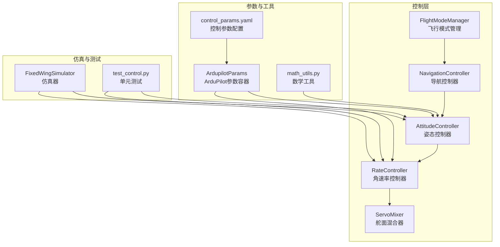
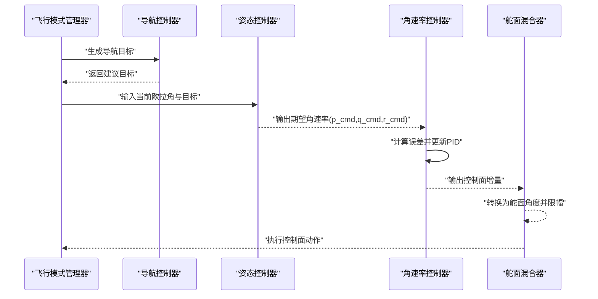
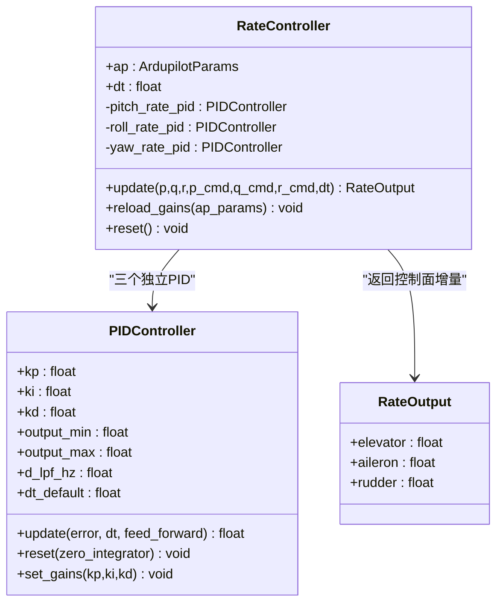
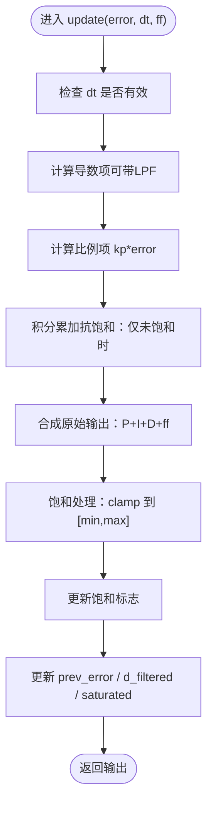
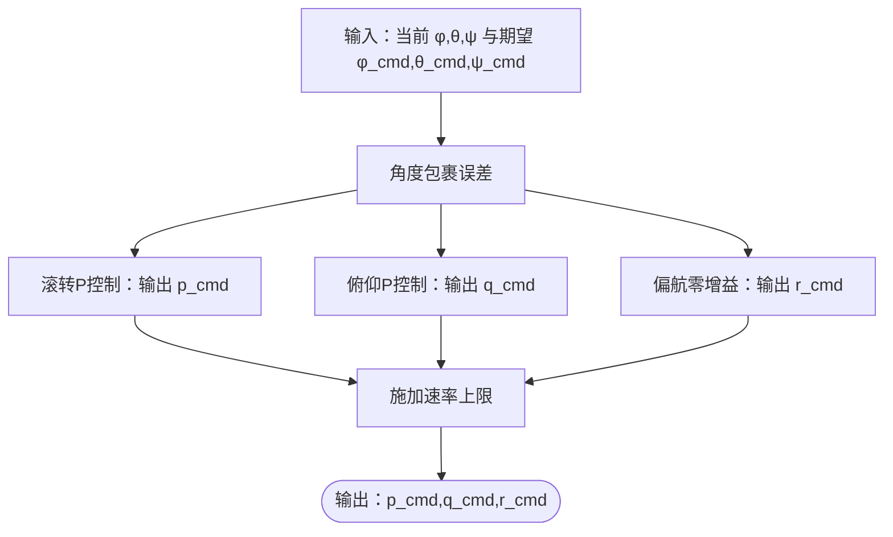
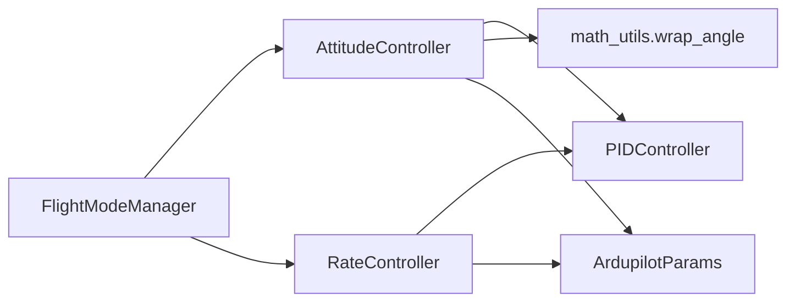

# 角速率控制器

<cite>
**本文引用的文件**
- [src/control/rate_controller.py](file://src/control/rate_controller.py)
- [src/control/pid_controller.py](file://src/control/pid_controller.py)
- [src/control/attitude_controller.py](file://src/control/attitude_controller.py)
- [src/control/ardupilot_compat.py](file://src/control/ardupilot_compat.py)
- [config/control_params.yaml](file://config/control_params.yaml)
- [src/utils/math_utils.py](file://src/utils/math_utils.py)
- [tests/test_control.py](file://tests/test_control.py)
- [src/simulation/simulator.py](file://src/simulation/simulator.py)
- [src/control/flight_mode_manager.py](file://src/control/flight_mode_manager.py)
</cite>

## 目录
1. [简介](#简介)
2. [项目结构](#项目结构)
3. [核心组件](#核心组件)
4. [架构总览](#架构总览)
5. [详细组件分析](#详细组件分析)
6. [依赖关系分析](#依赖关系分析)
7. [性能考量](#性能考量)
8. [故障排查指南](#故障排查指南)
9. [结论](#结论)
10. [附录](#附录)

## 简介
本文件面向角速率控制器（Rate Controller）的技术文档，系统阐述其在固定翼无人机中的实现与应用。重点包括：
- 角速率控制的PID算法实现与参数设计
- 滚转、俯仰、偏航三轴的控制策略与差异
- 角速率限制与防饱和保护机制
- 动态响应优化方法
- 角速率控制与姿态控制的耦合关系与解耦技术

该控制器位于ArduPilot控制层级的最内环（SAS稳定性增强），直接接收来自姿态控制器的角速率命令，并通过独立的PID回路生成副翼、升降舵、方向舵的增量输出，形成闭环稳定控制。

## 项目结构
与角速率控制直接相关的模块与文件如下：
- 控制层：姿态控制器、角速率控制器、PID控制器、飞行模式管理器
- 参数：ArduPilot兼容参数容器、控制参数配置文件
- 工具：数学工具（角度包裹、饱和等）
- 测试：单元测试覆盖PID、参数、姿态与角速率控制器行为
- 示例：轨迹跟踪示例展示角速率与控制面输出的历史曲线

图表来源
- [src/control/flight_mode_manager.py](file://src/control/flight_mode_manager.py#L115-L200)
- [src/control/navigation_controller.py](file://src/control/navigation_controller.py#L1-L200)
- [src/control/attitude_controller.py](file://src/control/attitude_controller.py#L33-L134)
- [src/control/rate_controller.py](file://src/control/rate_controller.py#L32-L109)
- [src/control/servo_mixer.py](file://src/control/servo_mixer.py#L1-L200)
- [src/control/ardupilot_compat.py](file://src/control/ardupilot_compat.py#L17-L130)
- [config/control_params.yaml](file://config/control_params.yaml#L1-L45)
- [src/utils/math_utils.py](file://src/utils/math_utils.py#L1-L124)
- [src/simulation/simulator.py](file://src/simulation/simulator.py#L115-L200)
- [tests/test_control.py](file://tests/test_control.py#L1-L371)

章节来源
- [src/control/rate_controller.py](file://src/control/rate_controller.py#L1-L109)
- [src/control/attitude_controller.py](file://src/control/attitude_controller.py#L1-L134)
- [src/control/pid_controller.py](file://src/control/pid_controller.py#L1-L117)
- [src/control/ardupilot_compat.py](file://src/control/ardupilot_compat.py#L1-L130)
- [config/control_params.yaml](file://config/control_params.yaml#L1-L45)
- [src/utils/math_utils.py](file://src/utils/math_utils.py#L1-L124)
- [tests/test_control.py](file://tests/test_control.py#L1-L371)
- [src/simulation/simulator.py](file://src/simulation/simulator.py#L1-L200)
- [src/control/flight_mode_manager.py](file://src/control/flight_mode_manager.py#L1-L200)

## 核心组件
- 角速率控制器（RateController）
  - 输入：测量角速率（p, q, r）与期望角速率（p_cmd, q_cmd, r_cmd）
  - 输出：副翼、升降舵、方向舵的归一化增量（-1..1）
  - 实现：三个独立的PID控制器，分别对应滚转、俯仰、偏航轴
  - 特点：采用前馈项；输出限幅；支持热重载参数

- PID控制器（PIDController）
  - 结构：P/I/D三项，带导数低通滤波
  - 抗饱和：基于“夹钳式”积分抗饱和（饱和时不累积积分）
  - 功能：更新输出、复位状态、运行时调整增益

- 姿态控制器（AttitudeController）
  - 输入：当前欧拉角与期望欧拉角
  - 输出：期望角速率（rad/s），并施加物理速率上限
  - 特点：滚转/俯仰使用P控制，偏航无外环（零增益）

- ArduPilot参数容器（ArdupilotParams）
  - 提供与ArduPilot Plane一致的参数命名
  - 支持从YAML加载、保存与基本范围校验

- 数学工具（math_utils）
  - 角度包裹、饱和、角度换算、欧拉角-角速率转换等

章节来源
- [src/control/rate_controller.py](file://src/control/rate_controller.py#L32-L109)
- [src/control/pid_controller.py](file://src/control/pid_controller.py#L17-L117)
- [src/control/attitude_controller.py](file://src/control/attitude_controller.py#L33-L134)
- [src/control/ardupilot_compat.py](file://src/control/ardupilot_compat.py#L17-L130)
- [src/utils/math_utils.py](file://src/utils/math_utils.py#L1-L124)

## 架构总览
角速率控制是ArduPilot控制层级的最内环（SAS），其控制链路如下：
- 飞行模式管理器根据当前模式生成控制目标（期望角度或角速率）
- 导航控制器提供路径/高度/速度目标
- 姿态控制器将期望角度转换为期望角速率，并施加速率上限
- 角速率控制器对每个轴执行独立PID控制，结合前馈生成控制面增量
- 舵面混合器将控制面增量转换为实际舵面偏角并进行限幅

图表来源
- [src/control/flight_mode_manager.py](file://src/control/flight_mode_manager.py#L173-L200)
- [src/control/navigation_controller.py](file://src/control/navigation_controller.py#L1-L200)
- [src/control/attitude_controller.py](file://src/control/attitude_controller.py#L81-L122)
- [src/control/rate_controller.py](file://src/control/rate_controller.py#L68-L98)
- [src/control/servo_mixer.py](file://src/control/servo_mixer.py#L1-L200)

## 详细组件分析

### 角速率控制器（RateController）
- 独立PID结构
  - 滚转轴：使用ROLL_RATE_P/I/D与前馈
  - 俯仰轴：使用PTCH_RATE_P/I/D与前馈
  - 偏航轴：使用YAW_RATE_P/I/D与前馈
- 前馈策略
  - 在更新函数中先计算前馈项，再进行PID更新，确保前馈叠加到输出端
- 输出限幅
  - 所有轴输出均被限制在[-1, 1]范围内，避免过度驱动控制面
- 热重载与复位
  - 支持在运行时重新加载参数并重建PID控制器
  - 提供复位接口，清空积分器与历史状态

图表来源
- [src/control/rate_controller.py](file://src/control/rate_controller.py#L32-L109)
- [src/control/pid_controller.py](file://src/control/pid_controller.py#L17-L117)

章节来源
- [src/control/rate_controller.py](file://src/control/rate_controller.py#L32-L109)

### PID控制器（PIDController）
- 结构与特性
  - P/I/D三项，导数可选低通滤波
  - 抗饱和：仅在未饱和时积分，且对积分值本身进行限幅
  - 输出饱和后记录饱和标志，防止积分风车效应
- 更新流程
  - 计算导数项（可带LPF）
  - 计算比例项
  - 积分累加（受抗饱和约束）
  - 合成原始输出，饱和处理并更新饱和标志
  - 更新历史状态（误差、导数滤波值）
- 运行时调整
  - 支持按需修改P/I/D增益
  - 复位接口用于模式切换或异常恢复

图表来源
- [src/control/pid_controller.py](file://src/control/pid_controller.py#L55-L98)

章节来源
- [src/control/pid_controller.py](file://src/control/pid_controller.py#L17-L117)

### 姿态控制器（AttitudeController）
- 目标
  - 将期望欧拉角转换为期望角速率，作为角速率控制器的输入
- 控制策略
  - 滚转与俯仰使用P控制（无D），输出即期望角速率
  - 偏航无外环（零增益），直接传递期望角速率
- 速率上限
  - 对各轴期望角速率施加物理上限（度/秒），避免超出控制能力
- 角度包裹
  - 使用角度包裹函数保证误差在[-π, π]范围内

图表来源
- [src/control/attitude_controller.py](file://src/control/attitude_controller.py#L81-L122)
- [src/utils/math_utils.py](file://src/utils/math_utils.py#L13-L25)

章节来源
- [src/control/attitude_controller.py](file://src/control/attitude_controller.py#L33-L134)
- [src/utils/math_utils.py](file://src/utils/math_utils.py#L1-L124)

### 参数设计与配置
- ArduPilot参数容器
  - 定义了角速率控制所需的增益与前馈参数（PTCH_RATE_*、ROLL_RATE_*、YAW_RATE_*）
  - 提供默认值与范围校验，支持从YAML加载
- 控制参数配置文件
  - 提供不同轴的P/I/D与前馈参数，以及姿态/速率上限等
  - 与ArduPilot参数容器字段保持一致，便于迁移与调试

章节来源
- [src/control/ardupilot_compat.py](file://src/control/ardupilot_compat.py#L17-L130)
- [config/control_params.yaml](file://config/control_params.yaml#L1-L45)

### 角速率限制与防饱和保护
- 速率限制
  - 姿态控制器对期望角速率施加物理上限，避免越界
- 输出限幅
  - 角速率控制器输出统一限制在[-1, 1]，防止控制面过驱
- 抗饱和机制
  - PID控制器在输出饱和时停止积分累积，防止积分风车
  - 积分值本身也被限制在输出范围内

章节来源
- [src/control/attitude_controller.py](file://src/control/attitude_controller.py#L45-L48)
- [src/control/rate_controller.py](file://src/control/rate_controller.py#L53-L64)
- [src/control/pid_controller.py](file://src/control/pid_controller.py#L84-L95)

### 动态响应优化方法
- 前馈增益（FF）
  - 在角速率控制器中，前馈项叠加到PID输出，有助于快速跟踪指令并抑制稳态误差
- 导数低通滤波
  - 导数项可选低通滤波，抑制高频噪声与量测噪声对控制的影响
- 抗饱和策略
  - 仅在未饱和时积分，显著提升系统在强阶跃输入下的稳定性
- 参数整定建议
  - 优先调整P增益获得足够响应；在出现振荡时引入D；若存在稳态误差则适度增加I（注意抗饱和）
  - 通过前馈抵消部分指令影响，提高跟踪精度

章节来源
- [src/control/rate_controller.py](file://src/control/rate_controller.py#L90-L96)
- [src/control/pid_controller.py](file://src/control/pid_controller.py#L72-L78)
- [src/control/pid_controller.py](file://src/control/pid_controller.py#L84-L95)

### 角速率控制与姿态控制的耦合与解耦
- 耦合关系
  - 姿态控制器输出期望角速率，角速率控制器将其转化为控制面增量，二者构成内环-外环的典型耦合
- 解耦技术
  - 通过前馈（角速率控制器）与抗饱和（PID）降低内外环耦合带来的超调与振荡
  - 姿态控制器对期望角速率施加上限，避免角速率控制器承受过大指令
  - 偏航轴无姿态外环，直接由导航/模式逻辑给出角速率指令，简化耦合

章节来源
- [src/control/attitude_controller.py](file://src/control/attitude_controller.py#L71-L77)
- [src/control/rate_controller.py](file://src/control/rate_controller.py#L90-L96)

## 依赖关系分析
- 组件耦合
  - RateController依赖PIDController与ArdupilotParams
  - AttitudeController依赖PIDController与数学工具（角度包裹、饱和）
  - FlightModeManager生成ControlTarget，驱动姿态/角速率控制器
- 外部依赖
  - NumPy用于数值计算
  - 数据类用于结构化输出与参数传递

图表来源
- [src/control/attitude_controller.py](file://src/control/attitude_controller.py#L20-L22)
- [src/control/rate_controller.py](file://src/control/rate_controller.py#L20-L21)
- [src/control/pid_controller.py](file://src/control/pid_controller.py#L13-L14)
- [src/utils/math_utils.py](file://src/utils/math_utils.py#L13-L25)
- [src/control/flight_mode_manager.py](file://src/control/flight_mode_manager.py#L173-L200)

章节来源
- [src/control/attitude_controller.py](file://src/control/attitude_controller.py#L1-L134)
- [src/control/rate_controller.py](file://src/control/rate_controller.py#L1-L109)
- [src/control/pid_controller.py](file://src/control/pid_controller.py#L1-L117)
- [src/utils/math_utils.py](file://src/utils/math_utils.py#L1-L124)
- [src/control/flight_mode_manager.py](file://src/control/flight_mode_manager.py#L1-L200)

## 性能考量
- 计算复杂度
  - 每步包含三次PID更新与一次前馈叠加，整体开销较小，适合实时控制
- 数值稳定性
  - 导数低通滤波与抗饱和机制有效抑制噪声与积分风车
- 响应速度
  - 前馈与合适的P/D增益可显著提升响应速度；I增益需谨慎使用以避免振荡
- 参数鲁棒性
  - ArduPilot参数容器提供默认值与范围校验，便于快速部署与安全运行

## 故障排查指南
- 角速率控制器输出恒为零
  - 检查期望角速率是否为零（姿态控制器输出上限）
  - 确认PID增益是否合理，避免积分饱和导致无效输出
- 控制面输出饱和
  - 检查RateController输出是否被限制在[-1, 1]
  - 适当降低期望角速率或增大P增益
- 姿态/角速率振荡
  - 减小P增益或增大导数低通截止频率
  - 检查是否存在外部扰动（如风模型）
- 参数加载失败
  - 确认control_params.yaml路径正确且字段名与ArdupilotParams一致
  - 使用validate()进行范围检查

章节来源
- [tests/test_control.py](file://tests/test_control.py#L259-L305)
- [src/control/ardupilot_compat.py](file://src/control/ardupilot_compat.py#L104-L129)

## 结论
角速率控制器通过独立的三轴PID回路与前馈策略，实现了对滚转、俯仰、偏航角速率的高精度控制。配合姿态控制器的速率上限与抗饱和机制，系统在保证稳定性的同时具备良好的动态响应。通过合理的参数整定与前馈/低通滤波配置，可进一步提升跟踪性能与抗干扰能力。

## 附录
- 关键参数位置
  - 角速率控制增益与前馈：见ArduPilot参数容器与控制参数配置文件
  - 角速率上限：见姿态控制器中的MAX_ROLL_RATE/MAX_PITCH_RATE/MAX_YAW_RATE
- 单元测试参考
  - 测试覆盖了PID控制器的抗饱和、复位、前馈等关键行为，以及角速率控制器的零误差输出与输出限幅

章节来源
- [config/control_params.yaml](file://config/control_params.yaml#L7-L23)
- [src/control/attitude_controller.py](file://src/control/attitude_controller.py#L45-L48)
- [tests/test_control.py](file://tests/test_control.py#L58-L305)