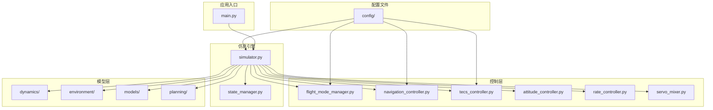
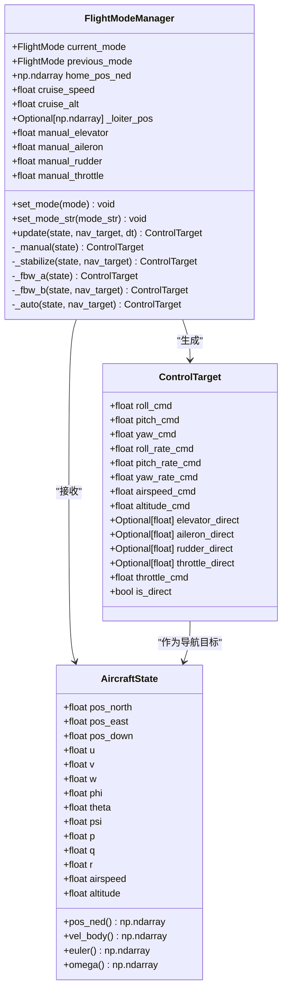
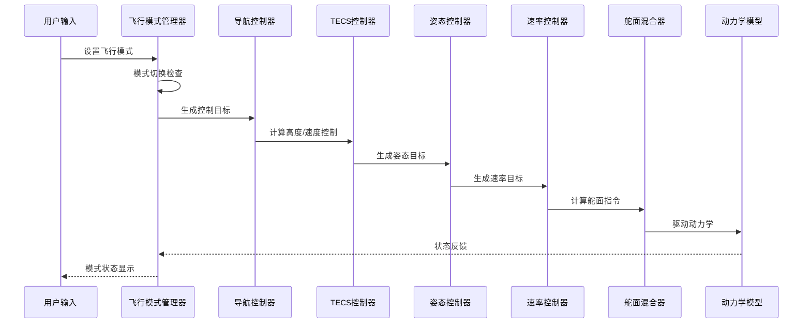
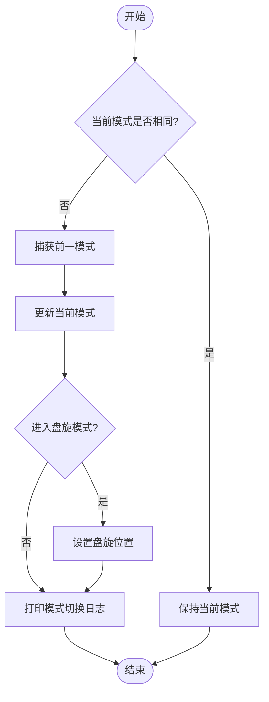
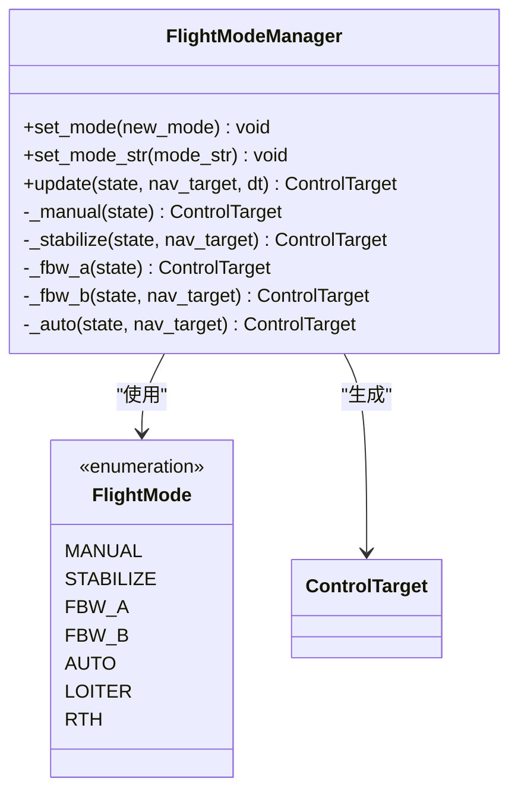
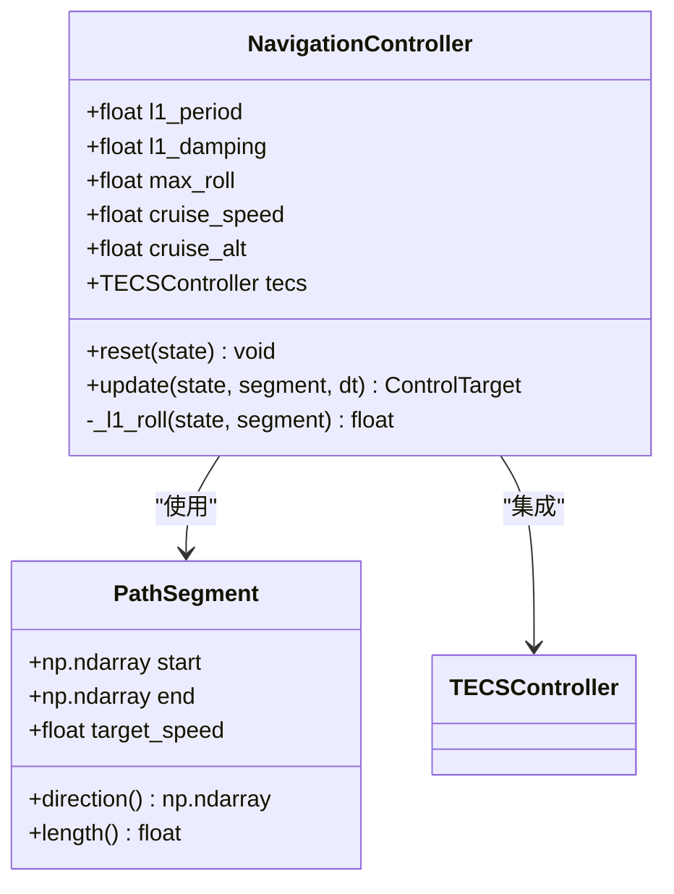
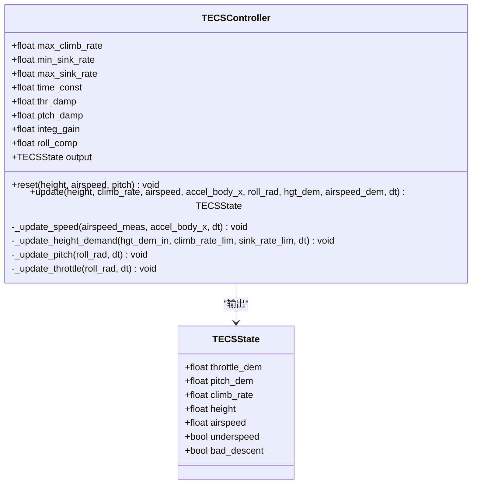
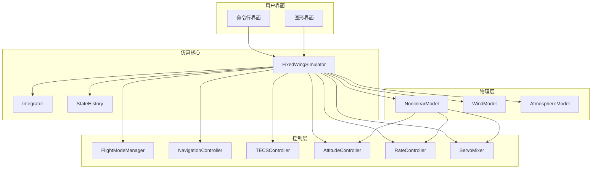
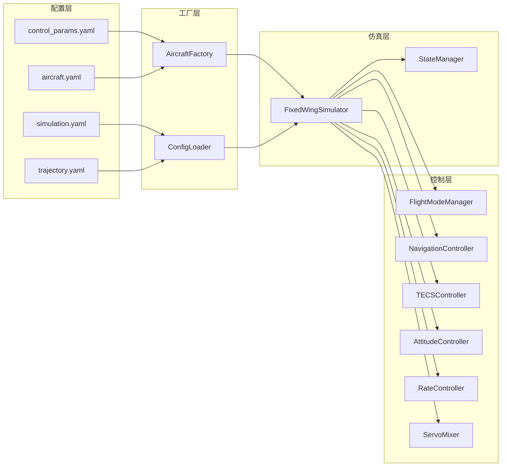

# 飞行模式管理器

<cite>
**本文档引用的文件**
- [flight_mode_manager.py](file://src/control/flight_mode_manager.py)
- [navigation_controller.py](file://src/control/navigation_controller.py)
- [tecs_controller.py](file://src/control/tecs_controller.py)
- [simulator.py](file://src/simulation/simulator.py)
- [state_manager.py](file://src/simulation/state_manager.py)
- [aircraft_factory.py](file://src/models/aircraft_factory.py)
- [config_loader.py](file://src/utils/config_loader.py)
- [control_params.yaml](file://config/control_params.yaml)
- [aircraft.yaml](file://config/aircraft.yaml)
- [simulation.yaml](file://config/simulation.yaml)
- [trajectory.yaml](file://config/trajectory.yaml)
- [main.py](file://main.py)
</cite>

## 目录
1. [简介](#简介)
2. [项目结构](#项目结构)
3. [核心组件](#核心组件)
4. [架构概览](#架构概览)
5. [详细组件分析](#详细组件分析)
6. [依赖关系分析](#依赖关系分析)
7. [性能考虑](#性能考虑)
8. [故障排除指南](#故障排除指南)
9. [结论](#结论)
10. [附录](#附录)

## 简介

飞行模式管理器是固定翼无人机仿真系统的核心控制模块，负责管理飞行模式的切换、执行和状态转换。该系统实现了与ArduPilot Plane兼容的飞行模式，包括手动模式、稳定模式、飞控模式A/B、自动模式、盘旋模式和返航模式。

系统采用五层控制架构，从飞行模式管理器开始，向下连接导航控制器、TECS控制系统、姿态控制器和速率控制器，最终通过舵面混合器驱动实际的飞行器动力学模型。

## 项目结构

项目采用模块化的分层架构设计，主要目录结构如下：

**图表来源**
- [main.py](file://main.py#L1-L145)
- [simulator.py](file://src/simulation/simulator.py#L1-L642)

**章节来源**
- [main.py](file://main.py#L1-L145)
- [simulator.py](file://src/simulation/simulator.py#L1-L642)

## 核心组件

### 飞行模式枚举

系统支持七种标准飞行模式，每种模式都有特定的控制策略和应用场景：

| 模式名称 | 模式代码 | 控制策略 | 应用场景 |
|---------|---------|---------|----------|
| 手动模式 | MANUAL | 直接传递操纵杆输入 | 人工驾驶、测试、紧急情况 |
| 稳定模式 | STABILIZE | 机翼水平保持，使用导航命令 | 基础飞行训练、简单任务 |
| 飞控A模式 | FBW_A | 滚转/俯仰角度限制，仿真保持 | 飞控系统测试、性能评估 |
| 飞控B模式 | FBW_B | 高度保持 + 速度保持，使用导航命令 | 复杂任务、精确控制 |
| 自动模式 | AUTO | 轨迹跟踪，使用导航目标 | 无人自主飞行、任务执行 |
| 盘旋模式 | LOITER | 固定点盘旋，固定高度 | 观察、等待、搜索 |
| 返航模式 | RTH | 返回起飞点，保持巡航高度 | 安全返回、应急处理 |

### 数据结构设计

系统使用数据类来封装关键的状态信息：

**图表来源**
- [flight_mode_manager.py](file://src/control/flight_mode_manager.py#L28-L298)

**章节来源**
- [flight_mode_manager.py](file://src/control/flight_mode_manager.py#L1-L298)

## 架构概览

系统采用分层控制架构，实现从高层飞行模式到底层执行器的完整控制链路：

**图表来源**
- [simulator.py](file://src/simulation/simulator.py#L499-L521)
- [flight_mode_manager.py](file://src/control/flight_mode_manager.py#L173-L212)

### 模式切换逻辑

系统实现了智能的模式切换机制，确保飞行过程中的安全性和连续性：

**图表来源**
- [flight_mode_manager.py](file://src/control/flight_mode_manager.py#L152-L163)

**章节来源**
- [flight_mode_manager.py](file://src/control/flight_mode_manager.py#L148-L168)

## 详细组件分析

### 飞行模式管理器

飞行模式管理器是整个系统的控制中枢，负责模式选择、状态管理和控制目标生成。

#### 模式切换机制

系统实现了完整的模式切换流程，包括状态检查、历史记录和条件判断：

**图表来源**
- [flight_mode_manager.py](file://src/control/flight_mode_manager.py#L115-L298)

#### 各模式控制策略

**手动模式 (MANUAL)**
- 直接传递操纵杆输入到执行器
- 绕过所有控制环路
- 适用于人工驾驶和测试

**稳定模式 (STABILIZE)**
- 保持机翼水平
- 使用导航提供的俯仰和油门命令
- 适用于基础飞行训练

**飞控A模式 (FBW_A)**
- 滚转角跟随当前滚转角
- 俯仰角保持水平
- 仿真环境下的简化飞控

**飞控B模式 (FBW_B)**
- 高度保持和速度保持
- 使用导航命令进行精确控制

**自动模式 (AUTO)**
- 轨迹跟踪和路径导航
- 使用导航控制器的目标

**盘旋模式 (LOITER)**
- 在固定点周围盘旋
- 保持固定高度

**返航模式 (RTH)**
- 返回起飞点
- 保持巡航高度

**章节来源**
- [flight_mode_manager.py](file://src/control/flight_mode_manager.py#L194-L298)

### 导航控制器

导航控制器实现了L1横向导航定律和TECS纵向控制系统的组合：

**图表来源**
- [navigation_controller.py](file://src/control/navigation_controller.py#L45-L293)

#### L1横向导航定律

L1导航算法通过前瞻距离计算实现精确的路径跟踪：

1. **投影计算**: 将飞机位置投影到路径段上
2. **前瞻点选择**: 基于前进速度和L1周期确定前瞻点
3. **角度计算**: 计算当前航迹与前瞻方向的夹角
4. **横向加速度**: 根据角度差计算所需的横向加速度
5. **滚转角转换**: 将横向加速度转换为滚转角命令

**章节来源**
- [navigation_controller.py](file://src/control/navigation_controller.py#L206-L293)

### TECS控制系统

TECS（总能量控制系统）是ArduPilot的核心纵向控制算法，实现了高度和速度的耦合控制：

**图表来源**
- [tecs_controller.py](file://src/control/tecs_controller.py#L50-L647)

#### TECS控制算法

TECS算法的核心思想是将高度控制和速度控制耦合在一个统一的能量框架内：

1. **能量估计**: 计算当前的比能（SPE）和动能（SKE）
2. **需求计算**: 基于目标高度和速度计算能量需求
3. **误差分析**: 计算能量误差和能量变化率误差
4. **控制律**: 根据误差计算俯仰角和油门指令
5. **保护机制**: 实现欠速保护和不可达下沉检测

**章节来源**
- [tecs_controller.py](file://src/control/tecs_controller.py#L247-L316)

### 系统集成

仿真引擎将所有组件整合到一个完整的控制循环中：

**图表来源**
- [simulator.py](file://src/simulation/simulator.py#L115-L642)

**章节来源**
- [simulator.py](file://src/simulation/simulator.py#L115-L642)

## 依赖关系分析

系统采用松耦合的设计原则，通过明确的接口定义实现模块间的交互：

**图表来源**
- [aircraft_factory.py](file://src/models/aircraft_factory.py#L39-L136)
- [config_loader.py](file://src/utils/config_loader.py#L59-L82)

### 关键依赖关系

1. **配置依赖**: 所有控制参数都来自配置文件，支持运行时修改
2. **工厂模式**: 使用工厂类创建和管理配置对象
3. **接口抽象**: 通过数据类定义清晰的接口契约
4. **模块解耦**: 各组件通过明确定义的数据结构进行通信

**章节来源**
- [aircraft_factory.py](file://src/models/aircraft_factory.py#L39-L136)
- [config_loader.py](file://src/utils/config_loader.py#L59-L82)

## 性能考虑

系统在设计时充分考虑了实时性能和数值稳定性：

### 数值稳定性

1. **积分器选择**: 使用DOPRI5自适应步长积分器，平衡精度和性能
2. **限幅保护**: 所有控制输出都经过严格的限幅处理
3. **滤波器设计**: 采用低通滤波器平滑信号，减少高频噪声

### 实时性能

1. **时间步长**: 支持可配置的时间步长，默认10ms
2. **内存管理**: 使用预分配数组减少动态内存分配
3. **计算优化**: 采用向量化操作提高计算效率

### 控制性能

1. **参数调优**: 提供丰富的控制参数，支持不同飞行器的定制
2. **自适应机制**: TECS具有自适应爬升/下降限制
3. **保护机制**: 实现欠速保护和不可达下沉检测

## 故障排除指南

### 常见问题及解决方案

**模式切换失败**
- 检查模式枚举值是否正确
- 确认飞行器处于稳定状态
- 验证控制参数配置

**控制不稳定**
- 检查PID参数设置
- 验证风场配置
- 确认积分器状态

**仿真异常**
- 检查初始条件设置
- 验证数值积分器配置
- 确认物理参数准确性

### 调试工具

系统提供了多种调试和监控功能：

1. **状态记录**: 完整记录仿真过程中的所有状态变量
2. **可视化**: 支持2D和3D可视化输出
3. **日志系统**: 详细的运行时日志记录
4. **参数验证**: 自动验证控制参数的有效性

**章节来源**
- [state_manager.py](file://src/simulation/state_manager.py#L95-L193)

## 结论

飞行模式管理器是一个设计精良、功能完整的固定翼无人机控制系统。系统实现了与ArduPilot兼容的标准飞行模式，提供了灵活的配置选项和强大的扩展能力。

### 主要优势

1. **模块化设计**: 清晰的分层架构便于维护和扩展
2. **标准化接口**: 与ArduPilot生态系统完全兼容
3. **实时性能**: 优化的数值算法确保实时控制性能
4. **安全性**: 完善的保护机制确保飞行安全
5. **可配置性**: 丰富的参数配置满足不同应用场景

### 发展建议

1. **增强模式**: 可以添加更多专业飞行模式
2. **机器学习**: 集成机器学习算法提升控制性能
3. **多机协同**: 支持多无人机编队飞行
4. **云端集成**: 提供云端数据分析和远程监控

## 附录

### 配置文件说明

系统使用YAML格式的配置文件，支持层次化的参数管理：

**控制参数 (control_params.yaml)**
- 飞行器性能参数
- 控制器PID参数
- 保护阈值设置
- TECS控制参数

**飞机配置 (aircraft.yaml)**
- 飞机型号选择
- 参数覆盖配置
- 数据库参数引用

**仿真配置 (simulation.yaml)**
- 仿真时间设置
- 初始条件配置
- 风场参数设置
- 日志记录配置

**轨迹配置 (trajectory.yaml)**
- 轨迹类型选择
- 航路点定义
- 飞行参数设置

### 快速开始指南

1. **安装依赖**: `pip install -r requirements.txt`
2. **运行仿真**: `python main.py --aircraft TB2 --mode AUTO`
3. **查看结果**: 查看输出目录中的CSV文件和图像
4. **自定义配置**: 修改config目录下的配置文件

### API参考

系统提供了完整的Python API，支持程序化控制和集成：

- **FlightModeManager**: 飞行模式管理
- **NavigationController**: 导航控制
- **TECSController**: 纵向控制
- **FixedWingSimulator**: 仿真引擎
- **AircraftFactory**: 飞机配置工厂