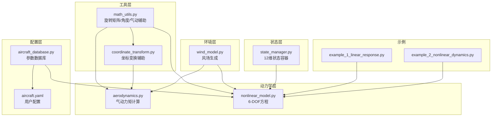
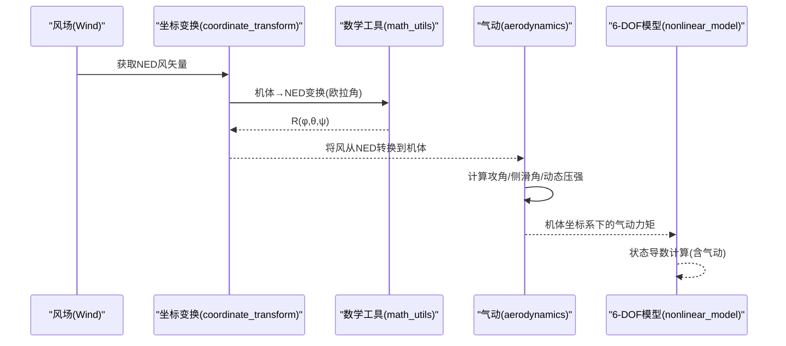
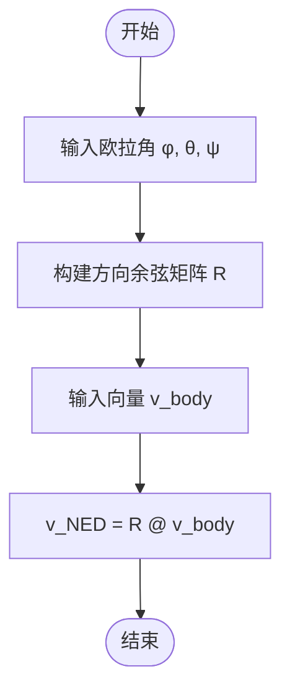
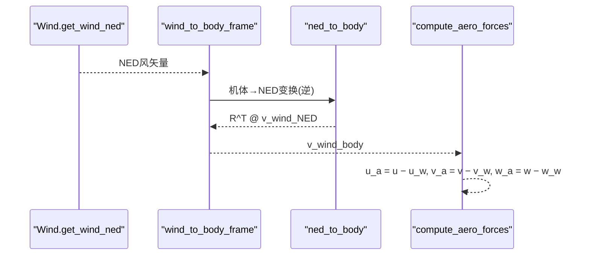
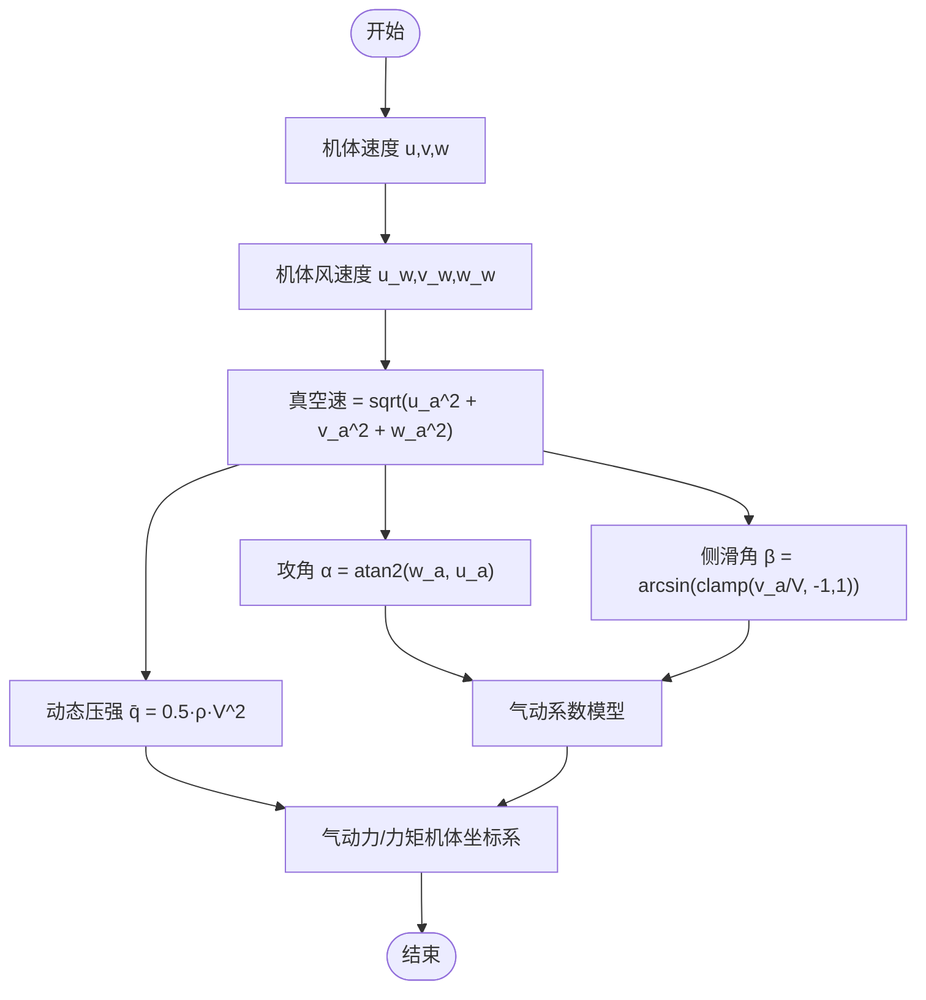
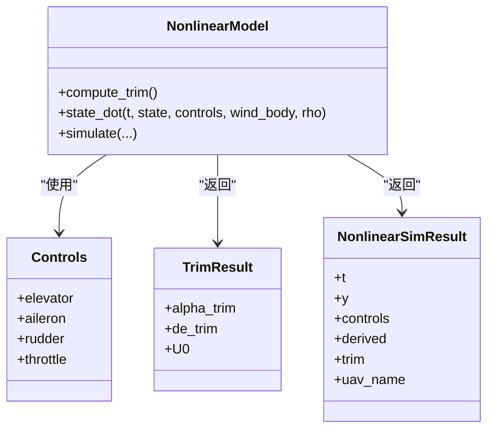
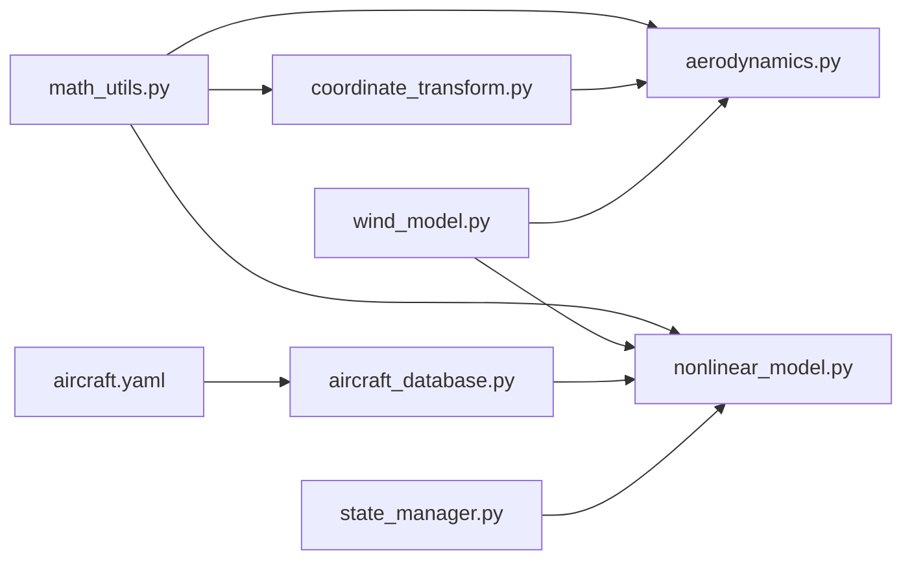

# 坐标系与变换

<cite>
**本文引用的文件**
- [coordinate_transform.py](file://src/dynamics/coordinate_transform.py)
- [math_utils.py](file://src/utils/math_utils.py)
- [wind_model.py](file://src/environment/wind_model.py)
- [aerodynamics.py](file://src/dynamics/aerodynamics.py)
- [nonlinear_model.py](file://src/dynamics/nonlinear_model.py)
- [state_manager.py](file://src/simulation/state_manager.py)
- [aircraft_database.py](file://src/models/aircraft_database.py)
- [aircraft.yaml](file://config/aircraft.yaml)
- [example_1_linear_response.py](file://examples/example_1_linear_response.py)
- [example_2_nonlinear_dynamics.py](file://examples/example_2_nonlinear_dynamics.py)
</cite>

## 目录
1. [引言](#引言)
2. [项目结构](#项目结构)
3. [核心组件](#核心组件)
4. [架构总览](#架构总览)
5. [详细组件分析](#详细组件分析)
6. [依赖分析](#依赖分析)
7. [性能考虑](#性能考虑)
8. [故障排除指南](#故障排除指南)
9. [结论](#结论)
10. [附录](#附录)

## 引言
本文件围绕固定翼飞行器常用的三个坐标系：机体坐标系（Body Frame）、地理坐标系（Earth/NED Frame）、速度坐标系（Wind Frame），系统性阐述其定义、特点与相互间的变换关系。重点覆盖以下内容：
- 欧拉角（3-2-1顺序）与方向余弦矩阵（DCM）的数学表达与实现
- 各坐标系之间的向量变换流程与代码路径
- 真空速与风的关系、侧滑角与攻角的计算
- 坐标系选择对仿真精度与计算效率的影响
- 结合项目中的模块化设计，给出可操作的使用建议与最佳实践

## 项目结构
该仿真系统采用分层模块化组织，坐标系与变换相关的核心逻辑集中在工具函数、动力学模块与状态管理中：
- 工具层：提供通用数学运算与旋转矩阵
- 动力学层：包含气动计算、非线性六自由度模型、坐标变换辅助
- 环境层：风场建模，支持多种类型风
- 状态层：仿真状态容器与历史记录
- 配置层：飞机参数数据库与用户配置文件

图表来源
- [math_utils.py](file://src/utils/math_utils.py#L43-L101)
- [coordinate_transform.py](file://src/dynamics/coordinate_transform.py#L29-L70)
- [wind_model.py](file://src/environment/wind_model.py#L76-L108)
- [aerodynamics.py](file://src/dynamics/aerodynamics.py#L35-L148)
- [nonlinear_model.py](file://src/dynamics/nonlinear_model.py#L160-L200)
- [state_manager.py](file://src/simulation/state_manager.py#L16-L93)
- [aircraft_database.py](file://src/models/aircraft_database.py#L143-L167)
- [aircraft.yaml](file://config/aircraft.yaml#L5-L13)
- [example_1_linear_response.py](file://examples/example_1_linear_response.py#L95-L100)
- [example_2_nonlinear_dynamics.py](file://examples/example_2_nonlinear_dynamics.py#L89-L96)

章节来源
- [math_utils.py](file://src/utils/math_utils.py#L1-L124)
- [coordinate_transform.py](file://src/dynamics/coordinate_transform.py#L1-L70)
- [wind_model.py](file://src/environment/wind_model.py#L1-L113)
- [aerodynamics.py](file://src/dynamics/aerodynamics.py#L1-L148)
- [nonlinear_model.py](file://src/dynamics/nonlinear_model.py#L1-L200)
- [state_manager.py](file://src/simulation/state_manager.py#L1-L193)
- [aircraft_database.py](file://src/models/aircraft_database.py#L1-L183)
- [aircraft.yaml](file://config/aircraft.yaml#L1-L13)
- [example_1_linear_response.py](file://examples/example_1_linear_response.py#L1-L206)
- [example_2_nonlinear_dynamics.py](file://examples/example_2_nonlinear_dynamics.py#L1-L215)

## 核心组件
- 方向余弦矩阵与欧拉角变换
  - 使用3-2-1（ZYX）顺序的欧拉角（滚转φ、俯仰θ、偏航ψ）
  - 提供从机体到NED的变换矩阵与反向变换
- 风场建模
  - 支持无风、常值风、正弦叠加风、随机正弦风
  - 输出NED坐标下的风矢量
- 真空速与风的关系
  - 真空速 = 机体速度 − 机体坐标下的风速度
  - 计算攻角与侧滑角
- 6-DOF非线性模型
  - 状态向量包含机体速度、角速率、欧拉角与NED位置
  - 在气动计算中统一在机体坐标系下进行

章节来源
- [math_utils.py](file://src/utils/math_utils.py#L43-L101)
- [coordinate_transform.py](file://src/dynamics/coordinate_transform.py#L29-L70)
- [wind_model.py](file://src/environment/wind_model.py#L76-L108)
- [aerodynamics.py](file://src/dynamics/aerodynamics.py#L68-L84)
- [nonlinear_model.py](file://src/dynamics/nonlinear_model.py#L160-L200)

## 架构总览
下图展示了坐标系变换在系统中的关键调用链路：风场生成 → 机体速度与风的差值得到真空速 → 攻角与侧滑角计算 → 气动力矩计算（均在机体坐标系）。

图表来源
- [wind_model.py](file://src/environment/wind_model.py#L76-L108)
- [coordinate_transform.py](file://src/dynamics/coordinate_transform.py#L39-L70)
- [math_utils.py](file://src/utils/math_utils.py#L43-L101)
- [aerodynamics.py](file://src/dynamics/aerodynamics.py#L35-L148)
- [nonlinear_model.py](file://src/dynamics/nonlinear_model.py#L160-L200)

## 详细组件分析

### 1) 坐标系与变换矩阵
- 定义与约定
  - 采用NED地理坐标系（北-东-下），3-2-1欧拉角顺序（φ=roll, θ=pitch, ψ=yaw）
  - 机体→NED方向余弦矩阵由工具函数提供
- 关键函数
  - 方向余弦矩阵：从欧拉角构造DCM
  - 机体↔NED向量变换：利用DCM与其转置
  - 空速矢量：机体速度减去机体风速度
- 数学要点
  - DCM满足正交性与行列式为1
  - 欧拉角存在奇点（俯仰角±90°附近），数值实现中引入小量ε避免除零

图表来源
- [math_utils.py](file://src/utils/math_utils.py#L43-L77)
- [coordinate_transform.py](file://src/dynamics/coordinate_transform.py#L29-L70)

章节来源
- [math_utils.py](file://src/utils/math_utils.py#L43-L101)
- [coordinate_transform.py](file://src/dynamics/coordinate_transform.py#L29-L70)

### 2) 风场与速度坐标系（Wind Frame）
- 风场类型
  - NONE/FIXED/SINE/RANDOMSINE，支持正弦叠加与随机均值扰动
  - 固定风以NED单位向量预计算，便于快速求值
- 速度坐标系（Wind Frame）
  - 以相对气流方向定义，通常与攻角/侧滑角直接关联
  - 本项目通过“真空气速 = 机体速度 − 机体风速度”间接体现
- 实现要点
  - Wind.get_wind_ned返回NED风矢量
  - coordinate_transform.wind_to_body_frame将NED风转换至机体
  - aerodynamics.compute_aero_forces内部使用风修正后的空速

图表来源
- [wind_model.py](file://src/environment/wind_model.py#L76-L108)
- [coordinate_transform.py](file://src/dynamics/coordinate_transform.py#L39-L53)
- [math_utils.py](file://src/utils/math_utils.py#L74-L77)
- [aerodynamics.py](file://src/dynamics/aerodynamics.py#L68-L76)

章节来源
- [wind_model.py](file://src/environment/wind_model.py#L18-L113)
- [coordinate_transform.py](file://src/dynamics/coordinate_transform.py#L39-L70)
- [aerodynamics.py](file://src/dynamics/aerodynamics.py#L68-L84)

### 3) 攻角、侧滑角与动态压强
- 攻角（α）：基于(u, w)计算
- 侧滑角（β）：基于(v)与真空速计算，数值上对分母进行夹紧
- 动态压强（q̄）：基于密度与真空速计算
- 这些量用于气动系数模型与力矩计算

图表来源
- [aerodynamics.py](file://src/dynamics/aerodynamics.py#L68-L124)
- [math_utils.py](file://src/utils/math_utils.py#L107-L123)

章节来源
- [aerodynamics.py](file://src/dynamics/aerodynamics.py#L35-L148)
- [math_utils.py](file://src/utils/math_utils.py#L107-L123)

### 4) 6-DOF非线性模型与状态
- 状态向量（12维，NED）
  - 机体速度：u, v, w
  - 角速率：p, q, r
  - 欧拉角：φ, θ, ψ
  - 地理位置：x_N, x_E, x_D（NED）
- 气动计算在机体坐标系完成，随后通过DCM将力与力矩转换至NED（在ODE中体现）
- 状态导数由气动力、重力与运动学关系共同决定

图表来源
- [nonlinear_model.py](file://src/dynamics/nonlinear_model.py#L104-L200)

章节来源
- [nonlinear_model.py](file://src/dynamics/nonlinear_model.py#L104-L200)

### 5) 示例与使用场景
- 线性模型示例：演示开环模态分析与闭环PID对比
- 非线性模型示例：展示6-DOF开环脉冲响应与闭环稳定控制
- 两者均通过FixedWingSimulator运行，内部调用上述坐标系与气动模块

章节来源
- [example_1_linear_response.py](file://examples/example_1_linear_response.py#L95-L100)
- [example_2_nonlinear_dynamics.py](file://examples/example_2_nonlinear_dynamics.py#L89-L96)

## 依赖分析
- 模块耦合
  - math_utils是坐标变换与气动计算的基础，被coordinate_transform、aerodynamics、nonlinear_model广泛依赖
  - wind_model独立于坐标变换，但通过coordinate_transform参与风向量的坐标转换
  - state_manager持有12维状态，为nonlinear_model提供状态容器
- 外部依赖
  - NumPy用于数值计算
  - SciPy用于积分求解
- 可能的循环依赖
  - 当前模块间为单向依赖，未发现循环导入

图表来源
- [math_utils.py](file://src/utils/math_utils.py#L1-L124)
- [coordinate_transform.py](file://src/dynamics/coordinate_transform.py#L1-L70)
- [wind_model.py](file://src/environment/wind_model.py#L1-L113)
- [aerodynamics.py](file://src/dynamics/aerodynamics.py#L1-L148)
- [nonlinear_model.py](file://src/dynamics/nonlinear_model.py#L1-L200)
- [state_manager.py](file://src/simulation/state_manager.py#L1-L193)
- [aircraft_database.py](file://src/models/aircraft_database.py#L1-L183)
- [aircraft.yaml](file://config/aircraft.yaml#L1-L13)

章节来源
- [math_utils.py](file://src/utils/math_utils.py#L1-L124)
- [coordinate_transform.py](file://src/dynamics/coordinate_transform.py#L1-L70)
- [wind_model.py](file://src/environment/wind_model.py#L1-L113)
- [aerodynamics.py](file://src/dynamics/aerodynamics.py#L1-L148)
- [nonlinear_model.py](file://src/dynamics/nonlinear_model.py#L1-L200)
- [state_manager.py](file://src/simulation/state_manager.py#L1-L193)
- [aircraft_database.py](file://src/models/aircraft_database.py#L1-L183)
- [aircraft.yaml](file://config/aircraft.yaml#L1-L13)

## 性能考虑
- 计算复杂度
  - 旋转矩阵与三角函数调用为O(1)，整体开销较小
  - 气动计算涉及多项式与三角函数，且可能重复计算攻角/侧滑角
- 数值稳定性
  - 欧拉角奇点处引入小量ε保护；侧滑角分母夹紧避免NaN
- 效率优化建议
  - 预计算与缓存：如风场的NED单位向量、动态压强等
  - 减少重复三角函数调用：在高频仿真中复用中间结果
  - 选择合适的积分器：实时场景优先Dopri5，离线分析可用solve_ivp
- 坐标系选择影响
  - 在机体坐标系下进行气动计算更符合工程习惯，减少额外变换
  - 风场在NED下建模更贴合地理参考，通过DCM转换成本低

## 故障排除指南
- 欧拉角奇异
  - 症状：俯仰角接近±90°时出现数值不稳定或发散
  - 处理：检查euler_rates中的ε保护是否生效；必要时切换参数或使用四元数（当前实现未采用）
- 侧滑角异常
  - 症状：NaN或跳变
  - 处理：确保真空速非零并进行夹紧；检查风修正是否正确
- 风场不一致
  - 症状：风向与预期不符
  - 处理：确认Wind的FROM方向与NED坐标系约定一致；验证风向角度转换
- 状态导数发散
  - 症状：仿真发散
  - 处理：检查气动系数模型、控制输入幅值、积分步长与容差设置

章节来源
- [math_utils.py](file://src/utils/math_utils.py#L79-L101)
- [aerodynamics.py](file://src/dynamics/aerodynamics.py#L112-L118)
- [wind_model.py](file://src/environment/wind_model.py#L50-L56)
- [nonlinear_model.py](file://src/dynamics/nonlinear_model.py#L160-L200)

## 结论
本项目以NED地理坐标系为基准，采用3-2-1欧拉角与方向余弦矩阵实现机体与地理坐标系之间的精确变换；风场在NED下建模并通过DCM转换到机体坐标系参与气动计算。该设计在工程实践中具备良好的直观性与可维护性，同时通过模块化组织实现了清晰的职责分离。对于更高阶需求（如避免奇异性），可在保持接口稳定的前提下引入四元数表示。

## 附录
- 坐标系选择建议
  - 控制律与传感器数据多在机体坐标系下处理，推荐在该坐标系完成气动计算
  - 地理导航与可视化使用NED坐标系，通过DCM进行转换
- 参数来源
  - 飞机参数来自数据库，并注入派生参数（如巡航速度、密度、动态压强）

章节来源
- [aircraft_database.py](file://src/models/aircraft_database.py#L143-L167)
- [aircraft.yaml](file://config/aircraft.yaml#L5-L13)