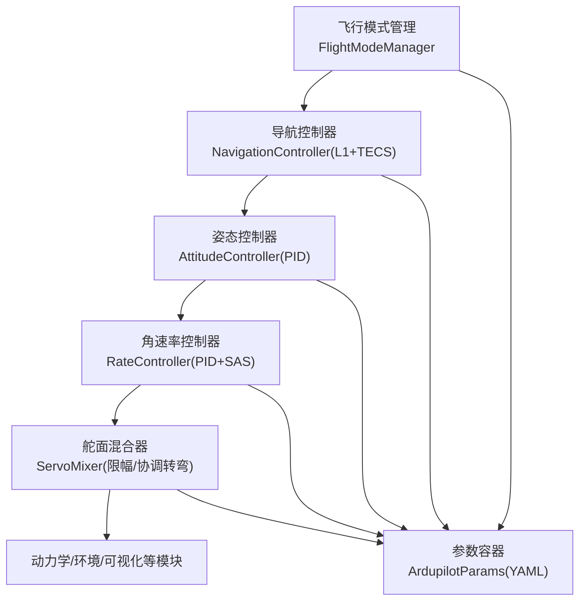
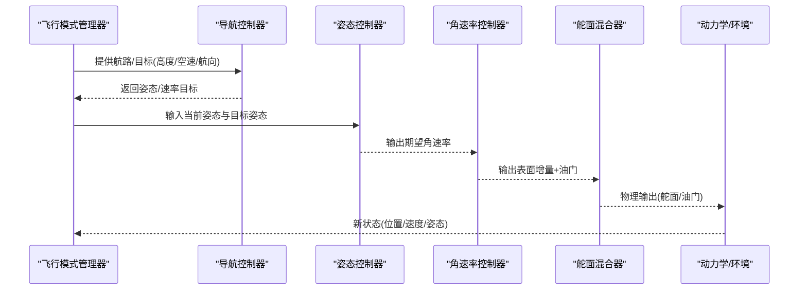
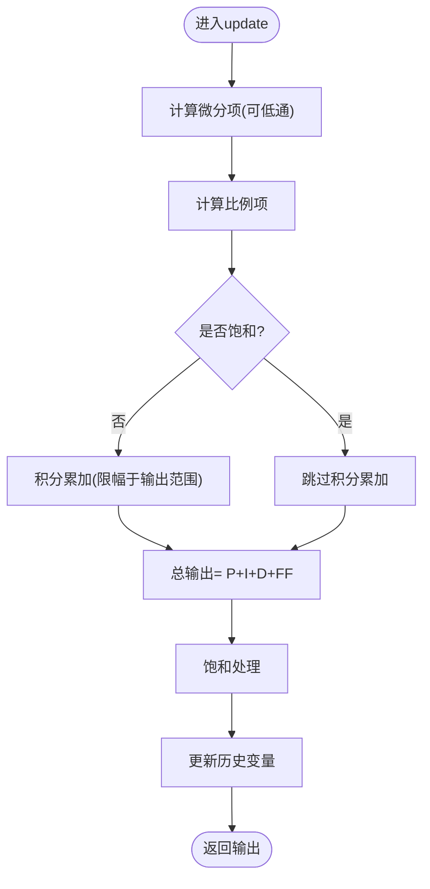
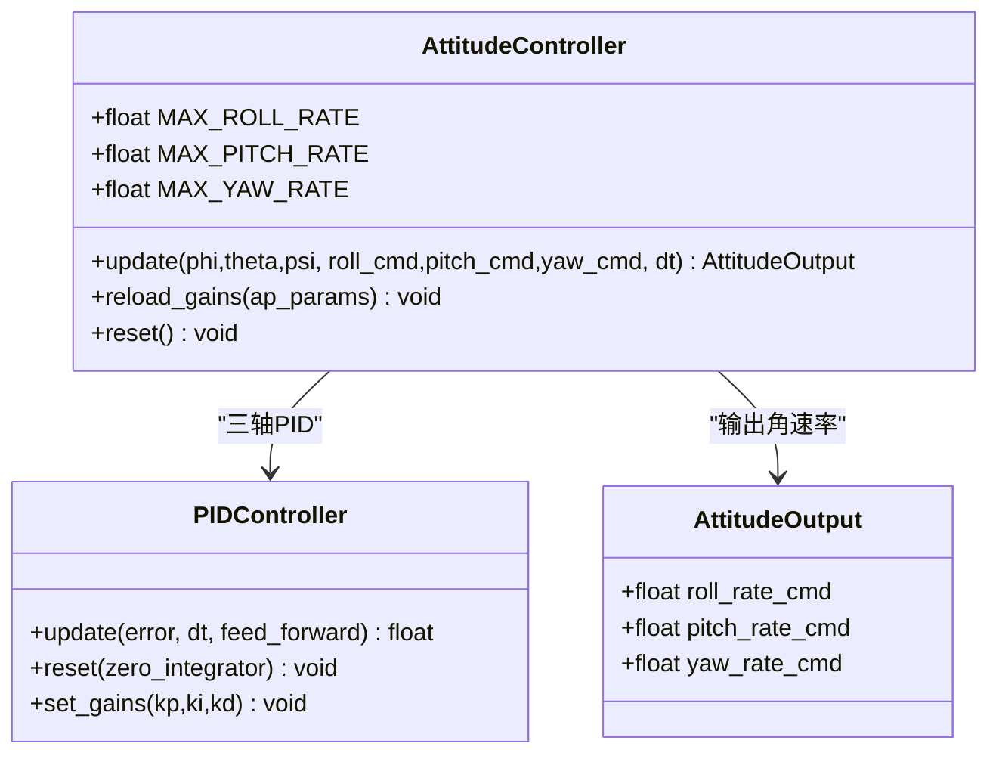
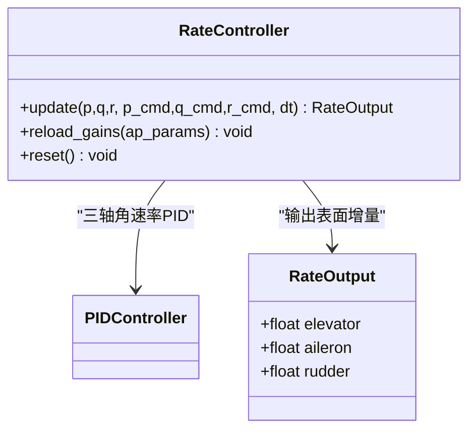
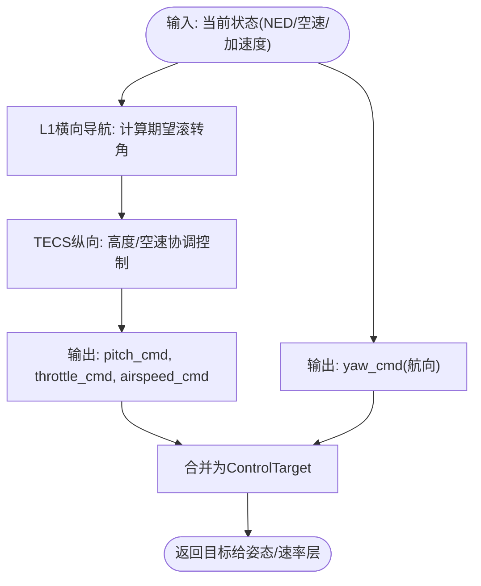
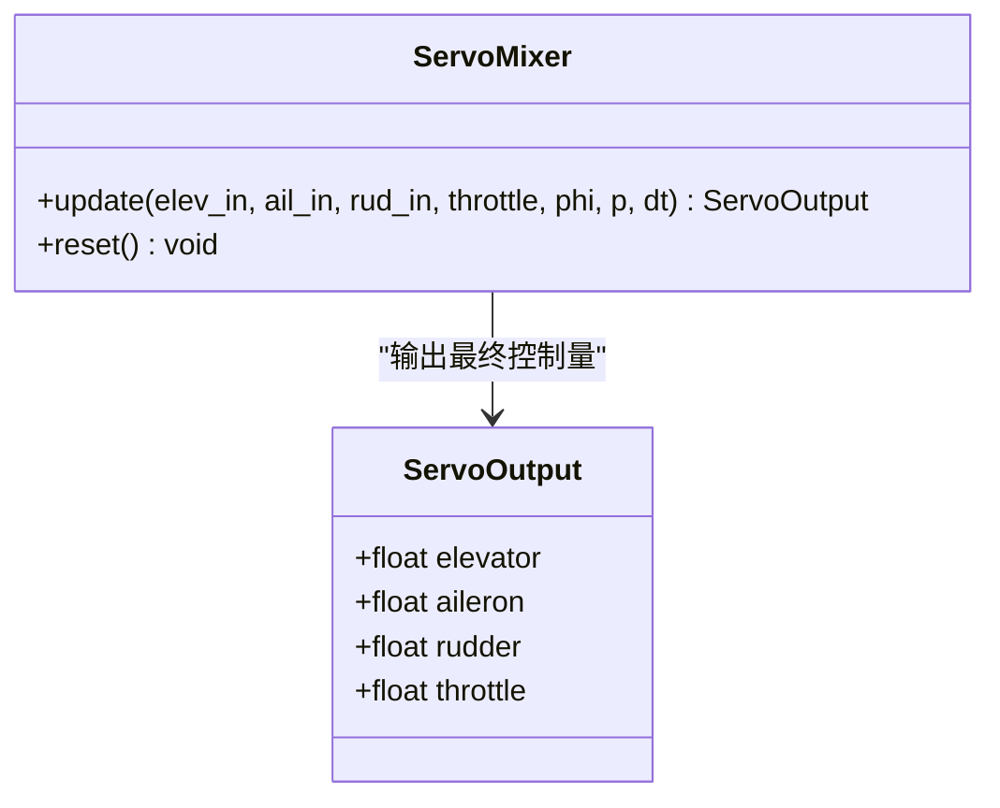
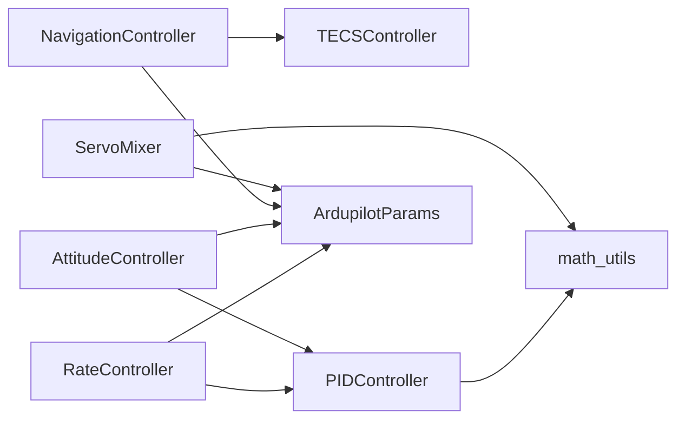

# 控制理论基础

<cite>
**本文引用的文件**   
- [src/control/pid_controller.py](file://src/control/pid_controller.py)
- [src/control/attitude_controller.py](file://src/control/attitude_controller.py)
- [src/control/rate_controller.py](file://src/control/rate_controller.py)
- [src/control/navigation_controller.py](file://src/control/navigation_controller.py)
- [src/control/tecs_controller.py](file://src/control/tecs_controller.py)
- [src/control/ardupilot_compat.py](file://src/control/ardupilot_compat.py)
- [src/control/servo_mixer.py](file://src/control/servo_mixer.py)
- [src/control/flight_mode_manager.py](file://src/control/flight_mode_manager.py)
- [src/utils/math_utils.py](file://src/utils/math_utils.py)
- [config/control_params.yaml](file://config/control_params.yaml)
- [examples/example_1_linear_response.py](file://examples/example_1_linear_response.py)
- [examples/example_2_nonlinear_dynamics.py](file://examples/example_2_nonlinear_dynamics.py)
- [examples/example_3_trajectory_tracking.py](file://examples/example_3_trajectory_tracking.py)
</cite>

## 目录
1. [引言](#引言)
2. [项目结构](#项目结构)
3. [核心组件](#核心组件)
4. [架构总览](#架构总览)
5. [详细组件分析](#详细组件分析)
6. [依赖关系分析](#依赖关系分析)
7. [性能与稳定性考量](#性能与稳定性考量)
8. [故障排查指南](#故障排查指南)
9. [结论](#结论)
10. [附录](#附录)

## 引言
本文件围绕固定翼飞行器的控制理论与实现进行系统化梳理，重点覆盖以下方面：
- PID控制基本原理与参数调节方法
- 反馈控制系统组成与工作机理（传感器、控制器、执行器协同）
- 姿态控制、角速率控制、位置/导航控制的分层设计
- 控制算法的稳定性分析与性能指标评估
- 结合固定翼飞行器特点，解释控制理论在实际飞行中的应用与挑战

## 项目结构
该仓库采用模块化组织方式，控制相关代码集中在 src/control 下，配合配置文件 config、示例脚本 examples、工具函数 utils 等。控制链路自外向内分为五层：导航/路径跟踪（外层）、姿态控制、角速率控制（SAS内环）、执行器混合与限幅、以及飞行模式管理。

**图示来源**
- [src/control/flight_mode_manager.py](file://src/control/flight_mode_manager.py#L115-L298)
- [src/control/navigation_controller.py](file://src/control/navigation_controller.py#L45-L293)
- [src/control/attitude_controller.py](file://src/control/attitude_controller.py#L33-L134)
- [src/control/rate_controller.py](file://src/control/rate_controller.py#L32-L109)
- [src/control/servo_mixer.py](file://src/control/servo_mixer.py#L54-L153)
- [src/control/ardupilot_compat.py](file://src/control/ardupilot_compat.py#L17-L130)

**章节来源**
- [src/control/flight_mode_manager.py](file://src/control/flight_mode_manager.py#L115-L298)
- [src/control/navigation_controller.py](file://src/control/navigation_controller.py#L45-L293)
- [src/control/attitude_controller.py](file://src/control/attitude_controller.py#L33-L134)
- [src/control/rate_controller.py](file://src/control/rate_controller.py#L32-L109)
- [src/control/servo_mixer.py](file://src/control/servo_mixer.py#L54-L153)
- [src/control/ardupilot_compat.py](file://src/control/ardupilot_compat.py#L17-L130)

## 核心组件
- PID控制器：通用离散PID，支持抗积分饱和、微分低通、前馈叠加与运行时参数热更新。
- 姿态控制器：三轴角度闭环，分别对滚转、俯仰、偏航生成期望角速率。
- 角速率控制器（SAS内环）：对角速率误差进行P/D控制，提供阻尼与快速响应。
- 导航控制器：L1横向导航律 + TECS总能量控制，实现航路跟踪与高度/空速协调控制。
- 舵面混合器：将表面增量与油门命令映射到物理执行器输出，施加幅度/速率限制与协调转弯补偿。
- 参数容器：ArduPilot风格参数命名与校验，支持YAML导入导出。
- 数学工具：角度包裹、饱和、旋转矩阵、欧拉角率等基础运算。

**章节来源**
- [src/control/pid_controller.py](file://src/control/pid_controller.py#L17-L117)
- [src/control/attitude_controller.py](file://src/control/attitude_controller.py#L33-L134)
- [src/control/rate_controller.py](file://src/control/rate_controller.py#L32-L109)
- [src/control/navigation_controller.py](file://src/control/navigation_controller.py#L45-L293)
- [src/control/tecs_controller.py](file://src/control/tecs_controller.py#L50-L647)
- [src/control/servo_mixer.py](file://src/control/servo_mixer.py#L54-L153)
- [src/control/ardupilot_compat.py](file://src/control/ardupilot_compat.py#L17-L130)
- [src/utils/math_utils.py](file://src/utils/math_utils.py#L13-L124)

## 架构总览
控制链路采用“外层-内层”的分层结构，导航层负责生成姿态/速率目标，姿态层将其转换为角速率目标，角速率层通过PID与SAS提供阻尼，最后由舵面混合器将控制增量转化为物理输出。飞行模式管理器决定目标来源与过渡逻辑。

**图示来源**
- [src/control/flight_mode_manager.py](file://src/control/flight_mode_manager.py#L173-L298)
- [src/control/navigation_controller.py](file://src/control/navigation_controller.py#L134-L202)
- [src/control/attitude_controller.py](file://src/control/attitude_controller.py#L81-L122)
- [src/control/rate_controller.py](file://src/control/rate_controller.py#L68-L98)
- [src/control/servo_mixer.py](file://src/control/servo_mixer.py#L80-L149)

## 详细组件分析

### PID控制器（通用离散实现）
- 结构：P/I/D三项，带积分抗饱和（仅在未饱和时累加），可选微分低通滤波，支持前馈叠加与运行时参数更新。
- 关键点：积分项限幅于输出范围；饱和判定后禁止积分累积；微分项可选低通以抑制噪声。
- 参数调节建议：先比例后积分再微分；观察超调与稳态误差；必要时引入前馈抵消参考变化。

**图示来源**
- [src/control/pid_controller.py](file://src/control/pid_controller.py#L55-L98)

**章节来源**
- [src/control/pid_controller.py](file://src/control/pid_controller.py#L17-L117)

### 姿态控制器（三轴角度闭环）
- 设计：独立的三轴PID，滚转/俯仰使用P控制，偏航无外环（Pass-through），输出为期望角速率。
- 角度误差采用角度包裹保证±π范围内最短距离。
- 输出限幅：分别对三轴角速率设定上限，避免过度饱和。

**图示来源**
- [src/control/attitude_controller.py](file://src/control/attitude_controller.py#L33-L134)
- [src/control/pid_controller.py](file://src/control/pid_controller.py#L17-L117)

**章节来源**
- [src/control/attitude_controller.py](file://src/control/attitude_controller.py#L33-L134)

### 角速率控制器（SAS内环）
- 设计：三轴角速率PID，提供阻尼与快速响应；在姿态控制器输出基础上引入前馈。
- 参数命名与ArduPilot一致，便于移植与验证。
- 输出归一化到[-1,1]，后续由混合器映射到物理执行器。

**图示来源**
- [src/control/rate_controller.py](file://src/control/rate_controller.py#L32-L109)
- [src/control/pid_controller.py](file://src/control/pid_controller.py#L17-L117)

**章节来源**
- [src/control/rate_controller.py](file://src/control/rate_controller.py#L32-L109)

### 导航控制器（L1横向 + TECS）
- L1横向导航：基于Look-ahead点的横向引导，考虑真实地速方向（NE投影）以应对侧风/偏航。
- TECS纵向控制：基于总比能量（势能+动能）与比能量分配比（SEB）协调高度与空速，避免传统解耦PID的油门饱和与积分饱和问题。
- 参数可配置，包含爬升/下沉速率限制、时间常数、阻尼、积分增益、坡度油门补偿等。

**图示来源**
- [src/control/navigation_controller.py](file://src/control/navigation_controller.py#L134-L202)
- [src/control/tecs_controller.py](file://src/control/tecs_controller.py#L247-L315)

**章节来源**
- [src/control/navigation_controller.py](file://src/control/navigation_controller.py#L45-L293)
- [src/control/tecs_controller.py](file://src/control/tecs_controller.py#L50-L647)

### 舵面混合器（执行器映射与限幅）
- 功能：将归一化的表面增量与油门命令映射到物理执行器输出，施加幅度/速率限制与协调转弯补偿。
- 参数：基于ArduPilot参数中的限幅与速率限制，确保输出满足硬件约束。

**图示来源**
- [src/control/servo_mixer.py](file://src/control/servo_mixer.py#L54-L153)

**章节来源**
- [src/control/servo_mixer.py](file://src/control/servo_mixer.py#L54-L153)

### 参数容器与配置
- ArduPilot风格参数命名，支持从YAML加载/保存与基本范围校验。
- 控制参数集中于配置文件，便于实验与对比。

**章节来源**
- [src/control/ardupilot_compat.py](file://src/control/ardupilot_compat.py#L17-L130)
- [config/control_params.yaml](file://config/control_params.yaml#L1-L45)

### 飞行模式管理
- 支持多种飞行模式（MANUAL、STABILIZE、FBW_A/B、AUTO、LOITER、RTH），在模式切换时进行目标与过渡处理。
- 为姿态/速率层提供统一的ControlTarget接口。

**章节来源**
- [src/control/flight_mode_manager.py](file://src/control/flight_mode_manager.py#L115-L298)

## 依赖关系分析
- 控制器间依赖：导航控制器依赖TECS；姿态/速率控制器均依赖PID；舵面混合器依赖ArduPilot参数与数学工具。
- 外部依赖：NumPy用于数值计算；示例脚本演示线性/非线性模型与闭环响应。

**图示来源**
- [src/control/navigation_controller.py](file://src/control/navigation_controller.py#L94-L116)
- [src/control/attitude_controller.py](file://src/control/attitude_controller.py#L55-L77)
- [src/control/rate_controller.py](file://src/control/rate_controller.py#L51-L64)
- [src/control/servo_mixer.py](file://src/control/servo_mixer.py#L71-L76)
- [src/utils/math_utils.py](file://src/utils/math_utils.py#L23-L25)

**章节来源**
- [src/control/tecs_controller.py](file://src/control/tecs_controller.py#L80-L127)
- [src/control/pid_controller.py](file://src/control/pid_controller.py#L13-L14)
- [src/utils/math_utils.py](file://src/utils/math_utils.py#L13-L36)

## 性能与稳定性考量
- 稳定性分析要点
  - 内环（角速率/SAS）应比外环（姿态/导航）更快，以提供足够阻尼与鲁棒性。
  - TECS通过总能量协调避免积分饱和与油门极限冲突，提升纵向稳定性。
  - PID参数需兼顾响应速度与超调，必要时引入前馈与低通以抑制噪声。
- 性能指标
  - 跟踪精度：位置/速度/姿态误差均方根（RMSE）与稳态误差。
  - 动态性能：上升时间、调节时间、超调量、稳态偏差。
  - 能耗与边界：油门命令范围、舵面偏转速率与幅度限制。
- 实践建议
  - 先外环后内环逐步逼近；线性模型分析（短周期/长周期模态）指导参数整定。
  - 使用示例脚本对比开环与闭环响应，验证控制器有效性。

**章节来源**
- [examples/example_1_linear_response.py](file://examples/example_1_linear_response.py#L88-L124)
- [examples/example_2_nonlinear_dynamics.py](file://examples/example_2_nonlinear_dynamics.py#L82-L121)
- [examples/example_3_trajectory_tracking.py](file://examples/example_3_trajectory_tracking.py#L67-L100)

## 故障排查指南
- 常见问题
  - 油门饱和/积分饱和：检查TECS参数（阻尼、积分增益、时间常数）与坡度补偿。
  - 角速率环不稳定：核查角速率PID参数与微分低通；确认外环目标变化率合理。
  - 舵面输出异常：检查幅度/速率限制与协调转弯补偿；核对参数容器中的限幅设置。
  - 模式切换抖动：确认模式管理器的目标过渡逻辑与控制器reset调用。
- 排查步骤
  - 使用示例脚本运行开环/闭环对比，定位问题环节。
  - 逐步收紧参数范围，观察响应曲线与报警标志（如TECS欠速/不可达下沉）。
  - 校验参数容器与配置文件一致性，确保参数生效。

**章节来源**
- [src/control/tecs_controller.py](file://src/control/tecs_controller.py#L432-L444)
- [src/control/tecs_controller.py](file://src/control/tecs_controller.py#L635-L647)
- [src/control/servo_mixer.py](file://src/control/servo_mixer.py#L115-L144)
- [src/control/flight_mode_manager.py](file://src/control/flight_mode_manager.py#L152-L163)

## 结论
本项目以ArduPilot风格实现了五层控制链路，涵盖导航、姿态、角速率、执行器映射与模式管理，结合PID与TECS等经典控制策略，形成完整的固定翼飞行器闭环控制框架。通过参数容器与示例脚本，用户可以便捷地进行参数整定、性能评估与稳定性分析，为工程实践提供可靠支撑。

## 附录
- 示例脚本用途
  - 线性模型开环分析与闭环PID对比：定位短周期/长周期模态与控制器响应。
  - 非线性模型开环脉冲与闭环稳定化：验证非线性系统下的控制效果。
  - 轨迹跟踪：AUTO模式下的三维航路跟踪与控制输入可视化。

**章节来源**
- [examples/example_1_linear_response.py](file://examples/example_1_linear_response.py#L88-L206)
- [examples/example_2_nonlinear_dynamics.py](file://examples/example_2_nonlinear_dynamics.py#L82-L215)
- [examples/example_3_trajectory_tracking.py](file://examples/example_3_trajectory_tracking.py#L67-L194)