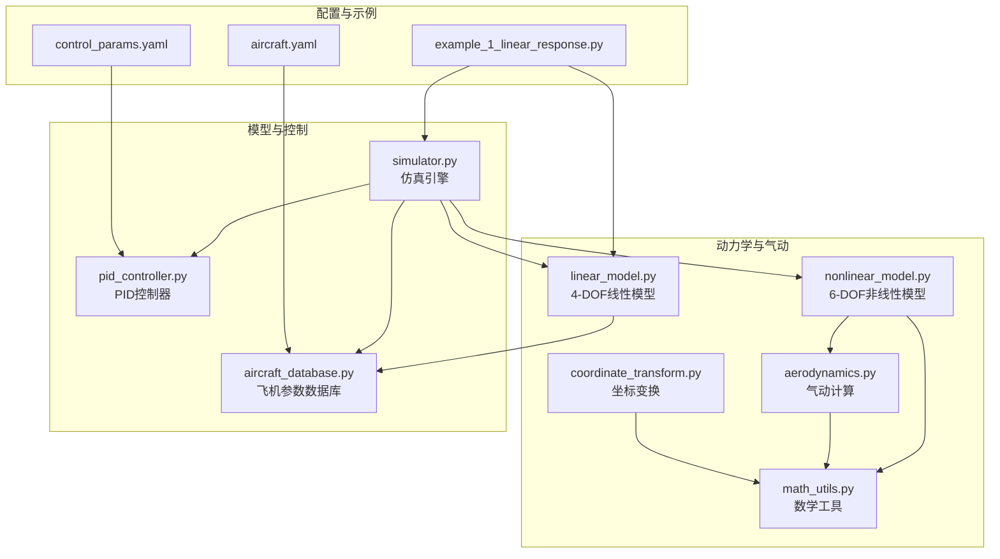
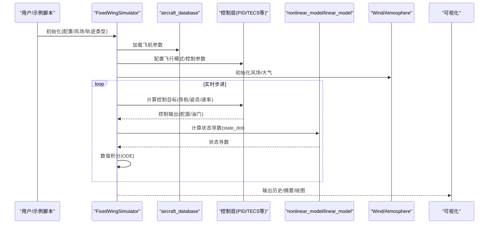
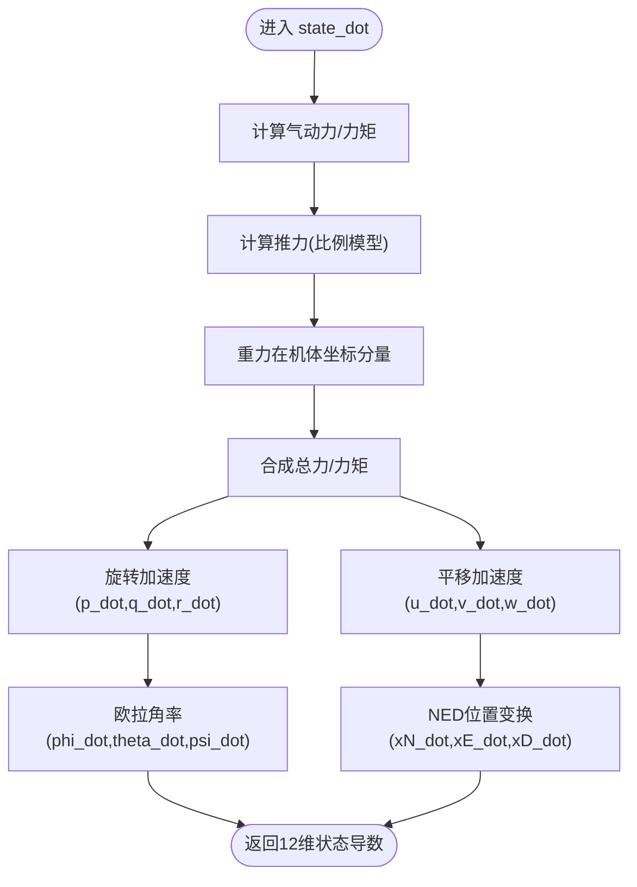
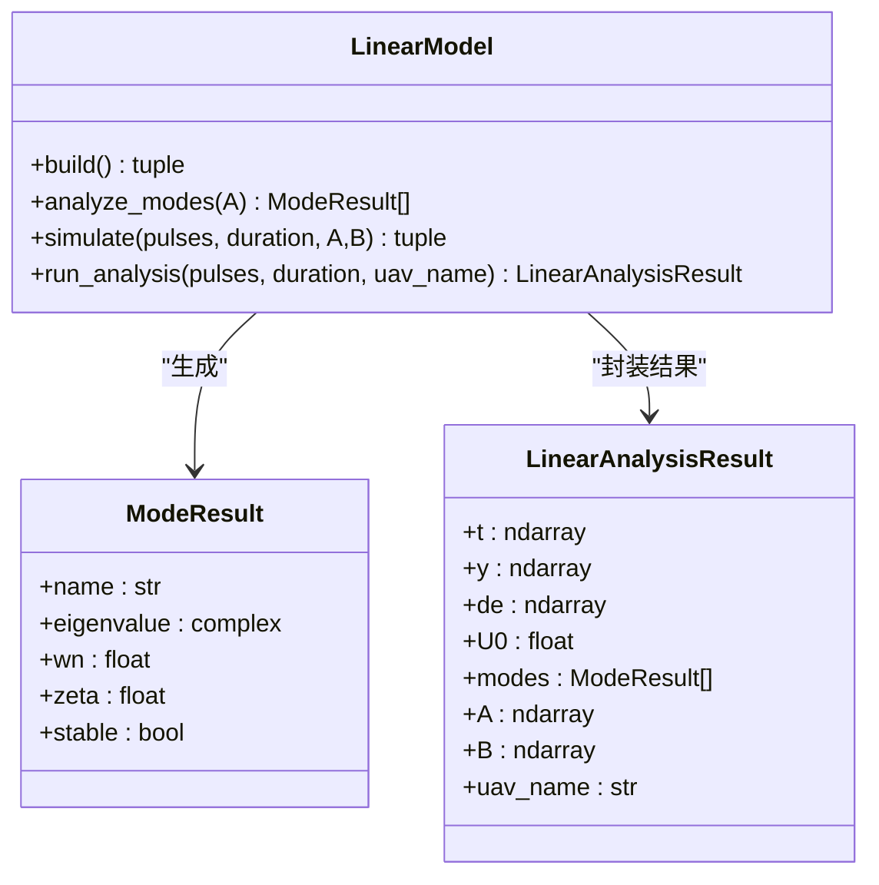
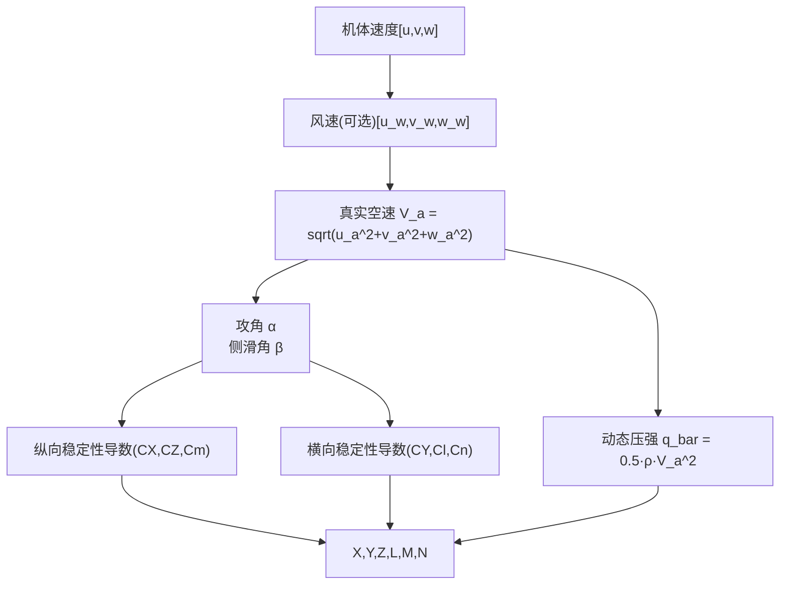
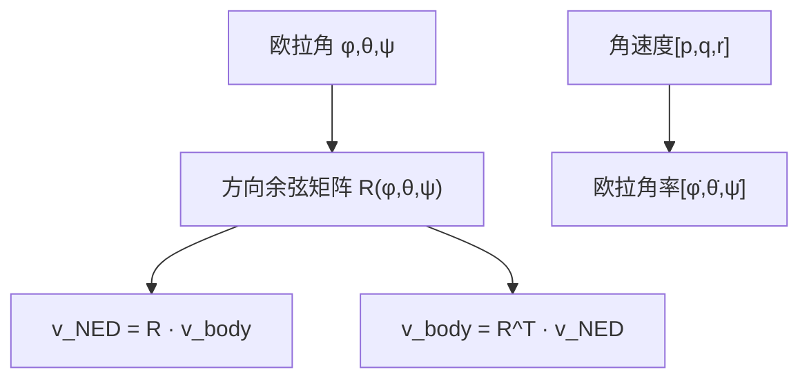
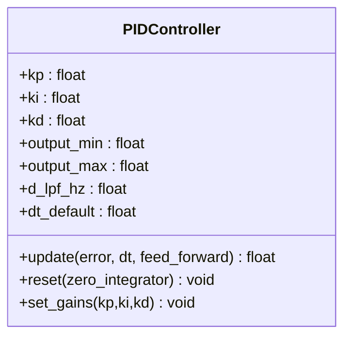
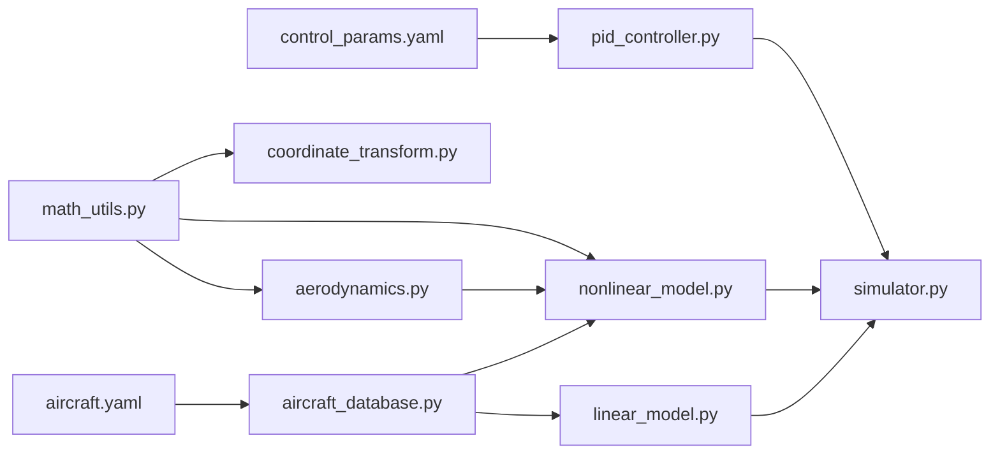

# 核心概念

<cite>
**本文引用的文件**
- [src/dynamics/nonlinear_model.py](file://src/dynamics/nonlinear_model.py)
- [src/dynamics/linear_model.py](file://src/dynamics/linear_model.py)
- [src/dynamics/aerodynamics.py](file://src/dynamics/aerodynamics.py)
- [src/dynamics/coordinate_transform.py](file://src/dynamics/coordinate_transform.py)
- [src/utils/math_utils.py](file://src/utils/math_utils.py)
- [src/models/aircraft_database.py](file://src/models/aircraft_database.py)
- [src/control/pid_controller.py](file://src/control/pid_controller.py)
- [src/simulation/simulator.py](file://src/simulation/simulator.py)
- [config/aircraft.yaml](file://config/aircraft.yaml)
- [config/control_params.yaml](file://config/control_params.yaml)
- [examples/example_1_linear_response.py](file://examples/example_1_linear_response.py)
- [requirements.txt](file://requirements.txt)
- [setup.py](file://setup.py)
</cite>

## 目录
1. [引言](#引言)
2. [项目结构](#项目结构)
3. [核心组件](#核心组件)
4. [架构总览](#架构总览)
5. [详细组件分析](#详细组件分析)
6. [依赖分析](#依赖分析)
7. [性能考虑](#性能考虑)
8. [故障排查指南](#故障排查指南)
9. [结论](#结论)
10. [附录](#附录)

## 引言
本文件面向固定翼飞行器仿真与控制的学习者与工程师，系统梳理FixedWingSimulator中的核心概念与实现要点，重点覆盖以下方面：
- 固定翼飞行器动力学：6自由度非线性运动方程与4自由度纵向线性化模型
- 坐标系系统：机体坐标系、地理NED坐标系、速度坐标系及其转换关系
- 气动力学：升力、阻力与力矩的建模方法，以及攻角、侧滑角的定义
- 控制理论基础：PID控制器、反馈控制、ArduPilot兼容控制链路
- 数学与物理直觉：通过模块化代码与可视化输出帮助建立扎实的理论基础

## 项目结构
项目采用按功能域划分的模块化组织方式，核心目录与职责如下：
- src/dynamics：动力学与气动模块（非线性6-DOF、线性4-DOF、气动计算、坐标变换）
- src/utils：通用数学工具（旋转矩阵、欧拉角率、动态压强等）
- src/models：飞机参数数据库与工厂
- src/control：控制层（PID、姿态/速率控制器、ArduPilot兼容参数、飞行模式管理等）
- src/simulation：仿真引擎与状态管理
- src/planning：轨迹规划（最小 Jerk/Jerk连续性）
- src/environment：环境建模（风场、大气密度）
- src/visualization：绘图与动画
- config：配置文件（飞机、控制参数、仿真、轨迹）
- examples：示例脚本（线性响应、非线性响应、轨迹跟踪等）

图表来源
- [src/dynamics/nonlinear_model.py](file://src/dynamics/nonlinear_model.py#L104-L282)
- [src/dynamics/linear_model.py](file://src/dynamics/linear_model.py#L107-L201)
- [src/dynamics/aerodynamics.py](file://src/dynamics/aerodynamics.py#L35-L148)
- [src/dynamics/coordinate_transform.py](file://src/dynamics/coordinate_transform.py#L29-L70)
- [src/utils/math_utils.py](file://src/utils/math_utils.py#L43-L124)
- [src/models/aircraft_database.py](file://src/models/aircraft_database.py#L143-L167)
- [src/control/pid_controller.py](file://src/control/pid_controller.py#L17-L117)
- [src/simulation/simulator.py](file://src/simulation/simulator.py#L115-L200)
- [config/aircraft.yaml](file://config/aircraft.yaml#L1-L13)
- [config/control_params.yaml](file://config/control_params.yaml#L1-L45)
- [examples/example_1_linear_response.py](file://examples/example_1_linear_response.py#L83-L124)

章节来源
- [src/dynamics/nonlinear_model.py](file://src/dynamics/nonlinear_model.py#L1-L386)
- [src/dynamics/linear_model.py](file://src/dynamics/linear_model.py#L1-L319)
- [src/dynamics/aerodynamics.py](file://src/dynamics/aerodynamics.py#L1-L148)
- [src/dynamics/coordinate_transform.py](file://src/dynamics/coordinate_transform.py#L1-L70)
- [src/utils/math_utils.py](file://src/utils/math_utils.py#L1-L124)
- [src/models/aircraft_database.py](file://src/models/aircraft_database.py#L1-L183)
- [src/control/pid_controller.py](file://src/control/pid_controller.py#L1-L117)
- [src/simulation/simulator.py](file://src/simulation/simulator.py#L1-L200)
- [config/aircraft.yaml](file://config/aircraft.yaml#L1-L13)
- [config/control_params.yaml](file://config/control_params.yaml#L1-L45)
- [examples/example_1_linear_response.py](file://examples/example_1_linear_response.py#L1-L206)

## 核心组件
- 6-DOF非线性模型：基于标准6自由度状态向量（速度、角速度、欧拉角、位置），结合气动力/力矩、推力与重力，求解状态导数；支持开环脉冲响应与稳态配平计算。
- 4-DOF线性模型：纵向线性化状态空间，输入为节风门与升降舵偏角，输出为纵向状态扰动，用于模态分析与时间响应仿真。
- 气动模块：在机体坐标系下计算升力、阻力与力矩，使用稳定性导数与非维参数，考虑风速修正。
- 坐标变换：提供NED与机体坐标系之间的方向余弦矩阵与欧拉角率映射。
- 数学工具：角度归一化、饱和、动态压强、3-2-1欧拉角旋转矩阵、攻角/侧滑角计算。
- 飞机数据库：包含多型无人机的几何、质量惯性、气动系数与ArduPilot兼容参数。
- PID控制器：带抗积分饱和的离散PID，支持微分低通滤波与前馈。
- 仿真引擎：整合动力学、控制、环境与规划模块，支持开环/闭环运行。

章节来源
- [src/dynamics/nonlinear_model.py](file://src/dynamics/nonlinear_model.py#L104-L282)
- [src/dynamics/linear_model.py](file://src/dynamics/linear_model.py#L107-L201)
- [src/dynamics/aerodynamics.py](file://src/dynamics/aerodynamics.py#L35-L148)
- [src/dynamics/coordinate_transform.py](file://src/dynamics/coordinate_transform.py#L29-L70)
- [src/utils/math_utils.py](file://src/utils/math_utils.py#L13-L124)
- [src/models/aircraft_database.py](file://src/models/aircraft_database.py#L143-L167)
- [src/control/pid_controller.py](file://src/control/pid_controller.py#L17-L117)
- [src/simulation/simulator.py](file://src/simulation/simulator.py#L115-L200)

## 架构总览
下图展示仿真主流程中各模块的交互关系，从配置加载到控制执行再到动力学积分与结果输出。

图表来源
- [src/simulation/simulator.py](file://src/simulation/simulator.py#L115-L200)
- [src/dynamics/nonlinear_model.py](file://src/dynamics/nonlinear_model.py#L160-L282)
- [src/models/aircraft_database.py](file://src/models/aircraft_database.py#L143-L167)
- [src/control/pid_controller.py](file://src/control/pid_controller.py#L55-L98)

章节来源
- [src/simulation/simulator.py](file://src/simulation/simulator.py#L115-L200)
- [examples/example_1_linear_response.py](file://examples/example_1_linear_response.py#L126-L164)

## 详细组件分析

### 6-DOF非线性模型（状态与方程）
- 状态向量（12维，NED框架）：[u, v, w, p, q, r, φ, θ, ψ, x_N, x_E, x_D]
- 动力学方程：
  - 平移：状态导数由气动力、推力与重力决定，结合欧拉角的三维加速度表达式
  - 旋转：欧拉角率与角速度的关系，刚体转动惯量耦合下的角加速度
  - 位置：速度在NED框架下的变换
- 控制输入：升降舵、副翼、方向舵偏角与油门（比例推力模型）
- 风场：可选NED风矢量，转换到机体坐标后修正相对空速
- 稳态配平：求解水平平飞条件下的攻角与升降舵配平

图表来源
- [src/dynamics/nonlinear_model.py](file://src/dynamics/nonlinear_model.py#L160-L256)

章节来源
- [src/dynamics/nonlinear_model.py](file://src/dynamics/nonlinear_model.py#L104-L282)

### 4-DOF线性模型（纵向线性化）
- 状态：[u_p, α, q, θ]（纵向扰动变量）
- 输入：[ΔT, δ_e]（节风门与升降舵偏角扰动）
- 系统矩阵A、B由稳定性导数与非维惯性参数构建，支持模态分析（短周期、长周期、阻尼收敛模式）
- 时间响应：对阶跃/脉冲输入进行求解，输出纵向状态随时间演化

图表来源
- [src/dynamics/linear_model.py](file://src/dynamics/linear_model.py#L107-L201)
- [src/dynamics/linear_model.py](file://src/dynamics/linear_model.py#L206-L252)
- [src/dynamics/linear_model.py](file://src/dynamics/linear_model.py#L258-L319)

章节来源
- [src/dynamics/linear_model.py](file://src/dynamics/linear_model.py#L107-L201)
- [examples/example_1_linear_response.py](file://examples/example_1_linear_response.py#L89-L124)

### 气动模型（升力/阻力/力矩）
- 空速修正：考虑风在机体坐标系的分量，得到真实空速矢量
- 攻角与侧滑角：基于速度分量定义，保证数值稳定
- 升阻系数：纵向（CL、CD、Cm）与横向（CY、Cl、Cn）分别由稳定性导数与控制面偏角线性组合
- 力与力矩：基于动态压强与参考面积/长度，将无量纲系数转换为物理量

图表来源
- [src/dynamics/aerodynamics.py](file://src/dynamics/aerodynamics.py#L35-L148)
- [src/utils/math_utils.py](file://src/utils/math_utils.py#L107-L124)

章节来源
- [src/dynamics/aerodynamics.py](file://src/dynamics/aerodynamics.py#L35-L148)
- [src/utils/math_utils.py](file://src/utils/math_utils.py#L107-L124)

### 坐标系与变换
- 坐标系约定：NED（北-东-下）与3-2-1欧拉角（φ, θ, ψ）
- 方向余弦矩阵：将机体速度/角速度转换到NED，或反向转换
- 欧拉角率：给出角速度与欧拉角时间导数的关系，并在θ接近±90°时进行数值保护

图表来源
- [src/dynamics/coordinate_transform.py](file://src/dynamics/coordinate_transform.py#L29-L70)
- [src/utils/math_utils.py](file://src/utils/math_utils.py#L43-L101)

章节来源
- [src/dynamics/coordinate_transform.py](file://src/dynamics/coordinate_transform.py#L29-L70)
- [src/utils/math_utils.py](file://src/utils/math_utils.py#L43-L101)

### 控制理论与PID
- PID控制器：包含P/I/D三段，采用“饱和”抗积分饱和策略，支持可选微分低通滤波与前馈
- 参数设置：可在运行时更新增益，适合不同轴向（俯仰/横滚/偏航）的速率控制
- 应用：在仿真引擎中作为ArduPilot兼容控制链的一部分，驱动舵面与油门

图表来源
- [src/control/pid_controller.py](file://src/control/pid_controller.py#L17-L117)

章节来源
- [src/control/pid_controller.py](file://src/control/pid_controller.py#L17-L117)

### 飞机参数与数据库
- 数据库包含多型无人机的几何、质量/惯性、气动系数与ArduPilot默认参数
- 提供派生参数（如U0、ρ、q_bar），直接供动力学模块使用
- 支持按名称查询与列表查看

章节来源
- [src/models/aircraft_database.py](file://src/models/aircraft_database.py#L143-L183)
- [config/aircraft.yaml](file://config/aircraft.yaml#L1-L13)

### 示例：线性响应与闭环对比
- 开环：使用4-DOF线性模型对升降舵脉冲进行时间响应仿真，输出纵向状态与模态分析
- 闭环：在仿真引擎中启用FBW_B模式，通过PID实现高度/空速保持，对比闭环与开环响应

章节来源
- [examples/example_1_linear_response.py](file://examples/example_1_linear_response.py#L89-L164)

## 依赖分析
- 外部依赖：NumPy、SciPy、Matplotlib、Plotly、PyYAML、Pandas、pytest
- 内部模块耦合：
  - dynamics.* 之间高内聚（气动→非线性/线性模型）
  - simulation 统筹各模块并提供高层接口
  - control 与 dynamics 解耦，通过状态与控制命令交互
  - models 为数据源，不依赖上层逻辑

图表来源
- [src/utils/math_utils.py](file://src/utils/math_utils.py#L1-L124)
- [src/dynamics/aerodynamics.py](file://src/dynamics/aerodynamics.py#L1-L148)
- [src/dynamics/nonlinear_model.py](file://src/dynamics/nonlinear_model.py#L1-L386)
- [src/dynamics/linear_model.py](file://src/dynamics/linear_model.py#L1-L319)
- [src/models/aircraft_database.py](file://src/models/aircraft_database.py#L1-L183)
- [src/control/pid_controller.py](file://src/control/pid_controller.py#L1-L117)
- [src/simulation/simulator.py](file://src/simulation/simulator.py#L1-L200)
- [config/aircraft.yaml](file://config/aircraft.yaml#L1-L13)
- [config/control_params.yaml](file://config/control_params.yaml#L1-L45)

章节来源
- [requirements.txt](file://requirements.txt#L1-L8)
- [setup.py](file://setup.py#L11-L18)

## 性能考虑
- 数值积分：非线性模型使用显式Runge-Kutta（dopri5）求解，建议根据实时性要求调整步长与容差
- 线性模型：状态空间规模小，适合快速模态分析与控制器设计
- 气动计算：动态压强与稳定性导数计算为O(1)，成本较低
- 风场与密度：按需计算，避免重复调用
- 可视化：示例脚本使用非交互后端保存图像，减少GUI开销

## 故障排查指南
- 非线性模型发散或数值不稳定
  - 检查初始条件是否接近配平点
  - 调整积分步长与容差
  - 确认风场与密度函数输入有效
- 线性模型模态不稳定
  - 检查A矩阵构造与稳定性导数符号
  - 确认U0与参考参数一致
- 控制器饱和或积分风车
  - 检查输出限幅与抗积分饱和逻辑
  - 适当降低积分增益或引入积分限幅
- 风场/坐标变换异常
  - 确认风矢量在NED与机体坐标系间的转换正确
  - 欧拉角在奇异位姿附近时注意数值保护

章节来源
- [src/dynamics/nonlinear_model.py](file://src/dynamics/nonlinear_model.py#L287-L386)
- [src/dynamics/linear_model.py](file://src/dynamics/linear_model.py#L206-L252)
- [src/control/pid_controller.py](file://src/control/pid_controller.py#L55-L98)
- [src/utils/math_utils.py](file://src/utils/math_utils.py#L79-L101)

## 结论
本项目以清晰的模块划分实现了从气动建模到闭环控制的完整链路，既可用于教学演示（线性模态分析与开环响应），也可用于工程仿真（6-DOF非线性与ArduPilot兼容控制）。通过统一的坐标系约定、稳定的数学工具与可配置的控制参数，学习者可以逐步建立对固定翼飞行器动力学与控制的系统性理解。

## 附录
- 安装与运行
  - 使用提供的安装脚本与依赖声明进行安装
  - 运行示例脚本观察开环与闭环响应
- 配置说明
  - 飞机参数：在配置文件中选择机型或覆盖数据库默认值
  - 控制参数：在控制参数文件中设置PID与TECS相关参数

章节来源
- [requirements.txt](file://requirements.txt#L1-L8)
- [setup.py](file://setup.py#L1-L23)
- [config/aircraft.yaml](file://config/aircraft.yaml#L1-L13)
- [config/control_params.yaml](file://config/control_params.yaml#L1-L45)
- [examples/example_1_linear_response.py](file://examples/example_1_linear_response.py#L126-L164)