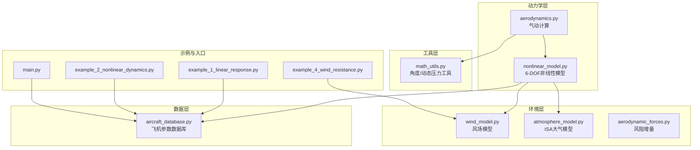
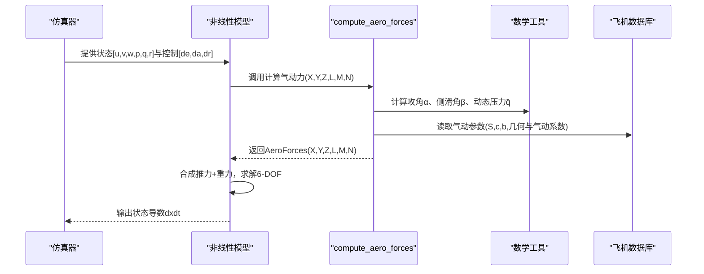
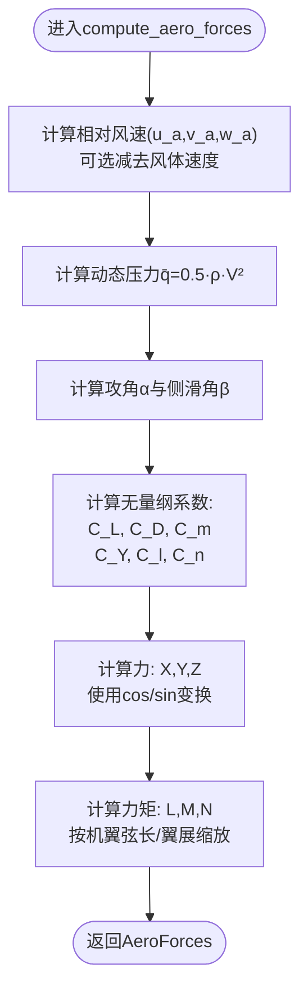
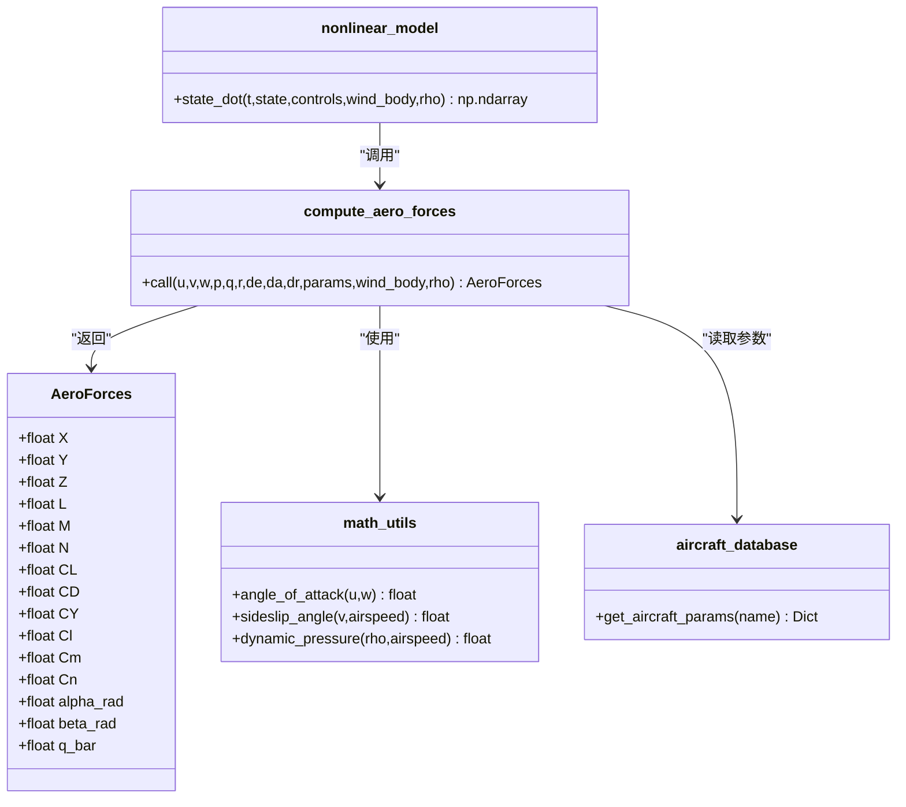
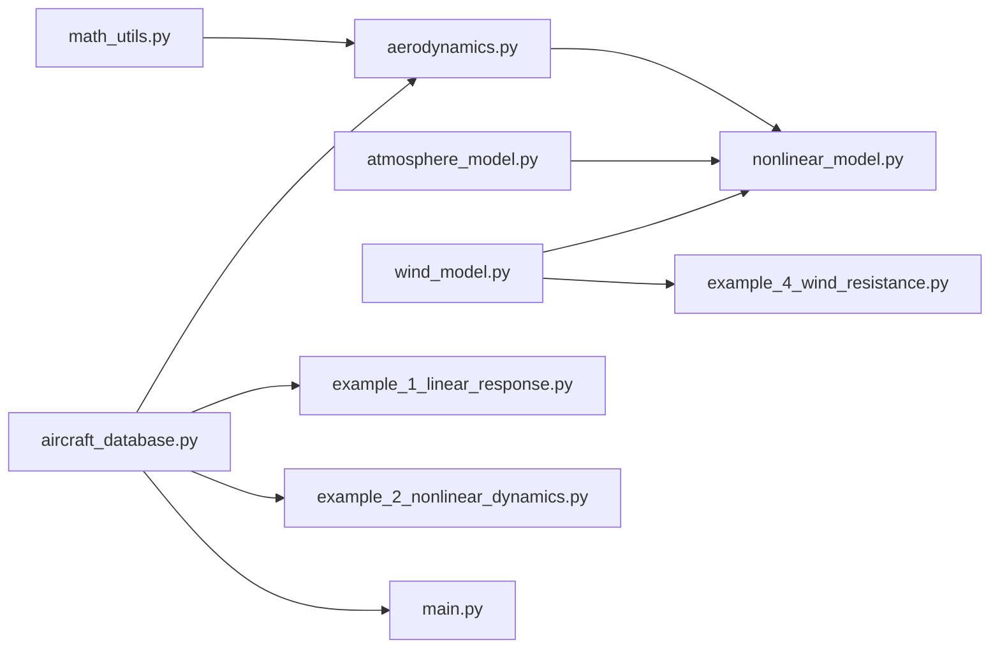

# 气动力学原理

<cite>
**本文档引用的文件**
- [aerodynamics.py](file://src/dynamics/aerodynamics.py)
- [aircraft_database.py](file://src/models/aircraft_database.py)
- [math_utils.py](file://src/utils/math_utils.py)
- [nonlinear_model.py](file://src/dynamics/nonlinear_model.py)
- [aerodynamic_forces.py](file://src/environment/aerodynamic_forces.py)
- [wind_model.py](file://src/environment/wind_model.py)
- [atmosphere_model.py](file://src/environment/atmosphere_model.py)
- [simulation.yaml](file://config/simulation.yaml)
- [aircraft.yaml](file://config/aircraft.yaml)
- [example_1_linear_response.py](file://examples/example_1_linear_response.py)
- [example_2_nonlinear_dynamics.py](file://examples/example_2_nonlinear_dynamics.py)
- [example_4_wind_resistance.py](file://examples/example_4_wind_resistance.py)
- [main.py](file://main.py)
</cite>

## 目录
1. [引言](#引言)
2. [项目结构](#项目结构)
3. [核心组件](#核心组件)
4. [架构总览](#架构总览)
5. [详细组件分析](#详细组件分析)
6. [依赖关系分析](#依赖关系分析)
7. [性能考虑](#性能考虑)
8. [故障排除指南](#故障排除指南)
9. [结论](#结论)
10. [附录](#附录)

## 引言
本技术文档围绕固定翼飞行器的气动力学原理展开，系统阐述升力、阻力与侧向力的产生机制与计算方法，解释攻角（α）与侧滑角（β）对气动力的影响，给出升力系数（C_L）、阻力系数（C_D）、力矩系数（C_m、C_l、C_n）的数学模型与参数含义，并说明纵向、横向、垂向气动力在机体坐标系中的分解与合成过程。文档结合代码实现，展示从输入状态到气动力输出的完整数值流程，同时提供典型飞机的气动参数来源与使用建议。

## 项目结构
该仿真平台采用模块化设计，围绕“气动计算”“环境建模”“动力学集成”“控制与可视化”等维度组织代码。与气动力学直接相关的核心模块包括：
- 动力学层：气动计算、非线性六自由度方程
- 环境层：风场模型、大气密度模型
- 数据层：飞机数据库（包含气动参数）
- 工具层：角度与动态压力等数学工具
- 示例与入口：演示不同场景下的气动响应与风阻影响

**图表来源**
- [aerodynamics.py](file://src/dynamics/aerodynamics.py#L1-L148)
- [nonlinear_model.py](file://src/dynamics/nonlinear_model.py#L1-L386)
- [wind_model.py](file://src/environment/wind_model.py#L1-L113)
- [atmosphere_model.py](file://src/environment/atmosphere_model.py#L1-L77)
- [aerodynamic_forces.py](file://src/environment/aerodynamic_forces.py#L1-L54)
- [aircraft_database.py](file://src/models/aircraft_database.py#L1-L183)
- [math_utils.py](file://src/utils/math_utils.py#L1-L124)
- [example_1_linear_response.py](file://examples/example_1_linear_response.py#L1-L206)
- [example_2_nonlinear_dynamics.py](file://examples/example_2_nonlinear_dynamics.py#L1-L215)
- [example_4_wind_resistance.py](file://examples/example_4_wind_resistance.py#L1-L52)
- [main.py](file://main.py#L1-L145)

**章节来源**
- [aerodynamics.py](file://src/dynamics/aerodynamics.py#L1-L148)
- [nonlinear_model.py](file://src/dynamics/nonlinear_model.py#L1-L386)
- [aircraft_database.py](file://src/models/aircraft_database.py#L1-L183)
- [math_utils.py](file://src/utils/math_utils.py#L1-L124)
- [wind_model.py](file://src/environment/wind_model.py#L1-L113)
- [atmosphere_model.py](file://src/environment/atmosphere_model.py#L1-L77)
- [aerodynamic_forces.py](file://src/environment/aerodynamic_forces.py#L1-L54)
- [example_1_linear_response.py](file://examples/example_1_linear_response.py#L1-L206)
- [example_2_nonlinear_dynamics.py](file://examples/example_2_nonlinear_dynamics.py#L1-L215)
- [example_4_wind_resistance.py](file://examples/example_4_wind_resistance.py#L1-L52)
- [main.py](file://main.py#L1-L145)

## 核心组件
本节聚焦气动计算的核心组件及其职责：
- AeroForces：气动载荷容器，存储机体坐标系下的力（X,Y,Z）与力矩（L,M,N），以及对应的无量纲系数（C_L,C_D,C_Y, C_l,C_m,C_n）和攻角/侧滑角、动态压力。
- compute_aero_forces：气动计算主函数，基于机体速度、角速率、控制面偏角与飞机参数，计算气动力与力矩。
- 数学工具：攻角、侧滑角、动态压力等基础函数。
- 飞机数据库：提供气动参数字典（含几何与气动系数），并注入导出参数（如参考速度U0、密度ρ、动态压力q_bar）。
- 非线性模型：在6-DOF方程中调用compute_aero_forces，整合推力、重力后求解运动微分方程。
- 风阻增量：在已有气动基础上估算相对风引起的附加阻力增量。

**章节来源**
- [aerodynamics.py](file://src/dynamics/aerodynamics.py#L19-L148)
- [math_utils.py](file://src/utils/math_utils.py#L107-L124)
- [aircraft_database.py](file://src/models/aircraft_database.py#L143-L166)
- [nonlinear_model.py](file://src/dynamics/nonlinear_model.py#L160-L256)
- [aerodynamic_forces.py](file://src/environment/aerodynamic_forces.py#L13-L54)

## 架构总览
下图展示了气动计算在仿真框架中的位置与交互关系：输入为机体速度、角速率、控制面偏角与环境参数，输出为气动力与力矩；这些结果被非线性模型用于求解6-DOF运动方程。

**图表来源**
- [nonlinear_model.py](file://src/dynamics/nonlinear_model.py#L160-L256)
- [aerodynamics.py](file://src/dynamics/aerodynamics.py#L35-L148)
- [math_utils.py](file://src/utils/math_utils.py#L107-L124)
- [aircraft_database.py](file://src/models/aircraft_database.py#L143-L166)

## 详细组件分析

### 升力、阻力与侧向力的产生机制与计算
- 攻角（α）定义为气流方向与机体纵轴夹角，通过arctan2(w,u)计算；当w增大、u减小时α增大，升力系数C_L上升。
- 侧滑角（β）定义为气流在机体纵轴垂直平面内的投影与机体横轴夹角，通过arcsin(v/V)计算；β导致侧向力系数C_Y不为零。
- 动态压力q̄=0.5·ρ·V²，是气动力的基础尺度；风速越大，q̄越大，气动力越大。
- 升力与阻力的分解遵循风轴到体轴的旋转关系：在小攻角下近似X≈−CD，Z≈−CL；精确形式使用cos/sin进行变换。
- 侧向力由C_Y决定，通常与β及横向/纵向角速率p、r耦合。

**图表来源**
- [aerodynamics.py](file://src/dynamics/aerodynamics.py#L35-L148)
- [math_utils.py](file://src/utils/math_utils.py#L107-L124)

**章节来源**
- [aerodynamics.py](file://src/dynamics/aerodynamics.py#L35-L148)
- [math_utils.py](file://src/utils/math_utils.py#L107-L124)

### 攻角与侧滑角对气动力的影响
- 攻角影响：纵向气动系数（C_L, C_D, C_m）随α线性或非线性变化，主导升力与阻力大小；在高攻角时可能出现非线性与失速效应（本实现为线性模型，未显式建模失速）。
- 侧滑角影响：侧向气动系数（C_Y, C_l, C_n）对β敏感，尤其C_Y通常为负值，表示β>0时产生向右的侧力；横向力矩C_l与纵向力矩C_n也受β耦合。
- 角速率影响：q̄=q·c/(2·U0)，p̄=p·b/(2·U0)，r̄=r·b/(2·U0)引入非维角速率，使纵向与横向/垂向气动耦合更明显。

**章节来源**
- [aerodynamics.py](file://src/dynamics/aerodynamics.py#L85-L124)

### 升力系数、阻力系数、力矩系数的计算模型与参数含义
- 纵向气动：
  - C_L = C_{L0} + C_{Lα}·α + C_{Lq}·q̄ + C_{Lδe}·δ_e
  - C_D = C_{D0} + C_{Dα}·α + C_{Dq}·q̄ + C_{Dδe}·δ_e
  - C_m = C_{m0} + C_{mα}·α + C_{mq}·q̄ + C_{mδe}·δ_e
- 横向/垂向气动：
  - C_Y = C_{Yβ}·β + C_{Yp}·p̄ + C_{Yr}·r̄ + C_{Yδa}·δ_a + C_{Yδr}·δ_r
  - C_l = C_{lβ}·β + C_{lp}·p̄ + C_{lr}·r̄ + C_{lδa}·δ_a + C_{lδr}·δ_r
  - C_n = C_{nβ}·β + C_{np}·p̄ + C_{nr}·r̄ + C_{nδa}·δ_a + C_{nδr}·δ_r
- 参数来源：来自飞机数据库，覆盖TB2、Anka、Aksungur、Karayel、Predator、Heron MK1/MK2等机型，包含几何参数（S, c, b, m）与气动系数。

**章节来源**
- [aerodynamics.py](file://src/dynamics/aerodynamics.py#L90-L124)
- [aircraft_database.py](file://src/models/aircraft_database.py#L29-L133)

### 纵向、横向、垂向气动力的分解与合成
- 分解：以风轴为基准，X沿气流方向（阻力），Z垂直于风轴向下（升力近似为−Z）；Y为侧向力。
- 合成：通过cos/sin变换将风轴力转换至体轴系，得到X、Y、Z；力矩通过Cl、Cm、Cn乘以S、c、b、b缩放得到L、M、N。
- 注意：本实现采用标准正向约定（升力向上、机头向上为正俯仰力矩），与NED/体轴约定一致。

**章节来源**
- [aerodynamics.py](file://src/dynamics/aerodynamics.py#L130-L146)

### 典型飞机的气动特性与参数来源
- 数据库包含7种无人机的气动参数，涵盖土耳其Baykar TB2、Anka、Aksungur与以色列IAI Heron系列等，参数字段与原始项目保持一致，便于替换与扩展。
- 导出参数：U0（参考速度）、ρ（海平面密度）、q_bar（参考动态压力）由Mach与ISA常数计算并注入参数字典，供动力学模块直接使用。

**章节来源**
- [aircraft_database.py](file://src/models/aircraft_database.py#L29-L133)
- [aircraft_database.py](file://src/models/aircraft_database.py#L143-L166)

### 结合实际代码实现的气动力计算流程
- 输入：[u,v,w,p,q,r]、控制面偏角[de,da,dr]、风体速度、空气密度ρ、飞机参数字典
- 步骤：
  1) 计算相对风速（可选减去风体速度）
  2) 计算q̄、α、β
  3) 基于线性模型计算C_L、C_D、C_m、C_Y、C_l、C_n
  4) 计算X、Y、Z与L、M、N
  5) 返回AeroForces对象
- 在6-DOF中，将气动力与推力、重力合成，求解运动微分方程。

**图表来源**
- [aerodynamics.py](file://src/dynamics/aerodynamics.py#L19-L148)
- [math_utils.py](file://src/utils/math_utils.py#L107-L124)
- [aircraft_database.py](file://src/models/aircraft_database.py#L143-L166)
- [nonlinear_model.py](file://src/dynamics/nonlinear_model.py#L160-L256)

**章节来源**
- [aerodynamics.py](file://src/dynamics/aerodynamics.py#L35-L148)
- [nonlinear_model.py](file://src/dynamics/nonlinear_model.py#L160-L256)

### 风阻增量与风场对气动力的影响
- 风阻增量：在已有气动基础上，计算相对风引起的附加阻力ΔF，使用简单拖拽模型估算，适用于扰动/灵敏度分析。
- 风场模型：支持NONE、FIXED、SINE、RANDOMSINE四种类型，提供NED风矢量；在6-DOF中将NED风转换为体轴风参与气动计算。

**章节来源**
- [aerodynamic_forces.py](file://src/environment/aerodynamic_forces.py#L13-L54)
- [wind_model.py](file://src/environment/wind_model.py#L18-L113)
- [nonlinear_model.py](file://src/dynamics/nonlinear_model.py#L261-L281)

## 依赖关系分析
- aerodynamics.py依赖math_utils（角度与动态压力）与aircraft_database（参数字典）。
- nonlinear_model.py依赖aerodynamics.py（气动计算）、math_utils（角度/动态压力）、atmosphere_model（密度随高度变化）。
- 示例脚本与主入口通过aircraft_database选择飞机参数，驱动仿真运行。

**图表来源**
- [aerodynamics.py](file://src/dynamics/aerodynamics.py#L11-L13)
- [nonlinear_model.py](file://src/dynamics/nonlinear_model.py#L27-L28)
- [math_utils.py](file://src/utils/math_utils.py#L1-L124)
- [aircraft_database.py](file://src/models/aircraft_database.py#L1-L183)
- [wind_model.py](file://src/environment/wind_model.py#L1-L113)
- [atmosphere_model.py](file://src/environment/atmosphere_model.py#L1-L77)
- [example_1_linear_response.py](file://examples/example_1_linear_response.py#L34-L36)
- [example_2_nonlinear_dynamics.py](file://examples/example_2_nonlinear_dynamics.py#L34-L36)
- [example_4_wind_resistance.py](file://examples/example_4_wind_resistance.py#L15-L17)
- [main.py](file://main.py#L28-L29)

**章节来源**
- [aerodynamics.py](file://src/dynamics/aerodynamics.py#L11-L13)
- [nonlinear_model.py](file://src/dynamics/nonlinear_model.py#L27-L28)
- [aircraft_database.py](file://src/models/aircraft_database.py#L1-L183)
- [wind_model.py](file://src/environment/wind_model.py#L1-L113)
- [atmosphere_model.py](file://src/environment/atmosphere_model.py#L1-L77)
- [example_1_linear_response.py](file://examples/example_1_linear_response.py#L34-L36)
- [example_2_nonlinear_dynamics.py](file://examples/example_2_nonlinear_dynamics.py#L34-L36)
- [example_4_wind_resistance.py](file://examples/example_4_wind_resistance.py#L15-L17)
- [main.py](file://main.py#L28-L29)

## 性能考虑
- 数值稳定性：当空速接近零时，代码对空速进行最小阈值钳位，避免q̄过小导致的不稳定；测试用例验证了低速下的力幅值合理。
- 计算复杂度：单次compute_aero_forces为O(1)，涉及少量三角函数与标量运算，适合实时仿真。
- 风阻增量：仅在需要扰动分析时启用，避免重复计算。
- 大气密度：在6-DOF中可按高度变化更新ρ，提高真实感但增加一次查表/计算。

[本节为通用指导，无需特定文件来源]

## 故障排除指南
- 空速为零或极小：检查输入状态是否合理，确认风体速度与相对风速计算逻辑。
- 力/力矩异常：核对控制面偏角范围与气动系数符号约定，确保输入单位一致（弧度）。
- 风场导致漂移：确认风类型与方向设置，必要时切换为NONE或FIXED以定位问题。
- 参数缺失：确保通过aircraft_database.get_aircraft_params获取参数字典，避免遗漏导出参数（U0、rho、q_bar）。

**章节来源**
- [aerodynamics.py](file://src/dynamics/aerodynamics.py#L68-L77)
- [nonlinear_model.py](file://src/dynamics/nonlinear_model.py#L261-L281)
- [aircraft_database.py](file://src/models/aircraft_database.py#L143-L166)

## 结论
本项目实现了基于线性气动模型的固定翼飞行器气动力计算，涵盖攻角与侧滑角对气动力的影响、无量纲系数的线性拟合、以及风场与风阻增量的建模。通过将气动计算嵌入6-DOF非线性模型，系统能够稳定地进行姿态与轨迹仿真。对于更高精度需求，可在现有框架上扩展非线性升力、失速模型与更复杂的侧向/垂向耦合项。

[本节为总结，无需特定文件来源]

## 附录

### 关键参数与符号说明
- 几何参数：S（机翼面积）、c（平均气动弦长）、b（翼展）、m（质量）
- 气动系数：C_L, C_D, C_m, C_Y, C_l, C_n
- 运动变量：u,v,w（机体速度）、p,q,r（机体角速率）
- 控制面：δ_e（升降舵）、δ_a（副翼）、δ_r（方向舵）
- 环境：ρ（空气密度）、q̄（动态压力）、风体速度

**章节来源**
- [aerodynamics.py](file://src/dynamics/aerodynamics.py#L63-L66)
- [aircraft_database.py](file://src/models/aircraft_database.py#L29-L133)

### 配置文件要点
- aircraft.yaml：选择飞机名称与可选参数覆盖
- simulation.yaml：仿真步长、持续时间、初始条件、风类型与强度等

**章节来源**
- [aircraft.yaml](file://config/aircraft.yaml#L1-L13)
- [simulation.yaml](file://config/simulation.yaml#L1-L30)

### 示例脚本与应用场景
- 线性4-DOF分析：开环脉冲响应与闭环PID对比
- 6-DOF非线性仿真：配平计算、开环脉冲与闭环稳定
- 随机正弦风扰：FBW_B模式下的抗扰能力验证

**章节来源**
- [example_1_linear_response.py](file://examples/example_1_linear_response.py#L84-L206)
- [example_2_nonlinear_dynamics.py](file://examples/example_2_nonlinear_dynamics.py#L77-L215)
- [example_4_wind_resistance.py](file://examples/example_4_wind_resistance.py#L1-L52)