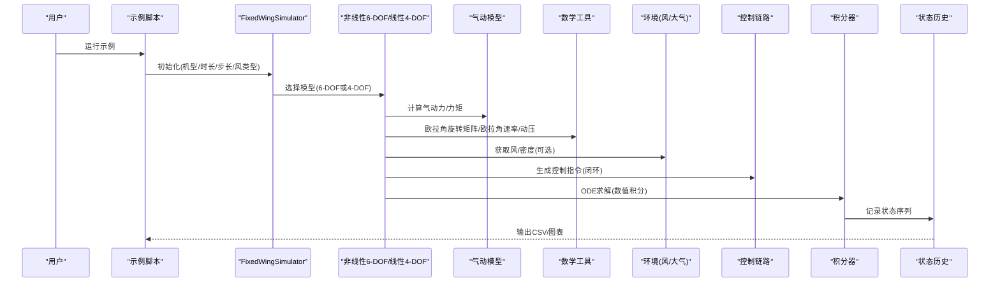
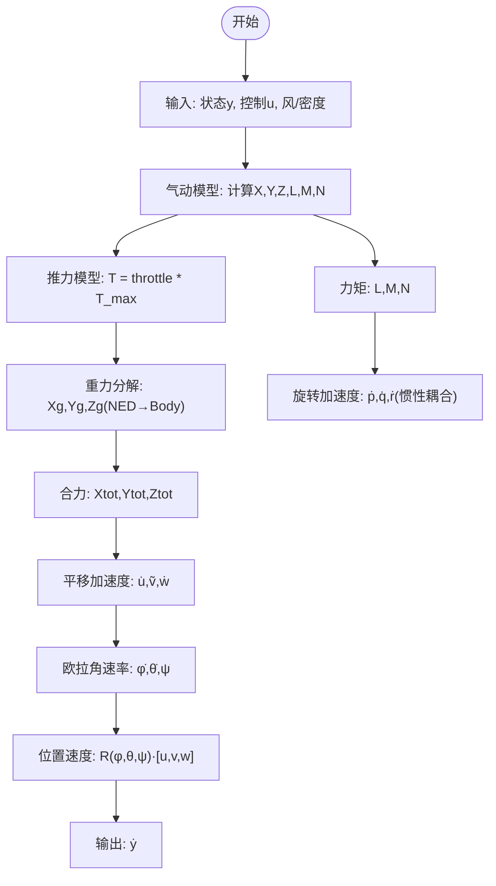
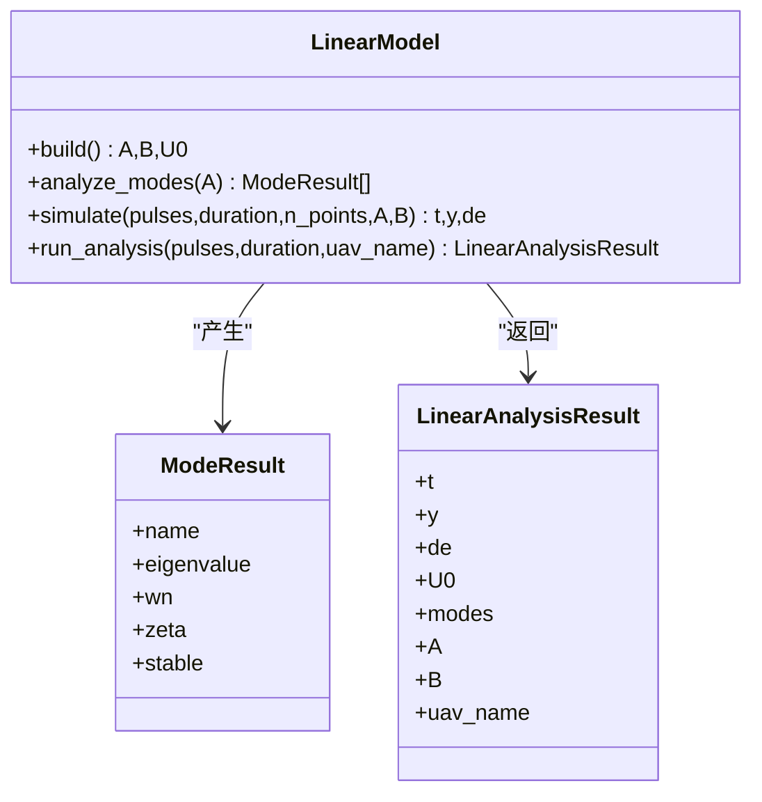
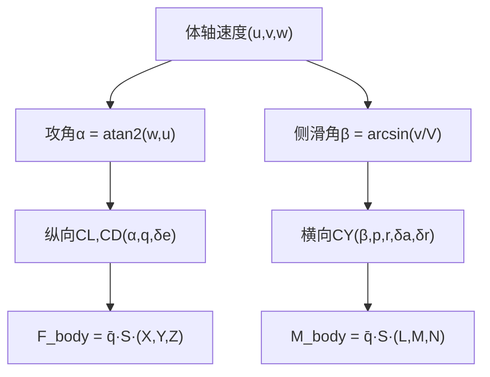
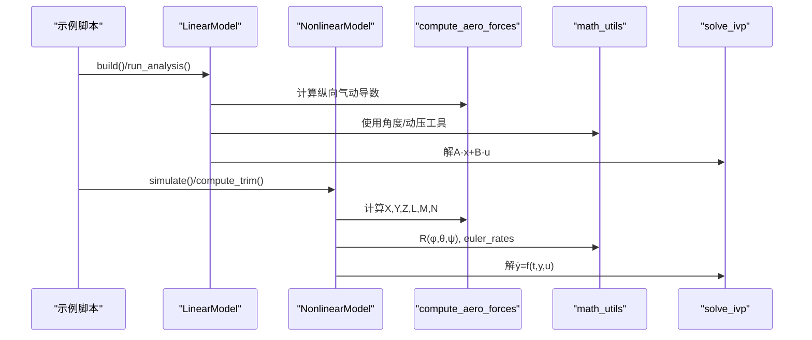
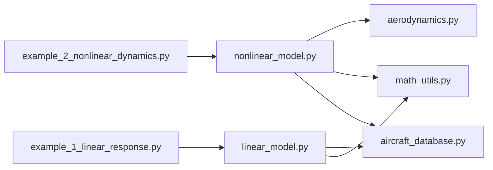

# 飞行动力学理论

<cite>
**本文引用的文件**
- [src/dynamics/nonlinear_model.py](file://src/dynamics/nonlinear_model.py)
- [src/dynamics/linear_model.py](file://src/dynamics/linear_model.py)
- [src/dynamics/aerodynamics.py](file://src/dynamics/aerodynamics.py)
- [src/models/aircraft_database.py](file://src/models/aircraft_database.py)
- [src/utils/math_utils.py](file://src/utils/math_utils.py)
- [examples/example_1_linear_response.py](file://examples/example_1_linear_response.py)
- [examples/example_2_nonlinear_dynamics.py](file://examples/example_2_nonlinear_dynamics.py)
- [src/simulation/simulator.py](file://src/simulation/simulator.py)
</cite>

## 目录
1. [引言](#引言)
2. [项目结构](#项目结构)
3. [核心组件](#核心组件)
4. [架构总览](#架构总览)
5. [详细组件分析](#详细组件分析)
6. [依赖关系分析](#依赖关系分析)
7. [性能考量](#性能考量)
8. [故障排查指南](#故障排查指南)
9. [结论](#结论)
10. [附录](#附录)

## 引言
本文件系统性阐述固定翼飞行器的飞行动力学理论与代码实现映射，覆盖以下要点：
- 6自由度（6-DOF）非线性运动方程的数学推导与物理意义：平移运动方程（牛顿第二定律）与旋转运动方程（欧拉角时间导数与角动量定理）。
- 4自由度（4-DOF）纵向线性化模型的假设条件与适用范围：小扰动假设、忽略横向/方向耦合、常参数线性化。
- 质量、惯性矩、气动力等关键参数的作用与来源：来自飞机数据库与气动模型。
- 牛顿-欧拉方程在代码中的应用：状态向量、力与力矩、坐标变换。
- 从理论模型到数值计算的转换：气动模型、坐标变换、常微分方程求解。

## 项目结构
该项目采用模块化组织，围绕“建模-仿真-控制-可视化”主线展开：
- 动力学层：非线性6-DOF与线性4-DOF模型；气动模型与坐标变换工具。
- 环境层：风场与大气密度模型（用于真实风阻与密度变化）。
- 控制层：ArduPilot兼容控制链路（导航、姿态、速率、舵面混合）。
- 规划层：轨迹规划与航点管理。
- 仿真层：积分器、状态管理与历史记录。
- 示例与输出：示例脚本演示开环/闭环响应，并生成CSV与图表。

```mermaid
graph TB
subgraph "建模"
A["非线性6-DOF模型<br/>nonlinear_model.py"]
B["线性4-DOF模型<br/>linear_model.py"]
C["气动模型<br/>aerodynamics.py"]
D["数学工具<br/>math_utils.py"]
end
subgraph "环境"
E["风模型<br/>wind_model.py"]
F["大气模型<br/>atmosphere_model.py"]
end
subgraph "控制"
G["飞行模式管理<br/>flight_mode_manager.py"]
H["导航控制器<br/>navigation_controller.py"]
I["姿态控制器<br/>attitude_controller.py"]
J["速率控制器<br/>rate_controller.py"]
K["舵面混合<br/>servo_mixer.py"]
end
subgraph "规划"
L["轨迹基类<br/>trajectory_base.py"]
M["最小Jerk/Jerk模型<br/>minimum_jerk.py / minimum_snap.py"]
N["航点管理<br/>waypoint_manager.py"]
end
subgraph "仿真"
O["积分器<br/>integrator.py"]
P["状态管理<br/>state_manager.py"]
end
subgraph "示例"
Q["线性响应示例<br/>example_1_linear_response.py"]
R["非线性动力学示例<br/>example_2_nonlinear_dynamics.py"]
end
A --> C
A --> D
B --> C
B --> D
A --> E
A --> F
A --> G
G --> H
H --> I
I --> J
J --> K
K --> O
O --> P
Q --> B
R --> A
```

**图示来源**
- [src/dynamics/nonlinear_model.py](file://src/dynamics/nonlinear_model.py#L104-L386)
- [src/dynamics/linear_model.py](file://src/dynamics/linear_model.py#L107-L319)
- [src/dynamics/aerodynamics.py](file://src/dynamics/aerodynamics.py#L35-L148)
- [src/utils/math_utils.py](file://src/utils/math_utils.py#L43-L124)
- [examples/example_1_linear_response.py](file://examples/example_1_linear_response.py#L95-L124)
- [examples/example_2_nonlinear_dynamics.py](file://examples/example_2_nonlinear_dynamics.py#L89-L121)

**章节来源**
- [src/dynamics/nonlinear_model.py](file://src/dynamics/nonlinear_model.py#L1-L386)
- [src/dynamics/linear_model.py](file://src/dynamics/linear_model.py#L1-L319)
- [src/dynamics/aerodynamics.py](file://src/dynamics/aerodynamics.py#L1-L148)
- [src/utils/math_utils.py](file://src/utils/math_utils.py#L1-L124)
- [examples/example_1_linear_response.py](file://examples/example_1_linear_response.py#L1-L206)
- [examples/example_2_nonlinear_dynamics.py](file://examples/example_2_nonlinear_dynamics.py#L1-L215)

## 核心组件
- 非线性6-DOF模型：提供平移加速度、旋转角加速度、欧拉角时间导数、位置速度转换，支持配平计算与数值积分。
- 线性4-DOF模型：纵向线性化状态空间，提供模态分析与时间响应模拟。
- 气动模型：基于风速矢量与控制面偏转，计算升阻与力矩系数，再换算为力与力矩。
- 数学工具：欧拉角旋转矩阵、欧拉角速率、攻角/侧滑角、动压等。
- 飞机数据库：包含几何、质量、惯性、气动导数等参数，供建模使用。

**章节来源**
- [src/dynamics/nonlinear_model.py](file://src/dynamics/nonlinear_model.py#L104-L386)
- [src/dynamics/linear_model.py](file://src/dynamics/linear_model.py#L107-L319)
- [src/dynamics/aerodynamics.py](file://src/dynamics/aerodynamics.py#L35-L148)
- [src/utils/math_utils.py](file://src/utils/math_utils.py#L43-L124)
- [src/models/aircraft_database.py](file://src/models/aircraft_database.py#L143-L167)

## 架构总览
下图展示了从输入控制到输出状态的历史记录的整体流程，以及各模块间的依赖关系。

**图示来源**
- [examples/example_1_linear_response.py](file://examples/example_1_linear_response.py#L95-L124)
- [examples/example_2_nonlinear_dynamics.py](file://examples/example_2_nonlinear_dynamics.py#L89-L121)
- [src/simulation/simulator.py](file://src/simulation/simulator.py#L115-L200)
- [src/dynamics/nonlinear_model.py](file://src/dynamics/nonlinear_model.py#L261-L281)
- [src/dynamics/linear_model.py](file://src/dynamics/linear_model.py#L258-L306)
- [src/dynamics/aerodynamics.py](file://src/dynamics/aerodynamics.py#L35-L148)
- [src/utils/math_utils.py](file://src/utils/math_utils.py#L43-L124)

## 详细组件分析

### 6-DOF非线性运动方程（平移+旋转）
- 状态向量（12维，NED坐标系）：[u, v, w, p, q, r, φ, θ, ψ, x_N, x_E, x_D]，分别对应机体轴速度、机体轴角速度、欧拉角、位置（NED）。
- 平移运动方程：由牛顿第二定律给出，考虑气动力、推力与重力在机体轴的投影，得到u̇, ṽ, ẇ。
- 旋转运动方程：基于欧拉角时间导数与角动量定理，考虑惯性张量与耦合项，得到ṗ, q̇, ṙ。
- 坐标变换：机体轴→NED的位置速度转换通过3-2-1欧拉旋转矩阵完成。
- 配平计算：在水平平飞条件下求解升降舵配平角与迎角，作为初始条件。

**图示来源**
- [src/dynamics/nonlinear_model.py](file://src/dynamics/nonlinear_model.py#L160-L255)
- [src/dynamics/aerodynamics.py](file://src/dynamics/aerodynamics.py#L35-L148)
- [src/utils/math_utils.py](file://src/utils/math_utils.py#L43-L100)

**章节来源**
- [src/dynamics/nonlinear_model.py](file://src/dynamics/nonlinear_model.py#L104-L386)
- [src/dynamics/aerodynamics.py](file://src/dynamics/aerodynamics.py#L35-L148)
- [src/utils/math_utils.py](file://src/utils/math_utils.py#L43-L100)

### 4-DOF纵向线性化模型（小扰动假设）
- 状态向量：[ū_p, α, q, θ]，其中ū_p为速度扰度归一化（Δu/U0），α为攻角扰度，q为俯仰角速度，θ为俯仰角扰度。
- 输入向量：[δ_T, δ_e]，分别为节流（无量纲）与升降舵偏角。
- 假设条件：
  - 小扰动：α、q、θ及其导数均小；
  - 常参数：气动导数在trim点附近视为常数；
  - 忽略横向/方向耦合（仅纵向）；
  - 二元近似：升阻与俯仰力矩主要由α与q主导。
- 线性化步骤：
  - 从非线性方程中提取trim点处的雅可比矩阵A与输入矩阵B；
  - 对纵向通道进行模态分析，识别短周期、长周期（phugoid）与阻尼收敛模式。

**图示来源**
- [src/dynamics/linear_model.py](file://src/dynamics/linear_model.py#L107-L319)

**章节来源**
- [src/dynamics/linear_model.py](file://src/dynamics/linear_model.py#L107-L319)

### 气动模型与参数
- 攻角与侧滑角：基于体轴速度与动压定义。
- 归一化角速度：p̂=p·b/(2U0)，q̂=q·c/(2U0)，r̂=r·b/(2U0)。
- 升阻与力矩系数：
  - 纵向：CL, CD, Cm（含α、q、δe项）；
  - 横向/方向：CY, Cl, Cn（含β、p、r、δa、δr项）。
- 力与力矩换算：F_body = q̄·S·[X(q̄,α,β,...), Y(q̄,β,...), Z(q̄,α,β,...)]；M_body = q̄·S·[L(q̄,β,p,r,...), M(q̄,α,q,...), N(q̄,β,p,r,...)]。

**图示来源**
- [src/dynamics/aerodynamics.py](file://src/dynamics/aerodynamics.py#L35-L148)
- [src/utils/math_utils.py](file://src/utils/math_utils.py#L107-L123)

**章节来源**
- [src/dynamics/aerodynamics.py](file://src/dynamics/aerodynamics.py#L35-L148)
- [src/utils/math_utils.py](file://src/utils/math_utils.py#L107-L123)

### 关键参数的作用
- 几何与质量：S（机翼面积）、c（平均气动弦长）、b（翼展）决定升力与力矩杠杆；质量m影响加速度与惯性力。
- 惯性张量：Ixx, Iyy, Izz, Ixz决定旋转惯性与耦合效应；影响ṗ, q̇, ṙ的解耦程度。
- 气动导数：CL_0, CL_α, CL_q, CL_δe等决定纵向稳定性与控制效率；CY_β, Cl_β, Cn_β等决定横向/方向稳定性。
- 飞机数据库：提供完整参数集，便于不同机型对比与仿真。

**章节来源**
- [src/models/aircraft_database.py](file://src/models/aircraft_database.py#L143-L167)
- [src/dynamics/aerodynamics.py](file://src/dynamics/aerodynamics.py#L63-L127)

### 从理论到数值实现的映射
- 非线性6-DOF：在ODE函数中调用气动模型与数学工具，按牛顿-欧拉方程组装状态导数，使用数值积分器求解。
- 线性4-DOF：在构建A、B矩阵后，直接进行模态分析与时间响应模拟。
- 示例脚本：演示开环线性响应与闭环PID控制对比，输出CSV与图表。

**图示来源**
- [examples/example_1_linear_response.py](file://examples/example_1_linear_response.py#L95-L124)
- [examples/example_2_nonlinear_dynamics.py](file://examples/example_2_nonlinear_dynamics.py#L89-L121)
- [src/dynamics/linear_model.py](file://src/dynamics/linear_model.py#L129-L200)
- [src/dynamics/nonlinear_model.py](file://src/dynamics/nonlinear_model.py#L160-L255)
- [src/dynamics/aerodynamics.py](file://src/dynamics/aerodynamics.py#L35-L148)
- [src/utils/math_utils.py](file://src/utils/math_utils.py#L43-L100)

**章节来源**
- [examples/example_1_linear_response.py](file://examples/example_1_linear_response.py#L95-L124)
- [examples/example_2_nonlinear_dynamics.py](file://examples/example_2_nonlinear_dynamics.py#L89-L121)
- [src/dynamics/linear_model.py](file://src/dynamics/linear_model.py#L129-L200)
- [src/dynamics/nonlinear_model.py](file://src/dynamics/nonlinear_model.py#L160-L255)
- [src/dynamics/aerodynamics.py](file://src/dynamics/aerodynamics.py#L35-L148)
- [src/utils/math_utils.py](file://src/utils/math_utils.py#L43-L100)

## 依赖关系分析
- 非线性6-DOF模型依赖气动模型与数学工具，同时可选地接入风场与密度模型。
- 线性4-DOF模型独立于气动模型的细节，仅依赖参数数据库中的气动导数与几何参数。
- 示例脚本分别调用线性与非线性模型，形成开环与闭环对比。

**图示来源**
- [src/dynamics/nonlinear_model.py](file://src/dynamics/nonlinear_model.py#L27-L28)
- [src/dynamics/linear_model.py](file://src/dynamics/linear_model.py#L18-L20)
- [src/dynamics/aerodynamics.py](file://src/dynamics/aerodynamics.py#L11-L13)
- [src/models/aircraft_database.py](file://src/models/aircraft_database.py#L14-L20)
- [examples/example_1_linear_response.py](file://examples/example_1_linear_response.py#L34-L36)
- [examples/example_2_nonlinear_dynamics.py](file://examples/example_2_nonlinear_dynamics.py#L34-L36)

**章节来源**
- [src/dynamics/nonlinear_model.py](file://src/dynamics/nonlinear_model.py#L27-L28)
- [src/dynamics/linear_model.py](file://src/dynamics/linear_model.py#L18-L20)
- [src/dynamics/aerodynamics.py](file://src/dynamics/aerodynamics.py#L11-L13)
- [src/models/aircraft_database.py](file://src/models/aircraft_database.py#L14-L20)
- [examples/example_1_linear_response.py](file://examples/example_1_linear_response.py#L34-L36)
- [examples/example_2_nonlinear_dynamics.py](file://examples/example_2_nonlinear_dynamics.py#L34-L36)

## 性能考量
- 数值积分：使用高阶求解器（如dopri5）配合严格容差设置，确保长时间积分稳定性与精度。
- 气动模型：动态压力与角度计算需避免除零与反三角函数域外保护。
- 线性模型：常参数假设在大扰动或跨速度范围时可能失效，建议在trim点附近使用。
- 实时闭环：控制链路与积分器步长需匹配，避免过小步长导致计算负担过大。

## 故障排查指南
- 非线性模型
  - 初始条件异常：检查配平结果与初始状态构造是否一致。
  - 角度奇异：欧拉角速率在θ接近±90°时存在数值保护，注意观察轨迹是否接近极区。
  - 风场/密度：若启用风或高度相关密度，确认回调函数正确传入。
- 线性模型
  - 模态不稳定：若特征根实部为正，检查气动导数与几何参数是否合理。
  - 输入脉冲：确认脉冲参数（起始/持续/幅度）与单位（角度/节流）。
- 示例脚本
  - 文件保存失败：检查输出目录权限与路径是否存在。
  - 数据列不匹配：核对CSV列名与保存顺序。

**章节来源**
- [src/dynamics/nonlinear_model.py](file://src/dynamics/nonlinear_model.py#L132-L154)
- [src/utils/math_utils.py](file://src/utils/math_utils.py#L79-L100)
- [examples/example_1_linear_response.py](file://examples/example_1_linear_response.py#L73-L81)
- [examples/example_2_nonlinear_dynamics.py](file://examples/example_2_nonlinear_dynamics.py#L67-L75)

## 结论
本项目以严谨的飞行动力学理论为基础，实现了从6-DOF非线性到4-DOF线性化的完整建模与仿真流程。通过气动模型、数学工具与数值积分器的协同，既能进行开环响应分析，也能接入闭环控制链路进行真实场景验证。建议在工程应用中：
- 明确线性化适用范围，避免大扰动与跨速度段使用；
- 合理设置积分步长与容差，平衡精度与性能；
- 充分利用模态分析指导控制器设计与参数调节。

## 附录
- 示例脚本输出：CSV数据与PNG图表自动保存至output目录，便于离线分析与报告生成。
- 参数来源：统一来自飞机数据库，支持快速切换机型与参数覆盖。

**章节来源**
- [examples/example_1_linear_response.py](file://examples/example_1_linear_response.py#L112-L124)
- [examples/example_2_nonlinear_dynamics.py](file://examples/example_2_nonlinear_dynamics.py#L110-L121)
- [src/models/aircraft_database.py](file://src/models/aircraft_database.py#L143-L167)