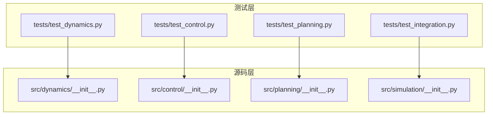
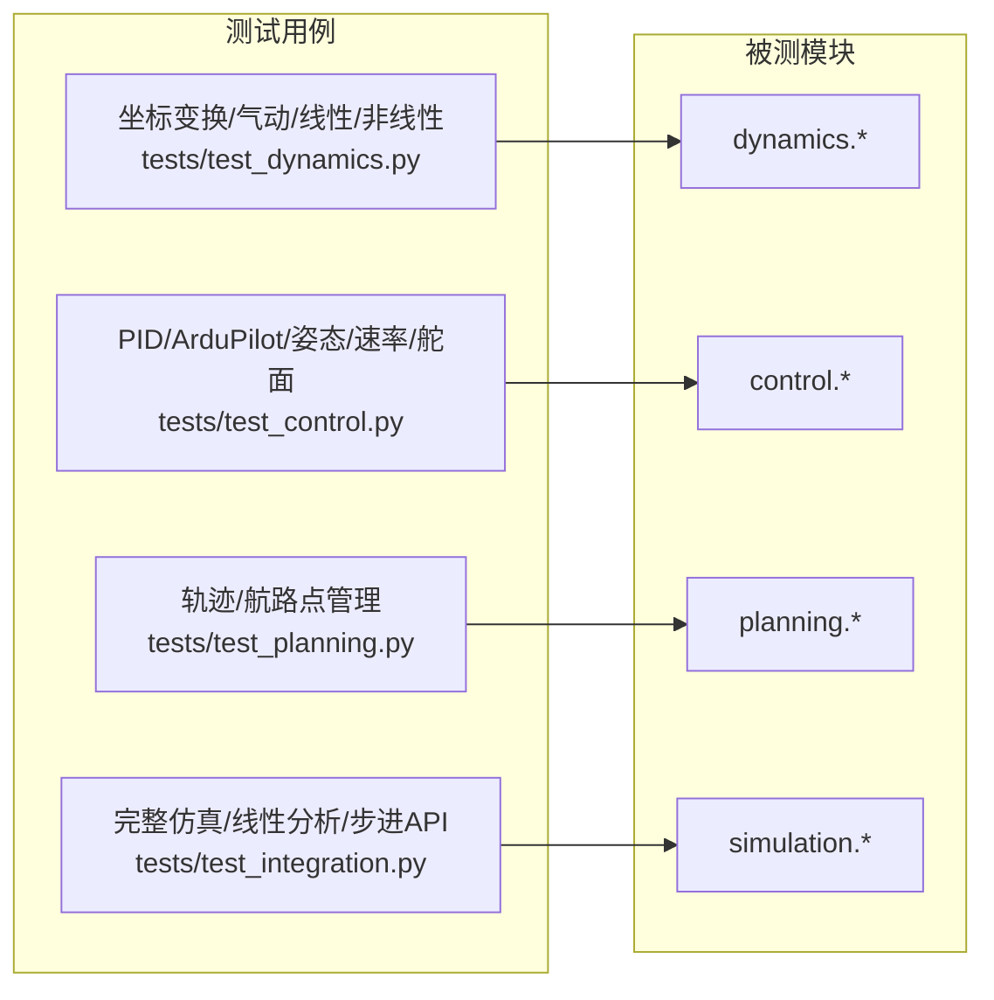
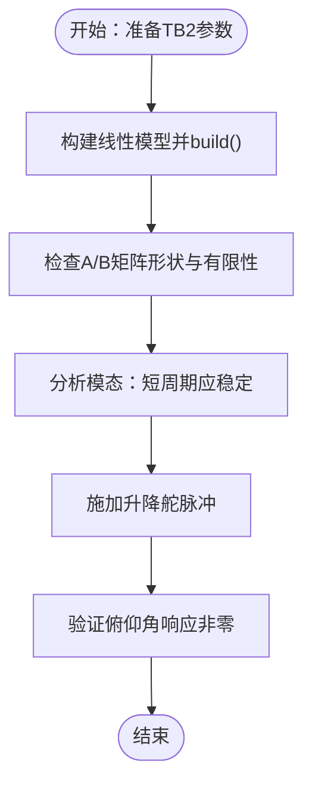
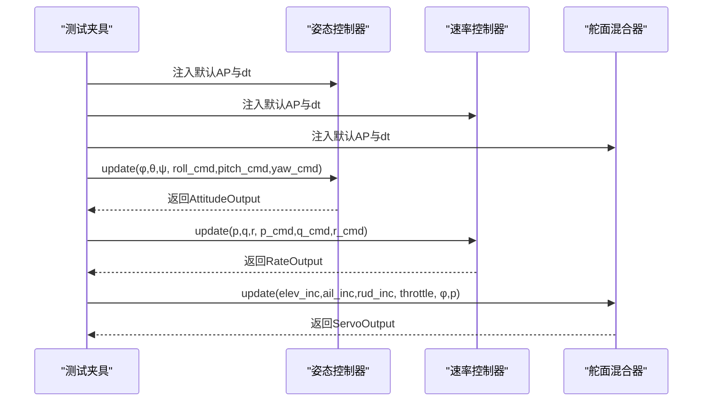
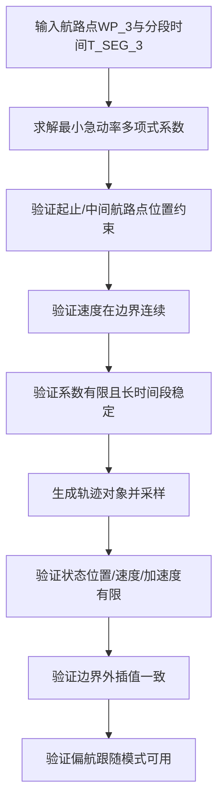
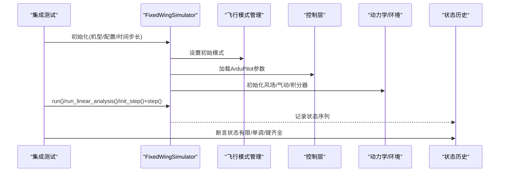
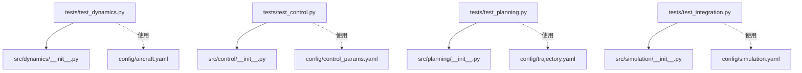

# 单元测试

<cite>
**本文引用的文件**
- [tests/test_dynamics.py](file://tests/test_dynamics.py)
- [tests/test_control.py](file://tests/test_control.py)
- [tests/test_planning.py](file://tests/test_planning.py)
- [tests/test_integration.py](file://tests/test_integration.py)
- [src/dynamics/__init__.py](file://src/dynamics/__init__.py)
- [src/control/__init__.py](file://src/control/__init__.py)
- [src/planning/__init__.py](file://src/planning/__init__.py)
- [src/simulation/__init__.py](file://src/simulation/__init__.py)
- [config/aircraft.yaml](file://config/aircraft.yaml)
- [config/control_params.yaml](file://config/control_params.yaml)
- [config/simulation.yaml](file://config/simulation.yaml)
- [config/trajectory.yaml](file://config/trajectory.yaml)
</cite>

## 目录
1. [引言](#引言)
2. [项目结构](#项目结构)
3. [核心组件](#核心组件)
4. [架构总览](#架构总览)
5. [详细组件分析](#详细组件分析)
6. [依赖分析](#依赖分析)
7. [性能考虑](#性能考虑)
8. [故障排查指南](#故障排查指南)
9. [结论](#结论)
10. [附录](#附录)

## 引言
本文件系统化梳理本项目的单元测试与集成测试实现，覆盖动力学、控制、规划三大模块，并补充集成测试场景。内容包括：
- 各模块测试夹具的使用方法与测试数据准备
- 关键测试用例与断言逻辑解析
- 测试设计原则、边界条件与异常处理策略
- 新功能测试编写指南、覆盖率与质量标准建议
- 调试技巧与常见问题解决方案

## 项目结构
测试文件按功能域划分，分别位于 tests/ 下：
- 动力学：tests/test_dynamics.py
- 控制：tests/test_control.py
- 规划：tests/test_planning.py
- 集成：tests/test_integration.py

各模块通过 src/* 包导出接口，测试通过 sys.path 插入 src/ 的方式导入被测模块。

图表来源
- [tests/test_dynamics.py](file://tests/test_dynamics.py#L29-L45)
- [tests/test_control.py](file://tests/test_control.py#L27-L31)
- [tests/test_planning.py](file://tests/test_planning.py#L27-L30)
- [tests/test_integration.py](file://tests/test_integration.py#L32-L34)

章节来源
- [tests/test_dynamics.py](file://tests/test_dynamics.py#L1-L336)
- [tests/test_control.py](file://tests/test_control.py#L1-L371)
- [tests/test_planning.py](file://tests/test_planning.py#L1-L328)
- [tests/test_integration.py](file://tests/test_integration.py#L1-L391)

## 核心组件
- 动力学测试：坐标变换、气动计算、线性模型、非线性模型
- 控制测试：PID控制器、ArduPilot参数、姿态/速率控制器、舵面混合器
- 规划测试：最小急动率/急加速度轨迹、航路点管理
- 集成测试：完整仿真流程、线性分析、步进API一致性校验

章节来源
- [tests/test_dynamics.py](file://tests/test_dynamics.py#L67-L336)
- [tests/test_control.py](file://tests/test_control.py#L61-L371)
- [tests/test_planning.py](file://tests/test_planning.py#L51-L328)
- [tests/test_integration.py](file://tests/test_integration.py#L70-L391)

## 架构总览
下图展示测试到被测模块的依赖关系与调用路径。

图表来源
- [tests/test_dynamics.py](file://tests/test_dynamics.py#L29-L45)
- [tests/test_control.py](file://tests/test_control.py#L27-L31)
- [tests/test_planning.py](file://tests/test_planning.py#L27-L30)
- [tests/test_integration.py](file://tests/test_integration.py#L32-L34)

## 详细组件分析

### 动力学测试（坐标变换、气动、线性/非线性模型）
- 测试夹具
  - tb2_params：从数据库加载 TB2 参数
  - tb2_linear：构建线性模型实例，返回模型与参数
- 关键断言
  - 旋转矩阵正交性、行列式为 +1、零欧拉角时为单位阵
  - 轮换往返变换一致性（body↔NED）
  - 风速在零欧拉角时等价、无风时空速向量等于机体速度
  - 动压公式正确性、零速度时的数值稳定约束
  - 线性模型状态矩阵形状、有限性、模态稳定性、脉冲激励下的响应
  - 非线性模型配平收敛、状态导数维度、配平点附近导数接近零、短时仿真的稳定性与高度非负
  - 全部机型的配平可用性校验

图表来源
- [tests/test_dynamics.py](file://tests/test_dynamics.py#L56-L60)
- [tests/test_dynamics.py](file://tests/test_dynamics.py#L201-L255)

章节来源
- [tests/test_dynamics.py](file://tests/test_dynamics.py#L48-L121)
- [tests/test_dynamics.py](file://tests/test_dynamics.py#L123-L195)
- [tests/test_dynamics.py](file://tests/test_dynamics.py#L197-L336)

### 控制测试（PID、ArduPilot参数、姿态/速率控制器、舵面混合器）
- 测试夹具
  - default_ap：默认 ArduPilot 参数对象
  - attitude_ctrl、rate_ctrl、mixer：分别注入姿态、速率、舵面混合器实例
- 关键断言
  - PID：纯比例、积分累积、微分首步行为、输出饱和、抗积分饱和、重置清零、增益更新、前馈叠加、零误差输出
  - ArduPilot 参数：默认值、属性映射、部分字典加载、未知键忽略、校验规则、序列化往返
  - 姿态控制器：输出类型、零误差时角速度命令为零、误差产生相应命令、限幅内合理
  - 速率控制器：输出类型、零误差输出、限幅、重置后纯比例积分归零
  - 舵面混合器：输出类型、零增量、油门限幅、升降舵幅限、角度换算、协调转弯（滚转率导致方向舵补偿）、输出归一化

图表来源
- [tests/test_control.py](file://tests/test_control.py#L37-L54)
- [tests/test_control.py](file://tests/test_control.py#L201-L253)
- [tests/test_control.py](file://tests/test_control.py#L259-L305)
- [tests/test_control.py](file://tests/test_control.py#L311-L371)

章节来源
- [tests/test_control.py](file://tests/test_control.py#L34-L148)
- [tests/test_control.py](file://tests/test_control.py#L154-L196)
- [tests/test_control.py](file://tests/test_control.py#L198-L253)
- [tests/test_control.py](file://tests/test_control.py#L258-L305)
- [tests/test_control.py](file://tests/test_control.py#L311-L371)

### 规划测试（最小急动率/急加速度轨迹、航路点管理）
- 测试夹具与共享数据
  - 3航路点数组 WP_3 与分段时间 T_SEG_3
- 关键断言
  - 多项式系数维度：2航路点1段8系数（deriv_order=4），3航路点2段6系数（deriv_order=3）
  - 起止与中间航路点满足位置约束
  - 速度在分段边界连续
  - 所有系数有限；长时间段稳定性
  - 最小急动率轨迹：起止与中间航路点满足、速度连续、状态有限、边界外插值、偏航跟随模式可用、长距离轨迹有效
  - 最小急加速度轨迹：与最小急动率对比的定性验证
  - 航路点管理：海拔转换（正上方为负NED Down）、清空、NED直插、构建不同轨迹类型、至少两点才可构建、YAML往返、活动分段查询

图表来源
- [tests/test_planning.py](file://tests/test_planning.py#L37-L44)
- [tests/test_planning.py](file://tests/test_planning.py#L51-L116)
- [tests/test_planning.py](file://tests/test_planning.py#L122-L186)
- [tests/test_planning.py](file://tests/test_planning.py#L189-L246)
- [tests/test_planning.py](file://tests/test_planning.py#L252-L328)

章节来源
- [tests/test_planning.py](file://tests/test_planning.py#L33-L116)
- [tests/test_planning.py](file://tests/test_planning.py#L118-L186)
- [tests/test_planning.py](file://tests/test_planning.py#L189-L246)
- [tests/test_planning.py](file://tests/test_planning.py#L248-L328)

### 集成测试（完整仿真、线性分析、步进API）
- 场景与断言
  - 开环（TB2、Anka）：5秒不发散，状态有限
  - 闭环 STABILIZE（TB2）：5秒稳定，历史长度与单调性校验
  - 闭环 AUTO + 航迹：10秒稳定，向北移动，最小急加速度轨迹同样稳定
  - 线性分析：返回结果类型、模式数量、摘要字符串、全部机型可用
  - 步进API：初始化返回有效状态，多次 step() 结果有限，与 run() 最终状态近似一致
  - 状态历史：数组往返一致性、派生量（空速、攻角、高度）正确性、字典键齐全

图表来源
- [tests/test_integration.py](file://tests/test_integration.py#L70-L106)
- [tests/test_integration.py](file://tests/test_integration.py#L112-L158)
- [tests/test_integration.py](file://tests/test_integration.py#L164-L218)
- [tests/test_integration.py](file://tests/test_integration.py#L224-L261)
- [tests/test_integration.py](file://tests/test_integration.py#L267-L343)
- [tests/test_integration.py](file://tests/test_integration.py#L349-L391)

章节来源
- [tests/test_integration.py](file://tests/test_integration.py#L41-L58)
- [tests/test_integration.py](file://tests/test_integration.py#L70-L106)
- [tests/test_integration.py](file://tests/test_integration.py#L112-L158)
- [tests/test_integration.py](file://tests/test_integration.py#L164-L218)
- [tests/test_integration.py](file://tests/test_integration.py#L224-L261)
- [tests/test_integration.py](file://tests/test_integration.py#L267-L343)
- [tests/test_integration.py](file://tests/test_integration.py#L349-L391)

## 依赖分析
- 测试对被测模块的依赖通过 src/* 导出接口建立，测试文件统一在开头插入 src/ 以保证导入。
- 配置文件用于驱动仿真与控制参数，测试中通过配置目录传入或直接构造对象进行验证。

图表来源
- [src/dynamics/__init__.py](file://src/dynamics/__init__.py#L3-L21)
- [src/control/__init__.py](file://src/control/__init__.py#L3-L23)
- [src/planning/__init__.py](file://src/planning/__init__.py#L3-L13)
- [src/simulation/__init__.py](file://src/simulation/__init__.py#L3-L11)
- [config/aircraft.yaml](file://config/aircraft.yaml#L1-L13)
- [config/control_params.yaml](file://config/control_params.yaml#L1-L45)
- [config/simulation.yaml](file://config/simulation.yaml#L1-L30)
- [config/trajectory.yaml](file://config/trajectory.yaml#L1-L23)

章节来源
- [src/dynamics/__init__.py](file://src/dynamics/__init__.py#L1-L22)
- [src/control/__init__.py](file://src/control/__init__.py#L1-L24)
- [src/planning/__init__.py](file://src/planning/__init__.py#L1-L14)
- [src/simulation/__init__.py](file://src/simulation/__init__.py#L1-L12)

## 性能考虑
- 单元测试优先关注数值正确性与稳定性，避免过长运行时间。
- 集成测试采用较短时长与合理步长，确保在可接受时间内完成收敛性与稳定性验证。
- 对于大规模遍历（如全机队线性分析），采用批量循环并在单测中覆盖代表性场景。

## 故障排查指南
- 数值发散
  - 现象：高度/空速/攻角出现非有限值或越界
  - 排查：检查风场、配平、控制限幅、积分器设置
  - 参考断言：历史状态有限性与范围检查
- 配平失败
  - 现象：非线性模型配平返回非有限值
  - 排查：确认气动参数、初始条件、控制输入是否合理
  - 参考断言：配平收敛与AoA/速度范围
- 舵面/速率输出异常
  - 现象：输出超出限幅或未按预期变化
  - 排查：检查限幅参数、增益、前馈与抗饱和机制
  - 参考断言：输出限幅、零误差输出、重置后清零
- 轨迹不连续
  - 现象：分段边界速度/加速度不连续
  - 排查：确认分段时间与多项式阶次、边界条件
  - 参考断言：边界连续性与系数有限性

章节来源
- [tests/test_integration.py](file://tests/test_integration.py#L41-L58)
- [tests/test_dynamics.py](file://tests/test_dynamics.py#L263-L336)
- [tests/test_control.py](file://tests/test_control.py#L285-L305)
- [tests/test_planning.py](file://tests/test_planning.py#L96-L116)

## 结论
本项目的测试体系覆盖了从底层数学函数到高层仿真管线的关键环节，既保证了模块内部的正确性，也验证了跨模块协作的稳定性。通过规范化的夹具与断言策略，测试能够快速定位问题并指导修复。建议在新增功能时遵循现有测试模式，确保新增用例与边界条件得到充分覆盖。

## 附录

### 测试夹具与数据准备
- 动力学
  - tb2_params：从数据库读取 TB2 参数，供 aerodynamics、linear/nonlinear 模型使用
  - tb2_linear：构建线性模型并执行 build，返回模型与参数，便于后续模态分析与仿真
- 控制
  - default_ap：默认 ArduPilot 参数对象
  - attitude_ctrl/rate_ctrl/mixer：注入 dt 与 AP 参数，构造控制器实例
- 规划
  - 共享测试数据：WP_3、T_SEG_3，用于最小急动率轨迹与航路点管理测试
- 集成
  - 通过配置目录传入仿真配置，或直接构造对象进行验证

章节来源
- [tests/test_dynamics.py](file://tests/test_dynamics.py#L51-L60)
- [tests/test_control.py](file://tests/test_control.py#L37-L54)
- [tests/test_planning.py](file://tests/test_planning.py#L37-L44)
- [tests/test_integration.py](file://tests/test_integration.py#L63-L63)

### 测试用例设计原则与最佳实践
- 边界条件
  - 零输入/零误差：验证系统在基准状态下的行为（如零误差输出、零增量舵面）
  - 极端参数：最大/最小限幅、长时间段、长距离轨迹
- 异常处理
  - 未知键/非法参数：验证忽略与校验逻辑
  - 非有限值：断言所有状态与系数有限
- 性能与稳定性
  - 短时仿真与合理步长，确保稳定性与收敛性
  - 对多机型/多场景进行批量校验
- 覆盖率与质量标准
  - 建议：核心算法与关键路径覆盖率≥80%，边界与异常分支全覆盖
  - 质量标准：断言明确、可重复、与配置解耦（通过夹具注入）

### 为新功能编写单元测试的步骤
- 明确模块职责与接口，确定需要测试的输入/输出与边界
- 编写夹具准备测试数据（参数、几何、时间序列等）
- 设计用例：正常路径、边界条件、异常输入
- 编写断言：数值正确性、稳定性、类型与形状、一致性
- 在集成测试中验证跨模块协作（如仿真主循环、线性分析、步进API）