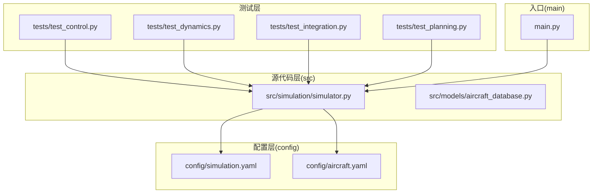
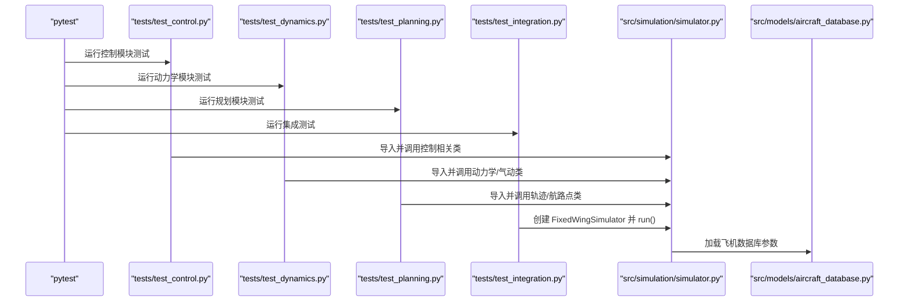
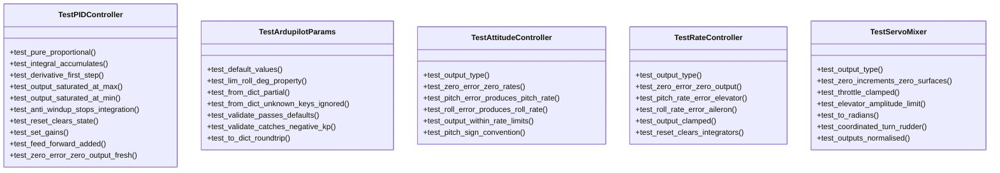
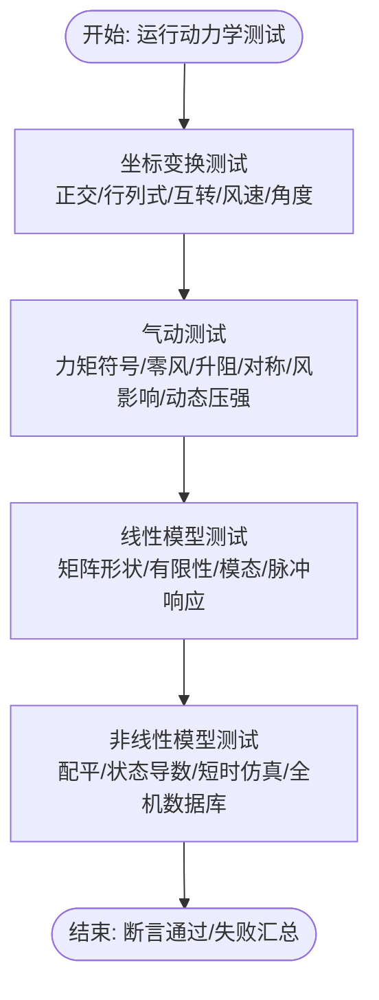
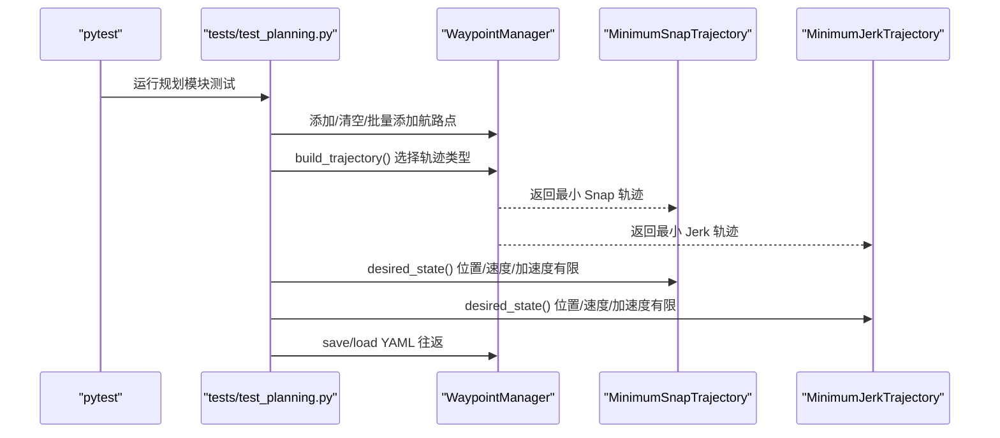
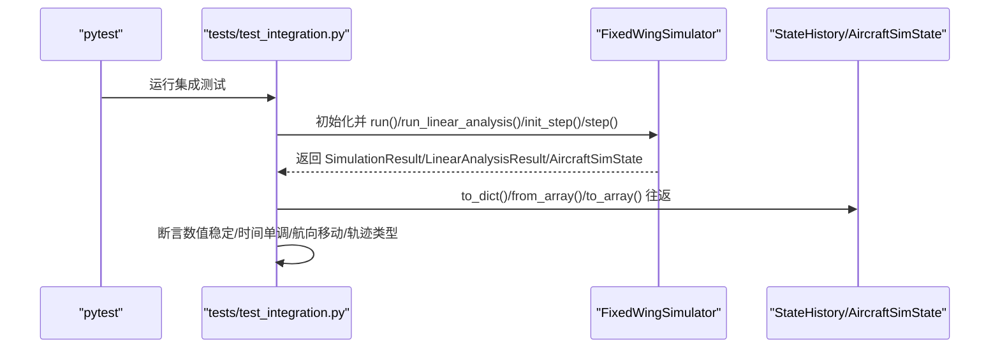
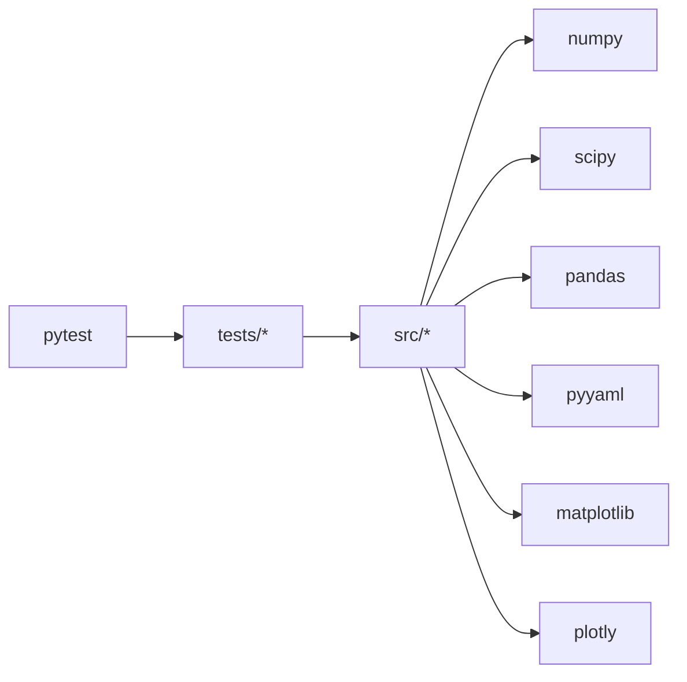

# 测试执行与维护

<cite>
**本文引用的文件**
- [tests/test_control.py](file://tests/test_control.py)
- [tests/test_dynamics.py](file://tests/test_dynamics.py)
- [tests/test_integration.py](file://tests/test_integration.py)
- [tests/test_planning.py](file://tests/test_planning.py)
- [setup.py](file://setup.py)
- [requirements.txt](file://requirements.txt)
- [main.py](file://main.py)
- [config/simulation.yaml](file://config/simulation.yaml)
- [config/aircraft.yaml](file://config/aircraft.yaml)
- [src/simulation/simulator.py](file://src/simulation/simulator.py)
- [src/models/aircraft_database.py](file://src/models/aircraft_database.py)
- [.gitignore](file://.gitignore)
</cite>

## 目录
1. [简介](#简介)
2. [项目结构](#项目结构)
3. [核心组件](#核心组件)
4. [架构总览](#架构总览)
5. [详细组件分析](#详细组件分析)
6. [依赖关系分析](#依赖关系分析)
7. [性能考虑](#性能考虑)
8. [故障排除指南](#故障排除指南)
9. [结论](#结论)
10. [附录](#附录)

## 简介
本指南面向测试工程师与开发者，系统阐述该固定翼无人机仿真平台的测试执行与维护方法。内容涵盖：
- 测试套件运行方式与命令行参数配置
- 测试环境与依赖项设置
- 持续集成（CI）与自动化测试流程建议
- 测试报告生成与结果分析
- 覆盖率分析工具使用与阈值设置
- 测试数据管理与版本控制策略
- 性能优化与并行测试执行
- 常见问题排查与测试用例长期维护建议

## 项目结构
项目采用“源代码在 src/，测试在 tests/”的分层组织，配合配置文件 config/ 与示例脚本 main.py。测试覆盖控制、动力学、规划与端到端集成四个维度。

**图表来源**
- [tests/test_control.py](file://tests/test_control.py#L1-L371)
- [tests/test_dynamics.py](file://tests/test_dynamics.py#L1-L336)
- [tests/test_integration.py](file://tests/test_integration.py#L1-L391)
- [tests/test_planning.py](file://tests/test_planning.py#L1-L328)
- [src/simulation/simulator.py](file://src/simulation/simulator.py#L1-L200)
- [src/models/aircraft_database.py](file://src/models/aircraft_database.py#L1-L183)
- [config/simulation.yaml](file://config/simulation.yaml#L1-L30)
- [config/aircraft.yaml](file://config/aircraft.yaml#L1-L13)
- [main.py](file://main.py#L1-L145)

**章节来源**
- [tests/test_control.py](file://tests/test_control.py#L1-L371)
- [tests/test_dynamics.py](file://tests/test_dynamics.py#L1-L336)
- [tests/test_integration.py](file://tests/test_integration.py#L1-L391)
- [tests/test_planning.py](file://tests/test_planning.py#L1-L328)
- [src/simulation/simulator.py](file://src/simulation/simulator.py#L1-L200)
- [src/models/aircraft_database.py](file://src/models/aircraft_database.py#L1-L183)
- [config/simulation.yaml](file://config/simulation.yaml#L1-L30)
- [config/aircraft.yaml](file://config/aircraft.yaml#L1-L13)
- [main.py](file://main.py#L1-L145)

## 核心组件
- 控制模块单元测试：验证 PID、Ardupilot 参数、姿态/速率控制器与舵混合器的行为与边界条件。
- 动力学模块单元测试：验证坐标变换、气动计算、线性/非线性模型的稳定性与一致性。
- 规划模块单元测试：验证最小 Snap/Jerk 轨迹、航路点管理与 YAML 序列化往返。
- 集成测试：端到端运行完整仿真管线，验证数值稳定性和跨模块协作。

**章节来源**
- [tests/test_control.py](file://tests/test_control.py#L58-L371)
- [tests/test_dynamics.py](file://tests/test_dynamics.py#L64-L336)
- [tests/test_planning.py](file://tests/test_planning.py#L48-L328)
- [tests/test_integration.py](file://tests/test_integration.py#L66-L391)

## 架构总览
下图展示测试与被测模块之间的交互关系，以及配置加载路径。

**图表来源**
- [tests/test_control.py](file://tests/test_control.py#L27-L31)
- [tests/test_dynamics.py](file://tests/test_dynamics.py#L29-L45)
- [tests/test_planning.py](file://tests/test_planning.py#L27-L31)
- [tests/test_integration.py](file://tests/test_integration.py#L32-L34)
- [src/simulation/simulator.py](file://src/simulation/simulator.py#L130-L200)
- [src/models/aircraft_database.py](file://src/models/aircraft_database.py#L143-L166)

## 详细组件分析

### 控制模块测试（PID/Ardupilot/姿态/速率/舵混合）
- 关键断言点：纯比例输出、积分累积、微分首步行为、饱和钳位、抗积分饱和、重置状态、前馈叠加、零误差输出等。
- 夹具（fixture）复用：默认 Ardupilot 参数、姿态/速率控制器、舵混合器实例，减少重复初始化。
- 输出类型与物理限制：确保输出结构体类型正确、幅值与速率限制满足安全边界。

**图表来源**
- [tests/test_control.py](file://tests/test_control.py#L61-L371)

**章节来源**
- [tests/test_control.py](file://tests/test_control.py#L37-L371)

### 动力学模块测试（坐标变换/气动/线性/非线性模型）
- 坐标变换：旋转矩阵正交性、行列式为 1、NED 与机体系互转、风速转换、欧拉角率关系、角度归一化。
- 气动：力矩符号一致性、零风一致性、升阻系数正性、对称性（副翼）、动态压强计算、风影响。
- 线性模型：状态矩阵形状、有限性、模态分析数量与稳定性、脉冲激励响应、短周期模态稳定。
- 非线性模型：配平收敛、状态导数维数、配平附近导数接近零、短时仿真稳定性、全机数据库配平。

**图表来源**
- [tests/test_dynamics.py](file://tests/test_dynamics.py#L67-L336)

**章节来源**
- [tests/test_dynamics.py](file://tests/test_dynamics.py#L67-L336)

### 规划模块测试（最小 Snap/Jerk/航路点）
- 最小 Snap：多项式系数维度、边界条件满足、段间连续性、系数有限性、长时间段稳定性。
- 最小 Jerk：位置连续、速度连续、有限状态、与 Snap 的总急动量对比。
- 航路点管理：高度单位转换、清空、批量添加、轨迹构建类型选择、YAML 往返、活动段查询。

**图表来源**
- [tests/test_planning.py](file://tests/test_planning.py#L27-L328)

**章节来源**
- [tests/test_planning.py](file://tests/test_planning.py#L48-L328)

### 集成测试（端到端仿真）
- 开环/闭环场景：TB2/Anka 在不同模式与风场下的稳定性检查；历史数组长度与时序单调性；AUTO 模式航向与航程验证；线性分析兼容性；步进 API 一致性校验；状态历史与状态对象的序列化往返。

**图表来源**
- [tests/test_integration.py](file://tests/test_integration.py#L32-L391)
- [src/simulation/simulator.py](file://src/simulation/simulator.py#L59-L109)

**章节来源**
- [tests/test_integration.py](file://tests/test_integration.py#L66-L391)
- [src/simulation/simulator.py](file://src/simulation/simulator.py#L59-L109)

## 依赖关系分析
- 测试依赖：pytest 作为测试运行器；NumPy/SciPy/Pandas/PyYAML/Matplotlib/Plotly 作为核心库。
- 包安装：setup.py 定义了生产依赖与开发依赖（pytest），requirements.txt 提供运行时依赖约束。
- 路径注入：各测试文件在导入 src 下模块前，显式将 src 插入 sys.path，保证从项目根可导入。

**图表来源**
- [requirements.txt](file://requirements.txt#L1-L8)
- [setup.py](file://setup.py#L11-L21)
- [tests/test_control.py](file://tests/test_control.py#L22-L25)

**章节来源**
- [requirements.txt](file://requirements.txt#L1-L8)
- [setup.py](file://setup.py#L11-L21)
- [tests/test_control.py](file://tests/test_control.py#L22-L25)

## 性能考虑
- 测试粒度与并行：pytest 支持多进程并行（如使用 xdist 插件），可在 CI 中按模块拆分并行执行，缩短总耗时。
- 数据规模与循环：避免在单测中进行超长仿真或大矩阵运算；必要时使用 fixtures 缓存中间结果。
- 断言精度：合理设置容差（如绝对/相对容差）以平衡精度与性能。
- 可视化与日志：集成测试中的可视化与日志写入会增加 IO 成本，建议在本地调试开启，在 CI 中关闭或降级。
- 依赖版本：锁定 NumPy/SciPy 版本范围，避免因底层库差异导致性能波动。

[本节为通用指导，无需具体文件引用]

## 故障排除指南
- 导入错误（ModuleNotFoundError）：确认测试运行前已将 src 插入 sys.path，或在项目根目录使用标准安装方式运行测试。
- 配置路径问题：集成测试通过 CONFIG_DIR 指定 config 目录；若自定义路径，请确保路径存在且包含所需 YAML。
- 数值发散：集成测试包含“未发散”断言（最大高度/速度/俯仰角），若失败需检查 dt、风场、初始条件与控制增益。
- 风险提示：.gitignore 忽略了 .pytest_cache、.coverage、htmlcov 等目录，建议在 CI 中清理缓存以避免污染。

**章节来源**
- [tests/test_integration.py](file://tests/test_integration.py#L41-L58)
- [.gitignore](file://.gitignore#L13-L16)

## 结论
本项目测试体系覆盖控制、动力学、规划与端到端集成，具备良好的模块化与可维护性。建议在 CI 中引入并行执行、覆盖率统计与报告归档，并结合配置文件与数据库参数变化建立回归基线，确保长期有效性。

[本节为总结，无需具体文件引用]

## 附录

### A. 测试运行与命令行参数
- 运行全部测试：在项目根目录执行测试运行器（如 pytest），自动发现 tests/ 下的测试文件。
- 常用参数（pytest）：-v（详细输出）、-x（首个失败即停止）、--tb=short（简要回溯）、--lf/--ff（上次失败优先/最快失败）。
- 并行执行：在 CI 中使用 pytest-xdist（如 -n auto）按 CPU 核数并行。
- 仅运行某模块：pytest tests/test_control.py 或 tests/test_dynamics.py 等。
- 生成覆盖率：pytest --cov=src --cov-report=term-missing --cov-report=html:htmlcov tests/；在 CI 中建议只上传 HTML 报告以便审阅。

**章节来源**
- [requirements.txt](file://requirements.txt#L7-L7)
- [.gitignore](file://.gitignore#L15-L16)

### B. 测试环境与依赖项设置
- Python 版本：Python >= 3.10。
- 安装依赖：pip install -e ".[dev]"（开发依赖含 pytest）；或 pip install -r requirements.txt。
- 运行前准备：确保项目根目录可导入 src；pytest 会自动处理 sys.path 注入（测试文件内已实现）。

**章节来源**
- [setup.py](file://setup.py#L10-L21)
- [requirements.txt](file://requirements.txt#L1-L8)
- [tests/test_control.py](file://tests/test_control.py#L22-L25)

### C. 持续集成（CI）与自动化测试流程
- 触发条件：push 到主分支、PR 合并请求、手动触发。
- 步骤建议：
  - 安装 Python 与依赖
  - 运行 pytest 并启用并行（如 -n auto）
  - 生成覆盖率报告（HTML/终端缺失行）
  - 上传覆盖率与测试日志
  - 对比历史覆盖率阈值（见下节）
- 配置文件：可在仓库根目录放置 CI 配置文件（如 .github/workflows/test.yml），按需加入缓存、矩阵测试（不同 Python/NumPy 版本组合）。

[本节为通用流程建议，无需具体文件引用]

### D. 测试报告生成与结果分析
- 报告格式：pytest 默认控制台输出；结合 --cov 生成 HTML 报告与终端缺失行明细。
- 结果分析：关注未覆盖的关键路径（如极端输入、边界条件、异常分支）；结合覆盖率阈值逐步提升。

**章节来源**
- [requirements.txt](file://requirements.txt#L7-L7)
- [.gitignore](file://.gitignore#L15-L16)

### E. 覆盖率分析工具与阈值设置
- 工具：pytest-cov（内置在 pytest 中，需安装 dev 依赖）。
- 建议阈值（可按模块细化）：
  - 行覆盖率：≥80%
  - 分支覆盖率：≥60%
  - 关键模块（控制/动力学）可提高至 ≥85%/≥70%
- CI 集成：在 PR 中显示覆盖率变化；对低于阈值的提交标记为“需要改进”。

**章节来源**
- [requirements.txt](file://requirements.txt#L7-L7)

### F. 测试数据管理与版本控制策略
- 配置文件：config/*.yaml 用于仿真参数与飞机数据库选择；变更应伴随测试更新。
- 数据库：aircraft_database.py 内置 7 架飞机参数；新增/修改参数需同步更新测试断言。
- 版本控制：对 config 与数据库的任何结构性变更应在 PR 中明确说明影响范围；使用分支与标签管理回归基线。

**章节来源**
- [config/simulation.yaml](file://config/simulation.yaml#L1-L30)
- [config/aircraft.yaml](file://config/aircraft.yaml#L1-L13)
- [src/models/aircraft_database.py](file://src/models/aircraft_database.py#L29-L133)

### G. 测试性能优化与并行执行
- 并行策略：按模块拆分（控制/动力学/规划/集成），在 CI 中并行执行。
- 减少 IO：禁用/延迟可视化；合并相似断言以降低函数调用开销。
- 依赖隔离：使用虚拟环境与固定依赖版本，避免 CI 环境漂移。

[本节为通用指导，无需具体文件引用]

### H. 维护测试用例的长期有效性
- 回归基线：对关键仿真场景（如配平、模态、轨迹）保留历史快照与断言。
- 参数扰动：定期对关键参数（如 dt、风速、初始条件）做扰动测试，防止过拟合。
- 文档化：在 README 或测试注释中记录测试目的、预期行为与边界条件，便于后续维护。

[本节为通用指导，无需具体文件引用]