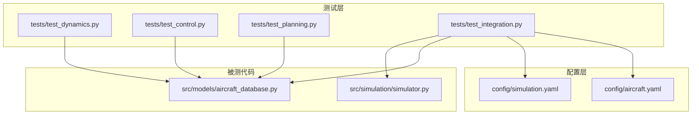
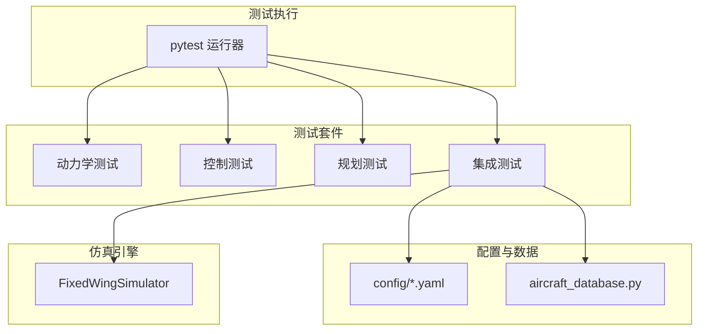
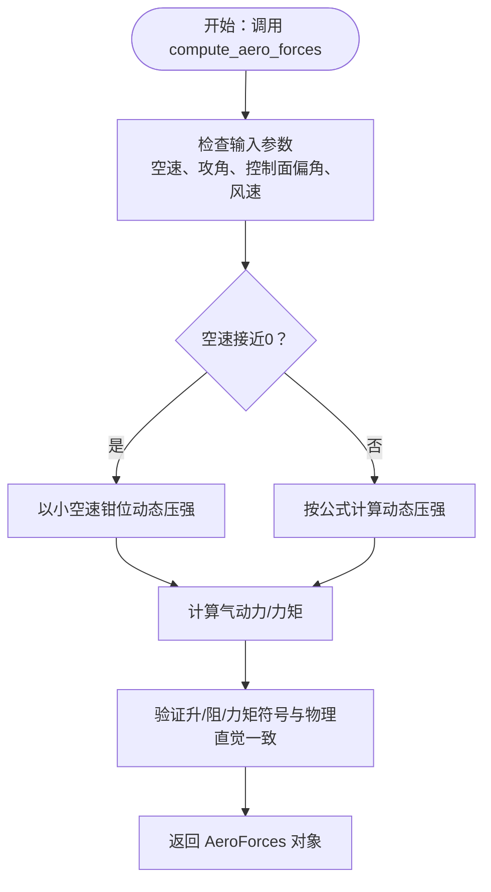
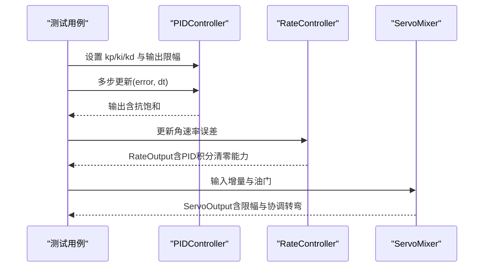
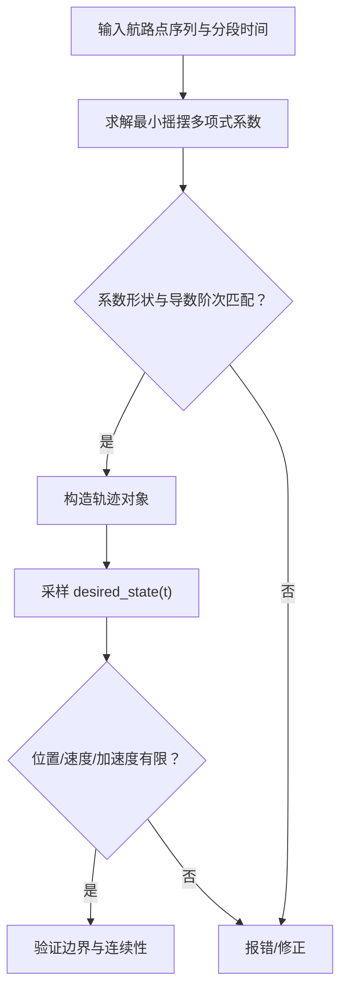
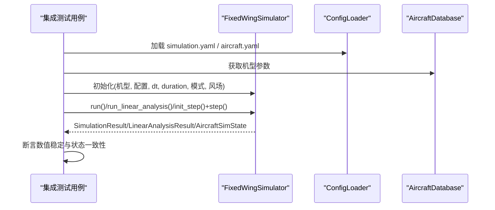
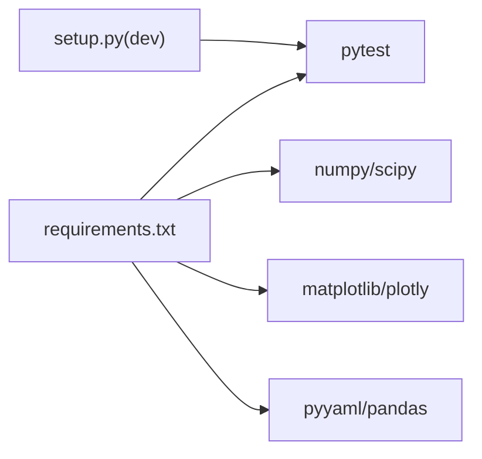

# 测试指南

<cite>
**本文引用的文件**   
- [tests/test_dynamics.py](file://tests/test_dynamics.py)
- [tests/test_control.py](file://tests/test_control.py)
- [tests/test_planning.py](file://tests/test_planning.py)
- [tests/test_integration.py](file://tests/test_integration.py)
- [setup.py](file://setup.py)
- [requirements.txt](file://requirements.txt)
- [config/simulation.yaml](file://config/simulation.yaml)
- [config/aircraft.yaml](file://config/aircraft.yaml)
- [src/simulation/simulator.py](file://src/simulation/simulator.py)
- [src/models/aircraft_database.py](file://src/models/aircraft_database.py)
- [.gitignore](file://.gitignore)
</cite>

## 目录
1. [简介](#简介)
2. [项目结构](#项目结构)
3. [核心组件](#核心组件)
4. [架构总览](#架构总览)
5. [详细组件分析](#详细组件分析)
6. [依赖关系分析](#依赖关系分析)
7. [性能与稳定性考量](#性能与稳定性考量)
8. [故障排查指南](#故障排查指南)
9. [结论](#结论)
10. [附录](#附录)

## 简介
本测试指南面向固定翼无人机仿真平台的测试体系，系统阐述单元测试、控制测试、规划测试、集成测试的组织结构与策略，说明如何运行与维护测试套件，给出覆盖率与质量标准建议，并提供测试用例设计原则、测试数据准备与验证方法、持续集成与自动化测试配置思路、调试技巧与常见问题解决方案，以及为新功能编写测试用例的实践路径。

## 项目结构
测试相关目录与文件分布如下：
- tests/：测试套件，按功能域划分（动力学、控制、规划、集成）
- config/：仿真配置（仿真步长、风场、初始模式等），用于集成测试加载
- src/：被测代码，包含动力学、控制、规划、仿真引擎等模块
- setup.py、requirements.txt：安装与依赖声明
- .gitignore：忽略缓存、覆盖率产物、日志与输出文件

**图示来源**
- [tests/test_dynamics.py](file://tests/test_dynamics.py#L1-L336)
- [tests/test_control.py](file://tests/test_control.py#L1-L371)
- [tests/test_planning.py](file://tests/test_planning.py#L1-L328)
- [tests/test_integration.py](file://tests/test_integration.py#L1-L391)
- [config/simulation.yaml](file://config/simulation.yaml#L1-L30)
- [config/aircraft.yaml](file://config/aircraft.yaml#L1-L13)
- [src/simulation/simulator.py](file://src/simulation/simulator.py#L1-L200)
- [src/models/aircraft_database.py](file://src/models/aircraft_database.py#L1-L183)

**章节来源**
- [tests/test_dynamics.py](file://tests/test_dynamics.py#L1-L336)
- [tests/test_control.py](file://tests/test_control.py#L1-L371)
- [tests/test_planning.py](file://tests/test_planning.py#L1-L328)
- [tests/test_integration.py](file://tests/test_integration.py#L1-L391)
- [config/simulation.yaml](file://config/simulation.yaml#L1-L30)
- [config/aircraft.yaml](file://config/aircraft.yaml#L1-L13)
- [src/simulation/simulator.py](file://src/simulation/simulator.py#L1-L200)
- [src/models/aircraft_database.py](file://src/models/aircraft_database.py#L1-L183)

## 核心组件
- 动力学测试：覆盖坐标变换、气动计算、线性模型与非线性模型的关键行为与数值稳定性
- 控制测试：覆盖PID控制器、ArduPilot参数、姿态/速率控制器、舵面混合器的行为一致性
- 规划测试：覆盖最小摇摆/最小急动轨迹、航路点管理与YAML往返序列化
- 集成测试：覆盖完整仿真管线（开环/闭环、不同机型、轨迹模式）的数值稳定与状态收敛

**章节来源**
- [tests/test_dynamics.py](file://tests/test_dynamics.py#L1-L336)
- [tests/test_control.py](file://tests/test_control.py#L1-L371)
- [tests/test_planning.py](file://tests/test_planning.py#L1-L328)
- [tests/test_integration.py](file://tests/test_integration.py#L1-L391)

## 架构总览
测试架构围绕“按模块分层”的策略组织，每个测试文件聚焦一个子系统或跨子系统的端到端流程。集成测试通过加载真实配置文件驱动完整仿真引擎，确保各模块协同工作时的数值稳定性与一致性。

**图示来源**
- [tests/test_integration.py](file://tests/test_integration.py#L1-L391)
- [config/simulation.yaml](file://config/simulation.yaml#L1-L30)
- [config/aircraft.yaml](file://config/aircraft.yaml#L1-L13)
- [src/simulation/simulator.py](file://src/simulation/simulator.py#L1-L200)
- [src/models/aircraft_database.py](file://src/models/aircraft_database.py#L1-L183)

## 详细组件分析

### 动力学测试（坐标变换、气动、线性/非线性模型）
- 坐标变换：验证方向余弦矩阵正交性、行列式为+1、体/地坐标系往返一致性、零欧拉角情形、风速在不同框架下的映射、欧拉角率与机体角速率的关系、角度归一化
- 气动：验证输出类型与有限性、升阻符号合理性、小速度下的数值稳定处理、侧向对称性（副翼偏转）、升降舵力矩方向、有无风影响下的动态压强变化
- 线性模型：验证状态矩阵维度、有限性、模态数量与稳定性、短周期模态稳定、脉冲激励下的响应形状与幅度
- 非线性模型：验证配平收敛与合理范围、状态导数维度、配平点处导数接近零、短时仿真时间与高度边界、多机型配平一致性

**图示来源**
- [tests/test_dynamics.py](file://tests/test_dynamics.py#L127-L195)

**章节来源**
- [tests/test_dynamics.py](file://tests/test_dynamics.py#L67-L336)

### 控制测试（PID、ArduPilot参数、姿态/速率控制、舵面混合）
- PID：纯比例、积分累积、微分首步、输出饱和、抗积分饱和、重置、增益更新、前馈叠加、零误差输出
- ArduPilot参数：默认值、属性换算、部分字典初始化、未知键处理、校验、序列化往返
- 姿态控制器：输出类型、零误差零率命令、误差产生期望角速率、限幅与符号约定
- 速率控制器：输出类型、零误差零增量、误差产生增量、输出限幅、重置后纯比例积分清零
- 舵面混合：输出类型、零增量零舵偏、油门限幅、升降舵幅限、角度换算、协调转弯补偿、归一化限幅

**图示来源**
- [tests/test_control.py](file://tests/test_control.py#L61-L371)

**章节来源**
- [tests/test_control.py](file://tests/test_control.py#L1-L371)

### 规划测试（轨迹与航路点管理）
- 最小摇摆系数：验证输出形状、边界满足、连续性、数值稳定性
- 最小摇摆轨迹：期望状态类型、起点/终点/航路点位置满足、速度/加速度维度、全程有限、时间外夹持、偏航跟随模式
- 最小急动轨迹：与最小摇摆对比的连续性与“更平滑”定性特征
- 航路点管理：海拔转换、清空、批量添加、按类型构建轨迹、至少两点约束、YAML往返序列化、活动段查询

**图示来源**
- [tests/test_planning.py](file://tests/test_planning.py#L51-L246)

**章节来源**
- [tests/test_planning.py](file://tests/test_planning.py#L1-L328)

### 集成测试（完整仿真管线）
- 开环/闭环场景：TB2/Anka、STABILIZE/AUTO、轨迹模式、风场配置
- 数值稳定性：高度、空速、俯仰角上限检查；历史数组长度与单调性；时间向量严格递增
- 步进API：init_step()/step() 返回有效状态；与 run() 结果一致性近似校验
- 线性分析：返回结果类型、模式数量、摘要字符串有效性、全机数据库兼容
- 状态容器：数组往返一致性、派生量正确性、历史字典键完备

**图示来源**
- [tests/test_integration.py](file://tests/test_integration.py#L70-L391)
- [src/simulation/simulator.py](file://src/simulation/simulator.py#L115-L200)
- [src/models/aircraft_database.py](file://src/models/aircraft_database.py#L143-L166)

**章节来源**
- [tests/test_integration.py](file://tests/test_integration.py#L1-L391)
- [src/simulation/simulator.py](file://src/simulation/simulator.py#L1-L200)
- [src/models/aircraft_database.py](file://src/models/aircraft_database.py#L1-L183)

## 依赖关系分析
- 测试依赖：pytest、numpy、scipy、matplotlib、plotly、pyyaml、pandas
- 运行时依赖：与 setup.py 中 extras_require 的 dev 分组保持一致
- 忽略产物：pytest 缓存、覆盖率产物、日志与CSV输出

**图示来源**
- [requirements.txt](file://requirements.txt#L1-L8)
- [setup.py](file://setup.py#L19-L21)

**章节来源**
- [requirements.txt](file://requirements.txt#L1-L8)
- [setup.py](file://setup.py#L1-L23)
- [.gitignore](file://.gitignore#L13-L16)

## 性能与稳定性考量
- 单元测试：关注数学性质与边界条件（如小速度钳位、正交性、有限性），避免昂贵的数值积分
- 控制测试：重点验证抗饱和、限幅、重置后的瞬态行为，确保闭环鲁棒性
- 规划测试：验证连续性与系数稳定性，避免大时间跨度导致的病态系数
- 集成测试：使用较短时长与合理 dt，确保数值稳定；对异常输入（如单点航路点）进行显式错误断言

[本节为通用指导，无需特定文件引用]

## 故障排查指南
- 运行测试失败
  - 确认已安装开发依赖：pip install -e ".[dev]"
  - 清理缓存：删除 .pytest_cache 与 __pycache__
  - 检查 Python 版本与依赖版本范围
- 集成测试发散
  - 检查 config/simulation.yaml 的 dt、integrator、风场设置
  - 逐步缩短 duration 或增大 dt 排除数值不稳定
- 飞行器参数相关错误
  - 确认 config/aircraft.yaml 的 aircraft_name 在数据库中存在
  - 使用 src/models/aircraft_database.py 提供的列表核对可用机型
- 日志与输出
  - .gitignore 已忽略 .coverage、htmlcov、*.log、*.csv，避免污染仓库
  - 如需定位问题，可在测试中临时开启日志或输出中间变量

**章节来源**
- [requirements.txt](file://requirements.txt#L1-L8)
- [setup.py](file://setup.py#L19-L21)
- [.gitignore](file://.gitignore#L13-L16)
- [config/simulation.yaml](file://config/simulation.yaml#L1-L30)
- [config/aircraft.yaml](file://config/aircraft.yaml#L1-L13)
- [src/models/aircraft_database.py](file://src/models/aircraft_database.py#L135-L136)

## 结论
本测试指南提供了从单元到集成的完整测试策略与实施路径。通过明确的测试分类、清晰的断言目标与稳健的配置驱动，可有效保障仿真引擎在多机型、多模式、多风场下的数值稳定与功能正确性。建议在持续集成中固定 Python 与依赖版本，结合短时集成测试与关键单元测试，形成高性价比的质量保障体系。

[本节为总结，无需特定文件引用]

## 附录

### 测试运行与维护
- 运行全部测试：pytest
- 运行指定模块：pytest tests/test_dynamics.py
- 仅显示失败：pytest --tb=short
- 生成覆盖率报告（如启用）：pytest --cov=src
- 生成 HTML 报告（如启用）：pytest --cov-report=html

**章节来源**
- [requirements.txt](file://requirements.txt#L7-L7)
- [.gitignore](file://.gitignore#L15-L16)

### 测试覆盖率与质量标准（建议）
- 单元测试：核心函数与关键分支覆盖率≥80%
- 集成测试：关键场景（开环/闭环、多机型、轨迹模式）全覆盖
- 覆盖率工具：pytest-cov（可选），报告输出至 htmlcov/
- 质量门禁：CI 中设置最低覆盖率阈值与失败即停策略

[本节为通用建议，无需特定文件引用]

### 测试用例设计原则与编写规范
- 原则
  - 一个测试只验证一个行为或边界
  - 使用 fixtures 组织共享资源（如机型参数、控制器实例）
  - 明确前置条件与期望输出，断言信息具体可读
  - 边界与异常场景优先：零输入、超限、单点航路点、未知机型
- 规范
  - 文件命名：tests/test_<模块>.py
  - 类命名：Test<模块或类名>
  - 方法命名：test_<行为描述>（动词短语）
  - 固定随机种子（如涉及随机数）或容忍合理波动

[本节为通用指导，无需特定文件引用]

### 测试数据准备与验证
- 飞机参数：来自 config/aircraft.yaml 与 src/models/aircraft_database.py
- 风场与仿真配置：来自 config/simulation.yaml
- 规划测试：使用固定航路点序列与分段时间，确保边界满足与连续性
- 集成测试：使用短时长与合理 dt，保证数值稳定

**章节来源**
- [config/aircraft.yaml](file://config/aircraft.yaml#L1-L13)
- [config/simulation.yaml](file://config/simulation.yaml#L1-L30)
- [src/models/aircraft_database.py](file://src/models/aircraft_database.py#L143-L166)

### 持续集成与自动化测试（配置思路）
- 环境
  - Python 版本：与 setup.py 一致（Python >=3.10）
  - 依赖：requirements.txt 与 setup.py(dev) 中的 pytest
- 步骤建议
  - 安装依赖：pip install -r requirements.txt
  - 安装项目：pip install -e ".[dev]"
  - 运行测试：pytest tests/ --tb=short
  - 可选：pytest --cov=src --cov-report=xml
- 忽略产物
  - .pytest_cache、.coverage、htmlcov、logs、*.csv

**章节来源**
- [requirements.txt](file://requirements.txt#L1-L8)
- [setup.py](file://setup.py#L19-L21)
- [.gitignore](file://.gitignore#L13-L16)

### 新功能测试用例编写路径
- 明确模块归属：动力学/控制/规划/仿真
- 设计单元测试：覆盖数学性质、边界与异常
- 设计集成测试：覆盖端到端流程与关键场景
- 准备配置：必要时新增或复用 config/*.yaml
- 验证与回归：加入 CI 并定期回归

[本节为通用指导，无需特定文件引用]