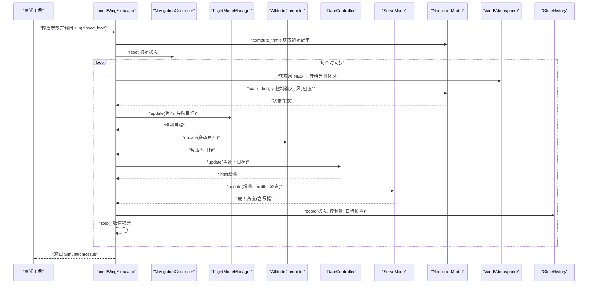
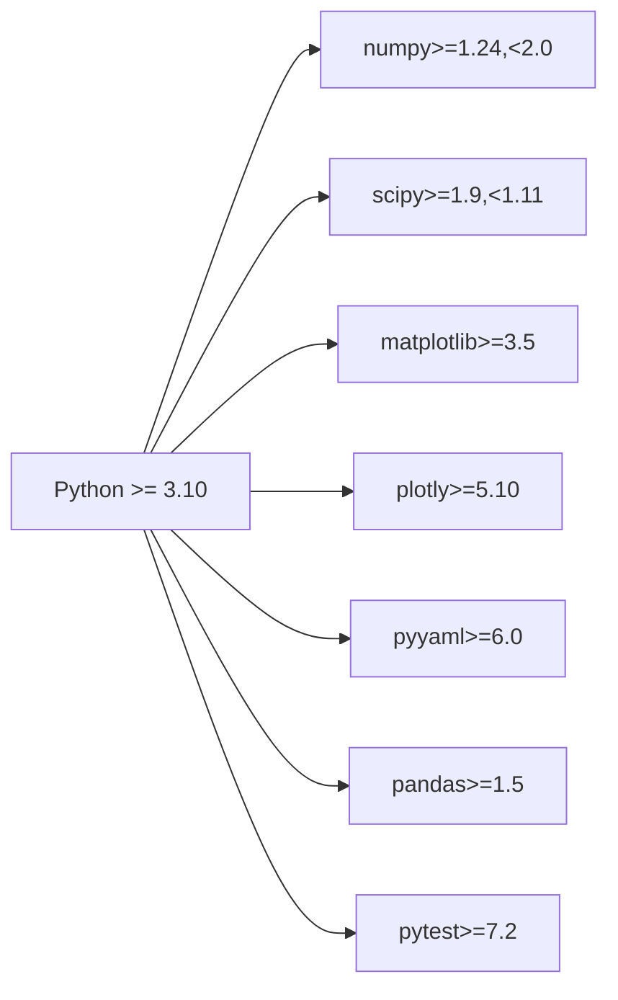

# 集成测试

<cite>
**本文引用的文件**
- [tests/test_integration.py](file://tests/test_integration.py)
- [tests/test_control.py](file://tests/test_control.py)
- [tests/test_dynamics.py](file://tests/test_dynamics.py)
- [tests/test_planning.py](file://tests/test_planning.py)
- [src/simulation/simulator.py](file://src/simulation/simulator.py)
- [src/simulation/state_manager.py](file://src/simulation/state_manager.py)
- [src/models/aircraft_database.py](file://src/models/aircraft_database.py)
- [config/simulation.yaml](file://config/simulation.yaml)
- [config/control_params.yaml](file://config/control_params.yaml)
- [config/trajectory.yaml](file://config/trajectory.yaml)
- [requirements.txt](file://requirements.txt)
- [setup.py](file://setup.py)
</cite>

## 目录
1. [引言](#引言)
2. [项目结构](#项目结构)
3. [核心组件](#核心组件)
4. [架构总览](#架构总览)
5. [详细组件分析](#详细组件分析)
6. [依赖关系分析](#依赖关系分析)
7. [性能考量](#性能考量)
8. [故障排查指南](#故障排查指南)
9. [结论](#结论)
10. [附录](#附录)

## 引言
本文件面向固定翼无人机仿真平台的集成测试，系统化阐述端到端集成测试的实现方法与策略，覆盖从完整仿真流程、跨模块数据传递验证到系统边界条件测试。文档同时解释模拟对象（mock）与测试替身（stub）在集成测试中的使用方式，给出执行策略与结果验证方法，并总结测试环境搭建与依赖管理的最佳实践，以及应对测试中不确定性与随机性的建议。

## 项目结构
该仓库采用“按功能域分层”的组织方式：核心仿真引擎位于 src/simulation，控制链路位于 src/control，动力学与气动模型位于 src/dynamics，路径规划位于 src/planning，模型参数与数据库位于 src/models，配置文件位于 config，测试用例位于 tests，示例脚本位于 examples，输出目录用于保存图表与数据。

```mermaid
graph TB
subgraph "测试层"
TINT["tests/test_integration.py"]
TCTRL["tests/test_control.py"]
TDYN["tests/test_dynamics.py"]
TPLN["tests/test_planning.py"]
end
subgraph "仿真内核"
SIM["src/simulation/simulator.py"]
SM["src/simulation/state_manager.py"]
end
subgraph "控制链路"
CTRL_ATT["control/attitude_controller.py"]
CTRL_RATE["control/rate_controller.py"]
CTRL_SERVO["control/servo_mixer.py"]
CTRL_MODE["control/flight_mode_manager.py"]
CTRL_NAV["control/navigation_controller.py"]
CTRL_AP["control/ardupilot_compat.py"]
end
subgraph "动力学与气动"
DYN_LIN["dynamics/linear_model.py"]
DYN_NONLIN["dynamics/nonlinear_model.py"]
DYN_COORD["dynamics/coordinate_transform.py"]
DYN_AERO["dynamics/aerodynamics.py"]
end
subgraph "规划与模型"
PLAN_WP["planning/waypoint_manager.py"]
PLAN_BASE["planning/trajectory_base.py"]
PLAN_MINJ["planning/minimum_jerk.py"]
PLAN_MINS["planning/minimum_snap.py"]
MODEL_DB["models/aircraft_database.py"]
end
ENV_WIND["environment/wind_model.py"]
ENV_ATM["environment/atmosphere_model.py"]
TINT --> SIM
TCTRL --> CTRL_ATT
TCTRL --> CTRL_RATE
TCTRL --> CTRL_SERVO
TDYN --> DYN_LIN
TDYN --> DYN_NONLIN
TDYN --> DYN_COORD
TDYN --> DYN_AERO
TPLN --> PLAN_WP
TPLN --> PLAN_BASE
TPLN --> PLAN_MINJ
TPLN --> PLAN_MINS
SIM --> SM
SIM --> CTRL_MODE
SIM --> CTRL_NAV
SIM --> CTRL_ATT
SIM --> CTRL_RATE
SIM --> CTRL_SERVO
SIM --> PLAN_WP
SIM --> DYN_NONLIN
SIM --> ENV_WIND
SIM --> ENV_ATM
SIM --> MODEL_DB
```

图示来源
- [tests/test_integration.py](file://tests/test_integration.py#L1-L391)
- [tests/test_control.py](file://tests/test_control.py#L1-L371)
- [tests/test_dynamics.py](file://tests/test_dynamics.py#L1-L336)
- [tests/test_planning.py](file://tests/test_planning.py#L1-L328)
- [src/simulation/simulator.py](file://src/simulation/simulator.py#L1-L642)
- [src/simulation/state_manager.py](file://src/simulation/state_manager.py#L1-L193)
- [src/models/aircraft_database.py](file://src/models/aircraft_database.py#L1-L183)

章节来源
- [tests/test_integration.py](file://tests/test_integration.py#L1-L391)
- [tests/test_control.py](file://tests/test_control.py#L1-L371)
- [tests/test_dynamics.py](file://tests/test_dynamics.py#L1-L336)
- [tests/test_planning.py](file://tests/test_planning.py#L1-L328)
- [src/simulation/simulator.py](file://src/simulation/simulator.py#L1-L642)
- [src/simulation/state_manager.py](file://src/simulation/state_manager.py#L1-L193)
- [src/models/aircraft_database.py](file://src/models/aircraft_database.py#L1-L183)

## 核心组件
- 固定翼仿真器：负责编排模型、环境、控制、规划与求解器，提供 run() 与 run_linear_analysis() 等接口，并支持 step-by-step 的 init_step()/step() 流程。
- 状态容器与历史记录：AircraftSimState 提供 12 维状态与派生量；StateHistory 提供高效的历史缓冲与导出。
- 飞行模式与导航控制器：FlightModeManager、NavigationController 负责模式切换与轨迹跟踪目标生成。
- 控制链路：AttitudeController、RateController、ServoMixer 构成五层闭环控制。
- 动力学与气动：NonlinearModel、LinearModel、coordinate_transform、aerodynamics 提供 6-DOF 非线性动力学与线性模态分析。
- 规划模块：WaypointManager、MinimumSnapTrajectory、MinimumJerkTrajectory 提供多段轨迹生成与连续性保证。
- 风场与大气：Wind、Atmosphere 提供风速风向与空气密度等环境输入。
- 飞机参数数据库：aircraft_database 提供 7 型飞机的完整气动与惯性参数。

章节来源
- [src/simulation/simulator.py](file://src/simulation/simulator.py#L115-L642)
- [src/simulation/state_manager.py](file://src/simulation/state_manager.py#L16-L193)
- [src/models/aircraft_database.py](file://src/models/aircraft_database.py#L29-L183)

## 架构总览
下图展示集成测试关注的关键交互路径：测试通过 FixedWingSimulator.run() 或 run_linear_analysis() 执行完整仿真循环，控制链路根据导航目标计算舵面指令，动力学模块计算状态导数，环境模块提供风与密度，规划模块提供期望轨迹或航路点，最终由 StateHistory 记录并导出。

图示来源
- [src/simulation/simulator.py](file://src/simulation/simulator.py#L239-L567)
- [src/simulation/state_manager.py](file://src/simulation/state_manager.py#L95-L193)

## 详细组件分析

### 集成测试场景设计与验证要点
- 开环稳态验证：TB2 在无控制输入下的 5 秒仿真，断言状态不发散（高度、空速、攻角等有界且数值稳定）。
- 闭环稳定验证：STABILIZE/AUTO 模式下，断言状态稳定、时间序列单调递增、数组长度与采样一致。
- 轨迹跟踪验证：AUTO 模式下添加 2 节点轨迹，断言飞机沿北向前进（位移增量）与轨迹稳定性。
- 线性分析兼容性：run_linear_analysis 返回 LinearAnalysisResult，断言模式数量与摘要字符串有效性。
- 步进 API 一致性：init_step()/step() 与 run() 的最终状态近似一致，断言有限性与一致性。
- 状态历史与派生量：AircraftSimState 与 StateHistory 的 round-trip 一致性、派生量正确性、字典键完整性。

章节来源
- [tests/test_integration.py](file://tests/test_integration.py#L66-L391)

### 控制链路集成验证
- PID 控制器：比例/积分/微分、抗积分饱和、复位、增益更新、前馈叠加、首步导数行为等。
- ArduPilot 参数：默认值、属性映射、部分字典加载、校验、序列化回放。
- 姿态/速率控制器：零误差输出、物理限幅、符号约定、积分清零。
- 伺服混合器：输出类型、限幅、归一化、升限转换、协调转弯补偿、输出范围。

章节来源
- [tests/test_control.py](file://tests/test_control.py#L57-L371)

### 动力学与气动集成验证
- 坐标变换：DCM 正交性、绕转、欧拉角率、角度归一化。
- 气动：力矩符号、零风一致性、对称性、风影响、动态压强。
- 线性模型：矩阵形状、有限性、模态分析稳定性、脉冲激励响应。
- 非线性模型：配平收敛、状态导数维度、稳态附近导数小、短时仿真正高度。

章节来源
- [tests/test_dynamics.py](file://tests/test_dynamics.py#L63-L336)

### 规划与航路点集成验证
- 多项式系数：边界条件、连续性、系数有限性、长时间段稳定性。
- 最小拍/最小跃度轨迹：起终点满足、速度连续、状态有限、偏航模式。
- WaypointManager：航路点增删、NED 存储、轨迹构建、YAML 往返、活动段判定。

章节来源
- [tests/test_planning.py](file://tests/test_planning.py#L47-L328)

### 模拟对象与测试替身
- 模拟对象（Mock）：在集成测试中可使用第三方库（如 unittest.mock 或 pytest-mock）对 Wind、Atmosphere、可视化组件进行替换，以隔离外部依赖并稳定测试结果。
- 测试替身（Stub）：对复杂子系统（如 TECS、ServoMixer 的内部状态）提供简单可控的替身，确保测试聚焦于被测模块的交互行为。
- 注意事项：替身应保持与真实接口一致的签名与返回类型，避免引入额外的耦合；对随机性输入（如风场）应显式固定随机种子或提供确定性替代。

（本节为通用实践说明，不直接分析具体文件）

### 执行策略与结果验证
- 执行策略
  - 使用 pytest 并行运行多个测试类，缩短整体耗时。
  - 对长时仿真（如 AUTO 模式 10 秒）设置合理断言阈值，避免对瞬时噪声敏感。
  - 对轨迹跟踪场景，先断言基本运动趋势（如北向位移），再断言轨迹连续性。
- 结果验证
  - 数值稳定性：断言状态变量有界、非 NaN/Inf。
  - 时间序列质量：时间向量严格递增、长度与采样一致。
  - 接口一致性：step() 与 run() 的最终状态近似一致，AircraftSimState 与 StateHistory 的 round-trip 一致。
  - 摘要与日志：SimulationResult.summary() 输出非空字符串，轨迹摘要包含机型与模式信息。

章节来源
- [tests/test_integration.py](file://tests/test_integration.py#L41-L391)

### 系统边界条件测试
- 风场边界：NONE/FIXED/SINE/RANDOMSINE 下的稳定性与轨迹一致性。
- 飞机数据库：遍历所有 7 型飞机执行线性分析，断言模式数量与配平收敛。
- 参数边界：Airspeed、Throttle、Roll/Pitch 角度限幅，TECS 参数范围检查。
- 初始条件：不同初始位置、航向、模式下的收敛与过渡行为。

章节来源
- [tests/test_integration.py](file://tests/test_integration.py#L97-L261)
- [src/models/aircraft_database.py](file://src/models/aircraft_database.py#L135-L183)

### 数据流与处理逻辑
- 数据流
  - 输入：配置目录、飞机名称、仿真步长、持续时间、初始模式、风类型、轨迹类型。
  - 处理：参数加载、环境初始化、控制参数解析、控制链路初始化、轨迹管理、数值积分。
  - 输出：SimulationResult（包含 StateHistory、配平结果、摘要）。
- 处理逻辑
  - run() 主循环：每步读取当前状态，计算风与密度，求解动力学导数，经控制链路得到舵面角度，记录历史并推进积分。
  - run_linear_analysis()：基于线性模型进行开环脉冲响应分析，兼容旧版接口。
  - step-by-step API：init_step() 初始化，后续多次 step() 推进，适合 UI/实时集成。

章节来源
- [src/simulation/simulator.py](file://src/simulation/simulator.py#L239-L642)
- [src/simulation/state_manager.py](file://src/simulation/state_manager.py#L95-L193)

## 依赖关系分析
- Python 版本与包：Python >= 3.10，核心依赖 numpy、scipy、matplotlib、plotly、pyyaml、pandas；开发依赖 pytest。
- 包安装与发布：setup.py 定义主包目录与安装依赖，requirements.txt 限定版本范围。
- 配置驱动：simulation.yaml、control_params.yaml、trajectory.yaml 分别驱动仿真步长、控制参数与轨迹配置。

图示来源
- [requirements.txt](file://requirements.txt#L1-L8)
- [setup.py](file://setup.py#L11-L21)

章节来源
- [requirements.txt](file://requirements.txt#L1-L8)
- [setup.py](file://setup.py#L1-L23)

## 性能考量
- 仿真步长与积分器：较小 dt 提高精度但增加计算量；dopri5 适用于实时循环，rk45 适用于批处理分析。
- 内存与历史记录：StateHistory 预分配数组，trim() 截断尾部未使用空间，避免内存浪费。
- 控制链路开销：PID/TECS 等控制器在每个时间步执行，应避免不必要的重复计算与频繁对象创建。
- 轨迹构建：WaypointManager 缓存轨迹，首次构建后复用；单航路点时合成虚拟段以避免无效下降。

（本节为通用指导，不直接分析具体文件）

## 故障排查指南
- 数值发散
  - 现象：高度/空速/攻角越界、出现 NaN/Inf。
  - 排查：检查 dt 是否过大、风场是否异常、控制输出是否饱和、积分器容差设置。
- 时间序列异常
  - 现象：时间向量非严格递增、数组长度与预期不符。
  - 排查：确认采样步长与持续时间、历史记录 trim() 是否提前截断。
- 轨迹跟踪偏差
  - 现象：未按预期方向移动或轨迹不连续。
  - 排查：检查 WaypointManager 的航路点顺序与高度一致性、航段切换距离、偏航模式设置。
- 控制器饱和与积分风车
  - 现象：输出饱和导致积分累积，系统振荡。
  - 排查：启用抗积分饱和机制、调整 PID 增益、检查限幅参数。
- 线性分析失败
  - 现象：模式数量异常、系数非有限。
  - 排查：确认配平收敛、气动参数有效、脉冲输入参数合理。

章节来源
- [tests/test_integration.py](file://tests/test_integration.py#L41-L391)
- [tests/test_dynamics.py](file://tests/test_dynamics.py#L200-L336)
- [tests/test_control.py](file://tests/test_control.py#L100-L126)

## 结论
本集成测试体系围绕 FixedWingSimulator 的端到端流程，覆盖开环/闭环稳定性、轨迹跟踪、线性分析兼容性、步进 API 一致性与状态历史完整性。通过严格的边界条件与跨模块数据传递验证，结合 mock/stub 的使用与稳健的执行策略，能够有效保障仿真系统的协同工作能力与数值稳定性。建议在持续集成中并行运行各测试类，并对长时仿真设置合理的断言阈值，以兼顾覆盖率与鲁棒性。

## 附录
- 配置文件要点
  - simulation.yaml：dt、duration、积分器、初始条件、初始模式、风场与日志开关。
  - control_params.yaml：飞行模式参数、PID 增益、限幅、TECS 参数。
  - trajectory.yaml：轨迹类型、平均速度、偏航模式、航路点列表与循环标志。
- 示例参考
  - 示例脚本展示了线性分析与闭环对比的输出保存流程，可作为集成测试结果导出的参考。

章节来源
- [config/simulation.yaml](file://config/simulation.yaml#L1-L30)
- [config/control_params.yaml](file://config/control_params.yaml#L1-L45)
- [config/trajectory.yaml](file://config/trajectory.yaml#L1-L23)