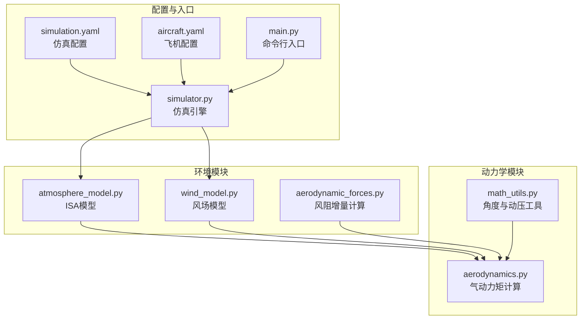
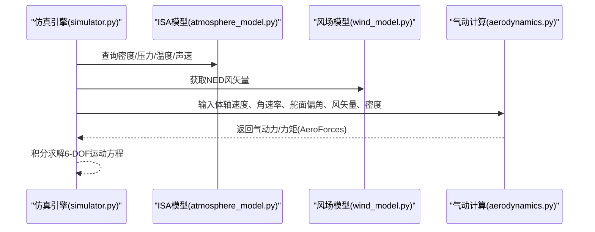
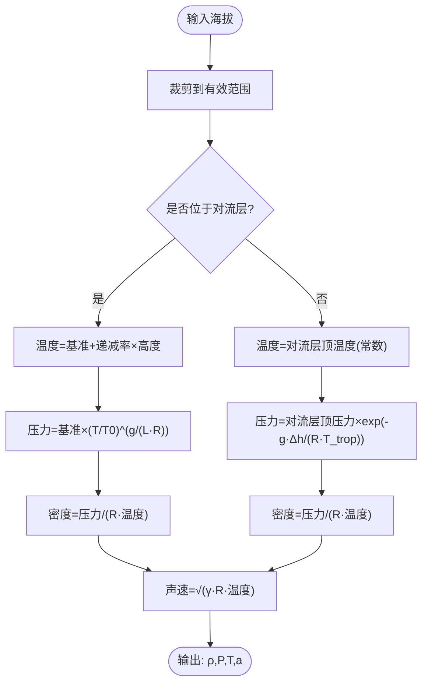
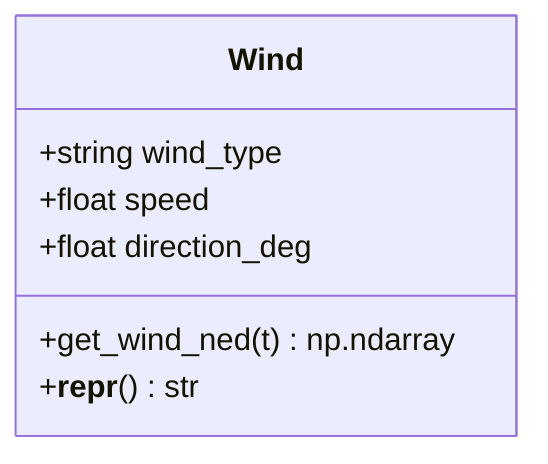
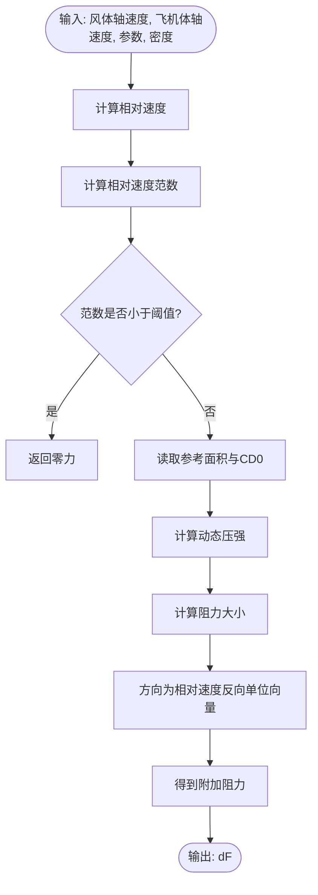
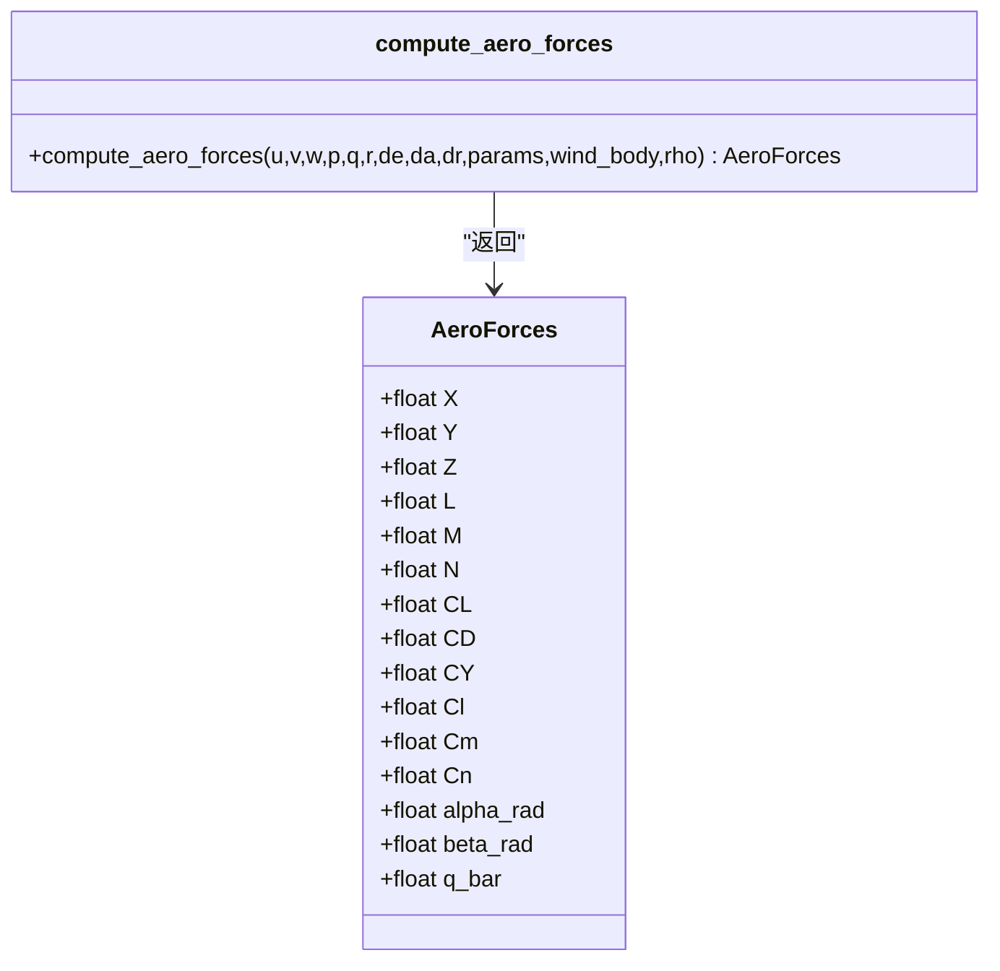
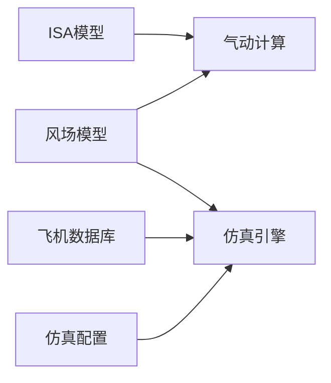

# 大气模型

<cite>
**本文引用的文件**
- [atmosphere_model.py](file://src/environment/atmosphere_model.py)
- [aerodynamic_forces.py](file://src/environment/aerodynamic_forces.py)
- [aerodynamics.py](file://src/dynamics/aerodynamics.py)
- [wind_model.py](file://src/environment/wind_model.py)
- [math_utils.py](file://src/utils/math_utils.py)
- [aircraft_database.py](file://src/models/aircraft_database.py)
- [simulation.yaml](file://config/simulation.yaml)
- [aircraft.yaml](file://config/aircraft.yaml)
- [simulator.py](file://src/simulation/simulator.py)
- [main.py](file://main.py)
- [example_4_wind_resistance.py](file://examples/example_4_wind_resistance.py)
- [test_dynamics.py](file://tests/test_dynamics.py)
</cite>

## 目录
1. [引言](#引言)
2. [项目结构](#项目结构)
3. [核心组件](#核心组件)
4. [架构总览](#架构总览)
5. [详细组件分析](#详细组件分析)
6. [依赖关系分析](#依赖关系分析)
7. [性能考量](#性能考量)
8. [故障排查指南](#故障排查指南)
9. [结论](#结论)
10. [附录](#附录)

## 引言
本文件系统性阐述本项目的国际标准大气（ISA）模型及其在固定翼飞行器仿真中的应用。内容涵盖：
- 标准大气模型的物理基础：温度、压力、密度随高度变化的分段函数与适用范围
- 国际标准大气（ISA）模型的参数与公式
- 大气密度对飞行器性能的影响：升力与阻力的计算原理
- 不同海拔高度下的大气参数查询方法
- 温度修正与湿度影响的考虑
- 模型在不同飞行条件下的适用性与限制

## 项目结构
本项目围绕“环境建模”“动力学计算”“控制与导航”等模块组织，其中大气模型位于环境子系统，为动力学与控制层提供密度、压力、温度、声速等关键参数。

图表来源
- [atmosphere_model.py](file://src/environment/atmosphere_model.py#L1-L77)
- [wind_model.py](file://src/environment/wind_model.py#L1-L113)
- [aerodynamic_forces.py](file://src/environment/aerodynamic_forces.py#L1-L54)
- [aerodynamics.py](file://src/dynamics/aerodynamics.py#L1-L148)
- [math_utils.py](file://src/utils/math_utils.py#L1-L124)
- [simulation.yaml](file://config/simulation.yaml#L1-L30)
- [aircraft.yaml](file://config/aircraft.yaml#L1-L13)
- [simulator.py](file://src/simulation/simulator.py#L1-L200)
- [main.py](file://main.py#L1-L145)

章节来源
- [atmosphere_model.py](file://src/environment/atmosphere_model.py#L1-L77)
- [wind_model.py](file://src/environment/wind_model.py#L1-L113)
- [aerodynamic_forces.py](file://src/environment/aerodynamic_forces.py#L1-L54)
- [aerodynamics.py](file://src/dynamics/aerodynamics.py#L1-L148)
- [math_utils.py](file://src/utils/math_utils.py#L1-L124)
- [simulation.yaml](file://config/simulation.yaml#L1-L30)
- [aircraft.yaml](file://config/aircraft.yaml#L1-L13)
- [simulator.py](file://src/simulation/simulator.py#L1-L200)
- [main.py](file://main.py#L1-L145)

## 核心组件
- 国际标准大气（ISA）模型：提供温度、压力、密度、声速的分段计算函数，覆盖对流层至下层平流层。
- 风场模型：支持无风、定常风、正弦叠加风、随机正弦风等类型，用于生成NED坐标系下的风矢量。
- 风阻增量计算：基于相对速度与参考面积估算附加阻力，用于扰动/敏感性分析。
- 动力学气动计算：在体轴系中根据攻角、侧滑角、非维角速率等计算升力、阻力与力矩系数，并转换为力与力矩。

章节来源
- [atmosphere_model.py](file://src/environment/atmosphere_model.py#L24-L76)
- [wind_model.py](file://src/environment/wind_model.py#L18-L113)
- [aerodynamic_forces.py](file://src/environment/aerodynamic_forces.py#L13-L53)
- [aerodynamics.py](file://src/dynamics/aerodynamics.py#L35-L147)

## 架构总览
ISA模型与风场模型作为环境输入，被动力学模块用于计算气动载荷；仿真引擎协调各模块完成闭环或开环仿真。

图表来源
- [simulator.py](file://src/simulation/simulator.py#L38-L52)
- [atmosphere_model.py](file://src/environment/atmosphere_model.py#L61-L76)
- [wind_model.py](file://src/environment/wind_model.py#L76-L108)
- [aerodynamics.py](file://src/dynamics/aerodynamics.py#L35-L147)

## 详细组件分析

### 国际标准大气（ISA）模型
- 物理基础与适用范围
  - 对流层（0–11 km）：温度按线性递减率下降，压力按绝热过程分布
  - 下层平流层（11–20 km）：温度保持常值（等温），压力按指数衰减
- 关键参数
  - 海平面标准温度、压力、密度、气体常数、比热比、对流层温度递减率、对流层顶高度
- 计算函数
  - 温度：分段函数，对流层线性递减，平流层等温
  - 压力：对流层使用温度代入绝热关系式，平流层使用指数衰减
  - 密度：理想气体状态方程由压力与温度导出
  - 声速：仅依赖温度与比热比
- 使用方式
  - 单项查询：温度、压力、密度、声速
  - 组合查询：一次性返回密度、压力、温度、声速

图表来源
- [atmosphere_model.py](file://src/environment/atmosphere_model.py#L24-L76)

章节来源
- [atmosphere_model.py](file://src/environment/atmosphere_model.py#L1-L77)

### 风场模型
- 支持类型
  - NONE：零风
  - FIXED：恒定风矢量（NED）
  - SINE：多个频率正弦叠加
  - RANDOMSINE：均值+随机振幅正弦叠加（类湍流）
- 输出
  - 在任意时刻返回NED坐标系下的风速度矢量
- 与仿真配置的关系
  - 可通过仿真配置文件设置风类型、风速、风向

图表来源
- [wind_model.py](file://src/environment/wind_model.py#L18-L113)

章节来源
- [wind_model.py](file://src/environment/wind_model.py#L1-L113)
- [simulation.yaml](file://config/simulation.yaml#L22-L25)

### 风阻增量计算（附加阻力）
- 目的
  - 估算由于相对风速引起的附加气动阻力，用于扰动/敏感性分析
- 方法
  - 基于相对速度、参考面积与无量纲阻力系数，采用简化二次型估算
  - 当相对速度过小则返回零
- 输入
  - 体轴风速度、体轴飞行器速度、飞机参数字典、空气密度

图表来源
- [aerodynamic_forces.py](file://src/environment/aerodynamic_forces.py#L13-L53)

章节来源
- [aerodynamic_forces.py](file://src/environment/aerodynamic_forces.py#L1-L54)

### 动力学气动计算（体轴系）
- 输入
  - 体轴速度、角速率、舵面偏角、风体轴速度、空气密度
- 过程
  - 从体轴速度与风体轴速度合成真实相对气流
  - 计算攻角、侧滑角、非维角速率
  - 基于线性/线性化气动导数模型计算升力、阻力、侧向力与力矩系数
  - 将系数转换为力与力矩（体轴系）
- 输出
  - AeroForces容器，包含力、力矩与无量纲系数

图表来源
- [aerodynamics.py](file://src/dynamics/aerodynamics.py#L19-L147)
- [math_utils.py](file://src/utils/math_utils.py#L107-L123)

章节来源
- [aerodynamics.py](file://src/dynamics/aerodynamics.py#L1-L148)
- [math_utils.py](file://src/utils/math_utils.py#L1-L124)

## 依赖关系分析
- 环境模块依赖
  - ISA模型被动力学模块调用以获取密度、压力、温度、声速
  - 风场模型被仿真引擎与气动模块共同使用
- 飞机参数注入
  - 飞机数据库为仿真注入基准空速、密度与动压等派生参数
- 仿真配置
  - 风类型、风速、风向在仿真配置中统一管理

图表来源
- [simulator.py](file://src/simulation/simulator.py#L38-L52)
- [aircraft_database.py](file://src/models/aircraft_database.py#L143-L166)
- [simulation.yaml](file://config/simulation.yaml#L22-L25)

章节来源
- [simulator.py](file://src/simulation/simulator.py#L1-L200)
- [aircraft_database.py](file://src/models/aircraft_database.py#L1-L183)
- [simulation.yaml](file://config/simulation.yaml#L1-L30)

## 性能考量
- 计算复杂度
  - ISA模型为纯标量/向量运算，时间复杂度低，适合实时仿真
  - 风场模型在随机正弦风时涉及多频率正弦叠加，但可预生成参数，运行时开销可控
- 数值稳定性
  - ISA模型对高度进行裁剪，避免极端输入导致的数值异常
  - 动力学模块对相对速度与角度进行数值保护，防止奇异点
- 内存与缓存
  - 风场模型预计算NED单位向量与正弦参数，减少重复计算
- 实时性
  - 仿真步长与积分器配置在仿真配置中集中管理，便于平衡精度与性能

[本节为通用性能讨论，不直接分析具体文件]

## 故障排查指南
- 大气参数查询异常
  - 确认输入海拔在有效范围内；ISA模型对高度进行了裁剪
  - 若压力/密度为零或NaN，检查温度是否为负或接近绝对零
- 风场设置问题
  - 风类型必须为支持枚举值之一；方向与速度需符合气象约定
  - 随机正弦风应确保频率与相位初始化正常
- 气动计算异常
  - 相对速度过小会导致附加风阻为零；确认体轴速度与风体轴速度差值合理
  - 攻角与侧滑角计算依赖数值保护，若出现奇异行为，检查输入速度分量
- 仿真配置错误
  - 风类型、风速、风向应在仿真配置中正确设置；命令行参数会覆盖默认值

章节来源
- [atmosphere_model.py](file://src/environment/atmosphere_model.py#L30-L34)
- [wind_model.py](file://src/environment/wind_model.py#L39-L41)
- [aerodynamic_forces.py](file://src/environment/aerodynamic_forces.py#L42-L43)
- [math_utils.py](file://src/utils/math_utils.py#L117-L118)
- [simulation.yaml](file://config/simulation.yaml#L22-L25)
- [main.py](file://main.py#L63-L67)

## 结论
本项目的大气模型以国际标准大气（ISA）为核心，结合风场模型与气动计算模块，形成完整的固定翼飞行器仿真环境。ISA模型覆盖对流层至下层平流层，提供温度、压力、密度与声速的高精度分段计算；风场模型支持多种典型风况；气动计算模块在体轴系中实现升力、阻力与力矩的精确建模。该组合既满足工程精度需求，又具备良好的实时性与可扩展性。

[本节为总结性内容，不直接分析具体文件]

## 附录

### 不同海拔高度下的大气参数查询方法
- 单项查询
  - 温度：atmosphere_model.compute_temperature(海拔)
  - 压力：atmosphere_model.compute_pressure(海拔)
  - 密度：atmosphere_model.compute_density(海拔)
  - 声速：atmosphere_model.compute_speed_of_sound(海拔)
- 组合查询
  - 同时获取密度、压力、温度、声速：atmosphere_model.atmosphere(海拔)

章节来源
- [atmosphere_model.py](file://src/environment/atmosphere_model.py#L24-L76)

### 温度修正与湿度影响
- 温度修正
  - ISA模型内置温度递减率与对流层顶温度，适用于标准气候条件
  - 如需非标准温度，可在调用前对温度进行修正后传入相关函数
- 湿度影响
  - 本实现基于干空气假设，未考虑水汽对气体常数与密度的修正
  - 在高湿环境下，可将密度按经验关系进行修正后再用于气动计算

[本节为概念性说明，不直接分析具体文件]

### 国际标准大气（ISA）模型参数与公式
- 基准参数
  - 海平面温度、压力、密度、气体常数、比热比、对流层温度递减率、对流层顶高度
- 温度与压力
  - 对流层：T(h)=T0+L·h；P(h)=P0·(T/T0)^(g/(L·R))
  - 平流层：T=常数；P(h)=P_trop·exp(-g·Δh/(R·T_trop))
- 密度与声速
  - ρ=P/(R·T)；a=√(γ·R·T)

章节来源
- [atmosphere_model.py](file://src/environment/atmosphere_model.py#L10-L21)
- [atmosphere_model.py](file://src/environment/atmosphere_model.py#L37-L58)

### 大气密度对飞行器性能的影响
- 升力与阻力
  - 升力与阻力均与动压q_bar=0.5·ρ·V^2成正比
  - 密度降低导致升力与阻力减小，需提高空速或增大攻角维持相同载荷
- 飞行包线
  - 密度随高度降低，失速速度增加，最大升阻比随高度变化
- 控制与稳定性
  - 密度变化影响气动效率与操纵力矩，需调整控制增益

章节来源
- [aerodynamics.py](file://src/dynamics/aerodynamics.py#L76-L77)
- [math_utils.py](file://src/utils/math_utils.py#L121-L123)

### 示例与验证
- 风阻增量示例
  - 通过示例脚本展示风扰动下的飞行响应
- 动态压力测试
  - 单元测试验证动态压力计算在海平面30 m/s时的预期值

章节来源
- [example_4_wind_resistance.py](file://examples/example_4_wind_resistance.py#L1-L52)
- [test_dynamics.py](file://tests/test_dynamics.py#L180-L194)