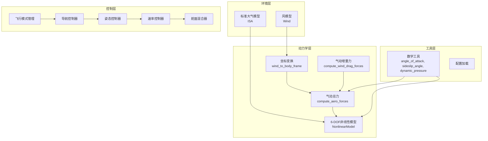
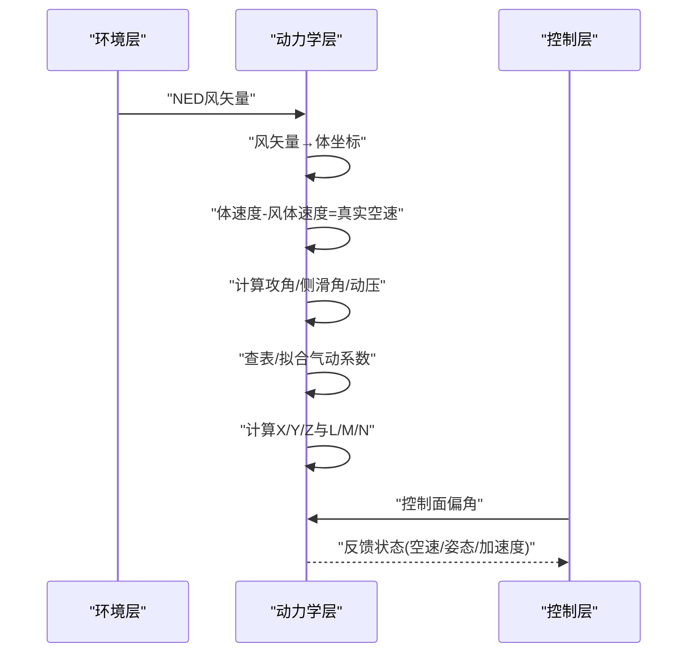
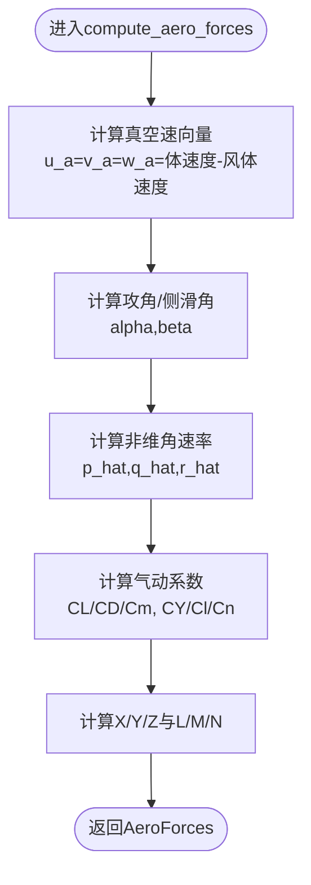
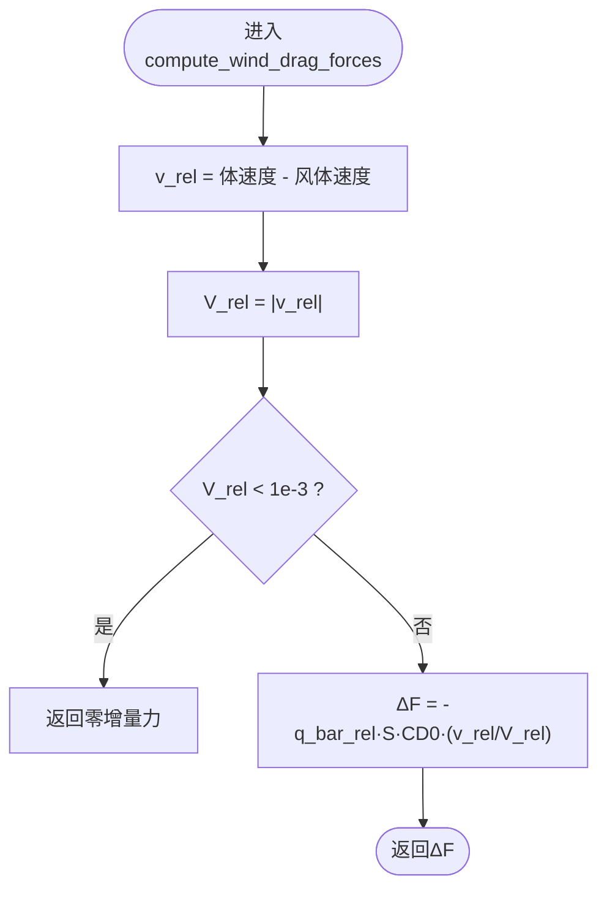
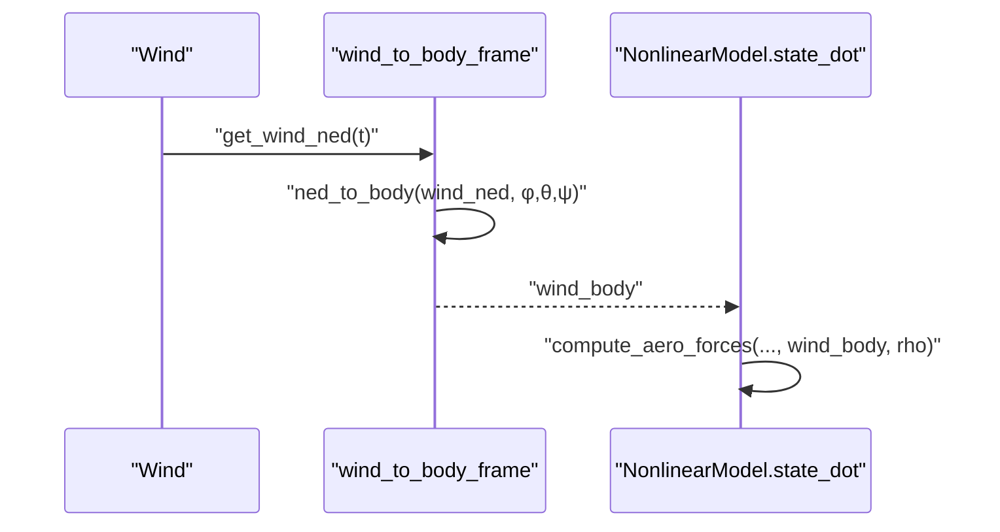
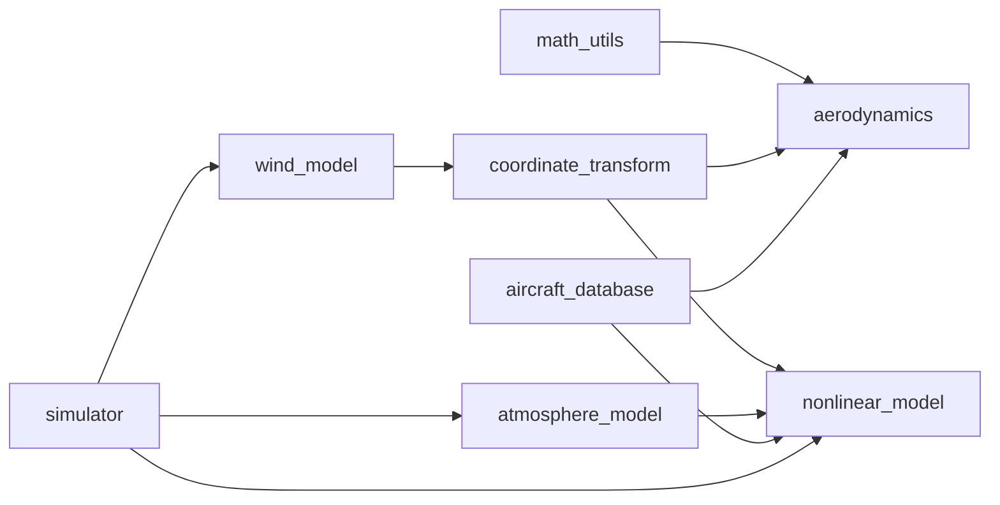

# 气动力计算

<cite>
**本文引用的文件**
- [aerodynamic_forces.py](file://src/environment/aerodynamic_forces.py)
- [aerodynamics.py](file://src/dynamics/aerodynamics.py)
- [wind_model.py](file://src/environment/wind_model.py)
- [aircraft_database.py](file://src/models/aircraft_database.py)
- [math_utils.py](file://src/utils/math_utils.py)
- [nonlinear_model.py](file://src/dynamics/nonlinear_model.py)
- [coordinate_transform.py](file://src/dynamics/coordinate_transform.py)
- [atmosphere_model.py](file://src/environment/atmosphere_model.py)
- [simulator.py](file://src/simulation/simulator.py)
- [example_4_wind_resistance.py](file://examples/example_4_wind_resistance.py)
- [aircraft.yaml](file://config/aircraft.yaml)
- [config_loader.py](file://src/utils/config_loader.py)
</cite>

## 目录
1. [简介](#简介)
2. [项目结构](#项目结构)
3. [核心组件](#核心组件)
4. [架构总览](#架构总览)
5. [详细组件分析](#详细组件分析)
6. [依赖关系分析](#依赖关系分析)
7. [性能考虑](#性能考虑)
8. [故障排查指南](#故障排查指南)
9. [结论](#结论)
10. [附录](#附录)

## 简介
本技术文档围绕固定翼飞行器的气动力计算展开，系统阐述环境力（风）对飞行器运动的影响机制，涵盖风阻力、升力、侧力等的计算流程；详细说明相对速度、攻角、侧滑角的计算过程；解释风场与飞行器运动的耦合效应（有效风速与气流角度）；给出气动力系数的计算公式与参数来源；提供不同飞行状态下的力计算示例；讨论数值精度与稳定性考虑，并给出验证与校准方法。

## 项目结构
该仿真器采用模块化设计，将气动计算、风场建模、非线性动力学、控制与轨迹规划解耦：
- 动力学层：气动计算、6-DOF非线性方程、姿态变换
- 环境层：风模型、标准大气模型
- 控制层：飞行模式管理、导航控制器、姿态/速率控制器、舵面混合器
- 工具层：数学工具、配置加载、可视化与动画

图表来源
- [wind_model.py](file://src/environment/wind_model.py#L18-L113)
- [aerodynamics.py](file://src/dynamics/aerodynamics.py#L35-L148)
- [aerodynamic_forces.py](file://src/environment/aerodynamic_forces.py#L13-L54)
- [nonlinear_model.py](file://src/dynamics/nonlinear_model.py#L104-L386)
- [coordinate_transform.py](file://src/dynamics/coordinate_transform.py#L39-L70)
- [math_utils.py](file://src/utils/math_utils.py#L107-L124)
- [atmosphere_model.py](file://src/environment/atmosphere_model.py#L48-L77)
- [simulator.py](file://src/simulation/simulator.py#L115-L642)

章节来源
- [simulator.py](file://src/simulation/simulator.py#L115-L642)
- [nonlinear_model.py](file://src/dynamics/nonlinear_model.py#L104-L386)
- [wind_model.py](file://src/environment/wind_model.py#L18-L113)
- [aerodynamics.py](file://src/dynamics/aerodynamics.py#L35-L148)

## 核心组件
- 气动总力计算：在体坐标系下计算X/Y/Z力与L/M/N力矩，基于攻角、侧滑角、非维角速率与控制面偏角，使用气动系数表征。
- 风阻增量计算：在已有基线气动基础上，估算风引起的附加体轴力增量，适用于扰动/灵敏度分析。
- 风场建模：支持无风、常值风、正弦叠加风、随机正弦风等类型，提供NED风矢量生成。
- 大气模型：基于国际标准大气（ISA），随高度计算密度、压力、温度与声速。
- 坐标变换：NED与体坐标系之间的方向余弦矩阵与风矢量转换。
- 数学工具：攻角、侧滑角、动压等基础函数。

章节来源
- [aerodynamics.py](file://src/dynamics/aerodynamics.py#L35-L148)
- [aerodynamic_forces.py](file://src/environment/aerodynamic_forces.py#L13-L54)
- [wind_model.py](file://src/environment/wind_model.py#L18-L113)
- [atmosphere_model.py](file://src/environment/atmosphere_model.py#L48-L77)
- [coordinate_transform.py](file://src/dynamics/coordinate_transform.py#L39-L70)
- [math_utils.py](file://src/utils/math_utils.py#L107-L124)

## 架构总览
气动力计算贯穿“环境—动力学—控制”链路：
- 环境层提供风矢量（NED→体坐标），并根据高度计算空气密度。
- 动力学层将风矢量与飞行器体速度合成，得到真实空速向量，进而计算攻角、侧滑角与动压。
- 使用气动系数模型计算升力、阻力、侧力及滚转、俯仰、偏航力矩。
- 控制层通过导航/姿态/速率控制器输出控制面偏角，参与气动力计算闭环。

图表来源
- [simulator.py](file://src/simulation/simulator.py#L329-L338)
- [nonlinear_model.py](file://src/dynamics/nonlinear_model.py#L160-L256)
- [aerodynamics.py](file://src/dynamics/aerodynamics.py#L35-L148)
- [coordinate_transform.py](file://src/dynamics/coordinate_transform.py#L39-L70)

## 详细组件分析

### 气动总力计算（compute_aero_forces）
- 输入：体速度(u,v,w)、角速率(p,q,r)、控制面偏角(de,da,dr)，气动参数字典，风体速度，空气密度。
- 关键步骤：
  - 真空速向量：若提供风体速度则从体速度减去风体速度；否则直接使用体速度。
  - 攻角与侧滑角：基于arctan2与arcsin函数定义。
  - 非维角速率：按机长/翼展归一化。
  - 升/阻/力矩系数：线性组合气动系数与攻角、侧滑角、角速率及控制面偏角。
  - 力与力矩：基于动压与参考面积计算，分别投影到体坐标轴与绕体坐标轴。
- 输出：AeroForces对象，包含X/Y/Z与L/M/N以及CL、CD、CY、Cl、Cm、Cn、攻角、侧滑角、动压。

图表来源
- [aerodynamics.py](file://src/dynamics/aerodynamics.py#L68-L147)
- [math_utils.py](file://src/utils/math_utils.py#L107-L124)

章节来源
- [aerodynamics.py](file://src/dynamics/aerodynamics.py#L35-L148)
- [math_utils.py](file://src/utils/math_utils.py#L107-L124)

### 风阻增量计算（compute_wind_drag_forces）
- 用途：在已有基线气动基础上，估算风引起的附加体轴力增量，适合扰动/灵敏度分析。
- 方法：相对风速v_rel = 体速度 - 风体速度；当|v_rel|很小则返回零；否则按ΔF = -0.5·ρ·S·CD0·|v_rel|·单位向量(v_rel)。

图表来源
- [aerodynamic_forces.py](file://src/environment/aerodynamic_forces.py#L13-L54)

章节来源
- [aerodynamic_forces.py](file://src/environment/aerodynamic_forces.py#L13-L54)

### 风场与坐标变换
- 风模型：支持NONE/FIXED/SINE/RANDOMSINE四种类型，提供NED风矢量；固定风为NED单位向量乘以速度；正弦/随机正弦风叠加多分量简谐项。
- 坐标变换：NED→体坐标使用3-2-1欧拉角方向余弦矩阵；风体速度 = R^T @ 风NED。

图表来源
- [wind_model.py](file://src/environment/wind_model.py#L76-L108)
- [coordinate_transform.py](file://src/dynamics/coordinate_transform.py#L39-L53)
- [nonlinear_model.py](file://src/dynamics/nonlinear_model.py#L160-L203)

章节来源
- [wind_model.py](file://src/environment/wind_model.py#L18-L113)
- [coordinate_transform.py](file://src/dynamics/coordinate_transform.py#L39-L70)
- [simulator.py](file://src/simulation/simulator.py#L329-L338)

### 大气模型与密度计算
- 基于国际标准大气（ISA），分对流层与下平流层，计算温度、压力、密度与声速；高度输入为正向上（NED向下为负）。
- 在仿真循环中，根据当前海拔计算ρ用于气动计算。

章节来源
- [atmosphere_model.py](file://src/environment/atmosphere_model.py#L48-L77)
- [simulator.py](file://src/simulation/simulator.py#L336-L337)

### 参数来源与数据库
- 飞机参数数据库包含多种机型的几何与气动系数，如机翼面积S、平均气动弦c、翼展b、质量m、惯性矩等，以及纵向与横向/方向的气动导数。
- 参数注入：在获取参数时自动计算U0（由Mach×声速）、rho（ISA海平面密度）、q_bar（动态压）等派生参数。

章节来源
- [aircraft_database.py](file://src/models/aircraft_database.py#L29-L167)
- [aircraft.yaml](file://config/aircraft.yaml#L1-L13)
- [config_loader.py](file://src/utils/config_loader.py#L68-L82)

### 不同飞行状态下的力计算示例
- 平飞/定高：攻角由配平条件决定，升力平衡重力；阻力由CD与空速决定；风场影响仅体现在相对速度与有效空速上。
- 突风/扰动：风阻增量ΔF体现风对附加阻力的影响；通过compute_wind_drag_forces评估扰动大小。
- 转弯/侧风：侧滑角β影响CY、Cl、Cn；风向改变导致有效风速与攻角变化，进而影响CL/CD与力矩。

章节来源
- [example_4_wind_resistance.py](file://examples/example_4_wind_resistance.py#L20-L36)
- [aerodynamic_forces.py](file://src/environment/aerodynamic_forces.py#L13-L54)
- [aerodynamics.py](file://src/dynamics/aerodynamics.py#L107-L126)

## 依赖关系分析

图表来源
- [math_utils.py](file://src/utils/math_utils.py#L107-L124)
- [aerodynamics.py](file://src/dynamics/aerodynamics.py#L13-L14)
- [coordinate_transform.py](file://src/dynamics/coordinate_transform.py#L11-L16)
- [nonlinear_model.py](file://src/dynamics/nonlinear_model.py#L27-L28)
- [wind_model.py](file://src/environment/wind_model.py#L14-L15)
- [atmosphere_model.py](file://src/environment/atmosphere_model.py#L8-L9)
- [aircraft_database.py](file://src/models/aircraft_database.py#L12-L20)
- [simulator.py](file://src/simulation/simulator.py#L33-L52)

章节来源
- [simulator.py](file://src/simulation/simulator.py#L33-L52)
- [nonlinear_model.py](file://src/dynamics/nonlinear_model.py#L27-L28)
- [aerodynamics.py](file://src/dynamics/aerodynamics.py#L13-L14)

## 性能考虑
- 计算复杂度：气动计算主要为标量运算与少量三角函数，整体为O(1)；非线性6-DOF积分采用DOPRI5，步长与容差可调。
- 数值稳定性：
  - 攻角与侧滑角使用arctan2与arcsin，避免除零与越界；侧滑角对小空速进行数值夹紧。
  - 非维角速率使用机长/翼展归一化，避免大数值带来的不稳定。
  - 风阻增量在相对速度很小时返回零，避免噪声放大。
- 空气密度随高度变化：在仿真主循环中实时计算ρ，确保高精度。
- 风模型随机性：RANDOMSINE风引入随机相位与振幅，需足够长仿真时间以统计平均。

章节来源
- [math_utils.py](file://src/utils/math_utils.py#L107-L124)
- [aerodynamic_forces.py](file://src/environment/aerodynamic_forces.py#L42-L43)
- [nonlinear_model.py](file://src/dynamics/nonlinear_model.py#L260-L281)
- [atmosphere_model.py](file://src/environment/atmosphere_model.py#L48-L77)

## 故障排查指南
- 空速为零或极小：检查风体速度与体速度是否抵消；确认风模型类型与风速设置。
- 攻角/侧滑角异常：检查arctan2/arcsin输入范围与数值夹紧逻辑。
- 力/力矩为零：确认气动系数是否正确加载，控制面偏角是否过大导致数值溢出。
- 高度变化导致密度突变：确认海拔输入符号（NED向下为负）与atmosphere_model接口。
- 风扰动不明显：检查风模型类型与风速方向；对于RANDOMSINE，适当增加仿真时长以观察统计特性。

章节来源
- [math_utils.py](file://src/utils/math_utils.py#L107-L124)
- [aerodynamic_forces.py](file://src/environment/aerodynamic_forces.py#L42-L43)
- [atmosphere_model.py](file://src/environment/atmosphere_model.py#L48-L77)
- [simulator.py](file://src/simulation/simulator.py#L336-L337)

## 结论
本系统通过清晰的模块划分实现了风场与气动计算的耦合：风模型提供NED风矢量，经坐标变换进入气动计算，结合非线性6-DOF动力学形成完整的闭环仿真。气动计算基于攻角、侧滑角与非维角速率的线性组合系数，具备良好的数值稳定性与可扩展性。通过风阻增量计算与不同风模型，可有效评估环境扰动对飞行器的影响，并为控制策略设计提供依据。

## 附录

### 气动力系数与参数来源
- 参考面积S、平均气动弦c、翼展b、质量m、惯性矩等几何与惯性参数来自飞机数据库。
- 气动系数（CL_0、CL_alpha、CL_q、CL_deltae、CD_0、CD_alpha、Cm_0、Cm_alpha、Cm_q、Cm_deltae、CYb、Clb、Clr、Cnb、Clda、Cldr、Cndr等）来自数据库条目，用于线性拟合升/阻/力矩系数。
- 动压q_bar = 0.5·ρ·V^2，其中ρ由ISA模型随高度计算。

章节来源
- [aircraft_database.py](file://src/models/aircraft_database.py#L29-L167)
- [aerodynamics.py](file://src/dynamics/aerodynamics.py#L63-L77)
- [atmosphere_model.py](file://src/environment/atmosphere_model.py#L48-L77)

### 相对速度、攻角、侧滑角计算
- 相对速度：体速度减去风体速度得到真实空速向量。
- 攻角alpha：arctan2(w_air,u_air)。
- 侧滑角beta：arcsin(v_air/V_air)，对小空速进行数值夹紧。

章节来源
- [aerodynamics.py](file://src/dynamics/aerodynamics.py#L68-L83)
- [math_utils.py](file://src/utils/math_utils.py#L107-L118)

### 风场与飞行器运动的耦合效应
- 有效风速：风体速度与体速度合成，决定真实空速与气流角度。
- 气流角度：攻角与侧滑角直接影响升/阻/侧力与力矩系数。
- 风阻增量：ΔF体现风对附加阻力的影响，适合扰动分析。

章节来源
- [aerodynamic_forces.py](file://src/environment/aerodynamic_forces.py#L39-L51)
- [aerodynamics.py](file://src/dynamics/aerodynamics.py#L68-L83)

### 数值精度与稳定性建议
- 对小空速与相对速度进行阈值处理，避免数值不稳定。
- 使用arctan2与arcsin替代常规三角函数，保证角度范围与连续性。
- 在风扰动场景中，适当提高仿真步长与容差，确保统计收敛。

章节来源
- [math_utils.py](file://src/utils/math_utils.py#L107-L118)
- [aerodynamic_forces.py](file://src/environment/aerodynamic_forces.py#L42-L43)

### 气动力验证与校准方法
- 对比风洞数据或CFD结果，校准气动系数（尤其是低速段的CD与CL）。
- 通过风阻增量ΔF与实测阻力对比，评估CD0与S的准确性。
- 使用不同风模型（FIXED/SINE/RANDOMSINE）进行一致性检验，评估控制系统对扰动的抑制能力。
- 与线性模型（短周期/长周期模态）对比，验证非线性响应的一致性。

章节来源
- [example_4_wind_resistance.py](file://examples/example_4_wind_resistance.py#L20-L36)
- [aerodynamic_forces.py](file://src/environment/aerodynamic_forces.py#L13-L54)
- [nonlinear_model.py](file://src/dynamics/nonlinear_model.py#L132-L154)