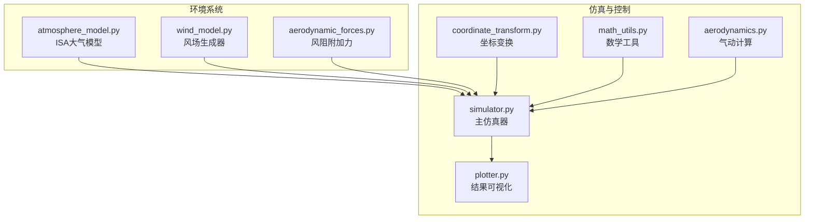
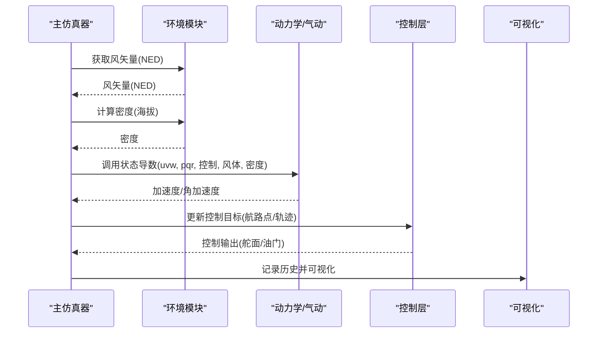
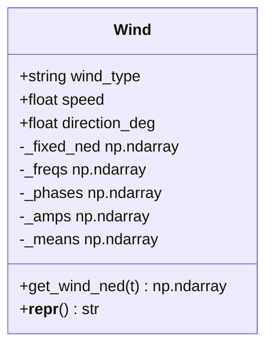
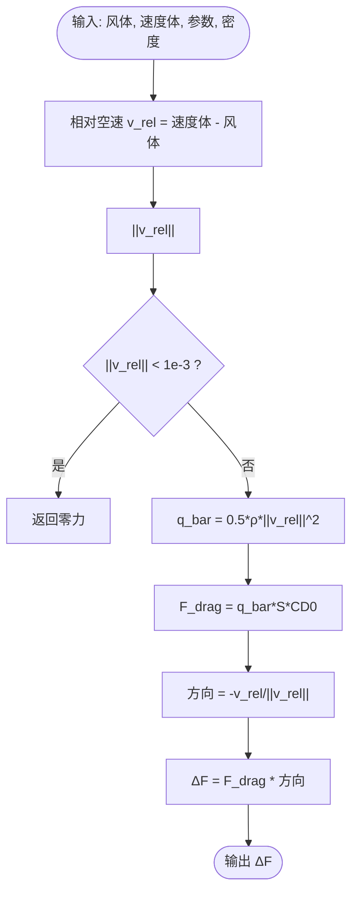
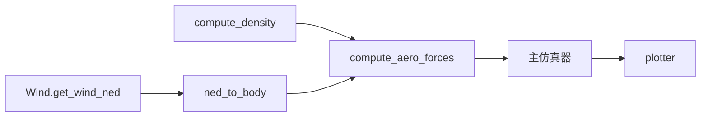

# 环境系统

<cite>
**本文引用的文件**
- [atmosphere_model.py](file://src/environment/atmosphere_model.py)
- [wind_model.py](file://src/environment/wind_model.py)
- [aerodynamic_forces.py](file://src/environment/aerodynamic_forces.py)
- [simulator.py](file://src/simulation/simulator.py)
- [aerodynamics.py](file://src/dynamics/aerodynamics.py)
- [coordinate_transform.py](file://src/dynamics/coordinate_transform.py)
- [math_utils.py](file://src/utils/math_utils.py)
- [simulation.yaml](file://config/simulation.yaml)
- [aircraft_database.py](file://src/models/aircraft_database.py)
- [example_4_wind_resistance.py](file://examples/example_4_wind_resistance.py)
- [plotter.py](file://src/visualization/plotter.py)
</cite>

## 目录
1. [引言](#引言)
2. [项目结构](#项目结构)
3. [核心组件](#核心组件)
4. [架构总览](#架构总览)
5. [详细组件分析](#详细组件分析)
6. [依赖关系分析](#依赖关系分析)
7. [性能考量](#性能考量)
8. [故障排查指南](#故障排查指南)
9. [结论](#结论)
10. [附录](#附录)

## 引言
本文件面向固定翼飞行器仿真平台的“环境系统”，系统性阐述风场模型（静态风、动态风与湍流类扰动）、大气模型（温度、压力、密度、声速随高度变化）以及环境力对飞行器运动的影响机制（风阻、升力变化等）。同时提供环境参数的测量与校准方法、不同环境条件下的仿真结果分析与对比思路、以及环境模型的扩展与定制路径。内容兼顾工程实践与可读性，适合具备有限背景知识的读者快速上手。

## 项目结构
环境系统位于 src/environment 目录，主要由三部分组成：
- 大气模型：计算温度、压力、密度、声速随海拔变化
- 风场模型：支持无风、常值风、正弦叠加风、随机正弦风（类湍流）
- 气动附加力：基于相对风速估算风引起的附加气动力增量

上述模块与仿真引擎、坐标变换、气动计算、可视化等模块协同工作，形成完整的环境-动力学耦合闭环。



图表来源
- [atmosphere_model.py](file://src/environment/atmosphere_model.py#L1-L77)
- [wind_model.py](file://src/environment/wind_model.py#L1-L113)
- [aerodynamic_forces.py](file://src/environment/aerodynamic_forces.py#L1-L54)
- [simulator.py](file://src/simulation/simulator.py#L1-L642)
- [aerodynamics.py](file://src/dynamics/aerodynamics.py#L1-L148)
- [coordinate_transform.py](file://src/dynamics/coordinate_transform.py#L1-L69)
- [math_utils.py](file://src/utils/math_utils.py#L1-L124)
- [plotter.py](file://src/visualization/plotter.py#L1-L244)

章节来源
- [simulator.py](file://src/simulation/simulator.py#L1-L642)
- [atmosphere_model.py](file://src/environment/atmosphere_model.py#L1-L77)
- [wind_model.py](file://src/environment/wind_model.py#L1-L113)
- [aerodynamic_forces.py](file://src/environment/aerodynamic_forces.py#L1-L54)

## 核心组件
- 大气模型（ISA）：提供温度、压力、密度、声速的解析表达式，并在对流层与下平流层分段处理；支持按海拔查询或一次性返回四要素。
- 风场模型：支持四种类型风场，均以NED（北-东-下）向量形式给出；通过旋转矩阵将姿态角转换为体坐标风速，再参与气动计算。
- 气动附加力：基于相对风速与机翼参考面积、零升阻力系数估算风引起的附加阻力增量，用于敏感性分析与扰动评估。

章节来源
- [atmosphere_model.py](file://src/environment/atmosphere_model.py#L24-L77)
- [wind_model.py](file://src/environment/wind_model.py#L18-L113)
- [aerodynamic_forces.py](file://src/environment/aerodynamic_forces.py#L13-L54)

## 架构总览
环境系统在仿真主循环中与动力学、控制、轨迹规划模块紧密耦合。主流程要点：
- 初始化阶段：从配置加载风场类型、速度与方向；从数据库加载飞机参数；构建风场对象。
- 每步积分前：根据当前时间获取NED风矢量，转换到体坐标；按当前海拔查询空气密度；调用非线性动力学状态导数函数。
- 动力学计算：气动计算模块使用体坐标风速与密度，结合控制面偏转与气动系数，得到气动力与力矩。
- 结果记录与可视化：历史数据经可视化模块绘制时序图、轨迹图等。



图表来源
- [simulator.py](file://src/simulation/simulator.py#L329-L338)
- [coordinate_transform.py](file://src/dynamics/coordinate_transform.py#L39-L53)
- [aerodynamics.py](file://src/dynamics/aerodynamics.py#L35-L148)

章节来源
- [simulator.py](file://src/simulation/simulator.py#L329-L338)
- [coordinate_transform.py](file://src/dynamics/coordinate_transform.py#L39-L53)
- [aerodynamics.py](file://src/dynamics/aerodynamics.py#L35-L148)

## 详细组件分析

### 大气模型（ISA）
- 物理基础：采用国际标准大气（ISA），覆盖对流层（0–11 km）与下平流层（11–20 km）。
- 温度：对流层内按恒定递减率随高度线性下降；超过对流层顶后近似等温。
- 压力与密度：基于静力学平衡与理想气体定律推导，对流层采用幂律关系，平流层采用指数衰减。
- 声速：基于绝热指数与理想气体常数计算。
- 返回接口：支持单变量查询与一次性返回密度、压力、温度、声速四要素。

```mermaid
flowchart TD
Start(["输入海拔"]) --> CheckLayer{"是否位于对流层(≤11km)?"}
CheckLayer --> |是| TempTrop["计算对流层温度 T = T0 + L*h"]
CheckLayer --> |否| IsoStrat["取平流层等温 T = T_trop"]
TempTrop --> PressTrop["对流层压力 P = P0*(T/T0)^(-g/(L*R))"
IsoStrat --> PressStrat["平流层指数衰减 P = P_trop*exp(-g*h/(R*T_trop))"]
PressTrop --> DenTrop["密度 ρ = P/(R*T)"]
PressStrat --> DenStrat["密度 ρ = P/(R*T)"]
DenTrop --> SpeedSound["声速 a = sqrt(γ*R*T)"]
DenStrat --> SpeedSound
SpeedSound --> End(["输出 ρ,P,T,a"])
```

图表来源
- [atmosphere_model.py](file://src/environment/atmosphere_model.py#L24-L77)

章节来源
- [atmosphere_model.py](file://src/environment/atmosphere_model.py#L24-L77)

### 风场模型
- 支持类型：
  - NONE：零风
  - FIXED：常值风矢量（NED），来自给定速度与“风从方向”（气象约定，0°=从正北）
  - SINE：每轴叠加多个正弦分量，频率范围0.1–0.5 Hz，幅值平均分配
  - RANDOMSINE：每轴叠加随机均值+正弦分量，频率与相位随机，幅值与均值随机
- 参数设置：
  - 风类型、速度、方向（度）、随机种子
  - FIXED：预计算NED单位向量，垂直分量为0
  - SINE/RANDOMSINE：每轴3个谐波，频率、相位、幅值/均值随机初始化
- 输出：按时间返回NED风矢量



图表来源
- [wind_model.py](file://src/environment/wind_model.py#L18-L113)

章节来源
- [wind_model.py](file://src/environment/wind_model.py#L18-L113)
- [simulation.yaml](file://config/simulation.yaml#L22-L25)

### 气动附加力（风阻增量）
- 目标：估算风相对于当前空速引起的附加阻力增量，不重复计算基准气动模型中的力。
- 方法：基于相对风速（体坐标）与参考面积、零升阻力系数，采用简化二次型估算，方向与相对速度相反。
- 输入：体坐标风速、当前体坐标速度、飞机参数字典、空气密度
- 输出：体坐标附加力增量（仅阻力项）



图表来源
- [aerodynamic_forces.py](file://src/environment/aerodynamic_forces.py#L13-L54)

章节来源
- [aerodynamic_forces.py](file://src/environment/aerodynamic_forces.py#L13-L54)

### 环境力对飞行器运动的影响机制
- 风阻影响：风场直接改变相对空速，从而影响气动系数与气动力大小与方向。在气动计算中，相对空速等于体速度减去体坐标风速。
- 升力变化：升力与相对空速、攻角、侧滑角密切相关。风场扰动会改变攻角与侧滑角，进而改变升力系数与升力大小。
- 速度与轨迹：风场影响地速与航迹，控制层需要补偿以维持期望轨迹；在轨迹跟踪模式下，风扰动会引入横向误差，需通过导航控制器抑制。
- 稳定性与控制：强风或湍流会增加控制输入幅度，可能触发限幅或导致控制系统饱和。

章节来源
- [aerodynamics.py](file://src/dynamics/aerodynamics.py#L68-L77)
- [coordinate_transform.py](file://src/dynamics/coordinate_transform.py#L39-L53)

## 依赖关系分析
- 环境模块依赖：
  - 大气模型：独立模块，提供密度查询
  - 风场模型：独立模块，提供NED风矢量
  - 气动附加力：依赖于气动参数字典与密度
- 仿真主循环依赖：
  - wind.get_wind_ned(t) 提供NED风矢量
  - compute_density(海拔) 提供密度
  - ned_to_body 将NED风矢量转换为体坐标
  - aerodynamics.compute_aero_forces 使用体坐标风速与密度计算气动力
- 可视化依赖：
  - plotter 接收历史字典，绘制时序图与轨迹图



图表来源
- [simulator.py](file://src/simulation/simulator.py#L329-L338)
- [coordinate_transform.py](file://src/dynamics/coordinate_transform.py#L39-L53)
- [aerodynamics.py](file://src/dynamics/aerodynamics.py#L35-L148)
- [plotter.py](file://src/visualization/plotter.py#L68-L111)

章节来源
- [simulator.py](file://src/simulation/simulator.py#L329-L338)
- [aerodynamics.py](file://src/dynamics/aerodynamics.py#L35-L148)

## 性能考量
- 计算开销：风场与大气模型均为纯数值计算，开销极低；气动计算受参数数量与三角函数影响，但整体仍为轻量级。
- 数值稳定性：相对空速归零阈值避免除零与数值噪声；角度归一化与夹紧确保三角函数稳定。
- 时间步长：配置中默认100 Hz（0.01 s），满足高频风扰动与快速响应控制需求。
- 内积/外推：风场为显式函数，无需额外插值；密度按海拔查表，线性度高，误差可控。

[本节为通用性能讨论，不直接分析具体文件]

## 故障排查指南
- 风场类型错误
  - 症状：初始化时报错，提示未知风类型
  - 处理：检查配置文件或构造参数，确保类型为 NONE/FIXED/SINE/RANDOMSINE
  - 参考：[wind_model.py](file://src/environment/wind_model.py#L39-L41)
- 风速/方向异常
  - 症状：风矢量方向不符合预期
  - 处理：确认“风从方向”为气象约定（0°=从正北），体坐标风由NED转换得到
  - 参考：[wind_model.py](file://src/environment/wind_model.py#L50-L56)
- 密度过大/过小
  - 症状：仿真发散或气动力异常
  - 处理：检查海拔输入与密度计算；确认海拔单位为米且向下为正
  - 参考：[atmosphere_model.py](file://src/environment/atmosphere_model.py#L48-L52)
- 相对空速为零
  - 症状：附加风阻力为零
  - 处理：确认体坐标风速与速度体非零；检查坐标变换
  - 参考：[aerodynamic_forces.py](file://src/environment/aerodynamic_forces.py#L42-L43)
- 可视化缺失
  - 症状：无法显示图形
  - 处理：检查matplotlib/plotly安装；确认历史数据已记录
  - 参考：[plotter.py](file://src/visualization/plotter.py#L161-L200)

章节来源
- [wind_model.py](file://src/environment/wind_model.py#L39-L41)
- [wind_model.py](file://src/environment/wind_model.py#L50-L56)
- [atmosphere_model.py](file://src/environment/atmosphere_model.py#L48-L52)
- [aerodynamic_forces.py](file://src/environment/aerodynamic_forces.py#L42-L43)
- [plotter.py](file://src/visualization/plotter.py#L161-L200)

## 结论
本环境系统以ISA大气模型与多类型风场为核心，实现了对固定翼飞行器在不同高度与风扰条件下的真实感建模。通过将NED风矢量转换至体坐标并融入气动计算，系统能够准确反映风阻、升力变化与轨迹偏差。配合控制与轨迹模块，可在多种环境条件下进行稳健的仿真与分析。建议在实际应用中结合实测数据对风场参数与气动系数进行校准，以提升仿真精度。

[本节为总结性内容，不直接分析具体文件]

## 附录

### 环境参数的测量与校准方法
- 风场参数校准
  - 固定风：通过GPS/罗盘与空速管数据反演风矢量，最小二乘拟合得到NED风分量
  - 正弦风：统计风速功率谱，拟合频率、幅值与相位，匹配SINE模型
  - 随机正弦风：估计均值、方差与频域特性，拟合RANDOMSINE参数
- 大气参数校准
  - 密度：通过空速管与高度计联合标定，反推密度；与ISA密度对比修正
  - 声速：利用音速源或超声波传播实验校准
- 气动附加力校准
  - 对比有无风阻附加力的仿真与实飞数据，调整零升阻力系数与参考面积

[本节为通用方法论，不直接分析具体文件]

### 不同环境条件下的仿真结果分析与对比
- 场景设计
  - 静态风：固定风速与不同方向（顺逆风、侧风）
  - 动态风：SINE风，不同频率与幅值组合
  - 湍流：RANDOMSINE风，设定均值与幅值范围
- 指标提取
  - 空速/地速偏差、轨迹偏移、控制输入幅值、能量消耗
  - 通过可视化模块绘制时序图与轨迹图，直观对比
- 示例参考
  - [example_4_wind_resistance.py](file://examples/example_4_wind_resistance.py#L20-L36) 展示了FBW_B模式与RANDOMSINE风的仿真流程与结果可视化

章节来源
- [example_4_wind_resistance.py](file://examples/example_4_wind_resistance.py#L20-L36)
- [plotter.py](file://src/visualization/plotter.py#L161-L200)

### 环境模型的扩展与定制
- 新增风场类型
  - 在风场类中添加新类型枚举与生成逻辑，保持get_wind_ned接口一致
  - 参考：[wind_model.py](file://src/environment/wind_model.py#L30-L41)
- 自定义大气模型
  - 扩展ISA模型，加入更复杂的温度/压力分布或局地天气扰动
  - 参考：[atmosphere_model.py](file://src/environment/atmosphere_model.py#L24-L58)
- 气动附加力增强
  - 引入更精细的风阻模型（如考虑攻角/侧滑角对CD的影响）
  - 参考：[aerodynamic_forces.py](file://src/environment/aerodynamic_forces.py#L13-L54)
- 参数注入与数据库
  - 在飞机数据库中扩展气动参数，或在运行时注入自定义参数
  - 参考：[aircraft_database.py](file://src/models/aircraft_database.py#L143-L166)

章节来源
- [wind_model.py](file://src/environment/wind_model.py#L30-L41)
- [atmosphere_model.py](file://src/environment/atmosphere_model.py#L24-L58)
- [aerodynamic_forces.py](file://src/environment/aerodynamic_forces.py#L13-L54)
- [aircraft_database.py](file://src/models/aircraft_database.py#L143-L166)