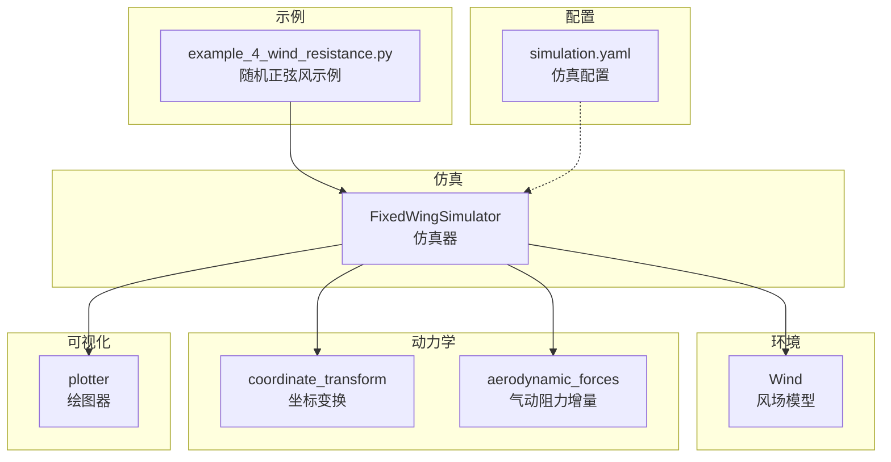
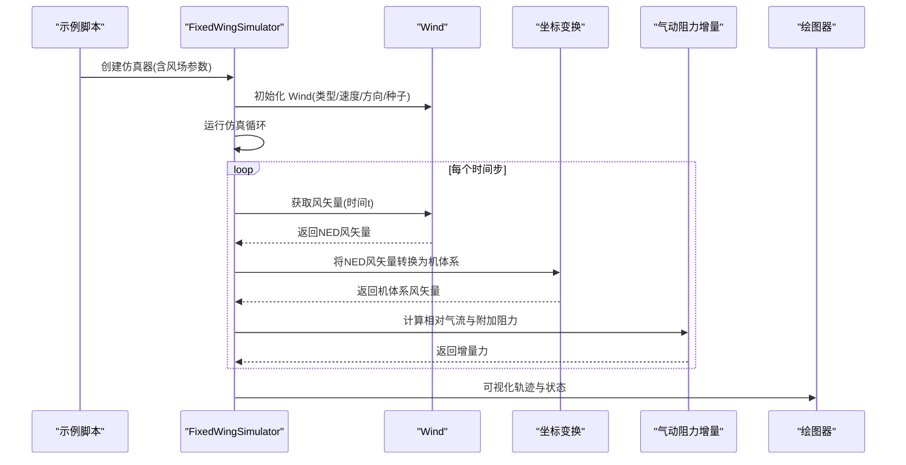
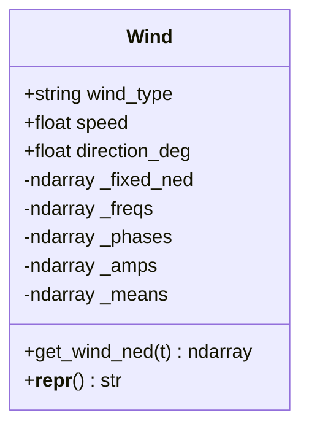
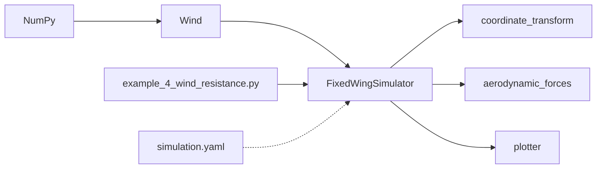

# 风场模型

<cite>
**本文引用的文件**
- [src/environment/wind_model.py](file://src/environment/wind_model.py)
- [src/simulation/simulator.py](file://src/simulation/simulator.py)
- [src/dynamics/coordinate_transform.py](file://src/dynamics/coordinate_transform.py)
- [src/environment/aerodynamic_forces.py](file://src/environment/aerodynamic_forces.py)
- [examples/example_4_wind_resistance.py](file://examples/example_4_wind_resistance.py)
- [config/simulation.yaml](file://config/simulation.yaml)
- [src/visualization/plotter.py](file://src/visualization/plotter.py)
- [tests/test_integration.py](file://tests/test_integration.py)
- [src/utils/math_utils.py](file://src/utils/math_utils.py)
</cite>

## 目录
1. [引言](#引言)
2. [项目结构](#项目结构)
3. [核心组件](#核心组件)
4. [架构总览](#架构总览)
5. [详细组件分析](#详细组件分析)
6. [依赖分析](#依赖分析)
7. [性能考虑](#性能考虑)
8. [故障排查指南](#故障排查指南)
9. [结论](#结论)
10. [附录](#附录)

## 引言
本文件面向固定翼飞行器仿真系统中的风场模型，围绕 Wind 类的实现进行深入技术说明。内容涵盖四种风场类型（NONE、FIXED、SINE、RANDOMSINE）的数学与物理含义，风向“FROM”方向与 NED 坐标系的转换关系，正弦波叠加与随机正弦扰动的参数生成机制（频率、振幅、相位），风场参数配置方法与典型应用场景，风场可视化与验证方法，以及模型扩展与自定义建议。目标是帮助读者在不直接阅读源码的情况下也能准确理解与使用风场模型。

## 项目结构
与风场模型相关的核心模块与示例如下：
- 环境模块：风场模型 Wind 类位于环境模块中，负责生成 NED 坐标下的风速矢量。
- 动力学与坐标变换：坐标变换工具提供 NED 与机体系之间的转换，用于将风矢量从 NED 转换到机体系以计算相对气流。
- 控制与仿真：仿真器在初始化时根据配置或显式参数创建 Wind 实例，并在仿真循环中按时间步调用获取风矢量。
- 可视化与示例：示例脚本展示如何启用随机正弦风扰，可视化结果并评估飞行模式下的抗扰能力。
- 配置：仿真配置文件提供默认风场参数，可覆盖 Wind 构造函数的默认值。

图表来源
- [src/environment/wind_model.py](file://src/environment/wind_model.py#L18-L112)
- [src/simulation/simulator.py](file://src/simulation/simulator.py#L130-L200)
- [src/dynamics/coordinate_transform.py](file://src/dynamics/coordinate_transform.py#L39-L69)
- [src/environment/aerodynamic_forces.py](file://src/environment/aerodynamic_forces.py#L13-L53)
- [examples/example_4_wind_resistance.py](file://examples/example_4_wind_resistance.py#L20-L36)
- [config/simulation.yaml](file://config/simulation.yaml#L22-L25)

章节来源
- [src/environment/wind_model.py](file://src/environment/wind_model.py#L1-L112)
- [src/simulation/simulator.py](file://src/simulation/simulator.py#L130-L200)
- [config/simulation.yaml](file://config/simulation.yaml#L22-L25)

## 核心组件
- Wind 类：提供四种风场类型，返回 NED 坐标下的风矢量；支持固定风、零风、正弦叠加风与随机正弦扰动风。
- FixedWingSimulator：在初始化阶段读取配置或显式参数创建 Wind 实例，并在仿真循环中按时间步调用获取风矢量。
- 坐标变换：提供 NED→机体与机体系→NED 的转换，用于将风矢量转换到机体系以计算相对气流。
- 气动阻力增量：基于相对气流计算风引起的附加气动阻力增量，用于敏感性分析与扰动评估。
- 示例与可视化：示例脚本演示随机正弦风下的飞行控制与可视化输出。

章节来源
- [src/environment/wind_model.py](file://src/environment/wind_model.py#L18-L112)
- [src/simulation/simulator.py](file://src/simulation/simulator.py#L130-L200)
- [src/dynamics/coordinate_transform.py](file://src/dynamics/coordinate_transform.py#L39-L69)
- [src/environment/aerodynamic_forces.py](file://src/environment/aerodynamic_forces.py#L13-L53)
- [examples/example_4_wind_resistance.py](file://examples/example_4_wind_resistance.py#L20-L36)
- [src/visualization/plotter.py](file://src/visualization/plotter.py#L161-L200)

## 架构总览
下图展示了风场模型在仿真系统中的位置与交互流程。

图表来源
- [examples/example_4_wind_resistance.py](file://examples/example_4_wind_resistance.py#L20-L36)
- [src/simulation/simulator.py](file://src/simulation/simulator.py#L130-L200)
- [src/environment/wind_model.py](file://src/environment/wind_model.py#L76-L108)
- [src/dynamics/coordinate_transform.py](file://src/dynamics/coordinate_transform.py#L39-L69)
- [src/environment/aerodynamic_forces.py](file://src/environment/aerodynamic_forces.py#L13-L53)
- [src/visualization/plotter.py](file://src/visualization/plotter.py#L161-L200)

## 详细组件分析

### Wind 类：四种风场类型的数学与物理意义
- NONE：无风，返回零矢量。
- FIXED：恒定风，基于“FROM 方向”与风速计算 NED 单位方向向量，乘以风速得到固定风矢量。注意“FROM 方向”表示风从该方向吹向相反方向。
- SINE：正弦波叠加风，每轴叠加若干正弦分量（默认每轴3个），频率范围 0.1–0.5 Hz，相位随机均匀分布，振幅由平均风速均分。
- RANDOMSINE：随机正弦扰动风，在 SINE 基础上引入每轴独立的均值（±0.5×风速），频率与相位同 SINE，振幅在 [0, 风速] 均匀分布，模拟慢湍流特征。

章节来源
- [src/environment/wind_model.py](file://src/environment/wind_model.py#L18-L112)

### 风向“FROM”方向与 NED 坐标系的转换关系
- “FROM 方向”采用气象约定：0° 表示从正北方向来，90° 表示从正东方向来。Wind 在初始化时将“FROM 方向”转换为风的实际运动方向（朝向相反方向），并据此计算 NED 单位方向向量，再乘以风速得到固定风矢量。
- NED 坐标系为北-东-下（North-East-Down）。Wind 返回的风矢量即为 NED 坐标下的风速分量 [v_north, v_east, v_down]。

章节来源
- [src/environment/wind_model.py](file://src/environment/wind_model.py#L32-L56)

### 正弦波叠加模型与随机正弦模型的参数生成机制
- 参数维度：(轴, 分量数)，默认每轴3个正弦分量。
- 频率：0.1–0.5 Hz，用于慢湍流建模，避免高频噪声对控制系统造成过大扰动。
- 相位：每轴每分量独立均匀分布在 [0, 2π]。
- 振幅：
  - SINE：每轴每分量振幅均等，等于平均风速除以分量数。
  - RANDOMSINE：每轴每分量振幅在 [0, 平均风速] 均匀分布，同时每轴增加一个均值项（±0.5×平均风速），使叠加后整体呈现随机扰动但保持有限均值。
- 时间函数：每轴风速为各分量正弦项之和，形如 v_axis(t)=Σ_k A_k·sin(2πf_k·t + φ_k)。

章节来源
- [src/environment/wind_model.py](file://src/environment/wind_model.py#L58-L71)
- [src/environment/wind_model.py](file://src/environment/wind_model.py#L76-L108)

### Wind 类的公开接口与数据结构
- 接口：get_wind_ned(t) 返回 NED 风矢量。
- 内部字段：固定风矢量 _fixed_ned、频率矩阵 _freqs、相位矩阵 _phases、振幅矩阵 _amps、均值向量 _means（仅 RANDOMSINE）。
- 类型常量：TYPES 包含 ("NONE", "FIXED", "SINE", "RANDOMSINE")。

图表来源
- [src/environment/wind_model.py](file://src/environment/wind_model.py#L18-L112)

### 仿真器中的风场集成
- FixedWingSimulator 在初始化时读取配置或显式参数，创建 Wind 实例，并在仿真循环中按时间步调用 get_wind_ned(t) 获取风矢量。
- 风矢量通常先在 NED 坐标系下计算，随后通过坐标变换转换到机体系，用于计算相对气流与附加气动阻力。

章节来源
- [src/simulation/simulator.py](file://src/simulation/simulator.py#L130-L200)
- [src/environment/wind_model.py](file://src/environment/wind_model.py#L76-L108)

### 相对气流与附加气动阻力
- 相对气流：机体系速度减去机体系风速，即 airspeed = V_body − V_wind_body。
- 附加气动阻力：基于相对气流计算，用于评估风扰对气动力的影响，适用于扰动/灵敏度分析。

章节来源
- [src/dynamics/coordinate_transform.py](file://src/dynamics/coordinate_transform.py#L56-L69)
- [src/environment/aerodynamic_forces.py](file://src/environment/aerodynamic_forces.py#L13-L53)

### 风场参数配置方法与典型应用场景
- 配置文件：simulation.yaml 提供 wind_type、wind_speed、wind_direction_deg 默认值，可在创建仿真器时覆盖。
- 示例脚本：example_4_wind_resistance.py 展示了在 FBW_B 模式下启用 RANDOMSINE 风扰，验证飞行器的抗扰能力。
- 典型场景：
  - NONE：无风或基准测试。
  - FIXED：设定恒定风向与风速，评估稳定控制与航迹保持。
  - SINE：模拟周期性风扰，研究控制系统对规则扰动的抑制能力。
  - RANDOMSINE：模拟慢湍流，评估控制器在随机扰动下的鲁棒性。

章节来源
- [config/simulation.yaml](file://config/simulation.yaml#L22-L25)
- [examples/example_4_wind_resistance.py](file://examples/example_4_wind_resistance.py#L20-L36)
- [tests/test_integration.py](file://tests/test_integration.py#L125-L134)

### 风场可视化与验证方法
- 可视化：示例脚本输出高度与空速随时间变化曲线，直观显示风扰对飞行状态的影响。
- 绘图器：plotter 支持 6DOF 历史数据绘制与 3D 轨迹展示，可用于进一步分析风扰下的轨迹偏差与姿态变化。
- 验证：通过对比不同风场类型下的飞行状态（如高度、空速、轨迹），评估控制策略的抗扰性能。

章节来源
- [examples/example_4_wind_resistance.py](file://examples/example_4_wind_resistance.py#L38-L51)
- [src/visualization/plotter.py](file://src/visualization/plotter.py#L161-L200)

### 扩展与自定义选项
- 新增风场类型：可在 Wind 类中添加新类型，定义其参数生成与 get_wind_ned 的实现。
- 参数可调：当前默认每轴3个正弦分量、频率范围0.1–0.5 Hz、相位均匀分布、振幅按类型确定。可根据需求调整这些默认值。
- 多维扩展：可引入垂直分量的随机扰动、非正弦时变风场（如白噪声、AR 模型）、风切变等。
- 与控制链集成：可在仿真器中将风扰作为外部扰动输入到控制回路，评估不同飞行模式（如 STABILIZE、AUTO、FBW_A/B）的抗扰表现。

章节来源
- [src/environment/wind_model.py](file://src/environment/wind_model.py#L18-L112)

## 依赖分析
- Wind 依赖 NumPy 进行数值计算与随机数生成。
- FixedWingSimulator 依赖 Wind 生成风矢量，并通过坐标变换与气动模型计算相对气流与附加力。
- 示例脚本依赖 FixedWingSimulator 与绘图器进行演示与可视化。

图表来源
- [src/environment/wind_model.py](file://src/environment/wind_model.py#L14-L15)
- [src/simulation/simulator.py](file://src/simulation/simulator.py#L38-L39)
- [src/dynamics/coordinate_transform.py](file://src/dynamics/coordinate_transform.py#L10-L16)
- [src/environment/aerodynamic_forces.py](file://src/environment/aerodynamic_forces.py#L9-L10)
- [examples/example_4_wind_resistance.py](file://examples/example_4_wind_resistance.py#L15-L17)
- [config/simulation.yaml](file://config/simulation.yaml#L22-L25)

章节来源
- [src/environment/wind_model.py](file://src/environment/wind_model.py#L14-L15)
- [src/simulation/simulator.py](file://src/simulation/simulator.py#L38-L39)
- [src/dynamics/coordinate_transform.py](file://src/dynamics/coordinate_transform.py#L10-L16)
- [src/environment/aerodynamic_forces.py](file://src/environment/aerodynamic_forces.py#L9-L10)
- [examples/example_4_wind_resistance.py](file://examples/example_4_wind_resistance.py#L15-L17)
- [config/simulation.yaml](file://config/simulation.yaml#L22-L25)

## 性能考虑
- 计算复杂度：get_wind_ned 对于 SINE/RANDOMSINE 为 O(A×K)，其中 A 为轴数（3），K 为每轴分量数（默认3），总体常数阶，开销极低。
- 随机数生成：初始化时一次性生成频率、相位与振幅，避免每步重复采样，提高效率。
- 数值稳定性：NED 与机体系转换基于旋转矩阵，数值稳定；相对气流与动态压计算对小速度有保护阈值，避免除零或不稳定行为。

章节来源
- [src/environment/wind_model.py](file://src/environment/wind_model.py#L58-L71)
- [src/environment/wind_model.py](file://src/environment/wind_model.py#L76-L108)
- [src/utils/math_utils.py](file://src/utils/math_utils.py#L121-L124)

## 故障排查指南
- 风类型错误：传入未知风类型会抛出异常，检查 wind_type 是否为 NONE/FIXED/SINE/RANDOMSINE。
- 风速/方向异常：确保风速为正值，方向在合理范围内（0–360°）。
- 仿真发散：若开启风扰后出现发散，检查风速是否过大、控制参数是否合适，或尝试降低风速与频率范围。
- 可视化缺失：若绘图器不可用，确认已安装所需依赖并正确导入。

章节来源
- [src/environment/wind_model.py](file://src/environment/wind_model.py#L39-L41)
- [tests/test_integration.py](file://tests/test_integration.py#L41-L58)

## 结论
Wind 类提供了简洁高效的风场建模能力，覆盖从无风到恒定风再到周期与随机扰动风的完整谱系。其与仿真器、坐标变换与气动模型的集成清晰明确，既满足工程应用的实时性要求，又便于扩展与定制。通过合理的参数设置与可视化验证，用户可以有效评估飞行器在不同风场条件下的抗扰性能，并为进一步的控制设计与分析提供支撑。

## 附录

### 风场类型与参数对照表
- NONE：无风，返回零矢量。
- FIXED：恒定风，由风速与“FROM 方向”决定 NED 固定风矢量。
- SINE：每轴叠加若干正弦分量，频率 0.1–0.5 Hz，相位随机，振幅均分。
- RANDOMSINE：在 SINE 基础上引入每轴均值与随机振幅，模拟慢湍流。

章节来源
- [src/environment/wind_model.py](file://src/environment/wind_model.py#L7-L11)
- [src/environment/wind_model.py](file://src/environment/wind_model.py#L58-L71)
- [src/environment/wind_model.py](file://src/environment/wind_model.py#L76-L108)

### 配置与示例路径
- 配置文件：config/simulation.yaml
- 示例脚本：examples/example_4_wind_resistance.py
- 仿真器：src/simulation/simulator.py
- 坐标变换：src/dynamics/coordinate_transform.py
- 气动阻力增量：src/environment/aerodynamic_forces.py
- 绘图器：src/visualization/plotter.py

章节来源
- [config/simulation.yaml](file://config/simulation.yaml#L22-L25)
- [examples/example_4_wind_resistance.py](file://examples/example_4_wind_resistance.py#L20-L36)
- [src/simulation/simulator.py](file://src/simulation/simulator.py#L130-L200)
- [src/dynamics/coordinate_transform.py](file://src/dynamics/coordinate_transform.py#L39-L69)
- [src/environment/aerodynamic_forces.py](file://src/environment/aerodynamic_forces.py#L13-L53)
- [src/visualization/plotter.py](file://src/visualization/plotter.py#L161-L200)