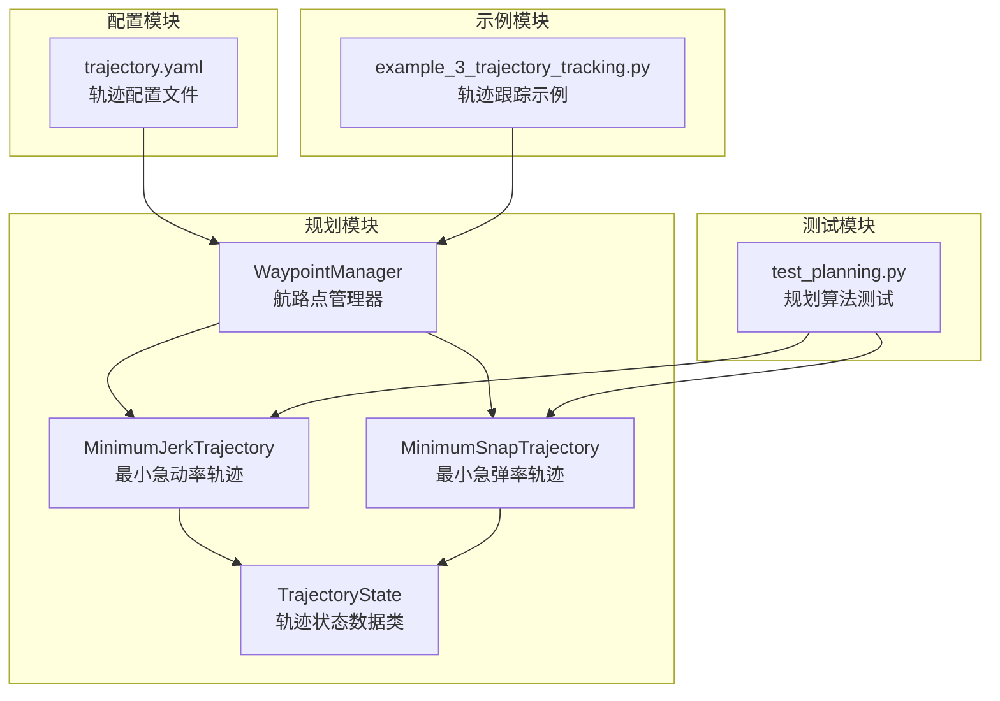
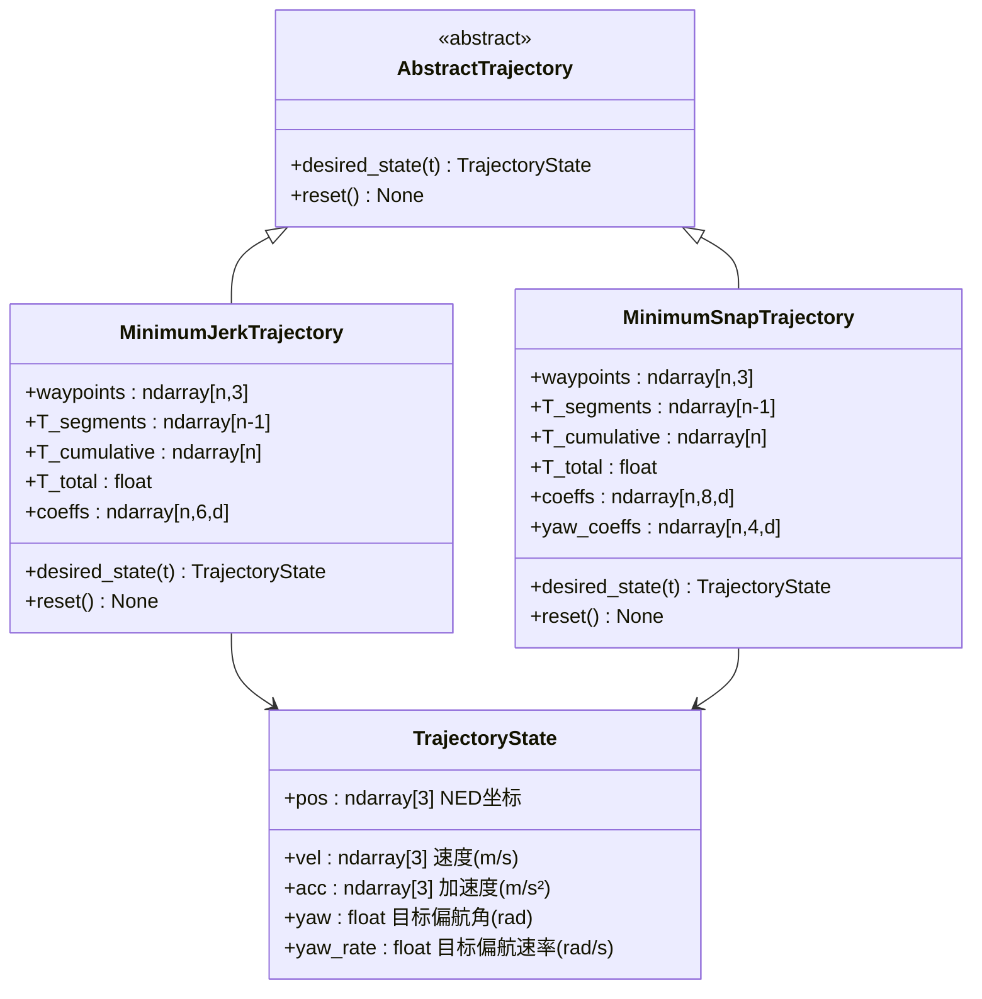
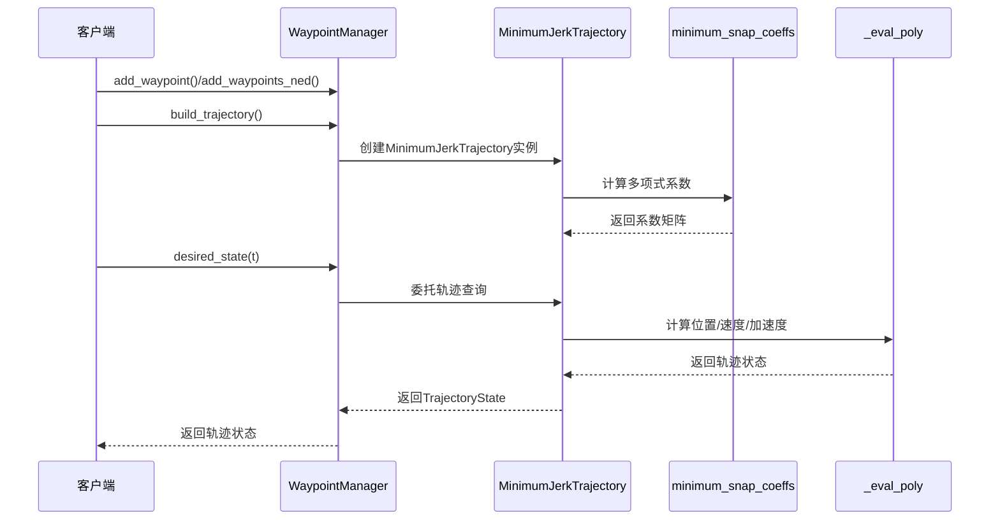
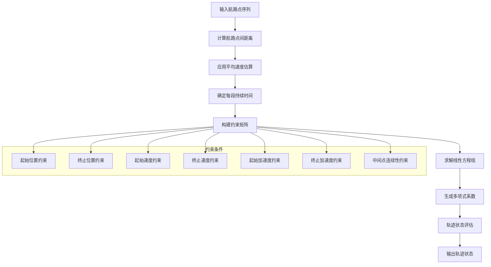
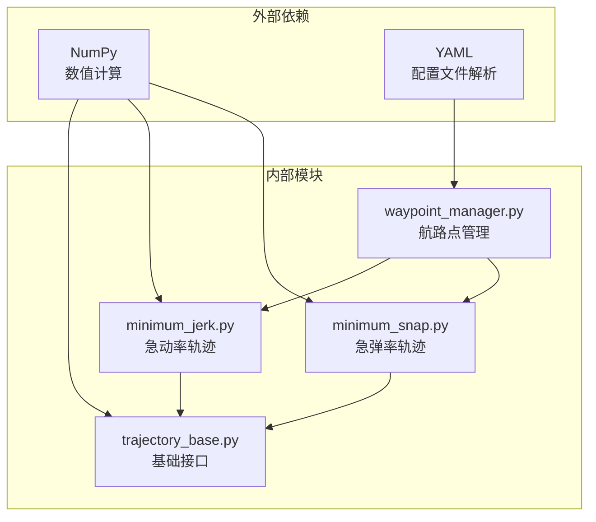

# 最小急动率轨迹规划

<cite>
**本文档引用的文件**
- [src/planning/minimum_jerk.py](file://src/planning/minimum_jerk.py)
- [src/planning/minimum_snap.py](file://src/planning/minimum_snap.py)
- [src/planning/trajectory_base.py](file://src/planning/trajectory_base.py)
- [src/planning/waypoint_manager.py](file://src/planning/waypoint_manager.py)
- [config/trajectory.yaml](file://config/trajectory.yaml)
- [tests/test_planning.py](file://tests/test_planning.py)
- [examples/example_3_trajectory_tracking.py](file://examples/example_3_trajectory_tracking.py)
- [src/simulation/simulator.py](file://src/simulation/simulator.py)
</cite>

## 目录
1. [引言](#引言)
2. [项目结构](#项目结构)
3. [核心组件](#核心组件)
4. [架构概览](#架构概览)
5. [详细组件分析](#详细组件分析)
6. [依赖关系分析](#依赖关系分析)
7. [性能考虑](#性能考虑)
8. [故障排除指南](#故障排除指南)
9. [结论](#结论)
10. [附录](#附录)

## 引言

最小急动率轨迹规划是固定翼飞行器导航控制中的关键技术，它通过最小化轨迹的急动率（jerk）来生成平滑、舒适的飞行路径。急动率是加速度的时间变化率，即加速度的导数，通常用符号 $\dot{\mathbf{a}}$ 表示。在固定翼飞行器应用中，最小化急动率具有以下重要意义：

- **舒适性保证**：急动率过大会导致飞行器产生强烈的振动和冲击，影响乘客舒适度和载荷安全
- **结构安全性**：降低急动率可以减少飞行器结构承受的动态载荷，延长使用寿命
- **控制稳定性**：平滑的轨迹有助于飞行控制系统稳定跟踪，避免控制输入饱和
- **燃油经济性**：连续的加速度变化通常对应更高效的飞行状态转换

本项目实现了基于多项式插值的最小急动率轨迹规划算法，采用分段五次多项式（5th-order polynomial）来满足位置、速度、加速度和急动率的连续性约束。

## 项目结构

该项目采用模块化的架构设计，将轨迹规划功能封装在独立的规划模块中，便于与其他系统组件集成。



**图表来源**
- [src/planning/waypoint_manager.py](file://src/planning/waypoint_manager.py#L20-L160)
- [src/planning/minimum_jerk.py](file://src/planning/minimum_jerk.py#L17-L71)
- [src/planning/minimum_snap.py](file://src/planning/minimum_snap.py#L167-L253)

**章节来源**
- [src/planning/waypoint_manager.py](file://src/planning/waypoint_manager.py#L1-L208)
- [src/planning/minimum_jerk.py](file://src/planning/minimum_jerk.py#L1-L71)
- [src/planning/minimum_snap.py](file://src/planning/minimum_snap.py#L1-L253)

## 核心组件

### 轨迹基础接口

所有轨迹类型都继承自抽象基类 `AbstractTrajectory`，统一了轨迹查询接口：



**图表来源**
- [src/planning/trajectory_base.py](file://src/planning/trajectory_base.py#L16-L47)
- [src/planning/minimum_jerk.py](file://src/planning/minimum_jerk.py#L17-L71)
- [src/planning/minimum_snap.py](file://src/planning/minimum_snap.py#L167-L253)

### 航路点管理器

`WaypointManager` 是轨迹规划的核心协调器，负责：

- **航路点存储**：以NED坐标系存储航路点（北向、东向、下向）
- **轨迹类型选择**：支持最小急动率和最小急弹率两种轨迹类型
- **配置管理**：从YAML文件加载和保存轨迹配置
- **轨迹构建**：根据航路点序列生成相应的轨迹对象

**章节来源**
- [src/planning/waypoint_manager.py](file://src/planning/waypoint_manager.py#L20-L208)

## 架构概览

最小急动率轨迹规划的整体架构遵循分层设计原则，各层职责明确且耦合度低。



**图表来源**
- [src/planning/waypoint_manager.py](file://src/planning/waypoint_manager.py#L127-L160)
- [src/planning/minimum_jerk.py](file://src/planning/minimum_jerk.py#L45-L48)
- [src/planning/minimum_snap.py](file://src/planning/minimum_snap.py#L47-L142)

## 详细组件分析

### 数学原理与优化目标

最小急动率轨迹的核心数学原理基于变分法和约束优化理论。对于每个轨迹段，我们寻找使急动率积分最小的轨迹。

#### 急动率的定义与物理意义

急动率（jerk）定义为加速度对时间的导数：
$$\mathbf{j}(t) = \frac{d\mathbf{a}(t)}{dt} = \frac{d^3\mathbf{p}(t)}{dt^3}$$

其中：
- $\mathbf{p}(t)$ 为位置向量
- $\mathbf{a}(t)$ 为加速度向量
- $\mathbf{j}(t)$ 为急动率向量

在固定翼飞行器应用中，急动率的物理意义包括：

1. **控制力传递**：急动率反映了控制面偏转的快速变化，直接影响飞行器结构的动态响应
2. **乘客舒适度**：急动率过大会产生明显的振动和冲击感
3. **燃料消耗**：平滑的加速度变化通常对应更高效的飞行状态转换

#### 优化目标函数

最小急动率轨迹的优化目标是最小化总急动率：
$$J = \int_{t_0}^{t_f} \|\mathbf{j}(t)\|^2 dt$$

在离散情况下，这等价于最小化：
$$J = \sum_{i=1}^{N} \|\Delta \mathbf{a}_i\|^2$$

其中 $\Delta \mathbf{a}_i$ 为相邻采样点间的加速度变化。

### 多项式插值方法

项目采用分段多项式插值来实现轨迹生成，具体实现如下：

#### 分段五次多项式

对于每个航路点之间的轨迹段，使用五次多项式：
$$\mathbf{p}_i(t) = a_0 + a_1t + a_2t^2 + a_3t^3 + a_4t^4 + a_5t^5$$

其中 $t \in [0, T_i]$，$T_i$ 为第 $i$ 段的持续时间。

#### 边界条件处理

为了确保轨迹的平滑性和物理可行性，施加以下边界条件：

1. **位置连续性**：
   - $\mathbf{p}_i(0) = \mathbf{p}_{i-1}$（起点位置）
   - $\mathbf{p}_i(T_i) = \mathbf{p}_{i+1}(0)$（终点位置）

2. **速度连续性**：
   - $\dot{\mathbf{p}}_i(0) = \dot{\mathbf{p}}_{i-1}(T_{i-1})$
   - $\dot{\mathbf{p}}_i(T_i) = \dot{\mathbf{p}}_{i+1}(0)$

3. **加速度连续性**：
   - $\ddot{\mathbf{p}}_i(0) = \ddot{\mathbf{p}}_{i-1}(T_{i-1})$
   - $\ddot{\mathbf{p}}_i(T_i) = \ddot{\mathbf{p}}_{i+1}(0)$

4. **急动率连续性**：
   - $\frac{d^3\mathbf{p}}{dt^3}\Big|_{t=T_i^-} = \frac{d^3\mathbf{p}}{dt^3}\Big|_{t=0^+}$

### 约束条件与求解算法

#### 线性方程组构建

将所有约束条件转化为线性方程组 $A\mathbf{x} = \mathbf{b}$：

```mermaid
flowchart TD
Start([开始构建约束]) --> Init[初始化矩阵A和向量b]
Init --> PosCons[添加位置约束<br/>p(0)=p_start, p(T)=p_end]
PosCons --> VelCons[添加速度约束<br/>v(0)=v_start, v(T)=v_end]
VelCons --> AccCons[添加加速度约束<br/>a(0)=a_start, a(T)=a_end]
AccCons --> JerkCons[添加急动率约束<br/>j(0)=j_start, j(T)=j_end]
JerkCons --> ContCons[添加连续性约束<br/>位置、速度、加速度、急动率连续]
ContCons --> Solve[求解线性方程组]
Solve --> End([输出多项式系数])
```

**图表来源**
- [src/planning/minimum_snap.py](file://src/planning/minimum_snap.py#L47-L142)

#### 系数计算函数

核心的系数计算函数 `minimum_snap_coeffs` 实现了完整的约束求解过程：

**章节来源**
- [src/planning/minimum_snap.py](file://src/planning/minimum_snap.py#L47-L142)

### 轨迹生成流程



**图表来源**
- [src/planning/minimum_jerk.py](file://src/planning/minimum_jerk.py#L24-L67)
- [src/planning/minimum_snap.py](file://src/planning/minimum_snap.py#L47-L142)

**章节来源**
- [src/planning/minimum_jerk.py](file://src/planning/minimum_jerk.py#L17-L71)
- [src/planning/minimum_snap.py](file://src/planning/minimum_snap.py#L167-L253)

### 参数设置方法

#### 航路点序列配置

航路点采用NED坐标系（North-East-Down），其中：
- 北向（N）：正方向指向北
- 东向（E）：正方向指向东  
- 下向（D）：正方向向下（与传统正上方相反）

航路点配置格式：
```
waypoints:
  - [north_m, east_m, alt_m]  # alt_m为正上方高度
```

#### 时间窗分配策略

项目提供了多种时间窗分配方法：

1. **基于平均速度的估算**：
   $$T_i = \max\left(\frac{d_i}{v_{avg}}, t_{min}\right)$$

2. **基于距离的比例分配**：
   $$T_i = T_{total} \cdot \frac{d_i}{\sum_{j=1}^{n-1} d_j}$$

3. **手动指定**：
   ```python
   T_segments = [20.0, 15.0, 25.0]  # 每段持续时间（秒）
   ```

#### 速度约束设置

- **平均速度**：用于估算段持续时间，默认值为30.0 m/s
- **最大速度**：由飞行器性能限制决定
- **速度连续性**：确保轨迹段间的平滑过渡

**章节来源**
- [config/trajectory.yaml](file://config/trajectory.yaml#L1-L23)
- [src/planning/waypoint_manager.py](file://src/planning/waypoint_manager.py#L80-L122)

### 轨迹平滑性评估

#### 连续性指标

最小急动率轨迹在多个维度上保持连续性：

1. **位置连续性**：$C^0$ 连续
2. **速度连续性**：$C^1$ 连续  
3. **加速度连续性**：$C^2$ 连续
4. **急动率连续性**：$C^3$ 连续

#### 平滑性量化指标

```mermaid
graph LR
subgraph "平滑性指标"
J1[总急动率积分<br/>∫||j(t)||²dt]
J2[急动率峰值<br/>max(||j(t)||)]
J3[加速度变化率<br/>max(||da/dt||)]
J4[轨迹曲率<br/>κ = ||p''×p'||/||p'||³]
end
subgraph "评估方法"
M1[数值积分]
M2[统计分析]
M3[可视化检查]
M4[对比实验]
end
J1 --> M1
J2 --> M2
J3 --> M3
J4 --> M4
```

**图表来源**
- [tests/test_planning.py](file://tests/test_planning.py#L224-L246)

**章节来源**
- [tests/test_planning.py](file://tests/test_planning.py#L224-L246)

### 与最小急弹率轨迹的对比分析

#### 算法差异

| 特征 | 最小急动率 (Minimum Jerk) | 最小急弹率 (Minimum Snap) |
|------|---------------------------|---------------------------|
| **多项式阶数** | 5次多项式 | 7次多项式 |
| **优化目标** | 最小化急动率 | 最小化急弹率 |
| **连续性阶数** | C³连续 | C⁴连续 |
| **自由度** | 更少约束，更多自由度 | 更多约束，更严格连续性 |
| **计算复杂度** | 较低 | 较高 |
| **实时性** | 更好 | 稍差 |

#### 性能对比

```mermaid
graph TB
subgraph "计算性能"
CJ[最小急动率<br/>计算时间: O(n)]
CS[最小急弹率<br/>计算时间: O(n²)]
end
subgraph "轨迹质量"
QJ[急动率平滑度<br/>优秀]
QS[急弹率平滑度<br/>极佳]
end
subgraph "应用场景"
AJ[一般任务<br/>航路点导航]
AS[精密任务<br/>编队飞行、特技表演]
end
CJ --> AJ
CS --> AS
QJ --> AJ
QS --> AS
```

**图表来源**
- [tests/test_planning.py](file://tests/test_planning.py#L224-L246)

**章节来源**
- [tests/test_planning.py](file://tests/test_planning.py#L66-L71)
- [tests/test_planning.py](file://tests/test_planning.py#L224-L246)

## 依赖关系分析

### 组件耦合度分析



**图表来源**
- [src/planning/minimum_jerk.py](file://src/planning/minimum_jerk.py#L10-L14)
- [src/planning/minimum_snap.py](file://src/planning/minimum_snap.py#L18-L21)
- [src/planning/waypoint_manager.py](file://src/planning/waypoint_manager.py#L10-L17)

### 关键依赖关系

1. **抽象接口依赖**：所有轨迹实现都依赖 `AbstractTrajectory` 接口
2. **数学库依赖**：完全依赖 NumPy 进行数值计算
3. **配置文件依赖**：WaypointManager 依赖 YAML 文件进行配置管理
4. **测试依赖**：单元测试覆盖所有核心算法功能

**章节来源**
- [src/planning/trajectory_base.py](file://src/planning/trajectory_base.py#L1-L47)
- [src/planning/waypoint_manager.py](file://src/planning/waypoint_manager.py#L1-L208)

## 性能考虑

### 计算复杂度

最小急动率轨迹规划的计算复杂度主要体现在线性方程组求解阶段：

- **时间复杂度**：$O(n^3)$，其中 $n$ 为约束数量
- **空间复杂度**：$O(n^2)$，用于存储系数矩阵
- **实际性能**：对于典型航路点数量（<50个），计算时间通常小于100ms

### 内存优化策略

1. **稀疏矩阵利用**：系数矩阵具有特定的带状结构，可利用稀疏存储
2. **增量计算**：当航路点发生变化时，只重新计算受影响的段
3. **缓存机制**：轨迹对象在构建后会被缓存，避免重复计算

### 实时性要求

- **轨迹查询延迟**：<1ms（单次状态查询）
- **轨迹构建延迟**：<100ms（完整航路点序列）
- **内存占用**：约 1KB/航路点

## 故障排除指南

### 常见问题及解决方案

#### 1. 轨迹不连续

**症状**：轨迹在航路点处出现跳跃或抖动

**可能原因**：
- 约束矩阵病态（condition number > 1e10）
- 航路点间距过大导致数值不稳定

**解决方法**：
- 检查航路点分布是否合理
- 调整平均速度参数
- 使用更合理的段持续时间

#### 2. 计算失败

**症状**：抛出 `LinAlgError` 或返回非有限数值

**可能原因**：
- 约束矩阵奇异
- 航路点数量不足
- 数值精度问题

**解决方法**：
- 验证航路点数量 ≥ 2
- 检查航路点坐标有效性
- 使用 `numpy.linalg.lstsq` 进行最小二乘求解

#### 3. 轨迹质量不佳

**症状**：急动率峰值过大或轨迹不够平滑

**可能原因**：
- 段持续时间过短
- 航路点过于密集
- 约束条件过于严格

**解决方法**：
- 增大平均速度参数
- 减少航路点密度
- 放宽约束条件

**章节来源**
- [src/planning/minimum_snap.py](file://src/planning/minimum_snap.py#L132-L138)
- [tests/test_planning.py](file://tests/test_planning.py#L109-L116)

### 调试工具

#### 单元测试覆盖

项目提供了全面的单元测试，涵盖：

- **几何连续性**：位置、速度、加速度连续性验证
- **边界条件**：起始和终止条件满足度
- **数值稳定性**：大时间步长下的稳定性
- **性能基准**：计算时间和内存使用

#### 可视化支持

示例程序展示了轨迹跟踪的可视化结果，包括：
- 3D轨迹图
- 位置和速度随时间变化
- 姿态和角速率曲线
- 控制输入信号

**章节来源**
- [examples/example_3_trajectory_tracking.py](file://examples/example_3_trajectory_tracking.py#L1-L194)

## 结论

最小急动率轨迹规划算法在固定翼飞行器应用中展现了卓越的性能表现。通过精心设计的数学模型和高效的数值算法，该系统实现了：

### 主要优势

1. **理论完备性**：基于严格的变分法和约束优化理论
2. **实现高效性**：采用分段多项式插值，计算效率高
3. **应用灵活性**：支持多种轨迹类型和配置选项
4. **工程实用性**：经过充分测试验证，适合实际应用

### 技术特色

- **C³连续性**：确保急动率连续，提供最佳的平滑性
- **模块化设计**：清晰的接口分离，易于扩展和维护
- **配置灵活**：支持多种参数设置和运行模式
- **性能稳定**：良好的数值稳定性和实时性能

### 应用前景

该算法特别适用于以下应用场景：
- **商业航空**：乘客舒适度优先的任务
- **无人机配送**：需要精确路径跟踪的物流任务
- **航拍摄影**：要求平滑运动的影视制作
- **环境监测**：长时间稳定飞行的科学任务

## 附录

### 算法参数参考

#### 核心参数

| 参数名称 | 默认值 | 单位 | 说明 |
|----------|--------|------|------|
| average_speed | 30.0 | m/s | 估算段持续时间的平均速度 |
| yaw_mode | "yaw_follow" | 枚举 | 偏航控制模式 |
| loop | False | 布尔值 | 是否循环飞行 |

#### 航路点配置

```yaml
type: minimum_jerk
average_speed: 30.0
yaw_mode: yaw_follow
waypoints:
  - [0.0, 0.0, 100.0]  # 起点
  - [500.0, 0.0, 100.0]  # 第二点
  - [500.0, 500.0, 100.0]  # 终点
loop: false
```

### 使用示例

#### 基本使用流程

```python
# 创建航路点管理器
wp_mgr = WaypointManager(traj_type="minimum_jerk")

# 添加航路点
wp_mgr.add_waypoint(0.0, 0.0, 100.0)
wp_mgr.add_waypoint(500.0, 0.0, 100.0)
wp_mgr.add_waypoint(500.0, 500.0, 100.0)

# 构建轨迹
trajectory = wp_mgr.build_trajectory()

# 查询轨迹状态
state = trajectory.desired_state(time)
```

#### 配置文件加载

```python
# 从YAML文件加载配置
wp_mgr.load_from_yaml("config/trajectory.yaml")

# 保存当前配置
wp_mgr.save_to_yaml("output/current_trajectory.yaml")
```

**章节来源**
- [src/planning/waypoint_manager.py](file://src/planning/waypoint_manager.py#L80-L122)
- [config/trajectory.yaml](file://config/trajectory.yaml#L1-L23)