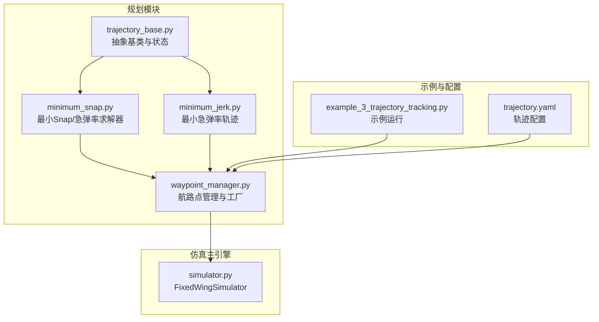
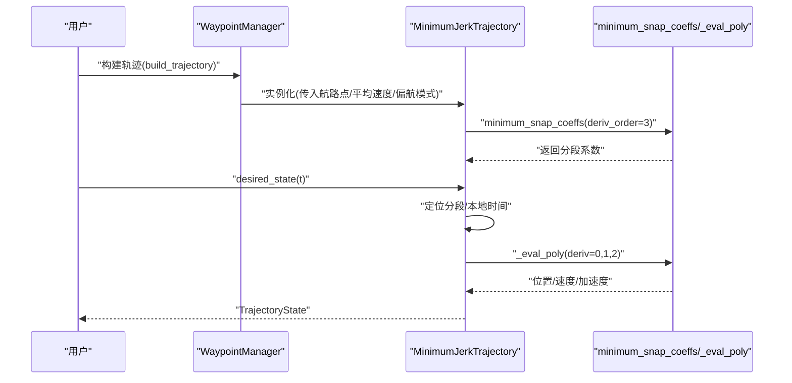
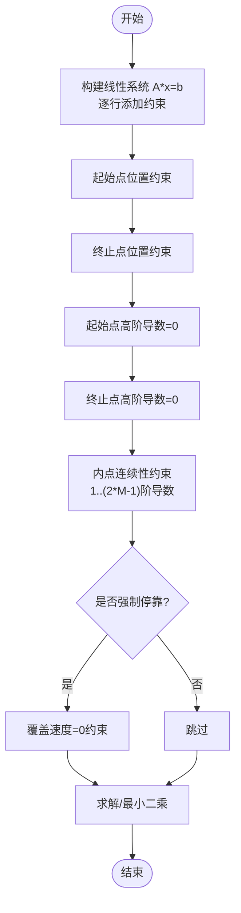
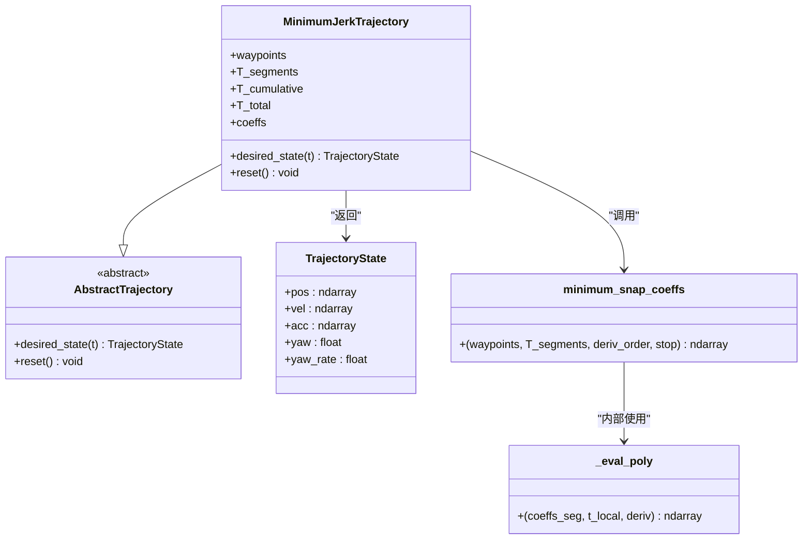
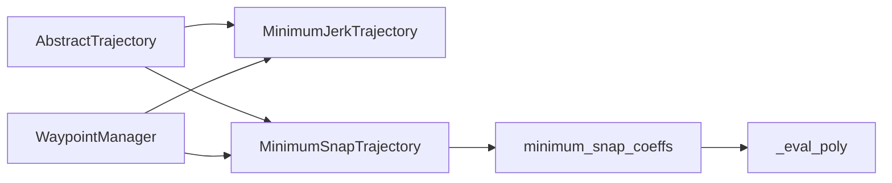

# 最小急弹率轨迹规划

<cite>
**本文引用的文件**
- [src/planning/minimum_jerk.py](file://src/planning/minimum_jerk.py)
- [src/planning/minimum_snap.py](file://src/planning/minimum_snap.py)
- [src/planning/trajectory_base.py](file://src/planning/trajectory_base.py)
- [src/planning/waypoint_manager.py](file://src/planning/waypoint_manager.py)
- [config/trajectory.yaml](file://config/trajectory.yaml)
- [examples/example_3_trajectory_tracking.py](file://examples/example_3_trajectory_tracking.py)
- [tests/test_planning.py](file://tests/test_planning.py)
- [src/simulation/simulator.py](file://src/simulation/simulator.py)
</cite>

## 目录
1. [引言](#引言)
2. [项目结构](#项目结构)
3. [核心组件](#核心组件)
4. [架构总览](#架构总览)
5. [详细组件分析](#详细组件分析)
6. [依赖关系分析](#依赖关系分析)
7. [性能与复杂度](#性能与复杂度)
8. [轨迹质量评估与可视化](#轨迹质量评估与可视化)
9. [故障排查指南](#故障排查指南)
10. [结论](#结论)

## 引言
本技术文档围绕固定翼飞行器仿真器中的最小急弹率（Minimum-Jerk）轨迹规划算法展开，系统阐述其数学原理、优化目标、实现细节与工程特性。最小急弹率通过在每段轨迹上使用三阶导数（即“急弹率”）作为优化目标，结合分段五次多项式插值，在满足边界条件与连续性约束的前提下，生成平滑且物理可实现的三维轨迹。相比最小加速度或最小Snap等方法，最小急弹率在保证轨迹连续性的同时，进一步降低急弹率积分，从而获得更平滑的飞行状态变化，有利于提升控制鲁棒性与乘客舒适度。

## 项目结构
该模块位于规划子系统中，主要由以下文件构成：
- 轨迹基类与状态定义：trajectory_base.py
- 最小急弹率轨迹：minimum_jerk.py
- 最小Snap轨迹与通用系数求解器：minimum_snap.py
- 航路点管理与轨迹工厂：waypoint_manager.py
- 示例与配置：examples/example_3_trajectory_tracking.py、config/trajectory.yaml
- 单元测试：tests/test_planning.py
- 仿真主引擎：src/simulation/simulator.py

图表来源
- [src/planning/trajectory_base.py](file://src/planning/trajectory_base.py#L1-L47)
- [src/planning/minimum_snap.py](file://src/planning/minimum_snap.py#L1-L253)
- [src/planning/minimum_jerk.py](file://src/planning/minimum_jerk.py#L1-L71)
- [src/planning/waypoint_manager.py](file://src/planning/waypoint_manager.py#L1-L208)
- [examples/example_3_trajectory_tracking.py](file://examples/example_3_trajectory_tracking.py#L1-L194)
- [config/trajectory.yaml](file://config/trajectory.yaml#L1-L23)
- [src/simulation/simulator.py](file://src/simulation/simulator.py#L1-L200)

章节来源
- [src/planning/trajectory_base.py](file://src/planning/trajectory_base.py#L1-L47)
- [src/planning/minimum_snap.py](file://src/planning/minimum_snap.py#L1-L253)
- [src/planning/minimum_jerk.py](file://src/planning/minimum_jerk.py#L1-L71)
- [src/planning/waypoint_manager.py](file://src/planning/waypoint_manager.py#L1-L208)
- [examples/example_3_trajectory_tracking.py](file://examples/example_3_trajectory_tracking.py#L1-L194)
- [config/trajectory.yaml](file://config/trajectory.yaml#L1-L23)
- [src/simulation/simulator.py](file://src/simulation/simulator.py#L1-L200)

## 核心组件
- 抽象轨迹接口与状态容器：定义统一的轨迹查询接口与期望状态结构，便于不同轨迹类型共享控制链路。
- 最小Snap/急弹率求解器：以矩阵构造法建立线性系统，按指定导数阶数（2、3、4对应最小加速度、最小急弹率、最小Snap）求解多项式系数。
- 最小急弹率轨迹类：复用求解器，生成分段五次多项式，并提供时间到状态的映射。
- 航路点管理器：负责航路点加载、轨迹类型选择、时间分配策略与缓存机制。

章节来源
- [src/planning/trajectory_base.py](file://src/planning/trajectory_base.py#L16-L47)
- [src/planning/minimum_snap.py](file://src/planning/minimum_snap.py#L47-L142)
- [src/planning/minimum_jerk.py](file://src/planning/minimum_jerk.py#L17-L71)
- [src/planning/waypoint_manager.py](file://src/planning/waypoint_manager.py#L20-L160)

## 架构总览
最小急弹率轨迹规划采用“航路点管理器 + 轨迹求解器 + 轨迹类”的分层设计：
- WaypointManager根据配置与航路点构建具体轨迹对象（MinimumSnapTrajectory 或 MinimumJerkTrajectory）。
- 每个轨迹类内部调用minimum_snap_coeffs求解器，按导数阶数生成分段多项式系数。
- desired_state接口将当前时间映射到对应分段的位姿、速度与加速度，并处理偏航模式。

图表来源
- [src/planning/waypoint_manager.py](file://src/planning/waypoint_manager.py#L127-L160)
- [src/planning/minimum_jerk.py](file://src/planning/minimum_jerk.py#L24-L67)
- [src/planning/minimum_snap.py](file://src/planning/minimum_snap.py#L47-L142)

## 详细组件分析

### 数学原理与优化目标
- 急弹率定义：急弹率是位移的三阶导数，单位为m/s³。最小急弹率意味着在给定边界条件下，使轨迹的急弹率平方积分最小，从而获得更平滑的加速度变化。
- 优化目标：在每段空间维度上构造度为2×M−1的多项式，其中M为导数阶数。对于最小急弹率，M=3，每段使用五次多项式；对于最小Snap，M=4，每段使用七次多项式。
- 约束条件：
  - 起止点位置约束：每段起点与终点分别等于相邻航路点。
  - 边界条件：起止点的1至(deriv_order−1)阶导数为零，确保初始静止与最终静止。
  - 连续性：相邻段在连接点处的1至(2×deriv_order−1)阶导数连续。
  - 可选中间停靠：在中间航路点处强制速度为零（stop_at_waypoints）。

图表来源
- [src/planning/minimum_snap.py](file://src/planning/minimum_snap.py#L75-L142)

章节来源
- [src/planning/minimum_snap.py](file://src/planning/minimum_snap.py#L47-L142)

### 分段五次多项式与求解流程
- 多项式形式：每段在归一化时间t∈[0,T]上表示为五次多项式，系数向量长度为6。
- 系数求解：通过矩阵A与向量b的线性系统直接求解或在病态情况下采用最小二乘，得到每段的系数矩阵。
- 状态评估：使用辅助函数_eval_poly在局部时间t_local计算位置、速度、加速度。

图表来源
- [src/planning/minimum_jerk.py](file://src/planning/minimum_jerk.py#L17-L71)
- [src/planning/trajectory_base.py](file://src/planning/trajectory_base.py#L16-L47)
- [src/planning/minimum_snap.py](file://src/planning/minimum_snap.py#L47-L164)

章节来源
- [src/planning/minimum_jerk.py](file://src/planning/minimum_jerk.py#L17-L71)
- [src/planning/minimum_snap.py](file://src/planning/minimum_snap.py#L145-L164)
- [src/planning/trajectory_base.py](file://src/planning/trajectory_base.py#L16-L47)

### 轨迹参数设置与时间分配
- 时间分配策略：若未显式提供每段时长T_segments，则基于航路点间距离与平均速度估算，同时设定最小阈值以避免过短段导致数值不稳定。
- 偏航模式：支持跟随速度方向（yaw_follow）、固定偏航（需提供航路点偏航角）与零偏航等模式。
- 中间停靠：可选在每个中间航路点处强制速度为零，适用于需要精确悬停的任务场景。

章节来源
- [src/planning/minimum_jerk.py](file://src/planning/minimum_jerk.py#L38-L48)
- [src/planning/minimum_snap.py](file://src/planning/minimum_snap.py#L181-L224)
- [src/planning/waypoint_manager.py](file://src/planning/waypoint_manager.py#L35-L50)

### 与其他轨迹规划方法的对比优势
- 相比最小加速度（deriv_order=2），最小急弹率在保持边界条件与连续性的同时，进一步降低急弹率积分，轨迹更平滑，更适合固定翼飞行器的动态特性。
- 相比最小Snap（deriv_order=4），最小急弹率的多项式阶数更低，自由度更大，更容易在满足约束的前提下最小化急弹率总量，从而获得更柔和的加速度变化。

章节来源
- [src/planning/minimum_snap.py](file://src/planning/minimum_snap.py#L47-L71)
- [tests/test_planning.py](file://tests/test_planning.py#L224-L233)

## 依赖关系分析
- 继承与组合：MinimumJerkTrajectory继承自AbstractTrajectory，复用minimum_snap_coeffs与_eval_poly实现；WaypointManager根据配置选择轨迹类型并缓存轨迹对象。
- 外部依赖：NumPy用于数值计算；单元测试验证关键性质（连续性、边界满足、有限性）。

图表来源
- [src/planning/trajectory_base.py](file://src/planning/trajectory_base.py#L26-L47)
- [src/planning/minimum_jerk.py](file://src/planning/minimum_jerk.py#L13-L14)
- [src/planning/minimum_snap.py](file://src/planning/minimum_snap.py#L21-L22)
- [src/planning/waypoint_manager.py](file://src/planning/waypoint_manager.py#L16-L17)

章节来源
- [src/planning/trajectory_base.py](file://src/planning/trajectory_base.py#L26-L47)
- [src/planning/minimum_jerk.py](file://src/planning/minimum_jerk.py#L13-L14)
- [src/planning/minimum_snap.py](file://src/planning/minimum_snap.py#L21-L22)
- [src/planning/waypoint_manager.py](file://src/planning/waypoint_manager.py#L16-L17)

## 性能与复杂度
- 计算复杂度：每段多项式系数求解为O(M²)，其中M=2×deriv_order。对于最小急弹率，M=6；对于最小Snap，M=8。整体复杂度与航路段数n成正比，约为O(n×M²)。
- 内存占用：存储每段系数矩阵与累计时间数组，空间复杂度O(n×M)。
- 实际表现：在典型航路点数量下，求解与查询均能在毫秒级完成，满足实时仿真需求。

章节来源
- [src/planning/minimum_snap.py](file://src/planning/minimum_snap.py#L75-L142)
- [src/planning/minimum_jerk.py](file://src/planning/minimum_jerk.py#L45-L48)

## 轨迹质量评估与可视化
- 质量指标（建议）：
  - 急弹率积分：沿轨迹对急弹率的绝对值进行数值积分，越小越平滑。
  - 加速度变化率：二阶导数（加速度）的最大变化率，衡量加速度的平滑程度。
  - 连续性检验：检查速度与加速度在航路点处的连续性。
  - 偏航一致性：偏航角随速度方向的变化是否平滑。
- 可视化方法：
  - 3D轨迹图：显示实际与期望轨迹对比，标注航路点。
  - 时序曲线：位置、速度、加速度与偏航随时间的变化。
  - 控制输入：副翼、升降舵、方向舵与油门的时间历程。
- 工程实践：示例脚本已提供完整的数据保存与图形输出流程，可直接复用。

章节来源
- [examples/example_3_trajectory_tracking.py](file://examples/example_3_trajectory_tracking.py#L111-L190)
- [tests/test_planning.py](file://tests/test_planning.py#L122-L186)

## 故障排查指南
- 病态矩阵警告：当某段时长过大时，可能出现矩阵条件数过大，求解器会打印警告。可通过减小段时长或调整航路点分布缓解。
- 非有限系数：若出现非有限系数，检查航路点坐标与段时长是否合理，避免极端配置。
- 偏航异常：在低速时偏航可能不稳定，建议在速度足够大后再启用跟随偏航模式。
- 单元测试参考：通过测试用例验证边界满足、连续性与稳定性，有助于快速定位问题。

章节来源
- [src/planning/minimum_snap.py](file://src/planning/minimum_snap.py#L132-L138)
- [tests/test_planning.py](file://tests/test_planning.py#L104-L116)
- [tests/test_planning.py](file://tests/test_planning.py#L173-L178)

## 结论
最小急弹率轨迹规划通过在每段使用五次多项式并以急弹率为优化目标，在满足边界条件与连续性的前提下，显著提升了轨迹的平滑性。该实现以矩阵构造法为核心，具备良好的数值稳定性与工程可用性；配合航路点管理器与仿真主引擎，可在固定翼飞行器仿真与控制链路中高效集成。建议在任务规划阶段结合航路点密度与时速要求合理设置段时长，并在偏航模式与停靠策略上根据任务需求灵活选择。